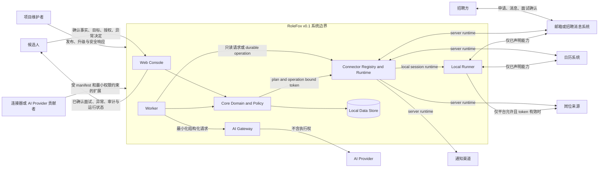
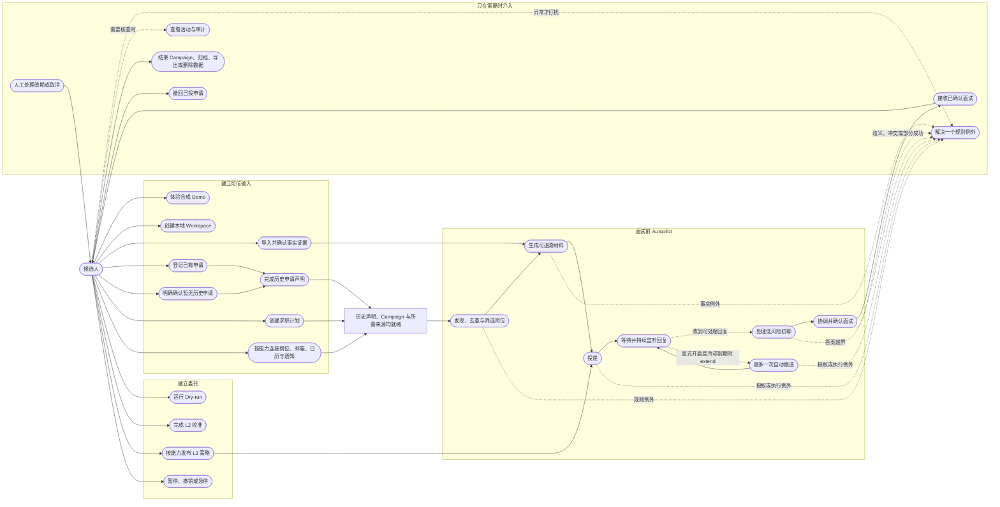
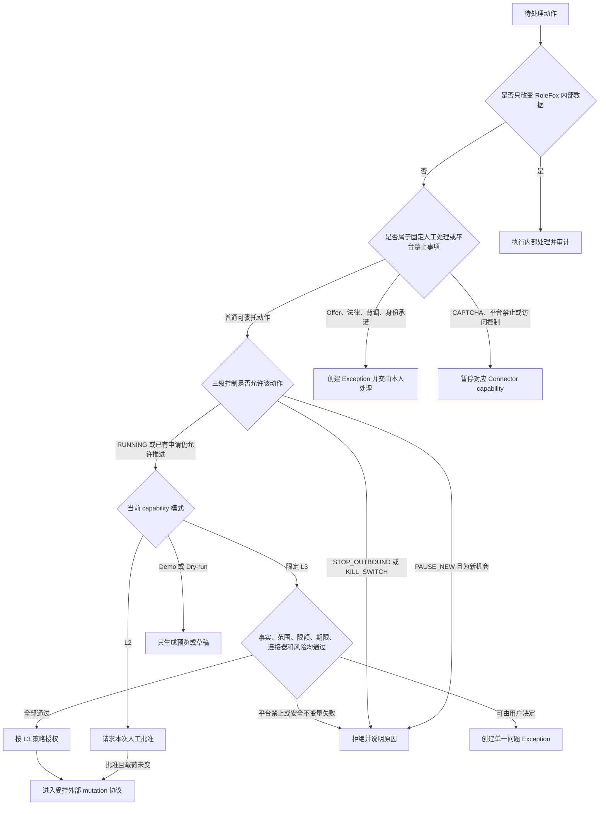
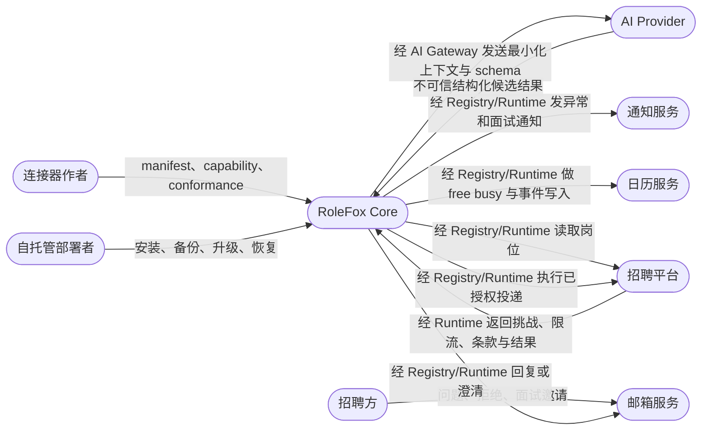
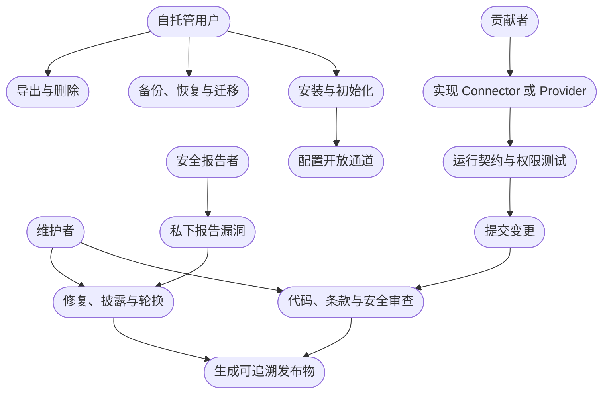

# RoleFox v0.1 系统上下文与用例

- 状态：Review Draft
- 上级索引：[UML 设计基线](README.md)
- 主要追踪：`USR-*`、`ONB-*`、`POL-*`、`EXIT-*`、`GOLD-01`—`GOLD-20`

## RF-UML-CTX-SYS-01 系统上下文

边界结论：

- 招聘方不是 RoleFox 用户，而是通过外部平台与候选人的 Application 交互。
- 外部平台、邮件、附件、JD、模型输出和第三方插件全部是不可信输入。
- AI Provider 只能生成结构化候选结果，不能持有授权或直接调用外部 mutation。
- Local Runner 不是另一个决策中心，只能执行 Core 已签发且仍有效的具体动作。

## RF-UML-UC-CAND-01 候选人主用例

## RF-UML-UC-AUTH-01 权限与人工决定边界

“进入受控外部 mutation 协议”只表示可以创建授权和 durable operation；它不代表外部动作已经成功。外部成功必须由连接器返回或对账证据确认。

纯内部普通 CRUD 不创建 ActionPlan；一旦动作代表用户作出承诺、消耗额度、改变授权或触发任何外部副作用，就必须进入 Policy 与 mutation 协议，不能借“内部步骤”绕过 Dry-run、暂停或审计。

## RF-UML-UC-EXT-01 外部参与者与能力边界

外部参与者不能完成以下越权：

- Platform 或 Recruiter 不能通过页面、JD 或消息改变 AutomationPolicy；
- Connector 不能自行创建可信 `ActionPlan`、风险等级或授权；
- AI Provider 不能选择工具、账号、收件人或执行路径；
- Operator 的备份恢复不能自动恢复凭证、执行令牌或 L3 授权。

## RF-UML-UC-OSS-01 开源参与和发布用例

## 用例规约

| ID | 主参与者 | 前置条件 | 成功后置条件 | 主要失败或升级 |
| --- | --- | --- | --- | --- |
| UC-001 | 候选人 | 未提供真实数据 | 合成流程可浏览，外部调用为 0 | Demo 资源不可用时仍不请求真实凭证 |
| UC-002 | 候选人 | 应用可启动 | Workspace 保存 locale、时区、币种与隐私选择 | 中断后从最近一步恢复 |
| UC-003 | 候选人 | 有简历或手工事实 | 关键 Evidence 被确认并标记外用范围 | 解析失败、冲突和缺失均阻断依赖材料 |
| UC-004 | 候选人 | 可能已有历史申请 | 历史申请与岗位、消息建立关联，或用户明确确认暂无历史申请 | 不确定时不得创建第二次投递 |
| UC-005 | 候选人 | Workspace 可用 | 唯一 active Campaign 拥有可执行硬条件和偏好 | 模糊条件要求消歧 |
| UC-006 | 候选人 | 已阅读权限说明 | 所需连接器按 capability 独立授权、验证并展示健康状态 | 非必要连接器可跳过；失败只降级对应能力 |
| UC-007 | 候选人 | 事实和 Campaign 完整 | Dry-run 生成判断、材料和动作预览 | 不产生真实外部副作用 |
| UC-008 | 候选人 | Dry-run 完成 | L2 决定和修改被记录为校准证据 | 单次选择不自动升级长期策略 |
| UC-009 | 候选人 | 满足 L3 就绪门槛 | 发布按能力、范围、期限和限额绑定的策略版本 | 任一缺项保持 L2 |
| UC-010 | 候选人 | 自动化正在或即将运行 | 对应范围停止，新动作不再执行 | 在途未知动作进入对账而非假回滚 |
| UC-011 | Worker | Campaign active 且来源健康 | 岗位被标准化、保留来源并去重 | 失效、恶意或硬条件失败时关闭该机会 |
| UC-012 | Worker | 岗位通过阈值且 Evidence 可用 | 生成有版本、有 Diff、有 evidence 链接的 MaterialSet | 未验证、冲突或无证据声明失败关闭 |
| UC-013 | Worker/Runner | ActionPlan 与授权有效 | 外部系统中至多产生一次可确认申请；人工交接只有在用户登记或只读外部证据确认后才标记 SUBMITTED；跟进仅在显式开启且满足冷却条件时独立触发 | 未知结果进入 reconcile；明确失败生成新计划；仅生成深链、预填或导出不能冒充已投递 |
| UC-014 | Worker | 消息能唯一关联 Application | 仅回答已预授权且有证据的完整低风险问题 | 混合敏感问题、身份异常或低置信度整条升级 |
| UC-015 | Worker | 唯一时段、明确时区、日历空闲且有预授权 | 招聘确认和日历事件均成功，Interview 进入 SCHEDULED；Application 只记录已到达面试里程碑 | 歧义、冲突、部分成功或未知结果保持未确认 |
| UC-016 | 候选人 | 存在 OPEN Exception | 一次回答解决一个例外并精确恢复受影响流程 | 逾期、跳过或暂停均保留原因和审计 |
| UC-017 | 候选人 | Workspace 存在活动 | 能追溯动作、授权、证据、版本、外部结果和纠正 | 审计不可用时外部 mutation 失败关闭 |
| UC-018 | 候选人 | Interview 已 SCHEDULED | 收到含时间、时区、方式、材料和上下文的通知 | 通知失败不改变面试事实，产品内状态仍可见 |
| UC-019 | 候选人 | 已排面试发生变化 | 独立 Interview 更新并立即通知，默认人工处理 | Application 不倒退，未经新授权不自动接受新时间 |
| UC-020 | 候选人 | 请求结束、导出或删除 | 内部数据按选择归档/导出/删除并撤销授权 | 外部已提交事实不被伪装删除或撤回 |
| UC-021 | 候选人 | Application 已有可验证投递事实 | 新建独立撤回 ActionPlan；仅在外部成功或用户证据确认后以 withdrawn 原因关闭 | 不支持撤回时人工交接；未知结果先对账且不得重复发送 |

## 本视图的不变量

1. 候选人是唯一可以确认个人事实、长期委托规则和不可委托决定的主体。
2. 招聘方的任何输入都不能取得 RoleFox 内部 actor 权限。
3. “自动完成”指在授权边界内推进，不代表无限制执行或平台规则豁免。
4. 用户不在线不等于 Worker 在线；持续运行状态必须基于真实心跳。
5. 开源贡献者提供能力，Core 仍负责 manifest 校验、最小权限、授权与审计。
