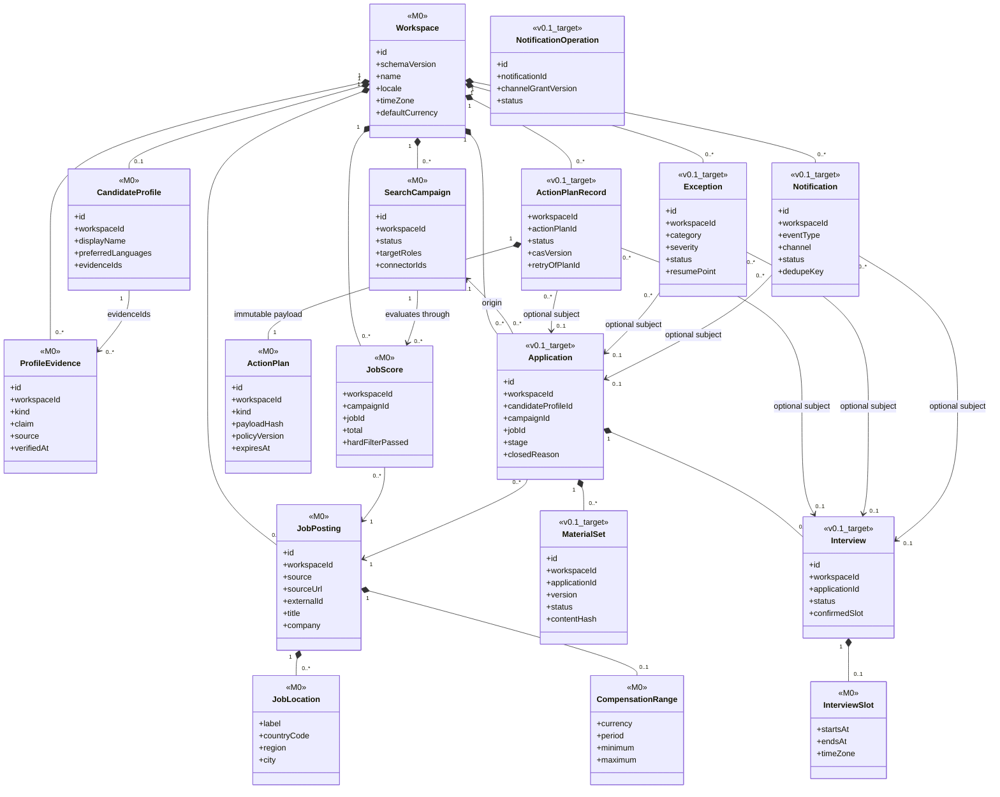
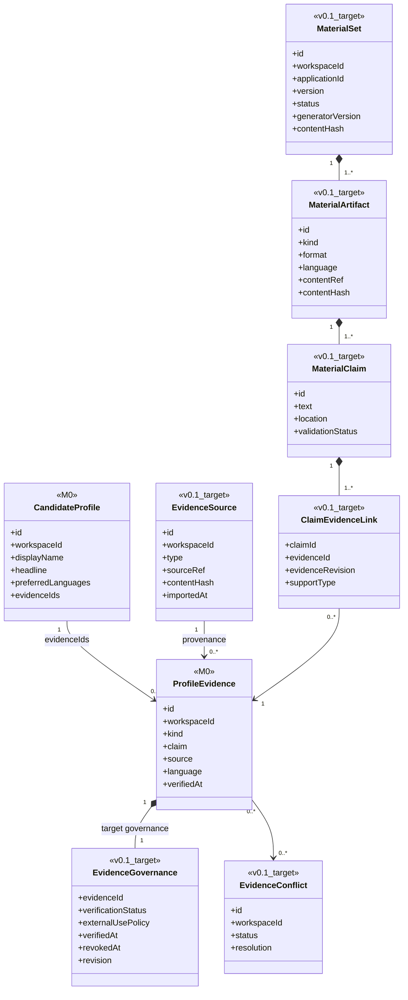
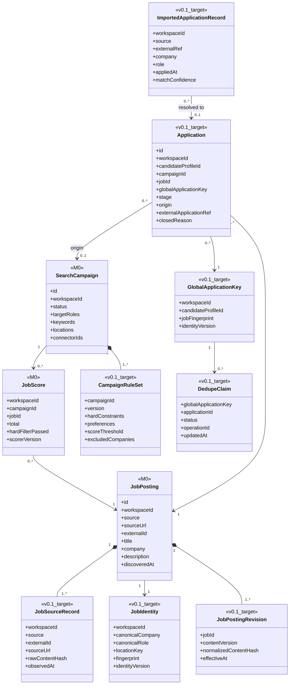
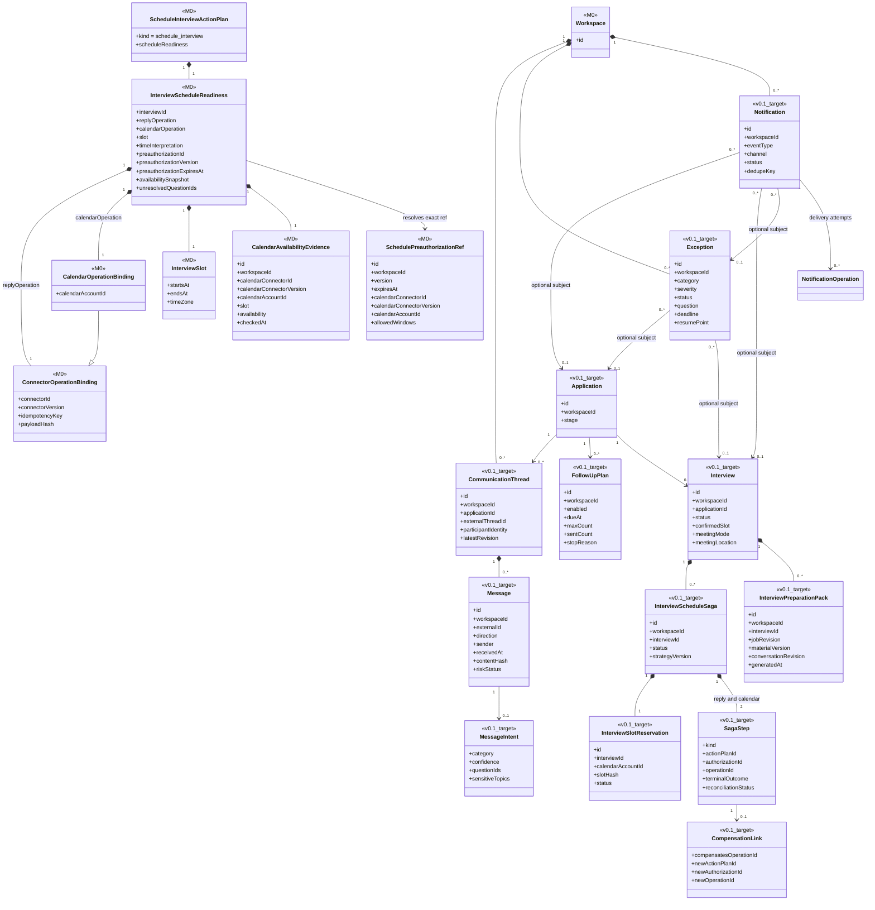

# RoleFox v0.1 领域模型

- 状态：Review Draft
- 上级索引：[UML 设计基线](README.md)
- 标注规则：`<<M0>>` 表示当前 TypeScript 中已经存在的类型或接口；`<<v0.1_target>>` 表示为 P0 Case 设计、尚未实现的目标对象。图只列与本视图相关的字段，不能据此推断 M0 类型还有图外能力。
- 决策规则：尚未确认的产品选择统一写作 `<<proposed DEC-xx>>`；它们不是已接受需求，也不能作为实现默认值。

## RF-UML-CD-DOM-01 聚合、所有权与本地化值对象

聚合边界规则：

1. `Workspace` 是租户与持久化所有权根。JobPosting、Application、ActionPlanRecord、Exception、Notification 等对象必须显式携带并校验 `workspaceId`，不能只靠查询过滤或可选 UI 上下文隔离。
2. SearchCampaign 不拥有 JobPosting；它通过 JobScore 评价岗位，通过 Application 记录一次推进。暂停或删除 Campaign 不能删除岗位事实、历史投递或操作账本。
3. ActionPlanRecord、Exception、Notification 可以没有 Application/Interview 主体，也可以可选关联其中之一；其生存期与删除策略由 Workspace 决定，不能被某个业务主体级联误删。
4. 一个 Application 可以经历多轮 Interview；这里不假设 `0..1` 面试或单一消息线程。
5. `locale`、IANA `timeZone`、ISO currency 与带时区的 `InterviewSlot` 是跨界值，持久化、计划哈希和连接器载荷都必须保持原始语义，不能依赖进程默认区域或时区。

## RF-UML-CD-EVD-01 事实、声明与材料证据链

证据门规则：

1. M0 的 ProfileEvidence 只有 `verifiedAt`，尚没有外用范围、冲突、撤销或版本状态；这些不能被描述成当前已实现能力。
2. v0.1 目标中，每个对外事实声明至少绑定一个当前版本、允许外用且验证通过的 Evidence。`LOCAL_ONLY`、`UNVERIFIED`、`CONFLICTED`、`REVOKED` 或已删除证据不能进入外发材料。
3. Evidence 内容、治理状态或外用范围变化后，依赖的 MaterialSet 与所有未终态 ActionPlanRecord 必须确定性标记 stale；旧计划即使仍持有旧授权也不能执行。
4. AI 输出只产生待校验的 MaterialClaim；Schema、Evidence 和风险验证通过后，MaterialSet 才能进入 READY。

## RF-UML-CD-JOB-01 Campaign、岗位、全局去重与申请

唯一性与历史接管：

1. 同一来源先以 `(workspaceId, source, externalId)` 防重放；跨来源再通过 canonical identity 归并。
2. 成功申请的唯一性边界是 `workspace + candidate + canonical job identity`，**不包含 Campaign**。更换、暂停或顺序运行 Campaign 不能绕过全局重复检查。
3. `<<proposed DEC-09>>`：canonical company/role/location 的规范化、指纹版本、人工合并/拆分和误判恢复规则仍待用户确认；在确认前不能把示例 fingerprint 当作产品定案。
4. 已确认成功、导入后高置信匹配、QUEUED/EXECUTING 或 `OUTCOME_UNKNOWN` 的申请均占用 DedupeClaim；未知结果必须先对账，不能用新 Campaign 或新 idempotency key 重投。
5. 历史关联置信度不足时创建消歧 Exception，不允许因缺少精确 externalId 就再次投递。
6. 岗位原文或关键字段实质变化时创建 JobPostingRevision；评分、材料、去重判定与未终态计划都绑定版本并按规则失效。

## RF-UML-CD-AUTH-01 三层策略、计划、授权与持久操作

```mermaid
%% @anchor AUTH_BINDINGS
%% @anchor QUOTA_RESERVATION
%% @anchor OPERATION_RELATION
%% @anchor OPERATION_KIND_REGISTRY
classDiagram
    class Workspace {
        <<M0>>
        +id
    }
    class AutomationPolicy {
        <<M0>>
        +workspaceId
        +policyVersion
        +level
        +dryRun
        +killSwitch
        +requireApproval
        +autoApply
        +autoReply
        +autoScheduleInterviews
        +maxApplicationsPerDay
        +maxRepliesPerHour
        +maxInterviewSchedulesPerDay
        +maxAvailabilityAgeMinutes
        +allowedConnectorIds
        +allowedCalendarConnectorIds
        +schedulePreauthorizations
    }
    class SystemSafetyPolicy {
        <<v0.1_target>>
        +version
        +nonDelegableTopics
        +platformAndCaptchaRules
        +systemHardLimits
        +effectiveAt
    }
    class AutomationPolicyRevision {
        <<v0.1_target>>
        +workspaceId
        +version
        +level
        +dryRun
        +validFrom
        +validUntil
    }
    class OperationalControl {
        <<v0.1_target>>
        +workspaceId
        +version
        +mode
        +changedAt
        +reason
    }
    class RevocationOnlyControlPlane {
        <<v0.1_target>>
        +workspaceId
        +deletionRequestId
        +mode = REVOCATION_ONLY
        +businessMutationGate = CLOSED
        +fencingEpoch
        +expiresAt
    }
    class RevocationTargetBinding {
        <<v0.1_target>>
        +id
        +workspaceId
        +deletionRequestId
        +connectorId
        +connectorVersion
        +accountId
        +credentialLineage
        +targetHash
    }
    class CapabilityGrant {
        <<v0.1_target>>
        +capability
        +enabled
        +connectorAllowlist
        +companyScope
        +roleScope
        +validFrom
        +validUntil
    }
    class UsageLimit {
        <<v0.1_target>>
        +metric
        +window
        +configuredLimit
    }
    class AnswerPreauthorization {
        <<v0.1_target>>
        +id
        +version
        +questionCategory
        +evidenceIds
        +allowedRange
        +expiresAt
    }
    class SchedulePreauthorizationRef {
        <<M0>>
        +id
        +workspaceId
        +version
        +expiresAt
        +calendarConnectorId
        +calendarConnectorVersion
        +calendarAccountId
        +allowedWindows
    }
    class ActionDraft {
        <<M0>>
        +target
        +riskHints
        +payloadPreview
    }
    class ActionPlanBase {
        <<M0>>
        +id
        +workspaceId
        +idempotencyKey
        +connectorId
        +connectorVersion
        +target
        +risk
        +sensitiveTopics
        +payloadHash
        +evidenceIds
        +policyVersion
        +createdAt
        +expiresAt
    }
    class StandardActionPlan {
        <<M0>>
        +kind
    }
    class ScheduleInterviewActionPlan {
        <<M0>>
        +kind = schedule_interview
        +scheduleReadiness
    }
    class CredentialRevocationActionPlan {
        <<v0.1_target>>
        +kind = credential_revocation
        +deletionRequestId
        +revocationTargetBindingId
        +targetHash
    }
    class ActionPlanRecord {
        <<v0.1_target>>
        +workspaceId
        +actionPlanId
        +status
        +casVersion
        +retryOfPlanId
        +createdAt
        +updatedAt
    }
    class PolicyEvaluationRecord {
        <<v0.1_target>>
        +id
        +actionPlanId
        +systemPolicyVersion
        +delegationVersion
        +controlVersion
        +revocationControlPlaneId
        +outcome
        +reasonCode
        +evaluatedAt
    }
    class ActionAuthorization {
        <<M0>>
        +actionPlanId
        +workspaceId
        +source
        +policyVersion
        +payloadHash
        +authorizedAt
        +expiresAt
    }
    class ActionAuthorizationRecord {
        <<v0.1_target>>
        +id
        +workspaceId
        +actionPlanId
        +policyEvaluationId
        +revocationControlPlaneId
        +revocationStatus
        +createdAt
    }
    class ExternalOperation {
        <<v0.1_target>>
        +id
        +workspaceId
        +actionPlanId
        +authorizationId
        +operationKind
        +idempotencyKey
        +payloadHash
        +status
        +externalRef
        +attempt
        +fencingToken
        +compensatesOperationId
    }
    class OperationKind {
        <<v0.1_target>>
        +submit_application
        +withdraw_application
        +send_reply
        +send_follow_up
        +send_interview_confirmation
        +create_calendar_event
        +update_calendar_event
        +cancel_calendar_event
        +send_notification_primary
        +send_notification_fallback
        +credential_revocation
    }
    class ApplicationOperation {
        <<v0.1_target>>
        +applicationId
        +purpose
    }
    class ReplyOperation {
        <<v0.1_target>>
        +threadId
        +messageRevision
    }
    class CalendarOperation {
        <<v0.1_target>>
        +interviewId
        +calendarAccountId
        +slotHash
        +purpose
    }
    class NotificationOperation {
        <<v0.1_target>>
        +notificationId
        +channelGrantVersion
    }
    class CredentialRevocationOperation {
        <<v0.1_target>>
        +deletionRequestId
        +revocationTargetBindingId
        +targetHash
    }
    class UsageReservation {
        <<v0.1_target>>
        +id
        +workspaceId
        +operationId
        +metric
        +windowKey
        +amount
        +status
    }
    class InterviewSlotReservation {
        <<v0.1_target>>
        +id
        +workspaceId
        +actionPlanId
        +interviewId
        +calendarAccountId
        +slotHash
        +status
    }
    class AuditIntent {
        <<v0.1_target>>
        +id
        +workspaceId
        +correlationId
        +eventType
        +payloadHash
        +createdAt
    }
    class OutboxEvent {
        <<v0.1_target>>
        +id
        +workspaceId
        +actionPlanId
        +operationId
        +sagaId
        +eventType
        +status
        +availableAt
    }

    Workspace "1" --> "1" AutomationPolicy : current value
    AutomationPolicy ..> AutomationPolicyRevision : target split
    Workspace "1" *-- "1..*" AutomationPolicyRevision
    Workspace "1" *-- "1" OperationalControl
    Workspace "1" *-- "0..1" RevocationOnlyControlPlane
    RevocationOnlyControlPlane "1" *-- "1..*" RevocationTargetBinding
    AutomationPolicyRevision "1" *-- "0..*" CapabilityGrant
    AutomationPolicyRevision "1" *-- "0..*" UsageLimit
    AutomationPolicyRevision "1" *-- "0..*" AnswerPreauthorization
    AutomationPolicyRevision "1" *-- "0..*" SchedulePreauthorizationRef
    ActionDraft --> ActionPlanBase : Core rebuilds
    ActionPlanBase <|-- StandardActionPlan
    ActionPlanBase <|-- ScheduleInterviewActionPlan
    ActionPlanBase <|-- CredentialRevocationActionPlan
    CredentialRevocationActionPlan "0..*" --> "1" RevocationTargetBinding : exact fixed target
    ActionPlanRecord "1" *-- "1" ActionPlanBase : immutable payload
    ActionPlanRecord "1" --> "0..*" PolicyEvaluationRecord
    SystemSafetyPolicy "1" --> "0..*" PolicyEvaluationRecord
    AutomationPolicyRevision "0..1" --> "0..*" PolicyEvaluationRecord
    OperationalControl "1" --> "0..*" PolicyEvaluationRecord
    RevocationOnlyControlPlane "0..1" --> "0..*" PolicyEvaluationRecord : deletion safety evaluation
    ActionPlanRecord "1" --> "0..*" ActionAuthorizationRecord
    ActionAuthorizationRecord "1" *-- "1" ActionAuthorization : immutable value
    ActionAuthorizationRecord "0..*" --> "1" PolicyEvaluationRecord : based on
    ActionPlanRecord "1" *-- "0..*" ExternalOperation
    ExternalOperation "0..*" --> "1" ActionAuthorizationRecord : authorized by
    ExternalOperation "0..*" --> "1" OperationKind : closed operationKind
    ExternalOperation <|-- ApplicationOperation
    ExternalOperation <|-- ReplyOperation
    ExternalOperation <|-- CalendarOperation
    ExternalOperation <|-- NotificationOperation
    ExternalOperation <|-- CredentialRevocationOperation
    CredentialRevocationOperation "0..*" --> "1" RevocationTargetBinding : exact fixed target
    CredentialRevocationOperation "0..*" --> "1" RevocationOnlyControlPlane : safety authority
    ExternalOperation "1" *-- "0..*" UsageReservation
    ActionPlanRecord "1" *-- "0..1" InterviewSlotReservation
    ActionPlanRecord "1" *-- "0..*" OutboxEvent
    ExternalOperation "1" --> "0..*" OutboxEvent : optional operation subject
    ActionPlanRecord "1" *-- "0..*" AuditIntent
    ExternalOperation "1" --> "0..*" AuditIntent
```

关键约束：

1. M0 AutomationPolicy 把委托与 `killSwitch` 混在一个结构中；v0.1 目标必须拆成不可被用户放宽的 SystemSafetyPolicy、版本化用户委托 AutomationPolicyRevision、立即生效的 OperationalControl。最终允许集是 `安全边界 ∩ 用户委托 ∩ 运行控制`。
2. `<<proposed DEC-03>>`：系统硬上限的指标与数值仍待确认。未确认前可以失败关闭，但不能把示例额度写成不可变产品规则。
3. ActionDraft 只是外部扩展提供的候选数据；Core 必须重建 workspace、kind、风险、证据、连接器绑定、幂等键和 payloadHash 后才形成不可变 ActionPlan。
4. 生命周期状态只存在于 ActionPlanRecord；不可为了重试、审批或执行更新而改写 ActionPlan 载荷。DRAFT/AWAITING_APPROVAL 计划可以有 **0** 个 ExternalOperation，因此基数是 `0..*`。
5. 一个计划可经多次策略评估和授权续签；每个 ExternalOperation 必须绑定一个仍有效的 ActionAuthorization。授权同时校验 plan、workspace、policy revision、payloadHash、动作、connector/account 和 expiry。
6. 一个 ExternalOperation 可以占用 `0..*` 个 UsageReservation；某些通知可能不占额度。一个 ScheduleInterviewActionPlan 可在同一授权下创建 CalendarOperation 与 ReplyOperation 两个子操作，并以 `0..1` 个有效 InterviewSlotReservation 和多项额度预留共同保护同一时段。额度按 Workspace 原子占用，Campaign 不能各自突破全局上限。
7. mutation 的授权、ExternalOperation、初始 UsageReservation/InterviewSlotReservation、AuditIntent 和至少一个 OutboxEvent 必须在同一事务创建；普通动作的 outbox 可指向 operation，约面事务一次创建两个 QUEUED 子操作和一个指向 Saga 的启动作业。DRAFT/AWAITING_APPROVAL 计划尚无 operation/outbox，因此两者在 ActionPlanRecord 下均为 `0..*`。任何一项失败都不得入队或外发。完整执行协议见 RF-UML-REL-MUT-01。
8. 每个 ExternalOperation 必须且只能取一个受 schema/version 管理的 OperationKind；未知 kind 在入库、反序列化、队列消费和执行时一律 quarantine/拒绝，不能回退到通用 execute。`submit_application`、撤回、普通/跟进/面试确认回复、日历创建/更新/取消、主/备用通知和凭证撤销均显式建模；内部材料生成不是 ExternalOperation。
9. Workspace 删除先关闭全部业务 mutation，再由不可被 AutomationPolicy/CapabilityGrant 获得的 RevocationOnlyControlPlane 为每个固定 connector/account/credential lineage 生成独立 CredentialRevocationActionPlan。一个计划只绑定一个不可变 RevocationTargetBinding，授权与操作再次绑定 targetHash；任何业务 operation kind、动态账号或默认账号都不允许进入该控制面。
10. `credential_revocation` 仍完整执行 `Plan → Policy/Safety Evaluation → Authorization → atomic Operation + AuditIntent + Outbox → Cleanup Executor`，并使用幂等键、三态结果和 unknown reconcile。它不是 STOP_OUTBOUND 的业务例外，而是删除流程中隔离、限时、可审计的安全清理权限；外部撤销无法确认时记录 residual authorization，但不能无限阻塞本地 PII 删除。
## RF-UML-CD-COM-01 消息、异常、面试与通知

通信与排期规则：

1. 每条 Message 在可回复前必须唯一关联 Workspace、Application、外部线程和参与者身份；身份或关联置信度不足时生成 Exception，不得自动回复。
2. FollowUpPlan 默认 disabled；v0.1 显式启用后最多自动成功跟进一次，等待窗口与停止条件必须进入版本化策略和持久计数，不能只靠调度器内存或普通重试次数限制。
3. 一条消息同时含普通与敏感问题时，整条回复升级人工处理；不能拆出“安全部分”造成已经完整回应的误解。
4. M0 已有的排期安全结构不是 Interview/Saga 的持久化实现。Readiness 必须精确绑定回复 connector、日历 connector/version/account、slot、可用性快照及 preauthorization id/version/expiry；有未解决问题、歧义时间或过期快照时失败关闭。
5. `<<proposed DEC-14>>`：是否聚合多个 busy calendar、并指定一个 write calendar 尚待确认。当前 M0 每个排期计划只精确绑定一个 calendar account，不能据此推断多日历产品语义。
6. ScheduleInterviewActionPlan 先作为不可变计划独立持久化，再接受当前三层策略评估。条件通过后，一个事务同时持久化 ActionAuthorization、InterviewSlotReservation、reply/calendar 两个 SagaStep 所指向的 QUEUED durable operation、额度预留、AuditIntent 与 Saga 启动 OutboxJob；两步共享计划与授权，但各自拥有 operation id、幂等键、载荷哈希、外部引用和终态。
7. InterviewScheduleSaga 的 reply 与 calendar 子操作分别保留终态和对账状态；补偿用 CompensationLink 指向**新的**计划、授权和操作，绝不原地改写成功子操作。
## RF-UML-CD-EXT-01 Connector 与 AI Provider 扩展契约

```mermaid
%% @anchor CONNECTOR_CONTRACT
%% @anchor PROVIDER_CONTRACT
classDiagram
    class ConnectorManifest {
        <<M0>>
        +id
        +name
        +version
        +sdkVersion
        +configSchemaVersion
        +runtime
        +capabilities
        +supportedLocales
        +authentication
        +permissions
        +usesLocalCredentials
        +termsUrl
    }
    class ConnectorBase {
        <<M0>>
        +manifest
    }
    class DiscoveryConnector {
        <<M0>>
        +discover(query)
    }
    class JobDetailConnector {
        <<M0>>
        +getDetail(externalId)
    }
    class ApplicationConnector {
        <<M0>>
        +planApplication(input)
        +executeApplication(plan, context)
    }
    class InboxConnector {
        <<M0>>
        +readInbox(query)
    }
    class ReplyConnector {
        <<M0>>
        +planReply(input)
        +executeReply(plan, context)
        +executeInterviewConfirmation(plan, context)
    }
    class CalendarConnector {
        <<M0>>
        +checkAvailability(query)
        +createInterviewEvent(plan, context)
    }
    class NotificationConnector {
        <<M0>>
        +planNotification(input)
        +executeNotification(plan, context)
    }
    class CapabilityAssertions {
        <<M0>>
        +assertCapability(connector, capability)
    }
    class ConnectorRegistry {
        <<v0.1_target>>
        +register()
        +verifyManifest()
        +verifyCapability()
        +disableCapability()
    }
    class ApplicationReconciliation {
        <<v0.1_target>>
        +reconcileApplication(operation)
    }
    class ApplicationWithdrawal {
        <<v0.1_target>>
        +planWithdrawal(input)
        +executeWithdrawal(plan, context)
        +reconcileWithdrawal(operation)
    }
    class ReplyReconciliation {
        <<v0.1_target>>
        +reconcileReply(operation)
    }
    class CalendarReconciliation {
        <<v0.1_target>>
        +reconcileEvent(operation)
    }
    class NotificationReconciliation {
        <<v0.1_target>>
        +reconcileNotification(operation)
    }
    class CalendarCompensation {
        <<v0.1_target>>
        +planUpdateEvent(input)
        +executeUpdateEvent(plan, context)
        +reconcileUpdateEvent(operation)
        +planCancelEvent(operation)
        +executeCancelEvent(plan, context)
        +reconcileCancelEvent(operation)
    }
    class CredentialRevocationSafetyPort {
        <<v0.1_target>>
        +revokeBoundCredential(plan, context)
        +reconcileRevocation(operation)
    }
    class AIProviderManifest {
        <<M0>>
        +id
        +name
        +version
        +capabilities
        +models
        +supportsCustomBaseUrl
    }
    class AIProvider {
        <<M0>>
        +manifest
        +probe()
        +generateStructured()
        +embed()
    }
    class AIProviderAssertions {
        <<M0>>
        +assertAIProviderCapability()
        +validateStructuredGenerationResult()
    }
    class ConformanceSuite {
        <<v0.1_target>>
        +manifestTests
        +permissionTests
        +idempotencyTests
        +reconcileTests
        +maliciousFixtureTests
    }

    ConnectorBase "1" *-- "1" ConnectorManifest
    ConnectorBase <|-- DiscoveryConnector
    ConnectorBase <|-- JobDetailConnector
    ConnectorBase <|-- ApplicationConnector
    ConnectorBase <|-- InboxConnector
    ConnectorBase <|-- ReplyConnector
    ConnectorBase <|-- CalendarConnector
    ConnectorBase <|-- NotificationConnector
    CapabilityAssertions --> ConnectorBase
    ConnectorRegistry --> ConnectorBase
    ConnectorBase <|-- ApplicationReconciliation
    ConnectorBase <|-- ApplicationWithdrawal
    ConnectorBase <|-- ReplyReconciliation
    ConnectorBase <|-- CalendarReconciliation
    ConnectorBase <|-- NotificationReconciliation
    ConnectorBase <|-- CalendarCompensation
    ConnectorBase <|-- CredentialRevocationSafetyPort
    AIProvider "1" *-- "1" AIProviderManifest
    AIProviderAssertions --> AIProvider
    ConformanceSuite --> ConnectorRegistry
    ConformanceSuite --> AIProvider
```

扩展边界规则：

1. M0 的 capability 接口都继承 ConnectorBase，ConnectorBase **组合**一个 manifest；manifest 是实例声明，不是接口父类，也不是授权。具体 adapter 可以实现多个 capability 接口。
2. M0 的实际方法包括 `JobDetailConnector.getDetail` 与 `ReplyConnector.executeInterviewConfirmation`。当前 Application、Reply、Calendar、Notification 接口均没有 withdraw、reconcile、update 或 compensate 方法；图中的 ApplicationWithdrawal、四类 Reconciliation 与 CalendarCompensation 明确是 v0.1 目标扩展。
3. M0 AIProvider 组合 manifest；`generateStructured` 和 `embed` 是可选方法，调用前必须通过 capability assertion，结果仍须 runtime schema 验证。
4. Connector/AI 输出都不是权威领域对象。它们只能返回 ExternalJobPosting、ActionDraft、InboxMessage 或未知 AI data，由 Core 校验并生成计划；扩展不能创建 Policy、Authorization、ExternalOperation 或直接迁移业务状态。
5. 所有 mutation adapter（包括 Notification）只接受不可变 Plan 与绑定 operation 的短期执行上下文；执行结果必须进入统一三态结果与 reconcile 协议。
6. `<<proposed DEC-12>>`：自动日历补偿是否作为 v0.1 必选 capability、哪些 connector 可声明支持，仍待确认。不支持安全补偿的 connector 不得自动进入需要补偿的约面策略。
7. 已提交申请的撤回、已排面试的改期/取消和日历补偿都是新的 ActionPlan、Authorization 与 ExternalOperation；目标扩展不能复用、删除或改写原 submit/create operation。
8. CredentialRevocationSafetyPort 只暴露给独立 Cleanup Executor，不进入业务 capability allowlist；调用必须携带冻结的 target binding 和 `credential_revocation` operation token。远端不支持撤销时记录明确 unsupported/residual 结果，不能把安全端口伪装成普通 Connector capability。

## 当前 M0 与目标模型差距

| 目标对象或能力 | M0 事实 | v0.1 目标 |
| --- | --- | --- |
| Workspace/Profile/Evidence/Campaign/Job/Score | 有基础 TypeScript 类型 | Evidence 治理、来源冲突、规则版本、岗位版本与 Workspace 持久化约束 |
| Application | 只有阶段枚举和迁移函数 | 实体、Workspace 级全局唯一性、历史导入、关闭原因和持久化 |
| MaterialSet | 未实现 | artifact、claim-evidence 链、版本与 stale 传播 |
| Policy | 一个 AutomationPolicy 同时含委托和 kill switch | SystemSafetyPolicy、AutomationPolicyRevision、OperationalControl 三层交集；删除期另有不可委托的 REVOCATION_ONLY 安全控制面 |
| ActionPlan/Authorization | 有不可变值类型；未持久执行 | ActionPlanRecord、多次评估/授权、绑定操作与事务 outbox |
| ExternalOperation/Audit/Outbox | 未实现 | 封闭 OperationKind、durable intent、额度预留、审计 intent、lease/fencing、unknown、reconcile、compensation 与独立 cleanup 执行 |
| Message/Thread/FollowUp/Exception | 未实现 | 去重、顺序、身份关联、意图、停止条件、恢复点 |
| Interview/Saga/Notification | 只有排期值对象和连接器方法 | 独立实体、两个子操作、改期/取消、通知投递与准备包 |
| Connector/AI Provider | 有 manifest、接口和 capability assertion | registry、最小权限运行、reconcile/补偿扩展与 conformance suite |
| Backup/Restore/Delete | 未实现 | 一致快照、秘密排除、恢复门禁、只读重绑、重新授权与删除期凭证撤销/残留报告 |
