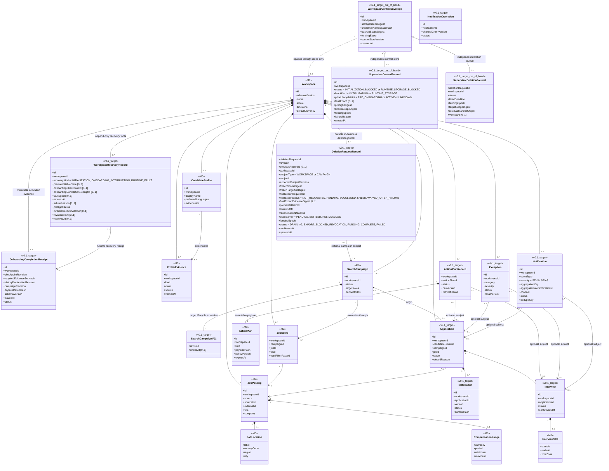
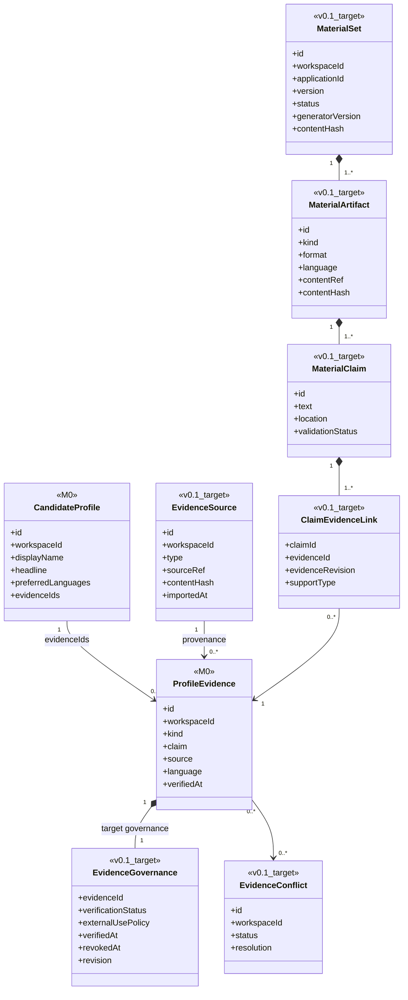
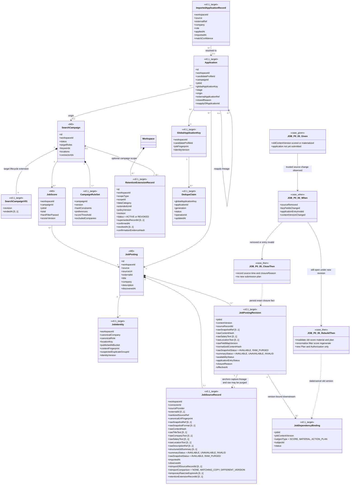

# RoleFox v0.1 领域模型

- 状态：Accepted Design Baseline
- 上级索引：[UML 设计基线](README.md)
- 标注规则：`<<M0>>` 表示当前 TypeScript 中已经存在的类型或接口；`<<M0_utility_functions>>` 表示为便于类图表达而归组展示的现有顶层函数，不表示源码存在同名类型；`<<v0.1_target>>` 表示为 P0 Case 设计、尚未实现的目标对象。图只列与本视图相关的字段，不能据此推断 M0 类型还有图外能力。
- 决策规则：v0.1 当前产品选择由 [ADR-0002](../../adr/0002-v0.1-product-decision-baseline.md)、[ADR-0003](../../adr/0003-shadow-safety-control-exceptions.md) 与 [ADR-0004](../../adr/0004-jd-raw-retention-and-preparation-pack.md) 共同约束，决策治理遵守 [ADR-0005](../../adr/0005-sole-maintainer-governance.md)；本图中的约束是目标设计，不代表 M0 已实现。

## RF-UML-CD-DOM-01 聚合、所有权与本地化值对象



聚合边界规则：

1. `Workspace` 是租户与持久化所有权根。JobPosting、Application、ActionPlanRecord、Exception、Notification 等对象必须显式携带并校验 `workspaceId`，不能只靠查询过滤或可选 UI 上下文隔离。
2. SearchCampaign 不拥有 JobPosting；它通过 JobScore 评价岗位，通过 Application 记录一次推进。对其应用 `PAUSE_NEW/STOP_OUTBOUND` 控制覆盖层或删除 Campaign，都不能删除岗位事实、历史投递或操作账本；控制覆盖层不创造 Campaign `PAUSED` 状态。
3. ActionPlanRecord、Exception、Notification 可以没有 Application/Interview 主体，也可以可选关联其中之一；其生存期与删除策略由 Workspace 决定，不能被某个业务主体级联误删。
4. 一个 Application 可以经历多轮 Interview；这里不假设 `0..1` 面试或单一消息线程。
5. `locale`、IANA `timeZone`、ISO currency 与带时区的 `InterviewSlot` 是跨界值，持久化、计划哈希和连接器载荷都必须保持原始语义，不能依赖进程默认区域或时区。
6. 只有业务 schema/key/ledger 已成功初始化且可安全写时，初始化阶段变化、onboarding 中断或运行期进入 `SAFE_READ_ONLY` 才追加 `WorkspaceRecoveryRecord`；首写前 bootstrap 失败或既有 DB future-schema/corrupt/wrong-key 时只能追加业务 DB 外的 `SupervisorControlRecord`，绝不能为满足本规则而创建/写业务 DB。业务记录按 `recoveryKind` 失败关闭：`INITIALIZATION` 必须有初始 checkpoint，且 `previousStableState`、completion receipt、fault epoch、runtime recovery barrier 为空；`ONBOARDING_INTERRUPTION` 必须有最后已提交 checkpoint 和中断原因，且 completion receipt 与 runtime recovery barrier 为空；`RUNTIME_FAULT` 必须有 `previousStableState=ACTIVE`、当时有效或明确失效的 `onboardingCompletionReceiptId` 引用、单调递增 `faultEpoch`、故障原因与 `runtimeRecoveryBarrier=OPEN`，checkpoint 仅作为可选回退依据。`revalidatedAt` 在只读 schema/key/ledger preflight 及该 kind 所需的回执复核全部通过前必须为空；出现非适用字段、缺少必填字段或跨 kind 组合时记录无效，不得离开阻断/只读态。运行期若 business DB 已不可安全写，Supervisor 以 `RUNTIME_STORAGE_BLOCKED` 和新 `faultEpoch` 代替写入 `SAFE_READ_ONLY`；修复后第一笔允许的业务事务必须把该 OOB fault 导入为 `RUNTIME_FAULT/OPEN` barrier，再做 RuntimeHealth、全部非终态 operation、completion receipt 与人工控制复核。只有这些条件和必要的重建输入一起通过，激活事务才能签发新 receipt、把 barrier 置为 SATISFIED、写 `resolvedAt` 并进入 `ACTIVE`。`OnboardingCompletionReceipt` 只能在关键事实、历史申请声明、唯一 Campaign、Dry-run 与最终 checkpoint 同一激活事务校验通过后签发；旧回执保持不可变历史但失效后不能由恢复路径补写或复活。
7. `WorkspaceControlEnvelope`、`SupervisorControlRecord` 与 `SupervisorDeletionJournal` 存在于业务 SQLite 之外的最小本地 Supervisor 控制域。它们只保存随机/opaque workspace identity、内容寻址 scope、fencing、非权威 prior-lifecycle hint、故障 epoch 和去敏阻断/删除结果，不保存 PII、正文、secret、可复用凭证或业务对象外键。`INITIALIZATION_BLOCKED` 只用于能够证明从未完成 onboarding 的目标；已知曾为 ACTIVE 或因 DB 不可读而无法证明生命周期的目标必须使用 `RUNTIME_STORAGE_BLOCKED`，绝不能把“未知”降格为首次初始化。即使业务 DB 尚未创建、future-schema、corrupt 或 wrong-key，Supervisor 仍能在不解析/迁移/写业务 DB 的前提下阻断启动并按 envelope 精确删除该 workspace 的文件、Vault namespace、临时物与受管备份；无法证明的外部授权只进入 journal residual，不猜测调用。修复后 prior-lifecycle hint 不能直接授权状态跳转，仍以重新可读的业务事实和导入后的 OPEN runtime barrier 决定恢复路径。该域不得成为读取正常业务数据或绕过业务授权的旁路。
8. 正常业务 DB 可安全写时，Workspace/Campaign 删除使用 `DeletionRequestRecord`，不复用 OOB `SupervisorDeletionJournal`。用户确认后的第一笔事务必须创建不可复用 deletionRequestId 的 genesis revision，冻结 subject revision/scope、导出选择、drain/reconciliation deadline、在途 operation/撤权目标 digest 与 fencing epoch，同时进入 `DELETING` 并关闭目标 mutation；之后每一步以 expected current-head revision 做 CAS、只追加引用 `previousRecordId` 的新 revision，同一 request 恰有一个未被后继引用的 current head，崩溃后只能从该 head 恢复。若 `finalExportRequested=true`，导出失败必须进入 `EXPORT_BLOCKED`；只有成功 evidence 或用户看到失败后另行确认产生的 `WAIVED_AFTER_FAILURE` revision 才可进入撤权/清除。创建 durable 删除身份不等于在导出前清除 PII 或撤权。业务 DB 不可读时才使用 OOB journal 的 opaque purge 路径。

## RF-UML-CD-EVD-01 事实、声明与材料证据链



证据门规则：

1. M0 的 ProfileEvidence 只有 `verifiedAt`，尚没有外用范围、冲突、撤销或版本状态；这些不能被描述成当前已实现能力。
2. v0.1 目标中，每个对外事实声明至少绑定一个当前版本、允许外用且验证通过的 Evidence。`LOCAL_ONLY`、`UNVERIFIED`、`CONFLICTED`、`REVOKED` 或已删除证据不能进入外发材料。
3. Evidence 内容、治理状态或外用范围变化后，依赖的 MaterialSet 与所有未终态 ActionPlanRecord 必须确定性标记 stale；旧计划即使仍持有旧授权也不能执行。
4. AI 输出只产生待校验的 MaterialClaim；Schema、Evidence 和风险验证通过后，MaterialSet 才能进入 READY。

## RF-UML-CD-JOB-01 Campaign、岗位、全局去重与申请



唯一性与历史接管：

1. 精确去重先使用 `(workspaceId, connectorId, externalId)`；externalId 不稳定或缺失时使用规范 URL 指纹。只有精确键命中才可自动关联同一岗位。
2. 跨来源以规范公司、岗位、地点、发布时间和内容指纹建立 `suspectedDuplicateGroupId`，歧义一律进入人工消歧，绝不自动合并。
3. 每个 Workspace 对同一已确认机会最多一个活跃 Application，唯一性边界**不包含 Campaign**。更换 Campaign、应用暂停控制、历史只读监听或顺序运行 Campaign 都不能绕过全局重复检查。
4. 已确认成功、导入后高置信匹配、QUEUED/EXECUTING 或 `OUTCOME_UNKNOWN` 的申请均占用 DedupeClaim；未知结果必须先对账，不能用新 Campaign 或新 idempotency key 重投。
5. 历史关联置信度不足时创建消歧 Exception，不允许因缺少精确 externalId 就再次投递。
6. 岗位原文或关键字段实质变化时创建 JobPostingRevision；评分、材料、去重判定与未终态计划都绑定版本并按规则失效。
7. reapply 只允许在旧 Application 已为 `CLOSED` 且存在新外部事实或用户明确重申时发生。系统在一个 CAS 事务中把旧 active DedupeClaim 固化为历史、以同一 GlobalApplicationKey 的下一 generation 创建新 Application 与唯一 active claim；旧 Application/claim 不删除、不改写，竞态失败者不能创建第二个活跃申请。
8. 每个 `JobSourceRecord` 保存一次不可变来源捕获 lineage。`rawSnapshotStatus=AVAILABLE` 时，`rawSnapshotRef` 指向 Workspace 加密存储中的原始响应或页面快照，`rawSnapshotFormat` 与 `rawFieldMapVersion` 使对应 Revision 可以重建当时可见的标题、公司、职位描述以及**原始薪资和地点表达**；hash 只能验真，不能代替原文。ingest/normalization 同时预生成受字段/长度上限和非可重建性检查约束的 `structuredJdSummary`。长期 `sanitizedSourceRef` 只能是去跟踪参数且不含 PII/secret 的 provider + opaque ref 或 canonical fingerprint。解析失败不得覆盖或伪造原始值，摘要失败则记录 `UNAVAILABLE/INVALID`。
9. 原文可能包含联系人等敏感信息，只能按 Workspace 权限解密，不得写入日志、跨 Workspace cache/vector 索引或插件共享目录。`SearchCampaignV01.endedAt` 在 Campaign 第一次从 `DRAFT/CALIBRATING/ACTIVE` 进入 `LISTENING/ENDED/ARCHIVED` 的同一状态事务中冻结，之后进入其他历史状态或收到迟到事实都不得重置。保留调度必须先按数据类别选择不可变基础时钟，再计算到期：raw JD/消息/附件取全部已结束引用 Campaign 的最大 `endedAt`，无 Campaign 引用的历史导入取 `importedAt`，加 90 天；不可重建 JD 摘要、去敏 source/hash、结构化申请历史、材料版本与最小审计使用同一不被迟到事实重置的生命周期基点，加 1 年；每个 backup generation 独立取自己的 `createdAt + 30 天`，不读取 Campaign activeRef/endedAt。只要任一引用该 raw record 的 `CALIBRATING/ACTIVE` Campaign 仍明确需要原文，raw 类别受保护；该保护不改变结构化或 backup 的时钟。`LISTENING` 不无限延长原文：到期后新收到的迟到消息只允许在受控临时区完成一次结构化抽取/通知，随后立即清除正文。到期必须删除 raw snapshot、原始描述、附件及其所有可重建派生副本并把 `rawSnapshotStatus` 标为 `RAW_PURGED`；即使摘要缺失或无效也不得延迟清除，Revision 此后明确不可完整重建。用户重导入会创建新 SourceRecord/Revision lineage，且不重置旧 Campaign 时钟：同 hash 仅标 `MATCHING_COPY`，异 hash 标 `DIFFERENT_VERSION`；两者都不能替换历史上下文或改写旧清除事实。已过期 raw 只供本次受控使用，除非另有显式 `RetentionExtensionRecord.extendedUntil`，否则用后即清并保持旧准备包 `RAW_PURGED`。

   `RetentionExtensionRecord` 是只追加的版本化用户确认事实：同一 `(workspace,scope,dataCategory)` 通过 expected-head CAS 创建新 revision，`ACTIVE` head 的 `extendedUntil` 才参与 `max(defaultExpiry, extendedUntil)`；撤销通过新建 `REVOKED` revision 引用上一 head，禁止覆盖或删除历史。撤销后立即按默认基础时钟和当前时间重算；若默认期限已过，下一次同事务或紧接的幂等任务即进入清除，且已删除数据不会因撤销或重新延长而恢复。用户主动删除与导出仍按已确认数据政策执行。

JOB-P0-05 / `JOB_VERSION_INVALIDATION` 的行为契约：Given 是某个 `jobContentVersion` 已产生 JobScore、MaterialSet 或尚未投递的 ActionPlan；When 是可信来源报告职位下架、标题/公司/职责/薪资/地点等关键字段变化、申请入口失效或 content hash/version 改变；Then 系统先保存新 JobSourceRecord/Revision 与影响清单，再以事务/CAS 使所有绑定旧版本的未外发 Score、Material 和 Plan 进入 stale/cancelled。仍开放的岗位从新原文重新标准化、硬过滤、评分和生成材料，任何继续外发都必须创建绑定新版本的新 Plan/Authorization；已关闭或申请入口失效则记录来源、时间与精确 `closureReason`，不重新生成投递计划。已明确成功的外部申请仅保留其旧版本历史，不被回滚或复用。

## RF-UML-CD-AUTH-01 三层策略、计划、授权与持久操作

```mermaid
%% @anchor AUTH_BINDINGS
%% @anchor AUTH_PAYLOAD_REBIND
%% @anchor AUTH_L3_SCOPE_EVALUATION
%% @anchor QUOTA_RESERVATION
%% @anchor OPERATION_RELATION
%% @anchor OPERATION_KIND_REGISTRY
%% @anchor SCHEDULE_CHILD_BINDING_SET
%% @anchor PRE_L2_SHADOW_RECEIPT
%% @anchor REVOCATION_RESIDUAL_PERSISTENCE
classDiagram
    class Workspace {
        <<M0>>
        +id
    }
    class AutomationPolicy {
        <<M0>>
        +workspaceId
        +policyVersion
        +level
        +dryRun
        +killSwitch
        +requireApproval
        +autoApply
        +autoReply
        +autoScheduleInterviews
        +maxApplicationsPerDay
        +maxRepliesPerHour
        +maxInterviewSchedulesPerDay
        +maxAvailabilityAgeMinutes
        +allowedConnectorIds
        +allowedCalendarConnectorIds
        +schedulePreauthorizations
    }
    class SystemSafetyPolicy {
        <<v0.1_target>>
        +version
        +nonDelegableTopics
        +platformAndCaptchaRules
        +defaultLimits = 10/day, 8/hour, 3/day
        +systemHardLimits = 25/day, 12/hour, 8/day
        +maxFollowUpsPerApplication = 1
        +effectiveAt
    }
    class AutomationPolicyRevision {
        <<v0.1_target>>
        +workspaceId
        +version
        +level
        +dryRun
        +validFrom
        +validUntil
    }
    class OperationalControl {
        <<v0.1_target>>
        +workspaceId
        +version
        +mode
        +changedAt
        +reason
    }
    class CapabilityOperationalControl {
        <<v0.1_target>>
        +workspaceId
        +capability
        +version
        +userMode = ENABLED or PAUSED
        +safetyHoldStatus = CLEAR or HELD
        +safetyFaultEpoch [0..1]
        +safetyHoldReason [0..1]
        +safetyClearanceEvidenceHash [0..1]
        +recoveryRequired
        +recoveryEpoch [0..1]
        +recoveryClearedAt [0..1]
        +changedAt
        +changedBy
        +reason
    }
    class SafetyAlertControlPlane {
        <<v0.1_target>>
        +workspaceId
        +watchdogBindingId
        +allowedOperationKinds = publish_liveness_heartbeat, send_safety_stop_alert
        +fixedRecipientHash
        +templateVersion
        +status
    }
    class LivenessWatchdogBinding {
        <<v0.1_target>>
        +id
        +pseudonymousInstanceId
        +connectorId
        +connectorVersion
        +connectorAccountId
        +credentialBindingId
        +credentialLineageId
        +connectorManifestDigest
        +criteriaVersion
        +endpointOrigin
        +credentialRef
        +bindingHash
        +heartbeatSeconds = 60
        +offlineSeconds = 120
        +pendingAlertSeconds = 600
    }
    class RevocationOnlyControlPlane {
        <<v0.1_target>>
        +workspaceId
        +deletionRequestId
        +mode = REVOCATION_ONLY
        +businessMutationGate = CLOSED
        +fencingEpoch
        +expiresAt
    }
    class RevocationTargetBinding {
        <<v0.1_target>>
        +id
        +workspaceId
        +deletionRequestId
        +connectorId
        +connectorVersion
        +accountId
        +credentialLineage
        +targetHash
        +bindingHash
    }
    class CapabilityGrant {
        <<v0.1_target>>
        +capability
        +mode
        +enabled
        +connectorAllowlist
        +companyScope
        +roleScope
        +readinessSnapshotId
        +validFrom
        +validUntil
    }
    class CapabilityCalibrationEvent {
        <<v0.1_target>>
        +id
        +workspaceId
        +capability
        +connectorId
        +connectorVersion
        +connectorAccountId
        +credentialLineageId
        +criteriaVersion
        +coverageEpoch
        +eventKind
        +sourceRef
        +outcome
        +safetyErrorClass
        +evidenceHash
        +occurredAt
    }
    class PreL2ShadowReceipt {
        <<v0.1_target>>
        +id
        +workspaceId
        +capability
        +connectorId
        +connectorVersion
        +connectorAccountId
        +credentialLineageId
        +criteriaVersion
        +eventLedgerVersion
        +coverageEpoch
        +shadowStartedAt
        +shadowCompletedAt
        +consecutiveShadowDays = 7
        +severeErrorCount = 0
        +status
        +expiresAt
    }
    class L3ReadinessSnapshot {
        <<v0.1_target>>
        +id
        +workspaceId
        +capability
        +criteriaVersion
        +eventLedgerVersion
        +shadowStartedAt
        +shadowCompletedAt
        +consecutiveShadowDays
        +decisionCount
        +l2ActionCount
        +syntheticExceptionCaseCount
        +unauthorizedCount
        +duplicateCount
        +fabricationCount
        +scheduleErrorCount
        +eligible
        +computedAt
        +expiresAt
    }
    class UsageLimit {
        <<v0.1_target>>
        +metric
        +window
        +configuredLimit
    }
    class AnswerPreauthorization {
        <<v0.1_target>>
        +id
        +version
        +questionCategory
        +evidenceIds
        +allowedRange
        +expiresAt
    }
    class SchedulePreauthorizationRef {
        <<M0>>
        +id
        +workspaceId
        +version
        +expiresAt
        +calendarConnectorId
        +calendarConnectorVersion
        +calendarAccountId
        +allowedWindows
    }
    class SchedulePreauthorizationBindingV01 {
        <<v0.1_target>>
        +writeCalendarId
        +readCalendarIdsHash
    }
    class ActionDraft {
        <<M0>>
        +target
        +riskHints
        +payloadPreview
    }
    class ActionPlanBase {
        <<M0>>
        +id
        +workspaceId
        +idempotencyKey
        +connectorId
        +connectorVersion
        +target
        +risk
        +sensitiveTopics
        +payloadHash
        +evidenceIds
        +policyVersion
        +createdAt
        +expiresAt
    }
    class ActionPlanBaseV01 {
        <<v0.1_target>>
        +connectorAccountId
        +credentialBindingId
        +credentialLineageId
        +connectorManifestDigest
        +termsReviewVersion
        +preL2ShadowReceiptId
        +preL2ShadowReceiptHash
        +shadowCoverageEpoch
    }
    class BusinessCampaignExecutionBindingV01 {
        <<v0.1_target>>
        +activeCampaignId
        +activeCampaignRevision
        +applicationId
        +sourceCampaignId
        +takeoverRecordId [0..1]
        +allowedActionKindsHash
        +bindingHash
    }
    class CampaignApplicationTakeoverRecord {
        <<v0.1_target>>
        +id
        +workspaceId
        +applicationId
        +sourceCampaignId
        +activeCampaignId
        +activeCampaignRevision
        +allowedActionKindsHash
        +confirmedByUserAt
        +expiresAt
        +status
        +bindingHash
    }
    class PayloadBindingSnapshotV01 {
        <<v0.1_target>>
        +canonicalPayloadHash
        +materialSetVersion
        +answerRevisionSetHash
        +attachmentSetHash
        +targetHash
        +evidenceRevisionSetHash
    }
    class ConnectorExecutionBindingV01 {
        <<v0.1_target>>
        +childKind
        +connectorId
        +connectorVersion
        +connectorAccountId
        +credentialBindingId
        +credentialLineageId
        +connectorManifestDigest
        +termsReviewVersion
        +payloadHash
        +idempotencyKey
        +canonicalBindingHash
    }
    class ScheduleOperationBindingSetV01 {
        <<v0.1_target>>
        +replyBindingHash
        +calendarBindingHash
        +canonicalBindingSetHash
    }
    class ScheduleShadowReceiptSetV01 {
        <<v0.1_target>>
        +replyShadowReceiptId
        +replyShadowReceiptHash
        +calendarShadowReceiptId
        +calendarShadowReceiptHash
        +canonicalShadowReceiptSetHash
    }
    class StandardActionPlan {
        <<M0>>
        +kind
    }
    class StandardActionPlanV01 {
        <<v0.1_target>>
        +kind
    }
    class ScheduleInterviewActionPlan {
        <<M0>>
        +kind = schedule_interview
        +scheduleReadiness
    }
    class ScheduleInterviewActionPlanV01 {
        <<v0.1_target>>
        +kind = schedule_interview
        +scheduleReadiness
        +scheduleBindingSetHash
        +shadowReceiptSetHash
    }
    class CredentialRevocationActionPlan {
        <<v0.1_target>>
        +kind = credential_revocation
        +deletionRequestId
        +revocationTargetBindingId
        +revocationTargetBindingHash
        +targetHash
    }
    class SafetySignalActionPlan {
        <<v0.1_target>>
        +kind = publish_liveness_heartbeat or send_safety_stop_alert
        +watchdogBindingId
        +watchdogBindingHash
        +signalEpoch
        +fixedPayloadHash
        +targetHash
    }
    class ActionPlanRecord {
        <<v0.1_target>>
        +workspaceId
        +actionPlanId
        +status
        +casVersion
        +retryOfPlanId
        +createdAt
        +updatedAt
    }
    class PolicyEvaluationRecord {
        <<v0.1_target>>
        +id
        +actionPlanId
        +systemPolicyVersion
        +delegationVersion
        +controlVersion
        +capabilityControlVersion [0..1]
        +safetyAlertControlPlaneId [0..1]
        +watchdogBindingHash [0..1]
        +revocationControlPlaneId [0..1]
        +revocationTargetBindingId [0..1]
        +revocationTargetBindingHash [0..1]
        +preL2ShadowReceiptId [0..1]
        +preL2ShadowReceiptHash [0..1]
        +shadowCoverageEpoch [0..1]
        +preL2ShadowReceiptSetHash [0..1]
        +businessCampaignBindingHash [0..1]
        +outcome
        +reasonCode
        +evaluatedAt
    }
    class L3ScopeEvaluationV01 {
        <<v0.1_target>>
        +companyScopeResult
        +roleScopeResult
        +answerScopeResult
        +connectorScopeResult
        +scheduleWindowResult
        +quotaResult
        +expiryResult
        +outcome
        +reasonCode
        +exceptionId
    }
    class ActionAuthorization {
        <<M0>>
        +actionPlanId
        +workspaceId
        +source
        +policyVersion
        +payloadHash
        +authorizedAt
        +expiresAt
    }
    class ActionAuthorizationV01 {
        <<v0.1_target>>
        +actionKind
        +connectorId
        +connectorVersion
        +connectorAccountId
        +credentialBindingId
        +credentialLineageId
        +connectorManifestDigest
        +termsReviewVersion
        +preL2ShadowReceiptId
        +preL2ShadowReceiptHash
        +shadowCoverageEpoch
        +payloadBindingHash
        +businessCampaignBindingHash [0..1]
        +scopeEvaluationHash
    }
    class SafetySignalAuthorizationV01 {
        <<v0.1_target>>
        +safetyAlertControlPlaneId
        +watchdogBindingId
        +watchdogBindingHash
        +signalEpoch
        +targetHash
        +fixedPayloadHash
        +expiresAt
    }
    class CredentialRevocationAuthorizationV01 {
        <<v0.1_target>>
        +revocationControlPlaneId
        +deletionRequestId
        +revocationTargetBindingId
        +revocationTargetBindingHash
        +targetHash
        +expiresAt
    }
    class AuthorizedScheduleChildBindingV01 {
        <<v0.1_target>>
        +childKind
        +connectorId
        +connectorVersion
        +connectorAccountId
        +credentialBindingId
        +credentialLineageId
        +connectorManifestDigest
        +termsReviewVersion
        +payloadHash
        +idempotencyKey
        +canonicalBindingHash
    }
    class ScheduleOperationAuthorizationSetV01 {
        <<v0.1_target>>
        +replyBindingHash
        +calendarBindingHash
        +canonicalBindingSetHash
        +authorizationSetHash
    }
    class ScheduleInterviewAuthorizationV01 {
        <<v0.1_target>>
        +actionKind = schedule_interview
        +scheduleBindingSetHash
        +shadowReceiptSetHash
        +authorizationSetHash
        +payloadBindingHash
        +businessCampaignBindingHash
        +scopeEvaluationHash
    }
    class ActionAuthorizationRecord {
        <<v0.1_target>>
        +id
        +workspaceId
        +actionPlanId
        +policyEvaluationId
        +revocationControlPlaneId
        +revocationStatus
        +createdAt
    }
    class ExternalOperation {
        <<v0.1_target>>
        +id
        +workspaceId
        +actionPlanId
        +authorizationId
        +operationKind
        +idempotencyKey
        +payloadHash
        +preL2ShadowReceiptId [0..1]
        +preL2ShadowReceiptHash [0..1]
        +shadowCoverageEpoch [0..1]
        +preL2ShadowReceiptSetHash [0..1]
        +businessCampaignBindingHash [0..1]
        +status
        +externalOutcome
        +externalRef
        +attempt
        +fencingToken
        +reconciliationDeadline
        +compensatesOperationId
    }
    class OperationKind {
        <<v0.1_target>>
        +submit_application
        +withdraw_application
        +send_reply
        +send_follow_up
        +send_interview_confirmation
        +create_calendar_event
        +update_calendar_event
        +cancel_calendar_event
        +send_notification_primary
        +send_notification_fallback
        +publish_liveness_heartbeat
        +send_safety_stop_alert
        +credential_revocation
    }
    class ApplicationOperation {
        <<v0.1_target>>
        +applicationId
        +purpose
    }
    class ReplyOperation {
        <<v0.1_target>>
        +threadId
        +messageRevision
    }
    class ReplyOperationV01 {
        <<v0.1_target>>
        +operationBindingHash
        +parentBindingSetHash
        +preL2ShadowReceiptId
        +preL2ShadowReceiptHash
        +shadowCoverageEpoch
    }
    class CalendarOperation {
        <<v0.1_target>>
        +interviewId
        +calendarAccountId
        +writeCalendarId
        +slotHash
        +purpose
        +visibility = PRIVATE
        +recruiterAttendee = NONE
        +externalId
    }
    class CalendarOperationV01 {
        <<v0.1_target>>
        +operationBindingHash
        +parentBindingSetHash
        +preL2ShadowReceiptId
        +preL2ShadowReceiptHash
        +shadowCoverageEpoch
    }
    class NotificationOperation {
        <<v0.1_target>>
        +notificationId
        +channelGrantVersion
    }
    class SafetySignalOperation {
        <<v0.1_target>>
        +watchdogBindingId
        +watchdogBindingHash
        +signalEpoch
        +targetHash
    }
    class CredentialRevocationOperation {
        <<v0.1_target>>
        +deletionRequestId
        +revocationTargetBindingId
        +revocationTargetBindingHash
        +targetHash
    }
    class ExternalResidualRecord {
        <<v0.1_target>>
        +id
        +workspaceTombstoneId
        +deletionRequestId
        +connectorProviderId
        +targetOrdinal
        +actionPlanTombstoneHash [0..1]
        +operationTombstoneHash [0..1]
        +residualType = UNKNOWN, FAILED_CONFIRMED, UNSUPPORTED, NOT_ATTEMPTED
        +externalOutcome [0..1]
        +targetHash
        +lastEvidenceDigest
        +officialRevocationEntry
        +reconciliationDeadline
        +reasonCode
        +recordedAt
        +retentionExpiresAt
    }
    class UsageReservation {
        <<v0.1_target>>
        +id
        +workspaceId
        +operationId
        +metric
        +windowKey
        +amount
        +status
    }
    class InterviewSlotReservation {
        <<v0.1_target>>
        +id
        +workspaceId
        +actionPlanId
        +interviewId
        +calendarAccountId
        +slotHash
        +status
    }
    class AuditIntent {
        <<v0.1_target>>
        +id
        +workspaceId
        +correlationId
        +eventType
        +payloadHash
        +createdAt
    }
    class OutboxEvent {
        <<v0.1_target>>
        +id
        +workspaceId
        +actionPlanId
        +operationId
        +sagaId
        +eventType
        +status
        +availableAt
    }
    class AUTH_005_Given {
        <<case_given>>
        +old immutable plan has frozen payload binding
    }
    class AUTH_005_When {
        <<case_when>>
        +material answer attachment target or evidence changed
        +old plan submitted again
    }
    class AUTH_005_RejectThen {
        <<case_then>>
        +runtime canonical hash mismatch
        +reject before external call
        +invalidate old unstarted plan and authorization
    }
    class AUTH_005_ReplanThen {
        <<case_then>>
        +new Plan plus new hash
        +new evaluation and authorization
    }
    class AUTH_009_Given {
        <<case_given>>
        +capability is L3 with current readiness and policy
    }
    class AUTH_009_When {
        <<case_when>>
        +evaluate company role answer connector
        +schedule window quota and expiry
    }
    class AUTH_009_AllowThen {
        <<case_then>>
        +all dimensions and safety controls pass
        +may atomically authorize this action
    }
    class AUTH_009_BlockThen {
        <<case_then>>
        +one dimension out of scope
        +zero operation plus action-scoped Exception
        +no collateral capability pause
    }

    Workspace "1" --> "1" AutomationPolicy : current value
    AutomationPolicy ..> AutomationPolicyRevision : target split
    Workspace "1" *-- "1..*" AutomationPolicyRevision
    Workspace "1" *-- "1" OperationalControl
    Workspace "1" *-- "1..*" CapabilityOperationalControl
    Workspace "1" *-- "0..1" SafetyAlertControlPlane
    SafetyAlertControlPlane "1" *-- "1" LivenessWatchdogBinding
    Workspace "1" *-- "0..1" RevocationOnlyControlPlane
    RevocationOnlyControlPlane "1" *-- "1..*" RevocationTargetBinding
    AutomationPolicyRevision "1" *-- "0..*" CapabilityGrant
    Workspace "1" *-- "0..*" CapabilityCalibrationEvent
    Workspace "1" *-- "0..*" PreL2ShadowReceipt
    Workspace "1" *-- "0..*" L3ReadinessSnapshot
    PreL2ShadowReceipt "1" --> "1..*" CapabilityCalibrationEvent : derived from immutable shadow ledger
    L3ReadinessSnapshot "1" --> "1..*" CapabilityCalibrationEvent : derived from immutable ledger
    L3ReadinessSnapshot "0..*" --> "0..1" PreL2ShadowReceipt : required for outbound capability
    CapabilityGrant "0..*" --> "0..1" L3ReadinessSnapshot : mandatory for L3
    AutomationPolicyRevision "1" *-- "0..*" UsageLimit
    AutomationPolicyRevision "1" *-- "0..*" AnswerPreauthorization
    AutomationPolicyRevision "1" *-- "0..*" SchedulePreauthorizationRef
    SchedulePreauthorizationRef <|-- SchedulePreauthorizationBindingV01
    ActionDraft --> ActionPlanBase : Core rebuilds
    ActionDraft --> ActionPlanBaseV01 : v0.1 Core rebuilds exact binding
    ActionDraft --> ScheduleInterviewActionPlanV01 : v0.1 Core rebuilds exact two-child set
    ActionPlanBase <|-- ActionPlanBaseV01 : target exact execution binding
    ActionPlanBaseV01 "1" *-- "1" PayloadBindingSnapshotV01 : immutable outbound snapshot
    ActionPlanBase <|-- StandardActionPlan
    ActionPlanBase <|-- ScheduleInterviewActionPlan
    ActionPlanBaseV01 <|-- StandardActionPlanV01 : target ordinary connector plan
    ActionPlanBase <|-- ScheduleInterviewActionPlanV01 : target composite schedule plan
    ScheduleInterviewActionPlanV01 "1" *-- "1" ScheduleOperationBindingSetV01 : immutable two-child set
    ScheduleInterviewActionPlanV01 "1" *-- "1" ScheduleShadowReceiptSetV01 : exact two-role pre-L2 receipts
    StandardActionPlanV01 "0..1" *-- "1" BusinessCampaignExecutionBindingV01 : exactly one for campaign-governed progression kinds
    ScheduleInterviewActionPlanV01 "1" *-- "1" BusinessCampaignExecutionBindingV01 : current active campaign authority
    BusinessCampaignExecutionBindingV01 "0..*" --> "0..1" CampaignApplicationTakeoverRecord : required when source campaign is historical
    ScheduleOperationBindingSetV01 "1" *-- "1" ConnectorExecutionBindingV01 : reply binding
    ScheduleOperationBindingSetV01 "1" *-- "1" ConnectorExecutionBindingV01 : calendar binding
    ScheduleShadowReceiptSetV01 "1" --> "1" PreL2ShadowReceipt : reply role
    ScheduleShadowReceiptSetV01 "1" --> "1" PreL2ShadowReceipt : calendar role
    ActionPlanBase <|-- CredentialRevocationActionPlan
    ActionPlanBase <|-- SafetySignalActionPlan
    SafetySignalActionPlan "0..*" --> "1" SafetyAlertControlPlane : fixed safety binding
    SafetySignalActionPlan "0..*" --> "1" LivenessWatchdogBinding : immutable id and bindingHash
    CredentialRevocationActionPlan "0..*" --> "1" RevocationTargetBinding : exact fixed target
    ActionPlanRecord "1" *-- "1" ActionPlanBase : immutable payload
    ActionPlanRecord "1" --> "0..*" PolicyEvaluationRecord
    PolicyEvaluationRecord "1" *-- "0..1" L3ScopeEvaluationV01 : required for L3 decision
    SystemSafetyPolicy "1" --> "0..*" PolicyEvaluationRecord
    AutomationPolicyRevision "0..1" --> "0..*" PolicyEvaluationRecord
    OperationalControl "1" --> "0..*" PolicyEvaluationRecord
    CapabilityOperationalControl "0..1" --> "0..*" PolicyEvaluationRecord : exactly one for business capability
    SafetyAlertControlPlane "0..1" --> "0..*" PolicyEvaluationRecord : narrow safety evaluation
    RevocationOnlyControlPlane "0..1" --> "0..*" PolicyEvaluationRecord : deletion safety evaluation
    ActionPlanRecord "1" --> "0..*" ActionAuthorizationRecord
    ActionAuthorizationRecord "1" *-- "1" ActionAuthorization : immutable value
    ActionAuthorization <|-- ActionAuthorizationV01 : target exact execution binding
    ActionAuthorization <|-- ScheduleInterviewAuthorizationV01 : target composite schedule authorization
    ActionAuthorization <|-- SafetySignalAuthorizationV01 : isolated safety signal
    ActionAuthorization <|-- CredentialRevocationAuthorizationV01 : isolated deletion revocation
    ActionAuthorizationV01 "0..*" --> "1" PreL2ShadowReceipt : mandatory for every live business outbound
    ScheduleInterviewAuthorizationV01 "0..*" --> "1" ScheduleShadowReceiptSetV01 : authorized exact receipt set
    SafetySignalAuthorizationV01 "0..*" --> "1" LivenessWatchdogBinding : immutable id and bindingHash
    CredentialRevocationAuthorizationV01 "0..*" --> "1" RevocationTargetBinding : immutable id and bindingHash
    PolicyEvaluationRecord "0..*" --> "0..1" PreL2ShadowReceipt : single-capability outbound uses exactly one
    PolicyEvaluationRecord "0..*" --> "0..1" ScheduleShadowReceiptSetV01 : composite schedule uses exactly one set
    PolicyEvaluationRecord "0..*" --> "0..1" LivenessWatchdogBinding : isolated safety signal uses fixed binding, no business receipt
    PolicyEvaluationRecord "0..*" --> "0..1" RevocationTargetBinding : isolated revocation uses fixed binding, no business receipt
    ScheduleInterviewAuthorizationV01 "1" *-- "1" ScheduleOperationAuthorizationSetV01 : immutable authorized copy
    ScheduleOperationAuthorizationSetV01 "1" *-- "1" AuthorizedScheduleChildBindingV01 : authorized reply binding
    ScheduleOperationAuthorizationSetV01 "1" *-- "1" AuthorizedScheduleChildBindingV01 : authorized calendar binding
    ScheduleOperationAuthorizationSetV01 ..> ScheduleOperationBindingSetV01 : exact canonical copy and hash
    ActionAuthorizationRecord "0..*" --> "1" PolicyEvaluationRecord : based on
    ActionPlanRecord "1" *-- "0..*" ExternalOperation
    ExternalOperation "0..*" --> "1" ActionAuthorizationRecord : authorized by
    ExternalOperation "0..*" --> "1" OperationKind : closed operationKind
    ExternalOperation <|-- ApplicationOperation
    ExternalOperation <|-- ReplyOperation
    ExternalOperation <|-- CalendarOperation
    ReplyOperation <|-- ReplyOperationV01
    CalendarOperation <|-- CalendarOperationV01
    ReplyOperationV01 "0..*" --> "1" ConnectorExecutionBindingV01 : own reply binding
    CalendarOperationV01 "0..*" --> "1" ConnectorExecutionBindingV01 : own calendar binding
    ReplyOperationV01 "0..*" --> "1" PreL2ShadowReceipt : own reply receipt
    CalendarOperationV01 "0..*" --> "1" PreL2ShadowReceipt : own calendar receipt
    ReplyOperationV01 "0..*" --> "1" ScheduleInterviewAuthorizationV01 : recheck parent authorization
    CalendarOperationV01 "0..*" --> "1" ScheduleInterviewAuthorizationV01 : recheck parent authorization
    ExternalOperation <|-- NotificationOperation
    ExternalOperation <|-- SafetySignalOperation
    ExternalOperation <|-- CredentialRevocationOperation
    SafetySignalOperation "0..*" --> "1" SafetyAlertControlPlane : safety authority
    SafetySignalOperation "0..*" --> "1" LivenessWatchdogBinding : execution-time id and bindingHash
    SafetySignalOperation "0..*" --> "1" SafetySignalAuthorizationV01 : exact narrow authorization
    CredentialRevocationOperation "0..*" --> "1" RevocationTargetBinding : exact fixed target
    CredentialRevocationOperation "0..*" --> "1" RevocationOnlyControlPlane : safety authority
    CredentialRevocationOperation "0..*" --> "1" CredentialRevocationAuthorizationV01 : exact narrow authorization
    ExternalOperation "1" *-- "0..*" UsageReservation
    ActionPlanRecord "1" *-- "0..1" InterviewSlotReservation
    ActionPlanRecord "1" *-- "0..*" OutboxEvent
    ExternalOperation "1" --> "0..*" OutboxEvent : optional operation subject
    ActionPlanRecord "1" *-- "0..*" AuditIntent
    ExternalOperation "1" --> "0..*" AuditIntent
    AUTH_005_Given --> AUTH_005_When : dependency mutation precedes resubmit
    AUTH_005_When --> AUTH_005_RejectThen : compare authoritative bytes at runtime
    AUTH_005_RejectThen --> AUTH_005_ReplanThen : action still desired
    AUTH_005_RejectThen ..> PayloadBindingSnapshotV01 : old snapshot remains immutable
    AUTH_009_Given --> AUTH_009_When : action enters evaluation or recheck
    AUTH_009_When --> AUTH_009_AllowThen : every bound dimension passes
    AUTH_009_When --> AUTH_009_BlockThen : any dimension fails
    AUTH_009_AllowThen ..> ActionAuthorizationV01 : exact scoped authorization
    AUTH_009_AllowThen ..> ScheduleInterviewAuthorizationV01 : composite schedule authorization
    AUTH_009_BlockThen ..> L3ScopeEvaluationV01 : persist failed dimension
```

关键约束：

1. M0 AutomationPolicy 把委托与 `killSwitch` 混在一个结构中；v0.1 目标必须拆成不可被用户放宽的 SystemSafetyPolicy、版本化用户委托 AutomationPolicyRevision、立即生效的 Workspace 级 OperationalControl，以及每项已登记业务能力恰有一个当前版本的 CapabilityOperationalControl。后者同时保存互相独立的用户开关、系统 safety hold 与 STOP/KILL 恢复屏障：用户只能切换 `userMode=ENABLED/PAUSED`，不能清除 `safetyHoldStatus=HELD`；scoped safety fault 以单调 `safetyFaultEpoch` 设置 hold，只有故障原因已消除、RuntimeHealth 通过、该 capability 非终态 operation 全部对账、当前 binding/receipt 复核通过并写入 clearance evidence 后，系统才能清除对应 epoch。进入 `STOP_OUTBOUND` 或 `KILL_SWITCH` 的同一事务必须把每个已登记外发 capability 标记 `recoveryRequired=true` 并绑定新 `recoveryEpoch`；全局回到 `RUNNING` 也不能放行仍未逐项完成当前 L2 guard 并清除该 epoch 的能力。业务最终允许集是 `安全边界 ∩ 用户委托 ∩ Workspace 运行控制 ∩ capability 用户控制 ∩ capability safety hold ∩ capability recovery barrier ∩ RuntimeHealth`；业务评估缺少对应 capability control、hold/recovery 状态未知或任一覆盖层拒绝，都必须在评估、授权和执行前复核时失败关闭。隔离 SafetySignal 与删除撤权评估不引用业务 capability control，只服从各自不可委托的专用控制面。
2. 默认上限固定为每日投递 10、每小时回复 8、每日自动约面 3；普通配置不可突破的系统硬上限分别为 25、12、8。每个 Application 最多一次自动跟进。系统级上限只能通过新的安全版本发布调整，不能由 Workspace/Campaign/Connector 配置放宽。
3. ActionDraft 只是外部扩展提供的候选数据；Core 必须重建 workspace、kind、风险、证据、连接器绑定、幂等键和 payloadHash 后才形成不可变 ActionPlan。当前 M0 `StandardActionPlan` 与 `ScheduleInterviewActionPlan` 直接继承只含 connector id/version 的 M0 `ActionPlanBase`。v0.1 普通单 Connector 动作使用从 `ActionPlanBaseV01` 单继承的 `StandardActionPlanV01`；复合约面则使用从 `ActionPlanBase` 单继承的 `ScheduleInterviewActionPlanV01`，其继承到的 connector id/version 只能是固定的 RoleFox schedule coordinator schema 标识，不能充当任一外部 Connector 的执行绑定。复合计划必须组合一个 `ScheduleOperationBindingSetV01`，其中恰好各有一个 reply 与 calendar `ConnectorExecutionBindingV01`，每个子绑定都独立冻结 connector id/version/account、credential binding/lineage、manifest digest、terms review version、payload hash 与 idempotency key，并由两个 child hash 规范排序计算不可变 `canonicalBindingSetHash`。它还必须组合一个 `ScheduleShadowReceiptSetV01`：reply 与 calendar 两个具名角色各绑定自己的有效 `PreL2ShadowReceipt`，并规范计算 `canonicalShadowReceiptSetHash`。缺一侧、角色互换或任一 receipt 与对应 child binding 不一致时，整个计划只能 preview/deny。不得用默认账号、最新凭证、单侧 Shadow 或一个共享 Connector 字段补齐任何子绑定。

   `submit_application`、`send_reply`、`send_follow_up`、`send_interview_confirmation` 与普通自动 calendar create/update/cancel 属于 campaign-governed progression kinds。它们的 Plan 必须组合不可变 `BusinessCampaignExecutionBindingV01`，并把 binding hash 复制到 PolicyEvaluation、Authorization 与每个 Operation；授权和每次外呼前都要 CAS 复核 `activeCampaignId/revision` 仍是该 Workspace 唯一 `CALIBRATING/ACTIVE` authority。若 Application 的 origin Campaign 已是 `LISTENING/ENDED/ARCHIVED`，用户必须先在当前活跃 Campaign 下显式创建范围/期限有限的 `CampaignApplicationTakeoverRecord`；原 Application 仍保留历史 origin，不被改写。没有当前活跃 Campaign、takeover 缺失/过期或 revision 漂移时，只能落入站事实与 Exception，零业务 Plan/Authorization/Operation/外呼。唯一例外是同一约面 Saga 已造成 `calendarOp=SUCCEEDED`、但招聘确认明确未发后的窄化 `cancel_calendar_event` 补偿：它不是继续推进申请，不从新/历史 Campaign 取得权限；必须绑定 `compensatesOperationId`、原 Saga/Plan/Auth、原 `businessCampaignBindingHash`（仅审计因果）、当前 Calendar binding/receipt、固定 eventRef/provider revision、独立补偿授权与现行 Workspace control，并在外呼前完整复核。用户显式发起的撤回、面向用户的通知、SafetySignal 与删除撤权也使用各自权限，不从历史 Campaign 取得 authority。
4. 生命周期状态只存在于 ActionPlanRecord；不可为了重试、审批或执行更新而改写 ActionPlan 载荷。DRAFT/AWAITING_APPROVAL 计划可以有 **0** 个 ExternalOperation，因此基数是 `0..*`。
5. 一个计划可经多次策略评估和授权续签；每个 ExternalOperation 必须绑定一个仍有效的 ActionAuthorization。普通单 Connector 业务计划使用 `ActionPlanBaseV01`、`ActionAuthorizationV01` 与对应 ExternalOperation，把 workspace、policy revision、payloadHash、动作、connector id/version/account、credential binding/lineage、manifest digest、terms review version、expiry 以及同一 pre-L2 Shadow receipt ID/hash/coverage epoch 逐层复制并校验。复合约面必须使用 `ScheduleInterviewAuthorizationV01`：它同时绑定父计划的 `scheduleBindingSetHash` 与 `shadowReceiptSetHash`，并组合一个授权时复制生成的 `ScheduleOperationAuthorizationSetV01`；该集合恰好包含 reply/calendar 两个 `AuthorizedScheduleChildBindingV01` 和二者的 hash，字段与父计划两个 child binding 逐项相等。授权引用的 `ScheduleShadowReceiptSetV01` 也必须与父计划逐字节相同，且两份 receipt 分别与同角色 child binding 当前一致。任何缺项、增项、角色互换或 hash 差异都使整份授权无效且零外发，不能让 Calendar 授权或 Shadow receipt 执行 Reply，也不能静默重绑到轮换后的凭证。业务 `PolicyEvaluationRecord` 的单 receipt 三元组（`preL2ShadowReceiptId/hash + shadowCoverageEpoch`）与 `preL2ShadowReceiptSetHash` 必须恰有一组：普通单 Connector 业务动作填写三元组，复合约面只填 receipt-set hash；三元组残缺、两组皆空或同时存在都无效。依据 Accepted ADR-0003，隔离安全控制面必须使用自己的 `SafetySignalAuthorizationV01` / `CredentialRevocationAuthorizationV01`，并在 Plan、Evaluation、Authorization 与 Operation 逐层复制 watchdog 或 revocation-target binding ID/hash、固定 schema/target、control epoch 与期限；其业务 receipt/receipt-set、CapabilityGrant 和 L2/L3 字段必须全部为空，不能伪装成普通或复合业务授权。
6. 一个 ExternalOperation 可以占用 `0..*` 个 UsageReservation；某些通知可能不占额度。一个 `ScheduleInterviewActionPlanV01` 可在同一 `ScheduleInterviewAuthorizationV01` 下创建一个 `CalendarOperationV01` 与一个 `ReplyOperationV01`，每个 child operation 分别保存自己的 `operationBindingHash`、同一父 `parentBindingSetHash`，以及自己角色的 pre-L2 Shadow receipt ID/hash/coverage epoch，并以 `0..1` 个有效 InterviewSlotReservation 和多项额度预留共同保护同一时段。每个子操作在取得 lease 后、外部调用紧前都必须同时复核：自身字段与对应 plan child binding 相等、自身 binding hash 与授权中同角色 child hash 相等、父 binding-set 与 Shadow-receipt-set hash 在 Plan/Authorization 间相等、自己的 receipt 三元组与同角色当前绑定一致，以及父 Plan/Auth、策略、凭证和 manifest 仍有效；任一检查失败即在调用前失败关闭。额度按 Workspace 原子占用，Campaign 不能各自突破全局上限。
7. mutation 的授权、ExternalOperation、初始 UsageReservation/InterviewSlotReservation、AuditIntent 和至少一个 OutboxEvent 必须在同一事务创建；普通动作的 outbox 可指向 operation，约面事务一次创建两个 QUEUED 子操作和一个指向 Saga 的启动作业。DRAFT/AWAITING_APPROVAL 计划尚无 operation/outbox，因此两者在 ActionPlanRecord 下均为 `0..*`。任何一项失败都不得入队或外发。完整执行协议见 RF-UML-REL-MUT-01。
8. 每个 ExternalOperation 必须且只能取一个受 schema/version 管理的 OperationKind；未知 kind 在入库、反序列化、队列消费和执行时一律 quarantine/拒绝，不能回退到通用 execute。`submit_application`、撤回、普通/跟进/面试确认回复、日历创建/更新/取消、主/备用通知和凭证撤销均显式建模；内部材料生成不是 ExternalOperation。
9. Workspace 删除先关闭全部业务 mutation，再由不可被 AutomationPolicy/CapabilityGrant 获得的 RevocationOnlyControlPlane 为每个固定 connector/account/credential lineage 生成独立 CredentialRevocationActionPlan。依据 Accepted ADR-0003，该安全清理不等待业务 Shadow；一个计划只绑定一个不可变 RevocationTargetBinding ID/hash，授权与操作再次绑定 deletionRequestId、targetHash、固定官方入口、deadline 与 payload hash。任何业务 operation kind、动态账号、默认账号、业务 receipt 或业务 Grant 都不允许进入该控制面。
10. `credential_revocation` 仍完整执行 `Plan → Policy/Safety Evaluation → Authorization → atomic Operation + AuditIntent + Outbox → Cleanup Executor`，并使用幂等键、三态结果和 unknown reconcile。它不是 STOP_OUTBOUND 的业务例外，而是删除流程中隔离、限时、可审计的安全清理权限。每个无法证明“外部授权已撤销且无残留”的固定目标都创建一条 `ExternalResidualRecord`：`UNKNOWN`、`FAILED_CONFIRMED`、`UNSUPPORTED` 或在 preflight 即拒绝而未创建 Plan/Operation 的 `NOT_ATTEMPTED`。`deletionRequestId`、不可逆且域分离的 `targetHash`、非敏感 `connectorProviderId`、删除确认时冻结的该 Provider 内 `targetOrdinal`、安全的官方撤权入口、原 deadline、原因与独立保留期限始终必填；用户界面只能显示如“Provider X · 账户 2”的 provider+ordinal 标签，不能保留或重建邮箱、用户名或 accountId。若实际创建过 Plan/Operation，只复制不可逆 tombstone hash，未创建时相应 hash 为空，绝不保留指向原 ActionPlan、Operation 或 `RevocationTargetBinding` 的外键/对象关系。外部结果只在实际调用或结果未知分支存在。只有到达固定 `reconciliationDeadline` 仍为 `UNKNOWN` 时，才在同一终止事务创建记录并使 Operation 进入 `RESIDUAL_RECORDED`、Plan 进入 `CLOSED_WITH_EXTERNAL_RESIDUAL`；其他 residual 不伪造这两个终态。该记录属于删除后的最小 tombstone 域，不含 accountId、credential lineage、凭证、正文或其他直接标识；完整 `RevocationTargetBinding` 必须随本地删除清除。外部撤销无法确认不能无限阻塞本地 PII 删除，也不能被改写为成功、明确失败或未执行。
11. Shadow 与 L3 readiness 都不从内存计数或单次 UI 判断推导。每个业务 Shadow 决策、coverage heartbeat、真实 L2 动作、合成异常 Case 与四类严重错误都追加为带来源引用和 evidence hash 的 `CapabilityCalibrationEvent`。业务外发 capability 必须先由连续 7 天、无未解释 coverage 空窗且四类严重错误为 0 的事件账本生成不可变 `PreL2ShadowReceipt`；receipt 精确绑定 capability、Connector/version/account、credential lineage、criteriaVersion、coverage epoch 与账本版本，首次及后续真实 L2/L3 Authorization 都必须引用并在执行前复核它。绑定变化、receipt 到期、coverage 中断或严重错误会使 receipt 失效并回到 pre-L2 Shadow；人工批准不能覆盖。Shadow 通过后才可积累真实 L2 样本。`L3ReadinessSnapshot` 再绑定同一有效 receipt（非业务外发 capability 除外）及事件账本版本，固化决策、L2 和合成异常 Case 计数；任一严重错误使 snapshot 不合格，修复后开始新的合格窗口，旧事件不删除。L3 CapabilityGrant 必须绑定未过期且仍与当前策略、Connector 和事件账本版本一致的合格 snapshot，重启、导出或恢复不得凭历史 mode 绕过重算。ADR-0003 的隔离安全维护操作不进入这套业务校准账本。
12. `SafetyAlertControlPlane` 不是业务 Notification 权限。它只能针对预配置 `LivenessWatchdogBinding` 产生固定 schema 的 `publish_liveness_heartbeat` 与 `send_safety_stop_alert`；该 immutable binding 规范冻结 connector/version/account、credential binding/lineage、manifest digest、criteria version、endpoint origin 与 credentialRef，并计算 `bindingHash`。收件人、endpoint、template 和 targetHash 不能由运行时输入改写。依据 Accepted ADR-0003，这两种隔离安全动作不等待业务 Shadow，且 Plan、Evaluation、Authorization 与 Operation 的业务 receipt/receipt-set、CapabilityGrant 和 L2/L3 字段必须为空；四者必须逐层复制同一 watchdog binding ID/hash、固定 schema/target、signal epoch、control version 与 expiry，任何字段漂移都在外部调用前失败关闭。每个 60 秒 heartbeat slot 与每个 kill fencing epoch 使用唯一幂等键，并经窄化安全评估、durable Operation、AuditIntent、专用 Outbox 和独立 executor 执行；业务 Connector/Policy 不能获得此 kind。结果未知只允许按 Watchdog signal ID 对账，不能改用普通通知路径重发。

| Case / anchor | Given | When | Then |
| --- | --- | --- | --- |
| AUTH-005 / `AUTH_PAYLOAD_REBIND` | 旧计划冻结了材料、答案、附件、目标字段和 Evidence revision 集及其 canonical payload hash | 任一依赖被修改后，旧 ActionPlan 再次提交、出队或准备调用 Connector | Core 从权威对象重新 canonicalize 全部外发字节并与 Plan、Authorization、Operation、token 的 hash/版本逐项比较；任一不一致都在外部调用前拒绝并使旧未外发计划/授权失效。旧 immutable Plan 不原地改写；仍需动作时创建新 Plan、新 hash、重新评估和新授权。可能已发的旧 operation 先进入对账，不能并行创建替代外发。 |
| AUTH-009 / `AUTH_L3_SCOPE_EVALUATION` | Workspace 对该 capability 处于 L3，且有当前 policy、readiness snapshot 和候选动作 | 动作进入策略评估或 execution-time recheck | 必须逐项验证 company、role、answer/evidence、connector/version/account、schedule window（适用时）、Workspace 原子 quota 和 Plan/Auth expiry；七维及系统安全/控制全部通过才可为该动作授权并原子创建 operation。任一维越界则零 operation/零外发，只阻塞该动作并创建带越界维度的 Exception；其他合规动作与 capability 不被连带暂停，除非另有独立的 SEV-0/全局控制事实。 |
## RF-UML-CD-COM-01 消息、异常、面试与通知

```mermaid
%% @anchor MESSAGE_RELATION
%% @anchor NOTIFICATION_SUBJECT
%% @anchor INTERVIEW_SAGA_DATA
classDiagram
    class Workspace {
        <<M0>>
        +id
    }
    class Application {
        <<v0.1_target>>
        +id
        +workspaceId
        +stage
    }
    class CommunicationThread {
        <<v0.1_target>>
        +id
        +workspaceId
        +applicationId
        +externalThreadId
        +participantIdentity
        +latestRevision
    }
    class Message {
        <<v0.1_target>>
        +id
        +workspaceId
        +externalId
        +direction
        +sender
        +receivedAt
        +contentHash
        +riskStatus
    }
    class MessageIntent {
        <<v0.1_target>>
        +category
        +confidence
        +questionIds
        +sensitiveTopics
    }
    class FollowUpPlan {
        <<v0.1_target>>
        +id
        +workspaceId
        +enabled
        +dueAt
        +maxCount
        +sentCount
        +stopReason
    }
    class Exception {
        <<v0.1_target>>
        +id
        +workspaceId
        +category
        +severity = SEV-0..SEV-3
        +status
        +question
        +deadline
        +resumePoint
    }
    class Interview {
        <<v0.1_target>>
        +id
        +workspaceId
        +applicationId
        +status
        +confirmedSlot
        +meetingMode
        +meetingLocation
    }
    class Notification {
        <<v0.1_target>>
        +id
        +workspaceId
        +eventType
        +severity = SEV-0..SEV-3
        +aggregationKey
        +aggregatedIntoNotificationId
        +channel
        +status
        +dedupeKey
    }
    class InterviewPreparationPack {
        <<v0.1_target>>
        +id
        +workspaceId
        +interviewId
        +rawSnapshotStatus = AVAILABLE, RAW_PURGED
        +jobDescriptionSnapshot [0..1]
        +structuredJdSummary [0..1]
        +summaryStatus = AVAILABLE, UNAVAILABLE, INVALID
        +sanitizedJobSourceRef
        +rawContentHash
        +reimportedSourceRecordId [0..1]
        +reimportComparison = NONE, MATCHING_COPY, DIFFERENT_VERSION
        +companyAndRoleSummary
        +matchRationale
        +actuallySubmittedMaterialVersion
        +communicationTimeline
        +contact
        +confirmedDateTimeAndTimeZone
        +locationOrMeetingLink
        +calendarWriteState
        +generatedAt
    }
    class InterviewSlot {
        <<M0>>
        +startsAt
        +endsAt
        +timeZone
    }
    class ConnectorOperationBinding {
        <<M0>>
        +connectorId
        +connectorVersion
        +idempotencyKey
        +payloadHash
    }
    class ConnectorOperationBindingV01 {
        <<v0.1_target>>
        +connectorAccountId
        +credentialBindingId
        +credentialLineageId
        +connectorManifestDigest
        +termsReviewVersion
    }
    class ReplyOperationBindingV01 {
        <<v0.1_target>>
        +threadId
        +messageRevision
    }
    class CalendarOperationBinding {
        <<M0>>
        +calendarAccountId
    }
    class CalendarOperationBindingV01 {
        <<v0.1_target>>
        +calendarAccountId
        +writeCalendarId
        +readCalendarIdsHash
    }
    class ScheduleOperationBindingSetV01 {
        <<v0.1_target>>
        +replyBindingHash
        +calendarBindingHash
        +canonicalBindingSetHash
    }
    class PreL2ShadowReceipt {
        <<v0.1_target>>
        +id
        +capability
        +bindingHash
        +criteriaVersion
        +eventLedgerVersion
        +coverageEpoch
        +consecutiveShadowDays = 7
        +severeErrorCount = 0
        +expiresAt
    }
    class ScheduleShadowReceiptSetV01 {
        <<v0.1_target>>
        +replyShadowReceiptId
        +replyShadowReceiptHash
        +calendarShadowReceiptId
        +calendarShadowReceiptHash
        +canonicalShadowReceiptSetHash
    }
    class AuthorizedScheduleChildBindingV01 {
        <<v0.1_target>>
        +childKind
        +connectorId
        +connectorVersion
        +connectorAccountId
        +credentialBindingId
        +credentialLineageId
        +connectorManifestDigest
        +termsReviewVersion
        +payloadHash
        +idempotencyKey
        +canonicalBindingHash
    }
    class ScheduleOperationAuthorizationSetV01 {
        <<v0.1_target>>
        +replyBindingHash
        +calendarBindingHash
        +canonicalBindingSetHash
        +authorizationSetHash
    }
    class CalendarAvailabilityEvidence {
        <<M0>>
        +id
        +workspaceId
        +calendarConnectorId
        +calendarConnectorVersion
        +calendarAccountId
        +slot
        +availability
        +checkedAt
    }
    class CalendarAvailabilityEvidenceV01 {
        <<v0.1_target>>
        +writeCalendarId
        +readCalendarIdsHash
        +providerSnapshotRef
    }
    class InterviewScheduleReadiness {
        <<M0>>
        +interviewId
        +replyOperation
        +calendarOperation
        +slot
        +timeInterpretation
        +preauthorizationId
        +preauthorizationVersion
        +preauthorizationExpiresAt
        +availabilitySnapshot
        +unresolvedQuestionIds
    }
    class InterviewScheduleReadinessV01 {
        <<v0.1_target>>
        +interviewId
        +timeInterpretation
        +preauthorizationId
        +preauthorizationVersion
        +preauthorizationExpiresAt
        +unresolvedQuestionIds
        +scheduleBindingSetHash
    }
    class SchedulePreauthorizationRef {
        <<M0>>
        +id
        +workspaceId
        +version
        +expiresAt
        +calendarConnectorId
        +calendarConnectorVersion
        +calendarAccountId
        +allowedWindows
    }
    class SchedulePreauthorizationBindingV01 {
        <<v0.1_target>>
        +writeCalendarId
        +readCalendarIdsHash
    }
    class ScheduleInterviewActionPlan {
        <<M0>>
        +kind = schedule_interview
        +scheduleReadiness
    }
    class ScheduleInterviewActionPlanV01 {
        <<v0.1_target>>
        +kind = schedule_interview
        +scheduleBindingSetHash
        +shadowReceiptSetHash
    }
    class ScheduleInterviewAuthorizationV01 {
        <<v0.1_target>>
        +actionPlanId
        +workspaceId
        +expiresAt
        +scheduleBindingSetHash
        +shadowReceiptSetHash
        +authorizationSetHash
    }
    class ReplyOperationV01 {
        <<v0.1_target>>
        +id
        +operationBindingHash
        +parentBindingSetHash
        +preL2ShadowReceiptId
        +preL2ShadowReceiptHash
    }
    class CalendarOperationV01 {
        <<v0.1_target>>
        +id
        +operationBindingHash
        +parentBindingSetHash
        +preL2ShadowReceiptId
        +preL2ShadowReceiptHash
    }
    class InterviewScheduleSaga {
        <<v0.1_target>>
        +id
        +workspaceId
        +interviewId
        +status
        +strategyVersion
    }
    class InterviewSlotReservation {
        <<v0.1_target>>
        +id
        +interviewId
        +calendarAccountId
        +slotHash
        +status
    }
    class SagaStep {
        <<v0.1_target>>
        +kind
        +actionPlanId
        +authorizationId
        +operationId
        +terminalOutcome
        +reconciliationStatus
    }
    class CompensationLink {
        <<v0.1_target>>
        +compensatesOperationId
        +newActionPlanId
        +newAuthorizationId
        +newOperationId
    }

    Workspace "1" *-- "0..*" CommunicationThread
    Application "1" --> "0..*" CommunicationThread
    CommunicationThread "1" *-- "0..*" Message
    Message "1" --> "0..1" MessageIntent
    Application "1" --> "0..*" FollowUpPlan
    Workspace "1" *-- "0..*" Exception
    Exception "0..*" --> "0..1" Application : optional subject
    Exception "0..*" --> "0..1" Interview : optional subject
    Application "1" --> "0..*" Interview
    Interview "1" *-- "0..*" InterviewScheduleSaga
    InterviewScheduleSaga "1" *-- "1" InterviewSlotReservation
    InterviewScheduleSaga "1" *-- "2" SagaStep : reply and calendar
    SagaStep "1" --> "0..1" CompensationLink
    Workspace "1" *-- "0..*" Notification
    Notification "0..*" --> "0..1" Application : optional subject
    Notification "0..*" --> "0..1" Interview : optional subject
    Notification "0..*" --> "0..1" Exception : optional subject
    Notification "1" --> "0..*" NotificationOperation : delivery attempts
    Interview "1" *-- "0..*" InterviewPreparationPack
    CalendarOperationBinding --|> ConnectorOperationBinding
    ConnectorOperationBinding <|-- ConnectorOperationBindingV01
    ConnectorOperationBindingV01 <|-- ReplyOperationBindingV01
    ConnectorOperationBindingV01 <|-- CalendarOperationBindingV01
    CalendarAvailabilityEvidence <|-- CalendarAvailabilityEvidenceV01
    SchedulePreauthorizationRef <|-- SchedulePreauthorizationBindingV01
    InterviewScheduleReadiness "1" *-- "1" ConnectorOperationBinding : M0 replyOperation
    InterviewScheduleReadiness "1" *-- "1" CalendarOperationBinding : M0 calendarOperation
    InterviewScheduleReadiness "1" *-- "1" InterviewSlot
    InterviewScheduleReadinessV01 "1" --> "1" ScheduleOperationBindingSetV01 : validates exact parent set
    ScheduleOperationBindingSetV01 "1" *-- "1" ReplyOperationBindingV01 : replyOperationV01
    ScheduleOperationBindingSetV01 "1" *-- "1" CalendarOperationBindingV01 : calendarOperationV01
    InterviewScheduleReadinessV01 "1" *-- "1" InterviewSlot
    InterviewScheduleReadinessV01 "1" *-- "1" CalendarAvailabilityEvidenceV01 : v0.1 snapshot
    InterviewScheduleReadinessV01 --> SchedulePreauthorizationBindingV01 : resolves exact v0.1 ref
    ScheduleInterviewActionPlan "1" *-- "1" InterviewScheduleReadiness
    ScheduleInterviewActionPlanV01 "1" *-- "1" InterviewScheduleReadinessV01
    ScheduleInterviewActionPlanV01 "1" *-- "1" ScheduleOperationBindingSetV01 : immutable parent binding set
    ScheduleInterviewActionPlanV01 "1" *-- "1" ScheduleShadowReceiptSetV01 : exact reply plus calendar receipts
    ScheduleInterviewAuthorizationV01 "0..*" --> "1" ScheduleInterviewActionPlanV01 : authorizes exact parent
    ScheduleInterviewAuthorizationV01 "1" *-- "1" ScheduleOperationAuthorizationSetV01 : authorized exact copy
    ScheduleInterviewAuthorizationV01 "1" --> "1" ScheduleShadowReceiptSetV01 : authorized receipt set
    ScheduleOperationAuthorizationSetV01 ..> ScheduleOperationBindingSetV01 : exact canonical copy and hash
    ScheduleShadowReceiptSetV01 "1" --> "1" PreL2ShadowReceipt : reply role
    ScheduleShadowReceiptSetV01 "1" --> "1" PreL2ShadowReceipt : calendar role
    ScheduleOperationAuthorizationSetV01 "1" *-- "1" AuthorizedScheduleChildBindingV01 : reply authorization
    ScheduleOperationAuthorizationSetV01 "1" *-- "1" AuthorizedScheduleChildBindingV01 : calendar authorization
    ReplyOperationV01 "1" --> "1" ReplyOperationBindingV01 : own binding only
    CalendarOperationV01 "1" --> "1" CalendarOperationBindingV01 : own binding only
    ReplyOperationV01 "1" --> "1" PreL2ShadowReceipt : own reply receipt
    CalendarOperationV01 "1" --> "1" PreL2ShadowReceipt : own calendar receipt
    ReplyOperationV01 "0..*" --> "1" ScheduleInterviewActionPlanV01 : parent plan recheck
    CalendarOperationV01 "0..*" --> "1" ScheduleInterviewActionPlanV01 : parent plan recheck
    ReplyOperationV01 "0..*" --> "1" ScheduleInterviewAuthorizationV01 : parent auth recheck
    CalendarOperationV01 "0..*" --> "1" ScheduleInterviewAuthorizationV01 : parent auth recheck
```



通信与排期规则：

1. 每条 Message 在可回复前必须唯一关联 Workspace、Application、外部线程和参与者身份；身份或关联置信度不足时生成 Exception，不得自动回复。
2. FollowUpPlan 默认 disabled；v0.1 显式启用后最多自动成功跟进一次，等待窗口与停止条件必须进入版本化策略和持久计数，不能只靠调度器内存或普通重试次数限制。
3. 一条消息同时含普通与敏感问题时，整条回复升级人工处理；不能拆出“安全部分”造成已经完整回应的误解。
4. M0 已有的排期安全结构不是 Interview/Saga 的持久化实现。M0 `ConnectorOperationBinding` 只有 connector id/version、幂等键和 payload hash，M0 `CalendarOperationBinding` 从它单继承并增加 calendar account。v0.1 reply/calendar 两个子操作分别使用 `ReplyOperationBindingV01` 与 `CalendarOperationBindingV01`；二者都只从 `ConnectorOperationBindingV01` 单继承，因此都完整绑定 connector id/version/account、credential binding/lineage、manifest digest、terms review version、payload hash 与 idempotency key。Calendar binding 另行冻结 `calendarAccountId`、`writeCalendarId` 与 `readCalendarIdsHash`，且 `connectorAccountId` 必须等于 `calendarAccountId`。`InterviewScheduleReadinessV01` 和父 `ScheduleInterviewActionPlanV01` 共享一个只含这两个角色的不可变 `ScheduleOperationBindingSetV01`；父 Plan 还绑定 `ScheduleShadowReceiptSetV01`，其中 Reply 与 Calendar 各有自己的有效 pre-L2 receipt，不能以单侧 Shadow 代替双侧门。任一绑定/receipt 不一致、角色互换、未解决问题、歧义时间或过期快照都失败关闭，不能回退默认账号、最新凭证或另一 lineage。
5. v0.1 只绑定一个 Calendar Provider 账户和一个可写日历；可读取该账户内多个 `readCalendarIds` 并以 busy 并集判冲突。跨账户聚合不属于 v0.1。
6. `ScheduleInterviewActionPlanV01` 先作为不可变计划独立持久化，再接受当前三层策略评估。条件通过后，一个事务同时持久化 `ScheduleInterviewAuthorizationV01`、其包含 reply/calendar 两份完整授权快照的 `ScheduleOperationAuthorizationSetV01`、精确双 receipt 的 `ScheduleShadowReceiptSetV01`、InterviewSlotReservation、两个 SagaStep 所指向的 `ReplyOperationV01`/`CalendarOperationV01`、额度预留、AuditIntent 与 Saga 启动 OutboxJob。两步共享父计划和父授权，但各自拥有 operation id、operation binding hash、自己的 pre-L2 receipt ID/hash、幂等键、载荷哈希、外部引用和终态；每个 Executor 只能取得自己角色的 Connector token，并须在调用紧前复核自己的 binding/receipt、父 binding-set/receipt-set hash 和父授权，不能用另一个 child 的绑定、receipt 或授权执行。
7. InterviewScheduleSaga 的 calendar 与 reply 子操作分别保留终态和对账状态；执行固定为 calendar-first。日历成功、回复明确失败时，补偿用 CompensationLink 指向**新的**取消计划、授权和操作，绝不原地改写成功子操作；取消失败或未知创建 `SEV-1` Exception 并暂停排期 capability。
8. InterviewPreparationPack 的上述事实字段全部为 P0；AI 生成的面试建议属于 P1，不得代替或阻塞核心事实包。
## RF-UML-CD-EXT-01 Connector 与 AI Provider 扩展契约

```mermaid
%% @anchor CONNECTOR_CONTRACT
%% @anchor PROVIDER_CONTRACT
classDiagram
    class ConnectorManifest {
        <<M0>>
        +id
        +name
        +version
        +sdkVersion
        +configSchemaVersion
        +runtime
        +capabilities
        +supportedLocales
        +authentication
        +permissions
        +usesLocalCredentials
        +termsUrl
    }
    class ConnectorManifestV01 {
        <<v0.1_target>>
        +termsReviewVersion
        +reviewedAt
        +officialScopes
        +officialScopeEvidenceRef
        +manifestDigest
    }
    class ConnectorCapabilityContractV01 {
        <<v0.1_target>>
        +capability
        +methods
        +requiredPermissions
        +inputSchemaVersion
        +outputSchemaVersion
        +resultEnumVersion
    }
    class ConnectorBase {
        <<M0>>
        +manifest
    }
    class DiscoveryConnector {
        <<M0>>
        +discover(query)
    }
    class JobDetailConnector {
        <<M0>>
        +getDetail(externalId)
    }
    class ApplicationConnector {
        <<M0>>
        +planApplication(input)
        +executeApplication(plan, context)
    }
    class InboxConnector {
        <<M0>>
        +readInbox(query)
    }
    class ReplyConnector {
        <<M0>>
        +planReply(input)
        +executeReply(plan, context)
        +executeInterviewConfirmation(plan, context)
    }
    class CalendarConnector {
        <<M0>>
        +checkAvailability(query)
        +createInterviewEvent(plan, context)
    }
    class CalendarL3CapabilitySet {
        <<v0.1_target>>
        +queryAndReconcile
        +idempotentCreate
        +updateAndCancel
        +stableExternalId
    }
    class NotificationConnector {
        <<M0>>
        +planNotification(input)
        +executeNotification(plan, context)
    }
    class CapabilityAssertions {
        <<M0_utility_functions>>
        +assertCapability(connector, capability)
    }
    class ConnectorRegistry {
        <<v0.1_target>>
        +register()
        +verifyManifest()
        +verifyCapability()
        +disableCapability()
    }
    class ConnectorRuntimeGuard {
        <<v0.1_target>>
        +validateMethodCapability()
        +validatePermissionsAndScopes()
        +validateRequestSchema()
        +validateResultSchemaAndEnum()
        +quarantineInvalidResult()
    }
    class ApplicationReconciliation {
        <<v0.1_target>>
        +reconcileApplication(operation)
    }
    class ApplicationWithdrawal {
        <<v0.1_target>>
        +planWithdrawal(input)
        +executeWithdrawal(plan, context)
        +reconcileWithdrawal(operation)
    }
    class ReplyReconciliation {
        <<v0.1_target>>
        +reconcileReply(operation)
    }
    class CalendarReconciliation {
        <<v0.1_target>>
        +reconcileEvent(operation)
    }
    class NotificationReconciliation {
        <<v0.1_target>>
        +reconcileNotification(operation)
    }
    class CalendarCompensation {
        <<v0.1_target>>
        +planUpdateEvent(input)
        +executeUpdateEvent(plan, context)
        +reconcileUpdateEvent(operation)
        +planCancelEvent(operation)
        +executeCancelEvent(plan, context)
        +reconcileCancelEvent(operation)
    }
    class CredentialRevocationSafetyPort {
        <<v0.1_target>>
        +revokeBoundCredential(plan, context)
        +reconcileRevocation(operation)
    }
    class AIProviderManifest {
        <<M0>>
        +id
        +name
        +version
        +capabilities
        +models
        +supportsCustomBaseUrl
    }
    class AIProvider {
        <<M0>>
        +manifest
        +probe()
        +generateStructured()
        +embed()
    }
    class AIProviderAssertions {
        <<M0_utility_functions>>
        +assertAIProviderCapability()
        +validateStructuredGenerationResult()
    }
    class ConformanceSuite {
        <<v0.1_target>>
        +manifestTests
        +permissionTests
        +idempotencyTests
        +reconcileTests
        +maliciousFixtureTests
    }

    ConnectorBase "1" *-- "1" ConnectorManifest
    ConnectorManifest <|-- ConnectorManifestV01
    ConnectorManifestV01 "1" *-- "1..*" ConnectorCapabilityContractV01
    ConnectorBase <|-- DiscoveryConnector
    ConnectorBase <|-- JobDetailConnector
    ConnectorBase <|-- ApplicationConnector
    ConnectorBase <|-- InboxConnector
    ConnectorBase <|-- ReplyConnector
    ConnectorBase <|-- CalendarConnector
    CalendarConnector "1" *-- "0..1" CalendarL3CapabilitySet : verified optional L3 bundle
    ConnectorBase <|-- NotificationConnector
    CapabilityAssertions --> ConnectorBase
    ConnectorRegistry --> ConnectorBase
    ConnectorRegistry --> ConnectorRuntimeGuard
    ConnectorRuntimeGuard --> ConnectorManifestV01 : validates frozen target contract
    ConnectorRuntimeGuard --> ConnectorBase : guards every invocation
    ConnectorBase <|-- ApplicationReconciliation
    ConnectorBase <|-- ApplicationWithdrawal
    ConnectorBase <|-- ReplyReconciliation
    ConnectorBase <|-- CalendarReconciliation
    ConnectorBase <|-- NotificationReconciliation
    ConnectorBase <|-- CalendarCompensation
    ConnectorBase <|-- CredentialRevocationSafetyPort
    AIProvider "1" *-- "1" AIProviderManifest
    AIProviderAssertions --> AIProvider
    ConformanceSuite --> ConnectorRegistry
    ConformanceSuite --> AIProvider
```



扩展边界规则：

1. M0 的 capability 接口都继承 ConnectorBase，ConnectorBase **组合**一个 manifest；manifest 是实例声明，不是接口父类，也不是授权。具体 adapter 可以实现多个 capability 接口。当前 TypeScript manifest 只含 `termsUrl` 等已列 M0 字段；`ConnectorManifestV01` 才是目标扩展，冻结 `termsReviewVersion`、`reviewedAt`、`officialScopes`、官方范围证据与 digest，不得把这些字段误称为已经实现。
2. M0 的实际方法包括 `JobDetailConnector.getDetail` 与 `ReplyConnector.executeInterviewConfirmation`。当前 Application、Reply、Calendar、Notification 接口均没有 withdraw、reconcile、update 或 compensate 方法；图中的 ApplicationWithdrawal、四类 Reconciliation 与 CalendarCompensation 明确是 v0.1 目标扩展。
3. M0 AIProvider 组合 manifest；`generateStructured` 和 `embed` 是可选方法，调用前必须通过 capability assertion，结果仍须 runtime schema 验证。
4. Connector/AI 输出都不是权威领域对象。它们只能返回 ExternalJobPosting、ActionDraft、InboxMessage 或未知 AI data，由 Core 校验并生成计划；扩展不能创建 Policy、Authorization、ExternalOperation 或直接迁移业务状态。Core 必须丢弃扩展自报的 `workspaceId`、内部 subject/operation id、risk、policy、authorization、quota 或 control 字段，并从可信会话、持久实体和当前策略重新派生。
5. 所有业务 mutation adapter（包括 Notification）和删除期撤权 adapter 只接受不可变 Plan 与绑定 operation 的短期执行上下文；执行结果必须进入统一三态结果与 reconcile 协议。SafetySignal 是唯一隔离的安全 adapter，同样只接受固定 SafetySignalActionPlan、窄化授权和 operation-bound 短期上下文。
6. Calendar Connector 只有同时通过查询/对账、幂等创建、更新/取消和稳定 external ID 的 conformance tests，才可声明 `CalendarL3CapabilitySet` 完整并开放 L3。缺少任一项只能用于读取、L2 或人工交接。
7. 已提交申请的撤回、已排面试的改期/取消和日历补偿都是新的 ActionPlan、Authorization 与 ExternalOperation；目标扩展不能复用、删除或改写原 submit/create operation。
8. CredentialRevocationSafetyPort 只暴露给独立 Cleanup Executor，不进入业务 capability allowlist；调用必须携带冻结的 target binding 和 `credential_revocation` operation token。远端不支持撤销时记录明确 unsupported/residual 结果，不能把安全端口伪装成普通 Connector capability。
9. `CalendarOperationBinding`、`CalendarAvailabilityEvidence` 与 `SchedulePreauthorizationRef` 的 M0 形态只绑定 Provider 账户；v0.1 扩展必须再绑定唯一 `writeCalendarId` 和规范排序后的 `readCalendarIdsHash`，三者在 Plan、授权、最终 free/busy 复核和执行时必须完全一致。图中的 `*V01` 类是目标扩展，不得冒充当前 TypeScript 已实现字段。
10. v0.1 安装和**每一次运行时调用**都由 `ConnectorRuntimeGuard` 验证 `(capability, method)` 是否出现在冻结的 `ConnectorCapabilityContractV01` 中，并同时满足用户 grant、manifest permissions 与 `officialScopes` 的交集；空集合即禁止。请求与响应必须命中绑定 schema/version，未知方法、未知 capability、额外权限、未知结果枚举、畸形或越界字段一律 quarantine/失败关闭，记录去敏安全审计，并保证零 ActionPlan、零 Authorization、零 ExternalOperation、零领域状态迁移；不得回退 generic execute 或把未知值当成功。
11. terms review、官方 scope 证据、capability-method、permission、runtime、schema 或结果枚举语义任一变化都会改变 manifest digest，并暂停受影响 capability。旧的未执行 Plan/Authorization 失效；只有被隔离保留且仍能按原 manifest digest 运行的旧 adapter 才可继续已开始的对账，否则转人工处置，不能让新版本静默执行旧计划。

## 当前 M0 与目标模型差距

| 目标对象或能力 | M0 事实 | v0.1 目标 |
| --- | --- | --- |
| Workspace/Profile/Evidence/Campaign/Job/Score | 有基础 TypeScript 类型 | Evidence 治理、来源冲突、规则版本、岗位版本与 Workspace 持久化约束 |
| Application | 只有阶段枚举和迁移函数 | 实体、Workspace 级全局唯一性、历史导入、关闭原因和持久化 |
| MaterialSet | 未实现 | artifact、claim-evidence 链、版本与 stale 传播 |
| Policy | 一个 AutomationPolicy 同时含委托和 kill switch | SystemSafetyPolicy、AutomationPolicyRevision、Workspace OperationalControl 与 CapabilityOperationalControl 的交集；删除期另有不可委托的 REVOCATION_ONLY 安全控制面 |
| ActionPlan/Authorization | 有不可变值类型；未持久执行 | ActionPlanRecord、多次评估/授权、绑定操作与事务 outbox |
| ExternalOperation/Audit/Outbox | 未实现 | 封闭 OperationKind、durable intent、额度预留、审计 intent、lease/fencing、unknown、reconcile、compensation 与独立 cleanup 执行 |
| Message/Thread/FollowUp/Exception | 未实现 | 去重、顺序、身份关联、意图、停止条件、恢复点 |
| Interview/Saga/Notification | 只有排期值对象和连接器方法 | 独立实体、两个子操作、改期/取消、通知投递与准备包 |
| Connector/AI Provider | 有 manifest、接口和 capability assertion | registry、最小权限运行、reconcile/补偿扩展与 conformance suite |
| Backup/Restore/Delete | 未实现 | 一致快照、秘密排除、恢复门禁、只读重绑、重新授权与删除期凭证撤销/残留报告 |
