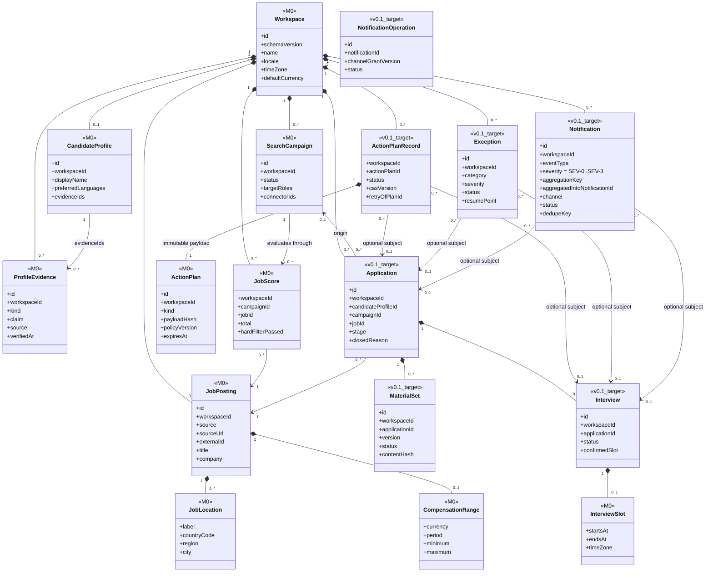
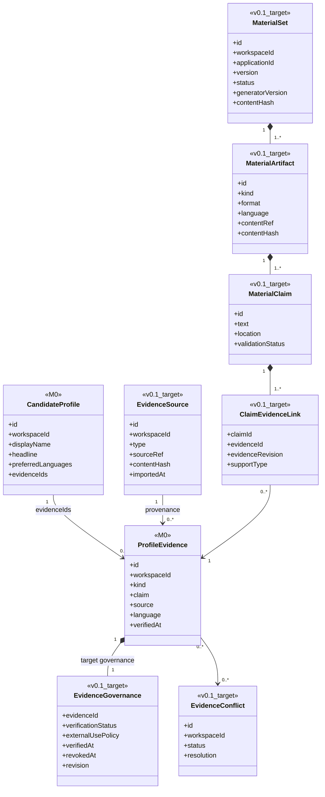
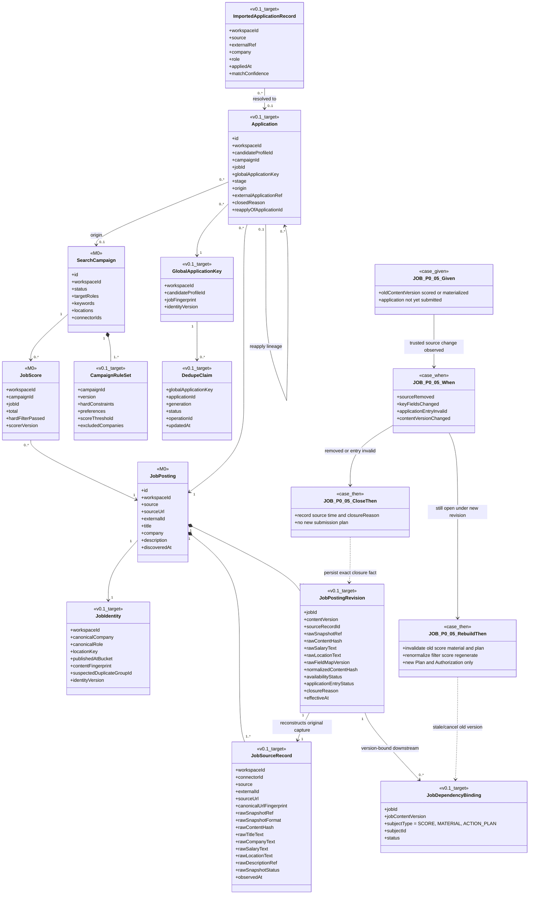
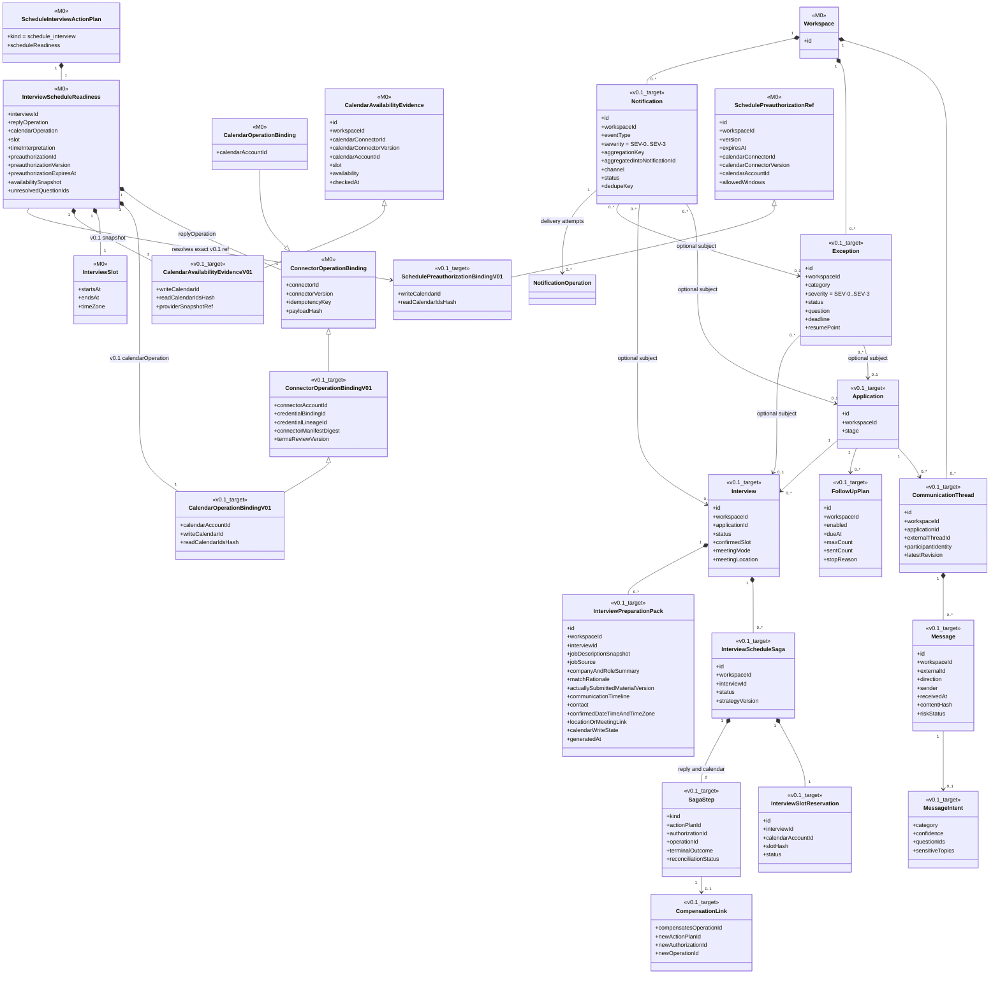

# RoleFox v0.1 领域模型

- 状态：Accepted Design Baseline
- 上级索引：[UML 设计基线](README.md)
- 标注规则：`<<M0>>` 表示当前 TypeScript 中已经存在的类型或接口；`<<M0_utility_functions>>` 表示为便于类图表达而归组展示的现有顶层函数，不表示源码存在同名类型；`<<v0.1_target>>` 表示为 P0 Case 设计、尚未实现的目标对象。图只列与本视图相关的字段，不能据此推断 M0 类型还有图外能力。
- 决策规则：v0.1 产品选择已经由 [ADR-0002](../../adr/0002-v0.1-product-decision-baseline.md) 接受；本图中的约束是目标设计，不代表 M0 已实现。

## RF-UML-CD-DOM-01 聚合、所有权与本地化值对象

聚合边界规则：

1. `Workspace` 是租户与持久化所有权根。JobPosting、Application、ActionPlanRecord、Exception、Notification 等对象必须显式携带并校验 `workspaceId`，不能只靠查询过滤或可选 UI 上下文隔离。
2. SearchCampaign 不拥有 JobPosting；它通过 JobScore 评价岗位，通过 Application 记录一次推进。暂停或删除 Campaign 不能删除岗位事实、历史投递或操作账本。
3. ActionPlanRecord、Exception、Notification 可以没有 Application/Interview 主体，也可以可选关联其中之一；其生存期与删除策略由 Workspace 决定，不能被某个业务主体级联误删。
4. 一个 Application 可以经历多轮 Interview；这里不假设 `0..1` 面试或单一消息线程。
5. `locale`、IANA `timeZone`、ISO currency 与带时区的 `InterviewSlot` 是跨界值，持久化、计划哈希和连接器载荷都必须保持原始语义，不能依赖进程默认区域或时区。

## RF-UML-CD-EVD-01 事实、声明与材料证据链

证据门规则：

1. M0 的 ProfileEvidence 只有 `verifiedAt`，尚没有外用范围、冲突、撤销或版本状态；这些不能被描述成当前已实现能力。
2. v0.1 目标中，每个对外事实声明至少绑定一个当前版本、允许外用且验证通过的 Evidence。`LOCAL_ONLY`、`UNVERIFIED`、`CONFLICTED`、`REVOKED` 或已删除证据不能进入外发材料。
3. Evidence 内容、治理状态或外用范围变化后，依赖的 MaterialSet 与所有未终态 ActionPlanRecord 必须确定性标记 stale；旧计划即使仍持有旧授权也不能执行。
4. AI 输出只产生待校验的 MaterialClaim；Schema、Evidence 和风险验证通过后，MaterialSet 才能进入 READY。

## RF-UML-CD-JOB-01 Campaign、岗位、全局去重与申请

唯一性与历史接管：

1. 精确去重先使用 `(workspaceId, connectorId, externalId)`；externalId 不稳定或缺失时使用规范 URL 指纹。只有精确键命中才可自动关联同一岗位。
2. 跨来源以规范公司、岗位、地点、发布时间和内容指纹建立 `suspectedDuplicateGroupId`，歧义一律进入人工消歧，绝不自动合并。
3. 每个 Workspace 对同一已确认机会最多一个活跃 Application，唯一性边界**不包含 Campaign**。更换、暂停、历史只读监听或顺序运行 Campaign 都不能绕过全局重复检查。
4. 已确认成功、导入后高置信匹配、QUEUED/EXECUTING 或 `OUTCOME_UNKNOWN` 的申请均占用 DedupeClaim；未知结果必须先对账，不能用新 Campaign 或新 idempotency key 重投。
5. 历史关联置信度不足时创建消歧 Exception，不允许因缺少精确 externalId 就再次投递。
6. 岗位原文或关键字段实质变化时创建 JobPostingRevision；评分、材料、去重判定与未终态计划都绑定版本并按规则失效。
7. reapply 只允许在旧 Application 已为 `CLOSED` 且存在新外部事实或用户明确重申时发生。系统在一个 CAS 事务中把旧 active DedupeClaim 固化为历史、以同一 GlobalApplicationKey 的下一 generation 创建新 Application 与唯一 active claim；旧 Application/claim 不删除、不改写，竞态失败者不能创建第二个活跃申请。
8. 每个 `JobSourceRecord` 保存一次不可变来源捕获：`rawSnapshotRef` 指向 Workspace 加密存储中的原始响应或页面快照，`rawSnapshotFormat` 与 `rawFieldMapVersion` 使对应 Revision 可以重建当时可见的标题、公司、职位描述以及**原始薪资和地点表达**；hash 只能验真，不能代替原文。解析后的规范字段与原始文本并存，解析失败也不得覆盖或伪造原始值。
9. 原文可能包含联系人等敏感信息，只能按 Workspace 权限解密，不得写入日志、跨 Workspace cache/vector 索引或插件共享目录。活跃机会保留原文；机会结束后 90 天删除 raw snapshot、原始描述与附件并把 `rawSnapshotStatus` 标为 `PURGED`，但保留不可逆 hash、规范化历史与最小审计至少 1 年。删除后 Revision 明确不可再完整重建，绝不能用规范字段冒充已删除原文；用户主动删除、导出或选择更长保留期按已确认数据政策执行。

JOB-P0-05 / `JOB_VERSION_INVALIDATION` 的行为契约：Given 是某个 `jobContentVersion` 已产生 JobScore、MaterialSet 或尚未投递的 ActionPlan；When 是可信来源报告职位下架、标题/公司/职责/薪资/地点等关键字段变化、申请入口失效或 content hash/version 改变；Then 系统先保存新 JobSourceRecord/Revision 与影响清单，再以事务/CAS 使所有绑定旧版本的未外发 Score、Material 和 Plan 进入 stale/cancelled。仍开放的岗位从新原文重新标准化、硬过滤、评分和生成材料，任何继续外发都必须创建绑定新版本的新 Plan/Authorization；已关闭或申请入口失效则记录来源、时间与精确 `closureReason`，不重新生成投递计划。已明确成功的外部申请仅保留其旧版本历史，不被回滚或复用。

## RF-UML-CD-AUTH-01 三层策略、计划、授权与持久操作

```mermaid
%% @anchor AUTH_BINDINGS
%% @anchor AUTH_PAYLOAD_REBIND
%% @anchor AUTH_L3_SCOPE_EVALUATION
%% @anchor QUOTA_RESERVATION
%% @anchor OPERATION_RELATION
%% @anchor OPERATION_KIND_REGISTRY
classDiagram
    class Workspace {
        <<M0>>
        +id
    }
    class AutomationPolicy {
        <<M0>>
        +workspaceId
        +policyVersion
        +level
        +dryRun
        +killSwitch
        +requireApproval
        +autoApply
        +autoReply
        +autoScheduleInterviews
        +maxApplicationsPerDay
        +maxRepliesPerHour
        +maxInterviewSchedulesPerDay
        +maxAvailabilityAgeMinutes
        +allowedConnectorIds
        +allowedCalendarConnectorIds
        +schedulePreauthorizations
    }
    class SystemSafetyPolicy {
        <<v0.1_target>>
        +version
        +nonDelegableTopics
        +platformAndCaptchaRules
        +defaultLimits = 10/day, 8/hour, 3/day
        +systemHardLimits = 25/day, 12/hour, 8/day
        +maxFollowUpsPerApplication = 1
        +effectiveAt
    }
    class AutomationPolicyRevision {
        <<v0.1_target>>
        +workspaceId
        +version
        +level
        +dryRun
        +validFrom
        +validUntil
    }
    class OperationalControl {
        <<v0.1_target>>
        +workspaceId
        +version
        +mode
        +changedAt
        +reason
    }
    class SafetyAlertControlPlane {
        <<v0.1_target>>
        +workspaceId
        +watchdogBindingId
        +allowedOperationKinds = publish_liveness_heartbeat, send_safety_stop_alert
        +fixedRecipientHash
        +templateVersion
        +status
    }
    class LivenessWatchdogBinding {
        <<v0.1_target>>
        +id
        +pseudonymousInstanceId
        +endpointOrigin
        +credentialRef
        +heartbeatSeconds = 60
        +offlineSeconds = 120
        +pendingAlertSeconds = 600
    }
    class RevocationOnlyControlPlane {
        <<v0.1_target>>
        +workspaceId
        +deletionRequestId
        +mode = REVOCATION_ONLY
        +businessMutationGate = CLOSED
        +fencingEpoch
        +expiresAt
    }
    class RevocationTargetBinding {
        <<v0.1_target>>
        +id
        +workspaceId
        +deletionRequestId
        +connectorId
        +connectorVersion
        +accountId
        +credentialLineage
        +targetHash
    }
    class CapabilityGrant {
        <<v0.1_target>>
        +capability
        +mode
        +enabled
        +connectorAllowlist
        +companyScope
        +roleScope
        +readinessSnapshotId
        +validFrom
        +validUntil
    }
    class CapabilityCalibrationEvent {
        <<v0.1_target>>
        +id
        +workspaceId
        +capability
        +eventKind
        +sourceRef
        +outcome
        +safetyErrorClass
        +evidenceHash
        +occurredAt
    }
    class L3ReadinessSnapshot {
        <<v0.1_target>>
        +id
        +workspaceId
        +capability
        +criteriaVersion
        +eventLedgerVersion
        +shadowStartedAt
        +shadowCompletedAt
        +consecutiveShadowDays
        +decisionCount
        +l2ActionCount
        +syntheticExceptionCaseCount
        +unauthorizedCount
        +duplicateCount
        +fabricationCount
        +scheduleErrorCount
        +eligible
        +computedAt
        +expiresAt
    }
    class UsageLimit {
        <<v0.1_target>>
        +metric
        +window
        +configuredLimit
    }
    class AnswerPreauthorization {
        <<v0.1_target>>
        +id
        +version
        +questionCategory
        +evidenceIds
        +allowedRange
        +expiresAt
    }
    class SchedulePreauthorizationRef {
        <<M0>>
        +id
        +workspaceId
        +version
        +expiresAt
        +calendarConnectorId
        +calendarConnectorVersion
        +calendarAccountId
        +allowedWindows
    }
    class SchedulePreauthorizationBindingV01 {
        <<v0.1_target>>
        +writeCalendarId
        +readCalendarIdsHash
    }
    class ActionDraft {
        <<M0>>
        +target
        +riskHints
        +payloadPreview
    }
    class ActionPlanBase {
        <<M0>>
        +id
        +workspaceId
        +idempotencyKey
        +connectorId
        +connectorVersion
        +target
        +risk
        +sensitiveTopics
        +payloadHash
        +evidenceIds
        +policyVersion
        +createdAt
        +expiresAt
    }
    class ActionPlanBaseV01 {
        <<v0.1_target>>
        +connectorAccountId
        +credentialBindingId
        +credentialLineageId
        +connectorManifestDigest
        +termsReviewVersion
    }
    class PayloadBindingSnapshotV01 {
        <<v0.1_target>>
        +canonicalPayloadHash
        +materialSetVersion
        +answerRevisionSetHash
        +attachmentSetHash
        +targetHash
        +evidenceRevisionSetHash
    }
    class StandardActionPlan {
        <<M0>>
        +kind
    }
    class StandardActionPlanV01 {
        <<v0.1_target>>
        +kind
    }
    class ScheduleInterviewActionPlan {
        <<M0>>
        +kind = schedule_interview
        +scheduleReadiness
    }
    class ScheduleInterviewActionPlanV01 {
        <<v0.1_target>>
        +kind = schedule_interview
        +scheduleReadiness
    }
    class CredentialRevocationActionPlan {
        <<v0.1_target>>
        +kind = credential_revocation
        +deletionRequestId
        +revocationTargetBindingId
        +targetHash
    }
    class SafetySignalActionPlan {
        <<v0.1_target>>
        +kind = publish_liveness_heartbeat or send_safety_stop_alert
        +watchdogBindingId
        +signalEpoch
        +fixedPayloadHash
        +targetHash
    }
    class ActionPlanRecord {
        <<v0.1_target>>
        +workspaceId
        +actionPlanId
        +status
        +casVersion
        +retryOfPlanId
        +createdAt
        +updatedAt
    }
    class PolicyEvaluationRecord {
        <<v0.1_target>>
        +id
        +actionPlanId
        +systemPolicyVersion
        +delegationVersion
        +controlVersion
        +safetyAlertControlPlaneId
        +revocationControlPlaneId
        +outcome
        +reasonCode
        +evaluatedAt
    }
    class L3ScopeEvaluationV01 {
        <<v0.1_target>>
        +companyScopeResult
        +roleScopeResult
        +answerScopeResult
        +connectorScopeResult
        +scheduleWindowResult
        +quotaResult
        +expiryResult
        +outcome
        +reasonCode
        +exceptionId
    }
    class ActionAuthorization {
        <<M0>>
        +actionPlanId
        +workspaceId
        +source
        +policyVersion
        +payloadHash
        +authorizedAt
        +expiresAt
    }
    class ActionAuthorizationV01 {
        <<v0.1_target>>
        +actionKind
        +connectorId
        +connectorVersion
        +connectorAccountId
        +credentialBindingId
        +credentialLineageId
        +connectorManifestDigest
        +termsReviewVersion
        +payloadBindingHash
        +scopeEvaluationHash
    }
    class ActionAuthorizationRecord {
        <<v0.1_target>>
        +id
        +workspaceId
        +actionPlanId
        +policyEvaluationId
        +revocationControlPlaneId
        +revocationStatus
        +createdAt
    }
    class ExternalOperation {
        <<v0.1_target>>
        +id
        +workspaceId
        +actionPlanId
        +authorizationId
        +operationKind
        +idempotencyKey
        +payloadHash
        +status
        +externalRef
        +attempt
        +fencingToken
        +compensatesOperationId
    }
    class OperationKind {
        <<v0.1_target>>
        +submit_application
        +withdraw_application
        +send_reply
        +send_follow_up
        +send_interview_confirmation
        +create_calendar_event
        +update_calendar_event
        +cancel_calendar_event
        +send_notification_primary
        +send_notification_fallback
        +publish_liveness_heartbeat
        +send_safety_stop_alert
        +credential_revocation
    }
    class ApplicationOperation {
        <<v0.1_target>>
        +applicationId
        +purpose
    }
    class ReplyOperation {
        <<v0.1_target>>
        +threadId
        +messageRevision
    }
    class CalendarOperation {
        <<v0.1_target>>
        +interviewId
        +calendarAccountId
        +writeCalendarId
        +slotHash
        +purpose
        +visibility = PRIVATE
        +recruiterAttendee = NONE
        +externalId
    }
    class NotificationOperation {
        <<v0.1_target>>
        +notificationId
        +channelGrantVersion
    }
    class SafetySignalOperation {
        <<v0.1_target>>
        +watchdogBindingId
        +signalEpoch
        +targetHash
    }
    class CredentialRevocationOperation {
        <<v0.1_target>>
        +deletionRequestId
        +revocationTargetBindingId
        +targetHash
    }
    class UsageReservation {
        <<v0.1_target>>
        +id
        +workspaceId
        +operationId
        +metric
        +windowKey
        +amount
        +status
    }
    class InterviewSlotReservation {
        <<v0.1_target>>
        +id
        +workspaceId
        +actionPlanId
        +interviewId
        +calendarAccountId
        +slotHash
        +status
    }
    class AuditIntent {
        <<v0.1_target>>
        +id
        +workspaceId
        +correlationId
        +eventType
        +payloadHash
        +createdAt
    }
    class OutboxEvent {
        <<v0.1_target>>
        +id
        +workspaceId
        +actionPlanId
        +operationId
        +sagaId
        +eventType
        +status
        +availableAt
    }
    class AUTH_005_Given {
        <<case_given>>
        +old immutable plan has frozen payload binding
    }
    class AUTH_005_When {
        <<case_when>>
        +material answer attachment target or evidence changed
        +old plan submitted again
    }
    class AUTH_005_RejectThen {
        <<case_then>>
        +runtime canonical hash mismatch
        +reject before external call
        +invalidate old unstarted plan and authorization
    }
    class AUTH_005_ReplanThen {
        <<case_then>>
        +new Plan plus new hash
        +new evaluation and authorization
    }
    class AUTH_009_Given {
        <<case_given>>
        +capability is L3 with current readiness and policy
    }
    class AUTH_009_When {
        <<case_when>>
        +evaluate company role answer connector
        +schedule window quota and expiry
    }
    class AUTH_009_AllowThen {
        <<case_then>>
        +all dimensions and safety controls pass
        +may atomically authorize this action
    }
    class AUTH_009_BlockThen {
        <<case_then>>
        +one dimension out of scope
        +zero operation plus action-scoped Exception
        +no collateral capability pause
    }

    Workspace "1" --> "1" AutomationPolicy : current value
    AutomationPolicy ..> AutomationPolicyRevision : target split
    Workspace "1" *-- "1..*" AutomationPolicyRevision
    Workspace "1" *-- "1" OperationalControl
    Workspace "1" *-- "0..1" SafetyAlertControlPlane
    SafetyAlertControlPlane "1" *-- "1" LivenessWatchdogBinding
    Workspace "1" *-- "0..1" RevocationOnlyControlPlane
    RevocationOnlyControlPlane "1" *-- "1..*" RevocationTargetBinding
    AutomationPolicyRevision "1" *-- "0..*" CapabilityGrant
    Workspace "1" *-- "0..*" CapabilityCalibrationEvent
    Workspace "1" *-- "0..*" L3ReadinessSnapshot
    L3ReadinessSnapshot "1" --> "1..*" CapabilityCalibrationEvent : derived from immutable ledger
    CapabilityGrant "0..*" --> "0..1" L3ReadinessSnapshot : mandatory for L3
    AutomationPolicyRevision "1" *-- "0..*" UsageLimit
    AutomationPolicyRevision "1" *-- "0..*" AnswerPreauthorization
    AutomationPolicyRevision "1" *-- "0..*" SchedulePreauthorizationRef
    SchedulePreauthorizationRef <|-- SchedulePreauthorizationBindingV01
    ActionDraft --> ActionPlanBase : Core rebuilds
    ActionDraft --> ActionPlanBaseV01 : v0.1 Core rebuilds exact binding
    ActionPlanBase <|-- ActionPlanBaseV01 : target exact execution binding
    ActionPlanBaseV01 "1" *-- "1" PayloadBindingSnapshotV01 : immutable outbound snapshot
    ActionPlanBase <|-- StandardActionPlan
    ActionPlanBase <|-- ScheduleInterviewActionPlan
    ActionPlanBaseV01 <|-- StandardActionPlanV01 : target ordinary connector plan
    ActionPlanBaseV01 <|-- ScheduleInterviewActionPlanV01 : target schedule connector plan
    ActionPlanBase <|-- CredentialRevocationActionPlan
    ActionPlanBase <|-- SafetySignalActionPlan
    SafetySignalActionPlan "0..*" --> "1" SafetyAlertControlPlane : fixed safety binding
    CredentialRevocationActionPlan "0..*" --> "1" RevocationTargetBinding : exact fixed target
    ActionPlanRecord "1" *-- "1" ActionPlanBase : immutable payload
    ActionPlanRecord "1" --> "0..*" PolicyEvaluationRecord
    PolicyEvaluationRecord "1" *-- "0..1" L3ScopeEvaluationV01 : required for L3 decision
    SystemSafetyPolicy "1" --> "0..*" PolicyEvaluationRecord
    AutomationPolicyRevision "0..1" --> "0..*" PolicyEvaluationRecord
    OperationalControl "1" --> "0..*" PolicyEvaluationRecord
    SafetyAlertControlPlane "0..1" --> "0..*" PolicyEvaluationRecord : narrow safety evaluation
    RevocationOnlyControlPlane "0..1" --> "0..*" PolicyEvaluationRecord : deletion safety evaluation
    ActionPlanRecord "1" --> "0..*" ActionAuthorizationRecord
    ActionAuthorizationRecord "1" *-- "1" ActionAuthorization : immutable value
    ActionAuthorization <|-- ActionAuthorizationV01 : target exact execution binding
    ActionAuthorizationRecord "0..*" --> "1" PolicyEvaluationRecord : based on
    ActionPlanRecord "1" *-- "0..*" ExternalOperation
    ExternalOperation "0..*" --> "1" ActionAuthorizationRecord : authorized by
    ExternalOperation "0..*" --> "1" OperationKind : closed operationKind
    ExternalOperation <|-- ApplicationOperation
    ExternalOperation <|-- ReplyOperation
    ExternalOperation <|-- CalendarOperation
    ExternalOperation <|-- NotificationOperation
    ExternalOperation <|-- SafetySignalOperation
    ExternalOperation <|-- CredentialRevocationOperation
    SafetySignalOperation "0..*" --> "1" SafetyAlertControlPlane : safety authority
    CredentialRevocationOperation "0..*" --> "1" RevocationTargetBinding : exact fixed target
    CredentialRevocationOperation "0..*" --> "1" RevocationOnlyControlPlane : safety authority
    ExternalOperation "1" *-- "0..*" UsageReservation
    ActionPlanRecord "1" *-- "0..1" InterviewSlotReservation
    ActionPlanRecord "1" *-- "0..*" OutboxEvent
    ExternalOperation "1" --> "0..*" OutboxEvent : optional operation subject
    ActionPlanRecord "1" *-- "0..*" AuditIntent
    ExternalOperation "1" --> "0..*" AuditIntent
    AUTH_005_Given --> AUTH_005_When : dependency mutation precedes resubmit
    AUTH_005_When --> AUTH_005_RejectThen : compare authoritative bytes at runtime
    AUTH_005_RejectThen --> AUTH_005_ReplanThen : action still desired
    AUTH_005_RejectThen ..> PayloadBindingSnapshotV01 : old snapshot remains immutable
    AUTH_009_Given --> AUTH_009_When : action enters evaluation or recheck
    AUTH_009_When --> AUTH_009_AllowThen : every bound dimension passes
    AUTH_009_When --> AUTH_009_BlockThen : any dimension fails
    AUTH_009_AllowThen ..> ActionAuthorizationV01 : exact scoped authorization
    AUTH_009_BlockThen ..> L3ScopeEvaluationV01 : persist failed dimension
```

关键约束：

1. M0 AutomationPolicy 把委托与 `killSwitch` 混在一个结构中；v0.1 目标必须拆成不可被用户放宽的 SystemSafetyPolicy、版本化用户委托 AutomationPolicyRevision、立即生效的 OperationalControl。最终允许集是 `安全边界 ∩ 用户委托 ∩ 运行控制`。
2. 默认上限固定为每日投递 10、每小时回复 8、每日自动约面 3；普通配置不可突破的系统硬上限分别为 25、12、8。每个 Application 最多一次自动跟进。系统级上限只能通过新的安全版本发布调整，不能由 Workspace/Campaign/Connector 配置放宽。
3. ActionDraft 只是外部扩展提供的候选数据；Core 必须重建 workspace、kind、风险、证据、连接器绑定、幂等键和 payloadHash 后才形成不可变 ActionPlan。当前 M0 `StandardActionPlan` 与 `ScheduleInterviewActionPlan` 直接继承只含 connector id/version 的 M0 `ActionPlanBase`；v0.1 分别使用单继承的 `StandardActionPlanV01` 与 `ScheduleInterviewActionPlanV01`，两者从 `ActionPlanBaseV01` 同时取得基础计划字段和 `connectorAccountId`、精确 `credentialBindingId`、可跨轮换追踪的 `credentialLineageId`、manifest digest 与条款复核版本，并由各自类明确携带 `kind`。不得用平行 mixin、多继承、执行时“默认账号”或最新凭证补齐权威计划。
4. 生命周期状态只存在于 ActionPlanRecord；不可为了重试、审批或执行更新而改写 ActionPlan 载荷。DRAFT/AWAITING_APPROVAL 计划可以有 **0** 个 ExternalOperation，因此基数是 `0..*`。
5. 一个计划可经多次策略评估和授权续签；每个 ExternalOperation 必须绑定一个仍有效的 ActionAuthorization。v0.1 授权使用 `ActionAuthorizationV01` 复制并校验 plan 的 workspace、policy revision、payloadHash、动作、connector id/version、account、credential binding/lineage、manifest digest、terms review version 和 expiry；任一差异都使旧授权失效且零外发，不能静默重绑到轮换后的凭证。
6. 一个 ExternalOperation 可以占用 `0..*` 个 UsageReservation；某些通知可能不占额度。一个 ScheduleInterviewActionPlan 可在同一授权下创建 CalendarOperation 与 ReplyOperation 两个子操作，并以 `0..1` 个有效 InterviewSlotReservation 和多项额度预留共同保护同一时段。额度按 Workspace 原子占用，Campaign 不能各自突破全局上限。
7. mutation 的授权、ExternalOperation、初始 UsageReservation/InterviewSlotReservation、AuditIntent 和至少一个 OutboxEvent 必须在同一事务创建；普通动作的 outbox 可指向 operation，约面事务一次创建两个 QUEUED 子操作和一个指向 Saga 的启动作业。DRAFT/AWAITING_APPROVAL 计划尚无 operation/outbox，因此两者在 ActionPlanRecord 下均为 `0..*`。任何一项失败都不得入队或外发。完整执行协议见 RF-UML-REL-MUT-01。
8. 每个 ExternalOperation 必须且只能取一个受 schema/version 管理的 OperationKind；未知 kind 在入库、反序列化、队列消费和执行时一律 quarantine/拒绝，不能回退到通用 execute。`submit_application`、撤回、普通/跟进/面试确认回复、日历创建/更新/取消、主/备用通知和凭证撤销均显式建模；内部材料生成不是 ExternalOperation。
9. Workspace 删除先关闭全部业务 mutation，再由不可被 AutomationPolicy/CapabilityGrant 获得的 RevocationOnlyControlPlane 为每个固定 connector/account/credential lineage 生成独立 CredentialRevocationActionPlan。一个计划只绑定一个不可变 RevocationTargetBinding，授权与操作再次绑定 targetHash；任何业务 operation kind、动态账号或默认账号都不允许进入该控制面。
10. `credential_revocation` 仍完整执行 `Plan → Policy/Safety Evaluation → Authorization → atomic Operation + AuditIntent + Outbox → Cleanup Executor`，并使用幂等键、三态结果和 unknown reconcile。它不是 STOP_OUTBOUND 的业务例外，而是删除流程中隔离、限时、可审计的安全清理权限；外部撤销无法确认时记录 residual authorization，但不能无限阻塞本地 PII 删除。
11. L3 readiness 不从内存计数或单次 UI 判断推导。每个 Shadow 决策、真实 L2 动作、合成异常 Case 与四类严重错误都追加为带来源引用和 evidence hash 的 `CapabilityCalibrationEvent`；`L3ReadinessSnapshot` 绑定 capability、criteriaVersion 与事件账本版本，固化连续 Shadow 天数及各类计数。任何未授权、重复、虚构或错误排期计数非零都使 snapshot 不合格；修复后开始新的合格窗口，旧事件不删除。L3 CapabilityGrant 必须绑定未过期且仍与当前策略、Connector 和事件账本版本一致的合格 snapshot，重启、导出或恢复不得凭历史 mode 绕过重算。
12. `SafetyAlertControlPlane` 不是业务 Notification 权限。它只能针对预配置 Watchdog binding 产生固定 schema 的 `publish_liveness_heartbeat` 与 `send_safety_stop_alert`；收件人、endpoint、template 和 targetHash 不能由运行时输入改写。每个 60 秒 heartbeat slot 与每个 kill fencing epoch 使用唯一幂等键，并经窄化安全评估、durable Operation、AuditIntent、Outbox 和独立 executor 执行；业务 Connector/Policy 不能获得此 kind。结果未知只允许按 Watchdog signal ID 对账，不能改用普通通知路径重发。

| Case / anchor | Given | When | Then |
| --- | --- | --- | --- |
| AUTH-005 / `AUTH_PAYLOAD_REBIND` | 旧计划冻结了材料、答案、附件、目标字段和 Evidence revision 集及其 canonical payload hash | 任一依赖被修改后，旧 ActionPlan 再次提交、出队或准备调用 Connector | Core 从权威对象重新 canonicalize 全部外发字节并与 Plan、Authorization、Operation、token 的 hash/版本逐项比较；任一不一致都在外部调用前拒绝并使旧未外发计划/授权失效。旧 immutable Plan 不原地改写；仍需动作时创建新 Plan、新 hash、重新评估和新授权。可能已发的旧 operation 先进入对账，不能并行创建替代外发。 |
| AUTH-009 / `AUTH_L3_SCOPE_EVALUATION` | Workspace 对该 capability 处于 L3，且有当前 policy、readiness snapshot 和候选动作 | 动作进入策略评估或 execution-time recheck | 必须逐项验证 company、role、answer/evidence、connector/version/account、schedule window（适用时）、Workspace 原子 quota 和 Plan/Auth expiry；七维及系统安全/控制全部通过才可为该动作授权并原子创建 operation。任一维越界则零 operation/零外发，只阻塞该动作并创建带越界维度的 Exception；其他合规动作与 capability 不被连带暂停，除非另有独立的 SEV-0/全局控制事实。 |
## RF-UML-CD-COM-01 消息、异常、面试与通知

通信与排期规则：

1. 每条 Message 在可回复前必须唯一关联 Workspace、Application、外部线程和参与者身份；身份或关联置信度不足时生成 Exception，不得自动回复。
2. FollowUpPlan 默认 disabled；v0.1 显式启用后最多自动成功跟进一次，等待窗口与停止条件必须进入版本化策略和持久计数，不能只靠调度器内存或普通重试次数限制。
3. 一条消息同时含普通与敏感问题时，整条回复升级人工处理；不能拆出“安全部分”造成已经完整回应的误解。
4. M0 已有的排期安全结构不是 Interview/Saga 的持久化实现。M0 `ConnectorOperationBinding` 只有 connector id/version、幂等键和 payload hash，M0 `CalendarOperationBinding` 从它单继承并增加 calendar account；v0.1 所有普通 Connector 子操作改用 `ConnectorOperationBindingV01`，把 `connectorAccountId`、`credentialBindingId`、`credentialLineageId`、manifest digest 和条款复核版本与计划、授权逐项绑定。目标 `CalendarOperationBindingV01` 只从该 v0.1 基类单继承，并重新明确 `calendarAccountId`、`writeCalendarId` 与 `readCalendarIdsHash`，不与 M0 Calendar 类形成多继承；其中 `connectorAccountId` 必须等于 `calendarAccountId`。Readiness 还必须精确绑定回复 connector、日历 connector/version/account、slot、可用性快照及 preauthorization id/version/expiry。有任何 binding 不一致、未解决问题、歧义时间或过期快照时失败关闭，不能回退默认账号、最新凭证或另一 lineage。
5. v0.1 只绑定一个 Calendar Provider 账户和一个可写日历；可读取该账户内多个 `readCalendarIds` 并以 busy 并集判冲突。跨账户聚合不属于 v0.1。
6. ScheduleInterviewActionPlan 先作为不可变计划独立持久化，再接受当前三层策略评估。条件通过后，一个事务同时持久化 ActionAuthorization、InterviewSlotReservation、reply/calendar 两个 SagaStep 所指向的 QUEUED durable operation、额度预留、AuditIntent 与 Saga 启动 OutboxJob；两步共享计划与授权，但各自拥有 operation id、幂等键、载荷哈希、外部引用和终态。
7. InterviewScheduleSaga 的 calendar 与 reply 子操作分别保留终态和对账状态；执行固定为 calendar-first。日历成功、回复明确失败时，补偿用 CompensationLink 指向**新的**取消计划、授权和操作，绝不原地改写成功子操作；取消失败或未知创建 `SEV-1` Exception 并暂停排期 capability。
8. InterviewPreparationPack 的上述事实字段全部为 P0；AI 生成的面试建议属于 P1，不得代替或阻塞核心事实包。
## RF-UML-CD-EXT-01 Connector 与 AI Provider 扩展契约

扩展边界规则：

1. M0 的 capability 接口都继承 ConnectorBase，ConnectorBase **组合**一个 manifest；manifest 是实例声明，不是接口父类，也不是授权。具体 adapter 可以实现多个 capability 接口。当前 TypeScript manifest 只含 `termsUrl` 等已列 M0 字段；`ConnectorManifestV01` 才是目标扩展，冻结 `termsReviewVersion`、`reviewedAt`、`officialScopes`、官方范围证据与 digest，不得把这些字段误称为已经实现。
2. M0 的实际方法包括 `JobDetailConnector.getDetail` 与 `ReplyConnector.executeInterviewConfirmation`。当前 Application、Reply、Calendar、Notification 接口均没有 withdraw、reconcile、update 或 compensate 方法；图中的 ApplicationWithdrawal、四类 Reconciliation 与 CalendarCompensation 明确是 v0.1 目标扩展。
3. M0 AIProvider 组合 manifest；`generateStructured` 和 `embed` 是可选方法，调用前必须通过 capability assertion，结果仍须 runtime schema 验证。
4. Connector/AI 输出都不是权威领域对象。它们只能返回 ExternalJobPosting、ActionDraft、InboxMessage 或未知 AI data，由 Core 校验并生成计划；扩展不能创建 Policy、Authorization、ExternalOperation 或直接迁移业务状态。Core 必须丢弃扩展自报的 `workspaceId`、内部 subject/operation id、risk、policy、authorization、quota 或 control 字段，并从可信会话、持久实体和当前策略重新派生。
5. 所有业务 mutation adapter（包括 Notification）和删除期撤权 adapter 只接受不可变 Plan 与绑定 operation 的短期执行上下文；执行结果必须进入统一三态结果与 reconcile 协议。SafetySignal 是唯一隔离的安全 adapter，同样只接受固定 SafetySignalActionPlan、窄化授权和 operation-bound 短期上下文。
6. Calendar Connector 只有同时通过查询/对账、幂等创建、更新/取消和稳定 external ID 的 conformance tests，才可声明 `CalendarL3CapabilitySet` 完整并开放 L3。缺少任一项只能用于读取、L2 或人工交接。
7. 已提交申请的撤回、已排面试的改期/取消和日历补偿都是新的 ActionPlan、Authorization 与 ExternalOperation；目标扩展不能复用、删除或改写原 submit/create operation。
8. CredentialRevocationSafetyPort 只暴露给独立 Cleanup Executor，不进入业务 capability allowlist；调用必须携带冻结的 target binding 和 `credential_revocation` operation token。远端不支持撤销时记录明确 unsupported/residual 结果，不能把安全端口伪装成普通 Connector capability。
9. `CalendarOperationBinding`、`CalendarAvailabilityEvidence` 与 `SchedulePreauthorizationRef` 的 M0 形态只绑定 Provider 账户；v0.1 扩展必须再绑定唯一 `writeCalendarId` 和规范排序后的 `readCalendarIdsHash`，三者在 Plan、授权、最终 free/busy 复核和执行时必须完全一致。图中的 `*V01` 类是目标扩展，不得冒充当前 TypeScript 已实现字段。
10. v0.1 安装和**每一次运行时调用**都由 `ConnectorRuntimeGuard` 验证 `(capability, method)` 是否出现在冻结的 `ConnectorCapabilityContractV01` 中，并同时满足用户 grant、manifest permissions 与 `officialScopes` 的交集；空集合即禁止。请求与响应必须命中绑定 schema/version，未知方法、未知 capability、额外权限、未知结果枚举、畸形或越界字段一律 quarantine/失败关闭，记录去敏安全审计，并保证零 ActionPlan、零 Authorization、零 ExternalOperation、零领域状态迁移；不得回退 generic execute 或把未知值当成功。
11. terms review、官方 scope 证据、capability-method、permission、runtime、schema 或结果枚举语义任一变化都会改变 manifest digest，并暂停受影响 capability。旧的未执行 Plan/Authorization 失效；只有被隔离保留且仍能按原 manifest digest 运行的旧 adapter 才可继续已开始的对账，否则转人工处置，不能让新版本静默执行旧计划。

## 当前 M0 与目标模型差距

| 目标对象或能力 | M0 事实 | v0.1 目标 |
| --- | --- | --- |
| Workspace/Profile/Evidence/Campaign/Job/Score | 有基础 TypeScript 类型 | Evidence 治理、来源冲突、规则版本、岗位版本与 Workspace 持久化约束 |
| Application | 只有阶段枚举和迁移函数 | 实体、Workspace 级全局唯一性、历史导入、关闭原因和持久化 |
| MaterialSet | 未实现 | artifact、claim-evidence 链、版本与 stale 传播 |
| Policy | 一个 AutomationPolicy 同时含委托和 kill switch | SystemSafetyPolicy、AutomationPolicyRevision、OperationalControl 三层交集；删除期另有不可委托的 REVOCATION_ONLY 安全控制面 |
| ActionPlan/Authorization | 有不可变值类型；未持久执行 | ActionPlanRecord、多次评估/授权、绑定操作与事务 outbox |
| ExternalOperation/Audit/Outbox | 未实现 | 封闭 OperationKind、durable intent、额度预留、审计 intent、lease/fencing、unknown、reconcile、compensation 与独立 cleanup 执行 |
| Message/Thread/FollowUp/Exception | 未实现 | 去重、顺序、身份关联、意图、停止条件、恢复点 |
| Interview/Saga/Notification | 只有排期值对象和连接器方法 | 独立实体、两个子操作、改期/取消、通知投递与准备包 |
| Connector/AI Provider | 有 manifest、接口和 capability assertion | registry、最小权限运行、reconcile/补偿扩展与 conformance suite |
| Backup/Restore/Delete | 未实现 | 一致快照、秘密排除、恢复门禁、只读重绑、重新授权与删除期凭证撤销/残留报告 |
