# RoleFox v0.1 状态机

- 状态：Review Draft
- 上级索引：[UML 设计基线](README.md)
- 术语约定：所有“结果未知”“待对账”统一建模为 `OUTCOME_UNKNOWN`。

状态机的基本原则是：Application、ActionPlan、ExternalOperation、Exception、Interview 和 Notification 分别保存自己的事实，任何一个对象的成功都不能代替另一个对象的成功。

## RF-UML-SM-WS-01 Workspace 与首次配置

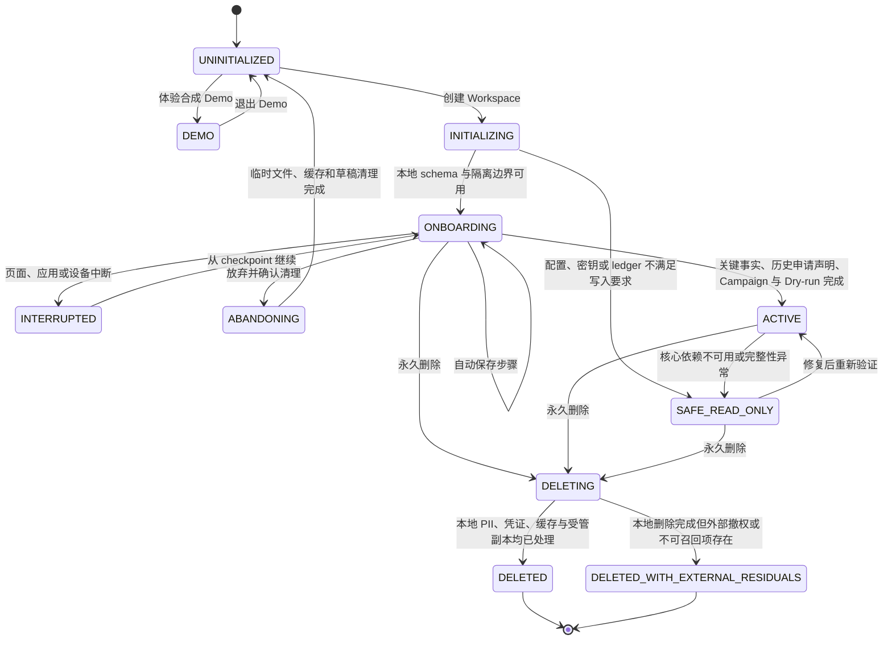
```mermaid
stateDiagram-v2
    %% @anchor WORKSPACE_ONBOARDING
    [*] --> UNINITIALIZED
    UNINITIALIZED --> DEMO : 体验合成 Demo
    DEMO --> UNINITIALIZED : 退出 Demo
    UNINITIALIZED --> INITIALIZING : 创建 Workspace
    INITIALIZING --> ONBOARDING : 本地 schema 与隔离边界可用
    INITIALIZING --> SAFE_READ_ONLY : 配置、密钥或 ledger 不满足写入要求
    ONBOARDING --> ONBOARDING : 自动保存步骤
    ONBOARDING --> INTERRUPTED : 页面、应用或设备中断
    INTERRUPTED --> ONBOARDING : 从 checkpoint 继续
    ONBOARDING --> ABANDONING : 放弃并确认清理
    ABANDONING --> UNINITIALIZED : 临时文件、缓存和草稿清理完成
    ONBOARDING --> ACTIVE : 关键事实、历史申请声明、Campaign 与 Dry-run 完成
    ACTIVE --> SAFE_READ_ONLY : 核心依赖不可用或完整性异常
    SAFE_READ_ONLY --> ACTIVE : 修复后重新验证
    ONBOARDING --> DELETING : 永久删除
    ACTIVE --> DELETING : 永久删除
    SAFE_READ_ONLY --> DELETING : 永久删除
    DELETING --> DELETED : 本地 PII、凭证、缓存与受管副本均已处理
    DELETING --> DELETED_WITH_EXTERNAL_RESIDUALS : 本地删除完成但外部撤权或不可召回项存在
    DELETED --> [*]
    DELETED_WITH_EXTERNAL_RESIDUALS --> [*]
```

Workspace 不承载 Campaign、L2/L3 或三级暂停状态。进入 `ACTIVE` 不要求所有外部连接器均可用；开放导入路径足以完成首次体验。`DELETED_WITH_EXTERNAL_RESIDUALS` 只保留不可反推个人的限时最小摘要和残留项说明，不保留被删除的正文或直接标识。

## RF-UML-SM-EVD-01 ProfileEvidence 生命周期

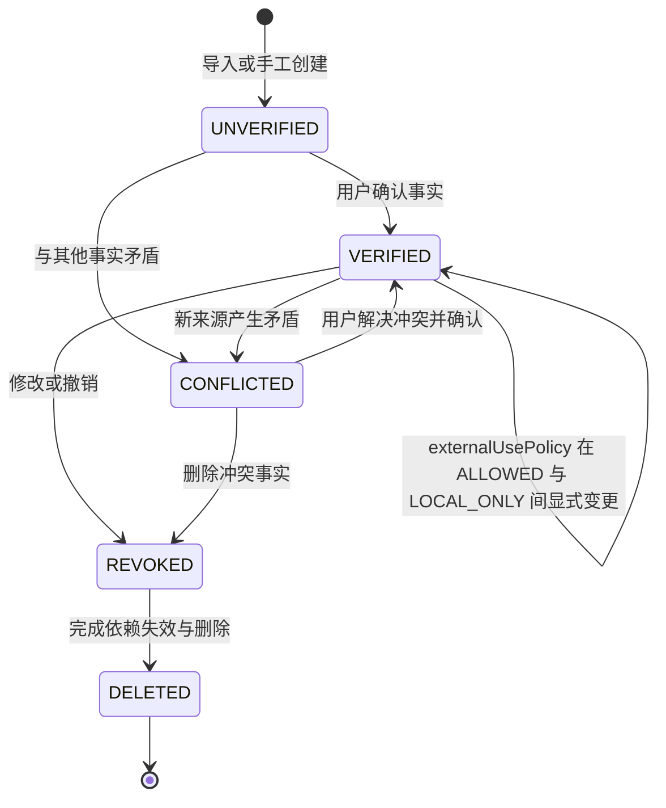
```mermaid
stateDiagram-v2
    %% @anchor EVIDENCE_LIFECYCLE
    %% @anchor EVIDENCE_INVALIDATION
    %% @anchor CONFLICTED
    [*] --> UNVERIFIED : 导入或手工创建
    UNVERIFIED --> VERIFIED : 用户确认事实
    UNVERIFIED --> CONFLICTED : 与其他事实矛盾
    CONFLICTED --> VERIFIED : 用户解决冲突并确认
    VERIFIED --> VERIFIED : externalUsePolicy 在 ALLOWED 与 LOCAL_ONLY 间显式变更
    VERIFIED --> CONFLICTED : 新来源产生矛盾
    VERIFIED --> REVOKED : 修改或撤销
    CONFLICTED --> REVOKED : 删除冲突事实
    REVOKED --> DELETED : 完成依赖失效与删除
    DELETED --> [*]
```

`verificationStatus` 与 `externalUsePolicy` 是正交字段；只有 `VERIFIED + ALLOWED` 可以支持外发。进入 `CONFLICTED`、`LOCAL_ONLY`、`REVOKED` 或 `DELETED` 时，依赖的 MaterialSet 进入 `STALE`。只有尚未创建外部执行的 `DRAFT`、`AWAITING_APPROVAL`、`AUTHORIZED` ActionPlan 可直接失效；已有 `PREPARED` / `EXECUTING` ExternalOperation 时，能证明请求未发出才进入 `CANCELLED` / `FAILED_CONFIRMED`，否则必须进入 `OUTCOME_UNKNOWN → RECONCILING`，其 ActionPlan 保持 `EXECUTING` 到全部子操作收敛。已经发生的外部事实只能追加纠正记录，不能伪装回滚。

## RF-UML-SM-CAM-01 SearchCampaign 生命周期

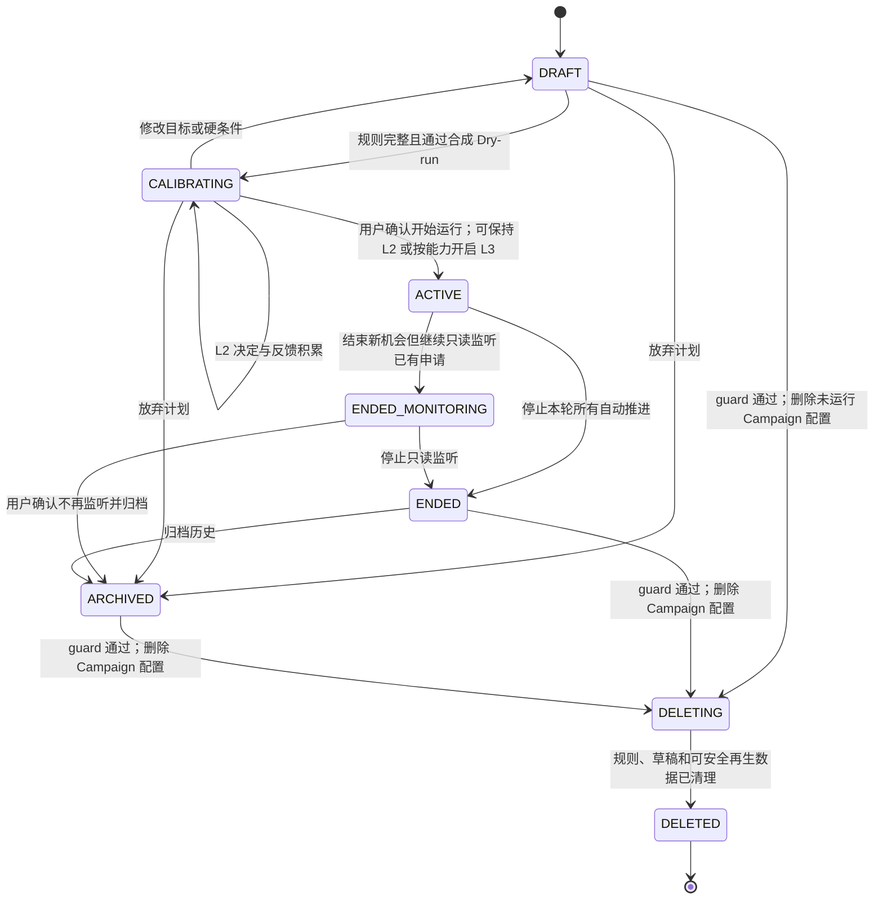
```mermaid
stateDiagram-v2
    %% @anchor CAMPAIGN_LIFECYCLE
    [*] --> DRAFT
    DRAFT --> CALIBRATING : 规则完整且通过合成 Dry-run
    CALIBRATING --> CALIBRATING : L2 决定与反馈积累
    CALIBRATING --> ACTIVE : 用户确认开始运行；可保持 L2 或按能力开启 L3
    CALIBRATING --> DRAFT : 修改目标或硬条件
    DRAFT --> ARCHIVED : 放弃计划
    CALIBRATING --> ARCHIVED : 放弃计划
    ACTIVE --> ENDED_MONITORING : 结束新机会但继续只读监听已有申请
    ACTIVE --> ENDED : 停止本轮所有自动推进
    ENDED_MONITORING --> ENDED : 停止只读监听
    ENDED_MONITORING --> ARCHIVED : 用户确认不再监听并归档
    ENDED --> ARCHIVED : 归档历史
    DRAFT --> DELETING : guard 通过；删除未运行 Campaign 配置
    ENDED --> DELETING : guard 通过；删除 Campaign 配置
    ARCHIVED --> DELETING : guard 通过；删除 Campaign 配置
    DELETING --> DELETED : 规则、草稿和可安全再生数据已清理
    DELETED --> [*]
```

删除 guard 只允许 `DRAFT`、`ENDED`、`ARCHIVED` 进入 `DELETING`；`CALIBRATING`、`ACTIVE`、`ENDED_MONITORING` 必须先停止或归档。Campaign 删除只清理该 Campaign 的规则、偏好副本、未采用草稿和可安全再生的派生数据，并保留不可复活的 tombstone。已经发生的 Application、Interview、Message、ExternalOperation 和 Audit 不是 Campaign 可级联删除的子对象，继续保留；只有 Workspace 删除策略可以删除或脱敏这些历史事实。

`ARCHIVED` 是当前实例的业务终态，但允许数据管理命令将它转入 `DELETING`。`<<proposed DEC-15>>` 约束：同一 Workspace 最多一个 `CALIBRATING` 或 `ACTIVE` Campaign。三级暂停是独立控制覆盖层，不改变 Campaign 的业务生命周期。基于归档计划再次求职时必须复制稳定输入并创建新的 Campaign 实例，不能让原实例回到 `DRAFT`，也不能复活旧 ActionPlan、执行令牌或 L3 授权。

## RF-UML-SM-JOB-01 JobPosting 与机会判断生命周期

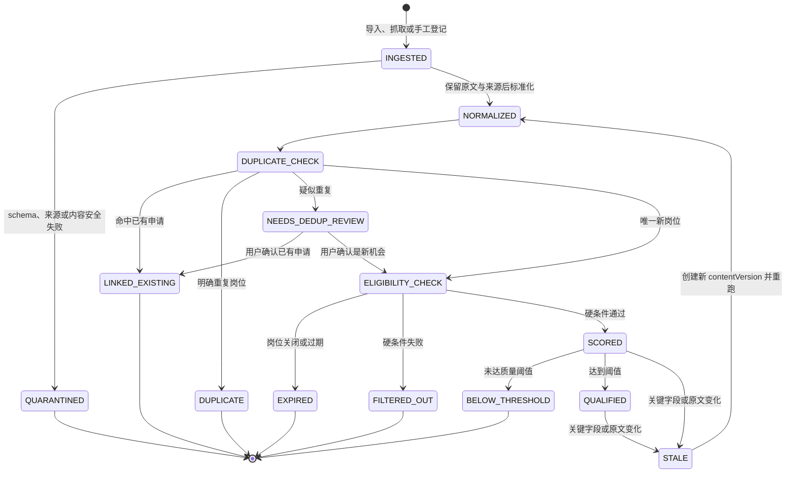
```mermaid
stateDiagram-v2
    %% @anchor JOB_LIFECYCLE
    %% @anchor JOB_FILTER_SCORE
    [*] --> INGESTED : 导入、抓取或手工登记
    INGESTED --> QUARANTINED : schema、来源或内容安全失败
    INGESTED --> NORMALIZED : 保留原文与来源后标准化
    NORMALIZED --> DUPLICATE_CHECK
    DUPLICATE_CHECK --> LINKED_EXISTING : 命中已有申请
    DUPLICATE_CHECK --> DUPLICATE : 明确重复岗位
    DUPLICATE_CHECK --> NEEDS_DEDUP_REVIEW : 疑似重复
    NEEDS_DEDUP_REVIEW --> LINKED_EXISTING : 用户确认已有申请
    NEEDS_DEDUP_REVIEW --> ELIGIBILITY_CHECK : 用户确认是新机会
    DUPLICATE_CHECK --> ELIGIBILITY_CHECK : 唯一新岗位
    ELIGIBILITY_CHECK --> EXPIRED : 岗位关闭或过期
    ELIGIBILITY_CHECK --> FILTERED_OUT : 硬条件失败
    ELIGIBILITY_CHECK --> SCORED : 硬条件通过
    SCORED --> BELOW_THRESHOLD : 未达质量阈值
    SCORED --> QUALIFIED : 达到阈值
    QUALIFIED --> STALE : 关键字段或原文变化
    SCORED --> STALE : 关键字段或原文变化
    STALE --> NORMALIZED : 创建新 contentVersion 并重跑
    LINKED_EXISTING --> [*]
    DUPLICATE --> [*]
    EXPIRED --> [*]
    FILTERED_OUT --> [*]
    BELOW_THRESHOLD --> [*]
    QUARANTINED --> [*]
```

岗位判断的终态不会自动删除 JobPosting 原文和来源快照。`QUALIFIED` 只是允许继续验证 Evidence 和材料，不代表允许投递。

## RF-UML-SM-APP-01 Application 生命周期

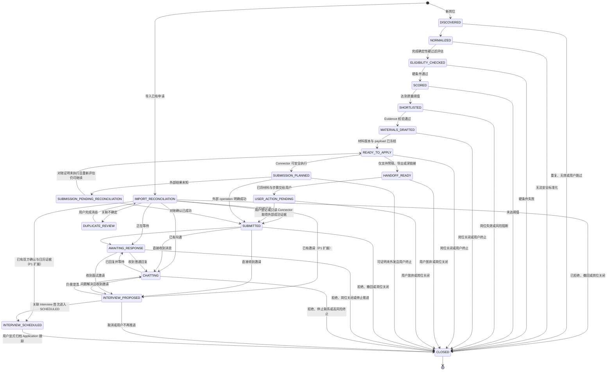
```mermaid
stateDiagram-v2
    %% @anchor APPLICATION_LIFECYCLE
    [*] --> DISCOVERED : 新岗位
    [*] --> IMPORT_RECONCILIATION : 导入已有申请

    IMPORT_RECONCILIATION --> SUBMITTED : 已投递记录
    IMPORT_RECONCILIATION --> AWAITING_RESPONSE : 正在等待
    IMPORT_RECONCILIATION --> CHATTING : 已有沟通
    IMPORT_RECONCILIATION --> INTERVIEW_PROPOSED : 已有邀请（P1 扩展）
    IMPORT_RECONCILIATION --> INTERVIEW_SCHEDULED : 已有双方确认与日历证据（P1 扩展）
    IMPORT_RECONCILIATION --> CLOSED : 已拒绝、撤回或岗位关闭
    IMPORT_RECONCILIATION --> DUPLICATE_REVIEW : 关联不确定
    DUPLICATE_REVIEW --> IMPORT_RECONCILIATION : 用户完成消歧

    DISCOVERED --> NORMALIZED
    NORMALIZED --> ELIGIBILITY_CHECKED : 完成确定性硬过滤评估
    ELIGIBILITY_CHECKED --> SCORED : 硬条件通过
    SCORED --> SHORTLISTED : 达到质量阈值
    SHORTLISTED --> MATERIALS_DRAFTED : Evidence 校验通过
    MATERIALS_DRAFTED --> READY_TO_APPLY : 材料版本与 payload 已冻结
    READY_TO_APPLY --> SUBMISSION_PLANNED : Connector 可安全执行
    READY_TO_APPLY --> HANDOFF_READY : 仅支持预填、导出或深链接
    HANDOFF_READY --> USER_ACTION_PENDING : 已将材料与步骤交给用户
    USER_ACTION_PENDING --> SUBMITTED : 用户登记或只读 Connector 取得外部成功证据
    SUBMISSION_PLANNED --> SUBMITTED : 外部 operation 明确成功
    SUBMISSION_PLANNED --> SUBMISSION_PENDING_RECONCILIATION : 外部结果未知
    SUBMISSION_PENDING_RECONCILIATION --> SUBMITTED : 对账确认已成功
    SUBMISSION_PENDING_RECONCILIATION --> READY_TO_APPLY : 对账证明未执行且重新评估仍可继续
    SUBMITTED --> AWAITING_RESPONSE
    SUBMITTED --> CHATTING : 直接收到消息
    SUBMITTED --> INTERVIEW_PROPOSED : 直接收到邀请
    AWAITING_RESPONSE --> CHATTING : 收到普通回复
    AWAITING_RESPONSE --> INTERVIEW_PROPOSED : 收到面试邀请
    CHATTING --> AWAITING_RESPONSE : 已回复并等待
    CHATTING --> INTERVIEW_PROPOSED : 问题解决且收到邀请
    INTERVIEW_PROPOSED --> CHATTING : 仍需澄清
    INTERVIEW_PROPOSED --> INTERVIEW_SCHEDULED : 关联 Interview 首次进入 SCHEDULED

    DISCOVERED --> CLOSED : 重复、无效或用户跳过
    NORMALIZED --> CLOSED : 无法安全标准化
    ELIGIBILITY_CHECKED --> CLOSED : 硬条件失败
    SCORED --> CLOSED : 未达阈值
    SHORTLISTED --> CLOSED : 岗位失效或风险阻断
    MATERIALS_DRAFTED --> CLOSED : 岗位关闭或用户终止
    READY_TO_APPLY --> CLOSED : 岗位关闭或用户终止
    HANDOFF_READY --> CLOSED : 用户放弃或岗位关闭
    USER_ACTION_PENDING --> CLOSED : 用户放弃或岗位关闭
    SUBMISSION_PLANNED --> CLOSED : 可证明未外发且用户终止
    SUBMITTED --> CLOSED : 拒绝、撤回或岗位关闭
    AWAITING_RESPONSE --> CLOSED : 拒绝、岗位关闭或停止推进
    CHATTING --> CLOSED : 拒绝、停止联系或高风险终止
    INTERVIEW_PROPOSED --> CLOSED : 取消或用户不再推进
    INTERVIEW_SCHEDULED --> CLOSED : 用户显式归档 Application 跟踪
    CLOSED --> [*]
```

说明：

- `Application` 不承载 FollowUpPlan 的到期与计数；跟进禁用或一次额度用尽后仍保持 `AWAITING_RESPONSE` 并继续只读监听。
- `CLOSED` 必须填写原因，例如 duplicate、hard-filter-failed、below-threshold、job-closed、rejected、withdrawn、no-contact、user-skipped、risk-blocked。
- 历史导入是初始化/对账路径，不是从发现阶段伪造一串没有发生过的迁移。
- `SUBMISSION_PENDING_RECONCILIATION` 是 Application 的用户可见派生状态，权威 unknown 状态仍属于 ExternalOperation。
- `SCHEDULED` 只属于 Interview；Application 记录 `INTERVIEW_SCHEDULED` 里程碑。后续改期、取消和完成不让 Application 漏斗倒退。

## RF-UML-SM-MAT-01 MaterialSet 生命周期

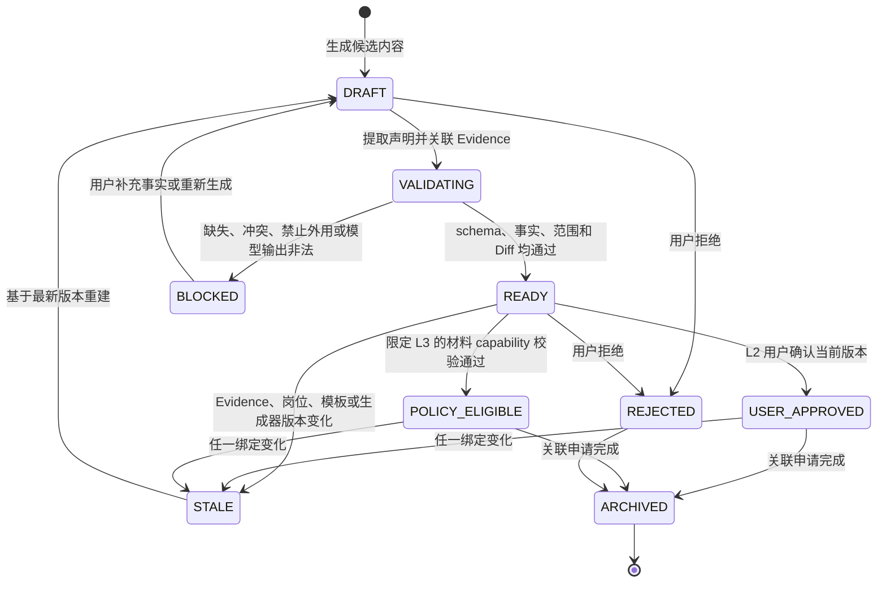
```mermaid
stateDiagram-v2
    %% @anchor MATERIAL_LIFECYCLE
    %% @anchor MATERIAL_EVIDENCE_GATE
    [*] --> DRAFT : 生成候选内容
    DRAFT --> VALIDATING : 提取声明并关联 Evidence
    VALIDATING --> READY : schema、事实、范围和 Diff 均通过
    VALIDATING --> BLOCKED : 缺失、冲突、禁止外用或模型输出非法
    BLOCKED --> DRAFT : 用户补充事实或重新生成
    READY --> USER_APPROVED : L2 用户确认当前版本
    READY --> POLICY_ELIGIBLE : 限定 L3 的材料 capability 校验通过
    READY --> STALE : Evidence、岗位、模板或生成器版本变化
    USER_APPROVED --> STALE : 任一绑定变化
    POLICY_ELIGIBLE --> STALE : 任一绑定变化
    DRAFT --> REJECTED : 用户拒绝
    READY --> REJECTED : 用户拒绝
    STALE --> DRAFT : 基于最新版本重建
    USER_APPROVED --> ARCHIVED : 关联申请完成
    POLICY_ELIGIBLE --> ARCHIVED : 关联申请完成
    REJECTED --> ARCHIVED
    ARCHIVED --> [*]
```

## RF-UML-SM-PLN-01 ActionPlanRecord 生命周期

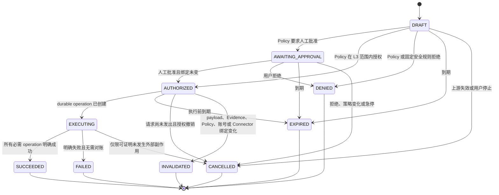
```mermaid
stateDiagram-v2
    %% @anchor ACTION_PLAN_LIFECYCLE
    %% @anchor ACTION_AUTHORIZATION
    [*] --> DRAFT
    DRAFT --> AWAITING_APPROVAL : Policy 要求人工批准
    DRAFT --> AUTHORIZED : Policy 在 L3 范围内授权
    DRAFT --> DENIED : Policy 或固定安全规则拒绝
    DRAFT --> EXPIRED : 到期
    DRAFT --> CANCELLED : 上游失效或用户停止
    AWAITING_APPROVAL --> AUTHORIZED : 人工批准且绑定未变
    AWAITING_APPROVAL --> DENIED : 用户拒绝
    AWAITING_APPROVAL --> EXPIRED : 到期
    AWAITING_APPROVAL --> CANCELLED : 拒绝、策略变化或急停
    AUTHORIZED --> EXECUTING : durable operation 已创建
    AUTHORIZED --> EXPIRED : 执行前到期
    AUTHORIZED --> CANCELLED : 请求尚未发出且授权撤销
    AUTHORIZED --> INVALIDATED : payload、Evidence、Policy、账号或 Connector 绑定变化
    EXECUTING --> SUCCEEDED : 所有必需 operation 明确成功
    EXECUTING --> FAILED : 明确失败且无需对账
    EXECUTING --> CANCELLED : 仅限可证明未发生外部副作用
    SUCCEEDED --> [*]
    FAILED --> [*]
    DENIED --> [*]
    EXPIRED --> [*]
    CANCELLED --> [*]
    INVALIDATED --> [*]
```

不可变 `ActionPlan` 是本状态记录的载荷；状态和 CAS 版本保存在 `ActionPlanRecord`。`OUTCOME_UNKNOWN` 不进入本状态机，而由 ExternalOperation 表达。只要任一 operation 未完成对账，ActionPlanRecord 保持 `EXECUTING`，UI 展示派生状态“正在对账”。失败后的业务重试创建带 `retryOf` 的新 ActionPlan。

## RF-UML-SM-OPR-01 ExternalOperation 生命周期

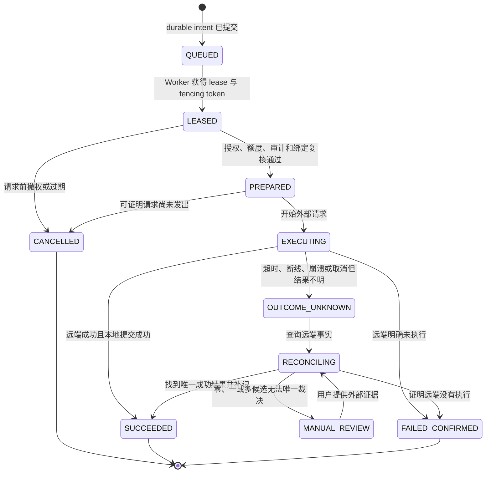
```mermaid
stateDiagram-v2
    %% @anchor OPERATION_LIFECYCLE
    [*] --> QUEUED : durable intent 已提交
    QUEUED --> LEASED : Worker 获得 lease 与 fencing token
    LEASED --> PREPARED : 授权、额度、审计和绑定复核通过
    LEASED --> CANCELLED : 请求前撤权或过期
    PREPARED --> EXECUTING : 开始外部请求
    PREPARED --> CANCELLED : 可证明请求尚未发出
    EXECUTING --> SUCCEEDED : 远端成功且本地提交成功
    EXECUTING --> FAILED_CONFIRMED : 远端明确未执行
    EXECUTING --> OUTCOME_UNKNOWN : 超时、断线、崩溃或取消但结果不明
    OUTCOME_UNKNOWN --> RECONCILING : 查询远端事实
    RECONCILING --> SUCCEEDED : 找到唯一成功结果并补记
    RECONCILING --> FAILED_CONFIRMED : 证明远端没有执行
    RECONCILING --> MANUAL_REVIEW : 零、一或多候选无法唯一裁决
    MANUAL_REVIEW --> RECONCILING : 用户提供外部证据
    CANCELLED --> [*]
    SUCCEEDED --> [*]
    FAILED_CONFIRMED --> [*]
```

状态不变量：同一 operation 的 idempotency key 永不改变；lease 接管后旧 fencing token 不能提交；普通 retry 不能把 `OUTCOME_UNKNOWN` 直接改成 EXECUTING。复合业务若需要补偿，由 Saga 创建新的补偿 ActionPlan 和 ExternalOperation，原 operation 的历史状态保持不变。

## RF-UML-SM-EXC-01 Exception 生命周期

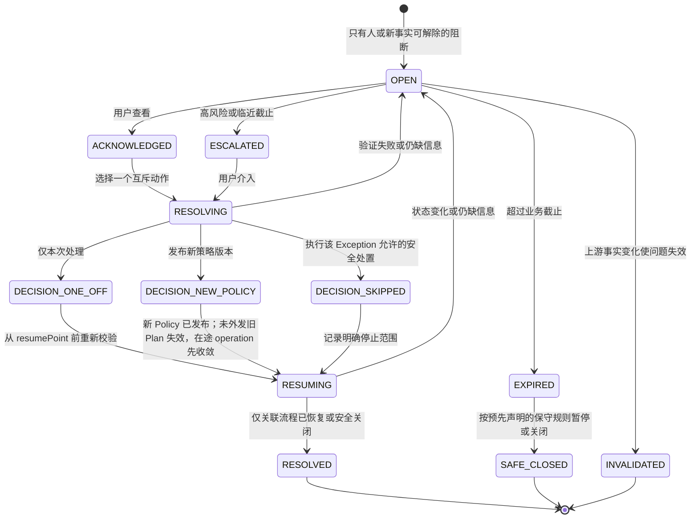
```mermaid
stateDiagram-v2
    %% @anchor EXCEPTION_LIFECYCLE
    %% @anchor OPEN
    %% @anchor ESCALATED
    %% @anchor EXPIRED
    [*] --> OPEN : 只有人或新事实可解除的阻断
    OPEN --> ACKNOWLEDGED : 用户查看
    OPEN --> ESCALATED : 高风险或临近截止
    OPEN --> EXPIRED : 超过业务截止
    OPEN --> INVALIDATED : 上游事实变化使问题失效
    ACKNOWLEDGED --> RESOLVING : 选择一个互斥动作
    ESCALATED --> RESOLVING : 用户介入
    RESOLVING --> DECISION_ONE_OFF : 仅本次处理
    RESOLVING --> DECISION_NEW_POLICY : 发布新策略版本
    RESOLVING --> DECISION_SKIPPED : 执行该 Exception 允许的安全处置
    RESOLVING --> OPEN : 验证失败或仍缺信息
    DECISION_ONE_OFF --> RESUMING : 从 resumePoint 前重新校验
    DECISION_NEW_POLICY --> RESUMING : 新 Policy 已发布；未外发旧 Plan 失效，在途 operation 先收敛
    DECISION_SKIPPED --> RESUMING : 记录明确停止范围
    RESUMING --> RESOLVED : 仅关联流程已恢复或安全关闭
    RESUMING --> OPEN : 状态变化或仍缺信息
    EXPIRED --> SAFE_CLOSED : 按预先声明的保守规则暂停或关闭
    RESOLVED --> [*]
    SAFE_CLOSED --> [*]
    INVALIDATED --> [*]
```

恢复必须发生在 `RESOLVED` 终态之前，且只恢复 `resumePoint` 指向的关联流程。`DECISION_NEW_POLICY` 必须先展示 Diff；它只直接使尚未外发的 `DRAFT`、`AWAITING_APPROVAL`、`AUTHORIZED` 旧计划失效。已有 `PREPARED` / `EXECUTING` operation 时，能证明未发才取消，否则进入 `OUTCOME_UNKNOWN → RECONCILING`，ActionPlan 保持 `EXECUTING` 到子操作终态。不能把一次回答悄悄学习成全局规则。聚合通知可以引用多个 Exception，但每个 Exception 仍只包含一个决策问题。

## RF-UML-SM-MSG-01 CommunicationThread 与消息处理

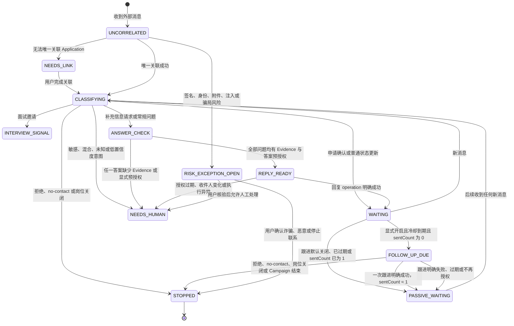
```mermaid
stateDiagram-v2
    %% @anchor MESSAGE_LIFECYCLE
    %% @anchor FOLLOWUP_DISABLED
    %% @anchor FOLLOWUP_ONCE
    %% @anchor PASSIVE_MONITORING
    [*] --> UNCORRELATED : 收到外部消息
    UNCORRELATED --> RISK_EXCEPTION_OPEN : 签名、身份、附件、注入或骗局风险
    UNCORRELATED --> NEEDS_LINK : 无法唯一关联 Application
    NEEDS_LINK --> CLASSIFYING : 用户完成关联
    UNCORRELATED --> CLASSIFYING : 唯一关联成功
    CLASSIFYING --> STOPPED : 拒绝、no-contact 或岗位关闭
    CLASSIFYING --> INTERVIEW_SIGNAL : 面试邀请
    CLASSIFYING --> WAITING : 申请确认或普通状态更新
    CLASSIFYING --> ANSWER_CHECK : 补充信息请求或常规问题
    CLASSIFYING --> NEEDS_HUMAN : 敏感、混合、未知或低置信度意图
    ANSWER_CHECK --> NEEDS_HUMAN : 任一答案缺少 Evidence 或显式预授权
    ANSWER_CHECK --> REPLY_READY : 全部问题均有 Evidence 与答案预授权
    REPLY_READY --> WAITING : 回复 operation 明确成功
    REPLY_READY --> NEEDS_HUMAN : 授权过期、收件人变化或执行异常
    WAITING --> CLASSIFYING : 新消息
    WAITING --> FOLLOW_UP_DUE : 显式开启且冷却到期且 sentCount 为 0
    WAITING --> PASSIVE_WAITING : 跟进默认关闭、已过期或 sentCount 已为 1
    FOLLOW_UP_DUE --> PASSIVE_WAITING : 一次跟进明确成功，sentCount = 1
    FOLLOW_UP_DUE --> PASSIVE_WAITING : 跟进明确失败、过期或不再授权
    FOLLOW_UP_DUE --> STOPPED : 拒绝、no-contact、岗位关闭或 Campaign 结束
    PASSIVE_WAITING --> CLASSIFYING : 后续收到任何新消息
    RISK_EXCEPTION_OPEN --> NEEDS_HUMAN : 用户核验后允许人工处理
    RISK_EXCEPTION_OPEN --> STOPPED : 用户确认诈骗、恶意或停止联系
    STOPPED --> [*]
```

Webhook 与 polling 导入首先按 account、thread、external message ID 去重并按 revision 合并，状态机只消费最新、已确认的线程事实。`PASSIVE_WAITING` 仍持续只读同步；它只禁止继续自动跟进，不代表 Application 或 CommunicationThread 已关闭。AnswerPreauthorization 空集合表示全部禁止自动回答。

## RF-UML-SM-INT-01 Interview 生命周期

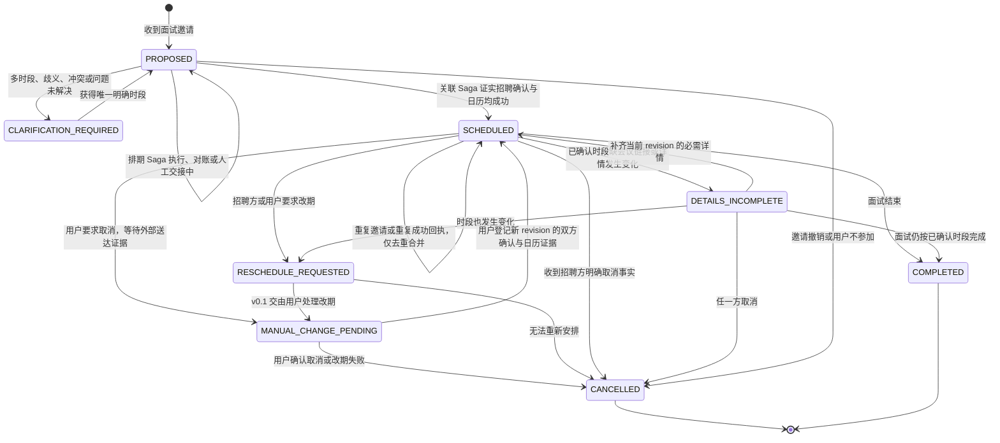
```mermaid
stateDiagram-v2
    %% @anchor INTERVIEW_LIFECYCLE
    [*] --> PROPOSED : 收到面试邀请
    PROPOSED --> PROPOSED : 重复邀请同一 revision，仅合并来源证据
    PROPOSED --> CLARIFICATION_REQUIRED : 多时段、歧义、冲突或问题未解决
    CLARIFICATION_REQUIRED --> PROPOSED : 获得唯一明确时段
    PROPOSED --> PROPOSED : 排期 Saga 执行、对账或人工交接中
    PROPOSED --> SCHEDULED : 关联 Saga 证实招聘确认与日历均成功
    SCHEDULED --> SCHEDULED : 重复邀请或重复成功回执，仅去重合并
    SCHEDULED --> DETAILS_INCOMPLETE : 已确认时段缺会议链接或详情发生变化
    DETAILS_INCOMPLETE --> SCHEDULED : 补齐当前 revision 的必需详情
    SCHEDULED --> RESCHEDULE_REQUESTED : 招聘方或用户要求改期
    SCHEDULED --> MANUAL_CHANGE_PENDING : 用户要求取消，等待外部送达证据
    DETAILS_INCOMPLETE --> RESCHEDULE_REQUESTED : 时段也发生变化
    RESCHEDULE_REQUESTED --> MANUAL_CHANGE_PENDING : v0.1 交由用户处理改期
    MANUAL_CHANGE_PENDING --> SCHEDULED : 用户登记新 revision 的双方确认与日历证据
    MANUAL_CHANGE_PENDING --> CANCELLED : 用户确认取消或改期失败
    RESCHEDULE_REQUESTED --> CANCELLED : 无法重新安排
    SCHEDULED --> CANCELLED : 收到招聘方明确取消事实
    DETAILS_INCOMPLETE --> CANCELLED : 任一方取消
    SCHEDULED --> COMPLETED : 面试结束
    DETAILS_INCOMPLETE --> COMPLETED : 面试仍按已确认时段完成
    PROPOSED --> CANCELLED : 邀请撤销或用户不参加
    CANCELLED --> [*]
    COMPLETED --> [*]
```

Interview 只保存业务事实；`SCHEDULING`、`PARTIAL` 和 `RECONCILING` 属于 `RF-UML-SM-SAGA-01`。首次排期在两项外部成功都得到证据前始终保持 `PROPOSED`。首次进入 `SCHEDULED` 触发核心交付通知；重复 revision 不重复回复、不重复建日历事件，也不重复发送同一通知。`DETAILS_INCOMPLETE` 仍表示时段已确认，只是交付包不完整。Application 只记录首次 `INTERVIEW_SCHEDULED` 里程碑；Interview 后续改期、取消和完成不会让 Application 漏斗倒退。v0.1 的改期和取消默认交由用户处理，活动见 `RF-UML-ACT-INTCHANGE-01`。

## RF-UML-SM-SAGA-01 InterviewSchedulingSaga 生命周期

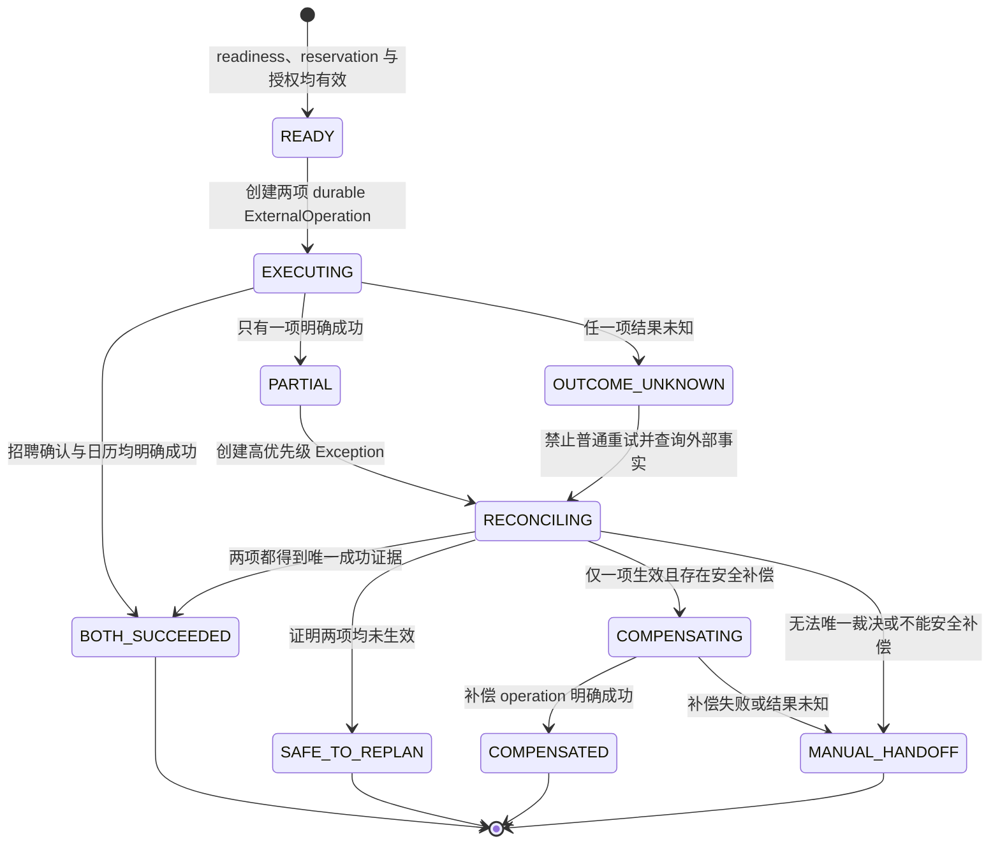
```mermaid
stateDiagram-v2
    %% @anchor INTERVIEW_SAGA
    %% @anchor PARTIAL_RECONCILIATION
    [*] --> READY : readiness、reservation 与授权均有效
    READY --> EXECUTING : 创建两项 durable ExternalOperation
    EXECUTING --> BOTH_SUCCEEDED : 招聘确认与日历均明确成功
    EXECUTING --> PARTIAL : 只有一项明确成功
    EXECUTING --> OUTCOME_UNKNOWN : 任一项结果未知
    PARTIAL --> RECONCILING : 创建高优先级 Exception
    OUTCOME_UNKNOWN --> RECONCILING : 禁止普通重试并查询外部事实
    RECONCILING --> BOTH_SUCCEEDED : 两项都得到唯一成功证据
    RECONCILING --> SAFE_TO_REPLAN : 证明两项均未生效
    RECONCILING --> COMPENSATING : 仅一项生效且存在安全补偿
    RECONCILING --> MANUAL_HANDOFF : 无法唯一裁决或不能安全补偿
    COMPENSATING --> COMPENSATED : 补偿 operation 明确成功
    COMPENSATING --> MANUAL_HANDOFF : 补偿失败或结果未知
    BOTH_SUCCEEDED --> [*]
    SAFE_TO_REPLAN --> [*]
    COMPENSATED --> [*]
    MANUAL_HANDOFF --> [*]
```

只有 `BOTH_SUCCEEDED` 可以使 Interview 从 `PROPOSED` 进入 `SCHEDULED`。`SAFE_TO_REPLAN` 和 `COMPENSATED` 仍保持 Interview 为 `PROPOSED`；人工交接后也必须由用户提供两侧外部证据，不能仅凭“已交给用户”标记成功。进入 `COMPENSATING` 前必须创建新的补偿 ActionPlan、Authorization 与 ExternalOperation；原来已成功的子 operation 永久保留 `SUCCEEDED`。补偿能力要求由 `<<proposed DEC-12>>` 确认。

## RF-UML-SM-NOT-01 Notification 生命周期

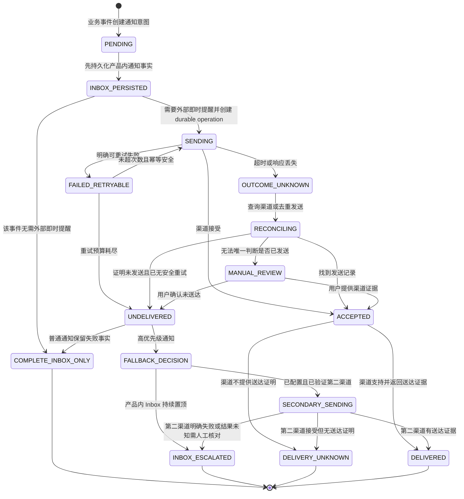
```mermaid
stateDiagram-v2
    %% @anchor NOTIFICATION_LIFECYCLE
    [*] --> PENDING : 业务事件创建通知意图
    PENDING --> INBOX_PERSISTED : 先持久化产品内通知事实
    INBOX_PERSISTED --> COMPLETE_INBOX_ONLY : 该事件无需外部即时提醒
    INBOX_PERSISTED --> SENDING : 需要外部即时提醒并创建 durable operation
    SENDING --> ACCEPTED : 渠道接受
    SENDING --> FAILED_RETRYABLE : 明确可重试失败
    SENDING --> OUTCOME_UNKNOWN : 超时或响应丢失
    FAILED_RETRYABLE --> SENDING : 未超次数且幂等安全
    FAILED_RETRYABLE --> UNDELIVERED : 重试预算耗尽
    OUTCOME_UNKNOWN --> RECONCILING : 查询渠道或去重发送
    RECONCILING --> ACCEPTED : 找到发送记录
    RECONCILING --> UNDELIVERED : 证明未发送且已无安全重试
    RECONCILING --> MANUAL_REVIEW : 无法唯一判断是否已发送
    MANUAL_REVIEW --> ACCEPTED : 用户提供渠道证据
    MANUAL_REVIEW --> UNDELIVERED : 用户确认未送达
    ACCEPTED --> DELIVERED : 渠道支持并返回送达证据
    ACCEPTED --> DELIVERY_UNKNOWN : 渠道不提供送达证明
    UNDELIVERED --> FALLBACK_DECISION : 高优先级通知
    UNDELIVERED --> COMPLETE_INBOX_ONLY : 普通通知保留失败事实
    FALLBACK_DECISION --> INBOX_ESCALATED : 产品内 Inbox 持续置顶
    FALLBACK_DECISION --> SECONDARY_SENDING : 已配置且已验证第二渠道
    SECONDARY_SENDING --> DELIVERED : 第二渠道有送达证据
    SECONDARY_SENDING --> DELIVERY_UNKNOWN : 第二渠道接受但无送达证明
    SECONDARY_SENDING --> INBOX_ESCALATED : 第二渠道明确失败或结果未知需人工核对
    COMPLETE_INBOX_ONLY --> [*]
    INBOX_ESCALATED --> [*]
    DELIVERY_UNKNOWN --> [*]
    DELIVERED --> [*]
```

产品内 Inbox 是 durable 事实来源，但设备或应用离线时不能宣称用户已经看到。高优先级外部通知失败后的“只保留产品内置顶”与“尝试已验证第二渠道”尚待 `<<proposed DEC-04>>` 确认。任何通知渠道失败都不能把 Interview 从 `SCHEDULED` 改回其他状态。

## RF-UML-SM-POL-01 自动化等级与三级暂停

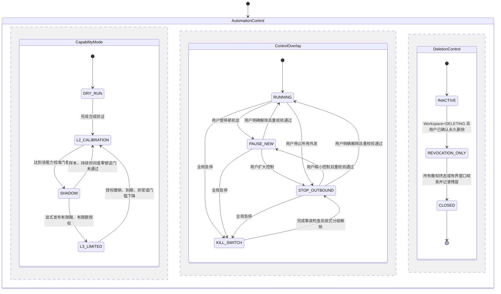
```mermaid
stateDiagram-v2
    %% @anchor AUTOMATION_CONTROL
    %% @anchor CONTROL_ORTHOGONAL
    %% @anchor POLICY_CONSTRAINTS
    %% @anchor QUOTA_LIMITS
    state AutomationControl {
        state CapabilityMode {
            [*] --> DRY_RUN
            DRY_RUN --> L2_CALIBRATION : 完成合成验证
            L2_CALIBRATION --> SHADOW : 达到该能力校准门槛
            SHADOW --> L3_LIMITED : 显式发布有限期、有限额授权
            SHADOW --> L2_CALIBRATION : 样本、持续时间或零错误门未通过
            L3_LIMITED --> L2_CALIBRATION : 授权撤销、到期、异常或门槛下降
        }
        --
        state ControlOverlay {
            [*] --> RUNNING
            RUNNING --> PAUSE_NEW : 用户暂停新机会
            PAUSE_NEW --> STOP_OUTBOUND : 用户扩大控制
            RUNNING --> STOP_OUTBOUND : 用户停止所有外发
            RUNNING --> KILL_SWITCH : 全局急停
            PAUSE_NEW --> KILL_SWITCH : 全局急停
            STOP_OUTBOUND --> KILL_SWITCH : 全局急停
            STOP_OUTBOUND --> PAUSE_NEW : 用户缩小控制且重校验通过
            PAUSE_NEW --> RUNNING : 用户明确解除且重校验通过
            STOP_OUTBOUND --> RUNNING : 用户明确解除且重校验通过
            KILL_SWITCH --> STOP_OUTBOUND : 完成事故检查后显式分级解除
        }
        --
        state DeletionControl {
            [*] --> INACTIVE
            INACTIVE --> REVOCATION_ONLY : Workspace=DELETING 且用户已确认永久删除
            REVOCATION_ONLY --> CLOSED : 所有撤权终态或有界窗口结束并记录残留
            CLOSED --> [*]
        }
    }
    [*] --> AutomationControl
```

`CapabilityMode` 按发现、材料、投递、回复、跟进、约面等能力分别保存；`ControlOverlay` 是 Workspace 级独立覆盖层。有效权限始终取“能力模式 × 当前 Policy 版本 × 控制覆盖层 × RuntimeHealth”的交集。进入或退出暂停不会改写所保存的原能力模式，也不会复活旧 ActionPlan；恢复前必须按最新绑定重新校验。解除 `STOP_OUTBOUND` 或 `KILL_SWITCH` 后实际先回 L2、再逐能力重开 L3 的建议尚待 `<<proposed DEC-19>>` 确认，未确认前按失败关闭处理。

`DeletionControl` 不恢复、放宽或绕过任何业务 capability。它只在用户另行确认永久删除、Workspace 已进入 `DELETING` 时短暂变为 `REVOCATION_ONLY`，仅接受绑定本次删除请求和固定 Connector account 的 `credential_revocation` Plan；该 Plan 仍需 Policy、Authorization、durable Operation、AuditIntent、Outbox、幂等与未知结果对账。其他投递、回复、跟进、约面和外部通知继续受 `STOP_OUTBOUND` / `KILL_SWITCH` 拒绝。

| 模式或控制 | 新岗位发现 | 只读消息与对账 | 新投递 | 已有申请回复/跟进/约面 | 通知 |
| --- | --- | --- | --- | --- | --- |
| DRY_RUN | 允许 | 允许 | 仅预览 | 仅预览 | 仅测试 |
| L2_CALIBRATION | 允许 | 允许 | 逐次批准 | 逐次批准 | 按通知规则 |
| L3_LIMITED | 允许 | 允许 | 按能力授权 | 按能力授权 | 按通知规则 |
| PAUSE_NEW | 停止新抓取；未投递机会只读保留且不建新 Plan | 继续 | 禁止 | 已有申请按原能力模式和 Policy 继续 | 按通知规则 |
| STOP_OUTBOUND | 可继续内部发现与评分但不建外发 Plan | 必须继续 | 禁止 | 禁止新外发；在途只对账 | 产品内安全/状态事实继续 |
| KILL_SWITCH | 停止调度与自动 mutation；非关键读取可继续 | 必须继续 | 全拒绝 | 全拒绝；已发请求进入对账 | 产品内安全事件继续；外部安全通知是否豁免见 `<<proposed DEC-18>>` |
| REVOCATION_ONLY（仅 Workspace=DELETING） | 禁止 | 允许既有业务 unknown 的只读收敛与撤权对账；新外发仅限 credential_revocation | 禁止 | 禁止 | 仅产品内删除进度；外部通知禁止 |

普通离线是 RuntimeHealth 事件，不是人工控制状态：组件恢复不会自动解除 `PAUSE_NEW`、`STOP_OUTBOUND` 或 `KILL_SWITCH`。三级控制只通过用户的显式命令改变。

## RF-UML-SM-POLVER-01 Policy 版本生命周期

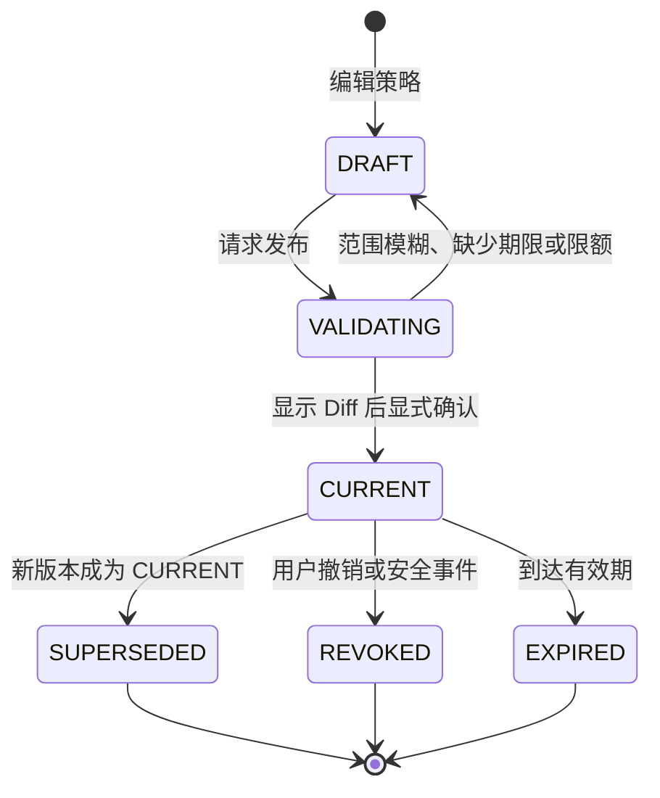
```mermaid
stateDiagram-v2
    %% @anchor POLICY_VERSIONING
    [*] --> DRAFT : 编辑策略
    DRAFT --> VALIDATING : 请求发布
    VALIDATING --> DRAFT : 范围模糊、缺少期限或限额
    VALIDATING --> CURRENT : 显示 Diff 后显式确认
    CURRENT --> SUPERSEDED : 新版本成为 CURRENT
    CURRENT --> REVOKED : 用户撤销或安全事件
    CURRENT --> EXPIRED : 到达有效期
    SUPERSEDED --> [*]
    REVOKED --> [*]
    EXPIRED --> [*]
```

任一版本离开 `CURRENT` 时，只直接失效引用该版本且尚未外发的 `DRAFT`、`AWAITING_APPROVAL`、`AUTHORIZED` ActionPlan 与对应授权。已经拥有 `PREPARED` / `EXECUTING` ExternalOperation 的 Plan 保持 `EXECUTING`：可证明请求未发则将 operation 记为 `CANCELLED` / `FAILED_CONFIRMED`，可能已发则记为 `OUTCOME_UNKNOWN` 并对账，直到全部子操作进入可证明终态。回退历史配置也必须发布新的版本号，不能让旧授权复活。

## RF-UML-SM-RUN-01 Connector、Worker 与 Runner 健康状态

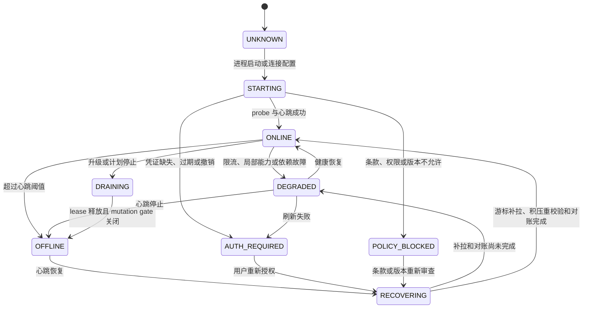
```mermaid
stateDiagram-v2
    %% @anchor RUNTIME_HEALTH
    %% @anchor DEGRADED
    %% @anchor POLICY_BLOCKED
    [*] --> UNKNOWN
    UNKNOWN --> STARTING : 进程启动或连接配置
    STARTING --> ONLINE : probe 与心跳成功
    STARTING --> AUTH_REQUIRED : 凭证缺失、过期或撤销
    STARTING --> POLICY_BLOCKED : 条款、权限或版本不允许
    ONLINE --> DEGRADED : 限流、局部能力或依赖故障
    ONLINE --> OFFLINE : 超过心跳阈值
    DEGRADED --> ONLINE : 健康恢复
    DEGRADED --> OFFLINE : 心跳停止
    DEGRADED --> AUTH_REQUIRED : 刷新失败
    ONLINE --> DRAINING : 升级或计划停止
    DRAINING --> OFFLINE : lease 释放且 mutation gate 关闭
    OFFLINE --> RECOVERING : 心跳恢复
    AUTH_REQUIRED --> RECOVERING : 用户重新授权
    POLICY_BLOCKED --> RECOVERING : 条款或版本重新审查
    RECOVERING --> DEGRADED : 补拉和对账尚未完成
    RECOVERING --> ONLINE : 游标补拉、积压重校验和对账完成
```

健康状态按 Worker、Runner、Connector 和 capability 分别记录。Worker 离线形成监控空窗；Runner 离线只阻止它承载的执行，Worker 仍可做允许的读取、同步与对账。普通离线恢复仅补拉、去重、对账并重校验积压，不改变人工控制覆盖层，也不把 Campaign 状态当作进程在线证据。恢复重校验只直接失效未外发 Plan；已有 `PREPARED` / `EXECUTING` operation 必须按“证明未发则取消、可能已发则 `OUTCOME_UNKNOWN → RECONCILING`”收敛，父 Plan 在此期间保持 `EXECUTING`。

## RF-UML-SM-DAT-01 数据删除、备份恢复与 mutation gate

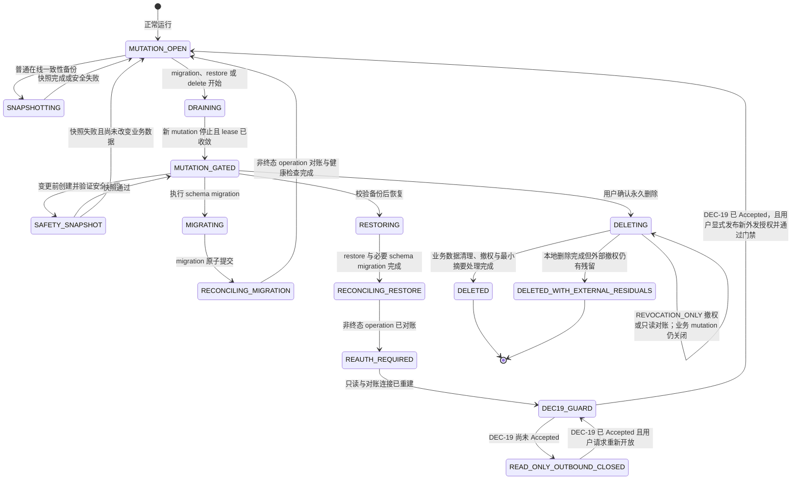
```mermaid
stateDiagram-v2
    %% @anchor DATA_MUTATION_GATE
    [*] --> MUTATION_OPEN : 正常运行
    MUTATION_OPEN --> SNAPSHOTTING : 普通在线一致性备份
    SNAPSHOTTING --> MUTATION_OPEN : 快照完成或安全失败
    MUTATION_OPEN --> DRAINING : migration、restore 或 delete 开始
    DRAINING --> MUTATION_GATED : 新 mutation 停止且 lease 已收敛
    MUTATION_GATED --> SAFETY_SNAPSHOT : 变更前创建并验证安全快照
    SAFETY_SNAPSHOT --> MUTATION_GATED : 快照通过
    SAFETY_SNAPSHOT --> MUTATION_OPEN : 快照失败且尚未改变业务数据
    MUTATION_GATED --> MIGRATING : 执行 schema migration
    MIGRATING --> RECONCILING_MIGRATION : migration 原子提交
    RECONCILING_MIGRATION --> MUTATION_OPEN : 非终态 operation 对账与健康检查完成
    MUTATION_GATED --> RESTORING : 校验备份后恢复
    RESTORING --> RECONCILING_RESTORE : restore 与必要 schema migration 完成
    RECONCILING_RESTORE --> REAUTH_REQUIRED : 非终态 operation 已对账
    REAUTH_REQUIRED --> DEC19_GUARD : 只读与对账连接已重建
    DEC19_GUARD --> READ_ONLY_OUTBOUND_CLOSED : DEC-19 尚未 Accepted
    READ_ONLY_OUTBOUND_CLOSED --> DEC19_GUARD : DEC-19 已 Accepted 且用户请求重新开放
    DEC19_GUARD --> MUTATION_OPEN : DEC-19 已 Accepted，且用户显式发布新外发授权并通过门禁
    MUTATION_GATED --> DELETING : 用户确认永久删除
    DELETING --> DELETING : REVOCATION_ONLY 撤权或只读对账；业务 mutation 仍关闭
    DELETING --> DELETED : 业务数据清理、撤权与最小摘要处理完成
    DELETING --> DELETED_WITH_EXTERNAL_RESIDUALS : 本地删除完成但外部撤权仍有残留
    DELETED --> [*]
    DELETED_WITH_EXTERNAL_RESIDUALS --> [*]
```

任何 corrupt、future-schema、wrong-key 或 ledger-missing 备份都在替换现有数据前失败。普通在线备份只使用一致性快照，不 drain Worker，也不关闭 mutation gate。只有 migration、restore 和 delete 先 drain/fence。`DELETING` 的自循环只允许独立 `REVOCATION_ONLY` 删除控制面做固定目标撤权和只读对账，绝不重开业务 mutation gate。恢复只还原业务事实、审计与幂等账本，不还原可复用凭证、一次性 token 或旧 L3 授权；在 `<<proposed DEC-19>>` 未 Accepted 前必须停留在 `READ_ONLY_OUTBOUND_CLOSED`。migration 不是 restore，不应无故撤销仍有效的凭证和能力模式；普通短时离线也不经过本 restore guard。
