# RoleFox v0.1 状态机

- 状态：Accepted Design Baseline
- 上级索引：[UML 设计基线](README.md)
- 术语约定：所有“结果未知”“待对账”统一建模为 `OUTCOME_UNKNOWN`。

状态机的基本原则是：Application、ActionPlan、ExternalOperation、Exception、Interview 和 Notification 分别保存自己的事实，任何一个对象的成功都不能代替另一个对象的成功。

## RF-UML-SM-WS-01 Workspace 与首次配置

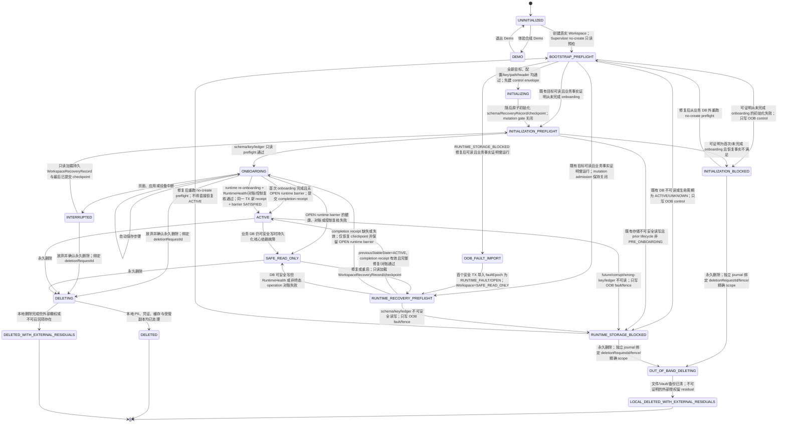
```mermaid
stateDiagram-v2
    %% @anchor WORKSPACE_ONBOARDING
    %% @anchor WORKSPACE_INITIALIZATION_RECOVERY_GUARD
    %% @anchor WORKSPACE_RUNTIME_RECOVERY_GUARD
    [*] --> UNINITIALIZED
    UNINITIALIZED --> DEMO : 体验合成 Demo
    DEMO --> UNINITIALIZED : 退出 Demo
    UNINITIALIZED --> BOOTSTRAP_PREFLIGHT : 创建真实 Workspace；Supervisor no-create 只读预检
    BOOTSTRAP_PREFLIGHT --> INITIALIZING : 全新目标、配置/key/path/header 均通过；先建 control envelope
    BOOTSTRAP_PREFLIGHT --> INITIALIZATION_PREFLIGHT : 既有目标可读且业务事实证明从未完成 onboarding
    BOOTSTRAP_PREFLIGHT --> RUNTIME_RECOVERY_PREFLIGHT : 既有目标可读且业务事实证明曾运行；mutation admission 保持关闭
    BOOTSTRAP_PREFLIGHT --> OOB_FAULT_IMPORT : RUNTIME_STORAGE_BLOCKED 修复后可读且业务事实证明曾运行
    OOB_FAULT_IMPORT --> RUNTIME_RECOVERY_PREFLIGHT : 首个安全 TX 导入 faultEpoch 为 RUNTIME_FAULT/OPEN；Workspace=SAFE_READ_ONLY
    BOOTSTRAP_PREFLIGHT --> INITIALIZATION_BLOCKED : 可证明从未完成 onboarding 的初始化失败；只写 OOB control
    BOOTSTRAP_PREFLIGHT --> RUNTIME_STORAGE_BLOCKED : 既有 DB 不可读或生命周期为 ACTIVE/UNKNOWN；只写 OOB control
    INITIALIZING --> INITIALIZATION_PREFLIGHT : 随后原子初始化 schema/RecoveryRecord/checkpoint；mutation gate 关闭
    INITIALIZATION_PREFLIGHT --> ONBOARDING : schema/key/ledger 只读 preflight 通过
    INITIALIZATION_PREFLIGHT --> INITIALIZATION_BLOCKED : 可证明为首次/未完成 onboarding 且恢复事实不满足
    INITIALIZATION_PREFLIGHT --> RUNTIME_STORAGE_BLOCKED : 既有存储不可安全读写且 prior lifecycle 非 PRE_ONBOARDING
    INITIALIZATION_BLOCKED --> BOOTSTRAP_PREFLIGHT : 修复后从业务 DB 外重跑 no-create preflight
    INITIALIZATION_BLOCKED --> OUT_OF_BAND_DELETING : 永久删除；独立 journal 绑定 deletionRequestId/fence/精确 scope
    RUNTIME_STORAGE_BLOCKED --> BOOTSTRAP_PREFLIGHT : 修复后重跑 no-create preflight；不得直接恢复 ACTIVE
    RUNTIME_STORAGE_BLOCKED --> OUT_OF_BAND_DELETING : 永久删除；独立 journal 绑定 deletionRequestId/fence/精确 scope
    OUT_OF_BAND_DELETING --> LOCAL_DELETED_WITH_EXTERNAL_RESIDUALS : 文件/Vault/备份已清；不可证明的外部授权留 residual
    LOCAL_DELETED_WITH_EXTERNAL_RESIDUALS --> [*]
    ONBOARDING --> ONBOARDING : 自动保存步骤
    ONBOARDING --> INTERRUPTED : 页面、应用或设备中断
    INTERRUPTED --> INITIALIZATION_PREFLIGHT : 只读加载持久 WorkspaceRecoveryRecord 与最后已提交 checkpoint
    ONBOARDING --> DELETING : 放弃并确认永久删除；绑定 deletionRequestId
    INTERRUPTED --> DELETING : 放弃并确认永久删除；绑定 deletionRequestId
    ONBOARDING --> ACTIVE : 首次 onboarding 完成且无 OPEN runtime barrier；提交 completion receipt
    ONBOARDING --> ACTIVE : runtime re-onboarding + RuntimeHealth/对账/控制复核通过；同一 TX 新 receipt + barrier SATISFIED
    ONBOARDING --> SAFE_READ_ONLY : OPEN runtime barrier 的健康、对账或控制复核失败
    ACTIVE --> SAFE_READ_ONLY : 业务 DB 仍可安全写时持久化核心依赖故障
    ACTIVE --> RUNTIME_STORAGE_BLOCKED : future/corrupt/wrong-key/ledger 不可读；只写 OOB fault/fence
    SAFE_READ_ONLY --> RUNTIME_RECOVERY_PREFLIGHT : 修复或重启；只读加载 WorkspaceRecoveryRecord/checkpoint
    RUNTIME_RECOVERY_PREFLIGHT --> ACTIVE : previousStableState=ACTIVE、completion receipt 有效且完整修复/对账通过
    RUNTIME_RECOVERY_PREFLIGHT --> ONBOARDING : completion receipt 缺失或失效；仅恢复 checkpoint 并保留 OPEN runtime barrier
    RUNTIME_RECOVERY_PREFLIGHT --> SAFE_READ_ONLY : DB 可安全写但 RuntimeHealth 或非终态 operation 对账失败
    RUNTIME_RECOVERY_PREFLIGHT --> RUNTIME_STORAGE_BLOCKED : schema/key/ledger 不可安全读写；只写 OOB fault/fence
    ACTIVE --> DELETING : 永久删除
    SAFE_READ_ONLY --> DELETING : 永久删除
    DELETING --> DELETED : 本地 PII、凭证、缓存与受管副本均已处理
    DELETING --> DELETED_WITH_EXTERNAL_RESIDUALS : 本地删除完成但外部撤权或不可召回项存在
    DELETED --> [*]
    DELETED_WITH_EXTERNAL_RESIDUALS --> [*]
```

Workspace 不承载 Campaign、L2/L3 或三级暂停状态。`WorkspaceRecoveryRecord` 是业务 DB 可读时的恢复决策持久事实；中断页面或进程不能仅凭客户端步骤直接回到 `ONBOARDING`。系统必须先由业务 DB 外的 Supervisor 关闭 mutation admission，再以 immutable/read-only/no-create 方式加载 recovery record 与最后已提交 checkpoint，校验 Workspace 所有权、checkpoint revision/inputHash 以及 schema/key/migration ledger 完整性。只有能够证明目标从未完成 onboarding 时，缺失或无效恢复事实才进入 `INITIALIZATION_BLOCKED`；既有 DB 为未来版本、损坏、错密钥、ledger 不可读，或生命周期无法证明时进入 OOB `RUNTIME_STORAGE_BLOCKED`，业务 DB 保持零写入且不得创建默认 checkpoint。

`INITIALIZATION_BLOCKED`、`RUNTIME_STORAGE_BLOCKED` 与运行期的 `SAFE_READ_ONLY` 不可互换：第一种能够证明从未拥有 onboarding 完成事实，修复后只能经 `INITIALIZATION_PREFLIGHT → ONBOARDING`；第二种是独立控制域中的失败关闭状态，用于已知 ACTIVE 或生命周期未知且业务 DB 不可安全写的目标；第三种只在业务 DB 仍可安全写时保存原稳定状态、completion receipt、故障 epoch 和 OPEN barrier。修复 `RUNTIME_STORAGE_BLOCKED` 后必须先重跑 no-create preflight，并在第一笔可安全提交的业务事务中导入 OOB `faultEpoch` 为 `RUNTIME_FAULT/OPEN` barrier，再进入 `RUNTIME_RECOVERY_PREFLIGHT`；OOB prior-lifecycle hint 不能直接授权回到 `ACTIVE`。只有 schema/key/ledger 完整性、RuntimeHealth、所有非终态 operation 对账和完成回执均重新验证通过，且人工控制覆盖层未被放宽，运行期恢复才可回到 `ACTIVE`。缺少或失效的完成回执可以把 UI 导向 `ONBOARDING` 以重建缺失输入，但 OPEN barrier 不得清除；通用 completion 路径必须再次校验 RuntimeHealth、全部非终态 operation 与控制覆盖层，并在同一事务签发新回执、关闭 barrier 后才能进入 `ACTIVE`，否则回到 `SAFE_READ_ONLY`。进入 `ACTIVE` 不要求所有外部连接器均可用；开放导入路径足以完成首次体验。

放弃 onboarding 是对未完成 Workspace 的永久删除，而不是可恢复归档：确认事务先生成不可复用的 `deletionRequestId`，把 Workspace 原子置为 `DELETING`，随后才可令删除控制面进入 `REVOCATION_ONLY`。`DELETED_WITH_EXTERNAL_RESIDUALS` 只保留不可反推个人的限时最小摘要和残留项说明，不保留被删除的正文或直接标识。

## RF-UML-SM-EVD-01 ProfileEvidence 生命周期

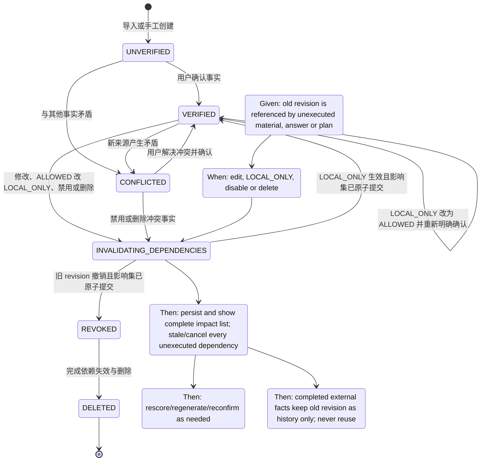
```mermaid
stateDiagram-v2
    %% @anchor EVIDENCE_LIFECYCLE
    %% @anchor EVIDENCE_INVALIDATION
    %% @anchor CONFLICTED
    [*] --> UNVERIFIED : 导入或手工创建
    UNVERIFIED --> VERIFIED : 用户确认事实
    UNVERIFIED --> CONFLICTED : 与其他事实矛盾
    CONFLICTED --> VERIFIED : 用户解决冲突并确认
    VERIFIED --> VERIFIED : LOCAL_ONLY 改为 ALLOWED 并重新明确确认
    VERIFIED --> CONFLICTED : 新来源产生矛盾
    VERIFIED --> INVALIDATING_DEPENDENCIES : 修改、ALLOWED 改 LOCAL_ONLY、禁用或删除
    CONFLICTED --> INVALIDATING_DEPENDENCIES : 禁用或删除冲突事实
    INVALIDATING_DEPENDENCIES --> VERIFIED : LOCAL_ONLY 生效且影响集已原子提交
    INVALIDATING_DEPENDENCIES --> REVOKED : 旧 revision 撤销且影响集已原子提交
    REVOKED --> DELETED : 完成依赖失效与删除
    state "Given: old revision is referenced by unexecuted material, answer or plan" as EVD_P0_06_GIVEN
    state "When: edit, LOCAL_ONLY, disable or delete" as EVD_P0_06_WHEN
    state "Then: persist and show complete impact list; stale/cancel every unexecuted dependency" as EVD_P0_06_IMPACT
    state "Then: rescore/regenerate/reconfirm as needed" as EVD_P0_06_REBUILD
    state "Then: completed external facts keep old revision as history only; never reuse" as EVD_P0_06_HISTORY
    EVD_P0_06_GIVEN --> EVD_P0_06_WHEN
    EVD_P0_06_WHEN --> INVALIDATING_DEPENDENCIES
    INVALIDATING_DEPENDENCIES --> EVD_P0_06_IMPACT
    EVD_P0_06_IMPACT --> EVD_P0_06_REBUILD
    EVD_P0_06_IMPACT --> EVD_P0_06_HISTORY
    DELETED --> [*]
```

`verificationStatus` 与 `externalUsePolicy` 是正交字段；只有 `VERIFIED + ALLOWED` 可以支持外发。进入 `INVALIDATING_DEPENDENCIES` 时，系统先以 `(evidenceId, oldRevision)` 反查并向用户列出全部未执行 MaterialSet、答案、附件引用和 ActionPlan，再在一个事务中发布新 Evidence revision/治理状态、把依赖材料与答案置为 `STALE`、把尚未外发的 `DRAFT` / `AWAITING_APPROVAL` / `AUTHORIZED` 计划失效并写 AuditIntent。任一步失败则旧 Evidence 与依赖状态均不改变，不能出现只修改 Evidence、旧计划仍可外发的窗口。

对于 EVD-P0-06：Given 是旧 revision 已被未执行材料、答案或计划引用；When 是用户修改、将其改为 `LOCAL_ONLY`、禁用或删除；Then 必须先展示影响清单，再按需重新评分、重新生成或请求确认。已有 `PREPARED` / `EXECUTING` ExternalOperation 时，能证明请求未发出才进入 `CANCELLED` / `FAILED_CONFIRMED`，否则必须进入 `OUTCOME_UNKNOWN → RECONCILING`，其 ActionPlan 保持 `EXECUTING` 到全部子操作收敛。已经成功的外部动作和当时使用的 evidence revision 只保留历史、可追加纠正记录，但不能复用旧内容或伪装回滚。

## RF-UML-SM-CAM-01 SearchCampaign 生命周期

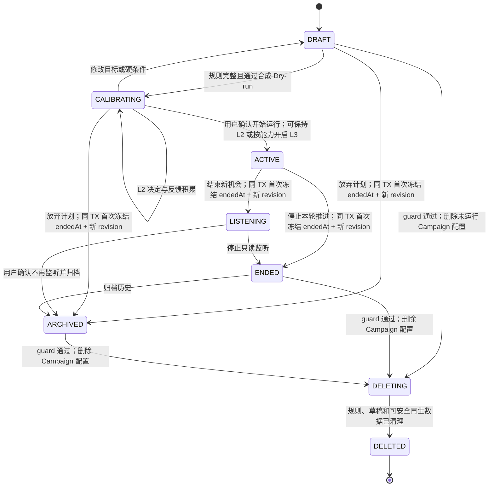
```mermaid
stateDiagram-v2
    %% @anchor CAMPAIGN_LIFECYCLE
    [*] --> DRAFT
    DRAFT --> CALIBRATING : 规则完整且通过合成 Dry-run
    CALIBRATING --> CALIBRATING : L2 决定与反馈积累
    CALIBRATING --> ACTIVE : 用户确认开始运行；可保持 L2 或按能力开启 L3
    CALIBRATING --> DRAFT : 修改目标或硬条件
    DRAFT --> ARCHIVED : 放弃计划；同 TX 首次冻结 endedAt + 新 revision
    CALIBRATING --> ARCHIVED : 放弃计划；同 TX 首次冻结 endedAt + 新 revision
    ACTIVE --> LISTENING : 结束新机会；同 TX 首次冻结 endedAt + 新 revision
    ACTIVE --> ENDED : 停止本轮推进；同 TX 首次冻结 endedAt + 新 revision
    LISTENING --> ENDED : 停止只读监听
    LISTENING --> ARCHIVED : 用户确认不再监听并归档
    ENDED --> ARCHIVED : 归档历史
    DRAFT --> DELETING : guard 通过；删除未运行 Campaign 配置
    ENDED --> DELETING : guard 通过；删除 Campaign 配置
    ARCHIVED --> DELETING : guard 通过；删除 Campaign 配置
    DELETING --> DELETED : 规则、草稿和可安全再生数据已清理
    DELETED --> [*]
```

删除 guard 只允许 `DRAFT`、`ENDED`、`ARCHIVED` 进入 `DELETING`；`CALIBRATING`、`ACTIVE`、`LISTENING` 必须先停止或归档。Campaign 删除只清理该 Campaign 的规则、偏好副本、未采用草稿和可安全再生的派生数据，并保留不可复活的 tombstone。已经发生的 Application、Interview、Message、ExternalOperation 和 Audit 不是 Campaign 可级联删除的子对象，继续保留；只有 Workspace 删除策略可以删除或脱敏这些历史事实。

`ARCHIVED` 是当前实例的业务终态，但允许数据管理命令将它转入 `DELETING`。同一 Workspace 最多一个 `CALIBRATING` 或 `ACTIVE` Campaign，但可同时保留多个历史 `LISTENING` Campaign；它们只接收迟到回复和面试变更，不发现、投递或跟进。去重与硬限额始终为 Workspace 全局约束。三级暂停是独立控制覆盖层。基于归档计划再次求职时必须复制稳定输入并创建新 Campaign，不能让原实例回到 `DRAFT`，也不能复活旧 Plan、token 或 L3 授权。

## RF-UML-SM-JOB-01 JobPosting 与机会判断生命周期

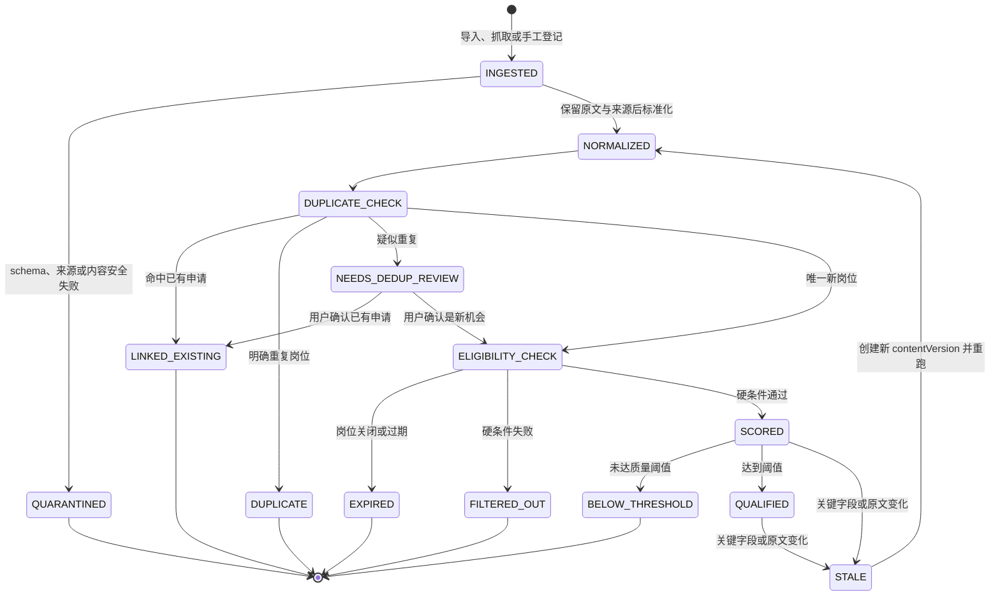
```mermaid
stateDiagram-v2
    %% @anchor JOB_LIFECYCLE
    %% @anchor JOB_FILTER_SCORE
    [*] --> INGESTED : 导入、抓取或手工登记
    INGESTED --> QUARANTINED : schema、来源或内容安全失败
    INGESTED --> NORMALIZED : 保留原文与来源后标准化
    NORMALIZED --> DUPLICATE_CHECK
    DUPLICATE_CHECK --> LINKED_EXISTING : 命中已有申请
    DUPLICATE_CHECK --> DUPLICATE : 明确重复岗位
    DUPLICATE_CHECK --> NEEDS_DEDUP_REVIEW : 疑似重复
    NEEDS_DEDUP_REVIEW --> LINKED_EXISTING : 用户确认已有申请
    NEEDS_DEDUP_REVIEW --> ELIGIBILITY_CHECK : 用户确认是新机会
    DUPLICATE_CHECK --> ELIGIBILITY_CHECK : 唯一新岗位
    ELIGIBILITY_CHECK --> EXPIRED : 岗位关闭或过期
    ELIGIBILITY_CHECK --> FILTERED_OUT : 硬条件失败
    ELIGIBILITY_CHECK --> SCORED : 硬条件通过
    SCORED --> BELOW_THRESHOLD : 未达质量阈值
    SCORED --> QUALIFIED : 达到阈值
    QUALIFIED --> STALE : 关键字段或原文变化
    SCORED --> STALE : 关键字段或原文变化
    STALE --> NORMALIZED : 创建新 contentVersion 并重跑
    LINKED_EXISTING --> [*]
    DUPLICATE --> [*]
    EXPIRED --> [*]
    FILTERED_OUT --> [*]
    BELOW_THRESHOLD --> [*]
    QUARANTINED --> [*]
```

岗位判断终态不会立即级联删除 JobPosting 来源记录。按 Accepted ADR-0004，raw JD 依全部引用 Campaign 的最晚 `endedAt+90d`（任一引用活跃则保护；无 Campaign 历史用 `importedAt+90d`）清除，消息正文/附件结束 90 天后清除；到期即使摘要缺失/无效也删除原文、快照和可重建副本并进入 `RAW_PURGED`。不可重建 JD 摘要、去敏 source/hash、结构化申请历史、材料版本和最小审计摘要最多默认保留 1 年，滚动备份 30 天。重导入创建新 lineage且不重置旧时钟，过期 raw 跨会话保留须显式延长。`QUALIFIED` 只是允许继续验证 Evidence 和材料，不代表允许投递。

## RF-UML-SM-APP-01 Application 生命周期

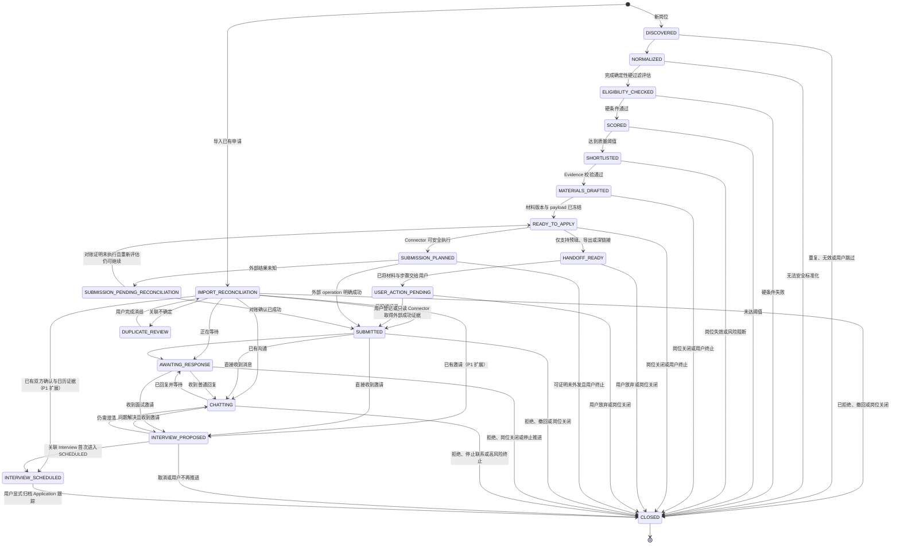
```mermaid
stateDiagram-v2
    %% @anchor APPLICATION_LIFECYCLE
    [*] --> DISCOVERED : 新岗位
    [*] --> IMPORT_RECONCILIATION : 导入已有申请

    IMPORT_RECONCILIATION --> SUBMITTED : 已投递记录
    IMPORT_RECONCILIATION --> AWAITING_RESPONSE : 正在等待
    IMPORT_RECONCILIATION --> CHATTING : 已有沟通
    IMPORT_RECONCILIATION --> INTERVIEW_PROPOSED : 已有邀请（P1 扩展）
    IMPORT_RECONCILIATION --> INTERVIEW_SCHEDULED : 已有双方确认与日历证据（P1 扩展）
    IMPORT_RECONCILIATION --> CLOSED : 已拒绝、撤回或岗位关闭
    IMPORT_RECONCILIATION --> DUPLICATE_REVIEW : 关联不确定
    DUPLICATE_REVIEW --> IMPORT_RECONCILIATION : 用户完成消歧

    DISCOVERED --> NORMALIZED
    NORMALIZED --> ELIGIBILITY_CHECKED : 完成确定性硬过滤评估
    ELIGIBILITY_CHECKED --> SCORED : 硬条件通过
    SCORED --> SHORTLISTED : 达到质量阈值
    SHORTLISTED --> MATERIALS_DRAFTED : Evidence 校验通过
    MATERIALS_DRAFTED --> READY_TO_APPLY : 材料版本与 payload 已冻结
    READY_TO_APPLY --> SUBMISSION_PLANNED : Connector 可安全执行
    READY_TO_APPLY --> HANDOFF_READY : 仅支持预填、导出或深链接
    HANDOFF_READY --> USER_ACTION_PENDING : 已将材料与步骤交给用户
    USER_ACTION_PENDING --> SUBMITTED : 用户登记或只读 Connector 取得外部成功证据
    SUBMISSION_PLANNED --> SUBMITTED : 外部 operation 明确成功
    SUBMISSION_PLANNED --> SUBMISSION_PENDING_RECONCILIATION : 外部结果未知
    SUBMISSION_PENDING_RECONCILIATION --> SUBMITTED : 对账确认已成功
    SUBMISSION_PENDING_RECONCILIATION --> READY_TO_APPLY : 对账证明未执行且重新评估仍可继续
    SUBMITTED --> AWAITING_RESPONSE
    SUBMITTED --> CHATTING : 直接收到消息
    SUBMITTED --> INTERVIEW_PROPOSED : 直接收到邀请
    AWAITING_RESPONSE --> CHATTING : 收到普通回复
    AWAITING_RESPONSE --> INTERVIEW_PROPOSED : 收到面试邀请
    CHATTING --> AWAITING_RESPONSE : 已回复并等待
    CHATTING --> INTERVIEW_PROPOSED : 问题解决且收到邀请
    INTERVIEW_PROPOSED --> CHATTING : 仍需澄清
    INTERVIEW_PROPOSED --> INTERVIEW_SCHEDULED : 关联 Interview 首次进入 SCHEDULED

    DISCOVERED --> CLOSED : 重复、无效或用户跳过
    NORMALIZED --> CLOSED : 无法安全标准化
    ELIGIBILITY_CHECKED --> CLOSED : 硬条件失败
    SCORED --> CLOSED : 未达阈值
    SHORTLISTED --> CLOSED : 岗位失效或风险阻断
    MATERIALS_DRAFTED --> CLOSED : 岗位关闭或用户终止
    READY_TO_APPLY --> CLOSED : 岗位关闭或用户终止
    HANDOFF_READY --> CLOSED : 用户放弃或岗位关闭
    USER_ACTION_PENDING --> CLOSED : 用户放弃或岗位关闭
    SUBMISSION_PLANNED --> CLOSED : 可证明未外发且用户终止
    SUBMITTED --> CLOSED : 拒绝、撤回或岗位关闭
    AWAITING_RESPONSE --> CLOSED : 拒绝、岗位关闭或停止推进
    CHATTING --> CLOSED : 拒绝、停止联系或高风险终止
    INTERVIEW_PROPOSED --> CLOSED : 取消或用户不再推进
    INTERVIEW_SCHEDULED --> CLOSED : 用户显式归档 Application 跟踪
    CLOSED --> [*]
```

说明：

- `Application` 不承载 FollowUpPlan 的到期与计数；跟进禁用或一次额度用尽后仍保持 `AWAITING_RESPONSE` 并继续只读监听。
- `CLOSED` 必须填写原因，例如 duplicate、hard-filter-failed、below-threshold、job-closed、rejected、withdrawn、no-contact、user-skipped、risk-blocked。
- 新外部事实或用户明确重新申请时创建带 `reapplyOfApplicationId` 的新 Application；旧实例永久保持 `CLOSED`，不得状态倒退。
- 历史导入是初始化/对账路径，不是从发现阶段伪造一串没有发生过的迁移。
- `SUBMISSION_PENDING_RECONCILIATION` 是 Application 的用户可见派生状态，权威 unknown 状态仍属于 ExternalOperation。
- `SCHEDULED` 只属于 Interview；Application 记录 `INTERVIEW_SCHEDULED` 里程碑。后续改期、取消和完成不让 Application 漏斗倒退。

## RF-UML-SM-MAT-01 MaterialSet 生命周期

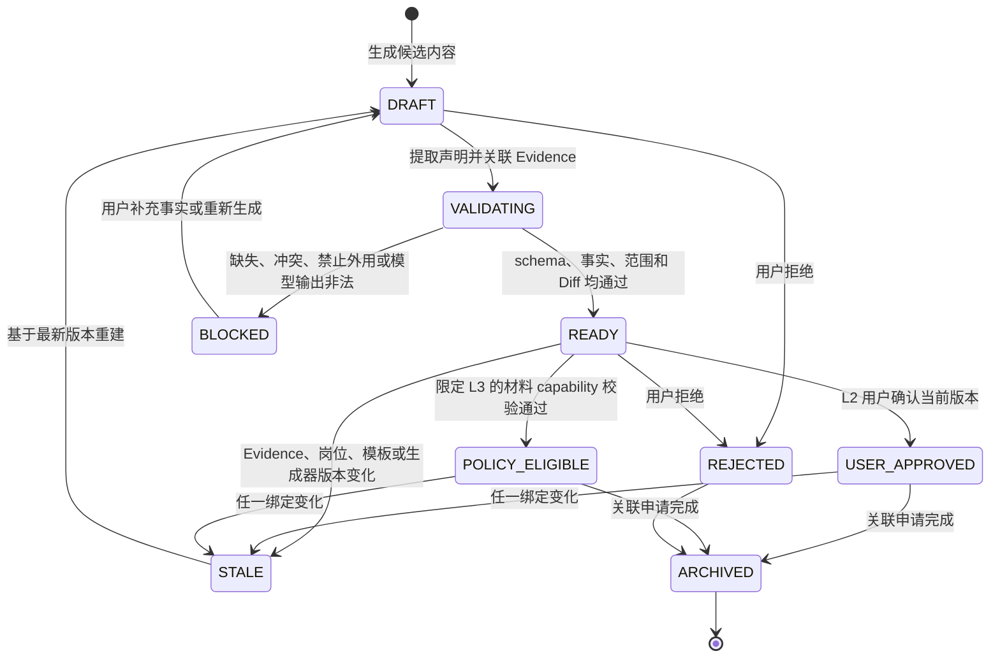
```mermaid
stateDiagram-v2
    %% @anchor MATERIAL_LIFECYCLE
    %% @anchor MATERIAL_EVIDENCE_GATE
    [*] --> DRAFT : 生成候选内容
    DRAFT --> VALIDATING : 提取声明并关联 Evidence
    VALIDATING --> READY : schema、事实、范围和 Diff 均通过
    VALIDATING --> BLOCKED : 缺失、冲突、禁止外用或模型输出非法
    BLOCKED --> DRAFT : 用户补充事实或重新生成
    READY --> USER_APPROVED : L2 用户确认当前版本
    READY --> POLICY_ELIGIBLE : 限定 L3 的材料 capability 校验通过
    READY --> STALE : Evidence、岗位、模板或生成器版本变化
    USER_APPROVED --> STALE : 任一绑定变化
    POLICY_ELIGIBLE --> STALE : 任一绑定变化
    DRAFT --> REJECTED : 用户拒绝
    READY --> REJECTED : 用户拒绝
    STALE --> DRAFT : 基于最新版本重建
    USER_APPROVED --> ARCHIVED : 关联申请完成
    POLICY_ELIGIBLE --> ARCHIVED : 关联申请完成
    REJECTED --> ARCHIVED
    ARCHIVED --> [*]
```

## RF-UML-SM-PLN-01 ActionPlanRecord 生命周期

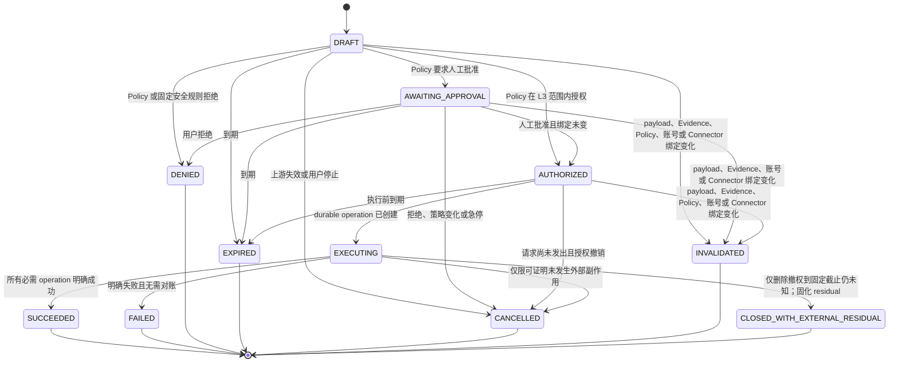
```mermaid
stateDiagram-v2
    %% @anchor ACTION_PLAN_LIFECYCLE
    %% @anchor ACTION_AUTHORIZATION
    %% @anchor REVOCATION_PLAN_RESIDUAL_TERMINAL
    [*] --> DRAFT
    DRAFT --> AWAITING_APPROVAL : Policy 要求人工批准
    DRAFT --> AUTHORIZED : Policy 在 L3 范围内授权
    DRAFT --> DENIED : Policy 或固定安全规则拒绝
    DRAFT --> EXPIRED : 到期
    DRAFT --> CANCELLED : 上游失效或用户停止
    DRAFT --> INVALIDATED : payload、Evidence、Policy、账号或 Connector 绑定变化
    AWAITING_APPROVAL --> AUTHORIZED : 人工批准且绑定未变
    AWAITING_APPROVAL --> DENIED : 用户拒绝
    AWAITING_APPROVAL --> EXPIRED : 到期
    AWAITING_APPROVAL --> CANCELLED : 拒绝、策略变化或急停
    AWAITING_APPROVAL --> INVALIDATED : payload、Evidence、账号或 Connector 绑定变化
    AUTHORIZED --> EXECUTING : durable operation 已创建
    AUTHORIZED --> EXPIRED : 执行前到期
    AUTHORIZED --> CANCELLED : 请求尚未发出且授权撤销
    AUTHORIZED --> INVALIDATED : payload、Evidence、Policy、账号或 Connector 绑定变化
    EXECUTING --> SUCCEEDED : 所有必需 operation 明确成功
    EXECUTING --> FAILED : 明确失败且无需对账
    EXECUTING --> CANCELLED : 仅限可证明未发生外部副作用
    EXECUTING --> CLOSED_WITH_EXTERNAL_RESIDUAL : 仅删除撤权到固定截止仍未知；固化 residual
    SUCCEEDED --> [*]
    FAILED --> [*]
    DENIED --> [*]
    EXPIRED --> [*]
    CANCELLED --> [*]
    INVALIDATED --> [*]
    CLOSED_WITH_EXTERNAL_RESIDUAL --> [*]
```

不可变 `ActionPlan` 是本状态记录的载荷；状态和 CAS 版本保存在 `ActionPlanRecord`。`OUTCOME_UNKNOWN` 不进入本状态机，而由 ExternalOperation 表达。只要任一 operation 未完成对账，ActionPlanRecord 保持 `EXECUTING`，UI 展示派生状态“正在对账”。`CLOSED_WITH_EXTERNAL_RESIDUAL` 只允许绑定永久删除 `deletionRequestId` 的 `credential_revocation` Plan 在固定且不可延长的删除截止到达、对应 operation 已进入 `RESIDUAL_RECORDED` 后使用；它表示本地计划处理已关闭，绝不表示远端撤权成功或失败。失败后的业务重试创建带 `retryOf` 的新 ActionPlan。

## RF-UML-SM-OPR-01 ExternalOperation 生命周期

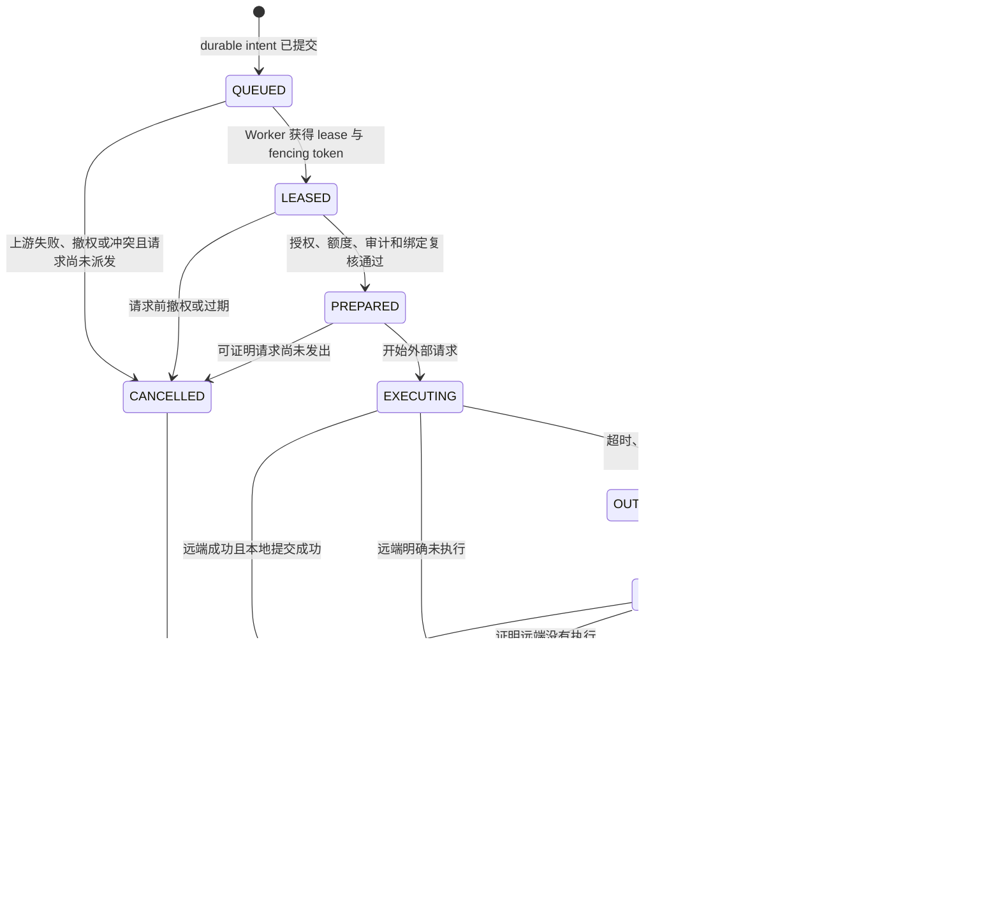
```mermaid
stateDiagram-v2
    %% @anchor OPERATION_LIFECYCLE
    %% @anchor REVOCATION_OPERATION_RESIDUAL_TERMINAL
    [*] --> QUEUED : durable intent 已提交
    QUEUED --> LEASED : Worker 获得 lease 与 fencing token
    QUEUED --> CANCELLED : 上游失败、撤权或冲突且请求尚未派发
    LEASED --> PREPARED : 授权、额度、审计和绑定复核通过
    LEASED --> CANCELLED : 请求前撤权或过期
    PREPARED --> EXECUTING : 开始外部请求
    PREPARED --> CANCELLED : 可证明请求尚未发出
    EXECUTING --> SUCCEEDED : 远端成功且本地提交成功
    EXECUTING --> FAILED_CONFIRMED : 远端明确未执行
    EXECUTING --> OUTCOME_UNKNOWN : 超时、断线、崩溃或取消但结果不明
    OUTCOME_UNKNOWN --> RECONCILING : 查询远端事实
    RECONCILING --> SUCCEEDED : 找到唯一成功结果并补记
    RECONCILING --> FAILED_CONFIRMED : 证明远端没有执行
    RECONCILING --> MANUAL_REVIEW : 零、一或多候选无法唯一裁决
    MANUAL_REVIEW --> RECONCILING : 用户提供外部证据
    RECONCILING --> RESIDUAL_RECORDED : 删除撤权到固定截止仍未知；保存 UNKNOWN residual
    MANUAL_REVIEW --> RESIDUAL_RECORDED : 删除撤权到固定截止仍无法裁决
    CANCELLED --> [*]
    SUCCEEDED --> [*]
    FAILED_CONFIRMED --> [*]
    RESIDUAL_RECORDED --> [*]
```

状态不变量：同一 operation 的 idempotency key 永不改变；lease 接管后旧 fencing token 不能提交；普通 retry 不能把 `OUTCOME_UNKNOWN` 直接改成 EXECUTING。`RESIDUAL_RECORDED` 不是第四种远端结果：仅删除期撤权 operation 可在其不可延长的 reconciliation deadline 到达后进入该本地终态，并必须继续保存 `externalOutcome=UNKNOWN`、最后证据、目标的不可逆 hash、官方撤权入口和期限；不得改写为 `SUCCEEDED`、`FAILED_CONFIRMED` 或 `CANCELLED`。复合业务若需要补偿，由 Saga 创建新的补偿 ActionPlan 和 ExternalOperation，原 operation 的历史状态保持不变。

## RF-UML-SM-EXC-01 Exception 生命周期

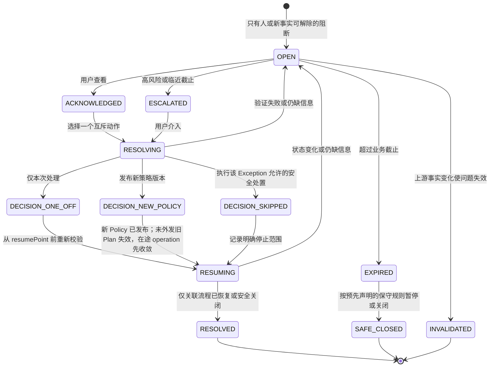
```mermaid
stateDiagram-v2
    %% @anchor EXCEPTION_LIFECYCLE
    %% @anchor OPEN
    %% @anchor ESCALATED
    %% @anchor EXPIRED
    [*] --> OPEN : 只有人或新事实可解除的阻断
    OPEN --> ACKNOWLEDGED : 用户查看
    OPEN --> ESCALATED : 高风险或临近截止
    OPEN --> EXPIRED : 超过业务截止
    OPEN --> INVALIDATED : 上游事实变化使问题失效
    ACKNOWLEDGED --> RESOLVING : 选择一个互斥动作
    ESCALATED --> RESOLVING : 用户介入
    RESOLVING --> DECISION_ONE_OFF : 仅本次处理
    RESOLVING --> DECISION_NEW_POLICY : 发布新策略版本
    RESOLVING --> DECISION_SKIPPED : 执行该 Exception 允许的安全处置
    RESOLVING --> OPEN : 验证失败或仍缺信息
    DECISION_ONE_OFF --> RESUMING : 从 resumePoint 前重新校验
    DECISION_NEW_POLICY --> RESUMING : 新 Policy 已发布；未外发旧 Plan 失效，在途 operation 先收敛
    DECISION_SKIPPED --> RESUMING : 记录明确停止范围
    RESUMING --> RESOLVED : 仅关联流程已恢复或安全关闭
    RESUMING --> OPEN : 状态变化或仍缺信息
    EXPIRED --> SAFE_CLOSED : 按预先声明的保守规则暂停或关闭
    RESOLVED --> [*]
    SAFE_CLOSED --> [*]
    INVALIDATED --> [*]
```

恢复必须发生在 `RESOLVED` 终态之前，且只恢复 `resumePoint` 指向的关联流程。`DECISION_NEW_POLICY` 必须先展示 Diff；它只直接使尚未外发的 `DRAFT`、`AWAITING_APPROVAL`、`AUTHORIZED` 旧计划失效。已有 `PREPARED` / `EXECUTING` operation 时，能证明未发才取消，否则进入 `OUTCOME_UNKNOWN → RECONCILING`，ActionPlan 保持 `EXECUTING` 到子操作终态。不能把一次回答悄悄学习成全局规则。聚合通知可以引用多个 Exception，但每个 Exception 仍只包含一个决策问题。

## RF-UML-SM-MSG-01 CommunicationThread 与消息处理

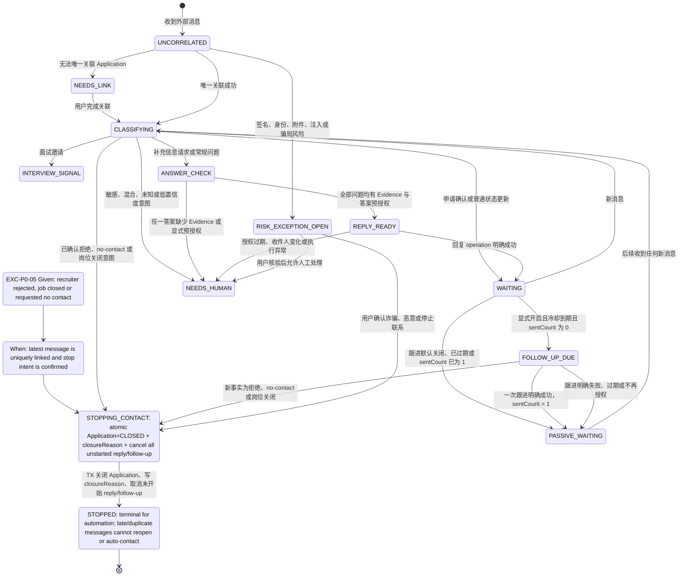
```mermaid
stateDiagram-v2
    %% @anchor MESSAGE_LIFECYCLE
    %% @anchor MESSAGE_STOP_CONTACT
    %% @anchor FOLLOWUP_DISABLED
    %% @anchor FOLLOWUP_ONCE
    %% @anchor PASSIVE_MONITORING
    state "STOPPING_CONTACT: atomic Application=CLOSED + closureReason + cancel all unstarted reply/follow-up" as STOPPING_CONTACT
    state "STOPPED: terminal for automation; late/duplicate messages cannot reopen or auto-contact" as STOPPED
    state "EXC-P0-05 Given: recruiter rejected, job closed or requested no contact" as EXC_P0_05_GIVEN
    state "When: latest message is uniquely linked and stop intent is confirmed" as EXC_P0_05_WHEN
    EXC_P0_05_GIVEN --> EXC_P0_05_WHEN
    EXC_P0_05_WHEN --> STOPPING_CONTACT
    [*] --> UNCORRELATED : 收到外部消息
    UNCORRELATED --> RISK_EXCEPTION_OPEN : 签名、身份、附件、注入或骗局风险
    UNCORRELATED --> NEEDS_LINK : 无法唯一关联 Application
    NEEDS_LINK --> CLASSIFYING : 用户完成关联
    UNCORRELATED --> CLASSIFYING : 唯一关联成功
    CLASSIFYING --> STOPPING_CONTACT : 已确认拒绝、no-contact 或岗位关闭意图
    CLASSIFYING --> INTERVIEW_SIGNAL : 面试邀请
    CLASSIFYING --> WAITING : 申请确认或普通状态更新
    CLASSIFYING --> ANSWER_CHECK : 补充信息请求或常规问题
    CLASSIFYING --> NEEDS_HUMAN : 敏感、混合、未知或低置信度意图
    ANSWER_CHECK --> NEEDS_HUMAN : 任一答案缺少 Evidence 或显式预授权
    ANSWER_CHECK --> REPLY_READY : 全部问题均有 Evidence 与答案预授权
    REPLY_READY --> WAITING : 回复 operation 明确成功
    REPLY_READY --> NEEDS_HUMAN : 授权过期、收件人变化或执行异常
    WAITING --> CLASSIFYING : 新消息
    WAITING --> FOLLOW_UP_DUE : 显式开启且冷却到期且 sentCount 为 0
    WAITING --> PASSIVE_WAITING : 跟进默认关闭、已过期或 sentCount 已为 1
    FOLLOW_UP_DUE --> PASSIVE_WAITING : 一次跟进明确成功，sentCount = 1
    FOLLOW_UP_DUE --> PASSIVE_WAITING : 跟进明确失败、过期或不再授权
    FOLLOW_UP_DUE --> STOPPING_CONTACT : 新事实为拒绝、no-contact 或岗位关闭
    PASSIVE_WAITING --> CLASSIFYING : 后续收到任何新消息
    RISK_EXCEPTION_OPEN --> NEEDS_HUMAN : 用户核验后允许人工处理
    RISK_EXCEPTION_OPEN --> STOPPING_CONTACT : 用户确认诈骗、恶意或停止联系
    STOPPING_CONTACT --> STOPPED : TX 关闭 Application、写 closureReason、取消未开始 reply/follow-up
    STOPPED --> [*]
```

Webhook 与 polling 导入首先按 account、thread、external message ID 去重并按 revision 合并，状态机只消费最新、已确认的线程事实。`PASSIVE_WAITING` 仍持续只读同步；它只禁止继续自动跟进，不代表 Application 或 CommunicationThread 已关闭。AnswerPreauthorization 空集合表示全部禁止自动回答。

对于 EXC-P0-05：Given 是招聘方已明确拒绝、岗位关闭或要求停止联系；When 是最新消息 revision 在唯一关联和意图置信门通过后被确认为该停止意图；Then 在同一事务中把 Application 置为 `CLOSED`、记录精确 `closureReason` 与来源 Message ID，并使所有尚未发出的 reply/follow-up Plan、Authorization、Operation 和调度项取消或失效。已可能发出的 operation 进入对账而不重发；迟到或重复停止消息只合并来源证据，`STOPPED` 不自动重开、不继续自动联系，只有用户另行创建明确的新业务事实或 reapply 流程才可产生新计划。

## RF-UML-SM-INT-01 Interview 生命周期

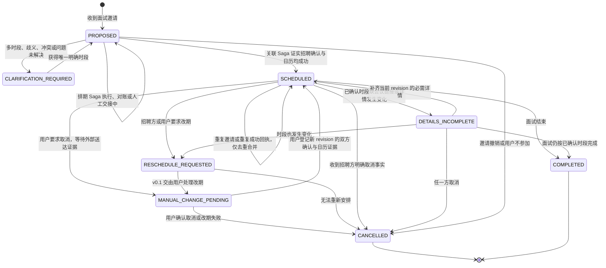
```mermaid
stateDiagram-v2
    %% @anchor INTERVIEW_LIFECYCLE
    [*] --> PROPOSED : 收到面试邀请
    PROPOSED --> PROPOSED : 重复邀请同一 revision，仅合并来源证据
    PROPOSED --> CLARIFICATION_REQUIRED : 多时段、歧义、冲突或问题未解决
    CLARIFICATION_REQUIRED --> PROPOSED : 获得唯一明确时段
    PROPOSED --> PROPOSED : 排期 Saga 执行、对账或人工交接中
    PROPOSED --> SCHEDULED : 关联 Saga 证实招聘确认与日历均成功
    SCHEDULED --> SCHEDULED : 重复邀请或重复成功回执，仅去重合并
    SCHEDULED --> DETAILS_INCOMPLETE : 已确认时段缺会议链接或详情发生变化
    DETAILS_INCOMPLETE --> SCHEDULED : 补齐当前 revision 的必需详情
    SCHEDULED --> RESCHEDULE_REQUESTED : 招聘方或用户要求改期
    SCHEDULED --> MANUAL_CHANGE_PENDING : 用户要求取消，等待外部送达证据
    DETAILS_INCOMPLETE --> RESCHEDULE_REQUESTED : 时段也发生变化
    RESCHEDULE_REQUESTED --> MANUAL_CHANGE_PENDING : v0.1 交由用户处理改期
    MANUAL_CHANGE_PENDING --> SCHEDULED : 用户登记新 revision 的双方确认与日历证据
    MANUAL_CHANGE_PENDING --> CANCELLED : 用户确认取消或改期失败
    RESCHEDULE_REQUESTED --> CANCELLED : 无法重新安排
    SCHEDULED --> CANCELLED : 收到招聘方明确取消事实
    DETAILS_INCOMPLETE --> CANCELLED : 任一方取消
    SCHEDULED --> COMPLETED : 面试结束
    DETAILS_INCOMPLETE --> COMPLETED : 面试仍按已确认时段完成
    PROPOSED --> CANCELLED : 邀请撤销或用户不参加
    CANCELLED --> [*]
    COMPLETED --> [*]
```

Interview 只保存业务事实；`CALENDAR_EXECUTING`、`REPLY_EXECUTING`、`PARTIAL` 和 `RECONCILING` 等排期执行状态属于 `RF-UML-SM-SAGA-01`。首次排期在两项外部成功都得到证据前始终保持 `PROPOSED`。首次进入 `SCHEDULED` 触发核心交付通知；重复 revision 不重复回复、不重复建日历事件，也不重复发送同一通知。`DETAILS_INCOMPLETE` 仍表示时段已确认，只是交付包不完整。Application 只记录首次 `INTERVIEW_SCHEDULED` 里程碑；Interview 后续改期、取消和完成不会让 Application 漏斗倒退。v0.1 的改期和取消默认交由用户处理，活动见 `RF-UML-ACT-INTCHANGE-01`。

## RF-UML-SM-SAGA-01 InterviewSchedulingSaga 生命周期

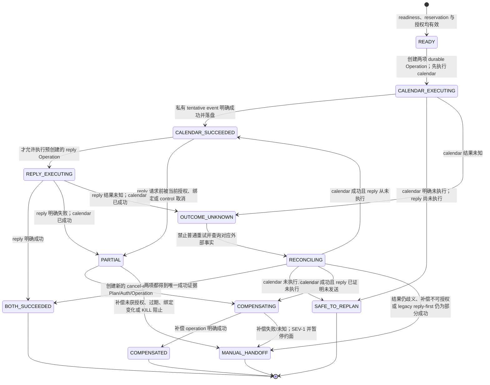
```mermaid
stateDiagram-v2
    %% @anchor INTERVIEW_SAGA
    %% @anchor PARTIAL_RECONCILIATION
    [*] --> READY : readiness、reservation 与授权均有效
    READY --> CALENDAR_EXECUTING : 创建两项 durable Operation；先执行 calendar
    CALENDAR_EXECUTING --> CALENDAR_SUCCEEDED : 私有 tentative event 明确成功并落盘
    CALENDAR_EXECUTING --> SAFE_TO_REPLAN : calendar 明确未执行；reply 尚未执行
    CALENDAR_EXECUTING --> OUTCOME_UNKNOWN : calendar 结果未知
    CALENDAR_SUCCEEDED --> REPLY_EXECUTING : 才允许执行预创建的 reply Operation
    CALENDAR_SUCCEEDED --> PARTIAL : reply 请求前被当前授权、绑定或 control 取消
    REPLY_EXECUTING --> BOTH_SUCCEEDED : reply 明确成功
    REPLY_EXECUTING --> PARTIAL : reply 明确失败；calendar 已成功
    REPLY_EXECUTING --> OUTCOME_UNKNOWN : reply 结果未知；calendar 已成功
    PARTIAL --> COMPENSATING : 创建新的 cancel-event Plan/Auth/Operation
    PARTIAL --> MANUAL_HANDOFF : 补偿未获授权、过期、绑定变化或 KILL 阻止
    OUTCOME_UNKNOWN --> RECONCILING : 禁止普通重试并查询对应外部事实
    RECONCILING --> CALENDAR_SUCCEEDED : calendar 成功且 reply 从未执行
    RECONCILING --> BOTH_SUCCEEDED : 两项都得到唯一成功证据
    RECONCILING --> SAFE_TO_REPLAN : calendar 未执行且 reply 从未执行
    RECONCILING --> COMPENSATING : calendar 成功且 reply 已证明未发送
    RECONCILING --> MANUAL_HANDOFF : 结果仍歧义、补偿不可授权或 legacy reply-first 仍为部分成功
    COMPENSATING --> COMPENSATED : 补偿 operation 明确成功
    COMPENSATING --> MANUAL_HANDOFF : 补偿失败/未知；SEV-1 并暂停约面
    BOTH_SUCCEEDED --> [*]
    SAFE_TO_REPLAN --> [*]
    COMPENSATED --> [*]
    MANUAL_HANDOFF --> [*]
```

只有 `BOTH_SUCCEEDED` 可以使 Interview 从 `PROPOSED` 进入 `SCHEDULED`。正常路径固定先创建候选人私有 tentative event、落盘明确日历结果，再发送回复；日历明确失败时 reply 尚未执行，可安全进入 `SAFE_TO_REPLAN`。`SAFE_TO_REPLAN` 和 `COMPENSATED` 仍保持 Interview 为 `PROPOSED`。日历成功、回复失败时必须以新的 Plan/Authorization/Operation 取消 event；取消失败或未知创建 `SEV-1` Exception 并暂停约面 capability。恢复或导入发现 legacy reply-first 时只允许只读对账：若两项原始 operation 最终都有唯一、可验证且绑定一致的成功证据，可按真实事实收敛为 `BOTH_SUCCEEDED`；仍为部分成功、任一证据不足或绑定无法验证时进入人工接管，绝不自动补建缺失事件或重发回复。缺少查询/对账、幂等创建、更新/取消或稳定 external ID 任一能力的日历 Connector 不得进入 L3。

## RF-UML-SM-NOT-01 Notification 生命周期

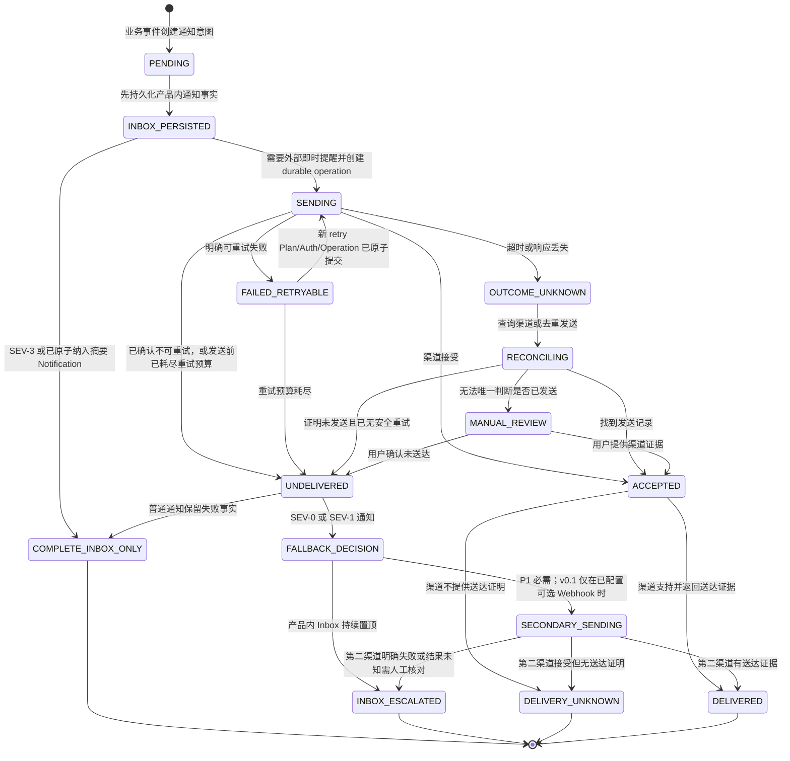
```mermaid
stateDiagram-v2
    %% @anchor NOTIFICATION_LIFECYCLE
    [*] --> PENDING : 业务事件创建通知意图
    PENDING --> INBOX_PERSISTED : 先持久化产品内通知事实
    INBOX_PERSISTED --> COMPLETE_INBOX_ONLY : SEV-3 或已原子纳入摘要 Notification
    INBOX_PERSISTED --> SENDING : 需要外部即时提醒并创建 durable operation
    SENDING --> ACCEPTED : 渠道接受
    SENDING --> FAILED_RETRYABLE : 明确可重试失败
    SENDING --> UNDELIVERED : 已确认不可重试，或发送前已耗尽重试预算
    SENDING --> OUTCOME_UNKNOWN : 超时或响应丢失
    FAILED_RETRYABLE --> SENDING : 新 retry Plan/Auth/Operation 已原子提交
    FAILED_RETRYABLE --> UNDELIVERED : 重试预算耗尽
    OUTCOME_UNKNOWN --> RECONCILING : 查询渠道或去重发送
    RECONCILING --> ACCEPTED : 找到发送记录
    RECONCILING --> UNDELIVERED : 证明未发送且已无安全重试
    RECONCILING --> MANUAL_REVIEW : 无法唯一判断是否已发送
    MANUAL_REVIEW --> ACCEPTED : 用户提供渠道证据
    MANUAL_REVIEW --> UNDELIVERED : 用户确认未送达
    ACCEPTED --> DELIVERED : 渠道支持并返回送达证据
    ACCEPTED --> DELIVERY_UNKNOWN : 渠道不提供送达证明
    UNDELIVERED --> FALLBACK_DECISION : SEV-0 或 SEV-1 通知
    UNDELIVERED --> COMPLETE_INBOX_ONLY : 普通通知保留失败事实
    FALLBACK_DECISION --> INBOX_ESCALATED : 产品内 Inbox 持续置顶
    FALLBACK_DECISION --> SECONDARY_SENDING : P1 必需；v0.1 仅在已配置可选 Webhook 时
    SECONDARY_SENDING --> DELIVERED : 第二渠道有送达证据
    SECONDARY_SENDING --> DELIVERY_UNKNOWN : 第二渠道接受但无送达证明
    SECONDARY_SENDING --> INBOX_ESCALATED : 第二渠道明确失败或结果未知需人工核对
    COMPLETE_INBOX_ONLY --> [*]
    INBOX_ESCALATED --> [*]
    DELIVERY_UNKNOWN --> [*]
    DELIVERED --> [*]
```

产品内 Inbox 是 durable 事实来源，但设备或应用离线时不能宣称用户已经看到。邮件是默认外部通知，Webhook 是可选适配器；第二个必需外部备用渠道属于 P1。`SENDING` 只有在渠道给出可验证的不可重试结论，或该 operation 创建时预算已耗尽，才可直接进入 `UNDELIVERED`；可重试失败必须先进入 `FAILED_RETRYABLE`，超时或响应丢失必须进入 `OUTCOME_UNKNOWN`，不得把未知偷换成未送达后另发。任何通知渠道失败都不能把 Interview 从 `SCHEDULED` 改回其他状态。通知严重度统一使用 `SEV-0`—`SEV-3`，不与 Case 优先级 P0/P1/P2 混用。

`SEV-2` 原始 Notification 在 cutoff 前保持 `INBOX_PERSISTED`。到达用户时区的每日 cutoff 后，系统在一个事务中创建新的摘要 Notification、记录成员引用，并将已纳入成员置为 `COMPLETE_INBOX_ONLY`；摘要本身复用上图的 `PENDING → INBOX_PERSISTED → SENDING → 三态结果`，不得引入未建模的旁路状态或复用旧发送 Operation。

## RF-UML-SM-POL-01 自动化等级与三级暂停

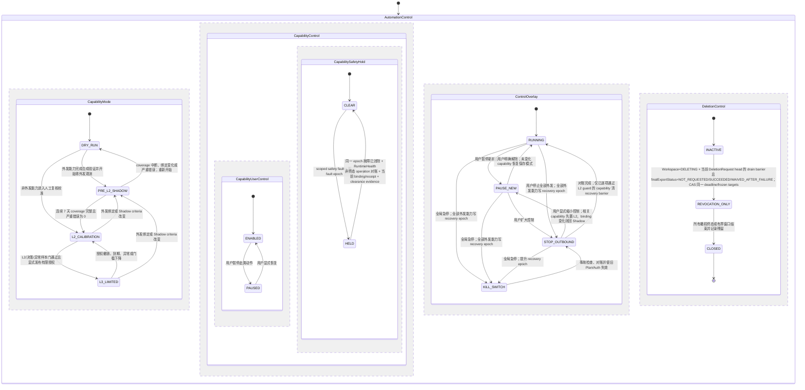
```mermaid
stateDiagram-v2
    %% @anchor AUTOMATION_CONTROL
    %% @anchor CONTROL_ORTHOGONAL
    %% @anchor POLICY_CONSTRAINTS
    %% @anchor QUOTA_LIMITS
    state AutomationControl {
        state CapabilityMode {
            [*] --> DRY_RUN
            DRY_RUN --> PRE_L2_SHADOW : 外发能力完成合成验证并开始零外发观测
            DRY_RUN --> L2_CALIBRATION : 非外发能力进入人工复核校准
            PRE_L2_SHADOW --> DRY_RUN : coverage 中断、绑定变化或严重错误；重新开始
            PRE_L2_SHADOW --> L2_CALIBRATION : 连续 7 天 coverage 完整且严重错误为 0
            L2_CALIBRATION --> L3_LIMITED : L2/决策/异常样本门通过且显式发布有限授权
            L2_CALIBRATION --> PRE_L2_SHADOW : 外发绑定或 Shadow criteria 改变
            L3_LIMITED --> L2_CALIBRATION : 授权撤销、到期、异常或门槛下降
            L3_LIMITED --> PRE_L2_SHADOW : 外发绑定或 Shadow criteria 改变
        }
        --
        state CapabilityControl {
            state CapabilityUserControl {
                [*] --> ENABLED
                ENABLED --> PAUSED : 用户暂停此类动作
                PAUSED --> ENABLED : 用户显式恢复
            }
            --
            state CapabilitySafetyHold {
                [*] --> CLEAR
                CLEAR --> HELD : scoped safety fault + 新 fault epoch
                HELD --> CLEAR : 同一 epoch 故障已消除 + RuntimeHealth<br/>非终态 operation 对账 + 当前 binding/receipt + clearance evidence
            }
        }
        --
        state ControlOverlay {
            [*] --> RUNNING
            RUNNING --> PAUSE_NEW : 用户暂停新机会
            PAUSE_NEW --> STOP_OUTBOUND : 用户扩大控制
            RUNNING --> STOP_OUTBOUND : 用户停止全部外发；全部外发能力写 recovery epoch
            RUNNING --> KILL_SWITCH : 全局急停；全部外发能力写 recovery epoch
            PAUSE_NEW --> KILL_SWITCH : 全局急停；全部外发能力写 recovery epoch
            STOP_OUTBOUND --> KILL_SWITCH : 全局急停；提升 recovery epoch
            STOP_OUTBOUND --> PAUSE_NEW : 用户显式缩小控制；相关 capability 先置 L2，binding 变化则回 Shadow
            PAUSE_NEW --> RUNNING : 用户明确解除；未变化 capability 恢复保存模式
            STOP_OUTBOUND --> RUNNING : 对账完成；仅已逐项通过 L2 guard 的 capability 清 recovery barrier
            KILL_SWITCH --> STOP_OUTBOUND : 事故检查、对账并使旧 Plan/Auth 失效
        }
        --
        state DeletionControl {
            [*] --> INACTIVE
            INACTIVE --> REVOCATION_ONLY : Workspace=DELETING + 当前 DeletionRequest head 的 drain barrier<br/>且 finalExportStatus=NOT_REQUESTED/SUCCEEDED/WAIVED_AFTER_FAILURE；CAS 同一 deadline/frozen targets
            REVOCATION_ONLY --> CLOSED : 所有撤权终态或有界窗口结束并记录残留
            CLOSED --> [*]
        }
    }
    [*] --> AutomationControl
```

`CapabilityMode` 按发现、材料、投递、回复、跟进、约面和外部通知等业务能力分别保存；`CapabilityControl` 对每项业务能力保存互相正交的 `CapabilityUserControl` 与 `CapabilitySafetyHold`；`ControlOverlay` 是 Workspace 级三级控制。有效业务权限始终取“能力模式 × capability 用户控制 × capability safety hold × 当前 Policy 版本 × Workspace 控制覆盖层 × RuntimeHealth”的交集；对业务外发 capability 还必须包含与当前 capability、Connector/version、account、credential lineage 和 Shadow criteria 精确绑定的有效 pre-L2 Shadow receipt。L2 人工批准不能代替该 receipt。“暂停此类动作”只把目标 capability 置为 `userMode=PAUSED`，不改变其校准模式、不连带暂停其他能力，也不等同于 `PAUSE_NEW`。用户恢复只能改回 `userMode=ENABLED`，绝不能清除 `safetyHoldStatus=HELD`；后者须以同一 fault epoch 的修复、健康、对账和当前 binding/receipt 证据由系统改回 `CLEAR`。`HELD` 禁止任何可执行 Plan、Authorization、Operation、Outbox 和外呼，但为修复 receipt 漂移可运行 `SHADOW_ONLY` 评估并写 coverage/receipt 候选证据；这些记录没有可执行载荷且外部副作用恒为 0。解除 `PAUSE_NEW` 时，未变化且仍有效的 capability 可恢复进入暂停前保存的 L2/L3 模式，但旧的失效 Plan 不复活；解除 `STOP_OUTBOUND` 或 `KILL_SWITCH` 前先完成对账，旧 Plan 和授权永不复活，用户逐 capability 恢复且第一步只能是 L2，健康检查和明确确认通过后才可重新进入 L3。`KILL_SWITCH` 只能先降到仍全拒绝业务外发的 `STOP_OUTBOUND`，完成逐 capability L2 guard 后才回 `RUNNING`。若业务外发 binding 或 Shadow criteria 已改变，则先回到 `PRE_L2_SHADOW`，而不是直接恢复真实 L2。ADR-0003 的隔离安全控制面不使用业务 CapabilityMode/Grant/receipt。

两个门按业务 capability 严格串行：第一，任何真实业务外发（包括首次 L2）先在 `PRE_L2_SHADOW` 连续 7 天保持零外部副作用；coverage 不能有未解释空窗，且未授权、重复、虚构和错误排期事件均为 0。第二，Shadow receipt 有效后才进入真实 `L2_CALIBRATION` 并积累样本；进入 L3 还要求匹配/材料各 50 个决策、投递/回复各 20 次真实 L2、自动约面 5 次真实 L2 并通过 20 个合成异常 Case，以及用户显式发布有限期、有限额授权。固定 heartbeat/停止告警与删除撤权只走 ADR-0003 的隔离安全协议，不进入这两个业务门。

`DeletionControl` 不恢复、放宽或绕过任何业务 capability。它只在用户另行确认永久删除、Workspace 已进入 `DELETING` 时短暂变为 `REVOCATION_ONLY`；Connector 声明且探测为支持时，才接受绑定本次删除请求和固定 Connector account/credential lineage/targetHash 的 `credential_revocation` Plan。依据 Accepted ADR-0003，该 Plan 不等待业务 Shadow且不得引用业务 Grant/receipt，但仍需固定 revocation-target binding ID/hash、系统安全 PolicyEvaluation、窄化 Authorization、durable Operation、AuditIntent、专用 Outbox、幂等、执行前复核与未知结果对账。不支持时记录 `UNSUPPORTED/NOT_ATTEMPTED`、官方手工入口和 residual 后继续本地删除，不伪造 C-live 或成功。其他投递、回复、跟进、约面和外部通知继续受 `STOP_OUTBOUND` / `KILL_SWITCH` 拒绝。

| 模式或控制 | 新岗位发现 | 只读消息与对账 | 新投递 | 已有申请回复/跟进/约面 | 通知 |
| --- | --- | --- | --- | --- | --- |
| DRY_RUN | 允许 | 允许 | 仅预览 | 仅预览 | 仅测试 |
| PRE_L2_SHADOW | 允许只读发现与内部评估 | 允许 | 只生成/评估影子 Plan，零真实投递 | 只生成/评估影子 Plan，零真实回复、跟进或约面 | 产品内通知与测试通道；真实外部通知为 0 |
| L2_CALIBRATION | 允许 | 允许 | 仅在该投递 capability 的有效 pre-L2 Shadow receipt 存在时逐次批准 | 每项外发 capability 均须有自己的有效 receipt，随后逐次批准 | 外部通知 capability 有有效 receipt 后按通知规则 |
| L3_LIMITED | 允许 | 允许 | 按能力授权 | 按能力授权 | 按通知规则 |
| `userMode=PAUSED` | 只对用户暂停的 capability 禁止新计划/执行；无关能力不变 | 被暂停能力仅保留必要只读与对账 | 若目标是投递则禁止，否则按自身模式 | 只禁止被点名的回复/跟进/约面类别；其他能力按自身模式 | 目标为外部通知时只保留产品 Inbox，否则不变 |
| `safetyHoldStatus=HELD` | scoped fault 对应 capability 禁止可执行计划/执行；仅可生成零副作用 `SHADOW_ONLY` 评估/coverage 记录；用户普通恢复无效 | 仅保留修复取证、必要只读、对账与无外呼 Shadow | 若目标是投递则禁止，否则按自身模式 | fault scope 内零 Authorization/Operation/Outbox/外呼；其他能力按自身状态 | 目标为外部通知时只保留产品 Inbox，否则不变 |
| PAUSE_NEW | 停止新抓取；未投递机会只读保留且不建新 Plan | 继续 | 禁止 | 已有申请按原能力模式和 Policy 继续 | 按通知规则 |
| STOP_OUTBOUND | 可继续内部发现与评分但不建外发 Plan | 必须继续 | 禁止 | 禁止新外发；在途只对账 | 产品内安全/状态事实继续 |
| KILL_SWITCH | 停止调度与全部业务 mutation；非关键读取可继续 | 必须继续 | 全拒绝 | 全拒绝；已发请求进入对账 | 内部审计/Inbox 继续；固定外部停止告警仅按 ADR-0003 的 watchdog binding、窄化授权与专用 durable 协议执行，不等待业务 Shadow |
| REVOCATION_ONLY（仅 Workspace=DELETING） | 禁止 | 允许既有 unknown 的只读收敛与撤权对账；受支持的 credential_revocation 仅在固定 revocation-target binding 与全部专用 guard 有效时外发，不等待业务 Shadow；不支持则记录 residual/官方入口 | 禁止 | 禁止 | 仅产品内删除进度；普通外部通知禁止 |

普通离线是 RuntimeHealth 事件，不是人工控制状态：组件恢复不会自动解除 `PAUSE_NEW`、`STOP_OUTBOUND` 或 `KILL_SWITCH`。三级控制只通过用户的显式命令改变。

## RF-UML-SM-POLVER-01 Policy 版本生命周期

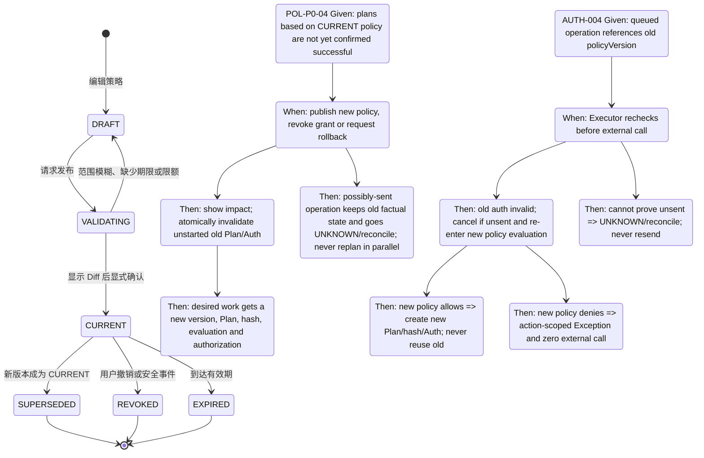
```mermaid
stateDiagram-v2
    %% @anchor POLICY_VERSIONING
    %% @anchor POLICY_CHANGE_INVALIDATION
    %% @anchor QUEUED_POLICY_RECHECK
    [*] --> DRAFT : 编辑策略
    DRAFT --> VALIDATING : 请求发布
    VALIDATING --> DRAFT : 范围模糊、缺少期限或限额
    VALIDATING --> CURRENT : 显示 Diff 后显式确认
    CURRENT --> SUPERSEDED : 新版本成为 CURRENT
    CURRENT --> REVOKED : 用户撤销或安全事件
    CURRENT --> EXPIRED : 到达有效期
    SUPERSEDED --> [*]
    REVOKED --> [*]
    EXPIRED --> [*]
    state "POL-P0-04 Given: plans based on CURRENT policy are not yet confirmed successful" as POL_P0_04_GIVEN
    state "When: publish new policy, revoke grant or request rollback" as POL_P0_04_WHEN
    state "Then: show impact; atomically invalidate unstarted old Plan/Auth" as POL_P0_04_INVALIDATE
    state "Then: desired work gets a new version, Plan, hash, evaluation and authorization" as POL_P0_04_REPLAN
    state "Then: possibly-sent operation keeps old factual state and goes UNKNOWN/reconcile; never replan in parallel" as POL_P0_04_INFLIGHT
    POL_P0_04_GIVEN --> POL_P0_04_WHEN
    POL_P0_04_WHEN --> POL_P0_04_INVALIDATE
    POL_P0_04_WHEN --> POL_P0_04_INFLIGHT
    POL_P0_04_INVALIDATE --> POL_P0_04_REPLAN
    state "AUTH-004 Given: queued operation references old policyVersion" as AUTH_004_GIVEN
    state "When: Executor rechecks before external call" as AUTH_004_WHEN
    state "Then: old auth invalid; cancel if unsent and re-enter new policy evaluation" as AUTH_004_REEVAL
    state "Then: new policy allows => create new Plan/hash/Auth; never reuse old" as AUTH_004_ALLOW
    state "Then: new policy denies => action-scoped Exception and zero external call" as AUTH_004_DENY
    state "Then: cannot prove unsent => UNKNOWN/reconcile; never resend" as AUTH_004_UNKNOWN
    AUTH_004_GIVEN --> AUTH_004_WHEN
    AUTH_004_WHEN --> AUTH_004_REEVAL
    AUTH_004_WHEN --> AUTH_004_UNKNOWN
    AUTH_004_REEVAL --> AUTH_004_ALLOW
    AUTH_004_REEVAL --> AUTH_004_DENY
```

任一版本离开 `CURRENT` 时，只直接失效引用该版本且尚未外发的 `DRAFT`、`AWAITING_APPROVAL`、`AUTHORIZED` ActionPlan 与对应授权。已经拥有 `PREPARED` / `EXECUTING` ExternalOperation 的 Plan 保持 `EXECUTING`：可证明请求未发则将 operation 记为 `CANCELLED` / `FAILED_CONFIRMED`，可能已发则记为 `OUTCOME_UNKNOWN` 并对账，直到全部子操作进入可证明终态。回退历史配置也必须发布新的版本号，不能让旧授权复活。

| Case / anchor | Given | When | Then |
| --- | --- | --- | --- |
| POL-P0-04 / `POLICY_CHANGE_INVALIDATION` | 存在基于当前 policyVersion、尚未明确成功的计划 | 用户发布新策略、撤销授权或选择历史配置回退 | 先展示受影响计划、capability 和预计结果；以一个新版本原子替换 CURRENT，使旧版本的未外发计划/授权取消或过期。仍需继续的动作从当前事实构建**新 Plan、新 hash、新评估与新授权**；超出新规则则创建异常，绝不复活或原地改写旧计划。 |
| AUTH-004 / `QUEUED_POLICY_RECHECK` | 队列中的 operation/Authorization 仍引用旧 policyVersion | Executor 在任何外部调用前复核当前版本 | 旧授权立即无效。若可证明尚未调用外部系统，取消旧 operation 并使动作回到新策略评估；新策略允许时也只能建立新计划/授权，越界时只为该动作创建 Exception。若可能已经外发则进入 `OUTCOME_UNKNOWN → RECONCILING`，不把它重置后重发。 |

## RF-UML-SM-RUN-01 Connector、Worker 与 Runner 健康状态

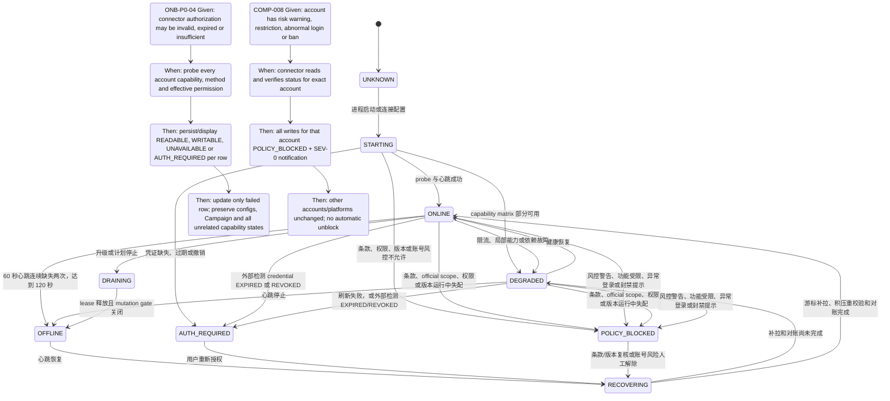
```mermaid
stateDiagram-v2
    %% @anchor RUNTIME_HEALTH
    %% @anchor RUNTIME_CAPABILITY_MATRIX
    %% @anchor DEGRADED
    %% @anchor AUTH_REQUIRED
    %% @anchor POLICY_BLOCKED
    %% @anchor ACCOUNT_POLICY_BLOCKED
    [*] --> UNKNOWN
    UNKNOWN --> STARTING : 进程启动或连接配置
    STARTING --> ONLINE : probe 与心跳成功
    STARTING --> DEGRADED : capability matrix 部分可用
    STARTING --> AUTH_REQUIRED : 凭证缺失、过期或撤销
    STARTING --> POLICY_BLOCKED : 条款、权限、版本或账号风控不允许
    ONLINE --> DEGRADED : 限流、局部能力或依赖故障
    ONLINE --> AUTH_REQUIRED : 外部检测 credential EXPIRED 或 REVOKED
    ONLINE --> POLICY_BLOCKED : 条款、official scope、权限或版本运行中失配
    ONLINE --> POLICY_BLOCKED : 风控警告、功能受限、异常登录或封禁提示
    ONLINE --> OFFLINE : 60 秒心跳连续缺失两次，达到 120 秒
    DEGRADED --> ONLINE : 健康恢复
    DEGRADED --> OFFLINE : 心跳停止
    DEGRADED --> AUTH_REQUIRED : 刷新失败，或外部检测 EXPIRED/REVOKED
    DEGRADED --> POLICY_BLOCKED : 条款、official scope、权限或版本运行中失配
    DEGRADED --> POLICY_BLOCKED : 风控警告、功能受限、异常登录或封禁提示
    ONLINE --> DRAINING : 升级或计划停止
    DRAINING --> OFFLINE : lease 释放且 mutation gate 关闭
    OFFLINE --> RECOVERING : 心跳恢复
    AUTH_REQUIRED --> RECOVERING : 用户重新授权
    POLICY_BLOCKED --> RECOVERING : 条款/版本复核或账号风险人工解除
    RECOVERING --> DEGRADED : 补拉和对账尚未完成
    RECOVERING --> ONLINE : 游标补拉、积压重校验和对账完成
    state "ONB-P0-04 Given: connector authorization may be invalid, expired or insufficient" as ONB_P0_04_GIVEN
    state "When: probe every account capability, method and effective permission" as ONB_P0_04_WHEN
    state "Then: persist/display READABLE, WRITABLE, UNAVAILABLE or AUTH_REQUIRED per row" as ONB_P0_04_MATRIX
    state "Then: update only failed row; preserve configs, Campaign and all unrelated capability states" as ONB_P0_04_LOCAL
    ONB_P0_04_GIVEN --> ONB_P0_04_WHEN
    ONB_P0_04_WHEN --> ONB_P0_04_MATRIX
    ONB_P0_04_MATRIX --> ONB_P0_04_LOCAL
    state "COMP-008 Given: account has risk warning, restriction, abnormal login or ban" as COMP_008_GIVEN
    state "When: connector reads and verifies status for exact account" as COMP_008_WHEN
    state "Then: all writes for that account POLICY_BLOCKED + SEV-0 notification" as COMP_008_BLOCK
    state "Then: other accounts/platforms unchanged; no automatic unblock" as COMP_008_LOCAL
    COMP_008_GIVEN --> COMP_008_WHEN
    COMP_008_WHEN --> COMP_008_BLOCK
    COMP_008_BLOCK --> COMP_008_LOCAL
```

健康状态按 Worker、Runner、Connector account 和 capability 分别记录。`EXPIRED` 与 `REVOKED` 是凭证提供方、broker 或 probe 返回的**外部检测事实**，不是并列 RuntimeHealth 状态；无论在启动、`ONLINE` 还是 `DEGRADED` 中发现，都统一映射为受影响 account/credential lineage 的 `AUTH_REQUIRED`。条款复核过期、official scopes 收缩、permission/capability/runtime/version 不再合规则映射为 `POLICY_BLOCKED`。两类迁移都立即关闭受影响 capability 的新计划和待执行外发；可证明未发的 operation 取消，可能已发的进入 `OUTCOME_UNKNOWN → RECONCILING`，其他 Workspace、Connector account 与 capability 不受牵连。

进入 `AUTH_REQUIRED` 或 `POLICY_BLOCKED` 的同一持久事务必须写诊断事件、去敏审计和产品内 Notification。凭证撤销、疑似账号风险、权限越界或官方 scope 非预期收缩使用 `SEV-0`；计划内到期或需例行复核且没有风险迹象时使用 `SEV-1`，两者均按通知状态机立即尝试外部提醒。通知不得包含 secret、token 或原始凭证，只包含受影响 Connector/account 的安全显示名、原因码、发生时间和恢复动作；发送失败不解除 fail-closed 状态，重复 probe 以 `(workspaceId, connectorId, accountId, reasonEpoch)` 去重。

Worker 每 60 秒心跳，连续缺失两次、达到 120 秒即离线；有待处理任务且离线超过 10 分钟时发送外部告警。Runner 离线只阻止它承载的执行，Worker 仍可做允许的读取、同步与对账。恢复后展示覆盖空窗与回补结果，并补拉、去重、对账、重校验积压；不改变人工控制覆盖层，也不把 Campaign 状态当作进程在线证据。已有 `PREPARED` / `EXECUTING` operation 必须按“证明未发则取消、可能已发则 `OUTCOME_UNKNOWN → RECONCILING`”收敛。

| Case / anchor | Given | When | Then |
| --- | --- | --- | --- |
| ONB-P0-04 / `RUNTIME_CAPABILITY_MATRIX` | 用户已提交 Connector 授权，但认证可能失败、过期或权限不足 | 系统逐 account 探测 manifest 中每个 capability/method、permission 与实际远端权限 | 原子保存并完整展示 capability matrix：`READABLE`、`WRITABLE`、`UNAVAILABLE` 或 `AUTH_REQUIRED`，含去敏原因和检查时间。只更新被探测的 account/capability 行；单一失败不得删除 Connector/Campaign/其他账号配置、不得改变 Campaign 状态或全局暂停，其余能力继续按各自行状态运行。 |
| COMP-008 / `ACCOUNT_POLICY_BLOCKED` | 平台账号返回风控警告、功能受限、异常登录或封禁提示 | Connector 读取并以当前账号身份验证该状态 | 原子把该 `connectorId + accountId` 的**全部写 capability** 置为 `POLICY_BLOCKED`，取消未开始外发、对可能已发操作只读对账，并创建去敏 `SEV-0` Inbox/外部通知。其他账号和平台保持原状态；后续普通健康 probe 不自动解封，须用户处理平台风险并重新审查后进入 RECOVERING。 |

## RF-UML-SM-DAT-01 数据删除、备份恢复与 mutation gate

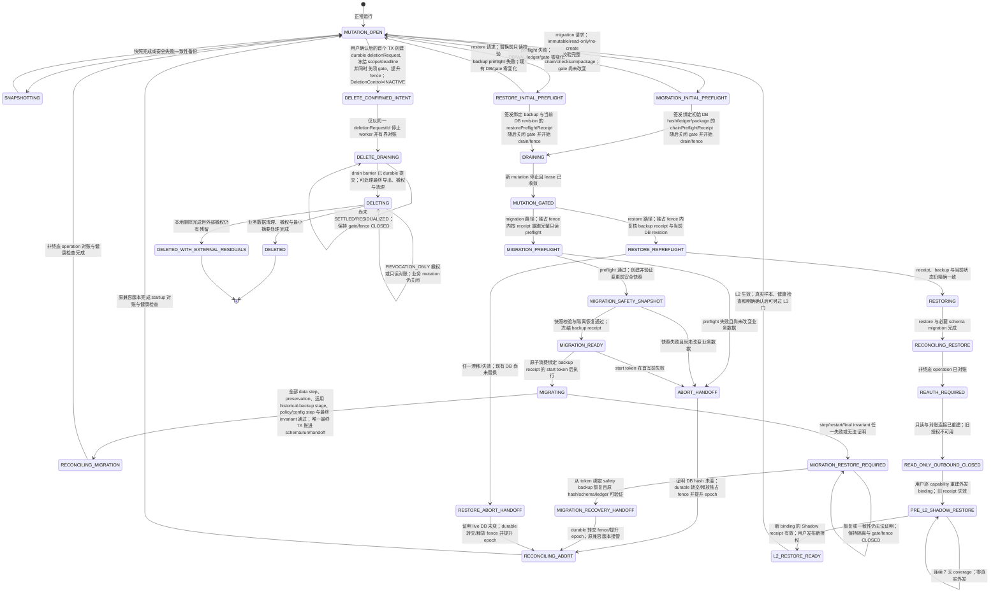
```mermaid
stateDiagram-v2
    %% @anchor DATA_MUTATION_GATE
    [*] --> MUTATION_OPEN : 正常运行
    MUTATION_OPEN --> SNAPSHOTTING : 普通在线一致性备份
    SNAPSHOTTING --> MUTATION_OPEN : 快照完成或安全失败
    MUTATION_OPEN --> MIGRATION_INITIAL_PREFLIGHT : migration 请求；immutable/read-only/no-create<br/>校验完整 chain/checksum/package；gate 尚未改变
    MIGRATION_INITIAL_PREFLIGHT --> MUTATION_OPEN : preflight 失败；DB/WAL/ledger/gate 零变化
    MIGRATION_INITIAL_PREFLIGHT --> DRAINING : 签发绑定初始 DB hash/ledger/package 的 chainPreflightReceipt<br/>随后关闭 gate 并开始 drain/fence
    MUTATION_OPEN --> RESTORE_INITIAL_PREFLIGHT : restore 请求；替换前只读校验 backup/schema/key/ledger
    RESTORE_INITIAL_PREFLIGHT --> MUTATION_OPEN : backup preflight 失败；现有 DB/gate 零变化
    RESTORE_INITIAL_PREFLIGHT --> DRAINING : 签发绑定 backup 与当前 DB revision 的 restorePreflightReceipt<br/>随后关闭 gate 并开始 drain/fence
    DRAINING --> MUTATION_GATED : 新 mutation 停止且 lease 已收敛
    MUTATION_GATED --> MIGRATION_PREFLIGHT : migration 路径；独占 fence 内按 receipt 重跑完整只读 preflight
    MIGRATION_PREFLIGHT --> MIGRATION_SAFETY_SNAPSHOT : preflight 通过；创建并验证变更前安全快照
    MIGRATION_PREFLIGHT --> ABORT_HANDOFF : preflight 失败且尚未改变业务数据
    MIGRATION_SAFETY_SNAPSHOT --> MIGRATION_READY : 快照校验与隔离恢复通过；冻结 backup receipt
    MIGRATION_SAFETY_SNAPSHOT --> ABORT_HANDOFF : 快照失败且尚未改变业务数据
    MIGRATION_READY --> ABORT_HANDOFF : start token 在首写前失败
    ABORT_HANDOFF --> RECONCILING_ABORT : 证明 DB hash 未变；durable 转交/释放独占 fence 并提升 epoch
    RECONCILING_ABORT --> MUTATION_OPEN : 原兼容版本完成 startup 对账与健康检查
    MIGRATION_READY --> MIGRATING : 原子消费绑定 backup receipt 的 start token 后执行
    MIGRATING --> RECONCILING_MIGRATION : 全部 data step、preservation、适用 historical-backup stage、<br/>policy/config step 与最终 invariant 通过；唯一最终 TX 推进 schema/run/handoff
    MIGRATING --> MIGRATION_RESTORE_REQUIRED : step/restart/final invariant 任一失败或无法证明
    MIGRATION_RESTORE_REQUIRED --> MIGRATION_RECOVERY_HANDOFF : 从 token 绑定 safety backup 恢复且原 hash/schema/ledger 可验证
    MIGRATION_RESTORE_REQUIRED --> MIGRATION_RESTORE_REQUIRED : 恢复或一致性仍无法证明；保持隔离与 gate/fence CLOSED
    MIGRATION_RECOVERY_HANDOFF --> RECONCILING_ABORT : durable 转交 fence/提升 epoch；原兼容版本接管
    RECONCILING_MIGRATION --> MUTATION_OPEN : 非终态 operation 对账与健康检查完成
    MUTATION_GATED --> RESTORE_REPREFLIGHT : restore 路径；独占 fence 内复核 backup receipt 与当前 DB revision
    RESTORE_REPREFLIGHT --> RESTORING : receipt、backup 与当前状态仍精确一致
    RESTORE_REPREFLIGHT --> RESTORE_ABORT_HANDOFF : 任一漂移/失效；现有 DB 尚未替换
    RESTORE_ABORT_HANDOFF --> RECONCILING_ABORT : 证明 live DB 未变；durable 转交/释放 fence 并提升 epoch
    RESTORING --> RECONCILING_RESTORE : restore 与必要 schema migration 完成
    RECONCILING_RESTORE --> REAUTH_REQUIRED : 非终态 operation 已对账
    REAUTH_REQUIRED --> READ_ONLY_OUTBOUND_CLOSED : 只读与对账连接已重建；旧授权不可用
    READ_ONLY_OUTBOUND_CLOSED --> PRE_L2_SHADOW_RESTORE : 用户逐 capability 重建外发 binding；旧 receipt 失效
    PRE_L2_SHADOW_RESTORE --> PRE_L2_SHADOW_RESTORE : 连续 7 天 coverage；零真实外发
    PRE_L2_SHADOW_RESTORE --> L2_RESTORE_READY : 新 binding 的 Shadow receipt 有效；用户发布新授权
    L2_RESTORE_READY --> MUTATION_OPEN : L2 生效；真实样本、健康检查和明确确认后可另过 L3 门
    MUTATION_OPEN --> DELETE_CONFIRMED_INTENT : 用户确认后的首个 TX 创建 durable deletionRequest、冻结 scope/deadline<br/>并同时关闭 gate、提升 fence；DeletionControl=INACTIVE
    DELETE_CONFIRMED_INTENT --> DELETE_DRAINING : 仅以同一 deletionRequestId 停止 worker 并有界对账
    DELETE_DRAINING --> DELETE_DRAINING : 尚未 SETTLED/RESIDUALIZED；保持 gate/fence CLOSED
    DELETE_DRAINING --> DELETING : drain barrier 已 durable 提交；可处理最终导出、撤权与清理
    DELETING --> DELETING : REVOCATION_ONLY 撤权或只读对账；业务 mutation 仍关闭
    DELETING --> DELETED : 业务数据清理、撤权与最小摘要处理完成
    DELETING --> DELETED_WITH_EXTERNAL_RESIDUALS : 本地删除完成但外部撤权仍有残留
    DELETED --> [*]
    DELETED_WITH_EXTERNAL_RESIDUALS --> [*]
```

任何 corrupt、future-schema、wrong-key 或 ledger-missing 备份都在替换现有数据前失败。普通在线备份只使用一致性快照，不 drain Worker，也不关闭 mutation gate。migration 与 restore 必须先在 `MUTATION_OPEN` 下用 immutable/read-only/no-create 预检并签发绑定初始 hash/revision 的回执；预检失败时 DB、WAL、ledger 与 gate 零变化。只有持有当前回执才关闭 gate 并 drain/fence，随后还要在独占 fence 内重验。delete 则必须由用户确认后的首个事务同时创建 durable deletionRequest、冻结 scope/deadline、关闭 gate 并提升 fence，之后所有 drain、导出、撤权和清理都绑定该 deletionRequestId；不得出现没有 durable 删除身份的孤儿 drain 窗口。

migration 不存在从通用 `MUTATION_GATED` 直达 `MIGRATING` 的路径：必须依次经过初始 chain preflight receipt、drain/fence 内完整 re-preflight、`MIGRATION_SAFETY_SNAPSHOT` 和持有可验证 backup receipt 的 `MIGRATION_READY`，再原子消费绑定该 receipt 的单次 start token。migration 只保证每个 data/policy/config step 与最终 promotion 事务各自原子，不声称整个多 step 过程可事务回滚；只有全部 data step、preservation invariant、适用的 historical-backup staging、policy/config 子集迁移与最终完整性复核通过，唯一最终 TX 才能同时推进公开 schema version、标记 run SUCCEEDED并生成 handoff。任一已写 step、重启状态、历史备份 stage、policy/config 或最终 invariant 失败/不可证明时进入 `MIGRATION_RESTORE_REQUIRED`，保持 gate/fence CLOSED，从该 token 绑定的安全备份恢复并验证原 hash/schema/ledger 后才发布 recovery handoff。fence 内 re-preflight、安全备份或首写前 token 任一失败时不得遗留无人持有的 fence 或直接开放写入：先证明 live DB hash 未变，以 durable abort handoff 释放/转交独占 fence并提升 fencing epoch，再由原兼容版本完成 startup 对账与健康检查后重开 gate。`DELETING` 的自循环只允许独立 `REVOCATION_ONLY` 删除控制面做固定目标撤权和只读对账。恢复只还原业务事实、审计与幂等账本，不还原可复用凭证、一次性 token、旧 Plan、旧 Shadow receipt 或 L3 授权；对账后由用户逐 capability 重建外发 binding，新 connector/account/credential lineage 必须先进入新的 `PRE_L2_SHADOW`，连续 7 天门通过并签发新 receipt 后才可创建新授权、恢复 L2；真实样本、健康检查和明确确认通过后才可另过 L3 门。无绑定变化的 migration 与普通短时离线不经过本 restore guard。
