# RoleFox v0.1 活动流程

- 状态：Accepted Design Baseline
- 上级索引：[UML 设计基线](README.md)
- 范围：覆盖首次配置、日常自治、异常、面试、暂停、退出和发布生命周期。

## RF-UML-ACT-ONB-01 首次配置与中断恢复

```mermaid
flowchart TB
    %% @anchor WORKSPACE_ONBOARDING
    %% @anchor ONBOARDING_REQUIRED_CONFIG
    %% @anchor ONBOARDING_CHECKPOINT_RESUME
    %% @anchor WORKSPACE_INITIALIZATION_RECOVERY_GUARD
    %% @anchor ONBOARDING_ABANDON_DELETION_BINDING
    %% @anchor EVIDENCE_THREE_WAY_CONFIRMATION
    %% @anchor EVIDENCE_CONFLICT_USER_RESOLUTION
    %% @anchor HISTORY_DECLARED
    %% @anchor HISTORY_NONE
    %% @anchor PARSE
    %% @anchor CLEANUP
    %% @anchor TEMP_ARTIFACT_CLEANUP
    Start([开始]) --> Choice{体验 Demo 还是配置真实 Workspace}
    Choice -->|Demo| Demo[加载纯合成数据]
    Demo --> DemoGuard[禁止真实凭证与 outbound]
    DemoGuard --> EndDemo([退出或转入真实配置])

    Choice -->|真实配置| BootstrapPreflight{业务 DB 外的 Local Supervisor 先只读校验<br/>binary/config/key 可用性、目标路径所有权与既有文件 header；<br/>不得创建 DB、WAL、ledger 或默认 checkpoint}
    BootstrapPreflight -->|全新目标且全部通过| ControlEnvelope[原子创建最小 WorkspaceControlEnvelope<br/>只含随机 workspaceId、精确存储对象/凭证 namespace、fencing epoch；无 PII/secret]
    ControlEnvelope --> InitRecord[随后才以单 TX 原子初始化 schema、WorkspaceRecoveryRecord 与初始 checkpoint<br/>Workspace=INITIALIZING；业务 mutation gate=CLOSED]
    InitRecord --> GateClosed[CAS Workspace=ONBOARDING<br/>未完成 onboarding 时业务 mutation gate 保持 CLOSED]
    BootstrapPreflight -->|既有/未完成目标且只读完整性通过| ExistingRecord[只读加载持久 WorkspaceRecoveryRecord 与最后已提交 checkpoint]
    ExistingRecord --> ResumePreflight
    BootstrapPreflight -->|可证明从未完成 onboarding，且配置/key/所有权或恢复事实失败| InitBlocked[仅写 Supervisor control record=INITIALIZATION_BLOCKED<br/>业务 DB 保持未创建或只读；mutation gate=CLOSED<br/>不得合成默认 checkpoint]
    BootstrapPreflight -->|既有 DB future/corrupt/wrong-key，或 prior lifecycle 为 ACTIVE/UNKNOWN| RuntimeStorageBlocked[仅写 OOB RUNTIME_STORAGE_BLOCKED + faultEpoch/fence<br/>业务 DB immutable 且零写入；不得把未知生命周期降成首次配置]
    InitBlocked -.修复后重试.-> BootstrapPreflight
    RuntimeStorageBlocked -.修复后重试.-> BootstrapPreflight
    GateClosed --> Locale[设置界面语言、IANA 时区、默认币种与通知偏好]
    Locale --> Storage[展示本地数据保存位置、运行方式与凭证隔离边界]
    Storage --> Resume[导入简历或手工填写]
    Resume --> Parse{解析是否成功}
    Resume -.用户取消解析.-> ParseCancelled[终止解析任务]
    ParseCancelled --> CleanupCancelled[删除临时文件、OCR 产物、中间缓存和未采用草稿]
    CleanupCancelled --> Manual
    Parse -->|否或仅部分成功| ParseFailure[记录解析器版本与失败原因；<br/>成功提取的片段保留为 UNVERIFIED，禁止虚构占位和外用]
    ParseFailure --> CleanupFailed[清理失败解析的临时文件、OCR 产物和中间缓存；<br/>原文件仅按用户选择保留]
    CleanupFailed --> Recovery{用户选择恢复方式}
    Recovery -->|重新上传| Resume
    Recovery -->|手工补充| Manual[编辑已提取片段或手工填写；仍须逐项确认]
    Parse -->|是| Review[逐条显示来源并三选：确认且可外用、<br/>正确但仅本地、待确认或修改]
    Manual --> Review
    Review --> Conflict{日期、职级、教育、技能或其他事实<br/>是否存在未解决语义矛盾}
    Conflict -->|是| ConflictView[并列显示每个值、来源、版本与影响；<br/>模型不得替用户选择，依赖材料/回复保持阻断]
    ConflictView --> ConflictChoice{用户选择、修正或禁用冲突事实}
    ConflictChoice --> ConflictRevision[创建新 Evidence revision 并使旧依赖 stale]
    ConflictRevision --> Review
    Conflict -->|否| CleanupParsed[清理解析临时文件、中间缓存和未采用草稿；只保留已采用 Evidence]
    CleanupParsed --> Critical{关键事实均明确}
    Critical -->|否| Save[自动保存进度]
    Save --> Later([稍后继续])
    Critical -->|是| Campaign[创建唯一求职 Campaign]
    Campaign --> History{是否存在任何历史申请}
    History -->|有| Existing[登记或导入历史申请并完成消歧]
    History -->|没有| None[显式确认暂无历史申请]
    Existing --> Declared[完成历史申请声明]
    None --> Declared
    Declared --> Connect[逐能力阅读连接器权限与凭证说明]
    Connect --> ConnectorKind{是否连接会读取真实业务数据的外部账号？}
    ConnectorKind -->|否；Fake/纯本地导入| Probe{连接器验证}
    ConnectorKind -->|是| RealPreflight{同 candidate/spec/catalog 的 G0 与 Gate C-pre<br/>是否已在任何凭证接收和真实业务数据读取前 PASS？}
    RealPreflight -->|否| RealBlocked[保持未连接；零凭证、零账号绑定、零真实数据 probe；<br/>返回缺失 Gate 与修复入口]
    RealPreflight -->|是| BindingIntent[凭证接收前生成 content-addressed Runtime Binding INTENT；<br/>冻结 Provider、requested scopes、redirect/target 与 criteria，尚无 account/lineage]
    BindingIntent --> VaultBind[受控完成 OAuth/API key/本机会话；可复用凭证只写 Vault]
    VaultBind --> BindingFinal[在任何真实业务数据 read/probe 前生成 FINALIZED Runtime Binding Manifest；<br/>引用 INTENT 并冻结去敏 account/binding/credential lineage 与 digest]
    BindingFinal --> Probe
    RealBlocked --> Degraded
    Probe -->|非必要连接器失败或跳过| Degraded[标记能力缺失并提供导入路径]
    Probe -->|通过| DryRun[运行合成 Dry-run]
    Degraded --> DryRun
    DryRun --> CalReady[配置输入完成；非外发能力可继续人工校准<br/>外发能力只具备启动 pre-L2 Shadow 的条件]
    CalReady --> CompletionCheck{只读复核 final checkpoint、关键事实、历史申请声明<br/>唯一 Campaign、合成 Dry-run 与所有引用 revision 完整吗}
    CompletionCheck -->|否| CompletionMissing([保持 Workspace=ONBOARDING 与业务 mutation CLOSED<br/>不创建 completion receipt；返回精确缺项])
    CompletionCheck -->|是| CompletionTx[同一 TX 创建 immutable OnboardingCompletionReceipt<br/>Workspace=ACTIVE；更新 WorkspaceRecoveryRecord 与 final checkpoint]
    CompletionTx --> Done([首次配置完成；真实外发仍为 0])
    CompletionTx -.CAS 或事务失败.-> CompletionMissing

    Locale -.每一步完成.-> Checkpoint[以 workspace + step + inputHash<br/>持久化幂等 checkpoint]
    Review -.每一步完成.-> Checkpoint
    Campaign -.每一步完成.-> Checkpoint
    Declared -.每一步完成.-> Checkpoint
    Connect -.每一步完成.-> Checkpoint
    DryRun -.每一步完成.-> Checkpoint
    Checkpoint -.页面、应用或设备中断后.-> Interrupted[Workspace=INTERRUPTED<br/>不得根据客户端当前页推断恢复点]
    Interrupted --> Reload[只读加载持久 WorkspaceRecoveryRecord 与最后已提交 checkpoint]
    Reload --> ResumePreflight{所有权、record/checkpoint revision 与 inputHash<br/>schema、key、migration ledger 是否完整}
    ResumePreflight -->|否| InitBlocked
    ResumePreflight -->|是| ResumeSaved[CAS Workspace=ONBOARDING；从精确 nextStep 继续<br/>复用既有 Evidence/Connector，禁止重复导入或授权]

    GateClosed -.任一未完成步骤选择放弃.-> DeleteConfirm{再次确认永久删除、不可恢复<br/>以及可能存在的外部授权残留}
    InitBlocked -.选择永久删除.-> BlockedDeleteConfirm{再次确认本地永久删除，且因业务库不可验证<br/>外部授权只能报告残留/手工撤销，不能猜测调用}
    RuntimeStorageBlocked -.选择永久删除.-> BlockedDeleteConfirm
    Later -.选择永久删除.-> DeleteConfirm
    ResumeSaved -.选择永久删除.-> DeleteConfirm
    DeleteConfirm -->|否| PreserveWorkspace([保留持久 checkpoint；继续保持业务 mutation 关闭])
    DeleteConfirm -->|是| DeleteTx[首个单 TX 生成 DeletionRequest genesis、不可复用 deletionRequestId 与固定 deadline，<br/>finalExportStatus=NOT_REQUESTED；Workspace=DELETING、Kill Switch=ON、业务 mutation gate=CLOSED；<br/>提升 fencing epoch；冻结 Connector account targets；DeletionControl=INACTIVE]
    DeleteTx --> StopWork[停止、drain 并 fence parser/import/OCR/embedding、调度与业务 worker<br/>迟到结果不得 commit]
    StopWork --> OnboardingDrain{零 active parser/task/Plan/Auth/Operation/Outbox，<br/>且冻结集合均已 SETTLED/RESIDUALIZED 吗}
    OnboardingDrain -->|否| OnboardingDeleteBlocked[保持 DELETING、DeletionControl=INACTIVE 与 gate CLOSED；<br/>按同一 deletionRequestId 安全重试]
    OnboardingDrain -->|是| OpenOnboardingRevocation[CAS DeletionRequest 写 drainBarrier；<br/>复核 finalExportStatus=NOT_REQUESTED 后切换 REVOCATION_ONLY]
    OpenOnboardingRevocation --> AccountLoop{还有冻结的 Connector account 吗}
    AccountLoop -->|有| Support{存在固定官方撤权入口<br/>且 connector 声明支持撤权吗}
    Support -->|否| UnsupportedResidual[写 residualType=UNSUPPORTED、externalOutcome=null<br/>绑定 deletionRequestId、targetHash、官方入口、deadline 与 reason<br/>Plan/Operation 引用仅在实际存在时填写]
    Support -->|是| Candidate{固定 revocation-target binding ID/hash、目标、conformance、<br/>schema/key/ledger、凭证绑定、deadline、fencing 与 SAFETY_CONTROL_GUARD 通过吗}
    Candidate -->|否；未创建执行计划| NotAttemptedResidual[写 residualType=NOT_ATTEMPTED、externalOutcome=null<br/>绑定 deletionRequestId、targetHash、官方入口、deadline 与 reason<br/>零 Plan/Auth/Operation/Outbox]
    Candidate -->|是| RevokeTx[在 DeletionControl=REVOCATION_ONLY 下单 TX 创建不可变窄化<br/>credential_revocation Plan/Evaluation/Auth/Operation/AuditIntent/Outbox<br/>全部冻结同一 revocation control、deletionRequest、target binding ID/hash、<br/>固定 targetHash、官方入口、deadline 与幂等键；业务 receipt/Grant/mode 为空]
    RevokeTx --> Recheck{外发前再次校验 Plan/Evaluation/Auth/Operation 的 revocation control、deletionRequest、<br/>target binding ID/hash 与当前 connector/version/account/credential lineage 精确一致；再核对固定目标、<br/>conformance、schema/key/ledger、payloadHash、expiry、deadline 与 fencing}
    Recheck -->|不通过且证明请求未发| CancelledResidual[Operation=CANCELLED；已进入 EXECUTING 的 Plan=CANCELLED<br/>reason 记录 INVALIDATED/EXPIRED/CONTROL_CLOSED<br/>residualType=NOT_ATTEMPTED；externalOutcome=null<br/>绑定 deletionRequestId、targetHash、官方入口、deadline 与 reason]
    Recheck -->|通过| Revoke[调用固定官方 credential_revocation 入口]
    Revoke --> RevokeResult{撤权结果}
    RevokeResult -->|成功| Revoked[Operation=SUCCEEDED；Plan=SUCCEEDED；保存证据]
    RevokeResult -->|明确失败| FailedResidual[Operation=FAILED_CONFIRMED；Plan=FAILED<br/>residualType=FAILED_CONFIRMED；externalOutcome=FAILED_CONFIRMED<br/>绑定 deletionRequestId、targetHash、官方入口、deadline 与 reason]
    RevokeResult -->|未知| Reconcile[Operation=OUTCOME_UNKNOWN 后进入 RECONCILING<br/>仅按原幂等键只读对账；禁止盲重试且 deadline 不延长]
    Reconcile --> ReconcileResult{原 deadline 前是否唯一裁决}
    ReconcileResult -->|已撤销| Revoked
    ReconcileResult -->|明确未撤销| FailedResidual
    ReconcileResult -->|deadline 到达仍未知| UnknownResidual[单 TX 写 residualType=UNKNOWN、externalOutcome=UNKNOWN 与最后证据<br/>绑定 deletionRequestId、targetHash、官方入口、deadline 与 reason<br/>Operation=RESIDUAL_RECORDED；Plan=CLOSED_WITH_EXTERNAL_RESIDUAL]
    Revoked --> NextAccount[完成该账户处理]
    UnsupportedResidual --> NextAccount
    NotAttemptedResidual --> NextAccount
    CancelledResidual --> NextAccount
    FailedResidual --> NextAccount
    UnknownResidual --> NextAccount
    NextAccount --> AccountLoop
    AccountLoop -->|没有| PurgeLocal[幂等删除本地 PII、简历/JD/消息正文、Evidence/草稿<br/>凭证/session/token、附件、缓存、向量、临时与受管副本]
    PurgeLocal --> VerifyLocal{零可读 PII/凭证/临时物且零 active task、Auth、Outbox<br/>本地删除 durable 完成吗}
    VerifyLocal -->|否| RemainDeleting([保持 DELETING 与业务 mutation CLOSED<br/>记录数据维护 Exception 并安全重试])
    VerifyLocal -->|是| ResidualCheck{存在 UNKNOWN、FAILED_CONFIRMED、<br/>UNSUPPORTED 或 NOT_ATTEMPTED residual 吗}
    ResidualCheck -->|否| Deleted([Workspace=DELETED<br/>DeletionControl=CLOSED])
    ResidualCheck -->|是| DeletedResidual([Workspace=DELETED_WITH_EXTERNAL_RESIDUALS<br/>DeletionControl=CLOSED；仅保留不可反推个人的限时最小摘要])

    BlockedDeleteConfirm -->|否| PreserveBlocked([保持隔离；业务 DB 只读且 mutation CLOSED])
    BlockedDeleteConfirm -->|是| SupervisorFence[Local Supervisor 停止该 workspace 的进程/句柄/任务<br/>提升外部 fencing epoch；生成 deletionRequestId 与固定 deadline]
    SupervisorFence --> InventoryReadable{WorkspaceControlEnvelope 与 Vault/Connector inventory<br/>可独立验证且路径/namespace 精确受限吗}
    InventoryReadable -->|是| BlockedResiduals[对每个已知外部账户写 NOT_ATTEMPTED residual + 官方手工撤权入口<br/>无可验证业务 ledger 与固定 target-binding inventory 时零自动撤权调用]
    InventoryReadable -->|否| UnknownInventory[写 INVENTORY_UNREADABLE residual 与通用 Provider 手工检查指引<br/>不猜测账户、目标或外部结果]
    BlockedResiduals --> OpaqueErase[关闭全部句柄后，由文件/Vault/backup 层按 control envelope<br/>幂等删除精确 workspace storage objects、credential namespace、临时物与受管备份<br/>绝不解析、迁移或写 future/corrupt/wrong-key 业务 DB]
    UnknownInventory --> OpaqueErase
    OpaqueErase --> SupervisorVerify{精确 scope 内零 workspace 文件、Vault item、backup 与 active process 吗}
    SupervisorVerify -->|否| SupervisorRetry[保持 Supervisor deletion journal=PENDING；隔离并安全重试]
    SupervisorVerify -->|是| SupervisorDeleted([独立 deletion journal=LOCAL_DELETED_WITH_EXTERNAL_RESIDUALS<br/>仅留不可反推个人的限时摘要；业务 DB 终态写入不是完成前提])
```

关键 Guard：首次配置完成仍保持 `DRY_RUN`；非外发能力可以进入人工复核校准，但任何真实**业务**外发 capability 只能先进入 `PRE_L2_SHADOW`。连续 7 天 Shadow 通过前，L2 人工批准也不能产生真实业务副作用；系统不得隐式开启 L2 外发或 L3。Accepted ADR-0003 的固定 heartbeat、一次停止告警和受支持的删除撤权只走隔离安全控制面，不取得业务模式/Grant/G1。中断恢复只能信任持久 `WorkspaceRecoveryRecord` 与已提交 checkpoint；能够证明从未完成 onboarding 的初始化失败进入 `INITIALIZATION_BLOCKED`。运行期故障仅在业务 DB 可安全写时持久化 `SAFE_READ_ONLY/RUNTIME_FAULT`；若 DB 为 future-schema、corrupt、wrong-key 或 ledger 不可读，则只在业务库外写 `RUNTIME_STORAGE_BLOCKED`、fault epoch 与 fence，绝不把未知生命周期当成首次配置。修复后先重跑 no-create preflight，再把 OOB fault 导入业务 OPEN barrier 并完成运行期对账，不能直接恢复业务 mutation。删除 fallback 通过精确 control envelope 在文件/Vault/backup 层清除 opaque 数据，绝不为删除而打开、迁移或写未知业务库，也不在缺少可验证固定 target-binding inventory 时猜测外部撤权。放弃 onboarding 即执行完整的 Workspace 永久删除，不是只删临时文件或仅标记“未开启外发”。

## RF-UML-ACT-IMPORT-01 已有申请接管与跨来源去重

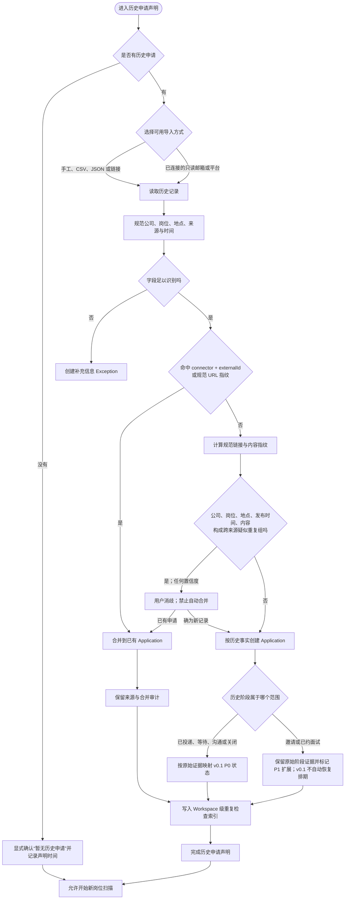

任何“不确定”都不能被当作“未投递”。只有稳定 connector + externalId 或规范 URL 指纹命中才自动关联；跨来源指纹只建立疑似组并请求消歧，绝不自动合并。每个 Workspace 对同一已确认机会最多一个活跃 Application；历史/顺序 Campaign 不能绕过 Workspace 全局去重与硬限额。

## RF-UML-ACT-CAL-01 Dry-run、pre-L2 Shadow、L2 校准与按能力开启 L3

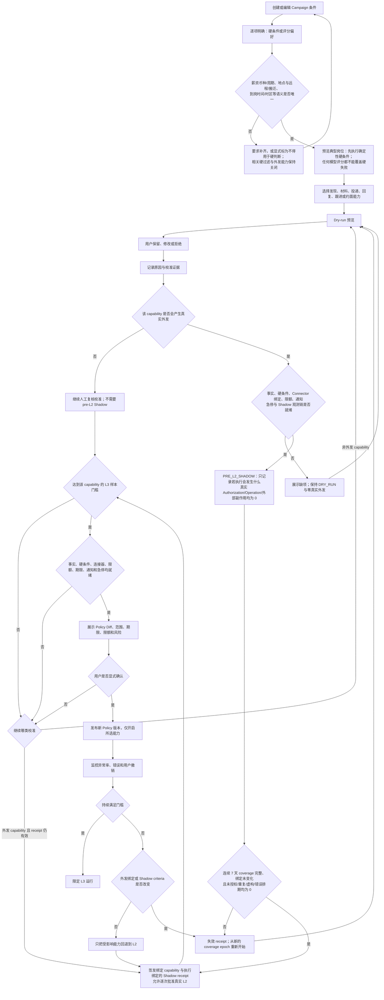

一次修改或批准不能跳过门槛或自动升级为长期授权。任何真实业务外发 capability（包括 L2 逐次确认）先完成连续 7 天 Shadow；Shadow 是业务 G1 的首次真实外发门，不是完成真实 L2 样本后的步骤。只有有效 receipt 存在，才可进入真实 L2 并为 G2/L3 积累样本。L3 再按 capability 独立开放：匹配/材料各 50 个决策；投递/回复各 20 次真实 L2；自动约面 5 次真实 L2 并通过 20 个合成异常 Case；未授权、重复、虚构和错误排期均为 0。Connector/version/account/credential lineage、criteria 或 coverage epoch 变化会使 receipt 失效并回到 `PRE_L2_SHADOW`。ADR-0003 的隔离安全控制不进入这套业务校准。

## RF-UML-ACT-JOB-01 岗位发现、判断与进入候选队列

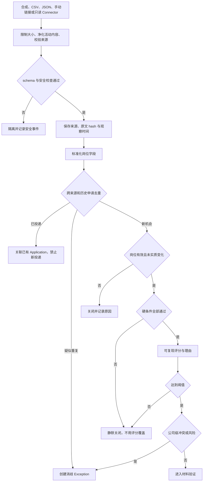

## RF-UML-ACT-MAT-01 Evidence 到可执行材料

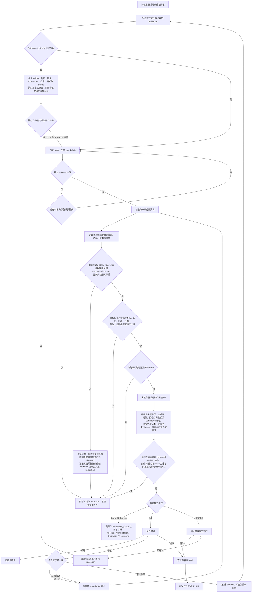

用户审阅页必须同时展示完整 Diff 与逐声明来源，不能只展示润色后的成品。低置信度、非法或跨 Workspace 的 Evidence 引用、过期 revision、未解决矛盾，以及风格改写造成的数值或事实变化都统一失败关闭；有限内部重试也不能降低这些门槛。

## RF-UML-ACT-AUTH-01 通用 ActionPlan、授权、执行与对账

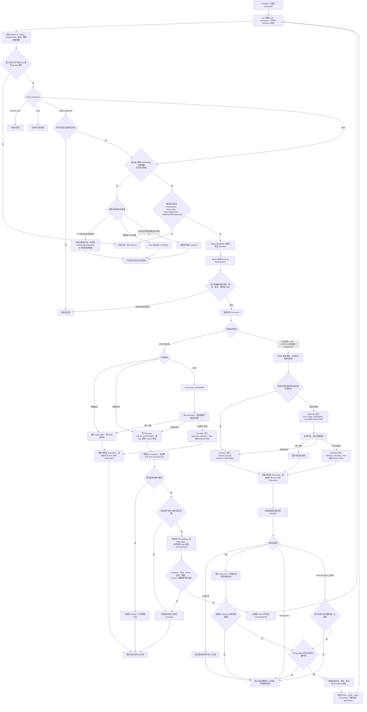

认证失效、限流、CAPTCHA/挑战和 unsupported 必须先把 ExternalOperation 收敛为“可证明未发”“明确失败”或“可能已发且对账中/待人工裁决”，再释放可释放 reservation、写审计并 ACK 当前派发，最后才局部降级或人工交接。任何 `OUTCOME_UNKNOWN` / `MANUAL_REVIEW` 子操作存在时，父 ActionPlan 保持 `EXECUTING`。人工交接不改变业务成功状态；只有用户登记或只读 Connector 获得外部证据后，才能由对应业务流程提交成功事实。挑战后只有旧 operation 已证明无副作用，才允许重读页面和岗位并创建全新 Plan；旧 Plan、DOM、token 与 payload 永不复用。

## RF-UML-ACT-MSG-01 入站消息与安全回答

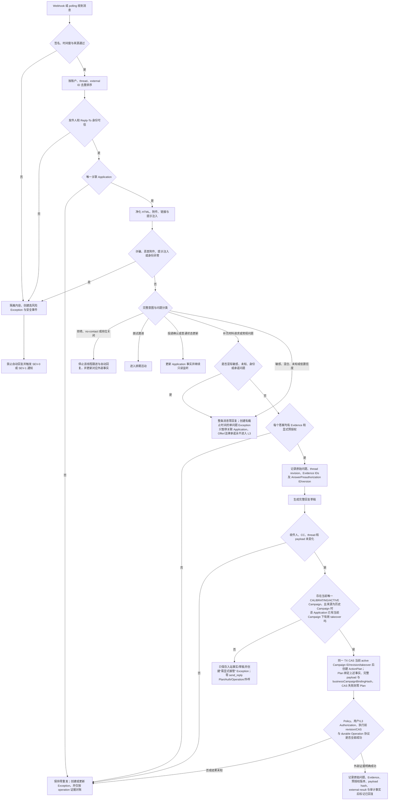

“隔离”只处理不可信内容载荷，不代表风险已经解决；诈骗、身份伪造、恶意附件或提示注入必须形成可见的 Exception。空 AnswerPreauthorization 等同于全部问题禁止自动回答。

## RF-UML-ACT-FUP-01 默认关闭且最多一次的跟进

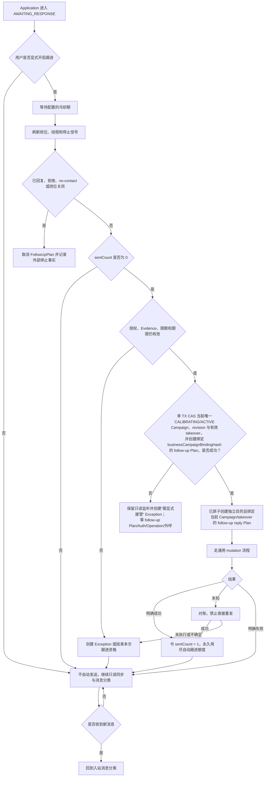

跟进默认关闭、执行失败、过期或一次额度用尽都只结束 FollowUpPlan，不关闭 Application 或 CommunicationThread。只有拒绝、no-contact、岗位关闭、撤回等独立外部事实，才能按 Application 规则改变其状态。

## RF-UML-ACT-INT-01 面试排期 Saga

```mermaid
flowchart TB
    %% @anchor FINAL_FREE_BUSY
    %% @anchor INTERVIEW_SCHEDULED
    %% @anchor RULE
    %% @anchor EXACT
    Invite[已验证且已关联的面试邀请] --> Parse[保留原文并解析日期、时间、时区、时长和方式]
    Parse --> Exact{是否唯一映射到 UTC instant 与 IANA 时区}
    Exact -->|否| Clarify[创建澄清草稿；仅在当前 active Campaign/有效 takeover guard、模板预授权且<br/>完整经过 Reply Plan/Auth/Operation 时外发，否则创建 Exception]
    Exact -->|是| Questions{招聘方问题是否全部解决}
    Questions -->|否| Exception[整条排期进入 Exception]
    Questions -->|是| Slots{时段数量}
    Slots -->|多个| Rule{是否有明确时段优先规则}
    Rule -->|否| Exception
    Rule -->|是| Select[选择唯一候选时段]
    Slots -->|一个| Select
    Select --> Busy[读取同一 Provider 账户的 busy calendars 并集，<br/>应用前后 buffer、blackout、工作窗口与通勤区间的完整 Policy]
    Busy --> Fresh{free/busy 快照是否仍在新鲜度窗口}
    Fresh -->|否| Refresh[刷新 free/busy]
    Refresh --> RefreshOK{刷新成功吗}
    RefreshOK -->|否| Exception
    RefreshOK -->|是| Conflict
    Fresh -->|是| Conflict{候选时段是否冲突}
    Conflict -->|是| NoCreate[保持零 reservation、零 Calendar event 与零招聘回复]
    NoCreate --> Alternative{允许提出替代时段吗}
    Alternative -->|否| Exception
    Alternative -->|是| Clarify
    Conflict -->|否| SchedulePlanCAS{单 TX CAS 当前唯一 CALIBRATING/ACTIVE Campaign、revision/takeover、<br/>free-busy snapshot/slot revision；同时创建双 operation readiness 与冻结<br/>businessCampaignBindingHash/精确 slot snapshot 的 schedule_interview Plan，是否成功？}
    SchedulePlanCAS -->|否| TakeoverNeeded[保持 Interview PROPOSED；按失败原因为刷新或“需显式接管” Exception；<br/>零 reservation/Plan/Auth/Operation/外呼]
    SchedulePlanCAS -->|是| PolicyDecision{Policy 对当前已原子创建的 Plan 的结果}
    PolicyDecision -->|L3 且精确命中 SchedulePreauthorization| Commit{单 TX 再 guard 当前 Campaign/takeover、slot/snapshot 与唯一约束，<br/>并创建 Authorization、双 Operation、初始 InterviewSlotReservation、<br/>额度、AuditIntent 与 Saga Outbox，是否全部提交成功？}
    PolicyDecision -->|L2 require approval| Approval[展示精确时段、时区、写入/忙碌日历、回复正文、风险、期限与两个外部动作]
    Approval --> UserDecision{用户决定}
    UserDecision -->|拒绝| ApprovalDenied[Plan DENIED；零 Reservation/Operation/Outbox]
    UserDecision -->|批准当前 hash| ApprovalCAS{Plan、slot、日历集合、账号、Connector、Policy 与 control 仍一致吗}
    ApprovalCAS -->|否| ApprovalStale[Plan INVALIDATED；创建单问题 Exception；零 Reservation/Operation/Outbox]
    ApprovalCAS -->|是| Commit
    PolicyDecision -->|deny 或 Connector 不足以安全执行| PolicyDenied[Plan DENIED；创建 Exception；零 Reservation/Operation/Outbox]
    Commit -->|否| CommitStale[Plan INVALIDATED；按 Campaign/slot/绑定失败原因创建单问题 Exception；<br/>事务整体回滚，零 Reservation/Operation/Outbox]
    Commit -->|是| FinalBusy[紧邻外发前再次查询最终 free/busy]
    FinalBusy --> FinalFree{仍空闲且本地 reservation 有效}
    FinalFree -->|否| Release[两个未派发 Operation 与父 ActionPlanRecord 进入 CANCELLED<br/>释放 reservation]
    Release --> Alternative
    FinalFree -->|是| CampaignExecCAS{执行前再次 CAS 当前 active Campaign ID/revision/takeover<br/>与 Plan 中 businessCampaignBindingHash 是否一致？}
    CampaignExecCAS -->|否| Release
    CampaignExecCAS -->|是| Calendar[在唯一写入日历执行 CalendarOperation<br/>创建候选人私有 tentative event]
    Calendar --> CalendarResult{日历结果}
    CalendarResult -->|明确失败| ProviderFailure[标记 calendarOp FAILED_CONFIRMED<br/>取消未派发 replyOp；释放 reservation]
    ProviderFailure --> ProviderException[Provider failure Exception<br/>零招聘回复；重新取证/授权后才可重计划]
    CalendarResult -->|未知| CalReconcile[calendarOp OUTCOME_UNKNOWN<br/>replyOp 不可派发；只读对账]
    CalReconcile --> CalEvidence{对账证据}
    CalEvidence -->|唯一成功| Persist
    CalEvidence -->|证明未创建| ProviderException
    CalEvidence -->|仍歧义| Partial[Interview 保持 PROPOSED；人工裁决，禁止发送回复]
    CalendarResult -->|明确成功| Persist[持久化 event external ID 与日历成功事实]
    Persist --> Reply[执行独立 ReplyOperation 向招聘方确认]
    Reply --> ReplyResult{回复结果}
    ReplyResult -->|明确成功| Scheduled[Interview 首次进入 SCHEDULED]
    ReplyResult -->|未知| ReplyReconcile[replyOp OUTCOME_UNKNOWN<br/>禁止重发并只读对账]
    ReplyReconcile --> ReplyEvidence{对账证据}
    ReplyEvidence -->|唯一成功| Scheduled
    ReplyEvidence -->|证明未发送| Cancel
    ReplyEvidence -->|仍歧义| Partial
    ReplyResult -->|明确失败| Cancel[以新 Plan/Operation 取消 tentative event]
    Cancel --> CancelResult{取消结果}
    CancelResult -->|明确成功| Compensated[保持 PROPOSED；释放 slot/额度]
    CancelResult -->|失败或未知| Sev1[SEV-1 Exception；暂停自动约面 capability]
    Scheduled --> Milestone[Application 只记录 INTERVIEW_SCHEDULED 里程碑]
    Milestone --> Notify[创建独立成功通知]
    Notify --> Handoff[生成准备包并移交用户]
```

v0.1 固定一个 Calendar Provider 账户和一个写入日历，读取同账户多个 busy calendars 的并集；跨账户聚合延期。Calendar Connector 只有具备查询/对账、幂等创建、更新/取消和稳定 external ID 才能开放 L3。L2 不要求预先存在 SchedulePreauthorization，而是让用户批准当前完整双动作 Plan；批准后仍走相同的 calendar-first Saga，并在真正外发前再次进行 CAS 与 free/busy 复核。事件为候选人私有 tentative event，不含招聘方 attendee、不会触发日历邀请；招聘确认只走已授权 Reply Connector。准备包包含已接受的核心事实字段，AI 面试建议为 P1。

时间歧义或无可用时段时，`Clarify` 不直接调用消息 Connector：系统先生成绑定当前 thread revision、收件人、模板、Evidence 和期限的 Reply ActionPlan，并完整复用 `RF-UML-SEQ-MSG-01` 的 Policy、Authorization、Operation、Outbox、执行前复核与三态对账路径。缺少模板预授权或任一绑定不完整时只创建 Exception，保持零外发。

## RF-UML-ACT-EXC-01 Exception 处理与精确恢复

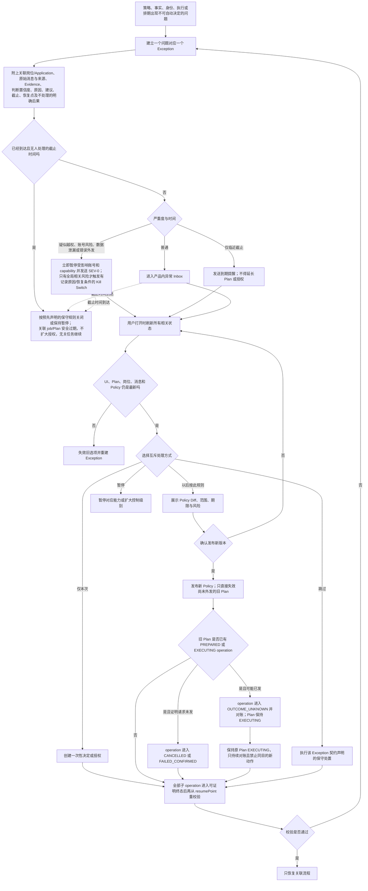

## RF-UML-ACT-PAUSE-01 三级人工控制与恢复

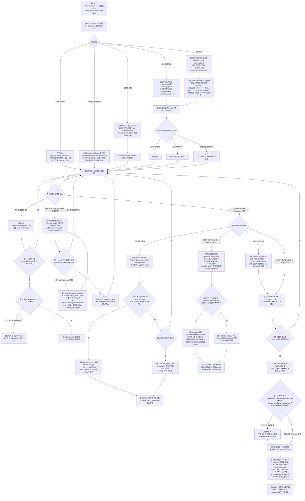

该活动统一展示 Workspace 三级人工控制、capability 用户暂停与 scoped safety hold；普通离线恢复见 `RF-UML-ACT-OFF-01`。解除 `PAUSE_NEW` 不把既有 Application 的未受影响 capability 强制降级：绑定和授权仍有效时恢复进入暂停前保存的 L2/L3 模式，但暂停期间失效的旧 Plan 不复活，新发现/投递必须基于当前事实重新建 Plan。进入 `STOP_OUTBOUND` / `KILL_SWITCH` 时，每个外发 capability 都以同一新 `recoveryEpoch` 标记 `recoveryRequired=true`；旧 Plan 和授权不复活，用户逐 capability 首先恢复到 L2并只清除该能力当前 epoch。即使全局覆盖层回到 `RUNNING`，其他未清 recovery barrier 的能力仍失败关闭；若 binding 已变化则更早回到 `PRE_L2_SHADOW`。单项“暂停此类动作”只设置该 capability 的 `userMode=PAUSED`，不改变 Workspace `ControlOverlay`；用户恢复不会解除 `safetyHoldStatus=HELD`。safety hold 只能在同一 `safetyFaultEpoch` 的原因消除、RuntimeHealth、对账、当前 binding/receipt 与 clearance evidence 全部通过后由系统清除；清除时若 `userMode=PAUSED` 仍存在则能力仍不可执行。若 binding/receipt 已变化，系统保持 `HELD`，仅生成零副作用 `SHADOW_ONLY` 评估/coverage，在取得当前 receipt 后再复核同一 epoch，不能先清 hold 再校准。

## RF-UML-ACT-OFF-01 Worker、Runner 离线与普通恢复

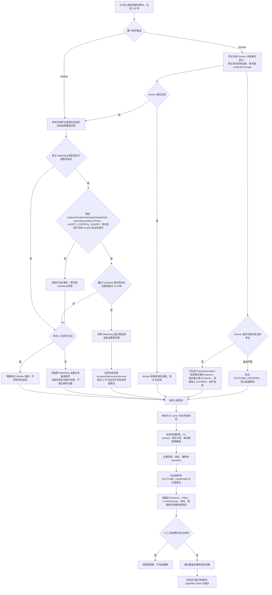

普通短时离线恢复不强制把能力模式改成 L2，也不解除人工暂停。积压重校验只直接取消或失效未外发的 `DRAFT`、`AWAITING_APPROVAL`、`AUTHORIZED` Plan；已有 `PREPARED` / `EXECUTING` operation 时，证明未发才取消，可能已发则进入 `OUTCOME_UNKNOWN → RECONCILING`，父 Plan保持 `EXECUTING` 并阻止同目的重发。备份恢复属于 `RF-UML-ACT-REL-01`：凭证、旧 Shadow receipt 与 L3 授权保持关闭，完成对账和新 binding 的 7 天 `PRE_L2_SHADOW` 后，才逐 capability 恢复到首个 live 模式 L2。

## RF-UML-ACT-DATA-01 数据生命周期操作路由

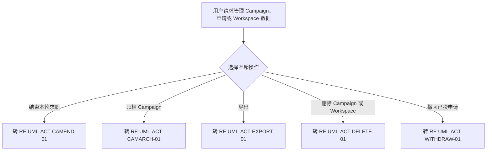

路由本身不改变任何业务状态。结束、归档、导出、删除和撤回是五个独立命令；删除本地数据不会被解释为撤回外部申请，结束 Campaign 也不会自动归档。

## RF-UML-ACT-CAMEND-01 结束 Campaign 与已有申请监听

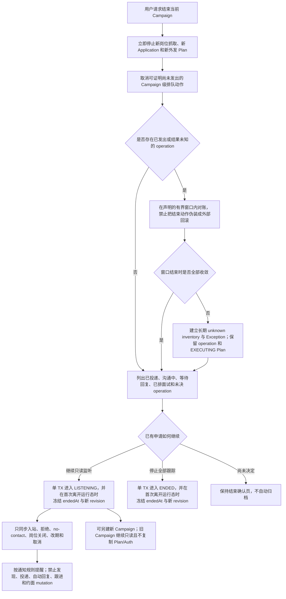

结束 Campaign 不撤回任何已投申请，也不删除申请、沟通、面试、operation 或审计事实。进入 `LISTENING` 或 `ENDED` 的同一 CAS 事务首次冻结 `endedAt` 与新 revision；后续迟到事实、归档或只读对账不得重置保留期时钟。有界对账超时不会无限阻塞 `ENDED` / `LISTENING`；未决 operation 以长期 inventory 和 Exception 保留，继续对账但禁止普通重发。历史 `LISTENING` 可与一个新的 `CALIBRATING`/`ACTIVE` Campaign 并存，但 Workspace 全局去重与硬限额仍覆盖全部 Campaign。

## RF-UML-ACT-CAMARCH-01 归档 Campaign 与开启新周期

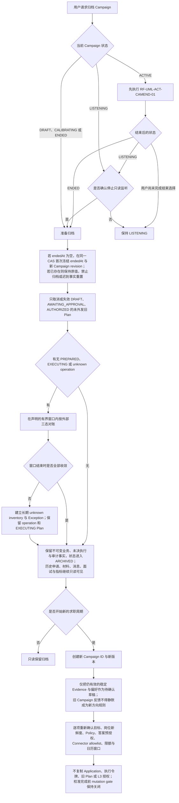

归档不是删除，也不是恢复入口；有界对账超时不无限阻塞归档，未决 operation 和父 Plan 继续保留并对账。对归档 Campaign 的“继续求职”必须创建新 Campaign，不能复活旧执行状态。

## RF-UML-ACT-EXPORT-01 导出一致性快照

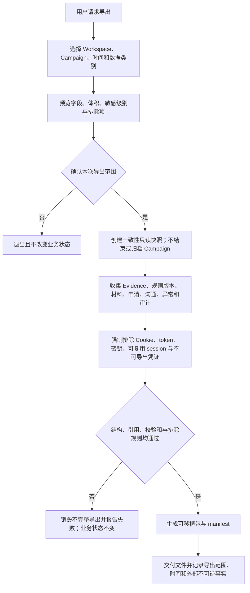

导出是只读操作，不隐式关闭全局 mutation gate；实现必须用一致性快照或等价读隔离获得稳定视图。导出文件的本地保存位置和加密由用户显式选择。

## RF-UML-ACT-DELETE-01 删除 Campaign 或 Workspace

```mermaid
flowchart TB
    %% @anchor RETENTION_SCHEDULE
    %% @anchor DELETE_PII_FIRST
    %% @anchor EXTERNAL_RESIDUAL
    RetentionTick[每日幂等保留期调度] --> RetentionRead[读取版本化 retention policy、数据类别、不可变 lifecycle/import/backup 时钟、<br/>全部引用 Campaign status/endedAt 与 RetentionExtensionRecord current head]
    RetentionRead --> RetentionClass{先选择数据类别；禁止先套统一 90 天时钟}
    RetentionClass -->|raw JD、消息正文、附件| ActiveRef{任一引用 Campaign 处于 CALIBRATING/ACTIVE 且仍明确需要原文，<br/>或迟到入站尚未完成一次受控结构化抽取吗}
    ActiveRef -->|是| Retain[保留并记录保护原因与下次检查时间；不得重置 endedAt]
    ActiveRef -->|否| RawClock[default expiry = 最大已结束引用 Campaign.endedAt + 90 天；<br/>无 Campaign 引用的历史导入 = importedAt + 90 天]
    RetentionClass -->|结构化申请历史、材料版本、最小审计| StructuredClock[default expiry = 同一冻结 lifecycle/import 基点 + 1 年；<br/>迟到事实、状态切换和后台任务不得重置]
    RetentionClass -->|滚动备份 generation| BackupClock[default expiry = 该 generation.createdAt + 30 天；<br/>不读取 Campaign activeRef/endedAt]
    RawClock --> EffectiveExpiry[只读取该 scope/dataCategory 当前 ACTIVE extension head；<br/>effective expiry=max default expiry 与 extendedUntil]
    StructuredClock --> EffectiveExpiry
    BackupClock --> EffectiveExpiry
    EffectiveExpiry --> Due{当前时间已达到 effective expiry 吗}
    Due -->|否| Retain
    Due -->|是| PendingRefs{raw/structured 类别仍有未决 operation 需要对账引用吗}
    PendingRefs -->|是| MinimizeRefs[先提取不可反推个人的 operation ID、externalRef hash、状态与时间<br/>不得保留原始 JD、消息正文或附件]
    PendingRefs -->|否或 backup 不适用| PurgeClass{按先前已冻结的数据类别执行}
    MinimizeRefs --> PurgeClass
    PurgeClass -->|raw| PurgeRaw[按 workspace + record + policyVersion 幂等删除正文与派生副本]
    PurgeClass -->|structured| PurgeStructured[幂等删除或不可逆脱敏]
    PurgeClass -->|backup| PurgeBackup[删除到期 backup generation]
    PurgeRaw --> RetentionVerify{删除提交与范围校验}
    PurgeStructured --> RetentionVerify
    PurgeBackup --> RetentionVerify
    RetentionVerify -->|成功| RetentionAudit[记录类别、policyVersion、数量和完成时间；不保留被删正文]
    RetentionVerify -->|失败或部分完成| RetentionFailure[保持到期标记；有界重试并创建数据维护 Exception]

    ExtensionRequest[用户为精确 scope/dataCategory 请求延长或撤销延长] --> ExtensionCAS{expected current-head revision 是否仍当前}
    ExtensionCAS -->|否| ExtensionConflict[拒绝覆盖；展示最新期限与影响并要求重新确认]
    ExtensionCAS -->|延长且通过| ExtensionActive[只追加 ACTIVE revision、extendedUntil 与确认 evidence；supersedes old head]
    ExtensionCAS -->|撤销且通过| ExtensionRevoked[只追加 REVOKED revision 与 revokedAt/evidence；supersedes old head<br/>不得删除历史或恢复已清除数据]
    ExtensionActive --> RetentionTick
    ExtensionRevoked --> RetentionTick

    Request[用户请求永久删除] --> Target{删除范围}
    Target -->|单个 Campaign| CampaignState{Campaign 是否为 DRAFT、ENDED 或 ARCHIVED}
    CampaignState -->|否：CALIBRATING、ACTIVE 或 LISTENING| RejectCampaignDelete[拒绝删除；先结束或归档 Campaign]
    CampaignState -->|是| CampaignImpact[仅展示将删除的 Campaign 规则、偏好副本、未采用草稿和可安全再生数据]
    Target -->|整个 Workspace| WorkspaceImpact[展示全部本地数据、连接器、凭证和受管备份范围]
    CampaignImpact --> Warn[明确说明外部投递、消息、日历事件不能靠本地删除召回]
    WorkspaceImpact --> Warn
    Warn --> ExportChoice{是否要求删除前最终导出}
    ExportChoice -->|是| RememberExport[只记录导出选择；确认前不生成文件]
    ExportChoice -->|否| SkipExport[记录不导出]
    RememberExport --> Confirm{再次确认不可逆删除}
    SkipExport --> Confirm
    Confirm -->|否| Cancel[退出，不改变数据]
    Confirm -->|是| BeginDelete{已确认的删除范围}
    BeginDelete -->|Campaign| CampaignDeleteCAS{CAS guard 当前仍为 DRAFT/ENDED/ARCHIVED<br/>且 expected revision 未变化？}
    CampaignDeleteCAS -->|否| CampaignStateChanged[拒绝本次删除且不关闭 gate；展示新状态，<br/>重新评估后由用户再次确认]
    CampaignDeleteCAS -->|是| CampaignDeletingTx[首个单 TX 创建 deletionRequestId、固定 drain cutoff、finalExportRequested，<br/>Campaign=DELETING；冻结 scope/revision；关闭目标 mutation gate 并提升 fence]
    BeginDelete -->|Workspace| WorkspaceDeletingTx[首个单 TX 创建 deletionRequestId、固定 drain/reconciliation deadline、finalExportRequested，<br/>Workspace=DELETING；Kill Switch=ON、mutation gate=CLOSED、提升 fence、冻结撤权目标；<br/>DeletionControl 保持 INACTIVE]
    CampaignDeletingTx --> StopScope[按 deletionRequestId 幂等停止目标调度/worker；崩溃后从 DELETING journal 恢复]
    WorkspaceDeletingTx --> StopScope
    StopScope --> Queued[取消可证明未发出的 Plan 与 operation]
    Queued --> InFlight{是否存在已发出或结果未知的 operation}
    InFlight -->|是| Reconcile[限时对账并记录无法唯一裁决项]
    InFlight -->|否| DrainCommitted[按 deletionRequestId 提交 SETTLED drain barrier]
    Reconcile --> DrainCommitted[按固定 cutoff 提交 SETTLED 或 RESIDUALIZED barrier；<br/>unknown 只保留不可反推个人的最小结果摘要]
    DrainCommitted --> ScopeAction{读取 deletion journal 中冻结的范围与 finalExportRequested}
    ScopeAction -->|Campaign| CampaignExportChoice{冻结记录是否要求最终导出}
    CampaignExportChoice -->|是| CampaignExport[在目标 scope gate CLOSED 下<br/>从一致性只读视图完成 RF-UML-ACT-EXPORT-01]
    CampaignExportChoice -->|否| CampaignPurge
    CampaignExport --> CampaignExportResult{导出校验、交付与 evidence 是否成功？}
    CampaignExportResult -->|是| CampaignPurge[清理规则、偏好副本、未采用草稿和可安全再生数据；保留 tombstone]
    CampaignExportResult -->|否| CampaignExportBlocked[DeletionRequest=EXPORT_BLOCKED；保持 DELETING/gate CLOSED<br/>不得由后台默认继续删除]
    CampaignExportBlocked -->|用户重试| CampaignExport
    CampaignExportBlocked -->|用户看到失败后明确放弃导出| CampaignExportWaived[只追加 WAIVED_AFTER_FAILURE revision + confirmation evidence]
    CampaignExportWaived --> CampaignPurge
    CampaignPurge --> CampaignBackups[只清理上述可删除数据的受管副本，不级联历史聚合]
    CampaignBackups --> CampaignVerify{冻结 scope 内规则、偏好副本、未采用草稿与受管副本<br/>是否全部清除且 tombstone/历史聚合完整？}
    CampaignVerify -->|否| CampaignDeleteFailure[保持 Campaign=DELETING 与 gate CLOSED；<br/>创建 SEV-1 数据维护 Exception 并安全重试]
    CampaignVerify -->|是| CampaignDeleted[Campaign 进入 DELETED；历史 Application、Interview、Message、Operation、Audit 保留]
    ScopeAction -->|Workspace| WorkspaceExportChoice{冻结记录是否要求最终导出}
    WorkspaceExportChoice -->|是| WorkspaceExport[在 Workspace gate CLOSED 下<br/>从一致性只读视图完成最终导出]
    WorkspaceExportChoice -->|否| EnableRevocationTx
    WorkspaceExport --> WorkspaceExportResult{导出校验、交付与 evidence 是否成功？}
    WorkspaceExportResult -->|否| WorkspaceExportBlocked[DeletionRequest=EXPORT_BLOCKED；保持 DELETING/gate CLOSED<br/>不得由后台默认继续撤权或清除]
    WorkspaceExportBlocked -->|用户重试| WorkspaceExport
    WorkspaceExportBlocked -->|用户看到失败后明确放弃导出| WorkspaceExportWaived[只追加 WAIVED_AFTER_FAILURE revision + confirmation evidence]
    WorkspaceExportResult -->|是| EnableRevocationTx[CAS 同一 deletionRequestId/deadline/frozen targets + SUCCEEDED export evidence；<br/>在业务 mutation 仍 CLOSED 时只开放 REVOCATION_ONLY]
    WorkspaceExportWaived --> EnableRevocationTx
    EnableRevocationTx --> Revoke[限时尝试撤销 Connector 授权和外部 token]
    Revoke --> RevokeResult{外部撤权是否全部成功}
    RevokeResult -->|否| Residual[生成外部残留清单；不得因此无限阻塞本地 PII 删除]
    RevokeResult -->|是| WorkspacePurge
    Residual --> WorkspacePurge[优先幂等清理本地 PII、附件、缓存、向量和凭证引用]
    WorkspacePurge --> WorkspaceBackups[按保留策略清理全部受管备份与派生副本]
    WorkspaceBackups --> WorkspaceVerify{本地 PII/凭证/文件/备份/任务是否均按冻结 scope 清除？}
    WorkspaceVerify -->|否| WorkspaceDeleteFailure[保持 Workspace=DELETING 与 gate CLOSED；<br/>创建 SEV-1 数据维护 Exception 并安全重试]
    WorkspaceVerify -->|是| ResidualCheck{是否存在外部残留}
    ResidualCheck -->|否| WorkspaceDeleted[Workspace 进入 DELETED]
    ResidualCheck -->|是| WorkspaceResidual[进入 DELETED_WITH_EXTERNAL_RESIDUALS]
    WorkspaceResidual --> Minimal[仅留限时、不可反推个人的残留说明]
```

Campaign 删除不是聚合级联删除：历史 Application、Interview、Message、ExternalOperation 和 Audit 保留，或只在后续 Workspace 删除时按 Workspace 策略删除/脱敏。本地清理或存储失败时保持 `DELETING` 并创建 `SEV-1` Exception，不能谎报删除完成。Campaign 活跃期保留必要数据；到达 `endedAt + 90 天` 后删原始 JD、消息正文与附件；结构化申请历史、材料版本和最小审计摘要保留 1 年；滚动备份保留 30 天。未决对账只能保留不可反推个人的最小 operation 引用/hash，不能延长正文或附件期限。用户可随时导出/删除或通过只追加的 `RetentionExtensionRecord` 明确选择更长保留期；撤销后按默认时钟和当前时间立即重算，不能恢复已删数据或暗中续期。显式删除请求不等待定时调度。删除向导只能在确认前记录“是否最终导出”；用户确认后的**第一笔事务**必须创建 durable `deletionRequestId`、冻结 scope/revision/导出选择和 deadline、进入 `DELETING` 并关闭目标 mutation gate/fence，之后才停止任务、对账或导出。任何最终导出都从该冻结 journal 和一致性只读视图生成；崩溃恢复只按同一 deletionRequestId 继续。Workspace 只在 drain barrier 与可选导出收敛后开放限时 `REVOCATION_ONLY`，任何阶段都不能重新开放业务写入。

## RF-UML-ACT-WITHDRAW-01 撤回已投 Application

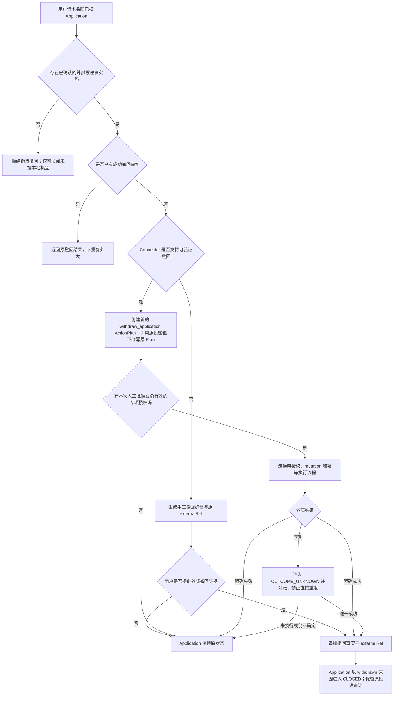

撤回是新的对外动作，不是删除或补偿原投递。即使撤回成功，已经发送给平台或招聘方的内容也可能无法召回。

## RF-UML-ACT-INTCHANGE-01 面试改期与取消

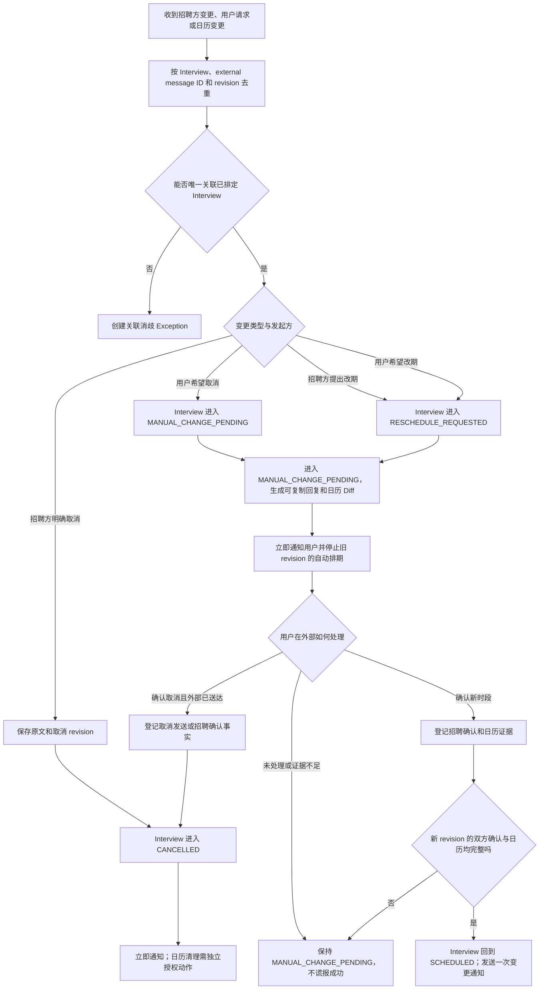

v0.1 默认由用户处理改期和取消；工具负责去重、保留事实、生成辅助内容、持续监控并通知。任何外部回复或日历 mutation 都必须作为新 Plan 经过授权，不能沿用首次约面的旧 Plan。

## RF-UML-ACT-REL-01 安装、升级、恢复与能力开放门

```mermaid
flowchart TB
    %% @anchor DATA_MUTATION_GATE
    %% @anchor PREFLIGHT
    %% @anchor INIT
    %% @anchor ONLINE_BACKUP
    %% @anchor RESTORE_NO_L3
    %% @anchor REAL_PROVIDER_RELEASE_GATE
    ResearchFreeze[招募/采集/回放前冻结获批的 SPEC_OR_EXPERIMENT scope、cohort、criteria 与 digest] --> PreW1{Pre-W1 Gate 1 是否为当前 PASS？}
    PreW1 -->|否| ResearchOnly[只允许问题验证、只读 spike 与范围修订；不得启动 W1]
    PreW1 -->|是| W1Kickoff[追加不可变 W1_KICKOFF；引用 Pre-W1 head 与同一 spec/research digest<br/>首个 BUILD manifest 必须晚于并引用该记录]
    W1Kickoff --> Install[全新安装]
    Install --> Preflight{版本、权限、端口、配置、安全默认值、<br/>加密主密钥与凭证 schema 必填字段是否有效}
    Preflight -->|必需项失败| Explain[拒绝启动并给出修复信息；禁止示例值、空密钥或降级明文；<br/>全部 Connector mutation 保持关闭]
    Preflight -->|仅可选 mutation 依赖不可用且核心密钥有效| SafeReadOnly[用户显式选择安全只读模式；<br/>全部 Connector mutation 保持关闭，修复后必须重跑 preflight]
    SafeReadOnly --> Init
    SafeReadOnly -.依赖修复后.-> Preflight
    Preflight -->|通过| Init[原子初始化 schema 与 migration ledger]
    Init --> G0{G0 真实数据门是否通过}
    G0 -->|否| Synthetic[仅合成数据模式]
    G0 -->|是| CPre{Gate C-pre 条款、最小 requested scope、认证/只读接口契约、<br/>Fake/test 可观测与沙箱检查是否为当前 PASS？真实业务数据必须为 0}
    CPre -->|否| PreRelease
    CPre -->|是| BindIntent[连接/收凭证前生成绑定 candidate/spec/catalog、Provider、requested scopes<br/>与 redirect/target 的 Runtime Binding INTENT；尚不伪造 account/lineage]
    BindIntent --> ConnectReal[受控完成 OAuth/API key、本地凭证验证与最小权限检查；凭证只写 Vault]
    ConnectReal --> BindFinal[生成引用 INTENT 的 FINALIZED Runtime Binding Manifest<br/>冻结去敏 account/binding/credential lineage、binding digest 与 criteria epoch]
    BindFinal --> RealRead[随后才允许最小真实业务数据读取]
    RealRead --> CRead{每个真实 READ scope 的 Gate C-read<br/>稳定性与最小权限是否当前 PASS？}
    CRead -->|否| ReadOnly[保持合成/本地只读并修复；不得把 READ scope 伪装成 Shadow]
    CRead -->|是| ReadScopePass[READ scope 完成；不创建 mutation Plan/Auth/Operation]
    ReadScopePass --> PreShadowFallback{本次是否为 application_submit_l2，且条款/官方接口证据已证明<br/>写 capability 不可行并在构建与运行时关闭？}
    PreShadowFallback -->|是| PreShadowFallbackCheck{真实岗位 C-read、材料导出/表单预填/深链交接、<br/>C-pre/conformance 与产品批准是否完整？}
    PreShadowFallbackCheck -->|是| AppFallback[记录 scoped ACCEPTED_FALLBACK；保持招聘平台写关闭、零 outbound 且永不进入 L3]
    PreShadowFallbackCheck -->|否| PreRelease
    PreShadowFallback -->|否；其他 mutation 必须走完整链| Foundation{对每个 OUTBOUND_MUTATION scope，Gate A、Gate B 与<br/>Validation Gate 2 是否均为当前 PASS？}
    Foundation -->|否| PreRelease[继续加固并公开限制]
    Foundation -->|是| G1Pre{G1 除 Shadow 外的授权、哈希、幂等、审计、<br/>条款、急停和恢复前置是否通过}
    G1Pre -->|否| ReadOnly[只读、材料导出和人工交接]
    G1Pre -->|是| Shadow[目标外发 capability 运行连续 7 天 pre-L2 Shadow<br/>零真实 Authorization/Operation/外部副作用]
    Shadow --> G1{G1：coverage 完整、执行绑定未变<br/>且严重错误为 0？}
    G1 -->|否| ShadowReset[保持只读；失效旧 receipt 并从新 epoch 重跑 Shadow]
    ShadowReset --> Shadow
    G1 -->|是| L2[低额度、逐次批准的真实 L2 canary]
    L2 --> CLive{该 mutation scope 的 Gate C-live<br/>真实 canary、结果确认、限流与恢复是否 PASS？}
    CLive -->|否、失败或结果未知| CanaryBlocked[完成全部 Operation 对账并继续加固；禁止改走 fallback 或重复投递]
    CanaryBlocked --> PreRelease
    AppFallback --> RealProvider
    CLive -->|是| G2{G2：真实 L2/决策/异常样本与 L3 门是否通过}
    G2 -->|否；保持 L2| RealProvider{v0.1 独立真实 Provider 门：真实邮箱入站/受控回复、真实日历<br/>busy 对账/私有 tentative event/招聘确认/失败补偿 E2E，<br/>以及默认 Email 通知真实送达 canary 是否通过？}
    G2 -->|是| LimitedL3[按能力开放限定 L3]
    LimitedL3 --> RealProvider
    RealProvider -->|否；Fake 不可替代| PreRelease[继续加固并公开限制]
    RealProvider -->|是| G3{G3 开源稳定门是否通过}
    G3 -->|否| PreRelease[继续加固并公开限制]
    G3 -->|是| ReleaseEvidence{release:check 是否证明协议已 Accepted、scope/manifest/registry 闭世界，<br/>当前 Registry Integrity Checkpoint 严格扩展受保护外部最新锚点、不可尾删/回退，<br/>254 个适用 Case VERIFIED、20 GOLD/12 INV 全通过、Future/N_A 获合法批准，<br/>候选制品签名/SBOM/license/Secret 与 PII 扫描全部通过？}
    ReleaseEvidence -->|否| PreRelease
    ReleaseEvidence -->|是| Stable[稳定开源版本]

    OnlineBackup[普通在线备份请求] --> Snapshot[以同一事务快照/一致性点捕获 DB、queue、audit、<br/>operation ledger 与 manifest；并发写入只能全部在点前或点后]
    Snapshot --> SnapshotCheck{各分片校验和、schema 与同一 consistency token 是否完整}
    SnapshotCheck -->|否| BackupFail[丢弃坏快照；运行状态不变]
    SnapshotCheck -->|是| RestoreProbe{隔离恢复演练是否无悬空引用、无矛盾执行状态，<br/>且 queue/audit/operation ledger 可共同对账}
    RestoreProbe -->|否| BackupFail
    RestoreProbe -->|是| BackupDone[保存备份与 manifest；运行状态不变]

    Upgrade[升级或 migration 请求] --> InitialMigrationPreflight{以 immutable/read-only/no-create 读取初始 schema/ledger/DB hash，<br/>并校验完整 migration chain、checksum、签名 manifest 与 immutable package，是否通过？}
    InitialMigrationPreflight -->|否| RejectMigration[拒绝启动 migration/新读写服务并报告精确错误；<br/>DB、WAL、ledger、mutation gate 与 Worker 均零变化]
    InitialMigrationPreflight -->|是| ChainReceipt[签发只读 chainPreflightReceipt；绑定初始 DB hash、schema/ledger revision、<br/>manifest 与 executionPackage digest；回执本身不授权写入]
    ChainReceipt --> Drain[随后才关闭 mutation gate，drain 并 fence Worker]
    Drain --> MigrationPreflight{在独占 fence 内重跑 schema/ledger/hash/<br/>immutable package 与零 active lease 完整只读 preflight}
    MigrationPreflight -->|失败| AbortHandoff[证明 live hash 未变；写 durable abort handoff<br/>释放/转交独占 fence、提升 epoch；gate 保持关闭]
    MigrationPreflight -->|通过| SafetyBackup[在同一独占 fence 下创建并验证变更前安全备份]
    SafetyBackup --> BackupReady{安全备份创建、校验与隔离恢复是否通过}
    BackupReady -->|否| AbortHandoff[证明 live hash 未变；写 durable abort handoff<br/>释放/转交独占 fence、提升 epoch；gate 保持关闭]
    AbortHandoff --> OldStartup[启动原兼容版本，完成非终态 operation 对账与健康检查]
    OldStartup --> ResumeOld[仅检查全部通过后重开 mutation gate；否则保持关闭]
    BackupReady -->|是| Migrate[消费绑定 safety backup ID/digest 的 token；<br/>逐 step 原子执行，整次过程保持 gate/fence CLOSED]
    Migrate --> MigrationInvariant{全部 step ledger、重启状态、数据 preservation invariant<br/>与最终 schema-version TX 是否通过？}
    MigrationInvariant -->|是| ReconcileUpgrade[非终态 operation 逐项对账并检查健康]
    MigrationInvariant -->|否| RestoreBound[标记 RESTORE_REQUIRED；从本次 token 绑定安全备份<br/>恢复到隔离 staging，禁止声称跨 step 原子回滚]
    RestoreBound --> RestoreBoundCheck{原始 hash/schema/ledger/invariant 是否精确可验证}
    RestoreBoundCheck -->|否| MigrationIsolated[保持 RESTORE_REQUIRED 与 gate/fence CLOSED；人工隔离恢复]
    RestoreBoundCheck -->|是| RecoveryHandoff[在独占 fence 下原子替换已验证快照；<br/>发布 durable recovery handoff 并提升 fencing epoch]
    RecoveryHandoff --> OldStartup
    ReconcileUpgrade --> UpgradeBinding{connector/version/account/credential lineage、<br/>Shadow criteria/coverage epoch 与原 receipt 是否变化}
    UpgradeBinding -->|变化、缺失或失效| UpgradeShadow[受影响 capability 进入新的 PRE_L2_SHADOW；连续 7 天零外发<br/>新 receipt 后只创建 L2 授权；未受影响 capability 可按当前模式继续]
    UpgradeBinding -->|完全未变且 receipt 仍有效| ResumeUpgrade[保留复核后仍有效的凭证与 capability mode；旧 Plan 仍逐项重新校验]

    RestoreRequest[恢复备份请求] --> RestoreCheck{以 immutable/read-only/no-create 校验备份版本、密钥、schema、ledger<br/>及当前 DB revision，是否有效？}
    RestoreCheck -->|否| RejectRestore[替换现有数据前失败]
    RestoreCheck -->|是| RestoreReceipt[签发绑定 backup digest 与当前 DB revision 的 restorePreflightReceipt；<br/>回执本身不授权写入]
    RestoreReceipt --> RestoreDrain[随后才关闭 mutation gate，drain 并 fence Worker]
    RestoreDrain --> RestoreRecheck{独占 fence 内复核 receipt、backup digest、当前 DB revision<br/>与零 active lease，是否仍精确一致？}
    RestoreRecheck -->|否| RestoreAbortHandoff[证明 live DB 未替换；发布 durable abort handoff、<br/>释放/转交 fence 并提升 epoch；gate 保持关闭]
    RestoreAbortHandoff --> OldStartup
    RestoreRecheck -->|是| Restore[原子 restore 与必要 migration]
    Restore --> ReadOnlyReconnect[用户重新建立只读与对账所需连接；mutation grant 和旧 L3 保持关闭]
    ReadOnlyReconnect --> ReconcileRestore[逐项对账所有非终态 operation]
    ReconcileRestore --> RestoreReadOnly[展示对账结果；outbound 与旧 mutation grant 保持关闭]
    RestoreReadOnly --> NewBinding[用户逐 capability 显式重建 connector/account/credential binding<br/>旧 Shadow receipt 因 lineage 不匹配而失效]
    NewBinding --> RestoreShadow[外发 capability 先进入连续 7 天 PRE_L2_SHADOW；零真实外发]
    RestoreShadow --> NewAuth[新 receipt 有效后，用户才可发布新授权并恢复到 L2]
    NewAuth --> Health[真实 L2/异常样本、健康检查与明确确认；L3 仍需重新满足对应门槛]
    Health --> RestoreL3{该 capability 的 G2/L3 readiness 是否重新通过}
    RestoreL3 -->|否| RestoreL2[保持 L2；不重复已完成的新 lineage Shadow]
    RestoreL3 -->|是| RestoreL3Enabled[用户显式发布新的有限 L3 授权]
```

普通在线备份不暂停 Worker；升级/migration 与 restore 才需要 drain/fence。Migration 的安全备份失败只允许走可证明的 abort handoff，由原兼容版本对账/健康检查后重开 gate，不能遗留 fence 或直接开放写入。Restore 强制不恢复旧凭证、执行令牌、旧 Plan、旧 Shadow receipt 或 L3 授权：用户先重建只读/对账连接并完成对账；新的 connector/account/credential lineage 使旧 receipt 失效，外发 capability 必须先完成新的连续 7 天 `PRE_L2_SHADOW`，取得新 receipt 后才可发布全新授权并恢复到 L2；真实 L2/异常样本、健康检查、明确确认和对应门槛全部通过后才可恢复 L3。Migration 后若 connector/version/account/credential lineage、Shadow criteria 或 coverage epoch 变化，也只让受影响 capability 回到新 Shadow；普通短时离线与绑定、receipt 均未变化的升级不套用这一降级规则。交付计划 Gate A/B/C 是项目里程碑门；G0/G1/G2/G3 是能力开放门，二者不得混用。v0.1 的真实邮箱 + 真实日历 Provider 端到端验收是独立发布合取门：可以在 L2 完成，不以开启 L3 为前提，但 Fake Inbox、测试日历、合成 Saga 或投递交接都不能替代。

## RF-UML-ACT-A11Y-01 关键交互的无障碍与地区语义门

```mermaid
flowchart TB
    %% @anchor A11Y_LOCALE_GATE
    %% @anchor KEYBOARD
    %% @anchor READER
    %% @anchor VISUAL
    %% @anchor ZOOM
    %% @anchor LOCALE
    %% @anchor UNICODE
    Flow[任一用户关键流程] --> Keyboard{仅键盘是否按合理焦点顺序完成全部控件激活，<br/>弹窗/刷新后焦点不丢失，并可读取禁用原因}
    Keyboard -->|否| Block[阻断对应发布门]
    Keyboard -->|是| Reader{读屏是否获得标题/label、风险、状态、错误、结果、<br/>动态通知、按钮/图标/分数语义，且非紧急更新不打断}
    Reader -->|否| Block
    Reader -->|是| Visual{状态是否同时使用文字与可辨识图标、<br/>不只依赖颜色且达到适用对比度标准}
    Visual -->|否| Block
    Visual -->|是| Zoom{200% 放大和窄屏是否正确重排/滚动、无双向横滚，<br/>目标、风险、截止与取消/急停持续可见}
    Zoom -->|否| Block
    Zoom -->|是| Locale{是否保留原始值并以 ISO 币种/周期、UTC instant + IANA 时区规范化；<br/>信息不足不硬判，DST 映射仍代表同一时刻}
    Locale -->|否| Block
    Locale -->|是| Unicode{Unicode 是否在输入、存储、生成、预览与外发全链路保持；<br/>申请语言独立记录，姓名/专名不擅自翻译重排，规范化不改变幂等身份}
    Unicode -->|否| Block
    Unicode -->|是| Pass[该流程通过设计与实现验收]
```

该活动门必须叠加到 Onboarding、Policy Diff、Exception、Interview、通知、导出删除和急停流程；UML 只能证明路径存在，不能替代键盘、读屏和缩放实测。
