# RoleFox v0.1 活动流程

- 状态：Review Draft
- 上级索引：[UML 设计基线](README.md)
- 范围：覆盖首次配置、日常自治、异常、面试、暂停、退出和发布生命周期。

## RF-UML-ACT-ONB-01 首次配置与中断恢复

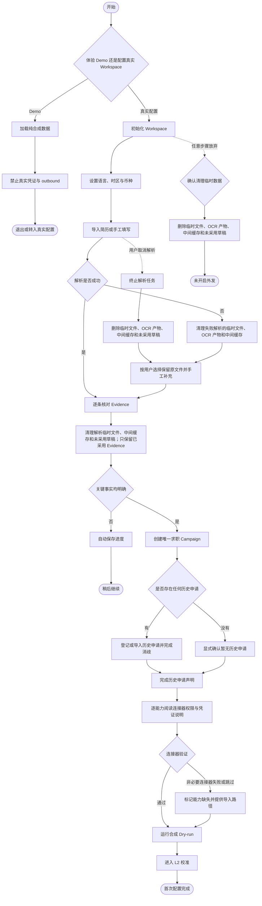

关键 Guard：首次配置完成仍保持 `Dry-run/L2`，不得隐式开启 L3。

## RF-UML-ACT-IMPORT-01 已有申请接管与跨来源去重

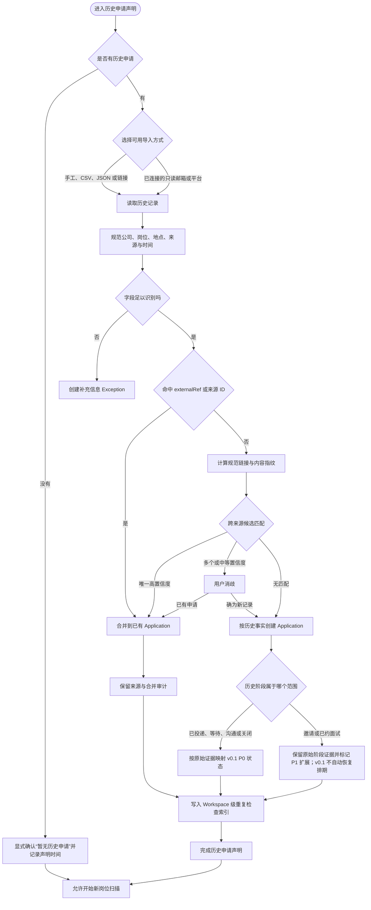

任何“不确定”都不能被当作“未投递”。疑似重复的默认结果是阻止新投递并请求消歧。Workspace 级唯一性字段和指纹版本由 `<<proposed DEC-09>>` 确认；跨 Campaign 去重边界由 `<<proposed DEC-15>>` 确认。

## RF-UML-ACT-CAL-01 Dry-run、L2 校准与按能力开启 L3

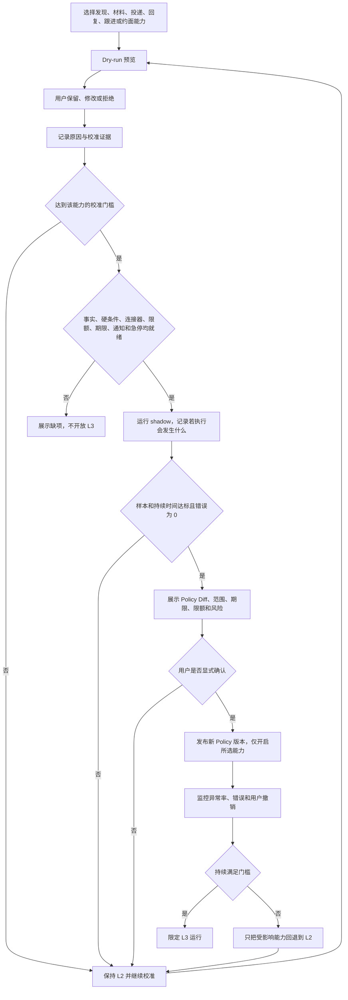

一次修改或批准不能自动升级为长期授权。L3 的实际门槛值由 `<<proposed DEC-02>>` 确认。

## RF-UML-ACT-JOB-01 岗位发现、判断与进入候选队列

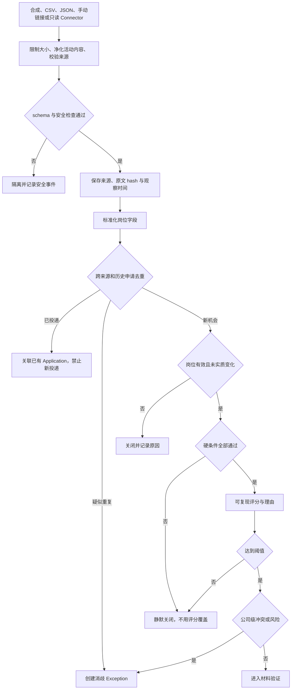

## RF-UML-ACT-MAT-01 Evidence 到可执行材料

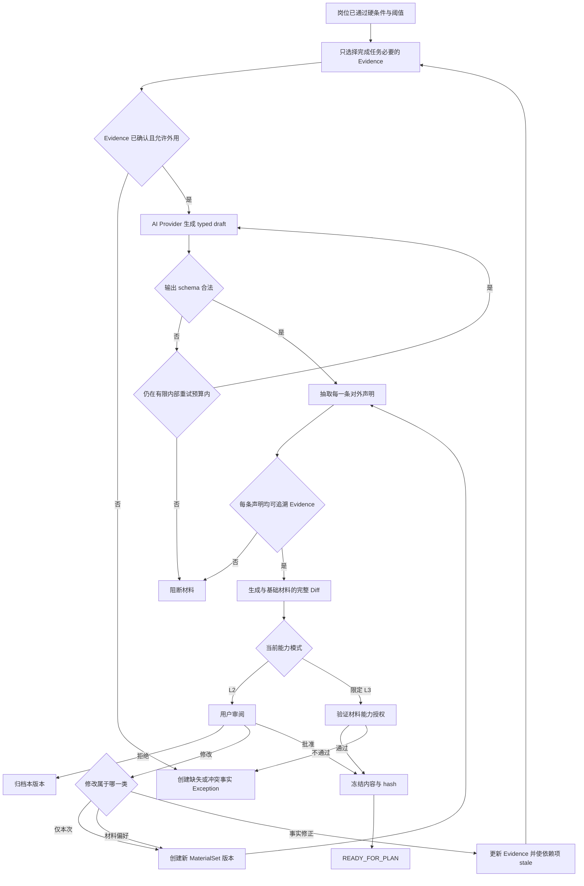

## RF-UML-ACT-AUTH-01 通用 ActionPlan、授权、执行与对账

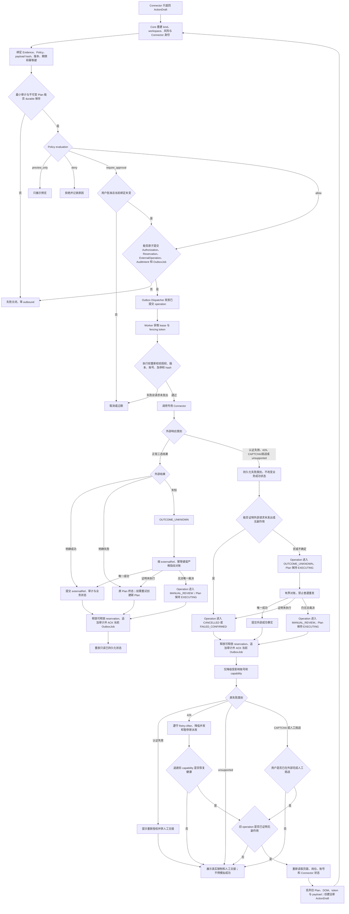

认证失效、限流、CAPTCHA/挑战和 unsupported 必须先把 ExternalOperation 收敛为“可证明未发”“明确失败”或“可能已发且对账中/待人工裁决”，再释放可释放 reservation、写审计并 ACK 当前派发，最后才局部降级或人工交接。任何 `OUTCOME_UNKNOWN` / `MANUAL_REVIEW` 子操作存在时，父 ActionPlan 保持 `EXECUTING`。人工交接不改变业务成功状态；只有用户登记或只读 Connector 获得外部证据后，才能由对应业务流程提交成功事实。挑战后只有旧 operation 已证明无副作用，才允许重读页面和岗位并创建全新 Plan；旧 Plan、DOM、token 与 payload 永不复用。

## RF-UML-ACT-MSG-01 入站消息与安全回答

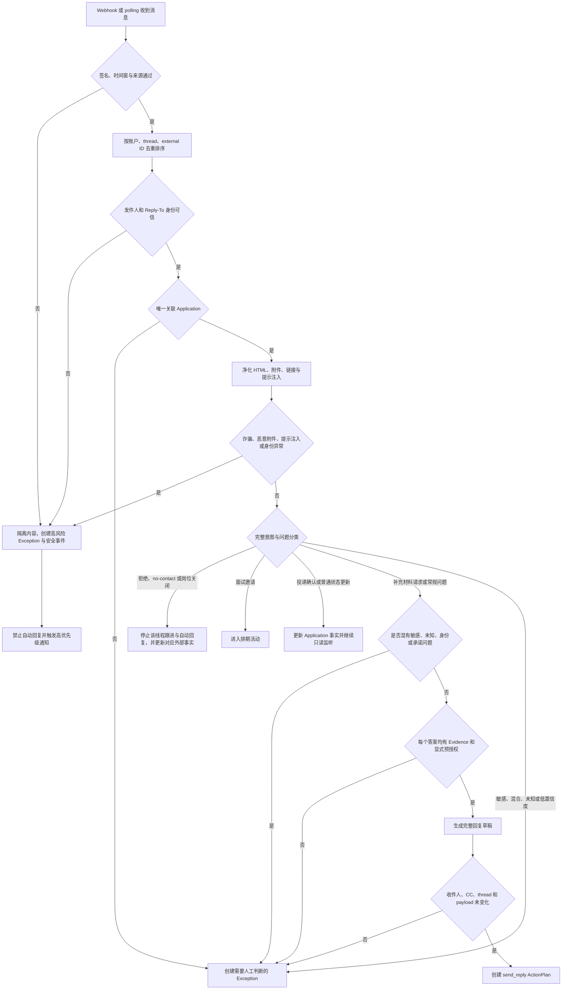

“隔离”只处理不可信内容载荷，不代表风险已经解决；诈骗、身份伪造、恶意附件或提示注入必须形成可见的 Exception。空 AnswerPreauthorization 等同于全部问题禁止自动回答。

## RF-UML-ACT-FUP-01 默认关闭且最多一次的跟进

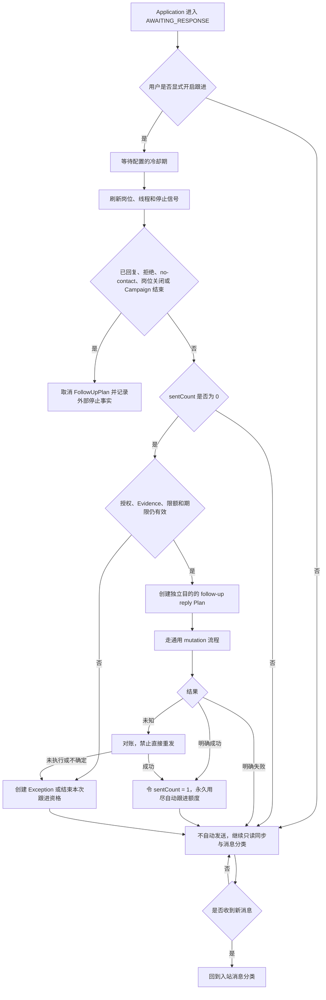

跟进默认关闭、执行失败、过期或一次额度用尽都只结束 FollowUpPlan，不关闭 Application 或 CommunicationThread。只有拒绝、no-contact、岗位关闭、撤回等独立外部事实，才能按 Application 规则改变其状态。

## RF-UML-ACT-INT-01 面试排期 Saga

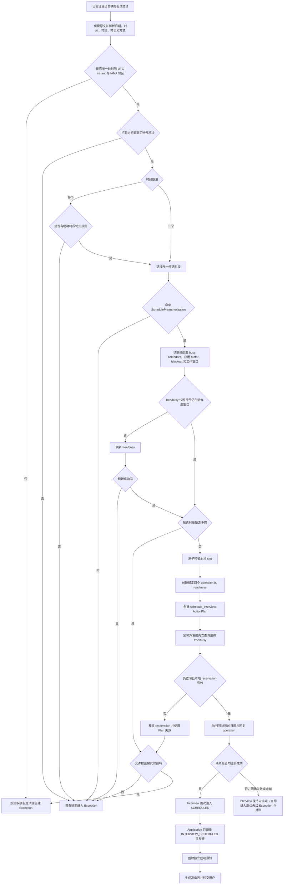

多个 busy calendars 与单一写入日历的组合由 `<<proposed DEC-14>>` 确认；日历与回复的 Saga 顺序由 `<<proposed DEC-08>>` 确认；日历事件是否邀请招聘方由 `<<proposed DEC-20>>` 确认。未确认前真实 L3 自动约面保持关闭。

## RF-UML-ACT-EXC-01 Exception 处理与精确恢复

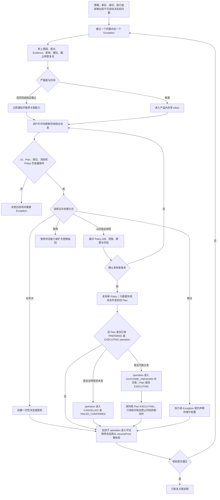

## RF-UML-ACT-PAUSE-01 三级人工控制与恢复

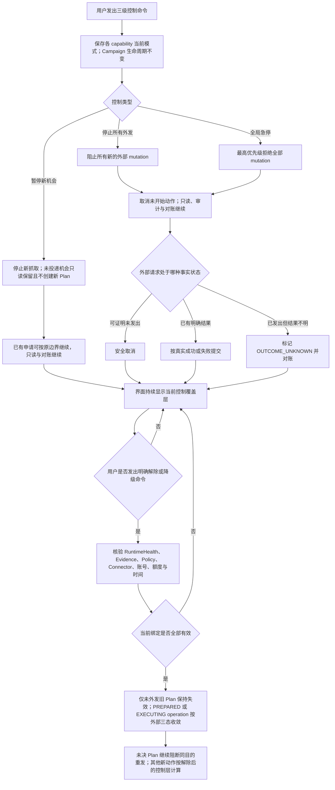

该活动只处理人工三级控制；普通离线恢复见 `RF-UML-ACT-OFF-01`。`STOP_OUTBOUND` / `KILL_SWITCH` 解除后是否一律先回 L2、再逐能力重开 L3，尚待 `<<proposed DEC-19>>` 确认；未确认前采用失败关闭。

## RF-UML-ACT-OFF-01 Worker、Runner 离线与普通恢复

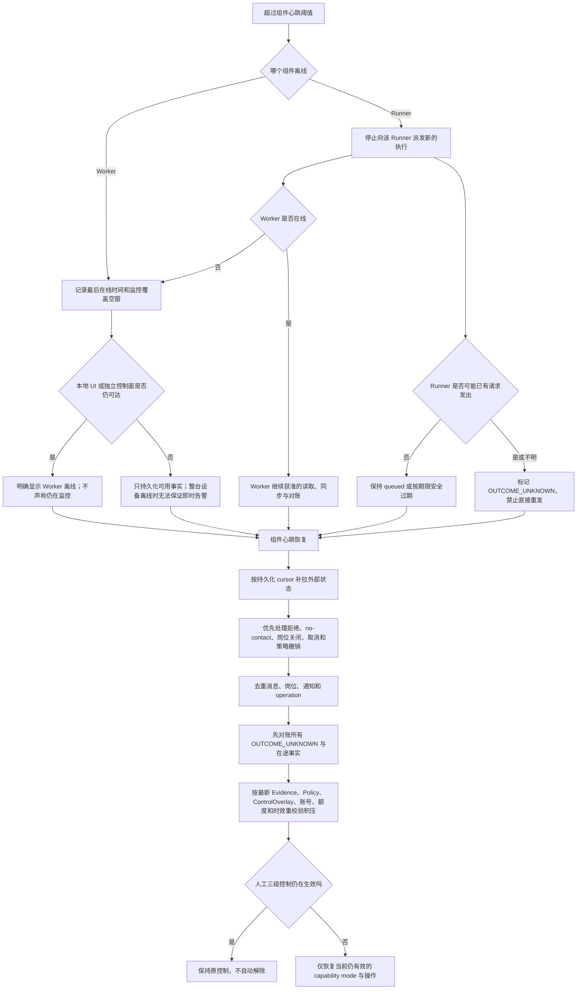

普通短时离线恢复不强制把能力模式改成 L2，也不解除人工暂停。积压重校验只直接取消或失效未外发的 `DRAFT`、`AWAITING_APPROVAL`、`AUTHORIZED` Plan；已有 `PREPARED` / `EXECUTING` operation 时，证明未发才取消，可能已发则进入 `OUTCOME_UNKNOWN → RECONCILING`，父 Plan 保持 `EXECUTING` 并阻止同目的重发。备份恢复属于 `RF-UML-ACT-REL-01`：凭证与 L3 授权必须保持关闭，不能套用本活动的普通恢复路径。心跳阈值由 `<<proposed DEC-11>>` 确认。

## RF-UML-ACT-DATA-01 数据生命周期操作路由

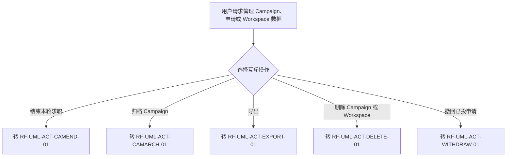

路由本身不改变任何业务状态。结束、归档、导出、删除和撤回是五个独立命令；删除本地数据不会被解释为撤回外部申请，结束 Campaign 也不会自动归档。

## RF-UML-ACT-CAMEND-01 结束 Campaign 与已有申请监听

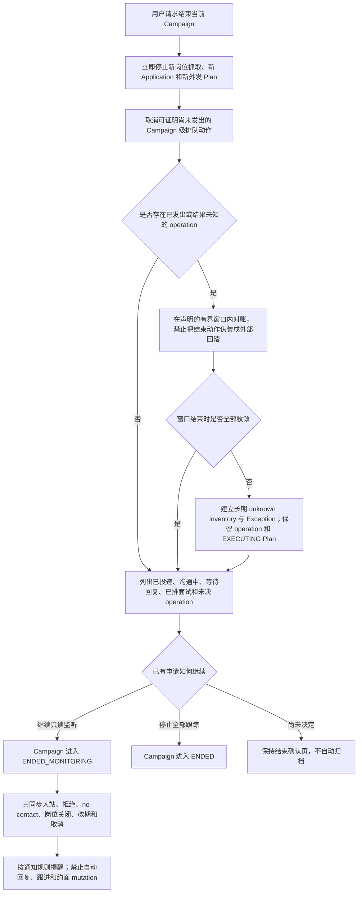

结束 Campaign 不撤回任何已投申请，也不删除申请、沟通、面试、operation 或审计事实。有界对账超时不会无限阻塞 `ENDED` / `ENDED_MONITORING`；未决 operation 以长期 inventory 和 Exception 保留，继续对账但禁止普通重发。只有用户后续明确选择归档，才进入 `RF-UML-ACT-CAMARCH-01`。

## RF-UML-ACT-CAMARCH-01 归档 Campaign 与开启新周期

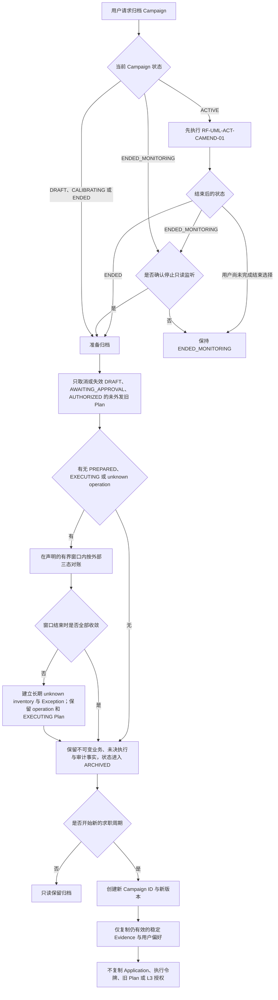

归档不是删除，也不是恢复入口；有界对账超时不无限阻塞归档，未决 operation 和父 Plan 继续保留并对账。对归档 Campaign 的“继续求职”必须创建新 Campaign，不能复活旧执行状态。

## RF-UML-ACT-EXPORT-01 导出一致性快照

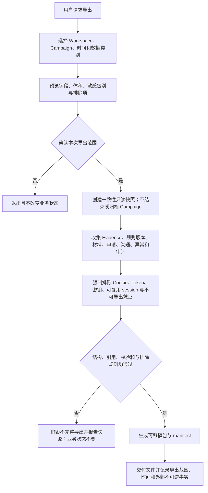

导出是只读操作，不隐式关闭全局 mutation gate；实现必须用一致性快照或等价读隔离获得稳定视图。导出文件的本地保存位置和加密由用户显式选择。

## RF-UML-ACT-DELETE-01 删除 Campaign 或 Workspace

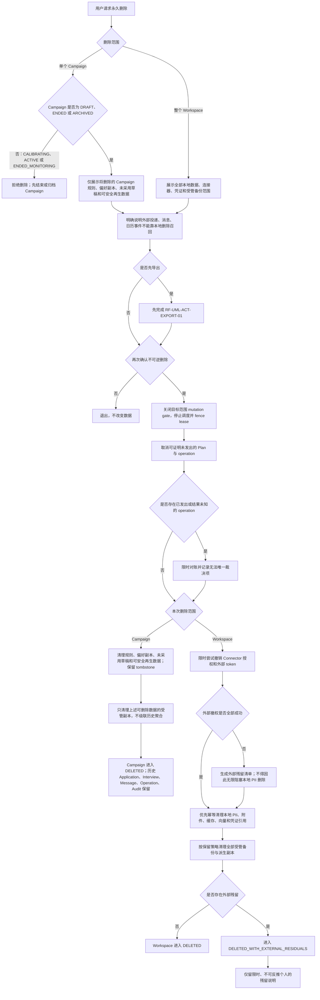

Campaign 删除不是聚合级联删除：历史 Application、Interview、Message、ExternalOperation 和 Audit 保留，或只在后续 Workspace 删除时按 Workspace 策略删除/脱敏。本地清理或存储失败时保持 `DELETING` 并创建高优先级 Exception，不能谎报删除完成。最小摘要和受管备份的保留类别、期限与删除证明由 `<<proposed DEC-05>>` 确认。

## RF-UML-ACT-WITHDRAW-01 撤回已投 Application

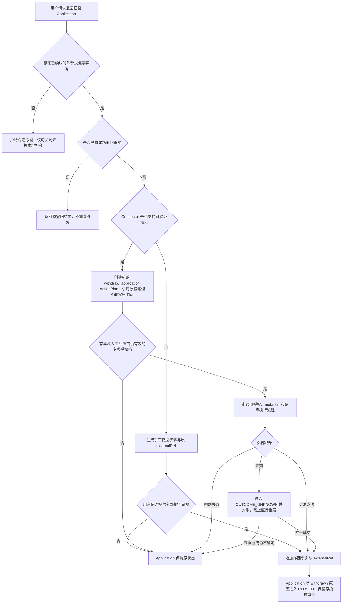

撤回是新的对外动作，不是删除或补偿原投递。即使撤回成功，已经发送给平台或招聘方的内容也可能无法召回。

## RF-UML-ACT-INTCHANGE-01 面试改期与取消

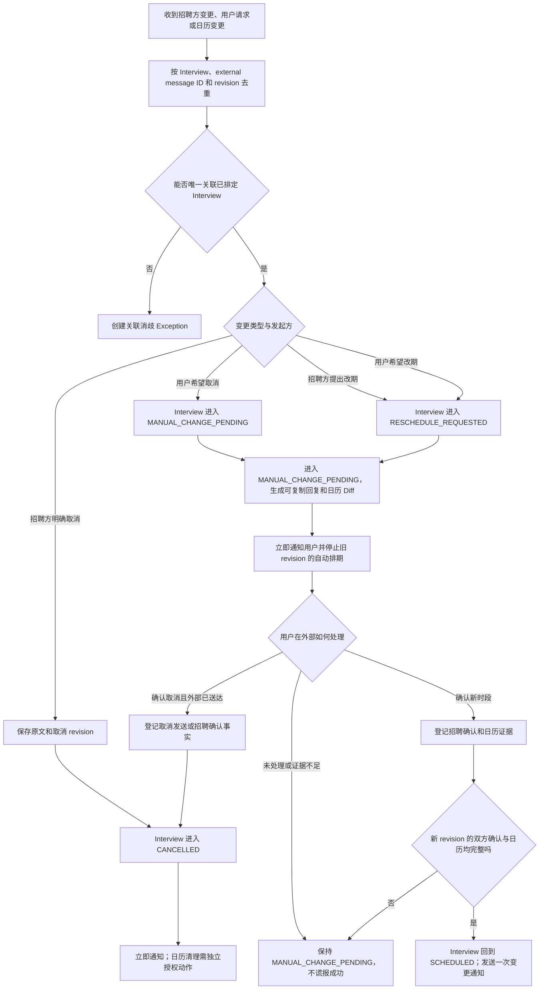

v0.1 默认由用户处理改期和取消；工具负责去重、保留事实、生成辅助内容、持续监控并通知。任何外部回复或日历 mutation 都必须作为新 Plan 经过授权，不能沿用首次约面的旧 Plan。

## RF-UML-ACT-REL-01 安装、升级、恢复与能力开放门

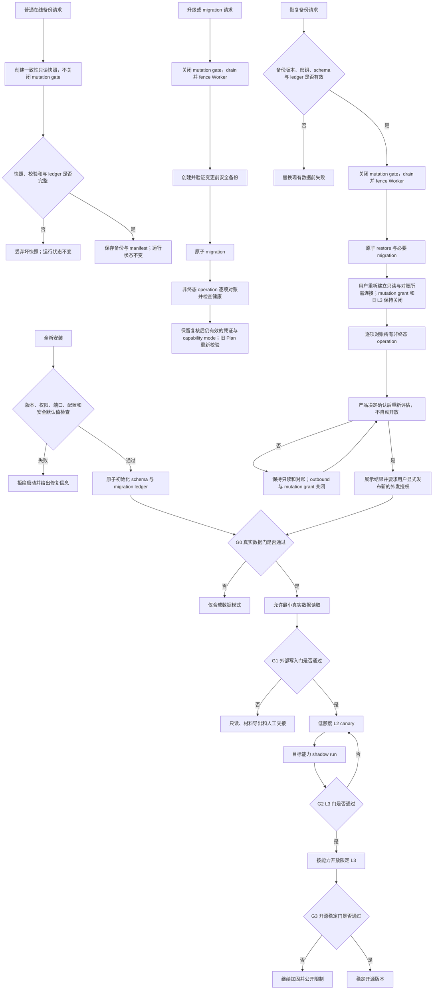

普通在线备份不暂停 Worker；升级/migration 与 restore 才需要 drain/fence。只有 restore 强制不恢复旧凭证、执行令牌和 L3 授权：用户先重建只读/对账连接并完成对账；`<<proposed DEC-19>>` 未 Accepted 时停在只读且外发关闭，Accepted 后仍须由用户发布全新的外发授权并重新通过 G0/G1/G2。普通短时离线与升级不能套用这一降级规则。交付计划 Gate A/B/C 是项目里程碑门；G0/G1/G2/G3 是能力开放门，二者不得混用。

## RF-UML-ACT-A11Y-01 关键交互的无障碍与地区语义门

```mermaid
flowchart TB
    %% @anchor A11Y_LOCALE_GATE
    %% @anchor KEYBOARD
    %% @anchor READER
    %% @anchor VISUAL
    %% @anchor ZOOM
    %% @anchor LOCALE
    %% @anchor UNICODE
    Flow[任一用户关键流程] --> Keyboard{仅键盘能完成并看见焦点吗}
    Keyboard -->|否| Block[阻断对应发布门]
    Keyboard -->|是| Reader{读屏能获得名称、状态、错误和结果吗}
    Reader -->|否| Block
    Reader -->|是| Visual{状态是否不只依赖颜色}
    Visual -->|否| Block
    Visual -->|是| Zoom{200% 放大和窄屏是否保留决策信息与急停}
    Zoom -->|否| Block
    Zoom -->|是| Locale{时间、币种、地区和语言是否使用规范内部值}
    Locale -->|否| Block
    Locale -->|是| Unicode{Unicode、长文本和生成语言是否不破坏事实或控件}
    Unicode -->|否| Block
    Unicode -->|是| Pass[该流程通过设计与实现验收]
```

该活动门必须叠加到 Onboarding、Policy Diff、Exception、Interview、通知、导出删除和急停流程；UML 只能证明路径存在，不能替代键盘、读屏和缩放实测。
