# RoleFox v0.1 交互时序

- 状态：Review Draft
- 上级索引：[UML 设计基线](README.md)
- 原则：每种外部 mutation 都必须经过相同的计划、授权、durable intent、执行前复核、结果确认、审计和对账协议。

## RF-UML-SEQ-ONB-01 初始化、连接和撤销

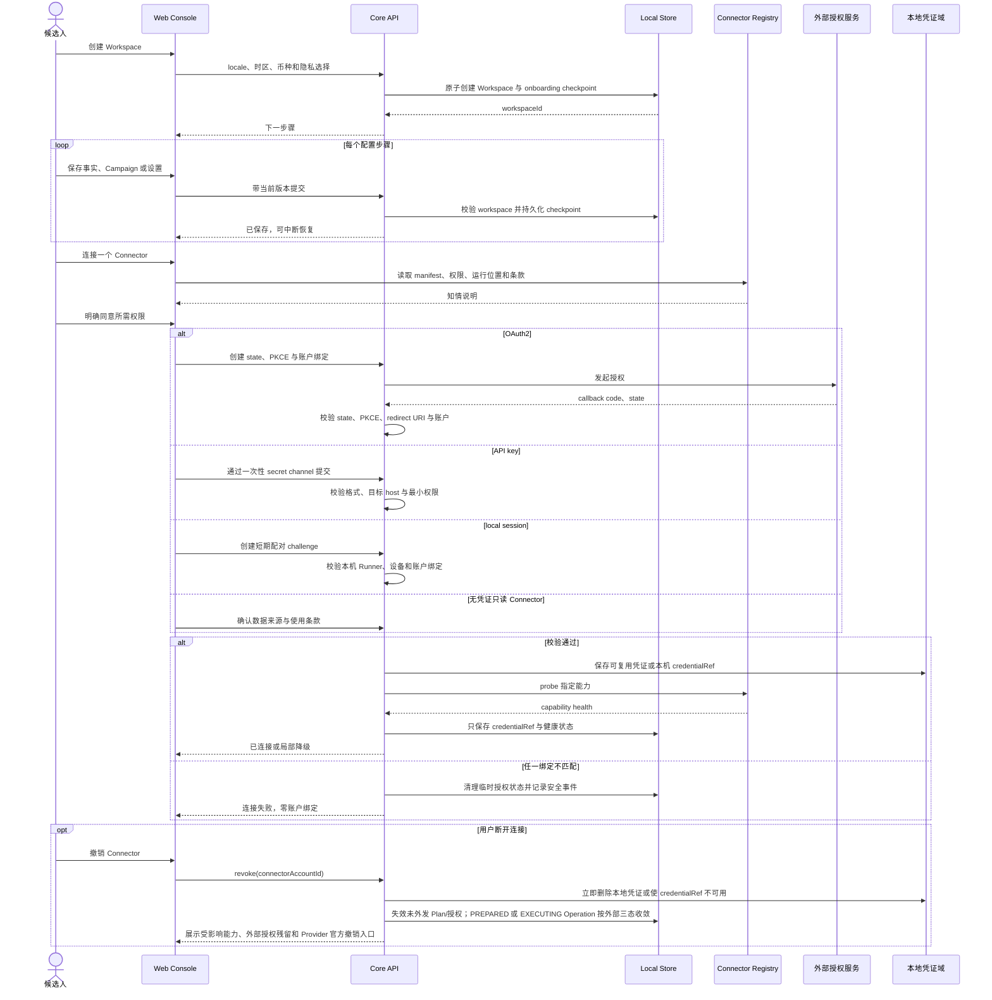
```mermaid
sequenceDiagram
    actor User as 候选人
    participant Web as Web Console
    participant Core as Core API
    participant DB as Local Store
    participant Registry as Connector Registry
    participant OAuth as 外部授权服务
    participant Vault as 本地凭证域

    User->>Web: 创建 Workspace
    Web->>Core: locale、时区、币种和隐私选择
    Core->>DB: 原子创建 Workspace 与 onboarding checkpoint
    DB-->>Core: workspaceId
    Core-->>Web: 下一步骤
    loop 每个配置步骤
        User->>Web: 保存事实、Campaign 或设置
        Web->>Core: 带当前版本提交
        Core->>DB: 校验 workspace 并持久化 checkpoint
        Core-->>Web: 已保存，可中断恢复
    end
    %% @anchor CONNECTOR_CONSENT
    User->>Web: 连接一个 Connector
    Web->>Registry: 读取 manifest、权限、运行位置和条款
    Registry-->>Web: 知情说明
    User->>Web: 明确同意所需权限
    alt OAuth2
        Web->>Core: 创建 state、PKCE 与账户绑定
        Core->>OAuth: 发起授权
        OAuth-->>Core: callback code、state
        Core->>Core: 校验 state、PKCE、redirect URI 与账户
    else API key
        Web->>Core: 通过一次性 secret channel 提交
        Core->>Core: 校验格式、目标 host 与最小权限
    else local session
        Web->>Core: 创建短期配对 challenge
        Core->>Core: 校验本机 Runner、设备和账户绑定
    else 无凭证只读 Connector
        Web->>Core: 确认数据来源与使用条款
    end
    alt 校验通过
        Core->>Vault: 保存可复用凭证或本机 credentialRef
        Core->>Registry: probe 指定能力
        Registry-->>Core: capability health
        Core->>DB: 只保存 credentialRef 与健康状态
        Core-->>Web: 已连接或局部降级
    else 任一绑定不匹配
        Core->>DB: 清理临时授权状态并记录安全事件
        Core-->>Web: 连接失败，零账户绑定
    end
    opt 用户断开连接
        User->>Web: 撤销 Connector
        Web->>Core: revoke(connectorAccountId)
        Core->>Vault: 立即删除本地凭证或使 credentialRef 不可用
        Core->>DB: 失效未外发 Plan/授权；PREPARED 或 EXECUTING Operation 按外部三态收敛
        Core-->>Web: 展示受影响能力、外部授权残留和 Provider 官方撤销入口
    end
```

## RF-UML-SEQ-IMPORT-01 历史申请接管、消歧与去重索引

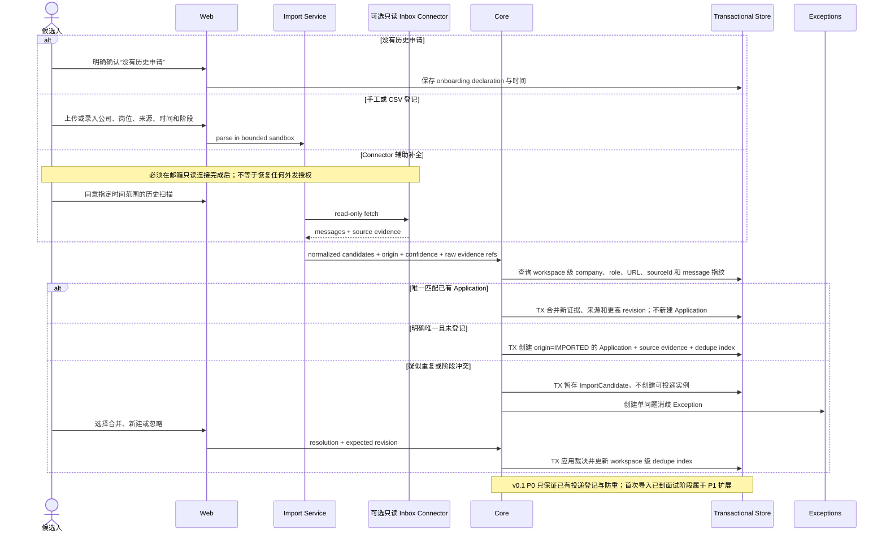
```mermaid
sequenceDiagram
    actor User as 候选人
    participant Web
    participant Import as Import Service
    participant Inbox as 可选只读 Inbox Connector
    participant Core
    participant DB as Transactional Store
    participant Exceptions

    %% @anchor IMPORT_SOURCE_SELECTED
    alt 没有历史申请
        User->>Web: 明确确认“没有历史申请”
        Web->>DB: 保存 onboarding declaration 与时间
    else 手工或 CSV 登记
        User->>Web: 上传或录入公司、岗位、来源、时间和阶段
        Web->>Import: parse in bounded sandbox
    else Connector 辅助补全
        Note over User,Inbox: 必须在邮箱只读连接完成后；不等于恢复任何外发授权
        User->>Web: 同意指定时间范围的历史扫描
        Import->>Inbox: read-only fetch
        Inbox-->>Import: messages + source evidence
    end
    Import->>Core: normalized candidates + origin + confidence + raw evidence refs
    %% @anchor IMPORT_DEDUP_RECONCILE
    Core->>DB: 查询 workspace 级 company、role、URL、sourceId 和 message 指纹
    %% @anchor IMPORT_MATCH_DECISION
    alt 唯一匹配已有 Application
        Core->>DB: TX 合并新证据、来源和更高 revision；不新建 Application
    else 明确唯一且未登记
        Core->>DB: TX 创建 origin=IMPORTED 的 Application + source evidence + dedupe index
    else 疑似重复或阶段冲突
        Core->>DB: TX 暂存 ImportCandidate，不创建可投递实例
        Core->>Exceptions: 创建单问题消歧 Exception
        User->>Web: 选择合并、新建或忽略
        Web->>Core: resolution + expected revision
        Core->>DB: TX 应用裁决并更新 workspace 级 dedupe index
    end
    Note over Core,DB: v0.1 P0 只保证已有投递登记与防重；首次导入已到面试阶段属于 P1 扩展
```

## RF-UML-SEQ-DISC-01 岗位发现到材料草稿

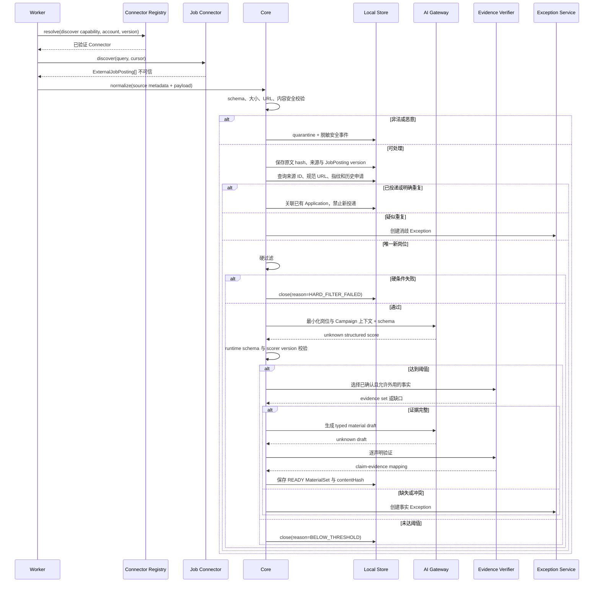
```mermaid
sequenceDiagram
    participant Worker
    participant Registry as Connector Registry
    participant Source as Job Connector
    participant Core
    participant DB as Local Store
    participant AI as AI Gateway
    participant Evidence as Evidence Verifier
    participant Exceptions as Exception Service

    Worker->>Registry: resolve(discover capability, account, version)
    Registry-->>Worker: 已验证 Connector
    %% @anchor EXTERNAL_JOB_POSTING
    Worker->>Source: discover(query, cursor)
    Source-->>Worker: ExternalJobPosting[] 不可信
    Worker->>Core: normalize(source metadata + payload)
    Core->>Core: schema、大小、URL、内容安全校验
    alt 非法或恶意
        Core->>DB: quarantine + 脱敏安全事件
    else 可处理
        Core->>DB: 保存原文 hash、来源与 JobPosting version
        Core->>DB: 查询来源 ID、规范 URL、指纹和历史申请
        alt 已投递或明确重复
            Core->>DB: 关联已有 Application，禁止新投递
        else 疑似重复
            Core->>Exceptions: 创建消歧 Exception
        else 唯一新岗位
            Core->>Core: 硬过滤
            alt 硬条件失败
                Core->>DB: close(reason=HARD_FILTER_FAILED)
            else 通过
                Core->>AI: 最小化岗位与 Campaign 上下文 + schema
                AI-->>Core: unknown structured score
                Core->>Core: runtime schema 与 scorer version 校验
                alt 达到阈值
                    Core->>Evidence: 选择已确认且允许外用的事实
                    Evidence-->>Core: evidence set 或缺口
                    alt 证据完整
                        Core->>AI: 生成 typed material draft
                        AI-->>Core: unknown draft
                        Core->>Evidence: 逐声明验证
                        Evidence-->>Core: claim-evidence mapping
                        Core->>DB: 保存 READY MaterialSet 与 contentHash
                    else 缺失或冲突
                        Core->>Exceptions: 创建事实 Exception
                    end
                else 未达阈值
                    Core->>DB: close(reason=BELOW_THRESHOLD)
                end
            end
        end
    end
```

## RF-UML-SEQ-APPLY-01 L2 或 L3 投递完整路径

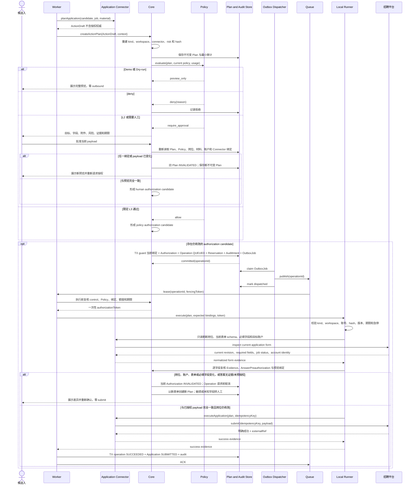
```mermaid
sequenceDiagram
    actor User as 候选人
    participant Worker
    participant AppConn as Application Connector
    participant Core
    participant Policy
    participant DB as Plan and Audit Store
    participant Outbox as Outbox Dispatcher
    participant Queue
    participant Runner as Local Runner
    participant Platform as 招聘平台

    Worker->>AppConn: planApplication(candidate, job, material)
    AppConn-->>Worker: ActionDraft 不含授权权威
    Worker->>Core: createActionPlan(ActionDraft, context)
    Core->>Core: 重建 kind、workspace、connector、risk 和 hash
    %% @anchor PLAN_CREATED
    Core->>DB: 保存不可变 Plan 与最小审计
    Core->>Policy: evaluate(plan, current policy, usage)
    alt Demo 或 Dry-run
        Policy-->>Core: preview_only
        Core-->>User: 展示完整预览，零 outbound
    else deny
        Policy-->>Core: deny(reason)
        Core->>DB: 记录拒绝
    else L2 或需要人工
        Policy-->>Core: require_approval
        Core-->>User: 目标、字段、附件、风险、证据和期限
        User->>Core: 批准当前 payload
        Core->>DB: 重新读取 Plan、Policy、岗位、材料、账户和 Connector 绑定
        alt 任一绑定或 payload 已变化
            Core->>DB: 旧 Plan INVALIDATED；保存新不可变 Plan
            Core-->>User: 展示新预览并重新请求授权
        else 与预览完全一致
            Core->>Core: 形成 human authorization candidate
        end
    else 限定 L3 通过
        Policy-->>Core: allow
        Core->>Core: 形成 policy authorization candidate
    end
    opt 存在仍有效的 authorization candidate
        %% @anchor AUTH_OPERATION_OUTBOX_COMMITTED
        Core->>DB: TX guard 当前绑定 + Authorization + Operation QUEUED + Reservation + AuditIntent + OutboxJob
        DB-->>Core: committed(operationId)
        Outbox->>DB: claim OutboxJob
        Outbox->>Queue: publish(operationId)
        Outbox->>DB: mark dispatched
        Queue->>Worker: lease(operationId, fencingToken)
        %% @anchor EXECUTION_RECHECK
        Worker->>Core: 执行前复核 control、Policy、绑定、额度和期限
        Core-->>Worker: 一次性 authorizationToken
        Worker->>Runner: execute(plan, expected bindings, token)
        Runner->>Runner: 校验 kind、workspace、账号、hash、版本、期限和急停
        %% @anchor REQUIRED_FIELD_RECHECK
        Runner->>AppConn: 只读刷新岗位、当前表单 schema、必填字段和目标账户
        AppConn->>Platform: inspect current application form
        Platform-->>AppConn: current revision、required fields、job status、account identity
        AppConn-->>Runner: normalized form evidence
        Runner->>Core: 逐字段复核 Evidence、AnswerPreauthorization 与预览绑定
        alt 岗位、账户、表单或必填字段变化，或答案无证据/未预授权
            Core->>DB: 当前 Authorization INVALIDATED；Operation 请求前取消
            Core->>DB: 以新表单创建新 Plan；敏感或未知字段转人工
            Core-->>User: 展示差异并重新确认，零 submit
        else 与已授权 payload 完全一致且岗位仍有效
            Runner->>AppConn: executeApplication(plan, idempotencyKey)
            AppConn->>Platform: submit(idempotencyKey, payload)
            Platform-->>AppConn: 明确成功 + externalRef
            AppConn-->>Runner: success evidence
            Runner-->>Worker: success evidence
            Worker->>DB: TX operation SUCCEEDED + Application SUBMITTED + audit
            Worker->>Queue: ACK
        end
    end
```

## RF-UML-SEQ-OPR-01 通用 mutation 的 durable 边界

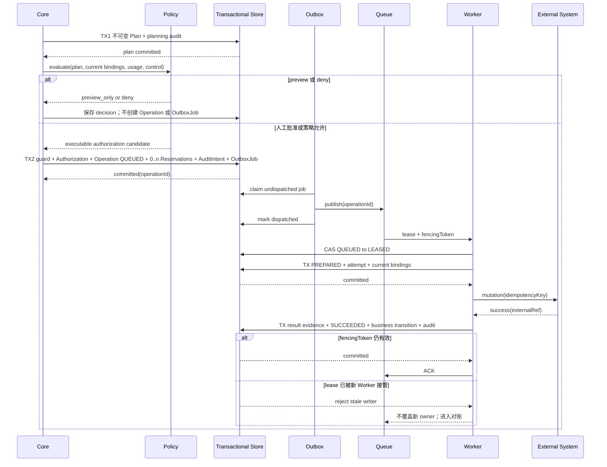
```mermaid
sequenceDiagram
    participant Core
    participant Policy
    participant DB as Transactional Store
    participant Outbox
    participant Queue
    participant Worker
    participant Remote as External System

    %% @anchor PLAN_CREATED
    Core->>DB: TX1 不可变 Plan + planning audit
    DB-->>Core: plan committed
    Core->>Policy: evaluate(plan, current bindings, usage, control)
    alt preview 或 deny
        Policy-->>Core: preview_only or deny
        Core->>DB: 保存 decision；不创建 Operation 或 OutboxJob
    else 人工批准或策略允许
        Policy-->>Core: executable authorization candidate
        %% @anchor AUTH_OPERATION_OUTBOX_COMMITTED
        Core->>DB: TX2 guard + Authorization + Operation QUEUED + 0..n Reservations + AuditIntent + OutboxJob
        DB-->>Core: committed(operationId)
        Outbox->>DB: claim undispatched job
        Outbox->>Queue: publish(operationId)
        Outbox->>DB: mark dispatched
        Queue->>Worker: lease + fencingToken
        Worker->>DB: CAS QUEUED to LEASED
        Worker->>DB: TX PREPARED + attempt + current bindings
        DB-->>Worker: committed
        Worker->>Remote: mutation(idempotencyKey)
        Remote-->>Worker: success(externalRef)
        Worker->>DB: TX result evidence + SUCCEEDED + business transition + audit
        alt fencingToken 仍有效
            DB-->>Worker: committed
            Worker->>Queue: ACK
        else lease 已被新 Worker 接管
            DB-->>Worker: reject stale writer
            Worker-->>Queue: 不覆盖新 owner；进入对账
        end
    end
```

只有 `PREPARED` durable commit 后才能发出外部请求；只有结果和业务状态 durable commit 后才能 ACK。Queue 与数据库不共享事务，因此 OutboxJob 必须与 Operation 同事务创建，并可由扫描器重建投递。

## RF-UML-SEQ-AUTH-TIME-01 陈旧 UI 与不可信本机时间不能授权

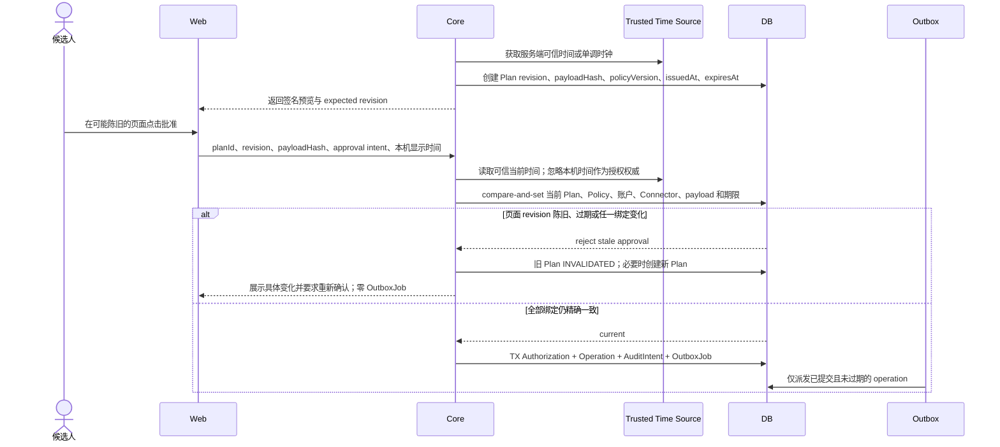
```mermaid
sequenceDiagram
    actor User as 候选人
    participant Web
    participant Core
    participant Clock as Trusted Time Source
    participant DB
    participant Outbox

    Core->>Clock: 获取服务端可信时间或单调时钟
    Core->>DB: 创建 Plan revision、payloadHash、policyVersion、issuedAt、expiresAt
    Core-->>Web: 返回签名预览与 expected revision
    User->>Web: 在可能陈旧的页面点击批准
    Web->>Core: planId、revision、payloadHash、approval intent、本机显示时间
    %% @anchor STALE_UI_TRUSTED_TIME
    Core->>Clock: 读取可信当前时间；忽略本机时间作为授权权威
    Core->>DB: compare-and-set 当前 Plan、Policy、账户、Connector、payload 和期限
    alt 页面 revision 陈旧、过期或任一绑定变化
        DB-->>Core: reject stale approval
        Core->>DB: 旧 Plan INVALIDATED；必要时创建新 Plan
        Core-->>Web: 展示具体变化并要求重新确认；零 OutboxJob
    else 全部绑定仍精确一致
        DB-->>Core: current
        Core->>DB: TX Authorization + Operation + AuditIntent + OutboxJob
        Outbox->>DB: 仅派发已提交且未过期的 operation
    end
```

## RF-UML-SEQ-OPR-02 F0–F6 崩溃切点与对账

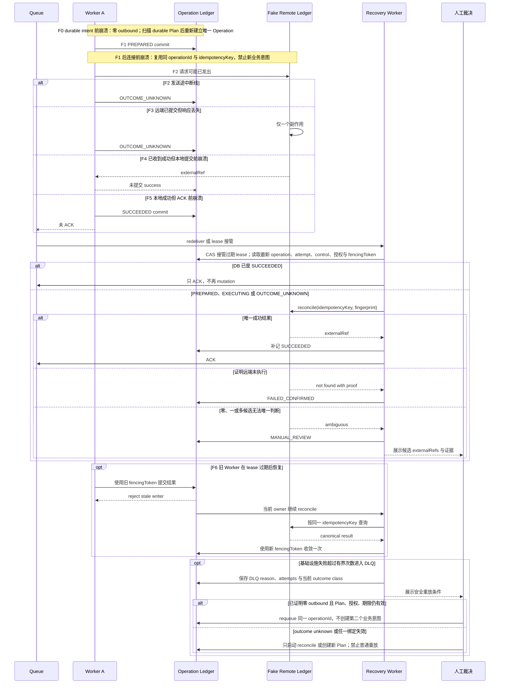
```mermaid
sequenceDiagram
    participant Queue
    participant WorkerA as Worker A
    participant DB as Operation Ledger
    participant Remote as Fake Remote Ledger
    participant WorkerB as Recovery Worker
    participant Human as 人工裁决

    %% @anchor F0_UNCLAIMED_RECOVERY
    Note over WorkerA,DB: F0 durable intent 前崩溃：零 outbound；扫描 durable Plan 后重新建立唯一 Operation
    WorkerA->>DB: F1 PREPARED commit
    %% @anchor F1_REUSE_OPERATION
    Note over WorkerA,Remote: F1 后连接前崩溃：复用同 operationId 与 idempotencyKey，禁止新业务意图
    WorkerA->>Remote: F2 请求可能已发出
    alt F2 发送途中断线
        WorkerA->>DB: OUTCOME_UNKNOWN
    else F3 远端已提交但响应丢失
        Remote->>Remote: 仅一个副作用
        WorkerA->>DB: OUTCOME_UNKNOWN
    else F4 已收到成功但本地提交前崩溃
        Remote-->>WorkerA: externalRef
        WorkerA--xDB: 未提交 success
    else F5 本地成功但 ACK 前崩溃
        WorkerA->>DB: SUCCEEDED commit
        WorkerA--xQueue: 未 ACK
    end
    Queue->>WorkerB: redeliver 或 lease 接管
    %% @anchor LEASE_RECLAIM_REVALIDATE
    WorkerB->>DB: CAS 接管过期 lease；读取最新 operation、attempt、control、授权与 fencingToken
    alt DB 已是 SUCCEEDED
        %% @anchor F5_TERMINAL_REDELIVERY_ACK
        WorkerB->>Queue: 只 ACK，不再 mutation
    else PREPARED、EXECUTING 或 OUTCOME_UNKNOWN
        %% @anchor OUTCOME_UNKNOWN_RECONCILE
        WorkerB->>Remote: reconcile(idempotencyKey, fingerprint)
        alt 唯一成功结果
            Remote-->>WorkerB: externalRef
            WorkerB->>DB: 补记 SUCCEEDED
            WorkerB->>Queue: ACK
        else 证明远端未执行
            Remote-->>WorkerB: not found with proof
            WorkerB->>DB: FAILED_CONFIRMED
        else 零、一或多候选无法唯一判断
            Remote-->>WorkerB: ambiguous
            WorkerB->>DB: MANUAL_REVIEW
            WorkerB-->>Human: 展示候选 externalRefs 与证据
        end
    end
    %% @anchor STALE_FENCING_REJECTED
    opt F6 旧 Worker 在 lease 过期后恢复
        WorkerA->>DB: 使用旧 fencingToken 提交结果
        DB-->>WorkerA: reject stale writer
        DB->>WorkerB: 当前 owner 继续 reconcile
        WorkerB->>Remote: 按同一 idempotencyKey 查询
        Remote-->>WorkerB: canonical result
        WorkerB->>DB: 使用新 fencingToken 收敛一次
    end
    opt 基础设施失败超过有界次数进入 DLQ
        WorkerB->>DB: 保存 DLQ reason、attempts 与当前 outcome class
        WorkerB-->>Human: 展示安全重放条件
        alt 已证明零 outbound 且 Plan、授权、期限仍有效
            Human->>DB: requeue 同一 operationId，不创建第二个业务意图
        else outcome unknown 或任一绑定失效
            Human->>DB: 只启动 reconcile 或创建新 Plan；禁止普通重放
        end
    end
```

## RF-UML-SEQ-CONC-01 重复任务、双 Worker、额度与时段竞争

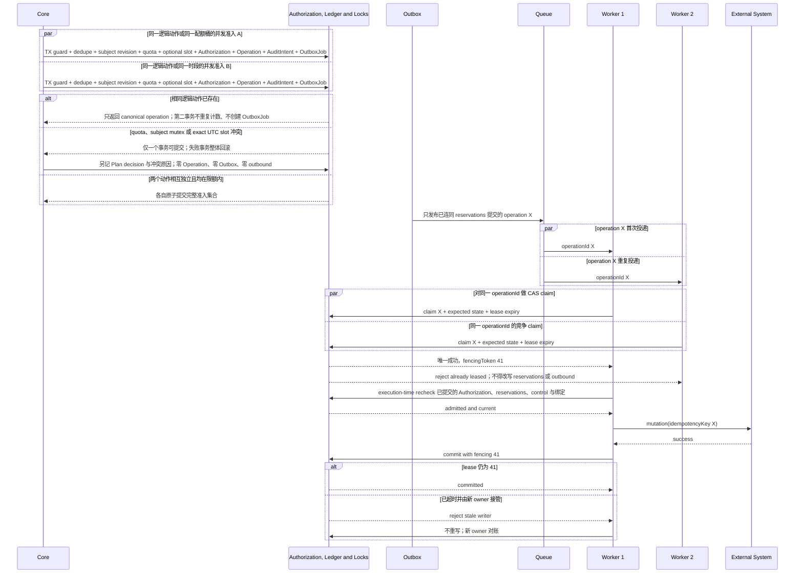
```mermaid
sequenceDiagram
    participant Core
    participant DB as Authorization, Ledger and Locks
    participant Outbox
    participant Queue
    participant W1 as Worker 1
    participant W2 as Worker 2
    participant Remote as External System

    %% @anchor DUPLICATE_AND_QUOTA_ATOMICITY
    %% @anchor ATOMIC_QUOTA_RESERVATION
    %% @anchor ATOMIC_SLOT_RESERVATION
    par 同一逻辑动作或同一配额桶的并发准入 A
        Core->>DB: TX guard + dedupe + subject revision + quota + optional slot + Authorization + Operation + AuditIntent + OutboxJob
    and 同一逻辑动作或同一时段的并发准入 B
        Core->>DB: TX guard + dedupe + subject revision + quota + optional slot + Authorization + Operation + AuditIntent + OutboxJob
    end
    alt 相同逻辑动作已存在
        DB-->>Core: 只返回 canonical operation；第二事务不重复计数、不创建 OutboxJob
    else quota、subject mutex 或 exact UTC slot 冲突
        DB-->>Core: 仅一个事务可提交；失败事务整体回滚
        Core->>DB: 另记 Plan decision 与冲突原因；零 Operation、零 Outbox、零 outbound
    else 两个动作相互独立且均在限额内
        DB-->>Core: 各自原子提交完整准入集合
    end
    Outbox->>Queue: 只发布已连同 reservations 提交的 operation X

    par operation X 首次投递
        Queue->>W1: operationId X
    and operation X 重复投递
        Queue->>W2: operationId X
    end
    %% @anchor DUPLICATE_LEASE_COLLAPSE
    par 对同一 operationId 做 CAS claim
        W1->>DB: claim X + expected state + lease expiry
    and 同一 operationId 的竞争 claim
        W2->>DB: claim X + expected state + lease expiry
    end
    DB-->>W1: 唯一成功，fencingToken 41
    DB-->>W2: reject already leased；不得改写 reservations 或 outbound
    W1->>DB: execution-time recheck 已提交的 Authorization、reservations、control 与绑定
    DB-->>W1: admitted and current
    W1->>Remote: mutation(idempotencyKey X)
    Remote-->>W1: success
    %% @anchor FENCING_REJECTS_STALE
    W1->>DB: commit with fencing 41
    alt lease 仍为 41
        DB-->>W1: committed
    else 已超时并由新 owner 接管
        DB-->>W1: reject stale writer
        W1->>DB: 不重写；新 owner 对账
    end
```

## RF-UML-SEQ-KILL-01 策略变化、三级暂停与在途动作

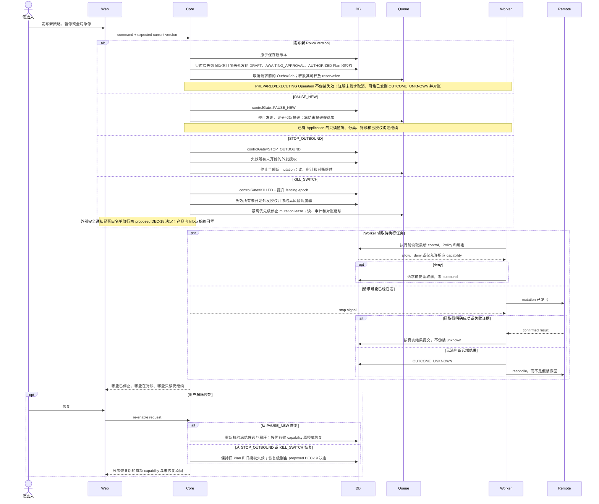
```mermaid
sequenceDiagram
    actor User as 候选人
    participant Web
    participant Core
    participant DB
    participant Queue
    participant Worker
    participant Remote

    User->>Web: 发布新策略、暂停或全局急停
    Web->>Core: command + expected current version
    %% @anchor CONTROL_COMMAND_CLASSIFIED
    %% @anchor PAUSE_SCOPE_ENFORCED
    alt 发布新 Policy version
        Core->>DB: 原子保存新版本
        Core->>DB: 只直接失效旧版本且尚未外发的 DRAFT、AWAITING_APPROVAL、AUTHORIZED Plan 和授权
        Core->>Queue: 取消请求前的 OutboxJob；释放其可释放 reservation
        Note over Core,Worker: PREPARED/EXECUTING Operation 不伪装失效；证明未发才取消，可能已发则 OUTCOME_UNKNOWN 并对账
    else PAUSE_NEW
        Core->>DB: controlGate=PAUSE_NEW
        Core->>Queue: 停止发现、评分和新投递；冻结未投递候选集
        Note over Core,Worker: 已有 Application 的只读监听、分类、对账和已授权沟通继续
    else STOP_OUTBOUND
        Core->>DB: controlGate=STOP_OUTBOUND
        Core->>DB: 失效所有未开始的外发授权
        Core->>Queue: 停止全部新 mutation；读、审计和对账继续
    else KILL_SWITCH
        Core->>DB: controlGate=KILLED + 提升 fencing epoch
        Core->>DB: 失效所有未开始外发授权并冻结高风险调度器
        Core->>Queue: 最高优先级停止 mutation lease；读、审计和对账继续
        Note over Core,Web: 外部安全通知是否白名单放行由 proposed DEC-18 决定；产品内 Inbox 始终可写
    end
    par Worker 领取待执行任务
        Worker->>DB: 执行前读取最新 control、Policy 和绑定
        DB-->>Worker: allow、deny 或仅允许相应 capability
        opt deny
            Worker->>DB: 请求前安全取消，零 outbound
        end
    and 请求可能已经在途
        Worker->>Remote: mutation 已发出
        Core-->>Worker: stop signal
        alt 已取得明确成功或失败证据
            Remote-->>Worker: confirmed result
            Worker->>DB: 按真实结果提交，不伪装 unknown
        else 无法判断远端结果
            Worker->>DB: OUTCOME_UNKNOWN
            Worker->>Remote: reconcile，而不是假装撤回
        end
    end
    Core-->>Web: 哪些已停止、哪些在对账、哪些只读仍继续
    opt 用户解除控制
        User->>Web: 恢复
        Web->>Core: re-enable request
        alt 从 PAUSE_NEW 恢复
            Core->>DB: 重新校验冻结候选与积压；按仍有效 capability 原模式恢复
        else 从 STOP_OUTBOUND 或 KILL_SWITCH 恢复
            Core->>DB: 保持旧 Plan 和旧授权失效；恢复级别由 proposed DEC-19 决定
        end
        Core-->>Web: 展示恢复后的每项 capability 与未恢复原因
    end
```

## RF-UML-SEQ-MSG-01 Webhook、Polling、关联与安全回复

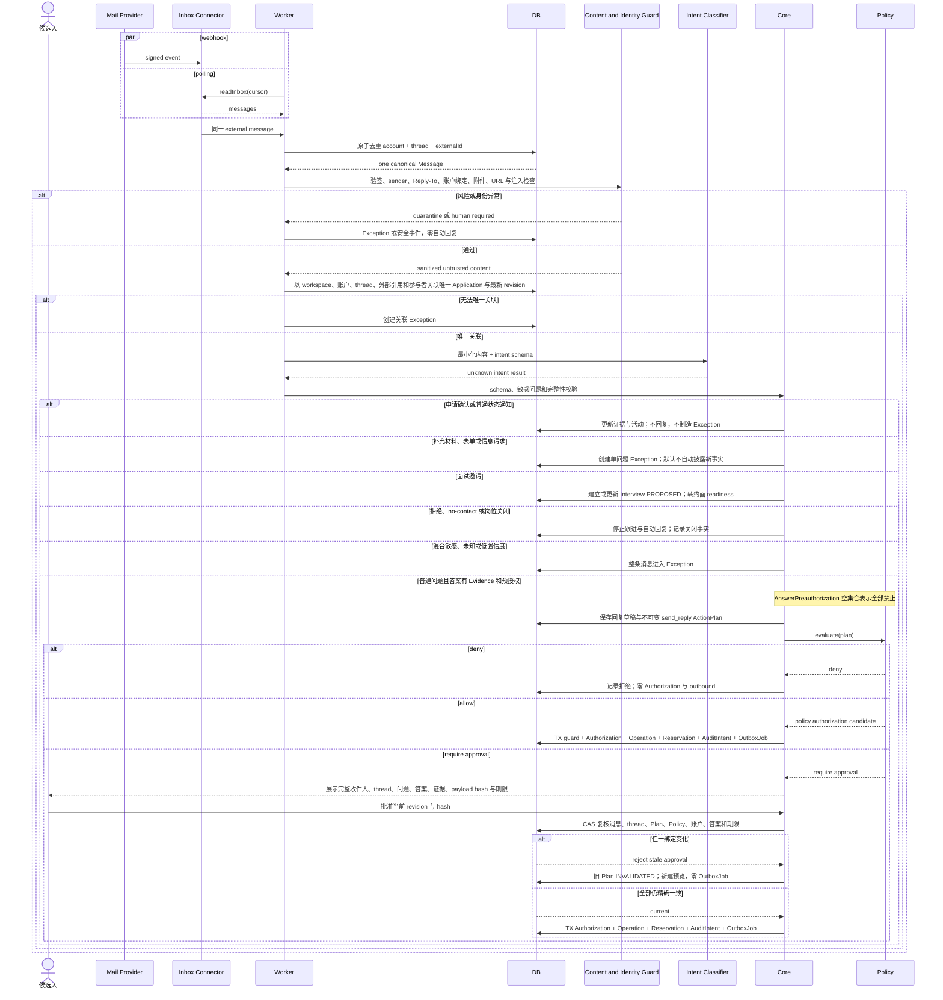
```mermaid
sequenceDiagram
    actor User as 候选人
    participant Mail as Mail Provider
    participant Inbox as Inbox Connector
    participant Worker
    participant DB
    participant Security as Content and Identity Guard
    participant AI as Intent Classifier
    participant Core
    participant Policy

    par webhook
        Mail->>Inbox: signed event
    and polling
        Worker->>Inbox: readInbox(cursor)
        Inbox-->>Worker: messages
    end
    Inbox->>Worker: 同一 external message
    %% @anchor MESSAGE_DEDUP_CORRELATE
    Worker->>DB: 原子去重 account + thread + externalId
    DB-->>Worker: one canonical Message
    %% @anchor SENDER_IDENTITY_GUARD
    Worker->>Security: 验签、sender、Reply-To、账户绑定、附件、URL 与注入检查
    alt 风险或身份异常
        Security-->>Worker: quarantine 或 human required
        Worker->>DB: Exception 或安全事件，零自动回复
    else 通过
        Security-->>Worker: sanitized untrusted content
        %% @anchor APPLICATION_CORRELATION
        Worker->>DB: 以 workspace、账户、thread、外部引用和参与者关联唯一 Application 与最新 revision
        alt 无法唯一关联
            Worker->>DB: 创建关联 Exception
        else 唯一关联
            Worker->>AI: 最小化内容 + intent schema
            AI-->>Worker: unknown intent result
            Worker->>Core: schema、敏感问题和完整性校验
            alt 申请确认或普通状态通知
                Core->>DB: 更新证据与活动；不回复，不制造 Exception
            else 补充材料、表单或信息请求
                Core->>DB: 创建单问题 Exception；默认不自动披露新事实
            else 面试邀请
                Core->>DB: 建立或更新 Interview PROPOSED；转约面 readiness
            else 拒绝、no-contact 或岗位关闭
                Core->>DB: 停止跟进与自动回复；记录关闭事实
            else 混合敏感、未知或低置信度
                Core->>DB: 整条消息进入 Exception
            else 普通问题且答案有 Evidence 和预授权
                Note over Core,Policy: AnswerPreauthorization 空集合表示全部禁止
                Core->>DB: 保存回复草稿与不可变 send_reply ActionPlan
                Core->>Policy: evaluate(plan)
                alt deny
                    Policy-->>Core: deny
                    Core->>DB: 记录拒绝；零 Authorization 与 outbound
                else allow
                    Policy-->>Core: policy authorization candidate
                    Core->>DB: TX guard + Authorization + Operation + Reservation + AuditIntent + OutboxJob
                else require approval
                    Policy-->>Core: require approval
                    Core-->>User: 展示完整收件人、thread、问题、答案、证据、payload hash 与期限
                    User->>Core: 批准当前 revision 与 hash
                    Core->>DB: CAS 复核消息、thread、Plan、Policy、账户、答案和期限
                    alt 任一绑定变化
                        DB-->>Core: reject stale approval
                        Core->>DB: 旧 Plan INVALIDATED；新建预览，零 OutboxJob
                    else 全部仍精确一致
                        DB-->>Core: current
                        Core->>DB: TX Authorization + Operation + Reservation + AuditIntent + OutboxJob
                    end
                end
            end
        end
    end
```

## RF-UML-SEQ-FUP-01 一次跟进与回复循环阻断

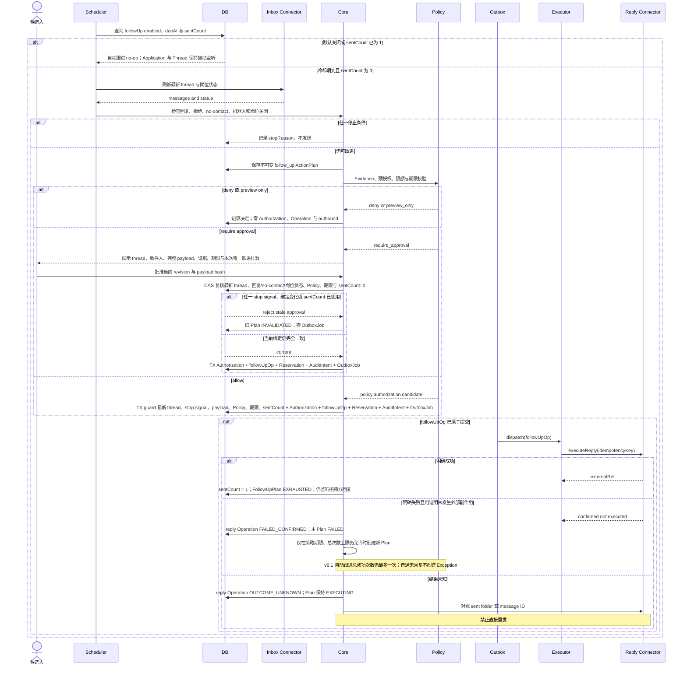
```mermaid
sequenceDiagram
    actor User as 候选人
    participant Scheduler
    participant DB
    participant Inbox as Inbox Connector
    participant Core
    participant Policy
    participant Outbox
    participant Executor
    participant Reply as Reply Connector

    Scheduler->>DB: 查询 followUp enabled、dueAt 与 sentCount
    alt 默认关闭或 sentCount 已为 1
        %% @anchor FOLLOWUP_ONCE
        DB-->>Scheduler: 自动跟进 no-op；Application 与 Thread 保持被动监听
    else 冷却期到且 sentCount 为 0
        Scheduler->>Inbox: 刷新最新 thread 与岗位状态
        Inbox-->>Scheduler: messages and status
        Scheduler->>Core: 检查回复、拒绝、no-contact、机器人和岗位关闭
        alt 任一停止条件
            Core->>DB: 记录 stopReason，不发送
        else 仍可跟进
            Core->>DB: 保存不可变 follow_up ActionPlan
            Core->>Policy: Evidence、预授权、限额与期限校验
            alt deny 或 preview only
                Policy-->>Core: deny or preview_only
                Core->>DB: 记录决定；零 Authorization、Operation 与 outbound
            else require approval
                Policy-->>Core: require_approval
                Core-->>User: 展示 thread、收件人、完整 payload、证据、期限与本次唯一跟进计数
                User->>Core: 批准当前 revision 与 payload hash
                Core->>DB: CAS 复核最新 thread、回复/no-contact/岗位状态、Policy、期限与 sentCount=0
                alt 任一 stop signal、绑定变化或 sentCount 已使用
                    DB-->>Core: reject stale approval
                    Core->>DB: 旧 Plan INVALIDATED；零 OutboxJob
                else 当前绑定仍完全一致
                    DB-->>Core: current
                    Core->>DB: TX Authorization + followUpOp + Reservation + AuditIntent + OutboxJob
                end
            else allow
                Policy-->>Core: policy authorization candidate
                Core->>DB: TX guard 最新 thread、stop signal、payload、Policy、期限、sentCount + Authorization + followUpOp + Reservation + AuditIntent + OutboxJob
            end
            opt followUpOp 已原子提交
                Outbox->>Executor: dispatch(followUpOp)
                Executor->>Reply: executeReply(idempotencyKey)
                alt 明确成功
                    Reply-->>Executor: externalRef
                    Core->>DB: sentCount = 1；FollowUpPlan EXHAUSTED；仍监听招聘方回复
                else 明确失败且可证明未发生外部副作用
                    Reply-->>Executor: confirmed not executed
                    Core->>DB: reply Operation FAILED_CONFIRMED；本 Plan FAILED
                    Core->>Core: 仅在策略期限、总次数上限仍允许时创建新 Plan
                    Note over Core,Policy: v0.1 自动跟进总成功次数仍最多一次；普通无回复不创建 Exception
                else 结果未知
                    Core->>DB: reply Operation OUTCOME_UNKNOWN；Plan 保持 EXECUTING
                    Core->>Reply: 对账 sent folder 或 message ID
                    Note over Core,Reply: 禁止直接重发
                end
            end
        end
    end
```

## RF-UML-SEQ-INT-01 自动约面正常 Saga

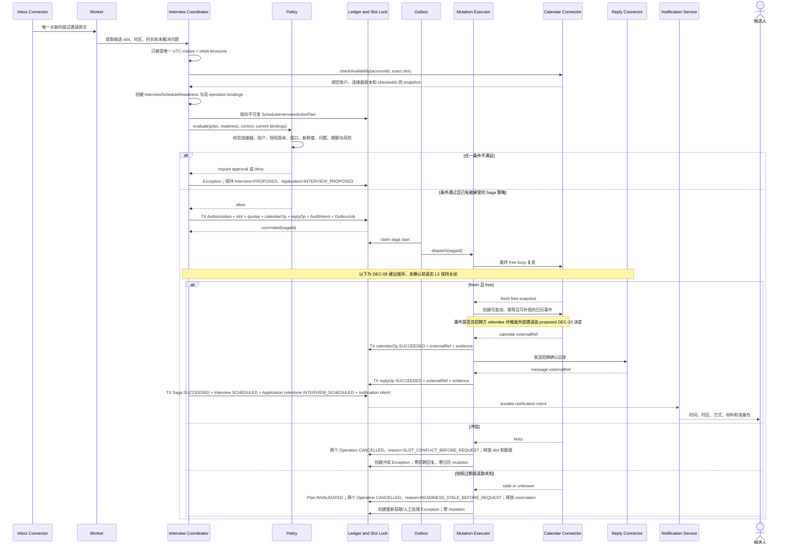
```mermaid
sequenceDiagram
    participant Inbox as Inbox Connector
    participant Worker
    participant Core as Interview Coordinator
    participant Policy
    participant DB as Ledger and Slot Lock
    participant Outbox
    participant Executor as Mutation Executor
    participant Cal as Calendar Connector
    participant Mail as Reply Connector
    participant Notify as Notification Service
    actor User as 候选人

    Inbox->>Worker: 唯一关联的面试邀请原文
    Worker->>Core: 提取候选 slot、时区、时长和未解决问题
    Core->>Core: 只接受唯一 UTC instant + IANA timezone
    Core->>Cal: checkAvailability(accountId, exact slot)
    Cal-->>Core: 绑定账户、连接器版本和 checkedAt 的 snapshot
    %% @anchor INTERVIEW_READINESS
    Core->>Core: 创建 InterviewScheduleReadiness 与双 operation bindings
    Core->>DB: 保存不可变 ScheduleInterviewActionPlan
    Core->>Policy: evaluate(plan, readiness, control, current bindings)
    Policy->>Policy: 校验连接器、账户、授权版本、窗口、新鲜度、问题、限额与风险
    alt 任一条件不满足
        Policy-->>Core: require approval 或 deny
        Core->>DB: Exception；保持 Interview=PROPOSED、Application=INTERVIEW_PROPOSED
    else 条件通过且已有被接受的 Saga 策略
        Policy-->>Core: allow
        Core->>DB: TX Authorization + slot + quotas + calendarOp + replyOp + AuditIntent + OutboxJob
        DB-->>Core: committed(sagaId)
        Outbox->>DB: claim saga start
        Outbox->>Executor: dispatch(sagaId)
        Executor->>Cal: 最终 free busy 复查
        Note over Core,Mail: 以下为 DEC-08 建议顺序，未确认前真实 L3 保持关闭
        alt fresh 且 free
            Cal-->>Executor: fresh free snapshot
            Executor->>Cal: 创建可查询、幂等且可补偿的日历事件
            Note over Executor,Cal: 事件是否含招聘方 attendee 并触发外部邀请由 proposed DEC-20 决定
            Cal-->>Executor: calendar externalRef
            Executor->>DB: TX calendarOp SUCCEEDED + externalRef + evidence
            Executor->>Mail: 发送招聘确认回复
            Mail-->>Executor: message externalRef
            Executor->>DB: TX replyOp SUCCEEDED + externalRef + evidence
            %% @anchor INTERVIEW_BOTH_SUCCEEDED
            Core->>DB: TX Saga SUCCEEDED + Interview SCHEDULED + Application milestone INTERVIEW_SCHEDULED + notification intent
            DB-->>Notify: durable notification intent
            Notify-->>User: 时间、时区、方式、材料和准备包
        else 冲突
            Cal-->>Executor: busy
            Executor->>DB: 两个 Operation CANCELLED，reason=SLOT_CONFLICT_BEFORE_REQUEST；释放 slot 和额度
            Executor->>DB: 创建冲突 Exception；零招聘回复、零日历 mutation
        else 快照过期或读取未知
            Cal-->>Executor: stale or unknown
            Executor->>DB: Plan INVALIDATED；两个 Operation CANCELLED，reason=READINESS_STALE_BEFORE_REQUEST；释放 reservation
            Executor->>DB: 创建重新获取/人工处理 Exception；零 mutation
        end
    end
```

## RF-UML-SEQ-INT-02 约面部分成功、未知与补偿

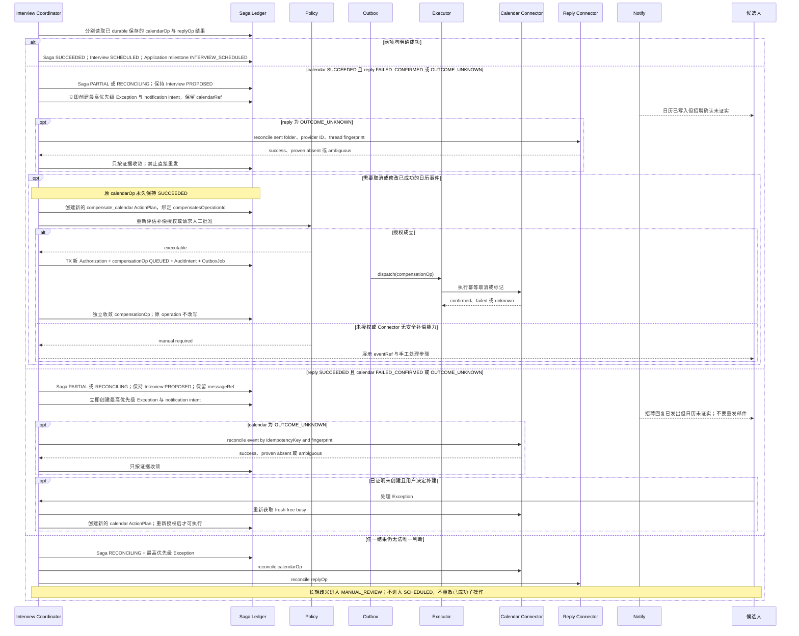
```mermaid
sequenceDiagram
    participant Core as Interview Coordinator
    participant DB as Saga Ledger
    participant Policy
    participant Outbox
    participant Executor
    participant Cal as Calendar Connector
    participant Mail as Reply Connector
    participant Notify
    participant Human as 候选人

    Core->>DB: 分别读取已 durable 保存的 calendarOp 与 replyOp 结果
    %% @anchor INTERVIEW_PARTIAL_COMPENSATE
    alt 两项均明确成功
        Core->>DB: Saga SUCCEEDED；Interview SCHEDULED；Application milestone INTERVIEW_SCHEDULED
    else calendar SUCCEEDED 且 reply FAILED_CONFIRMED 或 OUTCOME_UNKNOWN
        Core->>DB: Saga PARTIAL 或 RECONCILING；保持 Interview PROPOSED
        Core->>DB: 立即创建最高优先级 Exception 与 notification intent，保留 calendarRef
        Notify-->>Human: 日历已写入但招聘确认未证实
        opt reply 为 OUTCOME_UNKNOWN
            Core->>Mail: reconcile sent folder、provider ID、thread fingerprint
            Mail-->>Core: success、proven absent 或 ambiguous
            Core->>DB: 只按证据收敛；禁止直接重发
        end
        opt 需要取消或修改已成功的日历事件
            Note over Core,DB: 原 calendarOp 永久保持 SUCCEEDED
            Core->>DB: 创建新的 compensate_calendar ActionPlan，绑定 compensatesOperationId
            Core->>Policy: 重新评估补偿授权或请求人工批准
            alt 授权成立
                Policy-->>Core: executable
                Core->>DB: TX 新 Authorization + compensationOp QUEUED + AuditIntent + OutboxJob
                Outbox->>Executor: dispatch(compensationOp)
                Executor->>Cal: 执行幂等取消或标记
                Cal-->>Executor: confirmed、failed 或 unknown
                Core->>DB: 独立收敛 compensationOp；原 operation 不改写
            else 未授权或 Connector 无安全补偿能力
                Policy-->>Core: manual required
                Core-->>Human: 展示 eventRef 与手工处理步骤
            end
        end
    else reply SUCCEEDED 且 calendar FAILED_CONFIRMED 或 OUTCOME_UNKNOWN
        Core->>DB: Saga PARTIAL 或 RECONCILING；保持 Interview PROPOSED；保留 messageRef
        Core->>DB: 立即创建最高优先级 Exception 与 notification intent
        Notify-->>Human: 招聘回复已发出但日历未证实；不要重发邮件
        opt calendar 为 OUTCOME_UNKNOWN
            Core->>Cal: reconcile event by idempotencyKey and fingerprint
            Cal-->>Core: success、proven absent 或 ambiguous
            Core->>DB: 只按证据收敛
        end
        opt 已证明未创建且用户决定补建
            Human->>Core: 处理 Exception
            Core->>Cal: 重新获取 fresh free busy
            Core->>DB: 创建新的 calendar ActionPlan；重新授权后才可执行
        end
    else 任一结果仍无法唯一判断
        Core->>DB: Saga RECONCILING + 最高优先级 Exception
        Core->>Cal: reconcile calendarOp
        Core->>Mail: reconcile replyOp
        Note over Core,Human: 长期歧义进入 MANUAL_REVIEW；不进入 SCHEDULED，不重放已成功子操作
    end
```

`RF-UML-SEQ-INT-02` 是与执行顺序无关的结果矩阵，所以也覆盖历史版本、并行执行或外部人工变化造成的对称部分成功。没有可证明幂等、查询与补偿能力的 Connector 只能停留在 L2。

## RF-UML-SEQ-INT-CHANGE-01 已排面试的改期、取消与乱序事件

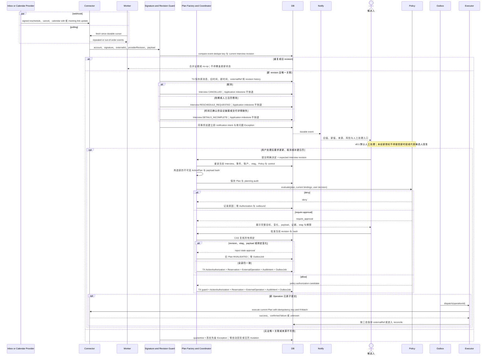
```mermaid
sequenceDiagram
    participant Provider as Inbox or Calendar Provider
    participant Connector
    participant Worker
    participant Guard as Signature and Revision Guard
    participant Core as Plan Factory and Coordinator
    participant DB
    participant Notify
    actor User as 候选人
    participant Policy
    participant Outbox
    participant Executor

    par webhook
        Provider->>Connector: signed reschedule、cancel、calendar edit 或 meeting link update
    and polling
        Worker->>Connector: fetch since durable cursor
        Connector-->>Worker: repeated or out-of-order events
    end
    Connector->>Guard: account、signature、externalId、providerRevision、payload
    Guard->>DB: compare event dedupe key 与 current Interview revision
    %% @anchor INTERVIEW_CHANGE_DETECTED
    alt 重复或旧 revision
        DB-->>Worker: 合并证据或 no-op；不得覆盖更新状态
    else 新 revision 且唯一关联
        Guard->>DB: TX 保存原消息、旧时间、新时间、externalRef 和 revision history
        alt 取消
            Guard->>DB: Interview CANCELLED；Application milestone 不倒退
        else 改期或人工日历修改
            Guard->>DB: Interview RESCHEDULE_REQUESTED；Application milestone 不倒退
        else 时间已确认但会议链接或交付详情缺失
            Guard->>DB: Interview DETAILS_INCOMPLETE；Application milestone 不倒退
        end
        Guard->>DB: 同事务创建立即 notification intent 与单问题 Exception
        DB-->>Notify: durable event
        Notify-->>User: 旧值、新值、来源、风险与人工处理入口
        Note over User,Policy: v0.1 默认人工处理；未经新授权不得接受新时段或代表候选人回复
        opt 用户处理后要求更新、取消或补建日历
            User->>Core: 提交明确决定 + expected Interview revision
            Core->>DB: 重读当前 Interview、事件、账户、etag、Policy 与 control
            Core->>Core: 构造新的不可变 ActionPlan 与 payload hash
            Core->>DB: 保存 Plan 与 planning audit
            Core->>Policy: evaluate(plan, current bindings, user decision)
            alt deny
                Policy-->>Core: deny
                Core->>DB: 记录原因；零 Authorization 与 outbound
            else require approval
                Policy-->>Core: require_approval
                Core-->>User: 展示完整目标、变化、payload、证据、etag 与期限
                User->>Core: 批准当前 revision 与 hash
                Core->>DB: CAS 复核所有绑定
                alt revision、etag、payload 或绑定变化
                    DB-->>Core: reject stale approval
                    Core->>DB: 旧 Plan INVALIDATED；零 OutboxJob
                else 全部仍一致
                    Core->>DB: TX ActionAuthorization + Reservation + ExternalOperation + AuditIntent + OutboxJob
                end
            else allow
                Policy-->>Core: policy authorization candidate
                Core->>DB: TX guard + ActionAuthorization + Reservation + ExternalOperation + AuditIntent + OutboxJob
            end
            opt 新 Operation 已原子提交
                Outbox->>Executor: dispatch(operationId)
                Executor->>Connector: execute current Plan with idempotency key and If-Match
                Connector-->>Executor: success、confirmed failure 或 unknown
                Executor->>DB: 按三态保存 externalRef 或进入 reconcile
            end
        end
    else 无法唯一关联或来源不可信
        Guard->>DB: quarantine + 高优先级 Exception；零自动回复或日历 mutation
    end
```

## RF-UML-SEQ-NOT-01 面试、安全与运行状态通知

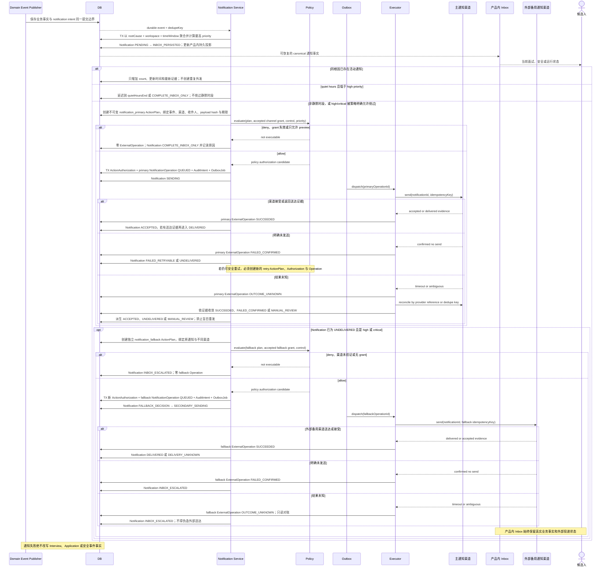
```mermaid
sequenceDiagram
    participant Domain as Domain Event Publisher
    participant DB
    participant Notify as Notification Service
    participant Policy
    participant Outbox
    participant Executor
    participant Primary as 主通知渠道
    participant InboxUI as 产品内 Inbox
    participant Fallback as 外部备用通知渠道
    actor User as 候选人

    %% @anchor NOTIFICATION_FALLBACK
    Domain->>DB: 保存业务事实与 notification intent 同一提交边界
    DB-->>Notify: durable event + dedupeKey
    %% @anchor ALERT_AGGREGATION_QUIET_HOURS
    Notify->>DB: TX 以 rootCause + workspace + timeWindow 聚合并计算最高 priority
    Notify->>DB: Notification PENDING → INBOX_PERSISTED；更新产品内持久投影
    DB-->>InboxUI: 可恢复的 canonical 通知事实
    InboxUI-->>User: 当前面试、安全或运行状态
    alt 同根因已存在活动通知
        Notify->>DB: 只增加 count、更新时间和最新证据；不创建重复外发
    else quiet hours 且低于 high priority
        Notify->>DB: 延迟到 quietHoursEnd 或 COMPLETE_INBOX_ONLY；不绕过静默时段
    else 非静默时段，或 high/critical 被策略明确允许绕过
        Notify->>DB: 创建不可变 notification_primary ActionPlan，绑定事件、渠道、收件人、payload hash 与期限
        Notify->>Policy: evaluate(plan, accepted channel grant, control, priority)
        alt deny、grant 失效或只允许 preview
            Policy-->>Notify: not executable
            Notify->>DB: 零 ExternalOperation；Notification COMPLETE_INBOX_ONLY 并记录原因
        else allow
            Policy-->>Notify: policy authorization candidate
            Notify->>DB: TX ActionAuthorization + primary NotificationOperation QUEUED + AuditIntent + OutboxJob
            Notify->>DB: Notification SENDING
            Outbox->>Executor: dispatch(primaryOperationId)
            Executor->>Primary: send(notificationId, idempotencyKey)
            alt 渠道接受或返回送达证据
                Primary-->>Executor: accepted or delivered evidence
                Executor->>DB: primary ExternalOperation SUCCEEDED
                Notify->>DB: Notification ACCEPTED，若有送达证据再进入 DELIVERED
            else 明确未发送
                Primary-->>Executor: confirmed no send
                Executor->>DB: primary ExternalOperation FAILED_CONFIRMED
                Notify->>DB: Notification FAILED_RETRYABLE 或 UNDELIVERED
                Note over Notify,Policy: 若仍可安全重试，必须创建新的 retry ActionPlan、Authorization 与 Operation
            else 结果未知
                Primary-->>Executor: timeout or ambiguous
                Executor->>DB: primary ExternalOperation OUTCOME_UNKNOWN
                Executor->>Primary: reconcile by provider reference or dedupe key
                Executor->>DB: 依证据收敛 SUCCEEDED、FAILED_CONFIRMED 或 MANUAL_REVIEW
                Notify->>DB: 派生 ACCEPTED、UNDELIVERED 或 MANUAL_REVIEW；禁止盲目重发
            end
        end
        opt Notification 已为 UNDELIVERED 且是 high 或 critical
            Notify->>DB: 创建独立 notification_fallback ActionPlan，绑定原通知与不同渠道
            Notify->>Policy: evaluate(fallback plan, accepted fallback grant, control)
            alt deny、渠道未验证或无 grant
                Policy-->>Notify: not executable
                Notify->>DB: Notification INBOX_ESCALATED；零 fallback Operation
            else allow
                Policy-->>Notify: policy authorization candidate
                Notify->>DB: TX 新 ActionAuthorization + fallback NotificationOperation QUEUED + AuditIntent + OutboxJob
                Notify->>DB: Notification FALLBACK_DECISION → SECONDARY_SENDING
                Outbox->>Executor: dispatch(fallbackOperationId)
                Executor->>Fallback: send(notificationId, fallback idempotencyKey)
                alt 外部备用渠道送达或接受
                    Fallback-->>Executor: delivered or accepted evidence
                    Executor->>DB: fallback ExternalOperation SUCCEEDED
                    Notify->>DB: Notification DELIVERED 或 DELIVERY_UNKNOWN
                else 明确未发送
                    Fallback-->>Executor: confirmed no send
                    Executor->>DB: fallback ExternalOperation FAILED_CONFIRMED
                    Notify->>DB: Notification INBOX_ESCALATED
                else 结果未知
                    Fallback-->>Executor: timeout or ambiguous
                    Executor->>DB: fallback ExternalOperation OUTCOME_UNKNOWN；只读对账
                    Notify->>DB: Notification INBOX_ESCALATED；不得伪造外部送达
                end
                Note over InboxUI,User: 产品内 Inbox 始终保留真实业务事实和外部投递状态
            end
        end
    end
    Note over Domain,DB: 通知失败绝不改写 Interview、Application 或安全事件事实
```

## RF-UML-SEQ-SEC-01 恶意内容、诈骗、SSRF 与 CAPTCHA

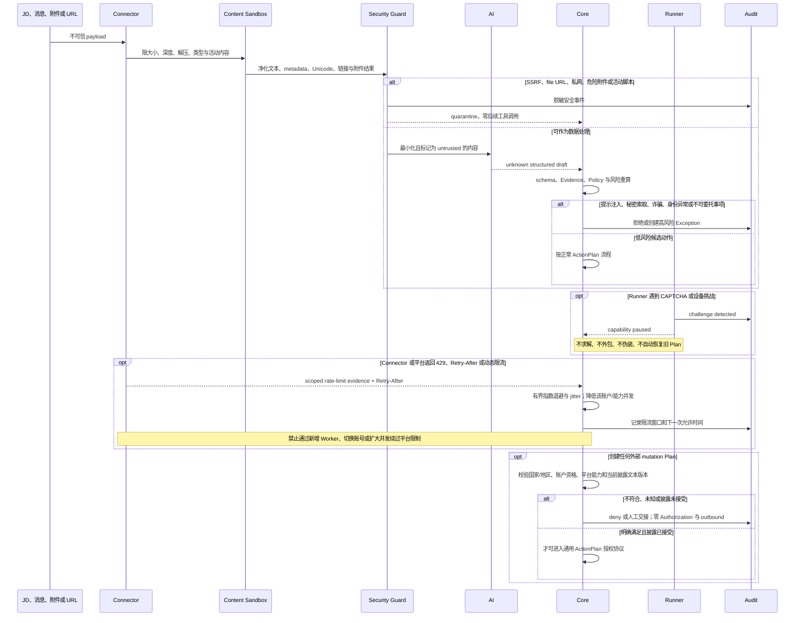
```mermaid
sequenceDiagram
    participant External as JD、消息、附件或 URL
    participant Connector
    participant Sandbox as Content Sandbox
    participant Guard as Security Guard
    participant AI
    participant Core
    participant Runner
    participant Audit

    External->>Connector: 不可信 payload
    %% @anchor UNTRUSTED_CONTENT_QUARANTINE
    Connector->>Sandbox: 限大小、深度、解压、类型与活动内容
    Sandbox->>Guard: 净化文本、metadata、Unicode、链接与附件结果
    alt SSRF、file URL、私网、危险附件或活动脚本
        Guard->>Audit: 脱敏安全事件
        Guard-->>Core: quarantine，零后续工具调用
    else 可作为数据处理
        Guard->>AI: 最小化且标记为 untrusted 的内容
        AI-->>Core: unknown structured draft
        Core->>Core: schema、Evidence、Policy 与风险重算
        alt 提示注入、秘密索取、诈骗、身份异常或不可委托事项
            Core->>Audit: 拒绝或创建高风险 Exception
        else 低风险候选动作
            Core->>Core: 按正常 ActionPlan 流程
        end
    end
    opt Runner 遇到 CAPTCHA 或设备挑战
        Runner->>Audit: challenge detected
        Runner-->>Core: capability paused
        Note over Runner,Core: 不求解、不外包、不伪装、不自动恢复旧 Plan
    end
    opt Connector 或平台返回 429、Retry-After 或动态限流
        %% @anchor RATE_LIMIT_COOPERATIVE_BACKOFF
        Connector-->>Core: scoped rate-limit evidence + Retry-After
        Core->>Core: 有界指数退避与 jitter；降低该账户/能力并发
        Core->>Audit: 记录限流窗口和下一次允许时间
        Note over Connector,Core: 禁止通过新增 Worker、切换账号或扩大并发绕过平台限制
    end
    opt 创建任何外部 mutation Plan
        %% @anchor JURISDICTION_ELIGIBILITY_DISCLOSURE
        Core->>Core: 校验国家/地区、账户资格、平台能力和当前披露文本版本
        alt 不符合、未知或披露未接受
            Core->>Audit: deny 或人工交接；零 Authorization 与 outbound
        else 明确满足且披露已接受
            Core->>Core: 才可进入通用 ActionPlan 授权协议
        end
    end
```

## RF-UML-SEQ-DATA-01 导出、永久删除与最小审计保留

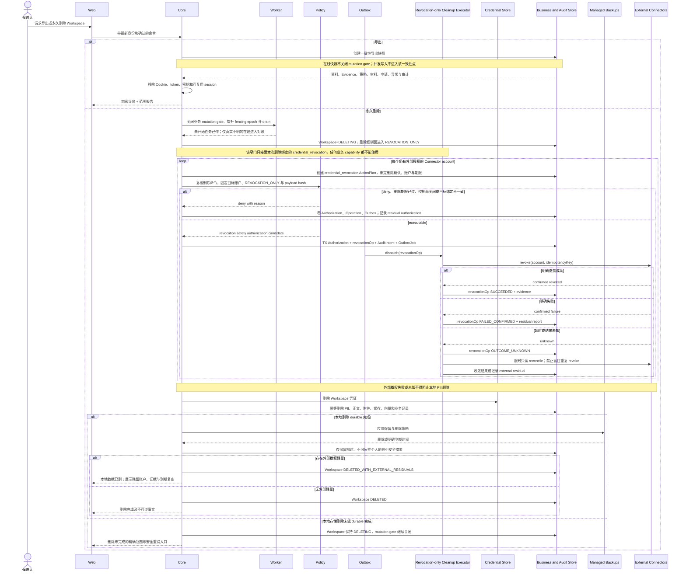
```mermaid
sequenceDiagram
    actor User as 候选人
    participant Web
    participant Core
    participant Worker
    participant Policy
    participant Outbox
    participant Cleanup as Revocation-only Cleanup Executor
    participant Vault as Credential Store
    participant DB as Business and Audit Store
    participant Backup as Managed Backups
    participant Connectors as External Connectors

    User->>Web: 请求导出或永久删除 Workspace
    Web->>Core: 带最新身份和确认的命令
    %% @anchor DATA_DELETE_EXPORT
    alt 导出
        Core->>DB: 创建一致性导出快照
        Note over Core,DB: 在线快照不关闭 mutation gate；并发写入不进入该一致性点
        DB-->>Core: 资料、Evidence、策略、材料、申请、异常与审计
        Core->>Core: 移除 Cookie、token、密钥和可复用 session
        Core-->>Web: 加密导出 + 范围报告
    else 永久删除
        Core->>Worker: 关闭业务 mutation gate、提升 fencing epoch 并 drain
        Worker-->>Core: 未开始任务已停；仅真实不明的在途进入对账
        Core->>DB: Workspace=DELETING；删除控制面进入 REVOCATION_ONLY
        Note over Core,Cleanup: 该窄门只接受本次删除绑定的 credential_revocation，任何业务 capability 都不能使用
        loop 每个仍有外部授权的 Connector account
            %% @anchor CREDENTIAL_REVOCATION_PROTOCOL
            Core->>DB: 创建 credential_revocation ActionPlan，绑定删除确认、账户与期限
            Core->>Policy: 复核删除命令、固定目标账户、REVOCATION_ONLY 与 payload hash
            alt deny、删除期限已过、控制面关闭或目标绑定不一致
                Policy-->>Core: deny with reason
                Core->>DB: 零 Authorization、Operation、Outbox；记录 residual authorization
            else executable
                Policy-->>Core: revocation safety authorization candidate
                Core->>DB: TX Authorization + revocationOp + AuditIntent + OutboxJob
                Outbox->>Cleanup: dispatch(revocationOp)
                Cleanup->>Connectors: revoke(account, idempotencyKey)
                alt 明确撤销成功
                    Connectors-->>Cleanup: confirmed revoked
                    Cleanup->>DB: revocationOp SUCCEEDED + evidence
                else 明确失败
                    Connectors-->>Cleanup: confirmed failure
                    Cleanup->>DB: revocationOp FAILED_CONFIRMED + residual report
                else 超时或结果未知
                    Connectors-->>Cleanup: unknown
                    Cleanup->>DB: revocationOp OUTCOME_UNKNOWN
                    Cleanup->>Connectors: 限时只读 reconcile；禁止盲目重复 revoke
                    Cleanup->>DB: 收敛结果或记录 external residual
                end
            end
        end
        Note over Core,Connectors: 外部撤权失败或未知不得阻止本地 PII 删除
        Core->>Vault: 删除 Workspace 凭证
        Core->>DB: 幂等删除 PII、正文、附件、缓存、向量和业务记录
        alt 本地删除 durable 完成
            Core->>Backup: 应用保留与删除策略
            Backup-->>Core: 删除或明确到期时间
            Core->>DB: 仅保留限时、不可反推个人的最小安全摘要
            alt 存在外部撤权残留
                Core->>DB: Workspace DELETED_WITH_EXTERNAL_RESIDUALS
                Core-->>Web: 本地数据已删；展示残留账户、证据与到期复查
            else 无外部残留
                Core->>DB: Workspace DELETED
                Core-->>Web: 删除完成及不可逆事实
            end
        else 本地存储删除未能 durable 完成
            Core->>DB: Workspace 保持 DELETING，mutation gate 继续关闭
            Core-->>Web: 删除未完成的精确范围与安全重试入口
        end
    end
```

## RF-UML-SEQ-WITHDRAW-01 已提交申请的撤回是新动作

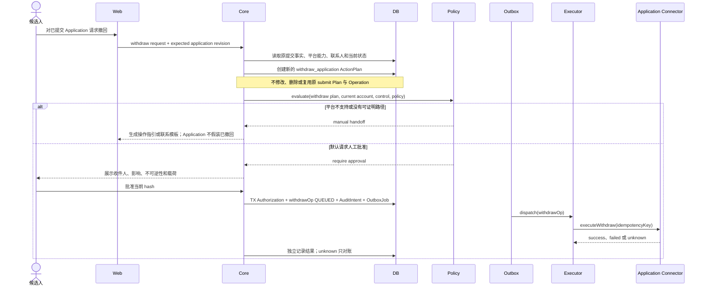
```mermaid
sequenceDiagram
    actor User as 候选人
    participant Web
    participant Core
    participant DB
    participant Policy
    participant Outbox
    participant Executor
    participant Connector as Application Connector

    User->>Web: 对已提交 Application 请求撤回
    Web->>Core: withdraw request + expected application revision
    Core->>DB: 读取原提交事实、平台能力、联系人和当前状态
    %% @anchor WITHDRAW_NEW_ACTION_PLAN
    Core->>DB: 创建新的 withdraw_application ActionPlan
    Note over Core,DB: 不修改、删除或复用原 submit Plan 与 Operation
    Core->>Policy: evaluate(withdraw plan, current account, control, policy)
    alt 平台不支持或没有可证明路径
        Policy-->>Core: manual handoff
        Core-->>Web: 生成操作指引或联系模板；Application 不假装已撤回
    else 默认请求人工批准
        Policy-->>Core: require approval
        Core-->>User: 展示收件人、影响、不可逆性和载荷
        User->>Core: 批准当前 hash
        Core->>DB: TX Authorization + withdrawOp QUEUED + AuditIntent + OutboxJob
        Outbox->>Executor: dispatch(withdrawOp)
        Executor->>Connector: executeWithdraw(idempotencyKey)
        Connector-->>Executor: success、failed 或 unknown
        Core->>DB: 独立记录结果；unknown 只对账
    end
```

## RF-UML-SEQ-MIG-01 升级、drain、fence 与 migration

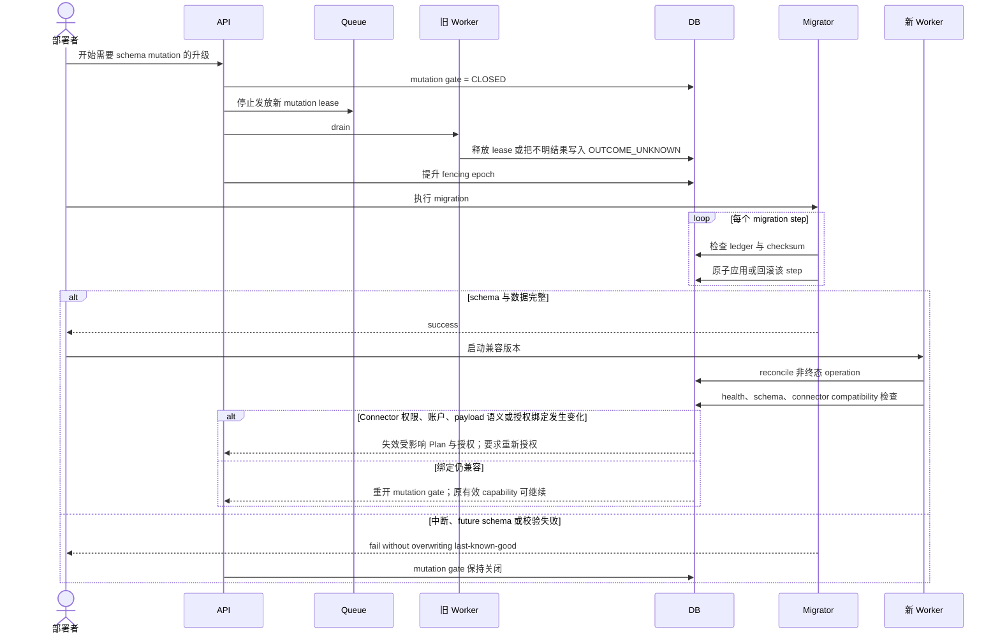
```mermaid
sequenceDiagram
    actor Operator as 部署者
    participant API
    participant Queue
    participant Old as 旧 Worker
    participant DB
    participant Migrator
    participant New as 新 Worker

    %% @anchor MIGRATION_DRAIN_FENCE
    Operator->>API: 开始需要 schema mutation 的升级
    API->>DB: mutation gate = CLOSED
    API->>Queue: 停止发放新 mutation lease
    API->>Old: drain
    Old->>DB: 释放 lease 或把不明结果写入 OUTCOME_UNKNOWN
    API->>DB: 提升 fencing epoch
    Operator->>Migrator: 执行 migration
    loop 每个 migration step
        Migrator->>DB: 检查 ledger 与 checksum
        Migrator->>DB: 原子应用或回滚该 step
    end
    alt schema 与数据完整
        Migrator-->>Operator: success
        Operator->>New: 启动兼容版本
        New->>DB: reconcile 非终态 operation
        New->>DB: health、schema、connector compatibility 检查
        alt Connector 权限、账户、payload 语义或授权绑定发生变化
            DB-->>API: 失效受影响 Plan 与授权；要求重新授权
        else 绑定仍兼容
            DB-->>API: 重开 mutation gate；原有效 capability 可继续
        end
    else 中断、future schema 或校验失败
        Migrator-->>Operator: fail without overwriting last-known-good
        API->>DB: mutation gate 保持关闭
    end
```

## RF-UML-SEQ-DR-01 在线备份、新环境恢复与重新授权

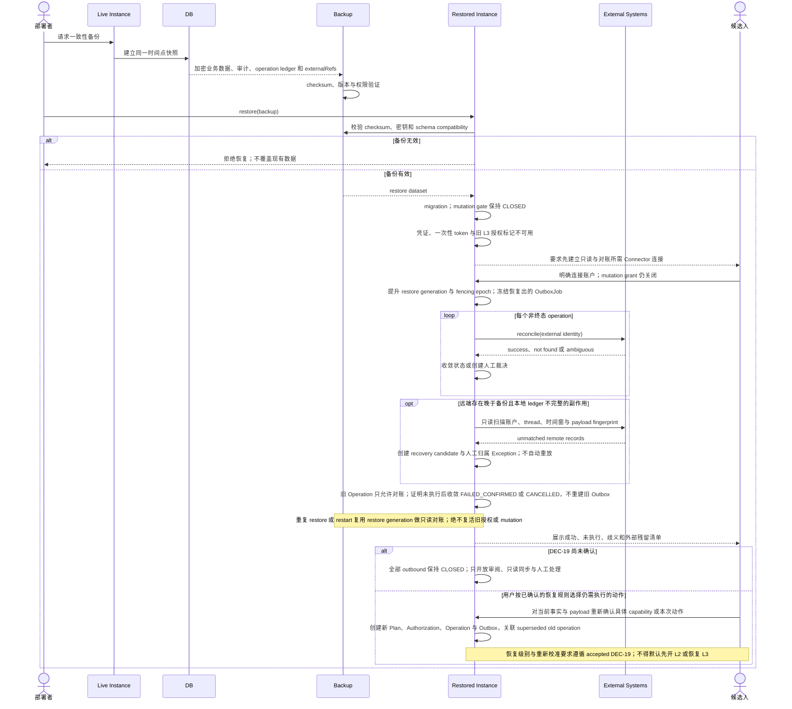
```mermaid
sequenceDiagram
    actor Operator as 部署者
    participant Live as Live Instance
    participant DB
    participant Backup
    participant New as Restored Instance
    participant Remote as External Systems
    actor User as 候选人

    %% @anchor DR_REAUTH_RECONCILE
    Operator->>Live: 请求一致性备份
    Live->>DB: 建立同一时间点快照
    DB-->>Backup: 加密业务数据、审计、operation ledger 和 externalRefs
    Backup->>Backup: checksum、版本与权限验证
    Operator->>New: restore(backup)
    New->>Backup: 校验 checksum、密钥和 schema compatibility
    alt 备份无效
        New-->>Operator: 拒绝恢复；不覆盖现有数据
    else 备份有效
        Backup-->>New: restore dataset
        New->>New: migration；mutation gate 保持 CLOSED
        New->>New: 凭证、一次性 token 与旧 L3 授权标记不可用
        New-->>User: 要求先建立只读与对账所需 Connector 连接
        User->>New: 明确连接账户；mutation grant 仍关闭
        New->>New: 提升 restore generation 与 fencing epoch；冻结恢复出的 OutboxJob
        loop 每个非终态 operation
            New->>Remote: reconcile(external identity)
            Remote-->>New: success、not found 或 ambiguous
            New->>New: 收敛状态或创建人工裁决
        end
        opt 远端存在晚于备份且本地 ledger 不完整的副作用
            New->>Remote: 只读扫描账户、thread、时间窗与 payload fingerprint
            Remote-->>New: unmatched remote records
            New->>New: 创建 recovery candidate 与人工归属 Exception；不自动重放
        end
        New->>New: 旧 Operation 只允许对账；证明未执行后收敛 FAILED_CONFIRMED 或 CANCELLED，不重建旧 Outbox
        Note over New,Backup: 重复 restore 或 restart 复用 restore generation 做只读对账；绝不复活旧授权或 mutation
        New-->>User: 展示成功、未执行、歧义和外部残留清单
        alt DEC-19 尚未确认
            New->>New: 全部 outbound 保持 CLOSED；只开放审阅、只读同步与人工处理
        else 用户按已确认的恢复规则选择仍需执行的动作
            User->>New: 对当前事实与 payload 重新确认具体 capability 或本次动作
            New->>New: 创建新 Plan、Authorization、Operation 与 Outbox，关联 superseded old operation
            Note over New,User: 恢复级别与重新校准要求遵循 accepted DEC-19；不得默认先开 L2 或恢复 L3
        end
    end
```

## RF-UML-SEQ-PLG-01 Connector 或 Provider 安装升级

```mermaid
sequenceDiagram
    actor Operator as 用户或维护者
    participant Registry
    participant Package as Extension Package
    participant Suite as Conformance Suite
    participant Core
    participant DB

    %% @anchor PLUGIN_PERMISSION_DIFF
    Operator->>Registry: 安装或升级扩展
    %% @anchor SUPPLY_CHAIN_RELEASE_GATE
    Registry->>Package: 校验来源、checksum、签名和 manifest schema
    Package-->>Registry: capabilities、permissions、runtime、version、terms
    Registry->>Suite: 在最小权限沙箱运行契约测试
    Suite->>Suite: capability、permission、workspace、schema、idempotency、reconcile、secret canary
    alt 失败或越权
        Suite-->>Registry: reject
        Registry-->>Operator: 不注册能力并说明原因
    else 通过
        Suite-->>Registry: conformance evidence
        Registry->>DB: 比较旧版权限、条款和执行语义
        alt 新增权限或改变 mutation 语义
            Registry->>DB: 只失效尚未外发的旧 Plan 和授权，写入 permission diff
            Registry->>DB: PREPARED/EXECUTING Operation 按证据取消或进入 OUTCOME_UNKNOWN 对账
            Registry-->>Operator: 要求重新确认
        else 兼容更新
            Registry->>Core: 注册声明的独立 capabilities
        end
    end
    opt TLS host、redirect URI、数据地域或 AI fallback Provider 变化
        Registry->>DB: 视为权限与信任边界变化；停止受影响 capability
        Registry-->>Operator: 展示 host、地域、预算、隐私与数据用途差异并重新同意
        Note over Registry,Core: 不静默降级到更宽权限、跨地域或超预算 Provider
    end
```

## RF-UML-SEQ-OBS-01 审计、告警、篡改检测与诊断包

```mermaid
sequenceDiagram
    participant Components as Core、Worker、Runner 与 Connectors
    participant Audit
    participant Integrity as Integrity Verifier
    participant Alert
    actor User as 候选人或运维者

    %% @anchor AUDIT_COMPLETENESS_GATE
    Components->>Components: 校验 correlationId、workspace、plan、operation、actor、policy、payloadHash 与目标身份
    alt 任一必填审计绑定缺失或不一致
        Components->>Audit: 记录可用的拒绝证据与安全事件
        Components->>Components: 拒绝进入 AUTHORIZED；零 Operation、Outbox 与 outbound
    else envelope 完整
        %% @anchor AUDIT_INTEGRITY
        %% @anchor AUDIT_CORRELATION
        Components->>Audit: append 完整授权或执行事件 + externalRef
    end
    %% @anchor OBSERVABILITY_REDACTION
    Audit->>Audit: 结构化编码与 PII、secret 脱敏
    %% @anchor AUDIT_TAMPER_FREEZE
    Integrity->>Audit: 连续性、顺序和篡改校验
    alt 删除、修改、插入或乱序
        Integrity->>Alert: 高优先级完整性事件
        Integrity->>Components: 冻结相关 mutation capability
    else 完整
        Integrity-->>Audit: verified checkpoint
    end
    opt 未授权尝试、疑似重复、unknown 超时或 kill switch 绕过
        %% @anchor SECURITY_ALERT_DEDUP
        Components->>Alert: 幂等安全告警
        Alert-->>User: 脱敏原因与受影响范围
    end
    opt Operation OUTCOME_UNKNOWN 或约面部分成功
        %% @anchor UNKNOWN_STATUS_PROJECTION
        Components->>Audit: 保存单一 canonical status 与 nextAction
        Audit-->>Components: UI、API、metrics、alert 使用同一状态投影
        Note over Components,User: 任一出口都不得显示普通失败、成功或 SCHEDULED
    end
    opt 后续对账纠正历史判断
        %% @anchor AUDIT_APPEND_CORRECTION
        Components->>Audit: 追加 correction event，引用原记录
        Note over Components,Audit: 审计只追加，不覆盖或删除原始观察
    end
    opt 用户生成诊断包
        %% @anchor DIAGNOSTIC_EXPORT_CONSENT
        User->>Audit: 指定 Workspace 和时间范围
        Audit-->>User: 可预览、无 PII/secret 的最小诊断包
    end
```

## RF-UML-SEQ-RES-01 磁盘、数据库、进程与关键依赖故障

```mermaid
sequenceDiagram
    participant Worker
    participant DB
    participant Audit
    participant Vault as Secret Service
    participant Remote
    participant Recovery

    %% @anchor RESOURCE_FAIL_CLOSED
    %% @anchor PREPARE_STORAGE_FAILURE
    Worker->>DB: 保存 PREPARED 前 intent
    alt 磁盘满、锁超时或连接池耗尽
        DB-->>Worker: durable commit failed
        %% @anchor DB_BACKPRESSURE
        Worker->>Worker: backpressure；零 outbound
    else durable commit 成功
        DB-->>Worker: committed
        par 取得短期凭证
            Worker->>Vault: fetch scoped credential
        and 检查审计写入健康
            Worker->>Audit: append pre-execution checkpoint
        end
        %% @anchor CRITICAL_DEPENDENCY_FAIL_CLOSED
        alt Vault 不可用
            Vault-->>Worker: credential unavailable
            Worker->>Worker: fail closed；不缓存明文凭证
        else Audit 不可用
            Audit-->>Worker: checkpoint unavailable
            Worker->>Worker: fail closed；不缓存明文凭证
        else 两者均可用
            Worker->>Remote: mutation
            Remote-->>Worker: result
            alt 远端成功后 DB 断开、ENOSPC 或 OOM
                %% @anchor POST_MUTATION_PERSIST_FAILURE
                Worker--xDB: success commit failed
                Recovery->>DB: 恢复后标记 OUTCOME_UNKNOWN
                Recovery->>Remote: reconcile，副作用不得增加
            else 正常提交
                Worker->>DB: SUCCEEDED
            end
        end
    end
    %% @anchor LEASE_HEARTBEAT_FENCING
    Note over Worker,Recovery: CPU stall、FD 耗尽或 lease 心跳丢失时由 fencing 阻止旧 Worker 提交
```

## RF-UML-SEQ-OFF-01 Worker 或 Runner 离线后的补拉恢复

```mermaid
sequenceDiagram
    participant Heartbeat
    participant Core
    participant Web
    participant Worker
    participant Runner
    participant Connectors as Job、Inbox 与 Calendar
    participant DB

    %% @anchor OFFLINE_CATCHUP
    Heartbeat->>Core: Worker 或 Runner 连续心跳缺失
    Core->>DB: 记录 OFFLINE、lastSeenAt 与 coverage gap start
    Core-->>Web: 显示离线组件、受影响能力和仍在运行的范围
    Note over Core,Web: 不显示“持续运行中”，也不伪造离线期间通知
    opt Worker 或 Runner 恢复
        Heartbeat->>Core: 新心跳 + runtime version
        Core->>DB: 状态 RECOVERING；mutation gate 保持关闭或局部关闭
        Core->>Worker: 从 durable cursor 补拉
        Worker->>Connectors: 读取离线区间岗位、消息、取消和日历变化
        Connectors-->>Worker: 分页、重复或乱序事件
        Worker->>DB: 验签、去重、按 revision 合并
        Worker->>Core: 优先应用拒绝、no-contact、岗位关闭、取消和策略变化
        Core->>DB: 只直接失效尚未外发的陈旧 DRAFT、AWAITING_APPROVAL、AUTHORIZED Plan 与过期任务
        Core->>DB: 对 PREPARED/EXECUTING Operation，证明未发则 CANCELLED；可能已发则 OUTCOME_UNKNOWN
        Core->>Worker: 对其余非终态 Operation 逐项 reconcile；Plan 保持 EXECUTING 到子操作收敛
        Worker->>Runner: probe 凭证与执行能力
        alt 凭证、版本、Policy、授权和控制状态全部仍有效
            Runner-->>Worker: ready
            Core->>DB: ONLINE 或 DEGRADED；短时离线按原有效 capability 模式恢复
            Core-->>Web: 展示覆盖空窗已补齐和剩余限制
        else 任一项未通过
            Runner-->>Worker: reauth or incompatible
            Core->>DB: 仅受影响能力保持 CLOSED、AUTH_REQUIRED 或 DEGRADED
            Core-->>Web: 给出明确恢复动作
        end
    end
```
