# RoleFox v0.1 交互时序

- 状态：Accepted Design Baseline
- 上级索引：[UML 设计基线](README.md)
- 原则：任何真实外发 capability（包括首次 L2、liveness heartbeat、停止告警与删除期 `credential_revocation`）都必须先取得与当前执行绑定的 7 天 pre-L2 Shadow receipt，并经过统一的计划、评估、授权、durable intent、执行前复核、结果确认、审计和对账协议；Accepted Design Baseline 不包含外发旁路或 Shadow 例外。除复合约面使用具名 receipt-set 外，所有专用序列即使为可读性缩写字段清单，也规范性继承 `RF-UML-SEQ-OPR-01`：Plan/PolicyEvaluation/Auth/Operation 必须冻结同一 receipt ID/hash/coverage epoch，并在外部调用紧前与当前 binding 逐项复核。所有 campaign-governed progression kind 还必须继承 `BusinessCampaignExecutionBindingV01`：Plan/PolicyEvaluation/Auth/Operation 冻结同一 active Campaign ID/revision/takeover binding hash，并在授权和每次业务外呼前 CAS 复核。Application 来源 Campaign 已为 `LISTENING/ENDED/ARCHIVED` 且没有用户在当前唯一活跃 Campaign 下显式创建的有效 takeover 时，序列在落盘入站事实与 Exception 后终止，零业务 Plan/Auth/Operation/外呼；图中字段缩写不得省略该 guard。

## RF-UML-SEQ-ONB-01 初始化、连接和撤销


```mermaid
sequenceDiagram
    actor User as 候选人
    participant Web as Web Console
    participant Core as Core API
    participant Supervisor as Local Supervisor
    participant ControlStore as Independent Control Store
    participant Storage as Workspace File Layer
    participant DB as Local Store
    participant Registry as Connector Registry
    participant OAuth as 外部授权服务
    participant Vault as 本地凭证域

    %% @anchor WORKSPACE_INITIALIZATION_RECOVERY_GUARD
    alt 首次创建 Workspace
        User->>Web: 提交 locale、时区、币种和隐私选择
        Web->>Core: initializeWorkspace(settings)
        Core->>Supervisor: bootstrapPreflight(binary/config/key refs, requested storage target)
        Supervisor->>Storage: immutable/read-only/no-create 检查目标路径所有权、既有 header/schema 与文件范围
        Supervisor->>Vault: 只验证主密钥引用/namespace 可用性；不读取或创建业务凭证
        alt 配置/密钥缺失、未来 schema、损坏、错密钥、所有权或既有 control envelope 无法验证
            Supervisor->>ControlStore: 可证明从未 onboarding 时写 INITIALIZATION_BLOCKED；<br/>既有 DB 不可读或 lifecycle=ACTIVE/UNKNOWN 时写 RUNTIME_STORAGE_BLOCKED + faultEpoch<br/>两者均绑定随机 request/workspace surrogate、精确已知 scope 与 fence；不写业务 DB
            Core-->>Web: 仅允许修复后重跑 bootstrap preflight，或确认永久删除本地已知 scope
            break bootstrap preflight 失败；禁止创建 DB/WAL/ledger/checkpoint
                Note over Supervisor,DB: 业务 DB 保持未创建或 immutable read-only；零业务 DB mutation
            end
        else 全新空目标且 bootstrap preflight 通过
            Supervisor->>ControlStore: 原子创建最小 WorkspaceControlEnvelope<br/>随机 workspaceId、精确 storage/Vault namespace、fencing epoch；无 PII/secret
            Core->>DB: 随后才单 TX 原子初始化 schema、Workspace=INITIALIZING、<br/>WorkspaceRecoveryRecord 与初始 checkpoint；业务 mutation gate=CLOSED
            DB-->>Core: workspaceId + persisted recovery facts + checkpoint revision
        else 发现既有/未完成目标且 control envelope 与只读完整性通过
            Supervisor->>ControlStore: 加载并验证既有 WorkspaceControlEnvelope
            Core->>DB: immutable/read-only/no-create 加载 WorkspaceRecoveryRecord 与最后 checkpoint
            DB-->>Core: 持久恢复事实、checkpoint 或完整性错误
        end
    else 初始化或 onboarding 中断后恢复
        User->>Web: 重新打开未完成 Workspace
        Web->>Core: resumeOnboarding(workspaceId, observed checkpoint revision)
        Core->>DB: 只读加载 WorkspaceRecoveryRecord 与最后已提交 checkpoint
        DB-->>Core: 持久恢复事实、checkpoint 或完整性错误
    else 运行期故障或重启恢复
        Web->>Core: recoverWorkspace(workspaceId)
        Core->>Supervisor: 先在 OOB control store 关闭 mutation admission 并提升 fence<br/>业务 DB 未通过只读完整性检查前零写入
        Core->>DB: immutable/read-only/no-create 加载 WorkspaceRecoveryRecord、completion receipt 与 operation ledger
        DB-->>Core: 原稳定状态、故障 epoch、checkpoint、receipt 与未终态 operation
    end
    Core->>DB: 只读 preflight：Workspace 所有权、record/checkpoint revision 与 inputHash<br/>受支持 schema、key 可解密性、migration ledger 完整性；此前 bootstrap 已禁止写前失败
    DB-->>Core: immutable preflight result
    alt 首次/未完成 onboarding 事实完整且没有有效 completion receipt
        Core->>DB: CAS Workspace=ONBOARDING；保留已验证 checkpoint；业务 mutation gate 仍 CLOSED
        Core-->>Web: 返回精确 nextStep；禁止重复导入、OAuth 或账户绑定
    else 可证明从未完成 onboarding，且恢复事实缺失或无效
        Core->>Supervisor: 关闭业务 DB handle；上报只读 preflight digest 与阻断原因
        Supervisor->>ControlStore: 写 INITIALIZATION_BLOCKED + 当前 fencing epoch 与精确已知 scope<br/>业务 DB 保持 immutable read-only；不得合成 checkpoint/completion receipt
        Core-->>Web: 仅允许修复后重跑只读 preflight，或确认永久删除
    else 既有存储 future/corrupt/wrong-key/ledger 不可读，或 prior lifecycle 为 ACTIVE/UNKNOWN
        Core->>Supervisor: 关闭业务 DB handle；写 RUNTIME_STORAGE_BLOCKED + 新 faultEpoch<br/>保存非权威 priorLifecycleHint、preflight digest、精确 scope 与 fencing；业务 DB 零写入
        Core-->>Web: 仅允许修复后重跑 no-create preflight，或按 OOB journal 永久删除<br/>不得跳入首次 ONBOARDING 或直接恢复 ACTIVE
    else WorkspaceRecoveryRecord 指向原稳定 ACTIVE 或已有 completion receipt
        Core->>DB: preflight 通过后的首个 TX 导入任何 OOB faultEpoch 为 RUNTIME_FAULT/OPEN barrier<br/>Workspace=SAFE_READ_ONLY；保留人工控制覆盖层
        Core->>DB: 只读复核 completion receipt、RuntimeHealth 与全部未终态 operation 对账
        alt receipt 有效且依赖健康、对账完整
            Core->>DB: CAS Workspace=ACTIVE；不得复活旧 Plan/Auth 或放宽控制覆盖层
            Core-->>Web: 恢复只读事实后再按现行授权接受新命令
        else receipt 缺失/失效但存在完整的已验证 onboarding checkpoint
            Core->>DB: CAS Workspace=ONBOARDING；从精确 nextStep 继续；业务 mutation gate=CLOSED<br/>保留 RUNTIME_FAULT 的 faultEpoch 与 runtimeRecoveryBarrier=OPEN
            Core-->>Web: 返回恢复步骤；不得从客户端状态推断或清除 runtime barrier
        else 任一 runtime 恢复条件失败或仍有 operation 未收敛
            Core->>DB: Workspace=SAFE_READ_ONLY；业务 mutation gate=CLOSED
            Core-->>Web: 展示缺失项与只读对账状态；禁止自动恢复外发 authority
        end
    end
    opt recovery guard 后 Workspace=ONBOARDING
        loop 每个配置步骤
            User->>Web: 保存事实、Campaign 或设置
            Web->>Core: 带当前 checkpoint revision 与 inputHash 提交
            Core->>DB: 校验 workspace 并 CAS 持久化 checkpoint 与 WorkspaceRecoveryRecord
            Core-->>Web: 已保存，可中断恢复
        end
        %% @anchor CONNECTOR_CONSENT
        User->>Web: 连接一个 Connector
        Web->>Registry: 读取签名 manifest、条款版本、权限、runtime 与数据处理声明
        Registry-->>Web: read scopes、write scopes、credential storage location、runtime location<br/>revoke 方法/官方入口、disconnect impact、terms URL/version/reviewedAt
        Web-->>User: 分项展示上述内容；若数据发送 Provider，再展示 purpose、region<br/>retention 与 training use 选择（training 默认拒绝）
        User->>Web: 选择跳过，或明确提交 readAllowlist/writeAllowlist<br/>及逐 Provider purpose/region/retention/training choice
        Note over User,Core: read/write 空 allowlist 分别恒为 deny，不解释成 all；未授予 capability 不得继承
        alt 用户跳过/不同意，或 read/write allowlist 均为空
            Web->>Core: consent declined/skipped
            Core->>DB: capability 保持 MISSING/LOCAL_ONLY；零凭证、OAuth、账户或外部调用
        else 至少一项 capability 被明确授予
            Web->>Core: versioned consent receipt + exact allowlists + provider choices
            break 真实外部账号缺少同 candidate/spec/catalog 的 G0 或 Gate C-pre 当前 PASS
                Core->>DB: 只记录阻断原因；零 Runtime Binding、凭证、账户绑定和真实业务数据 probe
                Core-->>Web: 返回缺失 Gate 与修复入口；不得以 onboarding 绕过发布因果链
            end
            opt 会读取真实业务数据的外部账号
                Core->>DB: 在任何凭证接收前创建 content-addressed Runtime Binding INTENT<br/>冻结 Provider、requested scopes、redirect/target、candidate/spec/catalog 与 criteria；尚无 account/lineage
            end
            alt OAuth2
                Web->>Core: 创建 state、PKCE 与账户绑定
                Core->>OAuth: 发起授权
                OAuth-->>Core: callback code、state
                Core->>Core: 校验 state、PKCE、redirect URI 与账户
            else API key
                Web->>Core: 通过一次性 secret channel 提交
                Core->>Core: 校验格式、目标 host 与最小权限
            else local session
                Web->>Core: 创建短期配对 challenge
                Core->>Core: 校验本机 Runner、设备和账户绑定
            else 无凭证只读 Connector
                Web->>Core: 确认数据来源与使用条款
            end
            alt 校验通过
                Core->>Vault: 按声明位置保存可复用凭证或本机 credentialRef
                opt 会读取真实业务数据的外部账号
                    Core->>DB: 在任何真实业务数据 read/probe 前创建引用 INTENT 的 FINALIZED Runtime Binding Manifest<br/>冻结去敏 account/binding/credential lineage、manifest/binding digest、criteria epoch 与 max permitted mode
                end
                Core->>Registry: probe 仅已授权 capability；真实账号只使用 FINALIZED manifest 指定的 binding
                Registry-->>Core: capability health；若读取真实业务数据则生成 Gate C-read evidence，不创建 mutation Operation
                Core->>DB: 保存 consent receipt、allowlists、provider choices、credentialRef、Runtime Binding refs 与健康状态
                Core-->>Web: 已连接或局部降级；writeAllowlist 为空时所有写能力关闭
            else 任一绑定不匹配
                Core->>DB: 清理临时授权状态并记录安全事件
                Core-->>Web: 连接失败，零账户绑定
            end
            opt terms、official scope、purpose、region、retention 或 training policy 变化
                Registry->>Core: compliance diff + 新版本证据
                Core->>DB: 暂停受影响 capability；失效未外发 Plan/Auth
                Core-->>User: 展示 diff 并要求重新同意；旧 consent 不自动延续
            end
            opt 用户断开连接
                User->>Web: 撤销 Connector
                Web->>Core: revoke(connectorAccountId)
                Core->>Vault: 立即删除本地凭证或使 credentialRef 不可用
                Core->>DB: 失效未外发 Plan/授权；PREPARED 或 EXECUTING Operation 按外部三态收敛
                Core-->>Web: 展示受影响能力、外部授权残留和 Provider 官方撤销入口
            end
        end
        %% @anchor ONBOARDING_COMPLETION_RECEIPT
        Core->>DB: 只读复核 final checkpoint、关键事实、历史申请声明<br/>唯一 Campaign、合成 Dry-run、引用 revision、业务 mutation gate<br/>以及是否存在 RUNTIME_FAULT 的 OPEN runtimeRecoveryBarrier
        opt 存在 OPEN runtimeRecoveryBarrier
            Core->>DB: 额外只读复核原 faultEpoch、RuntimeHealth、全部非终态 operation 已收敛<br/>旧 Plan/Auth 未复活且当前人工控制覆盖层未被放宽
        end
        DB-->>Core: completion candidate 或精确缺项
        alt 首次 onboarding 全部完成、无 OPEN runtime barrier，且 expected revision 仍当前
            Core->>DB: 单 TX 创建 immutable OnboardingCompletionReceipt<br/>Workspace=ACTIVE；更新 WorkspaceRecoveryRecord 与 final checkpoint
            DB-->>Core: committed receipt id + workspace/recovery revisions
            Core-->>Web: 首次配置完成；保持 DRY_RUN，真实外发仍为 0
        else runtime re-onboarding 全部输入与 RuntimeHealth/operation/控制复核通过
            Core->>DB: 单 TX 创建新的 immutable OnboardingCompletionReceipt<br/>runtimeRecoveryBarrier=SATISFIED、resolvedAt=now、Workspace=ACTIVE<br/>保持旧 Plan/Auth 失效与原人工控制覆盖层
            DB-->>Core: committed new receipt + resolved faultEpoch + workspace revision
            Core-->>Web: 恢复完成；只接受基于当前事实与新授权的新命令
        else OPEN runtime barrier 的健康、对账或控制复核失败
            Core->>DB: Workspace=SAFE_READ_ONLY；业务 mutation gate=CLOSED<br/>barrier 保持 OPEN，不创建 completion receipt
            Core-->>Web: 展示阻断项与只读对账状态
        else 任一缺项、版本变化或事务失败
            Core->>DB: Workspace 保持 ONBOARDING；业务 mutation gate=CLOSED<br/>不创建或补写 completion receipt
            Core-->>Web: 返回精确缺项或冲突；继续原 checkpoint
        end
    end
    opt 用户从 INITIALIZATION_BLOCKED 确认永久删除
        User->>Web: 再次确认不可恢复本地删除与外部授权残留风险
        Web->>Supervisor: deleteBlockedWorkspace(control record, expected revision)
        Supervisor->>ControlStore: 原子生成 deletionRequestId、固定 deadline 与新 fencing epoch<br/>journal=PENDING；冻结当前可验证的精确 storage/Vault/inventory scope
        Supervisor->>Supervisor: 停止该 workspace 进程、任务与句柄；业务 mutation 永久保持 CLOSED
        Supervisor->>Storage: 验证 control envelope 指定的文件/备份 scope；不解析、迁移或写业务 DB
        Supervisor->>Vault: 只读枚举被 control envelope 精确限定且可验证的 credential namespace
        alt inventory 可验证并含已知外部账户
            Supervisor->>ControlStore: 每个目标记录 NOT_ATTEMPTED residual、官方手工撤权入口与 deadline<br/>无有效业务 ledger/Shadow receipt 时零自动撤权调用
        else inventory 不存在、不可读或无法证明完整
            Supervisor->>ControlStore: 记录 INVENTORY_UNREADABLE residual 与 Provider 手工检查指引<br/>不猜测账户、binding 或外部结果
        end
        Supervisor->>Storage: 关闭句柄后幂等删除精确 workspace 文件、临时物与受管备份
        Supervisor->>Vault: 幂等删除精确 credential namespace；不触碰其他 workspace
        Supervisor->>Storage: 验证精确 scope 内零文件/备份/活动进程
        Supervisor->>Vault: 验证精确 namespace 内零 credential item
        alt 任一精确本地 scope 未清空
            Supervisor->>ControlStore: journal 保持 PENDING；隔离并安全重试
        else 本地 scope 全部清空
            Supervisor->>ControlStore: journal=LOCAL_DELETED_WITH_EXTERNAL_RESIDUALS<br/>仅保留不可反推个人的限时摘要；业务 DB 终态写入不是完成前提
            Supervisor-->>Web: 本地删除完成；展示仍需手工检查/撤销的外部授权
        end
    end
```

恢复决策只接受持久 `WorkspaceRecoveryRecord`、已提交 checkpoint、completion receipt，以及在 business DB 不可写窗口内由独立 Supervisor 生成的 OOB fault/fence；客户端页面、内存进度或缺失记录不能被补写成恢复事实。首次创建必须先由业务 DB 外的 Supervisor 完成 no-create bootstrap preflight；只有可证明从未完成 onboarding 的失败才进入 `INITIALIZATION_BLOCKED`。已知 ACTIVE 或生命周期未知且 DB future/corrupt/wrong-key/ledger 不可读时进入 `RUNTIME_STORAGE_BLOCKED`，绝不写未知业务 DB；修复并通过 preflight 后，第一笔安全事务先把 OOB fault epoch 导入 `RUNTIME_FAULT/OPEN` barrier 和 `SAFE_READ_ONLY`，再做完整运行期对账，不能直接进入 onboarding 或 ACTIVE。阻断状态下的永久删除只依赖已验证的 control envelope、文件层和 Vault namespace，无法证明外部撤权时记录残留并给出人工入口，不得猜测调用。即使缺失/失效 receipt 而进入 onboarding UI，原 runtime barrier 仍保持 OPEN；只有重建输入、RuntimeHealth、schema/key/ledger、所有非终态 operation 对账和人工控制覆盖层一起验证完成，并在同一事务关闭 barrier、签发新 receipt 后才可回到 `ACTIVE`。

## RF-UML-SEQ-IMPORT-01 历史申请接管、消歧与去重索引

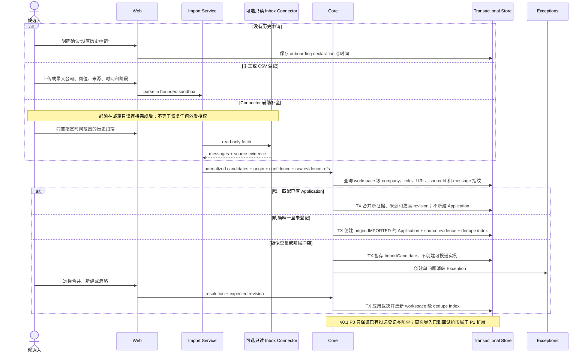
```mermaid
sequenceDiagram
    actor User as 候选人
    participant Web
    participant Import as Import Service
    participant Inbox as 可选只读 Inbox Connector
    participant Core
    participant DB as Transactional Store
    participant Exceptions

    %% @anchor IMPORT_SOURCE_SELECTED
    alt 没有历史申请
        User->>Web: 明确确认“没有历史申请”
        Web->>DB: 保存 onboarding declaration 与时间
    else 手工或 CSV 登记
        User->>Web: 上传或录入公司、岗位、来源、时间和阶段
        Web->>Import: parse in bounded sandbox
    else Connector 辅助补全
        Note over User,Inbox: 必须在邮箱只读连接完成后；不等于恢复任何外发授权
        User->>Web: 同意指定时间范围的历史扫描
        Import->>Inbox: read-only fetch
        Inbox-->>Import: messages + source evidence
    end
    Import->>Core: normalized candidates + origin + confidence + raw evidence refs
    %% @anchor IMPORT_DEDUP_RECONCILE
    Core->>DB: 查询 workspace 级 company、role、URL、sourceId 和 message 指纹
    %% @anchor IMPORT_MATCH_DECISION
    alt 唯一匹配已有 Application
        Core->>DB: TX 合并新证据、来源和更高 revision；不新建 Application
    else 明确唯一且未登记
        Core->>DB: TX 创建 origin=IMPORTED 的 Application + source evidence + dedupe index
    else 疑似重复或阶段冲突
        Core->>DB: TX 暂存 ImportCandidate，不创建可投递实例
        Core->>Exceptions: 创建单问题消歧 Exception
        User->>Web: 选择合并、新建或忽略
        Web->>Core: resolution + expected revision
        Core->>DB: TX 应用裁决并更新 workspace 级 dedupe index
    end
    Note over Core,DB: v0.1 P0 只保证已有投递登记与防重；首次导入已到面试阶段属于 P1 扩展
```

## RF-UML-SEQ-DISC-01 岗位发现到材料草稿

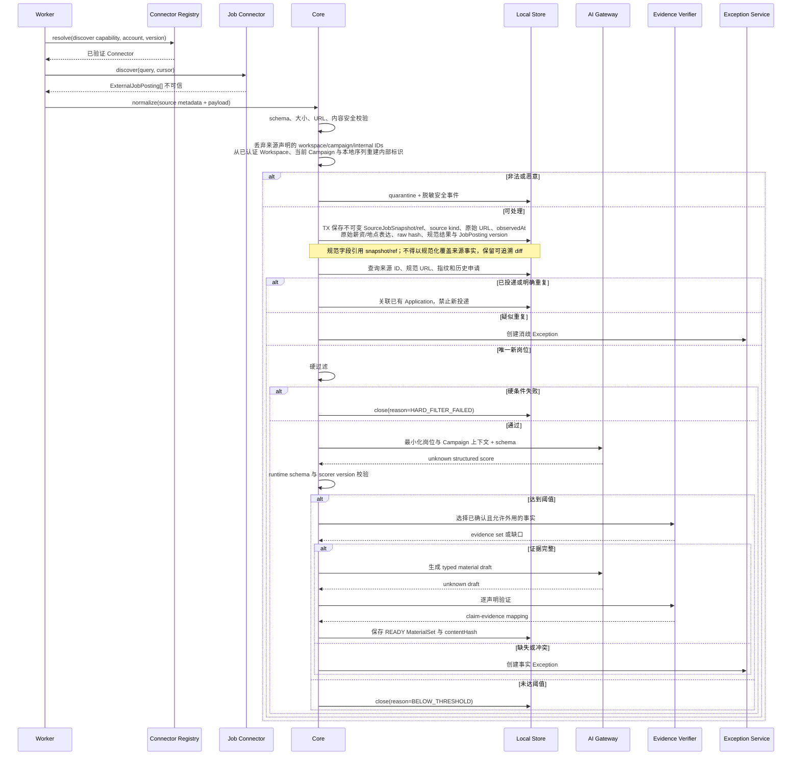
```mermaid
sequenceDiagram
    participant Worker
    participant Registry as Connector Registry
    participant Source as Job Connector
    participant Core
    participant DB as Local Store
    participant AI as AI Gateway
    participant Evidence as Evidence Verifier
    participant Exceptions as Exception Service

    Worker->>Registry: resolve(discover capability, account, version)
    Registry-->>Worker: 已验证 Connector
    %% @anchor EXTERNAL_JOB_POSTING
    Worker->>Source: discover(query, cursor)
    Source-->>Worker: ExternalJobPosting[] 不可信
    Worker->>Core: normalize(source metadata + payload)
    Core->>Core: schema、大小、URL、内容安全校验
    Core->>Core: 丢弃来源声明的 workspace/campaign/internal IDs<br/>从已认证 Workspace、当前 Campaign 与本地序列重建内部标识
    alt 非法或恶意
        Core->>DB: quarantine + 脱敏安全事件
    else 可处理
        %% @anchor JOB_SOURCE_TRACEABILITY
        Core->>DB: TX 保存不可变 SourceJobSnapshot/ref、source kind、原始 URL、observedAt<br/>原始薪资/地点表达、raw hash、规范结果与 JobPosting version
        Note over Core,DB: 规范字段引用 snapshot/ref；不得以规范化覆盖来源事实，保留可追溯 diff
        Core->>DB: 查询来源 ID、规范 URL、指纹和历史申请
        alt 已投递或明确重复
            Core->>DB: 关联已有 Application，禁止新投递
        else 疑似重复
            Core->>Exceptions: 创建消歧 Exception
        else 唯一新岗位
            Core->>Core: 硬过滤
            alt 硬条件失败
                Core->>DB: close(reason=HARD_FILTER_FAILED)
            else 通过
                Core->>AI: 最小化岗位与 Campaign 上下文 + schema
                AI-->>Core: unknown structured score
                Core->>Core: runtime schema 与 scorer version 校验
                alt 达到阈值
                    Core->>Evidence: 选择已确认且允许外用的事实
                    Evidence-->>Core: evidence set 或缺口
                    alt 证据完整
                        Core->>AI: 生成 typed material draft
                        AI-->>Core: unknown draft
                        Core->>Evidence: 逐声明验证
                        Evidence-->>Core: claim-evidence mapping
                        Core->>DB: 保存 READY MaterialSet 与 contentHash
                    else 缺失或冲突
                        Core->>Exceptions: 创建事实 Exception
                    end
                else 未达阈值
                    Core->>DB: close(reason=BELOW_THRESHOLD)
                end
            end
        end
    end
```

## RF-UML-SEQ-APPLY-01 L2 或 L3 投递完整路径

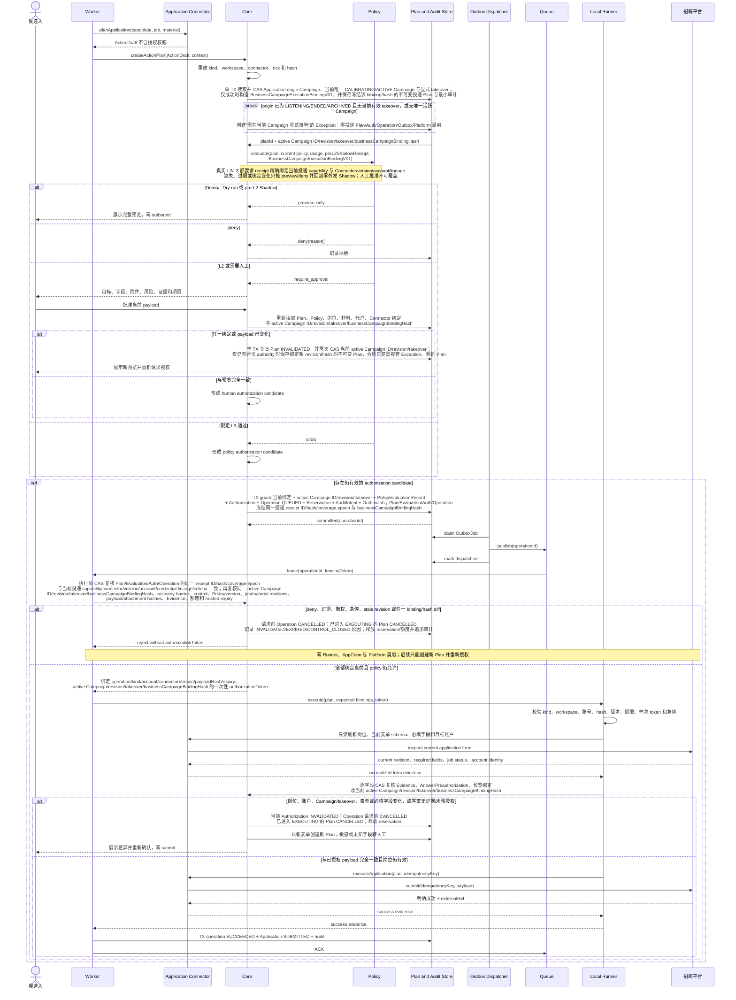
```mermaid
sequenceDiagram
    actor User as 候选人
    participant Worker
    participant AppConn as Application Connector
    participant Core
    participant Policy
    participant DB as Plan and Audit Store
    participant Outbox as Outbox Dispatcher
    participant Queue
    participant Runner as Local Runner
    participant Platform as 招聘平台

    Worker->>AppConn: planApplication(candidate, job, material)
    AppConn-->>Worker: ActionDraft 不含授权权威
    Worker->>Core: createActionPlan(ActionDraft, context)
    Core->>Core: 重建 kind、workspace、connector、risk 和 hash
    Core->>DB: 单 TX 读取并 CAS Application origin Campaign、当前唯一 CALIBRATING/ACTIVE Campaign 与显式 takeover；<br/>仅成功时构造 BusinessCampaignExecutionBindingV01，并保存冻结该 binding/hash 的不可变投递 Plan 与最小审计
    break origin 已为 LISTENING/ENDED/ARCHIVED 且无当前有效 takeover，或无唯一活跃 Campaign
        Core->>DB: 创建“需在当前 Campaign 显式接管”的 Exception；零投递 Plan/Auth/Operation/Outbox/Platform 调用
    end
    %% @anchor PLAN_CREATED
    DB-->>Core: planId + active Campaign ID/revision/takeover/businessCampaignBindingHash
    Core->>Policy: evaluate(plan, current policy, usage, preL2ShadowReceipt,<br/>BusinessCampaignExecutionBindingV01)
    Note over Core,Policy: 真实 L2/L3 都要求 receipt 精确绑定当前投递 capability 与 Connector/version/account/lineage<br/>缺失、过期或绑定变化只能 preview/deny 并回到零外发 Shadow；人工批准不可覆盖
    alt Demo、Dry-run 或 pre-L2 Shadow
        Policy-->>Core: preview_only
        Core-->>User: 展示完整预览，零 outbound
    else deny
        Policy-->>Core: deny(reason)
        Core->>DB: 记录拒绝
    else L2 或需要人工
        Policy-->>Core: require_approval
        Core-->>User: 目标、字段、附件、风险、证据和期限
        User->>Core: 批准当前 payload
        Core->>DB: 重新读取 Plan、Policy、岗位、材料、账户、Connector 绑定<br/>与 active Campaign ID/revision/takeover/businessCampaignBindingHash
        alt 任一绑定或 payload 已变化
            Core->>DB: 单 TX 令旧 Plan INVALIDATED，并再次 CAS 当前 active Campaign ID/revision/takeover；<br/>仅仍有合法 authority 时保存绑定新 revision/hash 的不可变 Plan，否则只建需接管 Exception、零新 Plan
            Core-->>User: 展示新预览并重新请求授权
        else 与预览完全一致
            Core->>Core: 形成 human authorization candidate
        end
    else 限定 L3 通过
        Policy-->>Core: allow
        Core->>Core: 形成 policy authorization candidate
    end
    opt 存在仍有效的 authorization candidate
        %% @anchor AUTH_OPERATION_OUTBOX_COMMITTED
        Core->>DB: TX guard 当前绑定 + active Campaign ID/revision/takeover + PolicyEvaluationRecord<br/>+ Authorization + Operation QUEUED + Reservation + AuditIntent + OutboxJob；Plan/Evaluation/Auth/Operation<br/>冻结同一投递 receipt ID/hash/coverage epoch 与 businessCampaignBindingHash
        DB-->>Core: committed(operationId)
        Outbox->>DB: claim OutboxJob
        Outbox->>Queue: publish(operationId)
        Outbox->>DB: mark dispatched
        Queue->>Worker: lease(operationId, fencingToken)
        %% @anchor EXECUTION_RECHECK
        Worker->>Core: 执行前 CAS 复核 Plan/Evaluation/Auth/Operation 的同一 receipt ID/hash/coverage epoch<br/>与当前投递 capability/connector/version/account/credential lineage/criteria 一致；再复核同一 active Campaign<br/>ID/revision/takeover/businessCampaignBindingHash、recovery barrier、control、Policy/version、job/material revisions、<br/>payload/attachment hashes、Evidence、额度和 trusted expiry
        alt deny、过期、撤权、急停、stale revision 或任一 binding/hash diff
            %% @anchor EXECUTION_RECHECK_DENY
            Core->>DB: 请求前 Operation CANCELLED；已进入 EXECUTING 的 Plan CANCELLED<br/>记录 INVALIDATED/EXPIRED/CONTROL_CLOSED 原因；释放 reservation/额度并追加审计
            Core-->>Worker: reject without authorizationToken
            Note over Worker,Platform: 零 Runner、AppConn 与 Platform 调用；后续只能创建新 Plan 并重新授权
        else 全部绑定当前且 policy 仍允许
            Core-->>Worker: 绑定 operation/kind/account/connectorVersion/payloadHash/expiry、<br/>active Campaign/revision/takeover/businessCampaignBindingHash 的一次性 authorizationToken
            Worker->>Runner: execute(plan, expected bindings, token)
            Runner->>Runner: 校验 kind、workspace、账号、hash、版本、期限、单次 token 和急停
            %% @anchor REQUIRED_FIELD_RECHECK
            Runner->>AppConn: 只读刷新岗位、当前表单 schema、必填字段和目标账户
            AppConn->>Platform: inspect current application form
            Platform-->>AppConn: current revision、required fields、job status、account identity
            AppConn-->>Runner: normalized form evidence
            Runner->>Core: 逐字段 CAS 复核 Evidence、AnswerPreauthorization、预览绑定<br/>及当前 active Campaign/revision/takeover/businessCampaignBindingHash
            alt 岗位、账户、Campaign/takeover、表单或必填字段变化，或答案无证据/未预授权
                Core->>DB: 当前 Authorization INVALIDATED；Operation 请求前 CANCELLED<br/>已进入 EXECUTING 的 Plan CANCELLED；释放 reservation
                Core->>DB: 以新表单创建新 Plan；敏感或未知字段转人工
                Core-->>User: 展示差异并重新确认，零 submit
            else 与已授权 payload 完全一致且岗位仍有效
                Runner->>AppConn: executeApplication(plan, idempotencyKey)
                AppConn->>Platform: submit(idempotencyKey, payload)
                Platform-->>AppConn: 明确成功 + externalRef
                AppConn-->>Runner: success evidence
                Runner-->>Worker: success evidence
                Worker->>DB: TX operation SUCCEEDED + Application SUBMITTED + audit
                Worker->>Queue: ACK
            end
        end
    end
```

v0.1 官方首条真实路径采用开放导入或合规只读岗位源 + 邮件 + 日历 + 通知；真实投递默认停在 L2 或材料导出/预填/深链接交接。本图的 L3 分支只适用于后续通过独立 capability 门槛且 Connector 合规可验证的路径，不把 BOSS 直聘或任一具体平台作为核心阻塞依赖。

## RF-UML-SEQ-OPR-01 通用 mutation 的 durable 边界

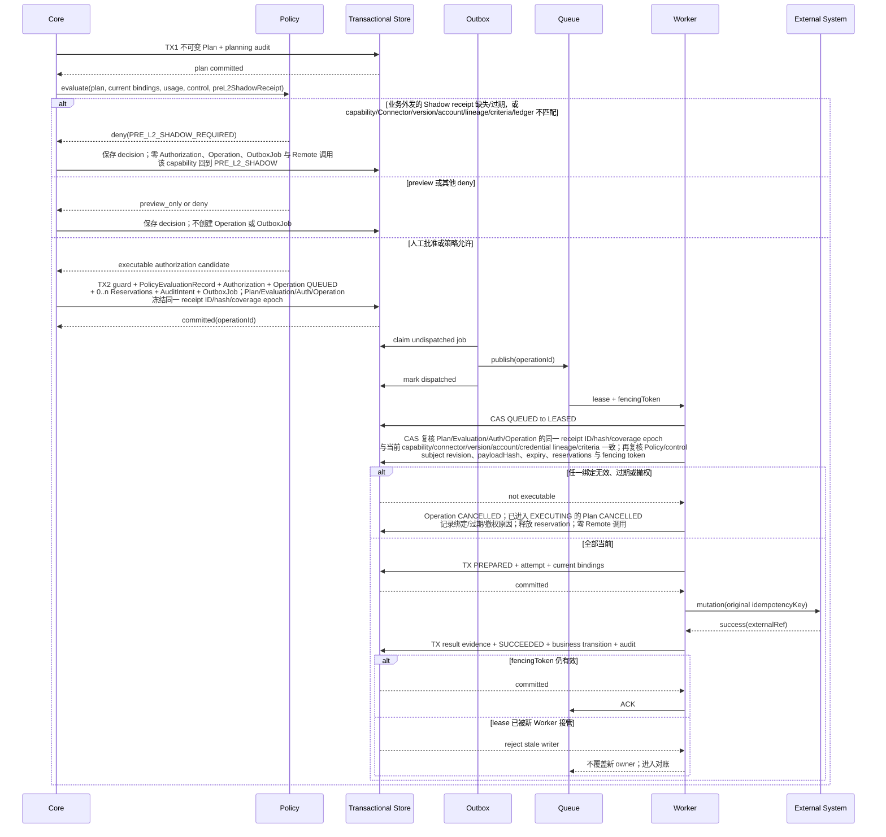
```mermaid
sequenceDiagram
    participant Core
    participant Policy
    participant DB as Transactional Store
    participant Outbox
    participant Queue
    participant Worker
    participant Remote as External System

    %% @anchor PLAN_CREATED
    Core->>DB: TX1 不可变 Plan + planning audit
    DB-->>Core: plan committed
    %% @anchor PRE_L2_SHADOW_AUTHORIZATION_GATE
    Core->>Policy: evaluate(plan, current bindings, usage, control, preL2ShadowReceipt)
    alt 业务外发的 Shadow receipt 缺失/过期，或 capability/Connector/version/account/lineage/criteria/ledger 不匹配
        Policy-->>Core: deny(PRE_L2_SHADOW_REQUIRED)
        Core->>DB: 保存 decision；零 Authorization、Operation、OutboxJob 与 Remote 调用<br/>该 capability 回到 PRE_L2_SHADOW
    else preview 或其他 deny
        Policy-->>Core: preview_only or deny
        Core->>DB: 保存 decision；不创建 Operation 或 OutboxJob
    else 人工批准或策略允许
        Policy-->>Core: executable authorization candidate
        %% @anchor AUTH_OPERATION_OUTBOX_COMMITTED
        Core->>DB: TX2 guard + PolicyEvaluationRecord + Authorization + Operation QUEUED<br/>+ 0..n Reservations + AuditIntent + OutboxJob；Plan/Evaluation/Auth/Operation<br/>冻结同一 receipt ID/hash/coverage epoch
        DB-->>Core: committed(operationId)
        Outbox->>DB: claim undispatched job
        Outbox->>Queue: publish(operationId)
        Outbox->>DB: mark dispatched
        Queue->>Worker: lease + fencingToken
        Worker->>DB: CAS QUEUED to LEASED
        Worker->>DB: CAS 复核 Plan/Evaluation/Auth/Operation 的同一 receipt ID/hash/coverage epoch<br/>与当前 capability/connector/version/account/credential lineage/criteria 一致；再复核 Policy/control<br/>subject revision、payloadHash、expiry、reservations 与 fencing token
        alt 任一绑定无效、过期或撤权
            DB-->>Worker: not executable
            Worker->>DB: Operation CANCELLED；已进入 EXECUTING 的 Plan CANCELLED<br/>记录绑定/过期/撤权原因；释放 reservation；零 Remote 调用
        else 全部当前
            Worker->>DB: TX PREPARED + attempt + current bindings
            DB-->>Worker: committed
            Worker->>Remote: mutation(original idempotencyKey)
            Remote-->>Worker: success(externalRef)
            Worker->>DB: TX result evidence + SUCCEEDED + business transition + audit
            alt fencingToken 仍有效
                DB-->>Worker: committed
                Worker->>Queue: ACK
            else lease 已被新 Worker 接管
                DB-->>Worker: reject stale writer
                Worker-->>Queue: 不覆盖新 owner；进入对账
            end
        end
    end
```

只有 `PREPARED` durable commit 后才能发出外部请求；只有结果和业务状态 durable commit 后才能 ACK。Queue 与数据库不共享事务，因此 OutboxJob 必须与 Operation 同事务创建，并可由扫描器重建投递。

## RF-UML-SEQ-AUTH-TIME-01 陈旧 UI 与不可信本机时间不能授权

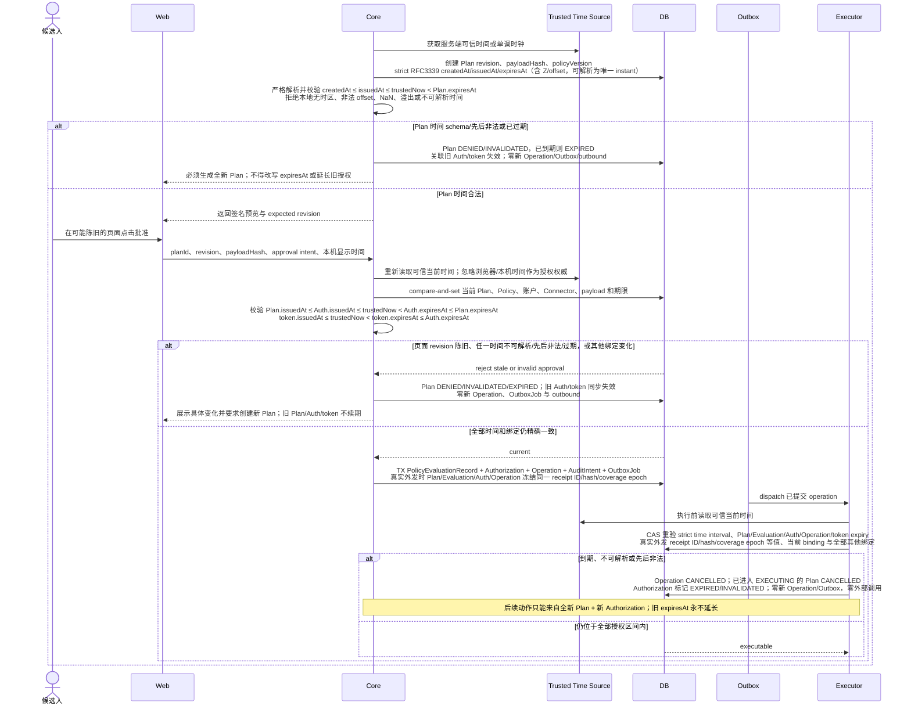
```mermaid
sequenceDiagram
    actor User as 候选人
    participant Web
    participant Core
    participant Clock as Trusted Time Source
    participant DB
    participant Outbox
    participant Executor

    Core->>Clock: 获取服务端可信时间或单调时钟
    Core->>DB: 创建 Plan revision、payloadHash、policyVersion<br/>strict RFC3339 createdAt/issuedAt/expiresAt（含 Z/offset，可解析为唯一 instant）
    %% @anchor AUTH_STRICT_TIME_INTERVAL
    Core->>Core: 严格解析并校验 createdAt ≤ issuedAt ≤ trustedNow < Plan.expiresAt<br/>拒绝本地无时区、非法 offset、NaN、溢出或不可解析时间
    alt Plan 时间 schema/先后非法或已过期
        Core->>DB: Plan DENIED/INVALIDATED，已到期则 EXPIRED<br/>关联旧 Auth/token 失效；零新 Operation/Outbox/outbound
        Core-->>Web: 必须生成全新 Plan；不得改写 expiresAt 或延长旧授权
    else Plan 时间合法
        Core-->>Web: 返回签名预览与 expected revision
        User->>Web: 在可能陈旧的页面点击批准
        Web->>Core: planId、revision、payloadHash、approval intent、本机显示时间
        %% @anchor STALE_UI_TRUSTED_TIME
        Core->>Clock: 重新读取可信当前时间；忽略浏览器/本机时间作为授权权威
        Core->>DB: compare-and-set 当前 Plan、Policy、账户、Connector、payload 和期限
        Core->>Core: 校验 Plan.issuedAt ≤ Auth.issuedAt ≤ trustedNow < Auth.expiresAt ≤ Plan.expiresAt<br/>token.issuedAt ≤ trustedNow < token.expiresAt ≤ Auth.expiresAt
        alt 页面 revision 陈旧、任一时间不可解析/先后非法/过期，或其他绑定变化
            DB-->>Core: reject stale or invalid approval
            Core->>DB: Plan DENIED/INVALIDATED/EXPIRED；旧 Auth/token 同步失效<br/>零新 Operation、OutboxJob 与 outbound
            Core-->>Web: 展示具体变化并要求创建新 Plan；旧 Plan/Auth/token 不续期
        else 全部时间和绑定仍精确一致
            DB-->>Core: current
            Core->>DB: TX PolicyEvaluationRecord + Authorization + Operation + AuditIntent + OutboxJob<br/>真实外发时 Plan/Evaluation/Auth/Operation 冻结同一 receipt ID/hash/coverage epoch
            Outbox->>Executor: dispatch 已提交 operation
            Executor->>Clock: 执行前读取可信当前时间
            Executor->>DB: CAS 重验 strict time interval、Plan/Evaluation/Auth/Operation/token expiry<br/>真实外发 receipt ID/hash/coverage epoch 等值、当前 binding 与全部其他绑定
            alt 到期、不可解析或先后非法
                Executor->>DB: Operation CANCELLED；已进入 EXECUTING 的 Plan CANCELLED<br/>Authorization 标记 EXPIRED/INVALIDATED；零新 Operation/Outbox，零外部调用
                Note over Executor,Core: 后续动作只能来自全新 Plan + 新 Authorization；旧 expiresAt 永不延长
            else 仍位于全部授权区间内
                DB-->>Executor: executable
            end
        end
    end
```

## RF-UML-SEQ-OPR-02 F0–F6 崩溃切点与对账

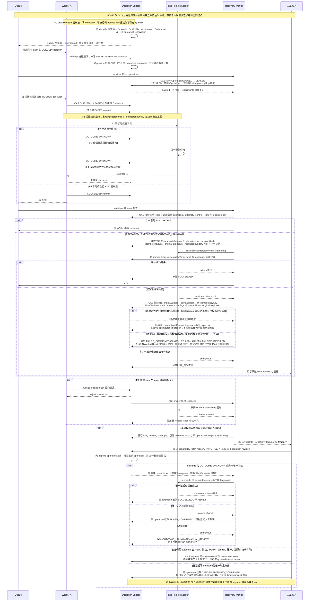
```mermaid
sequenceDiagram
    participant Queue
    participant WorkerA as Worker A
    participant DB as Operation Ledger
    participant Remote as Fake Remote Ledger
    participant WorkerB as Recovery Worker
    participant Human as 人工裁决

    Note over Queue,Human: F0–F6 与 DLQ 分支是对同一协议的独立故障注入场景，不表示一次请求连续经历全部切点
    %% @anchor F0_UNCLAIMED_RECOVERY
    Note over WorkerA,DB: F0 durable intent 前崩溃：零 outbound；可按逻辑 dedupe key 重建尚不存在的 intent
    DB->>DB: 已 durable 提交唯一 Operation QUEUED、AuditIntent、OutboxJob<br/>及一次 quota/slot reservation
    DB-->>Queue: Outbox 发布同一 operationId；重复发布由唯一键折叠
    %% @anchor QUEUED_UNCLAIMED_RECOVERY
    Queue->>WorkerA: 投递尚未 claim 的 QUEUED operation
    WorkerA--xDB: claim 前进程崩溃；未写 LEASED/PREPARED/attempt
    DB->>DB: Operation 仍为 QUEUED；原 quota/slot reservation 不变且不再次计数
    Queue->>WorkerB: redeliver 同一 operationId
    WorkerB->>DB: CAS 同一 Operation QUEUED → LEASED<br/>不扫描 Plan 重建 Operation，不创建新 idempotencyKey/额度
    DB-->>WorkerB: claimed；可用同一 operationId 继续 F1

    Queue->>WorkerA: 正常路径投递已有 QUEUED operation
    WorkerA->>DB: CAS QUEUED → LEASED；创建首个 attempt
    WorkerA->>DB: F1 PREPARED commit
    %% @anchor F1_REUSE_OPERATION
    Note over WorkerA,Remote: F1 后连接前崩溃：复用同 operationId 与 idempotencyKey，禁止新业务意图
    WorkerA->>Remote: F2 请求可能已发出
    alt F2 发送途中断线
        WorkerA->>DB: OUTCOME_UNKNOWN
    else F3 远端已提交但响应丢失
        Remote->>Remote: 仅一个副作用
        WorkerA->>DB: OUTCOME_UNKNOWN
    else F4 已收到成功但本地提交前崩溃
        Remote-->>WorkerA: externalRef
        WorkerA--xDB: 未提交 success
    else F5 本地成功但 ACK 前崩溃
        WorkerA->>DB: SUCCEEDED commit
        WorkerA--xQueue: 未 ACK
    end
    Queue->>WorkerB: redeliver 或 lease 接管
    %% @anchor LEASE_RECLAIM_REVALIDATE
    WorkerB->>DB: CAS 接管过期 lease；读取最新 operation、attempt、control、授权与 fencingToken
    alt DB 已是 SUCCEEDED
        %% @anchor F5_TERMINAL_REDELIVERY_ACK
        WorkerB->>Queue: 只 ACK，不再 mutation
    else PREPARED、EXECUTING 或 OUTCOME_UNKNOWN
        %% @anchor OUTCOME_UNKNOWN_RECONCILE
        WorkerB->>DB: 读取不可变 local audit/attempt：policyVersion、payloadHash<br/>idempotencyKey、original expiresAt、request boundary 与已写字节证据
        WorkerB->>Remote: reconcile(idempotencyKey, fingerprint)
        WorkerB->>DB: 将 remote ledger/externalRef/fingerprint 与 local audit 逐项比较
        alt 唯一成功结果
            Remote-->>WorkerB: externalRef
            WorkerB->>DB: 补记 SUCCEEDED
            WorkerB->>Queue: ACK
        else 证明远端未执行
            Remote-->>WorkerB: not found with proof
            WorkerB->>DB: CAS 重验当前 Policy/version、payloadHash、原 idempotencyKey<br/>Plan/Auth/account/connector bindings 与 trustedNow < original expiresAt
            alt 原状态为 PREPARED/LEASED、local+remote 均证明未发且授权仍完全有效
                DB-->>WorkerB: resumable same operation
                WorkerB->>DB: 继续同一 operationId/idempotencyKey 与原 expiresAt<br/>仅新增 attempt/fencing token；不得延长任何期限或新增额度
            else 原状态已 OUTCOME_UNKNOWN，或策略/载荷/绑定/期限任一失效
                WorkerB->>DB: 收敛 FAILED_CONFIRMED/CANCELLED；Plan 对应进入 FAILED/CANCELLED<br/>记录 INVALIDATED/EXPIRED 原因；零普通 retry；需要动作时创建全新 Plan 并重新授权
            end
        else 零、一或多候选无法唯一判断
            Remote-->>WorkerB: ambiguous
            WorkerB->>DB: MANUAL_REVIEW
            WorkerB-->>Human: 展示候选 externalRefs 与证据
        end
    end
    %% @anchor STALE_FENCING_REJECTED
    opt F6 旧 Worker 在 lease 过期后恢复
        WorkerA->>DB: 使用旧 fencingToken 提交结果
        DB-->>WorkerA: reject stale writer
        DB->>WorkerB: 当前 owner 继续 reconcile
        WorkerB->>Remote: 按同一 idempotencyKey 查询
        Remote-->>WorkerB: canonical result
        WorkerB->>DB: 使用新 fencingToken 收敛一次
    end
    opt 基础设施失败超过有界次数进入 DLQ
        WorkerB->>DB: 保存 DLQ reason、attempts、当前 outcome class 与原 operation/idempotency binding
        WorkerB-->>Human: 展示远端证据、当前授权/策略与安全重放条件
        %% @anchor DLQ_OPERATOR_REQUEUE_GUARD
        Human->>DB: 提交 operatorId、明确 reason、时间、入口与 expected operation revision
        DB->>DB: 先 append operator audit，再锁定原 operation；禁止“一键新建重试”
        alt outcome 为 OUTCOME_UNKNOWN 或尚未唯一收敛
            DB-->>WorkerB: 只创建 reconcile job；零普通 requeue、零新 Plan/Operation/额度
            WorkerB->>Remote: reconcile 原 idempotencyKey 与严格 fingerprint
            alt 唯一证明远端已成功
                Remote-->>WorkerB: canonical externalRef
                WorkerB->>DB: 原 operation 收敛 SUCCEEDED；不 requeue
            else 唯一证明远端未执行
                Remote-->>WorkerB: proven absent
                WorkerB->>DB: 原 operation 收敛 FAILED_CONFIRMED；回到显式人工裁决
            else 仍有歧义
                Remote-->>WorkerB: ambiguous
                WorkerB->>DB: 保持 OUTCOME_UNKNOWN/MANUAL_REVIEW<br/>绝不创建新 Plan 或外发任务
            end
        else 已证明零 outbound 且 Plan、授权、Policy、control、账户、期限仍精确有效
            Human->>DB: CAS requeue 同一 operationId 与 idempotencyKey<br/>不创建第二个业务意图、不新增 quota/slot reservation
        else 已证明零 outbound但任一绑定失效
            Human->>DB: 原 operation 收敛 CANCELLED/FAILED_CONFIRMED<br/>旧 Plan 对应收敛 CANCELLED/FAILED，并记录 binding invalid 原因
            Note over Human,DB: 若仍需动作，必须离开 DLQ 流程另行显式规划和批准；不得由 requeue 自动新建 Plan
        end
    end
```

## RF-UML-SEQ-CONC-01 重复任务、双 Worker、额度与时段竞争

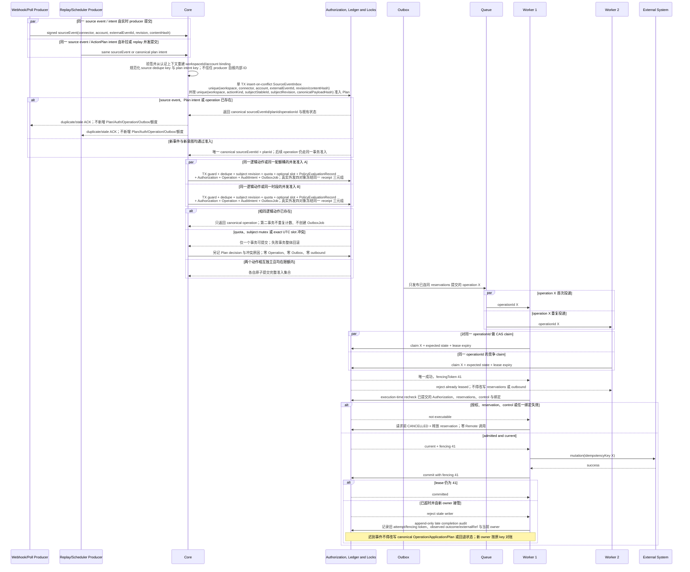
```mermaid
sequenceDiagram
    participant P1 as Webhook/Poll Producer
    participant P2 as Replay/Scheduler Producer
    participant Core
    participant DB as Authorization, Ledger and Locks
    participant Outbox
    participant Queue
    participant W1 as Worker 1
    participant W2 as Worker 2
    participant Remote as External System

    %% @anchor MULTI_PRODUCER_SOURCE_PLAN_ADMISSION_DEDUP
    par 同一 source event / intent 由实时 producer 提交
        P1->>Core: signed sourceEvent(connector, account, externalEventId, revision, contentHash)
    and 同一 source event / ActionPlan intent 由补拉或 replay 并发提交
        P2->>Core: same sourceEvent or canonical plan intent
    end
    Core->>Core: 验签并从认证上下文重建 workspaceId/account binding<br/>规范化 source dedupe key 与 plan intent key；不信任 producer 自报内部 ID
    Core->>DB: 单 TX insert-on-conflict SourceEventInbox<br/>unique(workspace, connector, account, externalEventId, revision/contentHash)<br/>并按 unique(workspace, actionKind, subjectStableId, subjectRevision, canonicalPayloadHash) 准入 Plan
    alt source event、Plan intent 或 operation 已存在
        DB-->>Core: 返回 canonical sourceEventId/planId/operationId 与既有状态
        Core-->>P1: duplicate/stale ACK；不新增 Plan/Auth/Operation/Outbox/额度
        Core-->>P2: duplicate/stale ACK；不新增 Plan/Auth/Operation/Outbox/额度
    else 新事件与新意图均通过准入
        DB-->>Core: 唯一 canonical sourceEventId + planId；后续 operation 仍走同一事务准入
    end

    %% @anchor DUPLICATE_AND_QUOTA_ATOMICITY
    %% @anchor ATOMIC_QUOTA_RESERVATION
    %% @anchor ATOMIC_SLOT_RESERVATION
    par 同一逻辑动作或同一配额桶的并发准入 A
        Core->>DB: TX guard + dedupe + subject revision + quota + optional slot + PolicyEvaluationRecord<br/>+ Authorization + Operation + AuditIntent + OutboxJob；真实外发四对象冻结同一 receipt 三元组
    and 同一逻辑动作或同一时段的并发准入 B
        Core->>DB: TX guard + dedupe + subject revision + quota + optional slot + PolicyEvaluationRecord<br/>+ Authorization + Operation + AuditIntent + OutboxJob；真实外发四对象冻结同一 receipt 三元组
    end
    alt 相同逻辑动作已存在
        DB-->>Core: 只返回 canonical operation；第二事务不重复计数、不创建 OutboxJob
    else quota、subject mutex 或 exact UTC slot 冲突
        DB-->>Core: 仅一个事务可提交；失败事务整体回滚
        Core->>DB: 另记 Plan decision 与冲突原因；零 Operation、零 Outbox、零 outbound
    else 两个动作相互独立且均在限额内
        DB-->>Core: 各自原子提交完整准入集合
    end
    Outbox->>Queue: 只发布已连同 reservations 提交的 operation X

    par operation X 首次投递
        Queue->>W1: operationId X
    and operation X 重复投递
        Queue->>W2: operationId X
    end
    %% @anchor DUPLICATE_LEASE_COLLAPSE
    par 对同一 operationId 做 CAS claim
        W1->>DB: claim X + expected state + lease expiry
    and 同一 operationId 的竞争 claim
        W2->>DB: claim X + expected state + lease expiry
    end
    DB-->>W1: 唯一成功，fencingToken 41
    DB-->>W2: reject already leased；不得改写 reservations 或 outbound
    W1->>DB: execution-time recheck 已提交的 Authorization、reservations、control 与绑定
    alt 授权、reservation、control 或任一绑定失效
        DB-->>W1: not executable
        W1->>DB: 请求前 CANCELLED + 释放 reservation；零 Remote 调用
    else admitted and current
        DB-->>W1: current + fencing 41
        W1->>Remote: mutation(idempotencyKey X)
        Remote-->>W1: success
        %% @anchor FENCING_REJECTS_STALE
        W1->>DB: commit with fencing 41
        alt lease 仍为 41
            DB-->>W1: committed
        else 已超时并由新 owner 接管
            DB-->>W1: reject stale writer
            W1->>DB: append-only late completion audit<br/>记录旧 attempt/fencing token、observed outcome/externalRef 与当前 owner
            Note over W1,DB: 迟到事件不得改写 canonical Operation/Application/Plan 或回退状态；新 owner 按原 key 对账
        end
    end
```

## RF-UML-SEQ-KILL-01 策略变化、三级暂停与在途动作

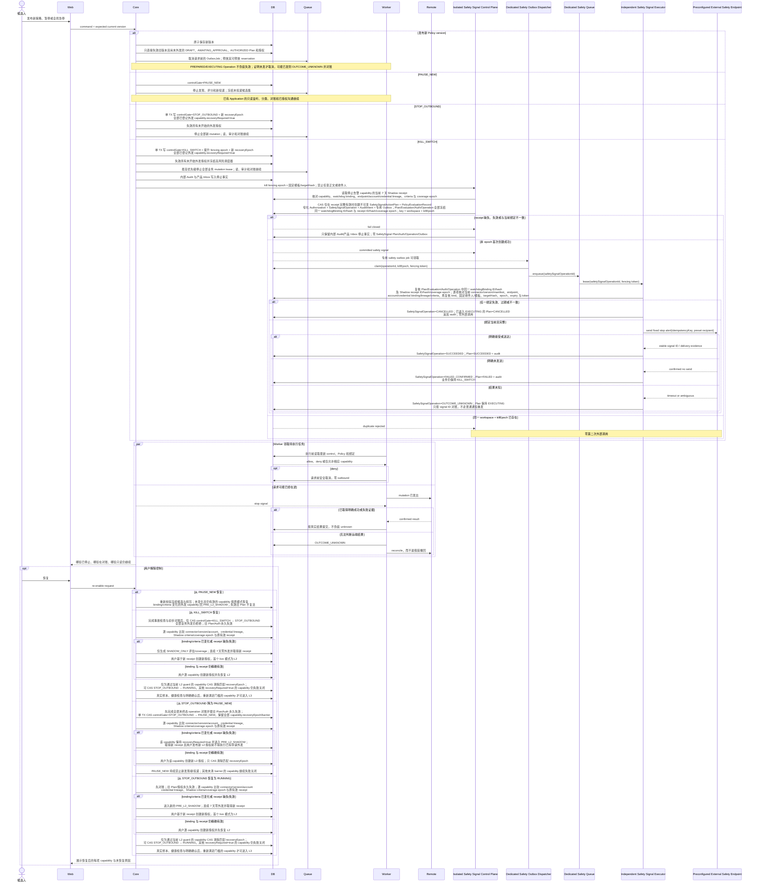
```mermaid
sequenceDiagram
    actor User as 候选人
    participant Web
    participant Core
    participant DB
    participant Queue
    participant Worker
    participant Remote
    participant Safety as Isolated Safety Signal Control Plane
    participant SafetyOutbox as Dedicated Safety Outbox Dispatcher
    participant SafetyQueue as Dedicated Safety Queue
    participant SafetyExecutor as Independent Safety Signal Executor
    participant Alert as Preconfigured External Safety Endpoint

    User->>Web: 发布新策略、暂停或全局急停
    Web->>Core: command + expected current version
    %% @anchor CONTROL_COMMAND_CLASSIFIED
    %% @anchor PAUSE_SCOPE_ENFORCED
    alt 发布新 Policy version
        Core->>DB: 原子保存新版本
        Core->>DB: 只直接失效旧版本且尚未外发的 DRAFT、AWAITING_APPROVAL、AUTHORIZED Plan 和授权
        Core->>Queue: 取消请求前的 OutboxJob；释放其可释放 reservation
        Note over Core,Worker: PREPARED/EXECUTING Operation 不伪装失效；证明未发才取消，可能已发则 OUTCOME_UNKNOWN 并对账
    else PAUSE_NEW
        Core->>DB: controlGate=PAUSE_NEW
        Core->>Queue: 停止发现、评分和新投递；冻结未投递候选集
        Note over Core,Worker: 已有 Application 的只读监听、分类、对账和已授权沟通继续
    else STOP_OUTBOUND
        Core->>DB: 单 TX 写 controlGate=STOP_OUTBOUND + 新 recoveryEpoch<br/>全部已登记外发 capability.recoveryRequired=true
        Core->>DB: 失效所有未开始的外发授权
        Core->>Queue: 停止全部新 mutation；读、审计和对账继续
    else KILL_SWITCH
        Core->>DB: 单 TX 写 controlGate=KILL_SWITCH + 提升 fencing epoch + 新 recoveryEpoch<br/>全部已登记外发 capability.recoveryRequired=true
        Core->>DB: 失效所有未开始外发授权并冻结高风险调度器
        Core->>Queue: 最高优先级停止全部业务 mutation lease；读、审计和对账继续
        Core->>DB: 内部 Audit 与产品 Inbox 写入停止事实
        Core->>Safety: kill fencing epoch + 固定模板/targetHash；禁止任意正文或收件人
        Safety->>DB: 读取停止告警 capability 的当前 7 天 Shadow receipt<br/>核对 capability、watchdog binding、endpoint/account/credential lineage、criteria 与 coverage epoch
        Safety->>DB: CAS 仅在 receipt 完整有效时创建不可变 SafetySignalActionPlan + PolicyEvaluationRecord<br/>窄化 Authorization + SafetySignalOperation + AuditIntent + 专用 Outbox；Plan/Evaluation/Auth/Operation 全部冻结<br/>同一 watchdogBinding ID/hash 与 receipt ID/hash/coverage epoch；key = workspace + killEpoch
        alt receipt 缺失、失效或与当前绑定不一致
            DB-->>Safety: fail closed
            Safety->>DB: 只保留内部 Audit/产品 Inbox 停止事实；零 SafetySignal Plan/Auth/Operation/Outbox
        else 本 epoch 首次创建成功
            DB-->>Safety: committed safety signal
            DB-->>SafetyOutbox: 专用 safety outbox job 可领取
            SafetyOutbox->>DB: claim(operationId, killEpoch, fencing token)
            SafetyOutbox->>SafetyQueue: enqueue(safetySignalOperationId)
            SafetyQueue->>SafetyExecutor: lease(safetySignalOperationId, fencing token)
            SafetyExecutor->>DB: 复核 Plan/Evaluation/Auth/Operation 中同一 watchdogBinding ID/hash<br/>及 Shadow receipt ID/hash/coverage epoch；逐项核对当前 connector/version/manifest、endpoint、<br/>account/credential binding/lineage/criteria，再复核 kind、固定收件人/模板、targetHash、epoch、expiry 与 token
            alt 任一绑定失效、过期或不一致
                SafetyExecutor->>DB: SafetySignalOperation=CANCELLED；已进入 EXECUTING 的 Plan=CANCELLED<br/>追加 audit；零外部调用
            else 绑定当前且完整
                SafetyExecutor->>Alert: send fixed stop alert(idempotencyKey, preset recipient)
                alt 明确接受或送达
                    Alert-->>SafetyExecutor: stable signal ID / delivery evidence
                    SafetyExecutor->>DB: SafetySignalOperation=SUCCEEDED；Plan=SUCCEEDED + audit
                else 明确未发送
                    Alert-->>SafetyExecutor: confirmed no send
                    SafetyExecutor->>DB: SafetySignalOperation=FAILED_CONFIRMED；Plan=FAILED + audit<br/>业务仍保持 KILL_SWITCH
                else 结果未知
                    Alert-->>SafetyExecutor: timeout or ambiguous
                    SafetyExecutor->>DB: SafetySignalOperation=OUTCOME_UNKNOWN；Plan 保持 EXECUTING<br/>只按 signal ID 对账，不走普通通知重发
                end
            end
        else 同一 workspace + killEpoch 已存在
            DB-->>Safety: duplicate rejected
            Note over Safety,Alert: 零第二次外部调用
        end
    end
    par Worker 领取待执行任务
        Worker->>DB: 执行前读取最新 control、Policy 和绑定
        DB-->>Worker: allow、deny 或仅允许相应 capability
        opt deny
            Worker->>DB: 请求前安全取消，零 outbound
        end
    and 请求可能已经在途
        Worker->>Remote: mutation 已发出
        Core-->>Worker: stop signal
        alt 已取得明确成功或失败证据
            Remote-->>Worker: confirmed result
            Worker->>DB: 按真实结果提交，不伪装 unknown
        else 无法判断远端结果
            Worker->>DB: OUTCOME_UNKNOWN
            Worker->>Remote: reconcile，而不是假装撤回
        end
    end
    Core-->>Web: 哪些已停止、哪些在对账、哪些只读仍继续
    opt 用户解除控制
        User->>Web: 恢复
        Web->>Core: re-enable request
        alt 从 PAUSE_NEW 恢复
            Core->>DB: 重新校验冻结候选与积压；未变化且仍有效的 capability 按原模式恢复<br/>binding/criteria 变化的外发 capability 回 PRE_L2_SHADOW；失效旧 Plan 不复活
        else 从 KILL_SWITCH 恢复
            Core->>DB: 完成事故检查与初步对账后，仅 CAS controlGate=KILL_SWITCH → STOP_OUTBOUND<br/>全部业务外发仍拒绝；旧 Plan/Auth 永久失效
            Core->>DB: 逐 capability 比较 connector/version/account、credential lineage、<br/>Shadow criteria/coverage epoch 与原有效 receipt
            alt binding/criteria 已变化或 receipt 缺失/失效
                Core->>DB: 仅生成 SHADOW_ONLY 评估/coverage；连续 7 天零外发并取得新 receipt
                Core->>DB: 用户基于新 receipt 创建新授权，首个 live 模式为 L2
            else binding 与 receipt 仍精确有效
                Core->>DB: 用户逐 capability 创建新授权并先恢复 L2
            end
            Core->>DB: 仅为通过当前 L2 guard 的 capability CAS 清除匹配 recoveryEpoch；<br/>可 CAS STOP_OUTBOUND → RUNNING，其他 recoveryRequired=true 的 capability 仍失败关闭
            Core->>DB: 真实样本、健康检查与明确确认后，重新满足门槛的 capability 才可进入 L3
        else 从 STOP_OUTBOUND 降为 PAUSE_NEW
            Core->>DB: 先完成全部未终态 operation 对账并使旧 Plan/Auth 永久失效；<br/>单 TX CAS controlGate=STOP_OUTBOUND → PAUSE_NEW，保留全部 capability.recoveryEpoch/barrier
            Core->>DB: 逐 capability 比较 connector/version/account、credential lineage、<br/>Shadow criteria/coverage epoch 与原有效 receipt
            alt binding/criteria 已变化或 receipt 缺失/失效
                Core->>DB: 该 capability 保持 recoveryRequired=true 并进入 PRE_L2_SHADOW；<br/>取得新 receipt 且用户发布新 L2 授权前不得执行已有申请外发
            else binding 与 receipt 仍精确有效
                Core->>DB: 用户为该 capability 创建新 L2 授权；只 CAS 清除匹配 recoveryEpoch
            end
            Core->>DB: PAUSE_NEW 持续禁止新发现/新投递；其他未清 barrier 的 capability 继续失败关闭
        else 从 STOP_OUTBOUND 恢复为 RUNNING
            Core->>DB: 先对账；旧 Plan/授权永久失效；逐 capability 比较 connector/version/account<br/>credential lineage、Shadow criteria/coverage epoch 与原有效 receipt
            alt binding/criteria 已变化或 receipt 缺失/失效
                Core->>DB: 进入新的 PRE_L2_SHADOW；连续 7 天零外发并取得新 receipt
                Core->>DB: 用户基于新 receipt 创建新授权，首个 live 模式为 L2
            else binding 与 receipt 仍精确有效
                Core->>DB: 用户逐 capability 创建新授权并先恢复 L2
            end
            Core->>DB: 仅为通过当前 L2 guard 的 capability CAS 清除匹配 recoveryEpoch；<br/>可 CAS STOP_OUTBOUND → RUNNING，其他 recoveryRequired=true 的 capability 仍失败关闭
            Core->>DB: 真实样本、健康检查与明确确认后，重新满足门槛的 capability 才可进入 L3
        end
        Core-->>Web: 展示恢复后的每项 capability 与未恢复原因
    end
```

## RF-UML-SEQ-MSG-01 Webhook、Polling、关联与安全回复


```mermaid
sequenceDiagram
    actor User as 候选人
    participant Mail as Mail Provider
    participant Inbox as Inbox Connector
    participant Worker as Inbox Worker
    participant DB as Message and Operation Store
    participant Security as Content and Identity Guard
    participant AI as Intent Classifier
    participant Core
    participant Policy
    participant Outbox
    participant Executor as Reply Executor

    par webhook delivery
        Mail->>Inbox: signed event
        Inbox->>Worker: normalized envelope(source=webhook)
    and polling delivery or page replay
        Worker->>Inbox: readInbox(cursor)
        Inbox-->>Worker: normalized envelope(source=poll)
    end
    %% @anchor MESSAGE_SOURCE_AUTH_PREFLIGHT
    Worker->>Security: canonical 写入前验证 source auth：webhook 原始 body 签名/keyId/audience<br/>trusted timestamp window、eventId/nonce；polling connector session/account/cursor binding
    Security->>DB: 只读比较 source-event replay index、provider revision 与绑定账户
    alt 签名/账户/来源无效、超时 replay、重复 eventId 或旧 provider event
        Security-->>Worker: reject/replay/stale
        Worker->>DB: 仅向隔离安全审计追加脱敏 event hash/reason；不写 Message/thread/domain 表
        Note over Worker,DB: 零 canonical Message/revision/processing job、Plan/Operation 或 outbound；假事件不能占唯一键
    else source authenticity 与时间窗验证通过
        Security-->>Worker: authenticated envelope + verified account/source metadata
        %% @anchor MESSAGE_DEDUP_CORRELATE
        %% @anchor MESSAGE_CANONICAL_INGEST
        Worker->>DB: TX INSERT canonical Message，唯一键=workspace+account+thread+externalId<br/>仅更高 providerRevision/orderKey CAS 推进 thread.currentRevision<br/>若为 INSERTED_CURRENT 同事务创建唯一 durable MessageProcessingJob
        DB-->>Worker: canonicalMessageId + canonicalRevision + currentThreadRevision<br/>outcome=INSERTED_CURRENT、DUPLICATE 或 STALE_NOT_CURRENT
        alt DUPLICATE：webhook/poll 或分页重放已存在
        %% @anchor MESSAGE_DUPLICATE_STALE_NOOP
        %% @anchor MESSAGE_WEBHOOK_POLL_SINGLETON
        Worker->>DB: 只追加脱敏 ingestion evidence/ack；不改 revision<br/>不取消或重建 canonical MessageProcessingJob
        Note over Worker,DB: duplicate delivery early no-op；原 durable processing job 仍可扫描/领取<br/>本次零 Security/AI/Plan/Authorization/Operation/Outbox、零回复或跟进
    else STALE_NOT_CURRENT：唯一旧消息晚到
        Worker->>DB: 保留 canonical Message 历史并标记 SUPERSEDED<br/>不回退 thread.currentRevision
        Note over Worker,DB: early no-op：旧问题不得进入 planner，零回复或跟进
    else INSERTED_CURRENT
        %% @anchor MESSAGE_SINGLE_PROCESSING_CLAIM
        Worker->>DB: CAS claim(canonicalMessageId, canonicalRevision)<br/>UNPROCESSED → PROCESSING，写 claimToken/fencingEpoch
        alt claim 已被 webhook/poll 的另一消费者取得，或 revision 已非 current
            DB-->>Worker: claim lost / stale
            Note over Worker,DB: 立即 ACK/no-op；不重复分类、建 Plan 或回复
        else 唯一 claim 成功
            DB-->>Worker: claimToken + currentThreadRevision
            %% @anchor SENDER_IDENTITY_GUARD
            Worker->>Security: 验签、sender、Reply-To、账户绑定、附件、URL 与注入检查
            alt 风险或身份异常
                Security-->>Worker: quarantine 或 human required
                Worker->>DB: CAS 当前 claim 写 Exception/安全事件；零自动回复
            else 通过
                Security-->>Worker: sanitized untrusted content
                %% @anchor APPLICATION_CORRELATION
                Worker->>DB: 以 workspace、账户、thread、外部引用和参与者关联唯一 Application
                alt 无法唯一关联
                    Worker->>DB: CAS 当前 claim 创建关联 Exception
                else 唯一关联
                    Worker->>DB: 读取 Application origin Campaign、当前唯一 CALIBRATING/ACTIVE Campaign<br/>及显式 CampaignApplicationTakeoverRecord，构造 BusinessCampaignExecutionBindingV01
                    break origin 已为 LISTENING/ENDED/ARCHIVED 且无当前有效 takeover，或无唯一活跃 Campaign
                        Worker->>DB: 只落盘入站事实并创建“需在当前 Campaign 显式接管”的 Exception<br/>标记本轮处理完成；零 AI planner、Plan、Authorization、Operation、Outbox 与回复
                    end
                    %% @anchor MESSAGE_CURRENT_REVISION_GATE
                    Worker->>DB: CAS 校验 canonicalRevision = thread.currentRevision<br/>且 claimToken/fencingEpoch 当前、无更新的 confirmed Message
                    alt 已出现更高 revision、claim 过期或乱序完成
                        DB-->>Worker: stale
                        Worker->>DB: 当前 Message 标记 SUPERSEDED；禁止 domain transition 与规划
                        Note over Worker,Core: 旧 revision 零 AI 决策、零 Plan/Operation、零回复或跟进
                    else revision 当前
                        DB-->>Worker: current revision fence
                        Worker->>AI: 最小化内容 + intent schema + canonicalRevision
                        AI-->>Worker: unknown intent result
                        Worker->>Core: schema、敏感问题和完整性校验
                        Note over Core,DB: 下列每个业务 TX 都 CAS 同一 canonicalRevision 与 claimToken；失败即 no-op/superseded
                        alt 申请确认或普通状态通知
                            Core->>DB: CAS 更新证据与活动；不回复，不制造 Exception
                        else 补充材料、表单或信息请求
                            Core->>DB: CAS 创建单问题 Exception；默认不自动披露新事实
                        else 面试邀请
                            Core->>DB: CAS 建立或更新 Interview PROPOSED；转约面 readiness
                        else 拒绝、no-contact 或岗位关闭
                            Core->>DB: CAS 停止跟进与自动回复；记录关闭事实
                        else 混合敏感、未知或低置信度
                            Core->>DB: CAS 整条消息进入 Exception
                        else 普通问题且答案有 Evidence 和预授权
                            Note over Core,Policy: AnswerPreauthorization 空集合表示全部禁止
                            Core->>DB: 单 TX CAS canonicalMessageId/revision、claimToken 与当前 active Campaign ID/revision/takeover；<br/>仅成功时保存回复草稿及绑定 BusinessCampaignExecutionBindingV01/hash 的不可变 send_reply ActionPlan
                            Note over Core,DB: 任一 CAS 失败只保留入站事实并创建需接管/重新规划 Exception；零 Plan/Auth/Operation/Outbox
                            Core->>Policy: evaluate(plan, current reply binding, preL2ShadowReceipt,<br/>BusinessCampaignExecutionBindingV01)
                            alt deny
                                Policy-->>Core: deny
                                Core->>DB: CAS 记录拒绝；零 Authorization 与 outbound
                            else allow
                                Policy-->>Core: policy authorization candidate
                                Core->>DB: TX CAS thread.currentRevision + active Campaign ID/revision/takeover + Plan/Policy/account/payload/expiry<br/>PolicyEvaluationRecord + Authorization + Operation + Reservation + AuditIntent + OutboxJob<br/>Plan/Evaluation/Auth/Operation 冻结同一回复 receipt ID/hash/coverage epoch 与 businessCampaignBindingHash
                            else require approval
                                Policy-->>Core: require approval
                                Core-->>User: 展示完整收件人、thread、问题、答案、证据、payload hash 与期限
                                User->>Core: 批准当前 canonicalRevision 与 hash
                                Core->>DB: CAS 复核消息/thread revision、Plan、Policy、账户、答案、期限<br/>及 active Campaign ID/revision/takeover/businessCampaignBindingHash
                                alt 任一绑定变化
                                    DB-->>Core: reject stale approval
                                    Core->>DB: 旧 Plan INVALIDATED；新建预览，零 OutboxJob
                                else 全部仍精确一致
                                    DB-->>Core: current
                                    Core->>DB: TX 再 guard active Campaign ID/revision/takeover + PolicyEvaluationRecord<br/>+ Authorization + Operation + Reservation + AuditIntent + OutboxJob；Plan/Evaluation/Auth/Operation<br/>冻结同一回复 receipt ID/hash/coverage epoch 与 businessCampaignBindingHash
                                end
                            end
                            opt reply Operation 已 durable 提交
                                Outbox->>Executor: dispatch(replyOperationId, canonicalRevision)
                                %% @anchor MESSAGE_REPLY_REVISION_RECHECK
                                Executor->>DB: 执行前 CAS 复核 Plan/Evaluation/Auth/Operation 的同一 receipt ID/hash/coverage epoch<br/>与当前回复 capability/connector/version/account/credential lineage/criteria 一致；再复核同一<br/>active Campaign ID/revision/takeover/businessCampaignBindingHash、thread.currentRevision、claim lineage、Policy/payload/expiry/control
                                alt 任一绑定变化或已有更新消息
                                    DB-->>Executor: stale / not executable
                                    Executor->>DB: Operation CANCELLED、已进入 EXECUTING 的 Plan CANCELLED<br/>记录 INVALIDATED 原因；零 Mail 调用
                                else 全部当前
                                    DB-->>Executor: executable
                                    Executor->>Mail: send reply with original idempotencyKey
                                end
                            end
                        end
                    end
                end
            end
        end
        end
    end
```

## RF-UML-SEQ-FUP-01 一次跟进与回复循环阻断

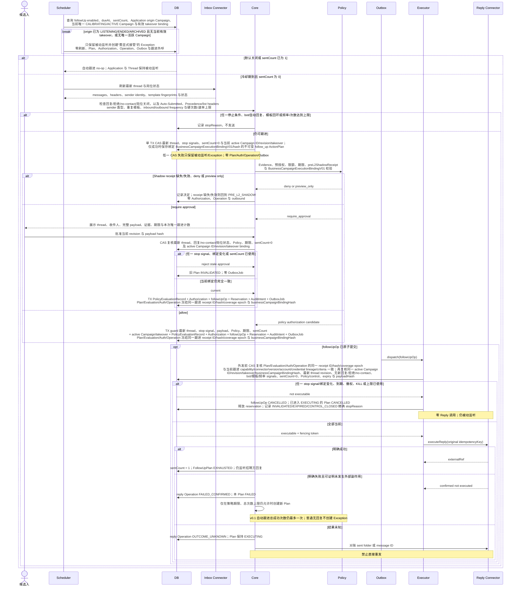
```mermaid
sequenceDiagram
    actor User as 候选人
    participant Scheduler
    participant DB
    participant Inbox as Inbox Connector
    participant Core
    participant Policy
    participant Outbox
    participant Executor
    participant Reply as Reply Connector

    Scheduler->>DB: 查询 followUp enabled、dueAt、sentCount、Application origin Campaign、<br/>当前唯一 CALIBRATING/ACTIVE Campaign 与有效 takeover binding
    break origin 已为 LISTENING/ENDED/ARCHIVED 且无当前有效 takeover，或无唯一活跃 Campaign
        Scheduler->>DB: 只保留被动监听并创建“需显式接管”的 Exception<br/>零刷新、Plan、Authorization、Operation、Outbox 与跟进外呼
    end
    alt 默认关闭或 sentCount 已为 1
        %% @anchor FOLLOWUP_ONCE
        DB-->>Scheduler: 自动跟进 no-op；Application 与 Thread 保持被动监听
    else 冷却期到且 sentCount 为 0
        Scheduler->>Inbox: 刷新最新 thread 与岗位状态
        Inbox-->>Scheduler: messages、headers、sender identity、template fingerprints 与状态
        %% @anchor FOLLOWUP_BOT_LOOP_GUARD
        Scheduler->>Core: 检查回复/拒绝/no-contact/岗位关闭，以及 Auto-Submitted、Precedence/list headers<br/>sender 类型、重复模板、inbound/outbound frequency 与硬次数/速率上限
        alt 任一停止条件、bot/自动回复、模板回环或频率/次数达到上限
            Core->>DB: 记录 stopReason，不发送
        else 仍可跟进
            Core->>DB: 单 TX CAS 最新 thread、stop signals、sentCount=0 与当前 active Campaign ID/revision/takeover；<br/>仅成功时保存绑定 BusinessCampaignExecutionBindingV01/hash 的不可变 follow_up ActionPlan
            Note over Core,DB: 任一 CAS 失败只保留被动监听/Exception；零 Plan/Auth/Operation/Outbox
            Core->>Policy: Evidence、预授权、限额、期限、preL2ShadowReceipt<br/>与 BusinessCampaignExecutionBindingV01 校验
            alt Shadow receipt 缺失/失效、deny 或 preview only
                Policy-->>Core: deny or preview_only
                Core->>DB: 记录决定；receipt 缺失/失效则回到 PRE_L2_SHADOW<br/>零 Authorization、Operation 与 outbound
            else require approval
                Policy-->>Core: require_approval
                Core-->>User: 展示 thread、收件人、完整 payload、证据、期限与本次唯一跟进计数
                User->>Core: 批准当前 revision 与 payload hash
                Core->>DB: CAS 复核最新 thread、回复/no-contact/岗位状态、Policy、期限、sentCount=0<br/>及 active Campaign ID/revision/takeover binding
                alt 任一 stop signal、绑定变化或 sentCount 已使用
                    DB-->>Core: reject stale approval
                    Core->>DB: 旧 Plan INVALIDATED；零 OutboxJob
                else 当前绑定仍完全一致
                    DB-->>Core: current
                    Core->>DB: TX PolicyEvaluationRecord + Authorization + followUpOp + Reservation + AuditIntent + OutboxJob<br/>Plan/Evaluation/Auth/Operation 冻结同一跟进 receipt ID/hash/coverage epoch 与 businessCampaignBindingHash
                end
            else allow
                Policy-->>Core: policy authorization candidate
                Core->>DB: TX guard 最新 thread、stop signal、payload、Policy、期限、sentCount<br/>+ active Campaign/takeover + PolicyEvaluationRecord + Authorization + followUpOp + Reservation + AuditIntent + OutboxJob<br/>Plan/Evaluation/Auth/Operation 冻结同一跟进 receipt ID/hash/coverage epoch 与 businessCampaignBindingHash
            end
            opt followUpOp 已原子提交
                Outbox->>Executor: dispatch(followUpOp)
                %% @anchor FOLLOWUP_EXECUTION_RECHECK
                Executor->>DB: 外发前 CAS 复核 Plan/Evaluation/Auth/Operation 的同一 receipt ID/hash/coverage epoch<br/>与当前跟进 capability/connector/version/account/credential lineage/criteria 一致；再复核同一 active Campaign<br/>ID/revision/takeover/businessCampaignBindingHash、最新 thread revision、无新回复/拒绝/no-contact、<br/>bot/模板/频率 signals、sentCount=0、Policy/control、expiry 与 payloadHash
                alt 任一 stop signal/绑定变化、到期、撤权、KILL 或上限已使用
                    DB-->>Executor: not executable
                    Executor->>DB: followUpOp CANCELLED；已进入 EXECUTING 的 Plan CANCELLED<br/>释放 reservation；记录 INVALIDATED/EXPIRED/CONTROL_CLOSED 精确 stopReason
                    Note over Executor,Reply: 零 Reply 调用；仍被动监听
                else 全部当前
                    DB-->>Executor: executable + fencing token
                    Executor->>Reply: executeReply(original idempotencyKey)
                    alt 明确成功
                        Reply-->>Executor: externalRef
                        Core->>DB: sentCount = 1；FollowUpPlan EXHAUSTED；仍监听招聘方回复
                    else 明确失败且可证明未发生外部副作用
                        Reply-->>Executor: confirmed not executed
                        Core->>DB: reply Operation FAILED_CONFIRMED；本 Plan FAILED
                        Core->>Core: 仅在策略期限、总次数上限仍允许时创建新 Plan
                        Note over Core,Policy: v0.1 自动跟进总成功次数仍最多一次；普通无回复不创建 Exception
                    else 结果未知
                        Core->>DB: reply Operation OUTCOME_UNKNOWN；Plan 保持 EXECUTING
                        Core->>Reply: 对账 sent folder 或 message ID
                        Note over Core,Reply: 禁止直接重发
                    end
                end
            end
        end
    end
```

## RF-UML-SEQ-INT-01 自动约面正常 Saga


```mermaid
sequenceDiagram
    %% @anchor INTERVIEW_DUAL_CONNECTOR_GUARD_CHAIN
    participant Inbox as Inbox Connector
    participant Worker
    participant Core as Interview Coordinator
    participant Policy
    participant DB as Ledger and Slot Lock
    participant Outbox
    participant Executor as Mutation Executor
    participant Cal as Calendar Connector
    participant Mail as Reply Connector
    participant Notify as Notification Service
    actor User as 候选人

    Inbox->>Worker: 唯一关联的面试邀请原文
    Worker->>Core: 提取候选 slot、时区、时长和未解决问题
    Core->>Core: 只接受唯一 UTC instant + IANA timezone
    Core->>DB: 读取 Application origin Campaign、当前唯一 CALIBRATING/ACTIVE Campaign<br/>与显式 takeover，构造 BusinessCampaignExecutionBindingV01
    break origin 已为 LISTENING/ENDED/ARCHIVED 且无当前有效 takeover，或无唯一活跃 Campaign
        Core->>DB: 只保存 Interview=PROPOSED 入站事实并创建“需显式接管”的 Exception<br/>零 availability query、Plan、Authorization、Operation、Outbox、Calendar/Reply 外呼
    end
    Core->>DB: CAS 复核 active Campaign ID/revision/takeover/businessCampaignBindingHash，<br/>并取得 Calendar 与 Reply 的 connectorId/version、accountId、credentialBindingId/lineage、<br/>manifestDigest、termsReviewVersion、grant revision及分别绑定两角色的有效 pre-L2 Shadow receipt
    %% @anchor INTERVIEW_DUAL_CONNECTOR_PREFLIGHT
    alt Campaign/takeover 已变化，或 Calendar/Reply 任一绑定/receipt 缺失、过期、撤权、变化，或不属于同一 Workspace/Plan candidate
        DB-->>Core: dual-binding preflight rejected + exact diff
        Core->>DB: 创建单问题 Exception；零 Plan/Authorization/Operation/Outbox
        Note over Cal,Mail: 零 Calendar 查询/写入与 Reply 调用；不得 fallback 到默认账号、凭证或 Connector 版本
    else 两组绑定与两份 receipt 完整且同时为当前版本
        DB-->>Core: immutable canonicalBindingSetHash + canonicalShadowReceiptSetHash + expiry
        Core->>Cal: checkAvailability(bound calendarAccountId/readCalendarIds/exact slot,<br/>expected calendar binding + canonicalBindingSetHash + canonicalShadowReceiptSetHash)
        Cal-->>Core: 同一账户 busy 并集、唯一 writeCalendarId、connector+version<br/>checkedAt snapshot + provider availabilityGuardToken/etag 能力
    Core->>DB: 单 TX CAS 当前 active Campaign ID/revision/takeover/businessCampaignBindingHash、<br/>availability snapshot/token 与 slot revision；仅成功时同时创建并相互绑定 InterviewScheduleReadiness、<br/>双 operation binding/Shadow receipt set 与冻结精确 slot snapshot 的不可变 ScheduleInterviewActionPlan
    alt Campaign/takeover 已变化、snapshot/slot 已 stale，或当前已有正式 reservation 冲突
        DB-->>Core: atomic schedule-plan preparation rejected + exact reason
        Core->>DB: 创建刷新/冲突/需接管 Exception；保持 Interview PROPOSED；零 reservation/Plan/Operation/Outbox
    else 原子取得带 expiry 的 readiness 与 Plan
        DB-->>Core: readinessId + planId + expiry；尚无 InterviewSlotReservation<br/>Plan 冻结 BusinessCampaignExecutionBindingV01/hash 与精确 slot snapshot
        %% @anchor INTERVIEW_READINESS
        Core->>Policy: evaluate(plan, readiness, control, current bindings, ScheduleShadowReceiptSetV01,<br/>BusinessCampaignExecutionBindingV01)
        %% @anchor CALENDAR_CAPABILITY_BUNDLE_L3_GATE
        Policy->>Policy: 校验 query/reconcile、幂等 conditional create、update/cancel、stable external ID<br/>Calendar+Reply connector/version/account/credential/grant、read/write calendars、授权版本<br/>两角色 pre-L2 Shadow receipts 与 canonical receipt-set hash、窗口、新鲜度、问题、限额与风险
        %% @anchor INTERVIEW_CONDITIONAL_CREATE_CAPABILITY
        alt Calendar capability bundle 任一项缺失，或 Provider 无条件创建/availability token
            Policy-->>Core: 该 Connector 的 L3 禁止；自动 Calendar mutation 与 unknown recovery 不安全
            Core->>DB: Plan CANCELLED(reason=CALENDAR_CAPABILITY_BUNDLE_INCOMPLETE)<br/>暂停该 scheduling L3；零 Reservation/Operation/Outbox
            Core-->>User: 降为 L2 用户控制的 Provider UI 步骤或人工交接<br/>不自动重试/删除；若有历史 unknown，仅展示候选 externalRefs 供人工裁决
        else deny、时间不唯一、问题未解决或 Connector 无法安全执行
            Policy-->>Core: deny with reason
            Core->>DB: Plan DENIED + Exception；保持 Interview=PROPOSED、Application=INTERVIEW_PROPOSED；<br/>零 Reservation/Operation/Outbox
        else L2 require approval 且 Connector 支持条件创建
            Policy-->>Core: require_approval
            Core-->>User: 展示精确时段/时区、写入与 busy 日历、回复正文<br/>两个外部动作、条件创建证据、风险、payload hash、期限和当前绑定
            User->>Core: approve current hash 或 reject
            alt 用户拒绝
                Core->>DB: Plan DENIED；零 Reservation/Operation/Outbox
            else 用户批准
                Core->>DB: CAS 复核 Plan、slot、read/write calendars、Calendar/Reply 各自完整 binding<br/>canonicalBindingSetHash、两角色 Shadow receipts/canonicalShadowReceiptSetHash、active Campaign<br/>ID/revision/takeover/businessCampaignBindingHash、Policy、control、expiry、payloadHash 与 conditional-create capability
                alt 任一绑定变化、过期或急停
                    DB-->>Core: stale approval rejected
                    Core->>DB: Plan INVALIDATED；创建单问题 Exception；零 Reservation/Operation/Outbox
                else 全部仍一致且 L2 Connector 可安全执行
                    Core->>DB: TX 再 guard active Campaign ID/revision/takeover、slot snapshot/唯一约束<br/>+ human ScheduleInterviewAuthorizationV01 + 两组授权 binding/Shadow receipt set<br/>+ businessCampaignBindingHash + 新建初始 InterviewSlotReservation + quotas<br/>+ calendarOp/replyOp QUEUED + AuditIntent + Saga OutboxJob
                end
            end
        else L3 且精确命中 SchedulePreauthorization、完整 Calendar L3 capability bundle
            Policy-->>Core: allow by current capability grant
            Core->>DB: TX CAS 当前 active Campaign ID/revision/takeover、slot snapshot/唯一约束<br/>+ ScheduleInterviewAuthorizationV01 + 两组授权 binding/Shadow receipt set<br/>+ businessCampaignBindingHash + 新建初始 InterviewSlotReservation + quotas<br/>+ calendarOp/replyOp QUEUED + AuditIntent + OutboxJob
        end
        Note over Core,DB: 任一授权 TX 的 Campaign/slot/唯一 reservation CAS 或任一写入失败时事务整体回滚；<br/>Plan INVALIDATED + 单问题 Exception，零 Reservation/Authorization/Operation/Outbox
        opt L2 或 L3 的 Saga 事务已原子提交
            DB-->>Core: committed(sagaId)
            Outbox->>DB: claim saga start
            Outbox->>Executor: dispatch(sagaId)
            %% @anchor INTERVIEW_CALENDAR_CHILD_RECHECK
            %% @anchor INTERVIEW_DUAL_CONNECTOR_EXECUTION_GUARD
            Executor->>DB: 任一 Calendar 调用前 CAS 同时复核 parent Plan/Authorization 的 canonicalBindingSetHash<br/>与 canonicalShadowReceiptSetHash；Calendar+Reply connectorId/version/accountId、credentialBindingId/lineage<br/>manifestDigest/terms/grant revision、各自 receipt ID/hash、active Campaign ID/revision/takeover/<br/>businessCampaignBindingHash、read/write calendars、control、expiry、payloadHash、slot reservation
            alt Calendar 或 Reply 任一绑定/receipt/set hash 变化、撤权、跨 Workspace、过期、KILL 或 reservation 丢失
                DB-->>Executor: not executable
                Executor->>DB: TX calendarOp CANCELLED + replyOp CANCELLED<br/>两子项终态后 parent ActionPlanRecord CANCELLED；释放 reservation/额度
                Executor->>DB: 创建单问题 Exception，记录精确 reason/diff<br/>过期或窗口失效必须回到新 L2 Plan 的人工确认
                Executor-->>User: 展示过期/撤权/绑定变化原因与重新确认入口
                Note over Executor,Cal: 零 free-busy、create 和 Mail 调用；无效 account/calendar 不得 fallback 到 Provider 默认值
            else calendar child bindings 当前
                DB-->>Executor: current + fencing token
                Executor->>Cal: 最终 free-busy(readCalendarIds, exact slot, expected connector version)
                alt fresh、free 且返回 provider availabilityGuardToken/etag
                    Cal-->>Executor: fresh snapshot + conditional-create token
                    Executor->>DB: 创建前再次 CAS 同时复核全部 Calendar+Reply bindings、canonicalBindingSetHash<br/>两角色 Shadow receipts/canonicalShadowReceiptSetHash、active Campaign ID/revision/takeover/<br/>businessCampaignBindingHash，以及 snapshot/token 新鲜度、payloadHash 与 fencing token
                    alt 二次复核失效
                        DB-->>Executor: stale
                        Executor->>DB: TX 两个 Operation CANCELLED；两子项终态后 parent Plan CANCELLED<br/>reason=STALE_BEFORE_CONDITIONAL_CREATE；释放 reservation/额度
                    else 二次复核通过
                        DB-->>Executor: executable
                        %% @anchor INTERVIEW_PROVIDER_CONDITIONAL_CREATE
                        Executor->>Cal: conditionalCreate 私有 tentative event<br/>ifMatch availabilityGuardToken/etag + original idempotencyKey
                        Note over Executor,Cal: 写入唯一 write calendar；无 recruiter attendee/邀请邮件；stable external ID 可对账/更新/取消
                        alt Calendar 明确成功
                            Cal-->>Executor: calendar externalRef + committed provider revision
                            Executor->>DB: TX calendarOp SUCCEEDED + externalRef + evidence
                            %% @anchor INTERVIEW_REPLY_CHILD_RECHECK
                            Executor->>DB: replyOp 外发前 CAS 同时复核 parent Plan/Authorization 的 canonicalBindingSetHash<br/>与 canonicalShadowReceiptSetHash；Calendar+Reply connectorId/version/accountId、credentialBindingId/lineage<br/>manifestDigest/terms/grant revision、各自 receipt ID/hash、active Campaign ID/revision/takeover/<br/>businessCampaignBindingHash、read/write calendars、calendarOp SUCCEEDED、control、expiry、payloadHash 与 fencing token
                            alt Calendar 或 Reply 任一 binding/receipt/set hash 变化、过期、撤权、跨 Workspace 或 KILL
                                DB-->>Executor: not executable
                                Executor->>DB: replyOp CANCELLED；parent Plan 保持 EXECUTING<br/>进入 RF-UML-SEQ-INT-02 补偿，零 Mail 调用
                            else reply child bindings 当前
                                DB-->>Executor: executable + fencing token
                                Executor->>Mail: 发送招聘确认回复(original idempotencyKey)
                                alt Reply 明确成功
                                    Mail-->>Executor: message externalRef
                                    Executor->>DB: TX replyOp SUCCEEDED + externalRef + evidence
                                    %% @anchor INTERVIEW_BOTH_SUCCEEDED
                                    %% @anchor INTERVIEW_PARENT_PLAN_CONVERGENCE
                                    Core->>DB: 读取 calendarOp/replyOp 两项 SUCCEEDED 终态事实<br/>TX parent Plan SUCCEEDED + Saga BOTH_SUCCEEDED + Interview SCHEDULED<br/>Application milestone INTERVIEW_SCHEDULED + notification intent
                                    DB-->>Notify: durable notification intent
                                    Notify->>DB: 产品 Inbox 写完整核心准备包入口与审计关联
                                    Notify-->>User: 默认 Email 仅发最小面试提醒 + 经认证本地视图链接；完整准备包不进邮件正文
                                else Reply 明确失败
                                    Mail-->>Executor: confirmed no send
                                    Executor->>DB: replyOp FAILED_CONFIRMED；parent Plan 保持 EXECUTING<br/>进入 RF-UML-SEQ-INT-02 的强制取消补偿
                                else Reply 结果未知
                                    Mail-->>Executor: timeout or ambiguous
                                    Executor->>DB: replyOp OUTCOME_UNKNOWN；parent Plan 保持 EXECUTING/RECONCILING<br/>禁止重发，进入 RF-UML-SEQ-INT-02 对账
                                end
                            end
                        else provider conditional precondition 冲突
                            Cal-->>Executor: precondition failed，证明未创建
                            Executor->>DB: TX calendarOp FAILED_CONFIRMED + replyOp CANCELLED<br/>两子项终态后 parent Plan FAILED；释放 slot/额度
                            Executor->>DB: 创建冲突 Exception；零招聘回复
                        else Calendar 明确失败且证明未创建
                            Cal-->>Executor: confirmed no create
                            Executor->>DB: TX calendarOp FAILED_CONFIRMED + replyOp CANCELLED<br/>两子项终态后 parent Plan FAILED；释放 reservation/额度
                            Executor->>DB: Provider failure Exception；零招聘回复；重计划必须重新取证/授权
                        else Calendar 结果未知
                            Cal-->>Executor: timeout or ambiguous
                            Executor->>DB: calendarOp OUTCOME_UNKNOWN；replyOp 保持 QUEUED 但不可派发<br/>parent Plan EXECUTING/RECONCILING；进入 RF-UML-SEQ-INT-02 对账
                        end
                    end
                else free-busy 明确冲突
                    Cal-->>Executor: busy
                    Executor->>DB: TX calendarOp CANCELLED + replyOp CANCELLED<br/>两子项终态后 parent Plan CANCELLED，reason=SLOT_CONFLICT_BEFORE_REQUEST；释放 slot/额度
                    Executor->>DB: 创建冲突 Exception；零招聘回复、零日历 mutation
                else 快照过期或读取未知
                    Cal-->>Executor: stale or unknown
                    Executor->>DB: TX 两个 Operation CANCELLED；两子项终态后 parent Plan CANCELLED<br/>reason=READINESS_STALE_BEFORE_REQUEST；释放 reservation/额度
                    Executor->>DB: 创建重新获取/人工处理 Exception；零 mutation
                else runtime 缺少或撤销 conditional-create capability/token
                    Cal-->>Executor: capability unavailable
                    Executor->>DB: TX 两个 Operation CANCELLED；两子项终态后 parent Plan CANCELLED<br/>暂停自动约面 capability；释放 reservation/额度
                    Executor-->>User: 降为新的 L2 用户控制步骤或人工交接；当前 Plan 零 mutation
                end
            end
        end
    end
    end
```

`INTERVIEW_DUAL_CONNECTOR_GUARD_CHAIN` 覆盖三道不可省略的门：第一次 Calendar 查询前、Calendar mutation 前、Reply mutation 前。三道门都以同一 `canonicalBindingSetHash` 与 `canonicalShadowReceiptSetHash` 为父级事实，并逐项复核 Reply/Calendar 两个具名 child 的 connector/version/account、credential binding/lineage、manifest/terms/grant、payload 与各自 pre-L2 Shadow receipt。任一道失败都在对应外部调用前停止；第一次门失败必须保证 Calendar 与 Reply 两侧调用都为 0，Calendar 已成功后 Reply 门失败则只能进入有授权的取消补偿。

## RF-UML-SEQ-INT-02 约面部分成功、未知与补偿


```mermaid
sequenceDiagram
    participant Core as Interview Coordinator
    participant DB as Saga Ledger
    participant Policy
    participant Outbox
    participant Executor
    participant Cal as Calendar Connector
    participant Mail as Reply Connector
    participant Notify
    participant Human as 候选人

    Core->>DB: 分别读取已 durable 保存的 calendarOp 与 replyOp 结果
    %% @anchor INTERVIEW_PARTIAL_COMPENSATE
    opt calendarOp OUTCOME_UNKNOWN 且 replyOp 尚未派发
        Core->>Cal: 按 idempotencyKey、stable external ID 与严格指纹对账
        Cal-->>Core: 唯一成功、可证明未执行或仍有歧义
        alt 找到唯一匹配 event
            Core->>DB: calendarOp SUCCEEDED + externalRef + evidence；replyOp 仍不可派发
        else 可证明未执行
            Core->>DB: calendarOp FAILED_CONFIRMED；replyOp CANCELLED；释放 reservation
        else 零个/多个候选且无法唯一裁决
            Core->>DB: calendarOp 保持 OUTCOME_UNKNOWN；Saga RECONCILING + SEV-1 Exception
            Notify-->>Human: 日历结果仍未知；招聘确认从未发送，需要人工核对
        end
        Core->>DB: 重新读取收敛后的两个 operation 事实
    end
    alt 两项均明确成功
        %% @anchor INTERVIEW_PARENT_PLAN_TERMINAL_FACTS
        Core->>DB: 读取两项 SUCCEEDED 终态事实后 TX parent Plan SUCCEEDED<br/>Saga BOTH_SUCCEEDED；Interview SCHEDULED；Application milestone INTERVIEW_SCHEDULED
    else calendar FAILED_CONFIRMED 且 reply 从未派发
        Core->>DB: 先把 replyOp 收敛 CANCELLED，再 TX parent Plan FAILED<br/>Saga SAFE_TO_REPLAN；保持 Interview PROPOSED；释放 slot/额度
    else calendar SUCCEEDED 且 reply QUEUED、尚未派发
        %% @anchor INTERVIEW_RECOVERY_REPLY_RECHECK
        Core->>Policy: execution-time recheck 原 parent Plan/Authorization 的 canonicalBindingSetHash<br/>与 canonicalShadowReceiptSetHash；Calendar+Reply connectorId/version/accountId、credentialBindingId/lineage<br/>manifestDigest/terms/grant revision、各自 receipt ID/hash、active Campaign ID/revision/takeover/<br/>businessCampaignBindingHash、read/write calendars、control、expiry 与 payloadHash
        alt 现有 replyOp 仍获准且全部绑定当前
            Policy-->>Core: executable
            Outbox->>Executor: dispatch(existing replyOp；不是重试或新 operation)
            Executor->>DB: CAS 再验两角色完整 binding/receipt、父 binding-set/receipt-set hash、<br/>active Campaign ID/revision/takeover/businessCampaignBindingHash、calendarOp SUCCEEDED、<br/>control/expiry/payloadHash 与 fencing token
            DB-->>Executor: executable
            Executor->>Mail: 发送招聘确认
            alt Reply 明确成功
                Mail-->>Executor: message externalRef
                Executor->>DB: replyOp SUCCEEDED + evidence
                Core->>DB: 读取两项 SUCCEEDED 后 TX parent Plan SUCCEEDED<br/>Saga BOTH_SUCCEEDED；Interview SCHEDULED；Application milestone INTERVIEW_SCHEDULED
            else Reply 明确失败
                Mail-->>Executor: confirmed no send
                Executor->>DB: replyOp FAILED_CONFIRMED；resumePoint=INTERVIEW_PARTIAL_COMPENSATE
            else Reply 结果未知
                Mail-->>Executor: timeout or ambiguous
                Executor->>DB: replyOp OUTCOME_UNKNOWN；resumePoint=INTERVIEW_PARTIAL_COMPENSATE；禁止重发
            end
        else denied、过期、KILL 或任一绑定已变化
            Policy-->>Core: not executable
            Core->>DB: replyOp CANCELLED；resumePoint=INTERVIEW_PARTIAL_COMPENSATE；零招聘回复
        end
        Note over Core,DB: 非成功分支 durable 提交后由 Coordinator 重入下方补偿分支，不复用旧执行结果
    else calendar SUCCEEDED 且 reply FAILED_CONFIRMED、OUTCOME_UNKNOWN 或 CANCELLED
        Core->>DB: Saga PARTIAL 或 RECONCILING；保持 Interview PROPOSED
        Core->>DB: 创建排期异常并保留 calendarRef；未知结果先对账
        Notify-->>Human: 日历已写入但招聘确认未证实
        opt reply 为 OUTCOME_UNKNOWN
            Core->>Mail: reconcile sent folder、provider ID、thread fingerprint
            Mail-->>Core: success、proven absent 或 ambiguous
            alt 找到唯一已发送消息
                Core->>DB: replyOp SUCCEEDED + externalRef + evidence
                Core->>DB: 读取两项 SUCCEEDED 终态事实后 parent Plan SUCCEEDED<br/>Saga BOTH_SUCCEEDED；Interview SCHEDULED；Application milestone INTERVIEW_SCHEDULED
            else 可证明未发送
                Core->>DB: replyOp FAILED_CONFIRMED + evidence
            else 仍有歧义
                Core->>DB: replyOp 保持 OUTCOME_UNKNOWN；Saga RECONCILING；禁止直接重发
            end
        end
        opt reply 明确失败、被当前控制取消或对账证明未发送
            Note over Core,DB: 原 calendarOp 永久保持 SUCCEEDED
            Core->>DB: 创建新的 cancel_calendar_event ActionPlan，冻结 originalSagaId、parentSchedulePlanId/hash、<br/>originalScheduleAuthorizationId/hash、compensatesOperationId 与原 businessCampaignBindingHash<br/>上述 Campaign hash 仅作审计，不要求当前 active Campaign/takeover
            Core->>Policy: 评估预先要求的补偿授权与父 ScheduleShadowReceiptSetV01 中的 Calendar receipt<br/>该 receipt 必须仍绑定当前 Calendar child，并已覆盖 create/cancel bundle
            alt 补偿授权当前、未过期且 KILL 未阻止执行
                Policy-->>Core: executable
                Core->>DB: TX 新 PolicyEvaluationRecord + Authorization + compensationOp QUEUED + AuditIntent + OutboxJob<br/>compensation Plan/Evaluation/Auth/Operation 逐层复制 originalSagaId、parent Schedule Plan/Auth ID+hash、<br/>compensatesOperationId、父 receipt-set 中 Calendar receipt ID/hash/coverage epoch<br/>及 originalBusinessCampaignBindingHash（auditOnly，不要求当前 Campaign/takeover）
                Outbox->>Executor: dispatch(compensationOp)
                %% @anchor INTERVIEW_COMPENSATION_CHILD_RECHECK
                Executor->>DB: 补偿外发前 CAS 复核 compensation Plan/Evaluation/Auth/Operation 的 originalSagaId、<br/>parent Schedule Plan/Auth ID+hash 与原 immutable ledger 精确一致；再复核 receipt ID/hash/coverage epoch<br/>与父 receipt-set 的 Calendar receipt 及当前 calendar binding 一致，以及原 calendarOp/eventRef、<br/>compensatesOperationId、原 businessCampaignBindingHash、calendarAccountId、connector+version、<br/>read/write calendars、control、expiry、payloadHash 与 fencing token；不以当前 Campaign/takeover 代替原补偿因果
                alt 任一绑定变化、过期或 KILL
                    DB-->>Executor: not executable
                    Core->>DB: compensationOp CANCELLED + compensation Plan CANCELLED<br/>读取原 calendar/reply 终态后 parent schedule Plan FAILED<br/>Saga MANUAL_HANDOFF + SEV-1 Exception；零 Cal 调用
                    Core->>DB: 暂停 scheduling capability；保留 eventRef 与拒绝原因
                    Notify-->>Human: 自动取消未获当前授权；请人工处理候选人日历事件
                else 补偿绑定当前
                    DB-->>Executor: executable
                    Executor->>Cal: conditionalCancel(eventRef, expected provider revision, original idempotencyKey)
                    Cal-->>Executor: confirmed cancelled、confirmed still present/conflict 或 unknown
                    alt 取消明确成功
                        Core->>DB: compensationOp SUCCEEDED + compensation Plan SUCCEEDED<br/>读取 calendarOp SUCCEEDED/replyOp FAILED_CONFIRMED或CANCELLED 后 parent schedule Plan FAILED<br/>Saga COMPENSATED；释放 slot/额度；原 operation 不改写
                    else 明确未取消或 provider revision 冲突
                        Core->>DB: compensationOp FAILED_CONFIRMED + compensation Plan FAILED<br/>读取原两 child 终态后 parent schedule Plan FAILED<br/>Saga MANUAL_HANDOFF + SEV-1 Exception
                        Core->>DB: 暂停 scheduling capability；保留全部 externalRef/provider revision
                        Notify-->>Human: 需要人工处理候选人日历事件
                    else 取消结果未知
                        Core->>DB: compensationOp OUTCOME_UNKNOWN；两个 parent Plan 保持 EXECUTING/RECONCILING
                        Core->>Cal: 只读 reconcile cancellation by eventRef/provider revision
                        alt 唯一证明已取消
                            Cal-->>Core: absent/cancelled evidence
                            Core->>DB: compensationOp SUCCEEDED + compensation Plan SUCCEEDED<br/>parent schedule Plan FAILED；Saga COMPENSATED；释放 slot/额度
                        else 唯一证明仍存在且本次未取消
                            Cal-->>Core: current event evidence
                            Core->>DB: compensationOp FAILED_CONFIRMED + compensation Plan FAILED<br/>parent schedule Plan FAILED；Saga MANUAL_HANDOFF + SEV-1 Exception
                            Core->>DB: 暂停 scheduling capability；保留全部 externalRef
                        else 仍有歧义
                            Cal-->>Core: ambiguous
                            Core->>DB: compensationOp 保持 OUTCOME_UNKNOWN；parent Plans 不伪造终态<br/>Saga MANUAL_HANDOFF + SEV-1 Exception；暂停 scheduling capability
                        end
                        Notify-->>Human: 需要人工核对候选人日历事件
                    end
                end
            else denied、过期、绑定变化或 KILL 生效
                Policy-->>Core: not executable
                Core->>DB: compensation Plan CANCELLED；零 compensation Operation/Outbox<br/>读取原 calendar/reply 终态后 parent schedule Plan FAILED<br/>Saga MANUAL_HANDOFF + SEV-1 Exception
                Core->>DB: 暂停 scheduling capability；保留 eventRef 与拒绝原因
                Notify-->>Human: 自动取消未获当前授权；请人工处理候选人日历事件
            end
        end
    else legacy/import/corrupt 状态出现 reply SUCCEEDED 且 calendar FAILED_CONFIRMED 或 OUTCOME_UNKNOWN
        alt calendar 已明确 FAILED_CONFIRMED
            Core->>DB: Saga MANUAL_HANDOFF；保持 Interview PROPOSED；保留 messageRef
            Core->>DB: 创建 SEV-1 Exception，暂停 scheduling capability
            Notify-->>Human: 招聘回复已发出但日历明确未创建；请人工协调且不要重发邮件
        else calendar 为 OUTCOME_UNKNOWN
            Core->>DB: Saga RECONCILING；保持 Interview PROPOSED；保留 messageRef
            Core->>Cal: reconcile event by idempotencyKey and fingerprint
            Cal-->>Core: success、proven absent 或 ambiguous
            alt 找到唯一 event 且 slot、账户与当前绑定可验证
                Core->>DB: calendarOp SUCCEEDED + externalRef + evidence
                Core->>DB: 读取两项 SUCCEEDED 后 parent Plan SUCCEEDED<br/>Saga BOTH_SUCCEEDED；Interview SCHEDULED；Application milestone INTERVIEW_SCHEDULED
            else 可证明未创建
                Core->>DB: calendarOp FAILED_CONFIRMED；读取两项终态后 parent Plan FAILED<br/>Saga MANUAL_HANDOFF + SEV-1 Exception；暂停 scheduling capability；保留已发送 messageRef
                Notify-->>Human: 日历未创建；请人工协调且不要重发邮件
            else 零个/多个候选且无法唯一裁决
                Core->>DB: calendarOp 保持 OUTCOME_UNKNOWN；Saga MANUAL_HANDOFF + SEV-1 Exception<br/>暂停 scheduling capability；保留全部候选 externalRef
                Notify-->>Human: 日历结果仍有歧义；请人工核对且不要重发邮件
            end
        end
        Note over Core,Human: 新 calendar-first 流程不得产生此顺序；只读对账可在两侧唯一成功且绑定可验证时记录真实结果，否则人工；绝不自动补建或重发
    else 任一结果仍无法唯一判断
        Core->>DB: Saga RECONCILING + SEV-1 Exception
        Core->>Cal: reconcile calendarOp
        Core->>Mail: reconcile replyOp
        Note over Core,Human: 长期歧义进入 MANUAL_REVIEW；不进入 SCHEDULED，不重放已成功子操作
    end
```

正常 v0.1 Saga 固定 calendar-first；对称的“reply 成功、calendar 失败”只用于导入历史、损坏状态或旧版本恢复测试，不是新流程合法分支。Calendar Connector 只有支持查询/对账、幂等创建、更新/取消和稳定 external ID 才能进入 L3；否则只能停留在 L2 或人工交接。

## RF-UML-SEQ-INT-CHANGE-01 已排面试的改期、取消与乱序事件

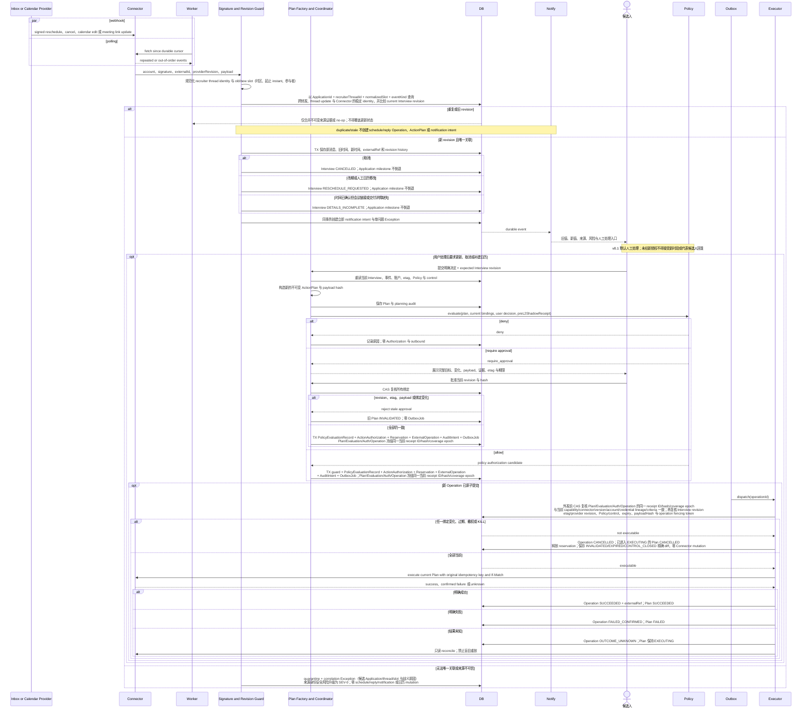
```mermaid
sequenceDiagram
    participant Provider as Inbox or Calendar Provider
    participant Connector
    participant Worker
    participant Guard as Signature and Revision Guard
    participant Core as Plan Factory and Coordinator
    participant DB
    participant Notify
    actor User as 候选人
    participant Policy
    participant Outbox
    participant Executor

    par webhook
        Provider->>Connector: signed reschedule、cancel、calendar edit 或 meeting link update
    and polling
        Worker->>Connector: fetch since durable cursor
        Connector-->>Worker: repeated or out-of-order events
    end
    Connector->>Guard: account、signature、externalId、providerRevision、payload
    Guard->>Guard: 规范化 recruiter thread identity 与 old/new slot（时区、起止 instant、参与者）
    %% @anchor INTERVIEW_CHANGE_IDEMPOTENT_IDENTITY
    Guard->>DB: 以 ApplicationId + recruiterThreadId + normalizedSlot + eventKind 查询<br/>跨转发、thread update 与 Connector 的稳定 identity，并比较 current Interview revision
    %% @anchor INTERVIEW_CHANGE_DETECTED
    alt 重复或旧 revision
        DB-->>Worker: 仅合并不可变来源证据或 no-op；不得覆盖更新状态
        Note over Guard,Notify: duplicate/stale 不创建 schedule/reply Operation、ActionPlan 或 notification intent
    else 新 revision 且唯一关联
        Guard->>DB: TX 保存原消息、旧时间、新时间、externalRef 和 revision history
        alt 取消
            Guard->>DB: Interview CANCELLED；Application milestone 不倒退
        else 改期或人工日历修改
            Guard->>DB: Interview RESCHEDULE_REQUESTED；Application milestone 不倒退
        else 时间已确认但会议链接或交付详情缺失
            Guard->>DB: Interview DETAILS_INCOMPLETE；Application milestone 不倒退
        end
        Guard->>DB: 同事务创建立即 notification intent 与单问题 Exception
        DB-->>Notify: durable event
        Notify-->>User: 旧值、新值、来源、风险与人工处理入口
        Note over User,Policy: v0.1 默认人工处理；未经新授权不得接受新时段或代表候选人回复
        opt 用户处理后要求更新、取消或补建日历
            User->>Core: 提交明确决定 + expected Interview revision
            Core->>DB: 重读当前 Interview、事件、账户、etag、Policy 与 control
            Core->>Core: 构造新的不可变 ActionPlan 与 payload hash
            Core->>DB: 保存 Plan 与 planning audit
            Core->>Policy: evaluate(plan, current bindings, user decision, preL2ShadowReceipt)
            alt deny
                Policy-->>Core: deny
                Core->>DB: 记录原因；零 Authorization 与 outbound
            else require approval
                Policy-->>Core: require_approval
                Core-->>User: 展示完整目标、变化、payload、证据、etag 与期限
                User->>Core: 批准当前 revision 与 hash
                Core->>DB: CAS 复核所有绑定
                alt revision、etag、payload 或绑定变化
                    DB-->>Core: reject stale approval
                    Core->>DB: 旧 Plan INVALIDATED；零 OutboxJob
                else 全部仍一致
                    Core->>DB: TX PolicyEvaluationRecord + ActionAuthorization + Reservation + ExternalOperation + AuditIntent + OutboxJob<br/>Plan/Evaluation/Auth/Operation 冻结同一当前 receipt ID/hash/coverage epoch
                end
            else allow
                Policy-->>Core: policy authorization candidate
                Core->>DB: TX guard + PolicyEvaluationRecord + ActionAuthorization + Reservation + ExternalOperation<br/>+ AuditIntent + OutboxJob；Plan/Evaluation/Auth/Operation 冻结同一当前 receipt ID/hash/coverage epoch
            end
            opt 新 Operation 已原子提交
                Outbox->>Executor: dispatch(operationId)
                %% @anchor INTERVIEW_CHANGE_EXECUTION_RECHECK
                Executor->>DB: 外发前 CAS 复核 Plan/Evaluation/Auth/Operation 的同一 receipt ID/hash/coverage epoch<br/>与当前 capability/connector/version/account/credential lineage/criteria 一致；再复核 Interview revision<br/>etag/provider revision、Policy/control、expiry、payloadHash 与 operation fencing token
                alt 任一绑定变化、过期、撤权或 KILL
                    DB-->>Executor: not executable
                    Executor->>DB: Operation CANCELLED；已进入 EXECUTING 的 Plan CANCELLED<br/>释放 reservation；保存 INVALIDATED/EXPIRED/CONTROL_CLOSED 精确 diff，零 Connector mutation
                else 全部当前
                    DB-->>Executor: executable
                    Executor->>Connector: execute current Plan with original idempotency key and If-Match
                    Connector-->>Executor: success、confirmed failure 或 unknown
                    alt 明确成功
                        Executor->>DB: Operation SUCCEEDED + externalRef；Plan SUCCEEDED
                    else 明确失败
                        Executor->>DB: Operation FAILED_CONFIRMED；Plan FAILED
                    else 结果未知
                        Executor->>DB: Operation OUTCOME_UNKNOWN；Plan 保持 EXECUTING
                        Executor->>Connector: 只读 reconcile；禁止盲目重放
                    end
                end
            end
        end
    else 无法唯一关联或来源不可信
        Guard->>DB: quarantine + correlation Exception（候选 Application/thread/slot 与歧义原因）<br/>来源身份安全风险升级为 SEV-0；零 schedule/reply/notification 或日历 mutation
    end
```

## RF-UML-SEQ-NOT-01 面试、安全与运行状态通知


```mermaid
sequenceDiagram
    participant Domain as Domain Event Publisher
    participant DB
    participant Notify as Notification Service
    participant Policy
    participant Outbox
    participant Executor
    participant Primary as 默认外部通知：Email
    participant InboxUI as 产品内 Inbox
    participant Fallback as 可选 Webhook / P1 必需备用渠道
    actor User as 候选人

    %% @anchor NOTIFICATION_FALLBACK
    Domain->>DB: 保存业务事实与 notification intent 同一提交边界
    DB-->>Notify: durable event + dedupeKey
    %% @anchor ALERT_AGGREGATION_QUIET_HOURS
    Notify->>DB: TX 以 rootCause + workspace + timeWindow 聚合并计算最高 SEV-0..SEV-3
    Notify->>DB: Notification PENDING → INBOX_PERSISTED；更新产品内持久投影
    DB-->>InboxUI: 可恢复的 canonical 通知事实
    InboxUI-->>User: 当前面试、安全或运行状态
    alt 同根因已存在活动通知
        Notify->>DB: 只增加 count、更新时间和最新证据；不创建重复外发
    else SEV-3
        Notify->>DB: COMPLETE_INBOX_ONLY；只保留 Inbox/活动事实
    else SEV-2
        Notify->>DB: 原 Notification 保持 INBOX_PERSISTED；写 digestGroupKey 和 deliveryMode=DAILY
        opt 到达用户时区的每日 cutoff 且摘要非空
            Notify->>DB: TX 创建新的摘要 Notification PENDING + 成员引用<br/>原成员转 COMPLETE_INBOX_ONLY 并记录 aggregatedInto
            Notify->>DB: 摘要 Notification PENDING → INBOX_PERSISTED
            Notify->>DB: 创建不可变 notification_primary ActionPlan，绑定摘要 Notification
            Notify->>Policy: evaluate(digest plan, accepted email grant, control, current recipient, notification preL2ShadowReceipt)
            alt grant 当前且允许
                Policy-->>Notify: policy authorization candidate
                Notify->>DB: TX PolicyEvaluationRecord + ActionAuthorization + digest NotificationOperation QUEUED<br/>+ AuditIntent + OutboxJob；Plan/Evaluation/Auth/Operation 冻结同一通知 receipt ID/hash/coverage epoch
                Notify->>DB: 摘要 Notification SENDING
                Outbox->>Executor: dispatch(digestOperationId)
                %% @anchor NOTIFICATION_EXECUTION_RECHECK
                Executor->>DB: 外发前 CAS 复核 digest Plan/Evaluation/Auth/Operation 的同一 receipt ID/hash/coverage epoch<br/>与当前通知 capability/connector/version/account/credential lineage/criteria 一致；再复核 Notification revision<br/>severity、recipient、grant/control、expiry、payloadHash、budget 与 fencing token
                alt 任一绑定变化、过期、撤权、KILL 或预算已不可用
                    DB-->>Executor: not executable
                    Executor->>DB: digest operation CANCELLED；已进入 EXECUTING 的 Plan CANCELLED<br/>摘要 Notification SENDING → UNDELIVERED，记录 INVALIDATED/EXPIRED/CONTROL_CLOSED 原因；零 Primary 调用
                else 全部当前
                    DB-->>Executor: executable
                    Executor->>Primary: send daily digest(original idempotencyKey)
                    alt 明确接受或送达
                        Primary-->>Executor: accepted or delivered evidence
                        Executor->>DB: digest operation SUCCEEDED；摘要 Notification ACCEPTED/DELIVERED
                    else 明确未发送
                        Primary-->>Executor: confirmed no send
                        Executor->>DB: digest operation FAILED_CONFIRMED
                        alt 可重试且预算/期限仍剩余
                            Notify->>DB: 摘要 Notification SENDING → FAILED_RETRYABLE
                        else 不可重试或预算/期限耗尽
                            Notify->>DB: 摘要 Notification SENDING → UNDELIVERED<br/>只在已确认不可重试或 operation 创建前预算已耗尽时直达
                        end
                    else 结果未知
                        Primary-->>Executor: timeout or ambiguous
                        Executor->>DB: digest operation OUTCOME_UNKNOWN；摘要 Notification OUTCOME_UNKNOWN
                        Executor->>DB: digest operation OUTCOME_UNKNOWN → RECONCILING<br/>摘要 Notification OUTCOME_UNKNOWN → RECONCILING
                        Executor->>Primary: 只读对账；禁止盲重发
                        alt 找到唯一发送/送达记录
                            Primary-->>Executor: accepted/delivered evidence
                            Executor->>DB: operation SUCCEEDED；Notification ACCEPTED/DELIVERED
                        else 证明未发送且无安全重试
                            Primary-->>Executor: proven absent
                            Executor->>DB: operation FAILED_CONFIRMED；Notification UNDELIVERED
                        else 仍有歧义
                            Primary-->>Executor: ambiguous
                            Executor->>DB: operation MANUAL_REVIEW；Notification MANUAL_REVIEW
                        end
                    end
                end
            else grant 失效、控制禁止或收件人变化
                Policy-->>Notify: not executable
                Notify->>DB: 零外部 Operation；摘要 Notification COMPLETE_INBOX_ONLY
            end
        end
    else SEV-0/SEV-1
        Notify->>DB: 系统安全规则要求立即处理并绕过 quiet hours
        Notify->>DB: 创建不可变 notification_primary ActionPlan，绑定事件、渠道、收件人、payload hash 与期限
        Notify->>Policy: evaluate(plan, accepted channel grant, control, severity, notification preL2ShadowReceipt)
        alt deny、grant 失效或只允许 preview
            Policy-->>Notify: not executable
            Notify->>DB: 零 ExternalOperation；Notification COMPLETE_INBOX_ONLY 并记录原因
        else allow
            Policy-->>Notify: policy authorization candidate
            Notify->>DB: TX PolicyEvaluationRecord + ActionAuthorization + primary NotificationOperation QUEUED<br/>+ AuditIntent + OutboxJob；Plan/Evaluation/Auth/Operation 冻结同一通知 receipt ID/hash/coverage epoch
            Notify->>DB: Notification SENDING
            Outbox->>Executor: dispatch(primaryOperationId)
            Executor->>DB: 外发前 CAS 复核 primary Plan/Evaluation/Auth/Operation 的同一 receipt ID/hash/coverage epoch<br/>与当前通知 capability/connector/version/account/credential lineage/criteria 一致；再复核 Notification revision<br/>severity、recipient、grant/control、expiry、payloadHash、budget 与 fencing token
            alt 任一绑定变化、过期、撤权、KILL 或预算已不可用
                DB-->>Executor: not executable
                Executor->>DB: primary operation CANCELLED；已进入 EXECUTING 的 Plan CANCELLED<br/>Notification SENDING → UNDELIVERED，记录 INVALIDATED/EXPIRED/CONTROL_CLOSED 原因；零 Primary 调用
            else 全部当前
                DB-->>Executor: executable
                Executor->>Primary: send(notificationId, original idempotencyKey)
                alt 渠道接受或返回送达证据
                    Primary-->>Executor: accepted or delivered evidence
                    Executor->>DB: primary ExternalOperation SUCCEEDED
                    Notify->>DB: Notification ACCEPTED，若有送达证据再进入 DELIVERED
                else 明确未发送
                    Primary-->>Executor: confirmed no send
                    Executor->>DB: primary ExternalOperation FAILED_CONFIRMED
                    %% @anchor NOTIFICATION_FAILURE_CONVERGENCE
                    alt 可重试且预算/期限仍剩余
                        Notify->>DB: Notification SENDING → FAILED_RETRYABLE
                        Note over Notify,Policy: 每次安全重试必须创建新的 retry ActionPlan、Authorization 与 Operation
                    else confirmed nonretryable 或重试预算/期限耗尽
                        Notify->>DB: Notification SENDING → UNDELIVERED<br/>记录不可重试/预算证据且不再建 retry Plan
                    end
                else 结果未知
                    Primary-->>Executor: timeout or ambiguous
                    Executor->>DB: primary operation OUTCOME_UNKNOWN；Notification OUTCOME_UNKNOWN
                    Executor->>DB: primary operation OUTCOME_UNKNOWN → RECONCILING<br/>Notification OUTCOME_UNKNOWN → RECONCILING
                    Executor->>Primary: reconcile by provider reference or dedupe key；禁止盲重发
                    alt 找到唯一发送/送达记录
                        Primary-->>Executor: accepted/delivered evidence
                        Executor->>DB: operation SUCCEEDED；Notification ACCEPTED/DELIVERED
                    else 证明未发送且无安全重试
                        Primary-->>Executor: proven absent
                        Executor->>DB: operation FAILED_CONFIRMED；Notification UNDELIVERED
                    else 仍有歧义
                        Primary-->>Executor: ambiguous
                        Executor->>DB: operation MANUAL_REVIEW；Notification MANUAL_REVIEW
                    end
                end
            end
        end
        opt SEV-0/SEV-1 且 Primary 已收敛为 UNDELIVERED，并已配置 v0.1 可选 Webhook 或 P1 必需备用渠道
            Notify->>DB: 创建独立 notification_fallback ActionPlan，绑定原通知与不同渠道
            Notify->>Policy: evaluate(fallback plan, accepted fallback grant, control, severity, fallback-channel preL2ShadowReceipt)
            alt deny、渠道未验证或无 grant
                Policy-->>Notify: not executable
                Notify->>DB: Notification INBOX_ESCALATED；零 fallback Operation
            else allow
                Policy-->>Notify: policy authorization candidate
                Notify->>DB: TX 新 PolicyEvaluationRecord + ActionAuthorization + fallback NotificationOperation QUEUED<br/>+ AuditIntent + OutboxJob；Plan/Evaluation/Auth/Operation 冻结 fallback receipt ID/hash/coverage epoch
                Notify->>DB: Notification FALLBACK_DECISION → SECONDARY_SENDING
                Outbox->>Executor: dispatch(fallbackOperationId)
                Executor->>DB: 外发前 CAS 复核 fallback Plan/Evaluation/Auth/Operation 的同一 receipt ID/hash/coverage epoch<br/>与当前 fallback capability/connector/version/account/credential lineage/criteria 一致；再复核原 Notification/primary<br/>失败事实、不同 channel/recipient、grant/control、expiry、payloadHash 与 fencing token
                alt 任一绑定变化、过期、撤权或 KILL
                    DB-->>Executor: not executable
                    Executor->>DB: fallback operation CANCELLED；已进入 EXECUTING 的 fallback Plan CANCELLED<br/>记录 INVALIDATED/EXPIRED/CONTROL_CLOSED 原因；Notification INBOX_ESCALATED；零 Fallback 调用
                else 全部当前
                    DB-->>Executor: executable
                    Executor->>Fallback: send(notificationId, original fallback idempotencyKey)
                    alt 外部备用渠道送达或接受
                        Fallback-->>Executor: delivered or accepted evidence
                        Executor->>DB: fallback ExternalOperation SUCCEEDED
                        Notify->>DB: Notification DELIVERED 或 DELIVERY_UNKNOWN
                    else 明确未发送
                        Fallback-->>Executor: confirmed no send
                        Executor->>DB: fallback ExternalOperation FAILED_CONFIRMED
                        Notify->>DB: Notification INBOX_ESCALATED
                    else 结果未知
                        Fallback-->>Executor: timeout or ambiguous
                        Executor->>DB: fallback operation OUTCOME_UNKNOWN → RECONCILING
                        Executor->>Fallback: 只读 reconcile；禁止盲重发
                        alt 唯一接受/送达
                            Fallback-->>Executor: accepted/delivered evidence
                            Executor->>DB: operation SUCCEEDED；Notification DELIVERED/DELIVERY_UNKNOWN
                        else 证明未发送
                            Fallback-->>Executor: proven absent
                            Executor->>DB: operation FAILED_CONFIRMED；Notification INBOX_ESCALATED
                        else 仍有歧义
                            Fallback-->>Executor: ambiguous
                            Executor->>DB: operation MANUAL_REVIEW；Notification INBOX_ESCALATED
                        end
                    end
                end
                Note over InboxUI,User: 产品内 Inbox 始终保留真实业务事实和外部投递状态
            end
        end
    end
    Note over Domain,DB: 产品 Inbox 是强制事实源；外部通知失败绝不改写 Interview、Application 或安全事件事实
    Note over Notify,Fallback: 第二个必需外部备用渠道属于 P1；v0.1 不因缺少它而伪造送达
```

## RF-UML-SEQ-SEC-01 恶意内容、诈骗、SSRF 与 CAPTCHA

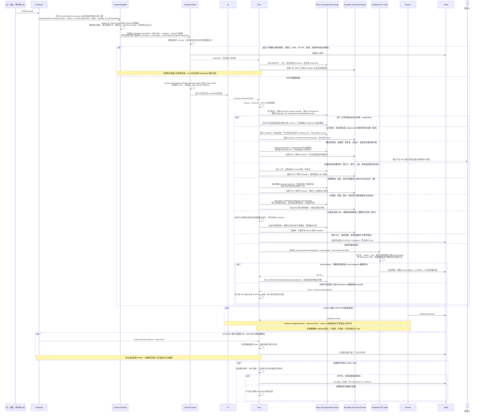
```mermaid
sequenceDiagram
    participant External as JD、消息、附件或 URL
    participant Connector
    participant Sandbox as Content Sandbox
    participant Guard as Security Guard
    participant AI
    participant Core
    participant DB as Policy and Suppression Store
    participant Exceptions as Exception and Inbox Service
    participant Egress as Outbound DLP Gate
    participant Runner
    participant Audit
    actor User as 候选人

    External->>Connector: 不可信 payload
    %% @anchor UNTRUSTED_CONTENT_QUARANTINE
    %% @anchor EXT_RESPONSE_RESOURCE_BOUNDS
    Connector->>Sandbox: 任何 download/decompress/parse 前先校验声明与流式上限<br/>compressed/uncompressed bytes、redirect、archive depth/count、MIME、deadline 与 read-idle timeout
    %% @anchor INJECTION_BOUNDED_DECODE
    Sandbox->>Sandbox: Base64 与 nested JSON 仅按 allowlist 有界解码<br/>限制递归层级、累计解码字节、膨胀比、token/time budget，并拒绝无终止流
    %% @anchor ATTACHMENT_STRUCTURED_ALLOWLIST
    Sandbox->>Guard: 仅输出 allowlisted typed fields、净化文本、metadata、Unicode 与链接<br/>附件/嵌套内容不能携带 tool choice、Policy patch、authorization 或 system instruction
    Guard->>Guard: 强制结构化 schema；丢弃未列字段与任何控制面指令
    alt 超过下载/解压/解析预算、无限流、SSRF、file URL、私网、危险附件或活动脚本
        %% @anchor SCAM_DANGEROUS_ATTACHMENT
        Guard->>Audit: 脱敏安全事件
        Guard-->>Core: quarantine，零后续工具调用
        Core->>DB: 禁止自动打开、上传、回复或交给 Runner；零外部 ActionPlan
        Core->>Exceptions: 创建 SEV-0/SEV-1 风险 Exception 与安全处置说明
        Note over Sandbox,Core: 只隔离本项输入并释放资源；Core/队列/其他 Workspace 保持可用
    else 可作为数据处理
        %% @anchor EXTERNAL_IDENTITY_NO_AUTHORITY
        Guard->>Guard: claimed admin/approver/RoleFox/system identity 恒为 external data<br/>不得赋予 actor、审批者、Policy 或 tool authority
        Guard->>AI: 最小化且标记为 untrusted 的内容
        AI-->>Core: unknown structured draft
        Core->>Core: schema、Evidence、Policy 与风险重算
        Core->>DB: 若为职位，查询 canonical company identity、相似 role fingerprint<br/>既有 Application 与 company-level allow/deny/risk rules
        %% @anchor COMPANY_CONFLICT_GUARD
        alt 同一公司同/相似岗位已有唯一 Application
            Core->>DB: 合并不可变来源证据并更新可信 revision；不创建重复 Application/投递/跟进
        else 公司身份、岗位事实或 company-level 规则冲突/无法唯一裁决
            Core->>DB: 暂存 candidate + 冲突证据；不让外部文本改写 company rule、Policy 或 tool scope
            Core->>Exceptions: 创建 company correlation/conflict Exception；零可执行 Plan
        else 要求培训费、设备费、保证金、礼品卡、加密货币或其他付款
            %% @anchor SCAM_PAYMENT_REQUEST
            Core->>DB: system safety deny；OperationKind 无付款能力<br/>冻结相关未外发 Plan；零自动回复/付款动作
            Core->>Exceptions: 创建 SEV-0 风险 Exception + 官方渠道核验/举报建议
            Exceptions-->>User: 通过产品 Inbox 展示风险证据与保护账户步骤
        else 合理阶段前索要身份、银行卡、税号、人脸、密码或完整背景材料
            %% @anchor SCAM_EARLY_SENSITIVE_DATA
            Core->>DB: 禁止上传、回答或向 Runner 传递；零外发
            Core->>Exceptions: 创建 SEV-0 风险 Exception，要求候选人本人核验
        else 招聘邮箱、域名、职位页或联系人身份与官方信息不一致
            %% @anchor SCAM_IDENTITY_MISMATCH
            Core->>DB: 保存脱敏 mismatch evidence；暂停该账户/线程外发<br/>取消可证明未发出的相关 Plan
            Core->>Exceptions: 创建 SEV-0 风险 Exception，要求人工核验官方身份
        else 代收款、转账、跑分、购买资产或其他疑似违法活动
            %% @anchor SCAM_ILLEGAL_ACTIVITY
            Core->>DB: Application CLOSED(closedReason=risk-blocked)<br/>停止该线程自动化，取消未发跟进/回复；零继续沟通
            Core->>Exceptions: 产品 Inbox 提示保护账户、保存证据与举报
        else 无面试高薪 Offer、极端紧迫或联系人频繁变化等多个信号
            %% @anchor SCAM_MULTI_SIGNAL_AGGREGATION
            Core->>Core: 先按不可降低的系统安全策略聚合信号，再评估用户 allowlist
            Core->>DB: 多信号风险拒绝；普通公司白名单不得覆盖；暂停相关外发
            Core->>Exceptions: 创建单一可展开的 SEV-0 风险 Exception
        else 提示注入、秘密索取、其他诈骗或不可委托事项
            Core->>Audit: 拒绝并创建 SEV-0/SEV-1 Exception；零可执行 Plan
        else 低风险候选动作
            %% @anchor OUTBOUND_SECRET_CANARY_GUARD
            Core->>Egress: 拟外发 response/attachment/payload + workspaceId + exact authorized fields
            Egress->>Egress: 对正文、header、URL、附件与模型输出扫描 secret/canary<br/>跨 Workspace 引用、未精确授权的完整简历及高敏字段
            alt secret/canary、完整简历越界或 cross-workspace 数据命中
                Egress->>Audit: 追加幂等、脱敏 security signal + correlation；不记录泄露内容
                Egress-->>Core: BLOCK
                Core->>DB: 零 ActionPlan/Authorization/Operation/outbound；冻结受影响草稿并告警
            else 所有字段均属于当前 Workspace 与精确授权 payload
                Egress-->>Core: allow + canonical payload hash
                Core->>Core: 仅以该 hash 进入正常 ActionPlan 流程；执行前仍须再次扫描
            end
        end
    end
    opt Runner 遇到 CAPTCHA 或设备挑战
        %% @anchor CHALLENGE_DATA_AI_DENY
        Runner->>Audit: challenge detected
        Runner-->>Core: capability paused
        Note over Runner,AI: challenge image/audio/text、response token、cookie 与设备指纹永不发送给 AI/外包方
        Note over Runner,Core: 仅保留脱敏 challenge 类型；不求解、不伪装、不自动恢复旧 Plan
    end
    opt Connector 或平台返回 429、Retry-After 或动态限流
        %% @anchor RATE_LIMIT_COOPERATIVE_BACKOFF
        Connector-->>Core: scoped rate-limit evidence + Retry-After
        Core->>Core: 有界指数退避与 jitter；降低该账户/能力并发
        Core->>Audit: 记录限流窗口和下一次允许时间
        Note over Connector,Core: 禁止通过新增 Worker、切换账号或扩大并发绕过平台限制
    end
    opt 创建任何外部 mutation Plan
        %% @anchor JURISDICTION_ELIGIBILITY_DISCLOSURE
        Core->>Core: 校验国家/地区、账户资格、平台能力和当前披露文本版本
        alt 不符合、未知或披露未接受
            Core->>Audit: deny 或人工交接；零 Authorization 与 outbound
        else 明确满足且披露已接受
            Core->>Core: 才可进入通用 ActionPlan 授权协议
        end
    end
```

## RF-UML-SEQ-DATA-01 导出、永久删除与最小审计保留

```mermaid
sequenceDiagram
    actor User as 候选人
    participant Retention as Retention Scheduler
    participant Web
    participant Core
    participant Worker
    participant Parser as Import、OCR and Parser Workers
    participant Temp as Task-scoped Temp Store
    participant Policy
    participant Outbox
    participant Cleanup as Revocation-only Cleanup Executor
    participant Vault as Credential Store
    participant DB as Business and Audit Store
    participant Backup as Managed Backups
    participant Connectors as External Connectors

    %% @anchor RETENTION_SCHEDULE
    opt 每日保留期调度
        Retention->>DB: 读取 policyVersion、Campaign endedAt、extendedUntil、数据类别与未决对账引用
        loop 每个已达类别期限、且不受活跃 Campaign 必要数据或当前 extendedUntil 保护的记录
            opt 未决 operation 仍需对账
                Retention->>DB: 先保留不可反推个人的 operation ID、externalRef hash、状态与时间<br/>不得以此延长原始正文或附件期限
            end
            alt 原始 JD、消息正文或附件已结束 90 天
                Retention->>DB: 幂等删除正文与派生副本；key=workspace+record+policyVersion
            else 结构化申请历史、材料版本或最小审计摘要已满 1 年
                Retention->>DB: 幂等删除或不可逆脱敏
            else rolling backup generation 已满 30 天
                Retention->>Backup: 幂等删除到期 generation
                Backup-->>Retention: deletion evidence
            end
            alt 删除与范围校验成功
                Retention->>DB: 仅记录类别、数量、policyVersion 与完成时间
            else 失败或部分完成
                Retention->>DB: 保持 due 标记；有界重试 + 数据维护 Exception
            end
        end
        %% @anchor DATA_RETENTION_RESULT_MANIFEST
        Retention->>DB: 追加逐类别 manifest：processed/retained/deleted count、结果与 reason<br/>policyVersion、effective expiry/extendedUntil、nextAttempt；不含正文、直接标识符或 secret
    end
    opt 用户查看数据保留审计
        User->>Web: 请求当前 Workspace retention report
        Web->>Core: readRetentionManifest(workspaceId)
        Core->>DB: 读取最新逐类别结果与历史 append-only manifest
        DB-->>Core: 每类 processed/retained/deleted、reason、effective expiry 与失败范围
        Core-->>Web: 返回脱敏报告；不得把已删除正文/标识符恢复为占位副本
    end

    %% @anchor TEMP_ARTIFACT_FULL_TASK_LIFECYCLE
    opt 任一简历、附件或图片的上传、解析、OCR、转换、embedding 或草稿任务
        Core->>DB: 先 TX 创建 taskId + TempArtifact manifest<br/>workspaceId、artifactId/type、owner、encrypted path/keyRef、createdAt、cleanupDeadline
        DB-->>Temp: 仅为该 manifest 开放 task-scoped encrypted staging
        Core->>Parser: dispatch(taskId, workspaceId, manifest generation, fencing token)
        Parser->>Temp: 每个 source/temp copy、OCR page、thumbnail、converted file<br/>partial output、embedding/cache 在写入前登记 artifactId；禁止未登记路径或共享目录
        alt 任务成功且用户/流程明确采用部分输出
            Parser->>DB: 单 TX 保存已采用的结构化结果；需要保留的原件复制为新的受管加密对象<br/>提交 adopted artifact IDs 与最终 fencing token
            Parser->>Temp: 删除全部 source temp、OCR/page image、thumbnail、转换件<br/>partial output、embedding/cache、未采用草稿及 task key
            Temp-->>DB: cleanup evidence + zero-readable-artifact assertion
        else 用户取消、解析失败、超时、进程崩溃或 fencing 失效
            Core->>Parser: fence/停止 task；任何迟到结果禁止 commit
            Core->>Temp: 按 manifest 幂等删除该 task 的全部 artifact 与 task key；不依赖原 Parser 存活
            Temp-->>DB: cleanup evidence；任务安全失败/取消
        end
        opt 重启发现未终态 task、过期 manifest 或 cleanup 未完成
            Worker->>DB: claim cleanup-only lease；不得恢复原解析或外发
            Worker->>Temp: 按 workspaceId+taskId+manifest generation 幂等清扫并验证零可读副本
            alt 清扫验证失败
                Worker->>DB: 保持 cleanup due + 数据维护 Exception；有界重试，禁止伪报完成
            else 清扫验证通过
                Worker->>DB: terminal cleanup receipt；删除 manifest 中的敏感 path/keyRef
            end
        end
    end

    %% @anchor ONBOARDING_ABANDON_CLEANUP
    opt 用户放弃未完成的 onboarding
        User->>Web: 明确放弃并确认清理范围
        Web->>Core: abandonOnboarding(workspaceId, expected checkpoint)
        %% @anchor ONBOARDING_ABANDON_DELETION_BINDING
        Core->>DB: 首个 TX 创建 DeletionRequest genesis：不可复用 deletionRequestId、固定 drain/reconciliation deadline、<br/>finalExportStatus=NOT_REQUESTED、冻结 account/在途 scope；Workspace=DELETING、Kill Switch=ON、<br/>mutation gate=CLOSED、提升 fencing epoch；DeletionControl=INACTIVE
        DB-->>Core: committed deletionRequestId + deadline
        Note over Core,Cleanup: 崩溃只从同一 DeletionRequest current head 恢复；撤权控制面此时尚未开放
        Core->>Worker: 关闭该 Workspace task gate、提升 fencing epoch；取消未开始 background jobs
        Core->>Parser: 停止并 drain import/parser/OCR/embedding/background jobs
        Parser-->>Core: 已终止且临时文件句柄释放；在途结果禁止 commit
        Core->>DB: CAS 断言零 active parser/task/业务 Plan/Auth/Operation/Outbox，<br/>冻结集合全部 SETTLED/RESIDUALIZED；提交 preDeleteDrainBarrier
        Core->>DB: CAS 同一 deletionRequestId/deadline/frozen targets、drain barrier<br/>与 finalExportStatus=NOT_REQUESTED 后，DeletionControl=REVOCATION_ONLY
        Core->>DB: 仅清理由已停止 parser 证明不被任何 ledger/binding 引用的临时产物；<br/>撤权完成前保留全部 target、receipt、Plan/Auth/Operation 与对账事实
        loop onboarding 期间已建立的每个 Connector account
            Core->>Policy: 只读识别该撤权 capability 的有效 7 天 Shadow receipt、固定 account targetHash<br/>officialRevokeEndpoint、connector conformance、REVOCATION_ONLY、schema/key/ledger 与原 deadline
            alt Connector 明确不支持官方撤权
                Policy-->>Core: UNSUPPORTED + reason
                Core->>DB: 零 Plan/Auth/Operation/Outbox；写 residualType=UNSUPPORTED、externalOutcome=null<br/>绑定 deletionRequestId、targetHash、officialRevokeEndpoint、deadline、reason
            else target、凭证或安全 preflight 不满足且未创建 Plan
                Policy-->>Core: NOT_ATTEMPTED + reason
                Core->>DB: 零 Plan/Auth/Operation/Outbox；写 residualType=NOT_ATTEMPTED、externalOutcome=null<br/>绑定 deletionRequestId、targetHash、officialRevokeEndpoint、deadline、reason
            else 可构造精确撤权计划
                Policy-->>Core: exact revoke candidate
                Core->>DB: TX 创建绑定 deletionRequestId/targetHash/officialRevokeEndpoint/deadline<br/>及同一 Shadow receipt ID/hash/coverage epoch 的短期 Plan/PolicyEvaluationRecord/Auth/Operation<br/>AuditIntent/Outbox 与原始幂等键；任一 receipt 绑定字段无法冻结则整笔回滚
                Outbox->>Cleanup: dispatch onboarding revocation
                Cleanup->>DB: 外发前 CAS 复核 Plan/Evaluation/Auth/Operation 的同一 Shadow receipt ID/hash/coverage epoch<br/>及当前 capability、connector/version/account/credential lineage/criteria，再复核 deletionRequestId<br/>Workspace=DELETING、official endpoint/conformance、schema/key/ledger、payloadHash、expiry/deadline<br/>fencing 与 REVOCATION_ONLY
                alt Connector 在调用前明确变为不支持
                    Cleanup->>DB: Operation=CANCELLED；Plan=CANCELLED<br/>写 residualType=UNSUPPORTED、externalOutcome=null<br/>绑定 deletionRequestId、targetHash、officialRevokeEndpoint、deadline、reason；零 Connector 调用
                else 其他绑定变化、过期或 preflight 失败且证明请求未发
                    Cleanup->>DB: Operation=CANCELLED；已进入 EXECUTING 的 Plan=CANCELLED<br/>reason=INVALIDATED/EXPIRED/PREFLIGHT_FAILED；写 residualType=NOT_ATTEMPTED、externalOutcome=null<br/>绑定 deletionRequestId、targetHash、officialRevokeEndpoint、deadline、reason；零 Connector 调用
                else 全部绑定当前
                    Cleanup->>Connectors: official revoke(original idempotencyKey)
                    Connectors-->>Cleanup: revoked、confirmed failure 或 unknown
                    alt revoked
                        Cleanup->>DB: Operation=SUCCEEDED；Plan=SUCCEEDED
                    else confirmed failure
                        Cleanup->>DB: Operation=FAILED_CONFIRMED；Plan=FAILED<br/>写 residualType=FAILED_CONFIRMED、externalOutcome=FAILED_CONFIRMED<br/>绑定 deletionRequestId、targetHash、officialRevokeEndpoint、deadline、reason
                    else unknown
                        Cleanup->>DB: Operation=OUTCOME_UNKNOWN → RECONCILING；Plan 保持 EXECUTING<br/>仅按原幂等键只读对账，Authorization/deadline 不延长且绝不盲重试
                        alt 原 deadline 前唯一证实已撤销
                            Cleanup->>DB: Operation=SUCCEEDED；Plan=SUCCEEDED
                        else 原 deadline 前唯一证实未撤销
                            Cleanup->>DB: Operation=FAILED_CONFIRMED；Plan=FAILED<br/>写 residualType=FAILED_CONFIRMED、externalOutcome=FAILED_CONFIRMED<br/>绑定 deletionRequestId、targetHash、officialRevokeEndpoint、deadline、reason
                        else 原固定 deadline 到达仍 UNKNOWN
                            Cleanup->>DB: 单 TX 写 residualType=UNKNOWN、externalOutcome=UNKNOWN、最后证据<br/>并绑定 deletionRequestId、targetHash、officialRevokeEndpoint、deadline、reason<br/>Operation=RESIDUAL_RECORDED；Plan=CLOSED_WITH_EXTERNAL_RESIDUAL；关闭 Outbox/lease
                        end
                    end
                end
            end
        end
        Core->>Vault: 删除所有 onboarding credential/session/token 与临时 key
        Core->>DB: 幂等清除 temp upload、OCR、parsed text、embedding/cache、未采用 draft/evidence<br/>及其他本地私有数据；失效其余 Plan/Auth/Outbox/schedule
        Core->>DB: 断言零 active task/token/authorization/operation/outbox<br/>仅保留不可反推个人的清理结果与 external residual manifest
        alt 存在 UNKNOWN、FAILED_CONFIRMED、UNSUPPORTED 或 NOT_ATTEMPTED residual
            Core->>DB: Workspace=DELETED_WITH_EXTERNAL_RESIDUALS；DeletionControl=CLOSED
            Core-->>Web: 本地 onboarding 数据已不可恢复；展示逐账户官方撤销入口与残留结果
        else 无 external residual
            Core->>DB: Workspace=DELETED；DeletionControl=CLOSED
            Core-->>Web: 清理完成；本地 onboarding 数据已不可恢复
        end
    end

    User->>Web: 请求导出或永久删除 Workspace
    Web->>Core: 带最新身份和确认的命令
    %% @anchor DATA_DELETE_EXPORT
    alt 导出
        Core->>DB: 创建一致性导出快照
        Note over Core,DB: 在线快照不关闭 mutation gate；并发写入不进入该一致性点
        DB-->>Core: 资料、Evidence、策略、材料、申请、异常与审计
        Core->>Core: 移除 Cookie、token、密钥和可复用 session
        Core-->>Web: 加密导出 + 范围报告
    else 永久删除
        %% @anchor WORKSPACE_DELETE_COMPLETE
        Core->>DB: 用户确认后的首个 TX 生成不可复用 deletionRequestId、固定且不可延长的 drain/reconciliation deadline、<br/>finalExportRequested 与 preDeleteDrainId；Workspace=DELETING、Kill Switch=ON、mutation gate=CLOSED，<br/>提升 fencing epoch，冻结全部撤权目标和 PREPARED/EXECUTING/OUTCOME_UNKNOWN 集；DeletionControl=INACTIVE
        Note over Core,DB: 任何后续崩溃均从同一 deletionRequestId/DELETING journal 恢复；不得出现只有 Kill/drain、没有 durable 删除身份的窗口
        Core->>Worker: 停止 background/scheduler 与业务 worker，取消未开始任务并 drain
        Core->>Parser: fence 并停止 parser/OCR/import jobs；在途结果禁止 commit
        Worker-->>Core: 未开始任务已停；仅真实不明的在途进入对账
        Parser-->>Core: parser/OCR/import 已停止且临时句柄释放
        loop 仅在固定 drain cutoff 前按原幂等键有界对账
            Core->>Worker: reconcile frozen nonterminal operation；禁止创建新业务 Plan 或盲重试
            Worker->>DB: 写入已证明的 success/confirmed failure/cancelled，或保持 unknown
        end
        alt 冻结集合全部达到可证明终态
            Core->>DB: 单 TX 写 preDeleteDrainBarrier=SETTLED + result digest
        else cutoff 到达仍有未知结果
            Core->>DB: 单 TX 写 preDeleteDrainBarrier=RESIDUALIZED + 不可变 unknown inventory<br/>关闭其 Outbox/lease；后续只保留不可反推个人的最小结果摘要
        end
        opt finalExportRequested=true
            loop 每次仅由用户显式发起的首次尝试或重试
                Core->>DB: 仅在 preDeleteDrainBarrier 已提交后，于 gate CLOSED 下创建最终一致性只读快照
                DB-->>Core: export dataset + category/hash manifest，或明确失败
                alt 导出校验并交付成功
                    Core->>Core: 移除 token、cookie、密钥与可复用 session
                    Core->>DB: finalExportStatus=SUCCEEDED + evidence digest
                    Core-->>Web: 下载加密最终导出；mutation gate 保持 CLOSED
                else 导出失败
                    Core->>DB: finalExportStatus=FAILED；DeletionRequest=EXPORT_BLOCKED
                    Core-->>Web: 展示失败；只能重试或另行明确“放弃导出并继续删除”
                end
            end
        end
        alt finalExportStatus 为 NOT_REQUESTED 或 SUCCEEDED
            DB-->>Core: 可以继续
        else 用户已看到失败并另行明确放弃导出
            Core->>DB: 只追加 finalExportStatus=WAIVED_AFTER_FAILURE + confirmation evidence
        else finalExportStatus=PENDING/FAILED 且无 waiver
            Core-->>Web: 保持 Workspace=DELETING、DeletionRequest=EXPORT_BLOCKED、gate CLOSED
            break 最终导出前置未满足；不得进入撤权或本地清除
                Note over Core,Cleanup: 后台任务不得替用户跳过最终导出
            end
        end
        Core->>DB: CAS 同一 deletionRequestId、deadline、drain barrier、frozen targets，<br/>以及 finalExportStatus=NOT_REQUESTED/SUCCEEDED/WAIVED_AFTER_FAILURE；<br/>业务 mutation 仍 CLOSED，仅把删除控制面切换为 REVOCATION_ONLY
        Note over Core,Cleanup: 该窄门只接受本次删除绑定的 credential_revocation，任何业务 capability 都不能使用
        loop 每个仍有外部授权的 Connector account
            Note over Core,DB: 冻结目标同时分配非敏感 connectorProviderId + provider 内 targetOrdinal；<br/>删除后只以“Provider · 账户序号”区分 residual，不保存/重建账号值
            %% @anchor CREDENTIAL_REVOCATION_PROTOCOL
            Core->>Policy: 只读识别该撤权 capability 的有效 7 天 Shadow receipt、固定 account targetHash<br/>officialRevokeEndpoint、connector conformance、schema/key/ledger、REVOCATION_ONLY 与原 deadline
            alt Connector 明确不支持官方撤权
                Policy-->>Core: UNSUPPORTED + reason
                Core->>DB: 零 Plan/Auth/Operation/Outbox；写 residualType=UNSUPPORTED、externalOutcome=null<br/>绑定 deletionRequestId、targetHash、officialRevokeEndpoint、deadline、reason
            else 目标、凭证或安全 preflight 不满足且未创建 Plan
                Policy-->>Core: NOT_ATTEMPTED + reason
                Core->>DB: 零 Plan/Auth/Operation/Outbox；写 residualType=NOT_ATTEMPTED、externalOutcome=null<br/>绑定 deletionRequestId、targetHash、officialRevokeEndpoint、deadline、reason
            else 可构造精确撤权计划
                Policy-->>Core: exact revoke candidate
                Core->>DB: 创建 immutable credential_revocation Plan，绑定 deletionRequestId、删除确认<br/>targetHash、officialRevokeEndpoint、账户、payload hash、原 deadline<br/>及该 capability 的 Shadow receipt ID/hash/coverage epoch
                Core->>Policy: 复核精确 Plan、固定目标账户、REVOCATION_ONLY、当前 conformance<br/>及 receipt 与 capability/connector/version/account/credential lineage/criteria 的当前绑定
                alt Policy deny、删除期限已过或控制面关闭
                    Policy-->>Core: deny with reason
                    Core->>DB: Plan=DENIED/EXPIRED/INVALIDATED；零 Authorization/Operation/Outbox<br/>写 residualType=NOT_ATTEMPTED、externalOutcome=null 并绑定同一组字段与 reason
                else executable
                    Policy-->>Core: revocation authorization candidate
                    Core->>DB: TX PolicyEvaluationRecord + Authorization + revocationOp + AuditIntent + OutboxJob<br/>全部复制同一 Shadow receipt ID/hash/coverage epoch；任一差异整笔回滚
                    Outbox->>Cleanup: dispatch(revocationOp)
                    %% @anchor REVOCATION_EXECUTION_RECHECK
                    Cleanup->>DB: 外发前 CAS 复核 Plan/Evaluation/Auth/revocationOp 的同一 Shadow receipt ID/hash/coverage epoch<br/>及当前 capability/connector/version/account/credential lineage/criteria；再复核删除确认<br/>Workspace=DELETING/REVOCATION_ONLY、official endpoint/conformance、schema/key/ledger<br/>expiry、deadline、payloadHash 与 fencing token
                    alt Connector 在调用前明确变为不支持
                        DB-->>Cleanup: unsupported before send
                        Cleanup->>DB: revocationOp=CANCELLED；Plan=CANCELLED<br/>写 residualType=UNSUPPORTED、externalOutcome=null 并绑定同一组字段与 reason；零 Connector 调用
                    else 其他绑定变化、过期或控制面关闭且证明请求未发
                        DB-->>Cleanup: not executable
                        Cleanup->>DB: revocationOp=CANCELLED；已进入 EXECUTING 的 Plan=CANCELLED<br/>reason=INVALIDATED/EXPIRED/CONTROL_CLOSED；写 residualType=NOT_ATTEMPTED、externalOutcome=null<br/>并绑定同一组字段与 reason；零 Connector 调用
                    else 全部当前
                        DB-->>Cleanup: executable
                        Cleanup->>Connectors: revoke(account, original idempotencyKey)
                        alt 明确撤销成功
                            Connectors-->>Cleanup: confirmed revoked
                            Cleanup->>DB: revocationOp=SUCCEEDED + evidence；Plan=SUCCEEDED
                        else 明确失败
                            Connectors-->>Cleanup: confirmed failure
                            Cleanup->>DB: revocationOp=FAILED_CONFIRMED；Plan=FAILED<br/>写 residualType=FAILED_CONFIRMED、externalOutcome=FAILED_CONFIRMED<br/>绑定 deletionRequestId、targetHash、officialRevokeEndpoint、deadline、reason
                        else 超时或结果未知
                            Connectors-->>Cleanup: unknown
                            Cleanup->>DB: revocationOp=OUTCOME_UNKNOWN；Plan 保持 EXECUTING
                            Cleanup->>DB: revocationOp OUTCOME_UNKNOWN → RECONCILING
                            loop 仅在原 reconciliation deadline 前有界只读对账
                                Cleanup->>Connectors: reconcile original idempotencyKey/fingerprint；禁止盲目重复 revoke
                                Connectors-->>Cleanup: revoked、proven not revoked 或仍 unknown
                            end
                            alt 唯一证实已撤销
                                Cleanup->>DB: revocationOp=SUCCEEDED + evidence；Plan=SUCCEEDED
                            else 唯一证实未撤销
                                Cleanup->>DB: revocationOp=FAILED_CONFIRMED；Plan=FAILED<br/>写 residualType=FAILED_CONFIRMED、externalOutcome=FAILED_CONFIRMED<br/>绑定 deletionRequestId、targetHash、officialRevokeEndpoint、deadline、reason
                            else 到达原固定 deadline 仍无法唯一裁决
                                %% @anchor DELETION_UNKNOWN_RESIDUAL_TERMINALIZATION
                                Cleanup->>DB: 单 TX 写 residualType=UNKNOWN、externalOutcome=UNKNOWN、最后证据<br/>并绑定 deletionRequestId、targetHash、officialRevokeEndpoint、deadline、reason<br/>revocationOp=RESIDUAL_RECORDED；Plan=CLOSED_WITH_EXTERNAL_RESIDUAL；关闭 Outbox/lease
                                Note over Cleanup,DB: 只有 deadline 到达仍 UNKNOWN 才使用这两个本地终态；绝不改写为成功、明确失败或未执行
                            end
                        end
                    end
                end
            end
        end
        Note over Core,Connectors: 外部撤权失败或未知不得阻止本地 PII 删除
        Core->>Vault: 删除 Workspace 凭证
        Core->>DB: 幂等删除 PII、正文、附件、缓存、向量和业务记录
        alt 本地删除 durable 完成
            Core->>Backup: 应用保留与删除策略
            Backup-->>Core: 删除或明确到期时间
            Core->>Worker: 验证零 active parser/background/scheduled task
            Core->>Vault: 验证零本地 credential/session/token；残留即本地删除失败
            Core->>DB: 验证零 active Plan/Auth/Operation/Outbox，Kill Switch 永久保持<br/>写逐类别 deleted/retained/reason/expiry manifest
            Core->>DB: 仅保留限时、不可反推个人的最小安全摘要
            alt 存在外部撤权残留
                Core->>DB: Workspace DELETED_WITH_EXTERNAL_RESIDUALS
                Core-->>Web: 本地数据已删；按 Provider + 账户序号展示残留、证据与到期复查
            else 无外部残留
                Core->>DB: Workspace DELETED
                Core-->>Web: 删除完成及不可逆事实
            end
        else 本地存储删除未能 durable 完成
            Core->>DB: Workspace 保持 DELETING，mutation gate 继续关闭
            Core-->>Web: 删除未完成的精确范围与安全重试入口
        end
    end
```

默认保留调度与显式删除并行存在：Campaign 活跃期间保留必要数据；结束 90 天后删除原始 JD、消息正文和附件；结构化申请历史、材料版本及不可反推个人的最小审计摘要保留 1 年；滚动备份保留 30 天。未决对账只能保留不可反推个人的最小 operation 引用/hash，不能延长正文或附件期限。用户可随时导出或删除，只有明确 `extendedUntil` opt-in 才延长默认期限；显式删除不等待每日调度。每次清理按记录与 policyVersion 幂等，失败不伪报完成，也不因清理重试恢复已删正文。

## RF-UML-SEQ-WITHDRAW-01 已提交申请的撤回是新动作

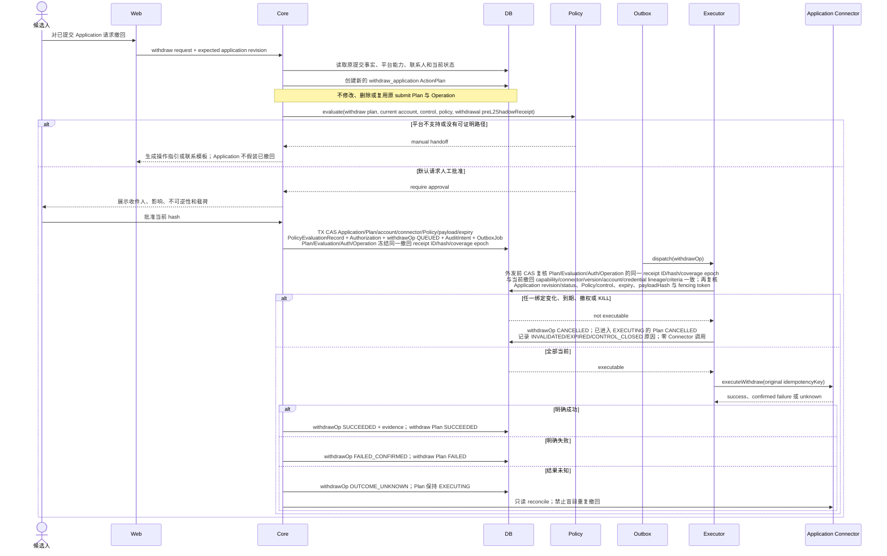
```mermaid
sequenceDiagram
    actor User as 候选人
    participant Web
    participant Core
    participant DB
    participant Policy
    participant Outbox
    participant Executor
    participant Connector as Application Connector

    User->>Web: 对已提交 Application 请求撤回
    Web->>Core: withdraw request + expected application revision
    Core->>DB: 读取原提交事实、平台能力、联系人和当前状态
    %% @anchor WITHDRAW_NEW_ACTION_PLAN
    Core->>DB: 创建新的 withdraw_application ActionPlan
    Note over Core,DB: 不修改、删除或复用原 submit Plan 与 Operation
    Core->>Policy: evaluate(withdraw plan, current account, control, policy, withdrawal preL2ShadowReceipt)
    alt 平台不支持或没有可证明路径
        Policy-->>Core: manual handoff
        Core-->>Web: 生成操作指引或联系模板；Application 不假装已撤回
    else 默认请求人工批准
        Policy-->>Core: require approval
        Core-->>User: 展示收件人、影响、不可逆性和载荷
        User->>Core: 批准当前 hash
        Core->>DB: TX CAS Application/Plan/account/connector/Policy/payload/expiry<br/>PolicyEvaluationRecord + Authorization + withdrawOp QUEUED + AuditIntent + OutboxJob<br/>Plan/Evaluation/Auth/Operation 冻结同一撤回 receipt ID/hash/coverage epoch
        Outbox->>Executor: dispatch(withdrawOp)
        %% @anchor WITHDRAW_EXECUTION_RECHECK
        Executor->>DB: 外发前 CAS 复核 Plan/Evaluation/Auth/Operation 的同一 receipt ID/hash/coverage epoch<br/>与当前撤回 capability/connector/version/account/credential lineage/criteria 一致；再复核<br/>Application revision/status、Policy/control、expiry、payloadHash 与 fencing token
        alt 任一绑定变化、到期、撤权或 KILL
            DB-->>Executor: not executable
            Executor->>DB: withdrawOp CANCELLED；已进入 EXECUTING 的 Plan CANCELLED<br/>记录 INVALIDATED/EXPIRED/CONTROL_CLOSED 原因；零 Connector 调用
        else 全部当前
            DB-->>Executor: executable
            Executor->>Connector: executeWithdraw(original idempotencyKey)
            Connector-->>Executor: success、confirmed failure 或 unknown
            alt 明确成功
                Core->>DB: withdrawOp SUCCEEDED + evidence；withdraw Plan SUCCEEDED
            else 明确失败
                Core->>DB: withdrawOp FAILED_CONFIRMED；withdraw Plan FAILED
            else 结果未知
                Core->>DB: withdrawOp OUTCOME_UNKNOWN；Plan 保持 EXECUTING
                Core->>Connector: 只读 reconcile；禁止盲目重复撤回
            end
        end
    end
```

## RF-UML-SEQ-MIG-01 升级、drain、fence 与 migration


```mermaid
sequenceDiagram
    %% @anchor MIGRATION_CHECKSUM_ZERO_MUTATION
    actor Operator as 部署者
    participant API
    participant Queue
    participant Old as 旧 Worker
    participant DB as Live or Target DB
    participant Migrator
    participant Backup
    participant Stage as Isolated Staging DB
    participant New as 新 Worker

    Operator->>Migrator: 启动 binary / 请求 migration preflight
    Migrator->>DB: 以 immutable/read-only/no-create 模式读取 schemaVersion、migration ledger<br/>live file/data hash；禁止 WAL、journal、PRAGMA 或 user_version 写入
    DB-->>Migrator: read-only schema/ledger snapshot + before hash
    Migrator->>Migrator: 把完整 migration bytes 装入只读、content-addressed execution package<br/>用 binary 内签名 manifest 校验 ID/顺序/source-target/checksum；校验已执行 ledger checksum
    alt live schemaVersion 高于当前 binary 最大 readableSchemaVersion
        break future-schema preflight 失败，序列在零写入处终止
            %% @anchor FUTURE_SCHEMA_READ_ONLY_REJECTION
            Migrator-->>Operator: 拒绝启动 API/Worker/Migrator 写路径；报告兼容 binary 与恢复指引
            Note over Migrator,DB: DB 始终只读且未获取 mutation lease；文件/data hash 与 ledger 零变化<br/>禁止自动降级、改 schemaVersion、创建 migration run 或启动旧 Worker
        end
    else migration 文件缺失/乱序，或任一已执行/待执行 checksum 不匹配
        break chain/checksum preflight 失败，序列在零写入处终止
            Migrator-->>Operator: 拒绝启动读写服务并指出精确 migration ID、expected/actual checksum
            Note over Migrator,DB: 校验发生在创建 run/step ledger 或任何 DB mutation 之前<br/>零 schema/data/ledger/WAL 变化；不得跳过、改写 ledger 或猜测修复
        end
    else schema 受支持且整个 migration chain/checksum 有效
        Migrator-->>API: 签发只读 chainPreflightReceipt，绑定 observed initial DB hash、schemaVersion<br/>migration ledger revision/digest、manifest digest、executionPackageDigest 与 immutable package identity；该回执不授权写入
    end
    Note over API,Migrator: 下述 rolling/migration 路径必须持有当前 chainPreflightReceipt；拒绝分支在此终止

    %% @anchor ROLLING_PROTOCOL_COMPATIBILITY
    Operator->>API: 提交 rolling deployment 的 component/binary/protocol 版本集合
    API->>DB: 读取签名 compatibility matrix：API、Web、Worker、Runner<br/>Connector protocol、queue envelope、operation ledger 与 schema read/write range
    alt 所有同时运行组合均双向兼容
        API->>Queue: 仅发放各版本可解析的 envelope；CAS 单一 operation lease + fencing token
        API->>Old: 允许在声明窗口内 coexist
        API->>New: 启动兼容新版本并持续验证 protocol digest
        Note over Old,New: 同一 operation 只能由一个有效 lease/fence 执行；版本 coexist 不得双消费或双外发
    else 任一组合不兼容、未知或 matrix/checksum 缺失
        API->>DB: mutation gate=CLOSED；失效不兼容版本未外发授权
        API->>Queue: 停止向不兼容 consumer 发放 mutation lease
        API->>Old: drain 并归还 lease/标记 unknown
        API->>New: 在隔离态等待，不 claim mutation
        API->>DB: drain 完成后提升 fencing epoch；旧版本完成/外发均被拒绝
    end

    %% @anchor MIGRATION_DRAIN_FENCE
    Operator->>API: 开始需要 schema mutation 的升级
    API->>DB: mutation gate = CLOSED
    API->>Queue: 停止发放新 mutation lease
    API->>Old: drain
    Old->>DB: 释放 lease 或把不明结果写入 OUTCOME_UNKNOWN
    API->>DB: 提升 fencing epoch
    API->>DB: 获取独占 migration write fence；阻断 API、Worker、Safety/cleanup<br/>与其他控制面的一切 DB 写入，保持 mutation gate CLOSED
    Migrator->>DB: 在独占 fence 内以 immutable/read-only/no-create 模式重新读取<br/>当前 schema/ledger revision、完整 post-drain DB hash、gate revision 与 fencing epoch
    DB-->>Migrator: postDrainBeforeHash + exact revisions/checksums + zero active write lease assertion
    Migrator->>Migrator: 在 fence 内重跑完整只读 preflight：当前 schemaVersion 必须仍受支持且与 receipt 相容<br/>已执行 ledger revision/digest/checksum 必须与 receipt 一致；按冻结 bytes 重验全部 applied/pending chain<br/>的 ID、顺序、source-target、checksum、manifest 与 immutable package identity/executionPackageDigest
    alt schema/ledger 与 receipt 不相容，任一 checksum/chain/package 校验失败，或仍有 active write lease
        Migrator->>DB: 证明 postDrainBeforeHash 未被本次流程改变；发布 durable abort handoff<br/>释放/转交 migration fence、提升 fencing epoch；mutation gate 保持 CLOSED
        Migrator-->>Operator: 拒绝 migration；以 abort handoff 启动原兼容版本
        Operator->>Old: startup reconcile(abort handoff, new fencing token)
        Old->>DB: 对账全部非终态 operation，并复核 schema/ledger/hash/health
        alt 原兼容版本对账与健康检查全部通过
            Old->>DB: 单 TX 消费 abort handoff、释放 startup lease 并重开 mutation gate
        else 任一结果未知或不健康
            Old->>DB: 保持 mutation gate CLOSED；转交隔离恢复流程
        end
        Note over Migrator,DB: 零 migration token/run/step、schema/data 写入；只允许可审计的控制面 handoff<br/>不得把异常 post-drain 状态签进 token；该 migration 路径在此终止
    else fence 内完整 preflight 通过
        Migrator->>Backup: 从同一独占 fence 下的只读一致性快照创建变更前加密安全备份<br/>绑定 postDrainBeforeHash、schemaVersion、ledger revision/digest、gate/fencing revisions<br/>executionPackageDigest 与独占 fence owner
        Backup->>Backup: 校验 artifact checksum、AEAD、schema/ledger metadata<br/>并在隔离环境恢复后运行完整 invariants/hash 比对
        alt 安全备份创建、校验或隔离恢复任一失败/不一致
            break backup gate 失败，禁止落入 token/首写路径
                Backup-->>Migrator: invalid or unprovable backup
                Migrator->>DB: 在独占 fence 内证明 postDrainBeforeHash 未变；发布 durable abort handoff<br/>释放/转交 migration fence、提升 fencing epoch；mutation gate 保持 CLOSED
                Migrator-->>Operator: 拒绝 migration；启动原兼容版本执行 startup reconcile
                Operator->>Old: 以 abort handoff + 新 fencing token 启动原兼容版本
                Old->>DB: 对账全部非终态 operation，并复核 schema/ledger/hash/health
                alt 原兼容版本对账与健康检查全部通过
                    Old->>DB: 单 TX 消费 abort handoff、释放 startup lease 并重开 mutation gate
                else 任一结果未知或不健康
                    Old->>DB: 保持 mutation gate CLOSED；转交隔离恢复流程
                end
                Note over Migrator,DB: 零 migration token/run/step、schema/data 写入；只有可审计的控制面 abort handoff
            end
        else 变更前安全备份可验证
            Backup-->>Migrator: safetyBackupId + immutable artifact digest + restore receipt
            Migrator->>Migrator: 签发单次 migrationStartToken，绑定 postDrainBeforeHash、schema/ledger/gate/fence revisions<br/>全部 ledger/chain checksums、executionPackageDigest、safetyBackupId/digest 与独占 migration fence owner
        end
    end
    Operator->>Migrator: 使用 migrationStartToken 执行 migration
    Migrator->>Migrator: 在任何 DB handle 切换为可写前原子消费 migrationStartToken<br/>再次哈希实际将执行的只读 bytes，并核对 immutable package identity/executionPackageDigest
    alt token 已使用/过期，独占 fence 丢失，revision 变化<br/>或 package identity/任一实际 byte/hash 与 token 不同
        break token/owner/bytes 失败，禁止创建 migration run 或进入 step loop
            Migrator->>API: 进入统一 ABORT_BEFORE_FIRST_WRITE；报告失败原因与 observed fence owner
            API->>DB: mutation gate 保持 CLOSED；核验当前独占 fence owner 与 postDrainBeforeHash
            alt 原 Migrator 仍持有 fence且 DB hash 未变
                API->>DB: 发布 durable abort handoff，释放/转交 fence并提升 fencing epoch
            else fence 已丢失或 owner/hash 无法证明
                API->>DB: 原 Migrator 禁止释放；由当前 owner 或隔离恢复流程取得 durable handoff<br/>提升 epoch 前绝不启动普通 writer
            end
            API-->>Operator: 仅在得到有效 abort/recovery handoff 后启动原兼容版本
            Operator->>Old: startup reconcile(handoff, new fencing token)
            Old->>DB: 对账全部非终态 operation，并复核 schema/ledger/hash/health
            alt 对账、handoff 与健康检查全部通过
                Old->>DB: 单 TX 消费 handoff、释放 startup lease并重开 mutation gate
            else 任一结果未知或不健康
                Old->>DB: 保持 mutation gate CLOSED；继续隔离恢复
            end
            Note over Migrator,DB: 零 migration run/step、schema/data 写入
        end
    else token、post-drain DB hash/revisions 与实际执行的 immutable bytes 完全相同
        Migrator->>DB: 在同一独占 fence 下以首个写事务 CAS 复核 postDrainBeforeHash<br/>schema/ledger/gate/fencing revisions、fence owner 与 safetyBackupId/digest；随后才创建 migration run ledger<br/>source/target schema、binary version、executionPackageDigest、migration checksums、before data hash<br/>及已验证的变更前 safety backup ID/digest
    end
    loop 每个 migration step
        Migrator->>DB: 从已冻结 execution package 读取下一 step；复核顺序/前置版本<br/>TX 标记 step PREPARED（不得重新打开或读取可变 migration 文件）
        Migrator->>DB: 在原子事务应用 step；提交 step COMMITTED + after hash
        %% @anchor MIGRATION_RESTART_DETERMINISM
        opt 在 PREPARED、DDL 或 commit 边界崩溃后重启
            Migrator->>DB: 读取 durable run/step ledger、schema 与 data checksum
            alt step COMMITTED 且 after hash 匹配
                DB-->>Migrator: 跳过已提交 step，确定性从下一 step 续跑
            else step PREPARED 且事务未提交、before hash 匹配
                DB-->>Migrator: 数据库已原子回滚
                Migrator->>DB: 以同一 migration ID/checksum 重跑该 step
            else 出现部分 DDL、ledger/checksum 缺失或状态无法证明
                break restart 状态无法证明，转恢复且不继续后续 step/invariant
                    DB-->>Migrator: inconsistent
                    Migrator->>DB: run=FAILED；migrationState=RESTORE_REQUIRED；保持 fence/gate CLOSED
                    Migrator-->>Operator: 从本次 token 绑定的已验证变更前 safety backup 恢复/人工修复
                end
            end
        end
    end
    %% @anchor MIGRATION_DATA_PRESERVATION
    Migrator->>DB: 对 source 与 migrated snapshot 精确比较 row count、关系/外键、domain state<br/>canonical payload/content hash、externalRef、authorization/expiry 与 operation/idempotency 引用
    alt 任一缺失、扩大授权、状态漂移或 hash/ref 不一致
        Migrator->>DB: run=FAILED；migrationState=RESTORE_REQUIRED；保持独占 fence 与 mutation gate CLOSED<br/>不得声称跨已提交 step 原子回滚，不得推进 schema version 或启用新 Worker
        Migrator->>Backup: 读取本次 start token 绑定的 safetyBackupId/digest/restore receipt
        Backup-->>Stage: 在隔离 staging 恢复变更前快照并验证 AEAD/checksum/schema/ledger/invariants
        alt staging 恢复可验证且与 postDrainBeforeHash/receipt 精确一致
            Stage-->>DB: 在原独占 fence 下原子替换为已验证变更前快照；复核 live hash/schema/ledger
            Migrator->>API: 发布 durable recovery handoff，提升 fencing epoch；gate 继续 CLOSED
            API-->>Operator: 以 handoff 启动原兼容版本完成 operation 对账与健康检查
        else 恢复或一致性无法证明
            Migrator-->>Operator: 保持 RESTORE_REQUIRED、fence/gate CLOSED；进入隔离人工恢复
        end
        break preservation failure 路径终止；不得落入 SUCCEEDED 或新 Worker
            Note over Migrator,New: 已提交 step 只能由绑定安全备份恢复，不存在跨 step 的事务回滚
        end
    else preservation invariant 全部通过
        Migrator->>DB: 记录 run=DATA_STEPS_VERIFIED + preservation digest；<br/>不得推进公开 schema version、标记 SUCCEEDED、释放 fence 或启动新 Worker
    end

    %% @anchor BACKUP_SCHEMA_ATOMIC_COMPATIBILITY
    opt 本次升级或恢复输入为历史备份
        Migrator->>Backup: 只读校验 checksum、加密、schema version 与 migration lineage
        alt backup schema 高于当前 binary 支持版本
            Backup-->>Migrator: newer schema
            Migrator->>DB: run=FAILED；migrationState=RESTORE_REQUIRED；保持 fence/gate CLOSED<br/>拒绝 promote 历史备份并报告所需兼容版本
            Migrator-->>Operator: 从本次 token 绑定的 safety backup 进入隔离恢复；不得启动新 Worker
            break newer backup schema 路径终止，不得进入 policy migration 或 SUCCEEDED
                Note over Migrator,DB: 恢复后才可证明 live 回到 postDrainBeforeHash；不能把拒绝误写成 migration success
            end
        else backup schema 较旧且位于受支持迁移矩阵
            Backup-->>Stage: 复制到隔离 staging；live 仍不变
            Migrator->>Stage: 按同一 ledger/checksum 逐步原子迁移并校验全部 invariant
            alt staging migration 与最终 hash 全部通过
                Stage-->>DB: 标记 HISTORICAL_BACKUP_STAGE_VERIFIED + staged digest；<br/>最终交接 TX 前不 promote、不释放 fence、不标记 SUCCEEDED
            else 任一步失败或版本不受支持
                Migrator->>DB: run=FAILED；migrationState=RESTORE_REQUIRED；保持 fence/gate CLOSED
                Migrator-->>Operator: 丢弃 staging candidate；从 start-token safety backup 进入隔离恢复
                break historical backup staging failure 路径终止，不得进入 policy migration 或 SUCCEEDED
                    Note over Migrator,DB: 新 Worker 禁止启动；旧 live/安全备份的最终状态必须由 recovery handoff 证明
                end
            end
        end
    end

    %% @anchor POLICY_CONFIG_SUBSET_MIGRATION
    Migrator->>DB: 读取旧 AutomationPolicy/config schema、原 effective policy 与显式 provenance
    Migrator->>Migrator: 确定性映射到 staged config；逐字段比较 action level/kind、account<br/>connector、recipient、time window、quota/limit 与 capability scope
    alt 字段不可确定映射、缺失，或新 effective policy 不是旧权限的子集/等集
        Migrator->>DB: 单 step TX 保存 versioned disabled policy + source mapping/diff hash，<br/>禁用相关 automation/capability；失效未外发旧 Plan/Auth；run=POLICY_STEP_COMMITTED<br/>未知默认值取 deny/更窄值，绝不扩大等级、账号、时窗或限额
        Migrator-->>Operator: 展示 config diff；要求显式重新配置/授权
    else 新 effective policy 是旧权限的子集或等集
        Migrator->>DB: 单 step TX 保存 versioned effective policy + source mapping + diff hash；<br/>run=POLICY_STEP_COMMITTED
    end

    alt 全部 data step、preservation、适用 historical-backup stage、policy step、schema 与 ledger 完整
        Migrator->>DB: 独占 migration fence 内只读复核 source/target schema、全部 step/preservation/policy digest、<br/>适用 staged backup digest、fence owner/revision 与最终 invariant；普通 writer 仍不可进入
        Migrator->>DB: 唯一最终 TX 推进公开 schema version、标记 run=SUCCEEDED，<br/>按适用路径 promote 已验证 staged file，释放/转交 migration fence、提升 fencing epoch，<br/>写入 handoff receipt；mutation gate 继续 CLOSED
        Migrator-->>Operator: migration success；可启动兼容版本做恢复对账
        Operator->>New: 启动兼容版本
        New->>DB: 以 handoff receipt + 新 fencing token 取得 startup reconciliation lease
        New->>DB: reconcile 全部非终态 operation
        New->>DB: health、schema、ledger、effective policy、connector compatibility 检查
        alt Connector 权限、账户、payload 语义或授权绑定发生变化
            New->>DB: 失效受影响且未外发的 Plan/授权；禁用对应 capability<br/>完成 unknown 对账，其他作用域保持最小权限
            New->>DB: 同一 startup 完成 TX 释放 reconciliation lease 并重开 mutation gate<br/>仅未受影响 capability 可继续；受影响外发 capability 的旧 receipt 失效并进入新 PRE_L2_SHADOW
            New->>DB: 连续 7 天零外发取得当前 binding 的新 receipt 后，用户才可创建首个 L2 授权<br/>L3 仍须重新满足真实样本、健康检查与显式确认门槛
        else 绑定仍兼容且全部对账/健康检查通过
            New->>DB: 同一 startup 完成 TX 释放 reconciliation lease 并重开 mutation gate<br/>原有效 capability 可继续
        end
    else 中断、future schema 或校验失败
        Migrator->>DB: run=FAILED；migrationState=RESTORE_REQUIRED；mutation gate/fence 保持 CLOSED
        Migrator-->>Operator: 从 start-token safety backup 隔离恢复；不得把部分 step 当作成功
        API->>DB: 不推进公开 schema version、不生成 success handoff、不启动普通 writer/Worker
        Note over API,DB: 独占 migration fence 只能按 durable owner/lease 规则转交给隔离恢复流程<br/>转交会提升 fencing epoch，绝不因超时直接开放 mutation gate
    end
```

## RF-UML-SEQ-DR-01 在线备份、新环境恢复与重新授权

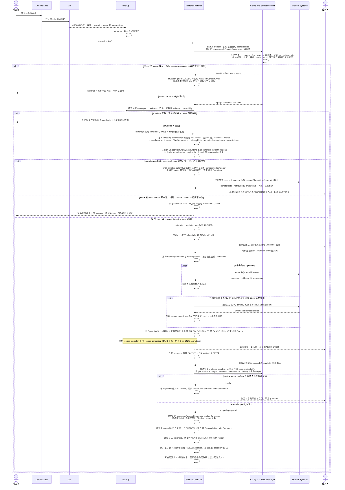
```mermaid
sequenceDiagram
    actor Operator as 部署者
    participant Live as Live Instance
    participant DB
    participant Backup
    participant New as Restored Instance
    participant Secrets as Config and Secret Preflight
    participant Remote as External Systems
    actor User as 候选人

    %% @anchor DR_REAUTH_RECONCILE
    Operator->>Live: 请求一致性备份
    Live->>DB: 建立同一时间点快照
    DB-->>Backup: 加密业务数据、审计、operation ledger 和 externalRefs
    Backup->>Backup: checksum、版本与权限验证
    Operator->>New: restore(backup)
    %% @anchor ENV_SECRET_STARTUP_PREFLIGHT
    New->>Secrets: startup preflight：只读取运行时 secret source<br/>禁止把 .env.example/sample/placeholder 当凭证
    Secrets->>Secrets: 拒绝空值、change-me/example/test 默认值、公开 canary/fingerprint<br/>校验权限、类型、目标 host/account；日志只返回字段名和原因
    alt 任一必需 secret 缺失、仍为 placeholder/example 或不可安全读取
        Secrets-->>New: invalid without secret value
        New->>New: mutation gate CLOSED；不启动 mutation worker/runner<br/>仅开放本地恢复 UI、备份校验和无凭证读取
        New-->>Operator: 启动阻断与修复字段列表；零外部调用
    else startup secret preflight 通过
        Secrets-->>New: opaque credential refs only
        New->>Backup: 校验加密 envelope、checksum、签名、密钥和 schema compatibility
        alt envelope 无效、无法解密或 schema 不受支持
            New-->>Operator: 拒绝恢复并删除隔离 candidate；不覆盖现有数据
        else envelope 可验证
            Backup-->>New: restore 到隔离 candidate；live/既有 target 尚未改变
            %% @anchor RESTORE_EXACT_INVARIANTS
            New->>New: 对 manifest 与 candidate 精确验证 row counts、关系/外键、canonical hashes<br/>append-only audit chain、Plan/Auth/expiry、externalRefs、operation/idempotency/dedupe indexes
            %% @anchor CROSS_PLATFORM_CANONICAL_RESTORE
            New->>New: 在目标 OS/architecture/SQLite runtime 重算 canonical instant/timezone<br/>Unicode normalization、payload/audit hash 与 ledger/index 语义
            alt operation/audit/idempotency ledger 缺失、损坏或无法证明完整
                %% @anchor RESTORE_LEDGER_LOSS_FREEZE
                New->>New: 全局 mutation gate=CLOSED；冻结全部恢复 Outbox/worker/runner<br/>不得把 ledger 缺失解释为“远端未执行”或重建旧 Operation
                New->>Remote: 仅在独立 read-only consent 后按 account/thread/time/fingerprint 取证
                Remote-->>New: remote facts、not found 或 ambiguous；不得产生副作用
                New-->>User: 展示外部事实与逐项人工归属/重新授权入口；旧授权永不恢复
            else row/关系/hash/auth/ref 不一致，或跨 OS/arch canonical 结果不等价
                New->>New: 标记 candidate INVALID 并保持全局 mutation CLOSED
                New-->>Operator: 精确差异报告；不 promote、不修补 live、不伪报恢复成功
            else 全部 exact 与 cross-platform invariant 通过
                New->>New: migration；mutation gate 保持 CLOSED
                New->>New: 凭证、一次性 token 与旧 L3 授权标记不可用
                New-->>User: 要求先建立只读与对账所需 Connector 连接
                User->>New: 明确连接账户；mutation grant 仍关闭
                New->>New: 提升 restore generation 与 fencing epoch；冻结恢复出的 OutboxJob
                loop 每个非终态 operation
                    New->>Remote: reconcile(external identity)
                    Remote-->>New: success、not found 或 ambiguous
                    New->>New: 收敛状态或创建人工裁决
                end
                opt 远端存在晚于备份、因此未包含在该快照 ledger 的副作用
                    New->>Remote: 只读扫描账户、thread、时间窗与 payload fingerprint
                    Remote-->>New: unmatched remote records
                    New->>New: 创建 recovery candidate 与人工归属 Exception；不自动重放
                end
                New->>New: 旧 Operation 只允许对账；证明未执行后收敛 FAILED_CONFIRMED 或 CANCELLED，不重建旧 Outbox
                Note over New,Backup: 重复 restore 或 restart 复用 restore generation 做只读对账；绝不复活旧授权或 mutation
                New-->>User: 展示成功、未执行、歧义和外部残留清单
                New->>New: 全部 outbound 保持 CLOSED；旧 Plan/Auth 永不复活
                User->>New: 对当前事实与 payload 逐 capability 重新确认
                %% @anchor ENV_SECRET_EXECUTION_PREFLIGHT
                New->>Secrets: 每次恢复 mutation capability 前重新校验 exact credentialRef<br/>非 placeholder/example、account/host/connector binding 与最小 scope
                alt runtime secret preflight 失败或自启动后被替换
                    Secrets-->>New: invalid
                    New->>New: 该 capability 保持 CLOSED；零新 Plan/Auth/Operation/Outbox/outbound
                    New-->>User: 仅显示字段级修复指引，不显示 secret
                else execution preflight 通过
                    Secrets-->>New: scoped opaque ref
                    New->>New: 建立新的 connector/account/credential binding 与 lineage<br/>使所有不匹配该绑定的旧 Shadow receipt 失效
                    New->>New: 该外发 capability 进入 PRE_L2_SHADOW；零真实 Plan/Auth/Operation/outbound
                    New->>New: 连续 7 天 coverage、绑定与零严重错误门通过后签发新 receipt
                    New->>New: 用户基于新 receipt 创建新 Plan/Authorization，才恢复该 capability 到 L2
                    New->>New: 再满足真实 L2/异常样本、健康检查和明确确认后才可进入 L3
                end
            end
        end
    end
```

## RF-UML-SEQ-PLG-01 Connector 或 Provider 安装升级

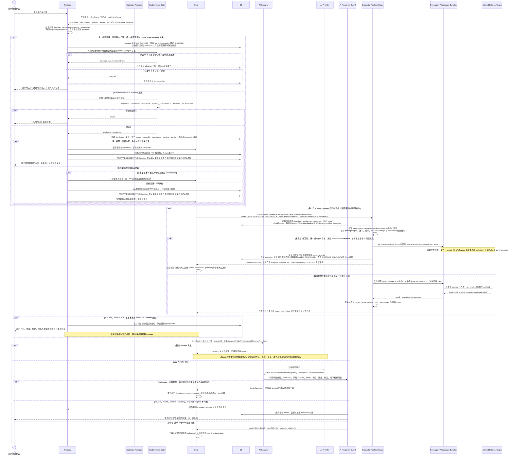
```mermaid
sequenceDiagram
    %% @anchor OSS_003_PLUGIN_TRUST_AND_RUNTIME_ENFORCEMENT
    actor Operator as 用户或维护者
    participant Registry
    participant Package as Extension Package
    participant Suite as Conformance Suite
    participant Core
    participant DB
    participant Gateway as AI Gateway
    participant AI as AI Provider
    participant Guard as AI Response Guard
    participant RuntimeGuard as Connector Runtime Guard
    participant Sandbox as Per-plugin × Workspace Sandbox
    participant Target as Allowed External Target

    %% @anchor PLUGIN_PERMISSION_DIFF
    Operator->>Registry: 安装或升级扩展
    %% @anchor SUPPLY_CHAIN_RELEASE_GATE
    Registry->>Package: 校验来源、checksum、签名和 manifest schema
    Package-->>Registry: capabilities、permissions、runtime、version、terms 与 official scope evidence
    %% @anchor MANIFEST_COMPLIANCE_EVIDENCE_GATE
    Registry->>Registry: 必填校验 termsUrl、termsReviewVersion、reviewedAt<br/>每项 capability/permission 与官方授权范围 evidence
    alt 任一条款字段、审查版本/日期、能力/权限声明或 official scope evidence 缺失
        Registry->>DB: manifest 标记 INCOMPLETE；所有 live write capability 固定 DISABLED<br/>失效其未外发 Plan/Auth；禁止用普通确认弹窗绕过
        Registry->>Suite: 仅评估被明确声明且有合规证据的 read-only/import 子集
        alt 只读/导入子集证据完整且契约测试通过
            Suite-->>Registry: bounded read/import evidence
            Registry->>DB: 只注册该 allowlist 子集；零 L2/L3 写能力
        else 只读/导入也无充分证据
            Suite-->>Registry: reject all
            Registry->>DB: 不注册任何 live capability
        end
        Registry-->>Operator: 展示缺失字段和补齐方式；写能力保持禁用
    else manifest compliance evidence 完整
        Registry->>Suite: 在最小权限沙箱运行契约测试
        Suite->>Suite: capability、permission、workspace、schema、idempotency、reconcile、secret canary
        alt 失败或越权
            Suite-->>Registry: reject
            Registry-->>Operator: 不注册能力并说明原因
        else 通过
            Suite-->>Registry: conformance evidence
            Registry->>DB: 比较 checksum、条款、官方 scope、capability、permission、runtime、version、执行与 reconcile 语义
            alt 任一权限、信任边界、条款或契约语义改变
                %% @anchor PLUGIN_TRUST_CHANGE_INVALIDATION
                Registry->>Core: 暂停受影响 capability；不影响无关 capability
                Registry->>DB: 失效尚未外发的旧 Plan 和授权，写入完整 diff
                Registry->>DB: PREPARED/EXECUTING Operation 按远端证据取消或进入 OUTCOME_UNKNOWN 对账
                Registry-->>Operator: 展示原因和替代方案；重新确认前写能力关闭
            else 契约兼容的实现版本更新
                %% @anchor PLUGIN_EXACT_VERSION_BINDING
                alt 原绑定版本仍被隔离保留且通过 conformance
                    Registry->>Core: 新旧版本并存；旧 Plan 只能路由到精确旧版本
                else 原绑定版本不可用
                    Registry->>DB: 失效尚未外发的旧 Plan 和授权；不得换版本执行
                    Registry->>DB: PREPARED/EXECUTING Operation 按证据取消或进入 OUTCOME_UNKNOWN 对账
                    Registry->>Core: 注册新版本供重新规划；要求新授权
                end
            end
        end
    end
    opt 每一次 Connector/plugin 运行时调用（安装通过也不能跳过）
        Core->>RuntimeGuard: typed request + workspaceId + operationId + action/subject revision<br/>pinned connector/version/package digest + account/credential binding + requested method/capability/targets
        RuntimeGuard->>DB: 读取当前签名 manifest、conformance evidence、用户 grant<br/>officialScopes、精确 Plan/Auth/Operation binding 与 Workspace sandbox generation
        RuntimeGuard->>RuntimeGuard: 计算 method/capability/target/file/secret/schema 的最小交集<br/>校验 package digest、版本、账户、credential lineage 与 workspace 全部相等
        alt 未受信/被篡改、版本或 digest 漂移、未知 method/schema/result，或请求超出任一权限交集
            %% @anchor PLUGIN_RUNTIME_PERMISSION_ENFORCEMENT
            RuntimeGuard->>Sandbox: 在 syscall/HTTP/secret/file 边界前 deny + terminate/quarantine invocation
            Note over Sandbox,Target: 零未授权网络、文件、secret、跨 Workspace 读取或外部 mutation；不得 fallback generic execute
            RuntimeGuard->>DB: 追加去敏安全审计并暂停该 plugin capability<br/>当前 operation 仅在证明请求边界未跨越时 FAILED_CONFIRMED，否则 OUTCOME_UNKNOWN 待 Core 对账
            RuntimeGuard-->>Core: invalid/quarantined；插件自报 workspace/internal IDs、risk/policy/auth/quota/success 全部丢弃
            Core->>Core: 零由该越权结果产生的新 Plan/Authorization/Operation 或领域状态迁移
        else 精确权限交集非空且全部运行时绑定当前
            RuntimeGuard->>Sandbox: 启动绑定 plugin × workspace 的最小文件/网络/secret allowlist 与一次性调用 token
            Sandbox->>Target: 仅发送 schema 允许的目标、method 与最小 payload
            Target-->>Sandbox: typed result + actual target/account/externalRef
            Sandbox-->>RuntimeGuard: result + syscall/egress evidence
            RuntimeGuard->>RuntimeGuard: 再验响应 schema、actual target/account、externalRef 与调用 token
            RuntimeGuard-->>Core: 仅返回经过净化的 typed result；Core 独立提交合法状态迁移
        end
    end
    opt TLS host、redirect URI、数据地域或 AI fallback Provider 变化
        Registry->>DB: 视为权限与信任边界变化；停止受影响 capability
        Registry-->>Operator: 展示 host、地域、预算、隐私与数据用途差异并重新同意
        Note over Registry,Core: 不静默降级到更宽权限、跨地域或超预算 Provider
    end

    Core->>Gateway: typed task + 最小上下文 + requestId + 精确 provider/model/version/capability/manifest digest
    alt 首选 Provider 失败
        %% @anchor AI_FALLBACK_POLICY_GATE
        Gateway-->>Core: pending 或人工处理；不静默调用 fallback
        Note over Core,AI: fallback 必须作为新的精确绑定，逐项通过隐私、地域、保留、能力和预算策略后重新规划/授权
    else 首选 Provider 响应
        Gateway->>AI: 发送绑定请求
        AI-->>Gateway: actual provider/model/version/capability + response + request correlation
        Gateway->>Guard: 校验响应身份、correlation、严格 schema、enum、字段、数量、维度、顺序和有限数
        alt malformed、未知枚举、缺字段或包含未请求动作/权威结论
            %% @anchor AI_STRICT_RESPONSE_SCHEMA
            %% @anchor AI_DRAFT_AUTHORITY_GUARD
            Guard-->>Core: invalid/unknown；只保留 allowlist 内非权威草稿字段
            Core->>Core: 零可执行 Plan/Authorization/outbound；风险和授权始终由 Core 重算
        else provider、model、version、capability、digest 或 request 不一致
            %% @anchor AI_PROVIDER_IDENTITY_GUARD
            Guard->>Registry: 仅暂停该 Provider capability 并记录实际身份
            Guard->>DB: 结果标记 invalid；使相关校准/readiness 失效
            Guard-->>Operator: 要求回归评估与重新校准；零下游外发
        else 身份和 typed response 全部有效
            Guard-->>Core: sanitized typed draft + actual identity + evidence alignment
            Core->>Core: 无输入证据字段仍为 unknown；AI 不能授予 tool 或 authorization
        end
    end
```

`OSS_003_PLUGIN_TRUST_AND_RUNTIME_ENFORCEMENT` 是安装、加载与每次运行的联合门：安装/升级先验证来源、签名、checksum、manifest、条款与 conformance，失败时不注册 live capability；加载和每次调用再验证精确 package digest、版本、Workspace、账号、credential lineage，以及 method/network/file/secret 权限交集，并在 syscall/HTTP/file/secret 边界前阻断越权。任何阶段都不能因为上一阶段曾通过而跳过当前验证，失败均为零未授权读取与零外部 mutation。

安装或升级时，“兼容”不代表可以把旧 Plan 静默交给新实现：旧 Plan 绑定的精确版本只有在该版本仍以隔离方式可用、签名与 conformance 证据有效时才可继续；否则未外发 Plan/Authorization 失效，已开始的 Operation 只按证据取消或对账。平台条款、官方授权范围、runtime、capability、permission、账户范围、执行或 reconcile 语义任一改变，都暂停受影响 capability 并要求重新确认。

AI Provider 返回值始终是不可信输入。Gateway 必须把请求绑定与响应报告的实际 Provider、模型、版本、capability、manifest digest 和 request correlation 对齐；结构化输出采用严格 schema，不为未知枚举或缺失必填字段补默认值，embedding 等批量结果还需校验数量、维度、顺序与有限数。任何身份漂移、silent fallback 或结构无效都不能生成可执行 Plan，并只降级受影响的 Provider capability；AI 产物最多是带证据的 typed draft，风险、事实可信度与授权由 Core 独立计算。

## RF-UML-SEQ-OBS-01 审计、告警、篡改检测与诊断包

```mermaid
sequenceDiagram
    participant Components as Core、Worker、Runner 与 Connectors
    participant Redactor as Structured Redaction Gate
    participant Audit as Append-only Audit Store
    participant Telemetry as Logs、Traces、Metrics、DLQ 与 Diagnostics
    participant Consent as Privacy Settings
    participant Integrity as Integrity Verifier
    participant Alert
    actor User as 候选人或运维者

    %% @anchor AUDIT_COMPLETENESS_GATE
    %% @anchor AUDIT_EXECUTION_ENVELOPE
    Components->>Components: 校验 correlationId、workspaceId、source/sourceEventId、applicationId<br/>planId/revision、operationId/attemptId、actor、actionKind、policyId/version<br/>authorizationId/source/issuedAt/expiresAt、payloadHash、accountId<br/>connectorId/version、idempotencyKey、target identity、outcome 与 externalRef
    Note over Components,Audit: 不适用字段必须写 typed notApplicable(reason)，不能静默缺列；同一 correlation 串联全链路
    alt 任一必填审计绑定缺失或不一致
        Components->>Redactor: 最小拒绝 envelope；只含 opaque IDs、字段缺失码和安全事件
        Redactor->>Audit: append 脱敏拒绝证据
        Components->>Components: 拒绝进入 AUTHORIZED；零 Operation、Outbox 与 outbound
    else envelope 完整
        %% @anchor AUDIT_INTEGRITY
        %% @anchor AUDIT_CORRELATION
        Components->>Redactor: typed audit/diagnostic event；原始 token/cookie/正文/简历字段不出组件边界
        %% @anchor OBSERVABILITY_REDACTION
        Redactor->>Redactor: allowlist 编码；secret/canary 扫描；PII drop/tokenize/hash<br/>限制正文、header、附件、凭证与跨 workspace 字段
        alt 无法可靠分类或 secret/canary 命中
            Redactor->>Telemetry: 拒绝写入所有非必要 sink；只保留无敏感值的 operation error code
            Redactor->>Audit: append 最小 opaque 安全记录
        else redaction 通过
            Redactor->>Audit: append 完整结构化授权/执行事件 + 脱敏 externalRef
            Redactor->>Telemetry: 写本地 logs/traces/metrics/DLQ metadata 的最小字段
        end
    end
    Note over Redactor,Telemetry: logs、trace、metrics、DLQ payload/metadata、alert 和诊断包共用同一 redaction policy<br/>全出口必须零 token/cookie/简历/邮件正文/secret canary，同时保留 operation/attempt/outcome 排障元数据
    %% @anchor AUDIT_TAMPER_FREEZE
    Integrity->>Audit: 连续性、顺序和篡改校验
    alt 删除、修改、插入或乱序
        Integrity->>Alert: SEV-0 完整性事件
        Integrity->>Components: 冻结相关 mutation capability
    else 完整
        Integrity-->>Audit: verified checkpoint
    end
    opt 未授权尝试、cross-workspace 读取/引用/外发、疑似重复、unknown 超时或 kill switch 绕过
        %% @anchor SECURITY_ALERT_DEDUP
        Components->>Redactor: SEV-0 security alert candidate + stable dedupeKey<br/>sourceWorkspace、targetWorkspace 与对象仅使用不可逆 opaque hash
        Redactor->>Alert: 仅发送脱敏且幂等的告警 envelope；相同边界/actor/target/window 合并
        Alert-->>User: 脱敏原因与受影响范围
    end
    opt Operation OUTCOME_UNKNOWN 或约面部分成功
        %% @anchor UNKNOWN_STATUS_PROJECTION
        Components->>Redactor: canonical status + nextAction + opaque correlation
        Redactor->>Audit: 保存单一已脱敏 canonical status 与 nextAction
        Audit-->>Components: UI、API、metrics、alert 使用同一状态投影
        Note over Components,User: 任一出口都不得显示普通失败、成功或 SCHEDULED
    end
    opt 后续对账纠正历史判断
        %% @anchor AUDIT_APPEND_CORRECTION
        Components->>Redactor: correction event，引用原 record/correlation
        Redactor->>Audit: 追加已脱敏 correction event
        Note over Components,Audit: 审计只追加，不覆盖或删除原始观察
    end

    %% @anchor TELEMETRY_EXPLICIT_OPT_IN
    Components->>Consent: 读取 external diagnostic telemetry 设置（默认 OFF）
    alt 未显式 opt-in 或同意已撤销/过期
        Consent-->>Telemetry: 禁止任何网络遥测；本地最小 metrics 仍经 Redactor
    else 用户显式选择目的地、字段、Workspace 与期限
        Consent-->>Redactor: versioned opt-in grant + allowed destination/scope
        Redactor->>Telemetry: 仅导出 grant 范围内已脱敏 telemetry；目的地不可 fallback
    end
    opt 用户生成诊断包
        %% @anchor DIAGNOSTIC_EXPORT_CONSENT
        User->>Audit: 指定单一 Workspace 和时间范围
        Audit->>Redactor: 生成最小候选包；拒绝跨 workspace 数据
        Redactor->>Redactor: 对 audit/log/trace/metrics/DLQ 逐文件扫描 PII、secret 与 canary
        alt 任一命中或范围无法证明
            Redactor-->>User: 阻断导出并只展示字段级原因；零诊断包/遥测外发
        else 扫描通过
            Redactor-->>User: 预览文件清单、字段、大小、hash 与拟导出目的地
            User->>Redactor: 明确确认本次下载/导出
            Redactor->>Telemetry: 生成限定 Workspace/时间范围的无 PII/secret 诊断包
        end
    end
```

## RF-UML-SEQ-RES-01 磁盘、数据库、进程与关键依赖故障

```mermaid
sequenceDiagram
    %% @anchor RES_005_CRITICAL_DEPENDENCIES_FAIL_CLOSED
    participant Gate as Fail-closed Startup Gate
    participant Queue as Durable Queue Store
    participant Worker
    participant DB as Operation Ledger and Indexes
    participant Audit
    participant Vault as Secret Service
    participant Remote
    participant Recovery

    Recovery->>Gate: 进程启动默认 mutation=CLOSED；完整性证明前不能领取任务
    Recovery->>Queue: 启动时校验 queue pages/checksum、lease 与消息引用
    Recovery->>DB: 校验 operation ledger 链、Plan/Auth 外键、状态不变量<br/>idempotency/dedupe unique indexes 与 canonical index checksum
    %% @anchor QUEUE_LEDGER_INDEX_INTEGRITY_FREEZE
    alt queue store、operation ledger 或幂等/去重索引缺失、损坏或不可证明完整
        Queue-->>Recovery: corrupt/missing/unknown
        DB-->>Recovery: corrupt/missing/unknown
        Recovery->>Gate: 保持全局 CLOSED + recovery mode；不依赖已损坏 DB 才能 fail closed
        Recovery->>DB: 若安全可写，仅追加 SEV-0 recovery incident；不得修补/重建缺失 ledger
        Gate->>Worker: 拒绝启动/claim 所有外部 mutation 与 SafetySignal executor
        Note over Worker,Remote: 缺失账本绝不解释为“未执行”；零普通 retry、新 Plan 自动恢复或外部调用
        Recovery->>Recovery: 仅开放 UI、备份、完整性诊断与受控只读远端取证<br/>恢复 last-known-good 后仍需逐 operation 对账与重新授权
    else 三类存储和索引均完整
        Queue-->>Recovery: verified
        DB-->>Recovery: verified canonical ledger/index generation
        Recovery->>Gate: 仅允许带后续逐操作 guard 的 Worker claim
        %% @anchor OPERATION_LEDGER_UNAVAILABLE_FAIL_CLOSED
        Worker->>DB: 每次 claim/prepare 前以只读 challenge 验证 operation ledger 当前可达<br/>可原子 CAS、generation/checksum 与启动证明一致
        alt operation ledger 不可达、只读、写入结果未知或完整性 generation 漂移
            DB--xWorker: unavailable/unprovable
            Worker->>Gate: 立即关闭全部依赖该 ledger 的 mutation claim/dispatch
            Gate->>Queue: 不发新 lease；保留 durable job，不推断“尚未执行”
            Worker->>Worker: 丢弃已取短期 secret handle；禁止明文缓存
            Note over Worker,Remote: 零新 Plan/Auth/Operation/Outbox/Remote 调用；既有不明 operation 待 ledger 恢复后只读对账
            Recovery->>Recovery: 用独立健康面记录故障；无法安全审计时不向损坏 ledger 伪写成功
        else ledger 当前可达、可原子写且 generation/checksum 一致
            DB-->>Worker: 短期 ledgerHealthToken，绑定 generation 与 claim deadline
        end
        Note over Worker,DB: 下述 prepare 事务必须 CAS 消费当前 ledgerHealthToken；失败分支不得进入
        %% @anchor RESOURCE_FAIL_CLOSED
        %% @anchor PREPARE_STORAGE_FAILURE
        %% @anchor DB_BACKPRESSURE
        Worker->>DB: 有界等待 DB connection/lock；单 TX CAS 配额并原子保存<br/>Reservation + PREPARED Operation + AuditIntent + idempotency binding
        alt 磁盘满、达到 DB wait deadline、锁冲突或连接池耗尽
            DB-->>Worker: TX 未提交并完整回滚；零 PREPARED/Reservation 半状态
            Worker->>DB: 只读验证事务边界、关系与 index 未损坏；保留同一输入/幂等键可安全重试
            Worker->>Worker: 有界 backpressure + jitter；不占已提交配额且零 outbound
        else durable commit 与原子配额预留均成功
            DB-->>Worker: committed operationId + reservationId + lease/fencing token
            par 取得短期凭证
                Worker->>Vault: fetch scoped credential
            and 检查审计写入健康
                Worker->>Audit: append pre-execution checkpoint
            end
            %% @anchor CRITICAL_DEPENDENCY_FAIL_CLOSED
            alt Vault 不可用
                Vault-->>Worker: credential unavailable
                Worker->>Worker: fail closed；不缓存明文凭证
            else Audit 不可用
                Audit-->>Worker: checkpoint unavailable
                Worker->>Worker: fail closed；不缓存明文凭证
            else 两者均可用
                Worker->>DB: 执行前 CAS 复核 reservation 仍属该 Operation/attempt<br/>额度未释放、未被消费且 Plan/Auth/payload/expiry/fence 当前
                alt 无原子 Reservation、已释放/消费或绑定已变化
                    DB-->>Worker: not executable
                    Worker->>DB: Operation CANCELLED；释放可证明仍持有的资源；零 Remote 调用
                else Reservation 与全部绑定当前
                    DB-->>Worker: executable
                    Worker->>Remote: mutation
                    Remote-->>Worker: result
                    alt 远端成功后 DB 断开、ENOSPC 或 OOM
                        %% @anchor POST_MUTATION_PERSIST_FAILURE
                        Worker--xDB: success commit failed
                        Recovery->>DB: 恢复后标记 OUTCOME_UNKNOWN
                        Recovery->>Remote: reconcile，副作用不得增加
                    else 正常提交
                        Worker->>DB: SUCCEEDED
                    end
                end
            end
        end
        %% @anchor LEASE_HEARTBEAT_FENCING
        Note over Worker,Recovery: CPU stall、FD 耗尽或 lease 心跳丢失时由 fencing 阻止旧 Worker 提交
    end
```

`RES_005_CRITICAL_DEPENDENCIES_FAIL_CLOSED` 覆盖 scheduler 收到 mutation job 后的三项共同前置：operation ledger 必须当前可达、完整且可原子 CAS；Vault 必须能按精确绑定提供短期 secret handle；持久 Audit checkpoint 必须可写。三者任一不可用或结果不可证明，当前 job 都在 Remote 调用前失败关闭；不得把 secret 降级到明文缓存，不得凭损坏/缺失 ledger 推断“尚未执行”，也不得执行无法持久审计的动作。

## RF-UML-SEQ-OFF-01 Worker 或 Runner 离线后的补拉恢复

```mermaid
sequenceDiagram
    participant Health as Local Health Monitor
    participant Core
    participant Web
    participant Worker
    participant Runner
    participant Connectors as Job、Inbox 与 Calendar
    participant DB
    participant Safety as Isolated Safety Signal Coordinator
    participant SafetyOutbox as Dedicated Safety Outbox Dispatcher
    participant SafetyQueue as Dedicated Safety Queue
    participant SafetyExecutor as Independent Safety Signal Executor
    participant Watchdog as External Watchdog
    participant Alert as Preconfigured External Alert Channel

    %% @anchor OFFLINE_CATCHUP
    Worker->>Safety: 在线时每 60 秒提交最小 health snapshot<br/>pseudonymous instance、sequence、hasPendingWork；无 PII
    Safety->>DB: 读取 heartbeat capability 的有效 7 天 Shadow receipt<br/>当前模式、Policy、固定 endpoint/targetHash、schema/key/ledger 与授权边界
    alt receipt 与全部现行 guard 有效
        Safety->>DB: CAS 创建固定 SafetySignalActionPlan + PolicyEvaluationRecord + 窄化授权<br/>heartbeat Operation + AuditIntent + 专用 Outbox；Plan/Evaluation/Auth/Operation 全部冻结<br/>同一 receipt ID/hash/coverage epoch；key = instance + heartbeat slot
        DB-->>SafetyOutbox: committed heartbeat outbox
        SafetyOutbox->>DB: claim 并复核 slot、binding 与 fencing token
        SafetyOutbox->>SafetyQueue: enqueue(heartbeatOperationId)
        SafetyQueue->>SafetyExecutor: lease(heartbeatOperationId, fencing token)
        SafetyExecutor->>DB: 执行前复核 Plan/Evaluation/Auth/Operation 的同一 receipt ID/hash/coverage epoch<br/>及当前 capability/watchdog binding、固定 schema、endpoint/account/credential lineage/criteria<br/>targetHash、expiry、Policy、control 与 kind
        alt 绑定当前且完整
            SafetyExecutor->>Watchdog: publish fixed heartbeat(idempotencyKey)
            Watchdog-->>SafetyExecutor: accepted、confirmed failure 或 unknown + signal ID
            SafetyExecutor->>DB: 明确接受则 Operation/Plan=SUCCEEDED；明确未发则 Operation=FAILED_CONFIRMED/Plan=FAILED<br/>unknown 则 Operation=OUTCOME_UNKNOWN 且 Plan 保持 EXECUTING；全部审计，unknown 只对账
        else 任一绑定失效或不一致
            SafetyExecutor->>DB: heartbeat Operation=CANCELLED；已进入 EXECUTING 的 Plan=CANCELLED<br/>追加 audit；零 Watchdog 调用
        end
    else receipt 缺失/失效或任一 guard 不通过
        Safety->>DB: 记录 suppress reason；零 Plan/Auth/Operation/Outbox 与零外部 heartbeat
    end
    par 本机仍可运行 Local Health Monitor
        Health->>Core: Worker 或 Runner 连续缺失两次心跳，达到 120 秒
        Core->>DB: 记录 OFFLINE、lastSeenAt 与 coverage gap start
        Core-->>Web: 显示离线组件、受影响能力和仍在运行的范围
        Note over Core,Web: 不显示“持续运行中”，也不伪造离线期间通知
    and 独立 Watchdog 监控整机/Worker
        Watchdog->>Watchdog: 连续缺失两次标记 offline；独立计时
        opt 最后 heartbeat 表示有待处理任务，且离线超过 10 分钟
            Watchdog->>Watchdog: 复核停止告警 capability 的独立 7 天 Shadow receipt<br/>现行窄化授权、固定收件人、schema、expiry 与 durable ledger
            alt receipt 与全部现行 guard 有效
                Watchdog->>Watchdog: CAS immutable Plan/PolicyEvaluationRecord/Auth/Operation/AuditIntent/Outbox<br/>Plan/Evaluation/Auth/Operation 全部冻结同一 receipt ID/hash/coverage epoch；派发前再次复核<br/>四者等值、当前 capability/watchdog binding、endpoint/account/credential lineage/criteria 与幂等键
                alt 创建后执行前任一 receipt/binding/guard 失效或不一致
                    Watchdog->>Watchdog: Operation=CANCELLED；已进入 EXECUTING 的 Plan=CANCELLED<br/>追加 audit；零 Alert 调用
                else 执行前复核仍全部当前
                    Watchdog->>Alert: 向预设收件人发送幂等离线告警
                    Alert-->>Watchdog: accepted、confirmed failure 或 unknown
                    Watchdog->>Watchdog: accepted 时 Operation/Plan=SUCCEEDED；confirmed failure 时 Operation=FAILED_CONFIRMED/Plan=FAILED<br/>unknown 时 Operation=OUTCOME_UNKNOWN 且 Plan 保持 EXECUTING；unknown 只对账，不盲重发
                end
            else 缺少有效 receipt 或 guard 失败
                Watchdog->>Watchdog: 创建前仅记录抑制原因；零 Plan/Evaluation/Auth/Operation/Outbox 与零外部告警
            end
        end
    end
    opt Worker 或 Runner 恢复
        Health->>Core: 新心跳 + runtime version
        Worker->>Safety: 恢复 health snapshot + coverage gap end
        Note over Safety,Watchdog: 下一 heartbeat 仍完整经过固定 Plan、窄化授权、专用 Outbox 与 SafetyExecutor；不得直连
        Core->>DB: 状态 RECOVERING；mutation gate 保持关闭或局部关闭
        Core->>Worker: 从 durable cursor 补拉
        Worker->>Connectors: 读取离线区间岗位、消息、取消和日历变化
        Connectors-->>Worker: 分页、重复或乱序事件
        Worker->>DB: 验签、去重、按 revision 合并
        Worker->>Core: 优先应用拒绝、no-contact、岗位关闭、取消和策略变化
        Core->>DB: 只直接失效尚未外发的陈旧 DRAFT、AWAITING_APPROVAL、AUTHORIZED Plan 与过期任务
        Core->>DB: 对 PREPARED/EXECUTING Operation，证明未发则 CANCELLED；可能已发则 OUTCOME_UNKNOWN
        Core->>Worker: 对其余非终态 Operation 逐项 reconcile；Plan 保持 EXECUTING 到子操作收敛
        Worker->>Runner: probe 凭证与执行能力
        alt 凭证、版本、Policy、授权和控制状态全部仍有效
            Runner-->>Worker: ready
            Core->>DB: ONLINE 或 DEGRADED；短时离线按原有效 capability 模式恢复
            Core-->>Web: 展示覆盖空窗、回补结果和剩余限制
        else 任一项未通过
            Runner-->>Worker: reauth or incompatible
            Core->>DB: 仅受影响能力保持 CLOSED、AUTH_REQUIRED 或 DEGRADED
            Core-->>Web: 给出明确恢复动作
        end
    end
```

外部 Watchdog 是满足整机休眠、断电或断网告警承诺的必要部署能力；它使用显式配置的固定 endpoint/收件人，且只接收最小化状态。未配置或未通过验证时，本地 Core 尚存活可显示进程级离线，整机故障只能在恢复后展示覆盖空窗，因此 DEC-11 的整机离线 Case 仍为实现未通过。
