# RoleFox 组件、部署、安全与可靠性视图

- 状态：Accepted Design Baseline
- 上级索引：[UML 设计基线](README.md)
- 建模原则：先如实描述 M0，再给出 v0.1 目标；未来托管形态不冒充当前承诺。
- 标注规则：节点中的 `M0` 是当前仓库事实，`v0.1 Target` 是尚未实现的目标；产品选择以已接受的 [ADR-0002](../../adr/0002-v0.1-product-decision-baseline.md) 为准。

## RF-UML-CMP-M0-01 当前 M0 真实组件

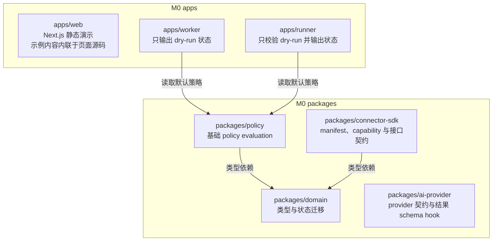

M0 没有 Core API、数据库、队列、Connector/AI 实现、审计、operation ledger、授权令牌发行器、Runner IPC、Exception Service 或 Interview Coordinator。Web 的合成内容是页面源码中的静态演示数据，不是 Worker/Runner 的运行时依赖；Worker 与 Runner 均不会访问外部系统。

## RF-UML-CMP-TARGET-01 v0.1 模块化单体目标

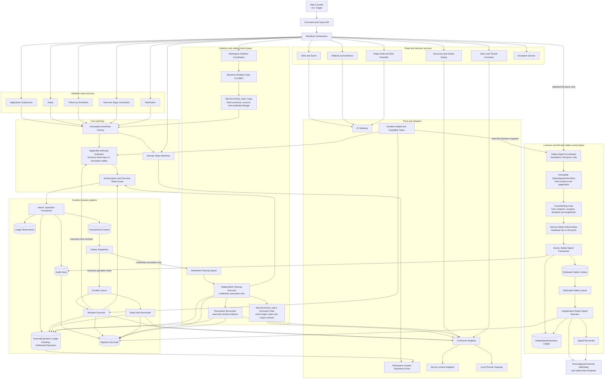

依赖方向固定为 `UI/API → Application Services → Domain/Policy → Ports ← Adapters`。Application Submission、Reply、Follow-up、Interview 和 Notification 都只能产生 mutation intent，并统一经过 `Plan → Policy → Authorization → atomic ExternalOperation/Reservation/AuditIntent/Outbox → Executor`；Notification 的每次主渠道与 fallback 外发也是独立 NotificationOperation。任何模块都不得直连队列或 adapter 绕过该路径。

依据 `DEC-11` 与 `DEC-18`，liveness heartbeat 和一次急停告警由独立 Safety Signal Control Plane 负责，不进入会被 Kill Switch 关闭的业务 Queue。该控制面只接受内部产生的 `publish_liveness_heartbeat` 与 `send_safety_stop_alert`：endpoint、收件人、模板、targetHash 和 credential binding 必须预配置，heartbeat slot 或 kill fencing epoch 是唯一幂等键；每次 signal 仍须持久化窄化授权、SafetySignalOperation、AuditIntent 与专用 Outbox，未知结果只能对账。它不能接受任意文本、任意收件人或任何业务 operation kind。Kill Switch 关闭全部业务 mutation；产品内 Inbox 和审计继续工作，安全信号失败关闭且不得成为通用外发旁路。

Workspace 删除先关闭业务 mutation gate，再启用与 AutomationPolicy/CapabilityGrant 隔离的 `REVOCATION_ONLY` 安全控制面。它只为删除请求快照中的固定 connector/account/credential lineage 生成 `credential_revocation` 计划，并仍走同一 Plan/Auth/Operation/AuditIntent/Outbox 协议。Dispatcher 把该唯一 kind 路由到独立 Cleanup Queue/Executor；Business Executor 拒绝它，Cleanup Executor 则拒绝全部业务 kind。撤销结果未知时 Cleanup Reconciler 只读对账，不能盲重试或重新开放业务外发。

## RF-UML-CMP-EXT-01 Connector 与 Provider 插件边界

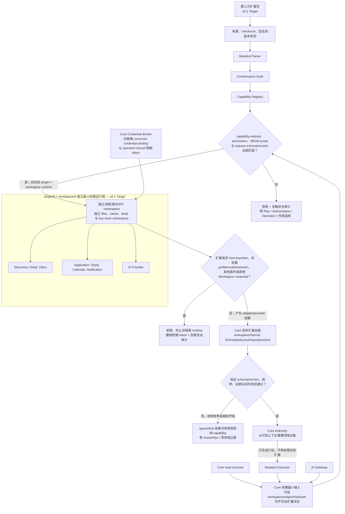

此图整体是 v0.1 目标安全边界，不代表当前 M0 已有进程级 sandbox。扩展 manifest 是能力声明，不是授权。空 allowlist 表示全部禁止；新增权限、official scopes、条款复核版本、runtime、capability-method、schema/enum 或 mutation 语义必须使受影响旧授权失效并展示 Diff。每次调用都重新校验冻结 manifest digest、方法、权限、official scopes、账号和 operation token，安装时通过 conformance 不能代替运行时 guard；未知方法、schema 或枚举失败关闭，不能回退 generic execute。

隔离单元固定为 `pluginId × workspaceId`：进程身份、IPC/socket、文件目录、临时目录、cache 和 key-store namespace 均不得跨单元共享，任何 external id、email 或插件自选 key 都不能越过 Core 派生的 Workspace namespace。扩展永远不能读取宿主 keychain、环境变量秘密、浏览器 profile/cookie/session 或其他插件/Workspace credential；Credential Broker 只在执行时交付绑定 connector account/credential lineage/operation 的短期 token。尝试访问禁区会被拒绝、终止并隔离，且写去敏安全审计。

Connector/Provider 的返回值始终是不可信数据。Core 在 schema 校验前先无条件丢弃扩展自报的 `workspaceId`、内部 entity/plan/authorization/operation id、risk、policy、quota 和 control 字段，再从可信会话、持久对象、当前策略及 operation binding 重建；校验失败或出现未知枚举时零 Plan、零 Authorization、零 ExternalOperation、零领域状态迁移。Connector/Provider 不能签发 Authorization、创建 durable operation 或直接迁移领域状态。

## RF-UML-DEP-M0-01 当前 M0 部署

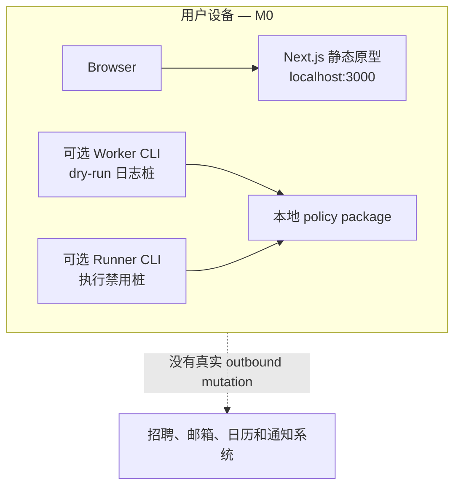

`pnpm dev` 当前只提供 Web 原型；Worker/Runner 是独立安全桩，没有任务、IPC 或外部调用。页面示例内容内联在 Web 源码中，图中故意不建立虚构的 Synthetic 服务依赖。

## RF-UML-DEP-LOCAL-01 v0.1 本地单用户部署

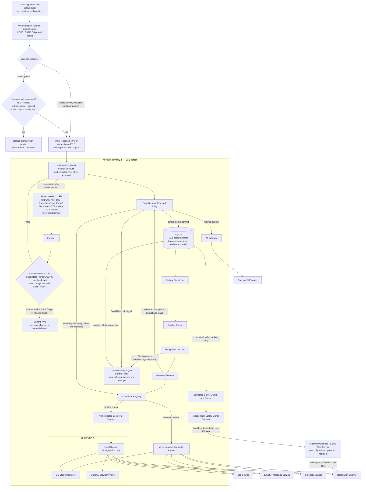

OSS-004 / `LOCALHOST_SECURITY` 的行为契约：Given 是应用以默认本机配置或容器端口映射启动；When 是启动器和集成测试检查监听、认证、CORS、CSRF、Origin 与 cookie；Then 默认只绑定 IPv4/IPv6 loopback，容器 publish 也必须限定宿主 loopback。任何 non-loopback 暴露都必须在监听前验证 TLS、强认证和显式 trusted-origin allowlist，否则拒绝启动。CORS 默认关闭，绝不允许带凭证的 `*` 或 `null` Origin；Browser 请求同时校验精确 Host/Origin，会改变状态的 API 还必须验证会话绑定、一次性/轮换 CSRF token，失败统一 403 且零状态改变。

会话 cookie 由服务端签发并轮换，必须 `HttpOnly`、host-only、`SameSite=Strict`、`Path=/`、短 TTL；HTTPS（包括所有 non-loopback 模式）必须再设 `Secure`，不得设置宽泛 Domain，也不得把 session/CSRF bearer secret 放入 localStorage、URL 或客户端日志。浏览器不能直连 Runner。Worker 只消费 durable queue，Executor 只能经 Registry 按 manifest runtime 分派：`server` adapter 在受控进程执行，`local_session` 必须进入 Runner 凭证边界。Core 和 Worker 不持有可复用 Cookie/Profile，也不直接调用外部业务 mutation。设备离线期间停止运行，恢复后先补采集、对账未知操作，再恢复新动作。

若要满足“整机休眠、断电或断网且有待办时，离线超过 10 分钟仍能外部告警”，部署必须配置独立于本机的 Watchdog/Safety Alert Service。Worker 每 60 秒只把 pseudonymous instance ID、序号、时间和 `hasPendingWork` 提交给本地 Safety Signal Control Plane；后者经固定 Plan、窄化授权、durable Operation、AuditIntent、专用 Outbox/Queue 和独立 Executor 向 Watchdog 发布 heartbeat。Watchdog 连续缺失两次后判定离线，并在最后状态有待办且离线超过 10 分钟时向预设通知渠道告警。未配置或未验证该绑定时，本机只能在 Core 尚存活或恢复后显示离线事实，DEC-11 对整机故障的实现验收不得标记通过。

依据 `DEC-01`、`DEC-06` 与 `DEC-16`，v0.1 官方首条闭环是“开放导入或合规只读岗位源 + 邮件 + 日历 + 通知”，真实外发默认 L2 或人工交接，持久化仅承诺 SQLite；Docker Compose 正式支持 macOS、Windows 和 Linux，macOS 原生开发正式支持，Linux/Windows 原生运行时为 best effort。BOSS 直聘 Connector 与 PostgreSQL 均不阻塞 v0.1。

## RF-UML-DEP-HOSTED-01 未来托管分离模式

这是未来兼容视图，不是 v0.1 当前承诺；PostgreSQL、多数据库兼容和跨数据库迁移只在范围说明与相关 Case 文本中作为 Future/N/A 分支，其支持范围和运维责任留待后续版本决定；追踪 CSV 的 254 条设计映射仍统一为 `ACCEPTED / NOT_VERIFIED`，不使用 applicability 状态。Browser 与 Runner 没有直接连接。服务端只把绑定 plan/operation/hash/kind/account/version/expiry 的一次性执行令牌交给 Runner，不传递或索取可复用 Cookie。依据 `DEC-19`，新主机或恢复实例默认 `STOP_OUTBOUND`，凭证、token 和 L3 活跃授权不能随数据库自动恢复；完成只读重绑与未决操作对账后，系统只能先恢复到 L2，再由用户逐 capability 显式重开满足门槛的 L3。

## RF-UML-SEC-BOUNDARY-01 信任、Workspace 与最小数据边界

```mermaid
%% @anchor TRUST_BOUNDARIES
%% @anchor WORKSPACE_ISOLATION
%% @anchor DATA_MINIMIZATION
%% @anchor AUTH_WORKSPACE_BINDING
%% @anchor AI_CONTEXT_ISOLATION
%% @anchor DATA_WORKSPACE_SCOPE
%% @anchor SHARED_EXTERNAL_ID_NAMESPACE
%% @anchor MULTIUSER_FEATURE_GATE
flowchart LR
    External["外部 JD、消息、附件、Webhook 和网页"]
    Ingress["大小、速率、签名和 MIME Gate"]
    Sandbox["Parser and Content Sandbox"]
    Schema["Runtime Schema Validator"]
    Entry["UI, API or Worker Entry"]
    MultiuserGate{"Multi-user capability implemented<br/>and explicitly enabled?"}
    Disabled["Multi-user route, UI and API unavailable<br/>no partial tenant mode"]
    Authority["Authoritative Workspace Context<br/>session or signed worker token"]
    WorkspaceGate{"All claimed workspace bindings match?<br/>plan, policy, usage, subject and request"}
    Deny["Uniform deny or not-found<br/>zero data, tool and outbound access"]
    SecurityAudit["Redacted security event<br/>no foreign existence or identifier leak"]
    Namespace["Server-derived workspace namespace<br/>for every resource key"]
    ExternalIdentity["external ID, email and provider key<br/>never sufficient as a global key"]
    ResourcePlane["DB, cache, lock, queue, file, log,<br/>backup, credential and result namespaces"]
    Query["Query, search, export or AI task"]
    Scope["Server-applied workspace predicate<br/>plus row ownership verification"]
    Evidence["Evidence and Risk Validators"]
    Core["Core Authority Boundary"]
    Store[("Workspace-scoped Store")]
    ContextKey["AI context key<br/>workspace + campaign + job + thread"]
    ContextGate{"Only same-key approved evidence<br/>and sanitized history?"}
    Quarantine["Quarantine context mismatch<br/>invalidate contaminated cache or vector entry"]
    Minimizer["Context Minimizer and Redactor"]
    AI["AI Provider Boundary"]
    AIResponse["Strict typed response validation<br/>still untrusted"]
    Executor["Mutation Executor"]
    Runtime["Connector Runtime Boundary"]
    Vault["Local Credential Boundary"]
    Mutation["External Mutation Systems"]
    Telemetry["Redacted Logs, Audit and Metrics"]

    External -->|"untrusted bytes"| Ingress --> Sandbox -->|"sanitized but untrusted"| Schema
    Entry --> MultiuserGate
    MultiuserGate -->|"unsupported request"| Disabled
    MultiuserGate -->|"supported or single-user"| Authority
    Authority --> WorkspaceGate
    Schema --> WorkspaceGate
    WorkspaceGate -->|"mismatch or missing"| Deny --> SecurityAudit
    WorkspaceGate -->|"all exact"| Namespace --> Evidence -->|"validated candidate facts and drafts"| Core
    ExternalIdentity --> Namespace --> ResourcePlane --> Store
    Query --> Authority
    Authority --> Scope --> Store
    Scope -->|"ownership mismatch"| Deny
    Core -->|"minimum task context"| ContextKey --> ContextGate
    ContextGate -->|"yes"| Minimizer --> AI
    ContextGate -->|"no"| Quarantine --> SecurityAudit
    AI -->|"unknown output + actual provider identity"| AIResponse --> Schema
    Core -->|"Plan + Authorization only"| Executor --> Runtime --> Mutation
    Runtime -->|"credential reference only"| Vault
    Core --> Minimizer --> Telemetry
    Executor --> Minimizer
    Runtime --> Minimizer
```

信任跃迁只在明确校验后发生：外部字节到受限解析数据、未知数据到 schema 合法值、合法值到 Workspace 所有权验证、草稿到 Evidence/风险绑定的 ActionPlan、计划到期限内 Authorization、远端响应到可对账证据。Workspace 上下文只能来自已认证 session 或签名 worker token；请求体、URL、队列载荷和插件自报的 `workspaceId` 都只是待核对 claim。Plan、Policy、UsageSnapshot、subject 或 request 任一绑定缺失或不一致时，以统一的 deny/not-found 失败关闭，记录脱敏安全事件，且不得泄露另一 Workspace 是否存在，也不得访问其数据、工具或外部账户。

`workspaceId` 必须由服务端写入数据库主键/谓词、缓存键、lock、queue payload、文件路径、日志、备份、credential namespace、AI task 和 connector request；`externalId`、邮箱或 Provider key 绝不能单独作为全局键。查询、搜索、导出和 AI 任务在服务端追加 Workspace 范围并复核行所有权。AI 缓存、向量和历史同时按 `workspace + campaign + job + thread` 隔离，只允许同键、已批准的证据进入最小化上下文；不一致内容被隔离并使受污染缓存失效。若实现尚未通过完整 tenant-isolation Gate，产品不暴露多用户 UI、route 或 API。AI、日志和诊断只得到完成任务所需的最小字段。Core 不接触可复用凭证。

## RF-UML-SEC-CRED-01 凭证、令牌、导出、备份与恢复隔离

```mermaid
%% @anchor CREDENTIAL_ISOLATION
%% @anchor TOKEN_BINDING
%% @anchor AUTH_TOKEN_VALIDATION
%% @anchor AUTH_ACTION_BINDING
%% @anchor IPC_PEER_BINDING
%% @anchor TOKEN_SINGLE_USE_REPLAY
%% @anchor EXPORT_SECRET_EXCLUSION
%% @anchor CLIENT_SECRET_ZERO
%% @anchor REVOCATION_ONLY_CONTROL_PLANE
flowchart TB
    User["候选人"]
    CRED001Given["Given: recruiting Cookie, Browser Profile,<br/>refresh token or local session is connected"]
    CRED001When["When: sync, backup, export, public log,<br/>debug upload, Git commit or release runs"]
    CRED001Then["Then: reusable credential remains only in Vault/Profile;<br/>every other artifact is secret-zero or blocked"]
    BKP002Given["Given: consistent snapshot contains user data<br/>and opaque Connector credential references"]
    BKP002When["When: backup is generated, stored, read or exported"]
    BKP002Then["Then: publish/export only after allowlist + canary,<br/>AEAD, separate key, owner-only storage and scoped access;<br/>otherwise deny before release"]
    FrontendInput["Frontend source, dependency, config<br/>and generated page assets"]
    BuildCanary{"Recursive build artifact scan<br/>JS/CSS/HTML/source map/static page<br/>secret canary and credential patterns = zero?"}
    BlockBuild["Block build and release<br/>redacted security event"]
    Web["Browser / Web Console<br/>verified secret-zero build"]
    Core["Core Authority"]
    APIAllowlist["Public API Response Allowlist<br/>explicit safe fields and redacted account display"]
    ResponseCanary{"Pre-serialization response scan<br/>secret canary and credential patterns = zero?"}
    RejectResponse["Refuse response before bytes leave server<br/>generic safe error + redacted security event"]
    ClientLogAllowlist["Client Log Allowlist and Redactor<br/>no arbitrary object, header or context dump"]
    ClientLogCanary{"Pre-sink client log scan<br/>secret canary and credential patterns = zero?"}
    DropClientLog["Drop log entry<br/>redacted security event"]
    ClientLog["Secret-zero client log"]
    DB[("Business and Operation DB")]
    Token["One-time Operation Token Issuer<br/>signed short-lived jti"]
    Invocation["Execution Invocation<br/>token + authenticated channel evidence"]
    ChannelGate{"Controlled channel and peer?<br/>loopback/device-bound + expected process"}
    TokenGate{"Signature, issuer, audience,<br/>schema and expiry valid?"}
    BindingGate{"Durable bindings all exact?<br/>workspace, plan, authorization, operation,<br/>payloadHash, kind, connector, version,<br/>account and credential lineage"}
    TypeGate{"Typed capability dispatcher accepts<br/>this exact action kind and contract?"}
    ReplayGate{"Atomic single-use jti claim wins<br/>and idempotency binding is unchanged?"}
    RejectToken["Uniform reject + redacted security audit<br/>zero Vault, connector and external call"]
    Runner["Runtime Adapter or Local Runner"]
    LocalCredential["Recruiting-site Cookie, Browser Profile,<br/>refresh token or local session"]
    Vault["OS or Dedicated Credential Store"]
    External["External Account"]
    SyncIngressGate{"Sync/read result response allowlist<br/>credential echo + secret canary = zero?"}
    CredentialIngressBlock["Reject/quarantine result<br/>zero business DB/public log write + security event"]
    DiagnosticCandidate["Public log or explicit debug<br/>bundle/upload candidate"]
    GitCandidate["Git worktree, staged diff,<br/>test fixture or release candidate"]
    CredentialEgressGate{"Destination-specific allowlist/redaction<br/>secret canary and credential pattern = zero?"}
    CredentialEgressBlock["Drop artifact / block upload, commit or release<br/>redacted security event"]
    SafeDiagnostic["Sanitized diagnostic or repository artifact"]
    ExportFilter["Portable User Export<br/>schema allowlist + redaction"]
    ExportSecretGate{"Export secret-canary scan zero?<br/>no reusable secret or credential reference"}
    Export["Portable User Export"]
    Snapshot["Consistent Online Snapshot<br/>no outbound gate required"]
    BackupSerializer["Backup schema allowlist<br/>user data + opaque credential references only"]
    BackupSecretGate{"Secret-canary scan zero?<br/>no reusable secret, token or live L3 authority"}
    BackupReject["Destroy temporary candidate<br/>backup not published + security event"]
    BackupEncrypt["AEAD encrypt + integrity metadata<br/>key handle remains in separate credential domain"]
    BackupStore["Atomic restricted store<br/>owner-only file/ACL and least-privilege process"]
    Backup["Encrypted Backup Artifact"]
    BackupExportGate{"Authenticated owner explicitly exports<br/>one artifact to canonical destination?"}
    BackupExport["Encrypted backup export<br/>same restrictive permissions where supported"]
    BackupAccessDeny["Deny backup read/export<br/>redacted audit; stored artifact unchanged"]
    RestoreGate["Restore, Migrate or Delete Gate<br/>STOP_OUTBOUND"]
    RestoredDB[("Restored Store")]
    Rebind["Read-only Credential Rebind"]
    Reconcile["Remote Reconciliation"]
    Closed["All outbound mutation remains closed<br/>old Plan and Authorization invalid"]
    FreshGrant["Explicit new L2 capability grant<br/>after read-only rebind and reconciliation"]
    L2Enabled["L2 restored<br/>each mutation still requires approval"]
    L3Gate{"Per-capability health checks,<br/>explicit confirmation and L3 thresholds pass?"}
    L2Only["Remain at L2 for this capability"]
    L3Enabled["New L3 grant enabled<br/>for this capability only"]
    DeleteRequest["Confirmed Workspace Delete Request"]
    DeleteGate["Business Mutation Gate CLOSED<br/>drain leases and advance fencing epoch"]
    TargetSnapshot["Immutable revocation target snapshot<br/>connector, version, account, credential lineage"]
    RevokeOnly["REVOCATION_ONLY Control Plane<br/>not a business CapabilityGrant"]
    RevokePlan["CredentialRevocationActionPlan<br/>one fixed targetHash"]
    RevokePolicy["System safety evaluation<br/>business policy cannot grant or widen"]
    RevokeTx["Atomic ActionAuthorization + CredentialRevocationOperation<br/>idempotency key + AuditIntent + Outbox"]
    Cleanup["Independent Cleanup Executor<br/>credential_revocation only"]
    RevocationEndpoint["Fixed External Credential Revocation Endpoint"]
    RevokeResult{"Revocation evidence"}
    RevokeUnknown["OUTCOME_UNKNOWN<br/>no blind retry"]
    RevokeReconcile["Read-only remote revocation reconcile"]
    Residual["Record residual external authorization<br/>and user-visible remediation"]
    LocalErase["Continue bounded local credential and PII deletion"]
    EndRevoke["Expire REVOCATION_ONLY control and tokens"]

    CRED001Given --> LocalCredential
    CRED001Given --> CRED001When
    CRED001When --> SyncIngressGate
    CRED001When --> Snapshot
    CRED001When --> ExportFilter
    CRED001When --> DiagnosticCandidate
    CRED001When --> GitCandidate
    BKP002Given --> BKP002When --> Snapshot
    Backup --> BKP002Then
    BackupExport --> BKP002Then
    FrontendInput --> BuildCanary
    BuildCanary -->|"hit or scanner unavailable"| BlockBuild
    BuildCanary -->|"zero"| Web
    User --> Web --> Core --> DB
    Core -->|"public response candidate"| APIAllowlist --> ResponseCanary
    ResponseCanary -->|"hit or scanner unavailable"| RejectResponse
    ResponseCanary -->|"zero"| Web
    Web -->|"structured diagnostic event only"| ClientLogAllowlist --> ClientLogCanary
    ClientLogCanary -->|"hit or scanner unavailable"| DropClientLog
    ClientLogCanary -->|"zero"| ClientLog
    Core -->|"issue only from durable current bindings"| Token --> Invocation --> ChannelGate
    ChannelGate -->|"no"| RejectToken
    ChannelGate -->|"yes"| TokenGate
    TokenGate -->|"no"| RejectToken
    TokenGate -->|"yes"| BindingGate
    DB -->|"authoritative Plan, Authorization and Operation"| BindingGate
    BindingGate -->|"no"| RejectToken
    BindingGate -->|"yes"| TypeGate
    TypeGate -->|"no"| RejectToken
    TypeGate -->|"yes"| ReplayGate
    ReplayGate -->|"replayed, spent or changed"| RejectToken
    ReplayGate -->|"yes, atomically mark spent"| Runner
    LocalCredential -->|"import/connect once into local domain"| Vault
    Runner <-->|"obtain scoped credential for exact bound account"| Vault
    Runner -->|"execute bound external request"| External
    External -->|"sync/read result; no credential is trusted back"| SyncIngressGate
    SyncIngressGate -->|"hit, malformed or scanner unavailable"| CredentialIngressBlock
    SyncIngressGate -->|"zero and schema-valid"| Core
    Core --> DiagnosticCandidate --> CredentialEgressGate
    GitCandidate --> CredentialEgressGate
    CredentialEgressGate -->|"hit or scanner unavailable"| CredentialEgressBlock
    CredentialEgressGate -->|"zero"| SafeDiagnostic
    DB --> ExportFilter --> ExportSecretGate
    ExportSecretGate -->|"hit or scanner unavailable"| CredentialEgressBlock
    ExportSecretGate -->|"zero"| Export
    DB --> Snapshot --> BackupSerializer --> BackupSecretGate
    BackupSecretGate -->|"hit or scanner unavailable"| BackupReject
    BackupSecretGate -->|"zero"| BackupEncrypt --> BackupStore --> Backup
    Vault -.->|"backup encryption key handle; never same artifact"| BackupEncrypt
    Backup --> BackupExportGate
    BackupExportGate -->|"no, stale session or unsafe destination"| BackupAccessDeny
    BackupExportGate -->|"yes"| BackupExport
    Backup --> RestoreGate --> RestoredDB
    Core --> CRED001Then
    CredentialIngressBlock --> CRED001Then
    CredentialEgressBlock --> CRED001Then
    SafeDiagnostic --> CRED001Then
    Export --> CRED001Then
    Backup --> CRED001Then
    BackupReject --> BKP002Then
    BackupAccessDeny --> BKP002Then
    User --> Rebind
    RestoredDB --> Rebind --> Reconcile --> Closed --> FreshGrant --> L2Enabled --> L3Gate
    L3Gate -->|"no"| L2Only
    L3Gate -->|"yes, new L3 grant"| L3Enabled
    User --> DeleteRequest --> DeleteGate --> TargetSnapshot --> RevokeOnly
    RevokeOnly --> RevokePlan --> RevokePolicy --> RevokeTx --> Cleanup --> Token
    Runner -->|"revocation or read-only status<br/>for fixed account"| RevocationEndpoint --> RevokeResult
    RevokeResult -->|"succeeded or already absent"| LocalErase
    RevokeResult -->|"confirmed failure"| Residual --> LocalErase
    RevokeResult -->|"ambiguous"| RevokeUnknown --> RevokeReconcile --> Runner
    RevokeReconcile -->|"deadline or still ambiguous"| Residual
    LocalErase --> EndRevoke
```

CRED-001 / `CREDENTIAL_ISOLATION` 的行为契约：Given 是招聘网站 Cookie、Browser Profile、refresh token 或 local session 已连接；When 是 Connector 同步、备份、普通用户导出、公共日志生成、debug bundle/upload、Git stage/commit 或 release；Then 可复用凭证始终只留在授权本地 Vault/Profile 域。Runner 只按精确 operation binding 取得短期句柄，Connector 的同步响应先删除 auth/cookie echo 并通过 schema/secret-canary 门才可写业务 DB。所有诊断、上传、导出和 Git 候选都按目的地 allowlist、redaction 与 canary 扫描；命中或扫描器不可用即丢弃/隔离并阻断上传、commit 或 release，只记录不含命中值的安全事件。debug upload 默认关闭，显式开启也不能读取 Vault/Profile 路径。业务库、公共日志、Git 历史、debug 服务和用户数据导出至多得到不可用来认证的去敏账号显示信息，绝不获得 secret、原 Cookie/Profile、token 或 session。

Web frontend 的编译产物必须递归扫描 JS、CSS、HTML、静态页面和 source map；命中 secret canary、credential/token/key 模式或扫描器不可用时，构建与发布均失败关闭并写不含命中值的安全事件。公开 API 只按响应 schema allowlist 序列化安全字段，并在字节离开服务端前再次扫描；命中时拒绝整个响应，只向 Browser 返回固定通用错误并写去敏安全事件，不能通过部分字段、错误堆栈或调试 header 泄漏。客户端日志只接受明确 allowlist 的结构化诊断字段，禁止序列化 request/response/header/context 任意对象；写入 sink 前的 canary 扫描命中或不可用即丢弃整条日志并记录服务端安全事件。因此页面源码、运行时响应、DOM 输入和 client log 都保持 secret-zero，而不是依靠前端隐藏字段。

令牌至少绑定 `workspace + plan + authorization + operation + payloadHash + kind + connector + account + credential lineage + connectorVersion + issuer + audience + expiry + jti`，不能持久复用；陈旧 UI、页面文本、connector 自报字段或队列消息都不是授权。Runner/server adapter 先验证受控通道和预期 peer/process，再校验签名、issuer、audience、schema 与期限，并把所有 claim 与 durable Plan、Authorization、Operation 做逐字段运行时复核；类型层同时以 capability 专用接口阻止跨 action kind 调用。任一失败都统一拒绝、只写脱敏安全审计且为零 Vault、connector 和外部调用，连接器不得接受备用 token、静默降级或泄露目标是否存在。`jti` 只有在前置校验全部通过后才能以原子 CAS 声明为已使用；重放、过期或改绑账号、payload、operation、kind、connector/version 的 token 均失败关闭。

Vault 只向已校验绑定的 Runner/runtime adapter 提供 scoped credential；它不与 External Account 建立网络连接。Runner 使用该凭证执行绑定请求，Core、DB 和一次性 token 中只保存 credential reference 与不可变账号绑定。

BKP-002 / `EXPORT_SECRET_EXCLUSION` 的行为契约：Given 是一致性快照包含用户数据及 Connector credential reference；When 是生成、存储、读取或导出备份；Then serializer 只允许业务数据和不具认证能力的 opaque reference，临时产物先做 secret-canary 扫描，再用 AEAD 与完整性元数据加密，解密 key 只以独立 Vault handle 存在且绝不与 artifact 同包。生成与存储进程使用最小权限身份，目录/文件或平台 ACL 仅允许当前 owner，临时文件原子发布；导出要求重新验证的 owner 会话、单一 artifact 的 scoped read 和 canonical 安全目的地，不能列举或导出其他 Workspace 备份。任一 secret 命中、scanner/key/permission 失败或越权都在发布/读取前拒绝，销毁临时候选但不破坏既有备份，并写去敏审计。

在线备份使用一致性快照，不需要暂停正常 mutation；若无法保证一致性则备份失败关闭。Restore、跨主机 migrate 和 workspace delete 必须先进入 `STOP_OUTBOUND` 并排空/冻结执行租约。恢复后即使保留策略历史，也不恢复凭证、token 或 L3 活跃权威：用户先以最小只读权限重新绑定 connector，完成所有未决 operation 的远端对账。依据 `DEC-19`，恢复只能从全局关闭进入新的 L2 capability grant；L3 必须逐 capability 重新通过健康检查、显式确认与升级门槛，旧 Plan、Authorization 与活跃授权一律失效。

删除期间的 `REVOCATION_ONLY` 是独立、窄化且限时的系统安全控制面，不是解除 STOP_OUTBOUND，也不属于 `DRY_RUN / L2_CALIBRATION / L3_LIMITED` 或任一业务 CapabilityGrant。它只能对删除请求开始时冻结的固定目标执行 `credential_revocation`；每个目标仍需不可变 Plan、系统安全评估、绑定 Authorization、durable Operation、AuditIntent 与 Outbox，并由独立 Cleanup Executor 消费。Executor 对 kind、deletionRequestId、workspace、connector/version、account、credential lineage、targetHash、token audience 与 expiry 任一不符都失败关闭。

明确成功或“远端已不存在”才收敛为成功；超时、断线和歧义进入 `OUTCOME_UNKNOWN`，只允许读取远端授权状态进行对账。外部服务持续失败时记录 residual authorization 和人工处置说明，但到达删除流程的明确期限后仍继续本地凭证与 PII 删除；随后销毁 REVOCATION_ONLY 控制、未使用 token 和目标快照中的敏感引用。

## RF-UML-REL-MUT-01 外部 mutation 统一可靠性协议

```mermaid
%% @anchor MUTATION_PROTOCOL
%% @anchor QUE_013_APPLICATION_ACTION_CAS
flowchart LR
    Draft["Validated Mutation Intent"] --> Plan["Immutable ActionPlan"]
    Plan --> IdempotencyLookup{"Workspace + operation kind + idempotency key<br/>already in durable ledger?"}
    IdempotencyLookup -->|"same payload binding"| ExistingState{"Existing operation state"}
    ExistingState -->|"terminal"| ReturnExisting["Return canonical stored result<br/>zero new operation, quota or adapter call"]
    ExistingState -->|"non-terminal"| JoinExisting["Return current status / join reconciliation<br/>zero parallel adapter call"]
    IdempotencyLookup -->|"same key, different payload"| IdempotencyConflict["Reject + Exception and security audit<br/>zero external call"]
    IdempotencyLookup -->|"absent"| Evaluate{"Applicable Authority Decision<br/>business three-layer or REVOCATION_ONLY safety"}
    Evaluate -->|"deny or preview_only"| NoOp["No Operation Created"]
    Evaluate -->|"require approval"| Approval["Await Human Approval"]
    Approval -->|"same payload approved"| Reevaluate["Re-evaluate current safety, policy and control"]
    Reevaluate -->|"not allowed"| NoOp
    Reevaluate -->|"allowed"| AuthCandidate["Authorization Candidate<br/>bound to current plan and decision"]
    Evaluate -->|"allowed"| AuthCandidate

    subgraph AtomicTx["One atomic database transaction"]
        Commit{"Applicable subject/action mutex?<br/>if yes: expected subject stateVersion + CAS"}
        Conflict["CAS or mutex lost<br/>rollback entire transaction"]
        Authorization["Durable ActionAuthorization"]
        Operation["1..* ExternalOperation<br/>QUEUED"]
        Reservation["0..* UsageReservation<br/>RESERVED"]
        SlotReservation["0..1 InterviewSlotReservation<br/>RESERVED"]
        AuditIntent["AuditIntent"]
        Outbox["1..* OutboxEvent<br/>PENDING"]
        Commit -->|"not applicable or guard won"| Authorization
        Commit -->|"not applicable or guard won"| Operation
        Commit -->|"not applicable or guard won"| Reservation
        Commit -->|"not applicable or guard won"| SlotReservation
        Commit -->|"not applicable or guard won"| AuditIntent
        Commit -->|"not applicable or guard won"| Outbox
        Commit -->|"guard lost"| Conflict
        Commit -->|"DB, AuditIntent or Outbox write fails"| AtomicFailure["Rollback whole transaction<br/>zero enqueue and zero remote call"]
        Authorization --> Operation
    end

    AuthCandidate --> Commit
    Conflict --> NoOp
    AtomicFailure --> NoOp
    Outbox --> Dispatcher["Outbox Dispatcher"] --> KindRoute{"Validated operationKind"}
    KindRoute -->|"business kind"| Queue["Durable Business Queue"] --> Executor["Mutation Executor"] --> Lease["Acquire Lease and Fencing Token"]
    KindRoute -->|"credential_revocation"| CleanupQueue["Dedicated Cleanup Queue"] --> CleanupExecutor["Independent Cleanup Executor"] --> CleanupGate["REVOCATION_ONLY exact-target gate"] --> Lease
    Lease --> Recheck{"Execution-time Recheck<br/>authority, kind, target and subject stateVersion"}
    Recheck -->|"applicable authority denies, expired, stale or mismatched"| Cancel["No Remote Call<br/>Operation = CANCELLED"]
    Recheck -->|"valid"| ACTP002Given["Given: Plan/Auth current and unexpired,<br/>Kill Switch off, capability healthy, Executor online"]
    ACTP002Given --> Adapter["Specialized Runtime Adapter"] --> Remote["External Mutation"]
    Remote --> Result{"When: classify external response<br/>using verifiable evidence"}
    Result -->|"evidence proves success"| SuccessTx["Atomic outcome transaction<br/>Operation = SUCCEEDED + minimal external evidence<br/>ActionPlanRecord = SUCCEEDED when all required ops succeed<br/>Application stage CAS when applicable<br/>consume reservation + durable outcome AuditIntent"]
    SuccessTx -->|"commit"| Success["Canonical stored success"]
    SuccessTx -->|"DB, CAS or outcome-audit intent failure"| PersistFence["Do not acknowledge success<br/>fence same operation/idempotency key<br/>recover as unresolved, then reconcile only"]
    Result -->|"evidence proves no execution"| Failed["FAILED_CONFIRMED<br/>release reservation"]
    Result -->|"timeout, crash, disconnect or ambiguity"| Unknown["OUTCOME_UNKNOWN<br/>hold conservative reservation"]
    Unknown --> Reconcile["Read-only Remote Reconcile"]
    Reconcile -->|"unique success found"| SuccessTx
    Reconcile -->|"non-execution proved"| Failed
    Reconcile -->|"cannot decide uniquely"| Manual["Manual Review<br/>no automatic retry"]
    PersistFence --> Reconcile
    Success --> ReturnExisting
    Success --> AuditProjection{"Project durable outcome AuditIntent"}
    AuditProjection -->|"sink available"| Audit
    AuditProjection -->|"sink unavailable"| AuditRetry["Retry audit projection only<br/>never replay mutation"] --> AuditProjection
    Cancel --> Release["Release Reservation"]
    Operation --> Audit["Append-only Outcome Audit"]
    Cancel --> Audit
    Failed --> Audit
    Unknown --> Audit
    Manual --> Audit
```

ACT-P0-02 / `MUTATION_PROTOCOL` 的行为契约：Given 是不可变 ActionPlan 已由当前 policy 授权、Plan/Auth 未过期、Kill Switch 关闭、绑定 capability 健康且 Executor 在线；When 是 adapter 返回带稳定 externalRef/request ID 的可验证成功；Then 系统在一个 outcome 事务中把 ExternalOperation 置为 `SUCCEEDED`、保存最小外部证据（外部引用、发生时间、结果码与响应 hash，不保存无关正文）、在全部必需子操作成功时把 ActionPlanRecord 置为 `SUCCEEDED`、以 CAS 推进对应 Application 阶段、消费 reservation 并写 durable outcome AuditIntent。只有事务提交后才能向调用者宣称成功。

相同 Workspace、operation kind 与 idempotency key 的重放先查 durable ledger：payload binding 相同则直接返回既有终态结果，非终态则返回/加入同一个对账，不新建 operation、不重复计数也不调用 adapter；同 key 不同 payload 直接拒绝并创建异常。若准备事务中的 DB/AuditIntent/Outbox 任一失败，整笔回滚且零入队、零外发；若外部成功后 outcome DB、Application CAS 或 audit intent 落盘失败，则不得返回成功或换 key 重试，必须 fence 原 operation，在存储恢复后按同一 idempotency key 只读对账并重新提交 outcome 事务。后续 Audit projection/sink 故障只从 durable AuditIntent/Outbox 重试审计投影，绝不能重放外部 mutation。

该统一业务协议适用于投递、撤回、普通/跟进/面试确认回复、日历创建/更新/取消、主/备用通知和删除期凭证撤销。普通计划通常创建一个 operation 与一个 operation outbox；ScheduleInterviewActionPlan 在一个事务中持久化同一 Authorization、slot/quotas、calendarOp、replyOp、AuditIntent 和一个 Saga 启动作业。两个子 operation 都是 QUEUED，但 Saga Executor 必须在 calendar 成功证据事务落盘后才开始 reply，不能靠另一个未定义的 operation 状态表达依赖。事务 outbox 消除“数据库已记 operation 但任务未入队”或“任务已入队但 operation 未落库”的双写窗口；Dispatcher 可以重放，Executor 依靠 operation idempotency、lease 与 fencing 防止并发副作用。SafetySignal 不属于业务 mutation；它是唯一独立、窄化且同样 durable 的安全协议，必须使用固定 SafetySignalActionPlan、SafetySignalOperation、AuditIntent 和专用 Outbox。

Dispatcher 必须先验证封闭 OperationKind，再把业务 kind 与 `credential_revocation` 分流。后者只进入独立 Cleanup Queue/Executor，并在获取 lease 后再次验证 REVOCATION_ONLY、删除请求和固定目标；Business Executor 遇到该 kind、Cleanup Executor 遇到任一业务 kind，都必须 quarantine 且零外发。

执行前必须重新校验 Workspace、ActionPlan hash 与 stale 状态、Authorization、适用权威（业务三层策略或删除期 REVOCATION_ONLY 安全控制）、operation kind/target、quota reservation、connector/runtime/account/version、credential health 和 control/fencing。`paused` / `killed` 由业务三层权威拒绝业务 kind，但不能越权否决仍有效的删除期 `REVOCATION_ONLY`；后者只能由删除期限、固定目标绑定或自身安全控制失效来拒绝。只有可验证的远端证据才能把 operation 置为 SUCCEEDED 或 FAILED_CONFIRMED；`OUTCOME_UNKNOWN` 在只读对账完成前禁止自动重试。

仅当 mutation 关联权威业务主体且其 action kind 属于该主体声明的互斥集合时，才使用持久 subject/action key 与 expected subject stateVersion；例如同一 Application 的投递/撤回、同一 Thread 的旧回复/新回复、同一 Interview 的取消/确认。事务内 CAS 只有一个胜者能创建 Authorization、Operation 和 Outbox，失败者整笔回滚且零副作用。没有主体或不存在互斥关系的动作不强加 Application mutex，但仍执行各自聚合版本与幂等校验。排队后主体状态再次变化时，execution-time recheck 把旧 operation 置为 CANCELLED，不能凭早先授权覆盖新状态。

## RF-UML-REL-SAGA-01 自动约面复合操作与补偿

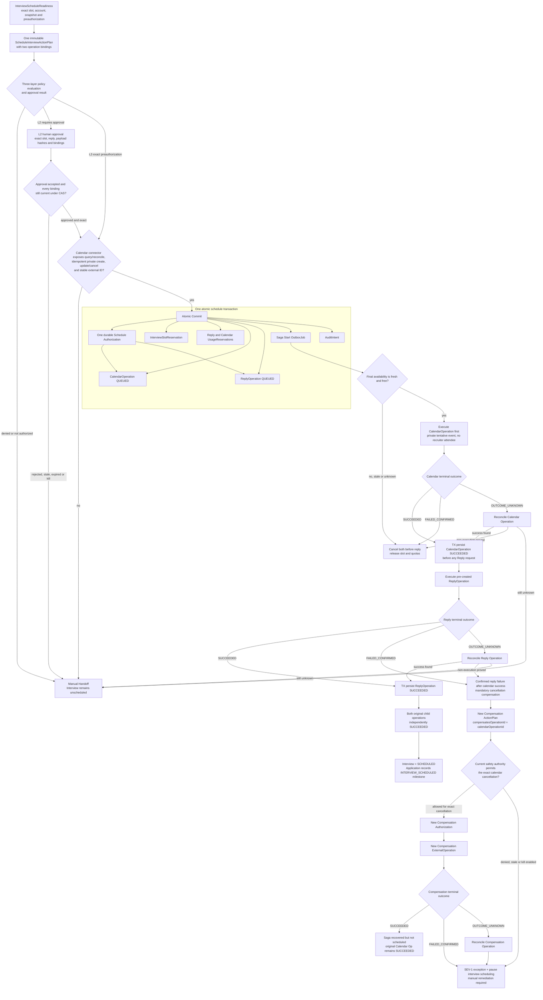

Calendar 与 Reply 是同一 ScheduleInterviewActionPlan、同一 ActionAuthorization 下的两个 durable child operation，但各自拥有 idempotency key、payload hash、externalRef、lease、结果和对账状态。L2 必须由用户批准完整、不可变的双操作计划，并在原子提交前以 CAS 复核所有绑定；L3 只能命中精确 SchedulePreauthorization。它们与 Compensation 都执行 RF-UML-REL-MUT-01；Compensation 使用全新的计划、授权和操作，若当前安全权威、期限或 Kill Switch 不允许取消，不能绕过授权，直接进入 `SEV-1` 与人工处置。Saga 只汇总事实：成功子操作保持 SUCCEEDED，不因另一子操作失败或补偿成功而被改写；图中没有回边重新执行已成功步骤。

依据 `DEC-08`、`DEC-12` 与 `DEC-20`，v0.1 约面采用 calendar-first：先创建不邀请招聘方、不触发外部邀请通知的私密 tentative 日历事件，成功与 externalRef 事务落盘后，同一个 Saga Executor 才能执行预创建的 ReplyOperation。L3 日历 Connector 必须同时具备查询/对账、幂等创建私密事件、更新/取消和稳定 external ID；若回复明确失败，必须创建独立补偿计划取消事件，补偿失败或结果持续未知升级为 `SEV-1` 并暂停约面能力。只有两个**原始**子操作均有明确成功证据时，Interview 才进入 `SCHEDULED`，Application 只记录 `INTERVIEW_SCHEDULED` milestone。导入或损坏状态中的 legacy reply-first 只能只读对账；仅当两侧都有唯一、可验证且绑定一致的成功证据时记录真实 `BOTH_SUCCEEDED`，否则人工接管，绝不自动补建缺失事件或重发回复。

## RF-UML-REL-BOOT-01 初始化、协议版本与本地文件启动门

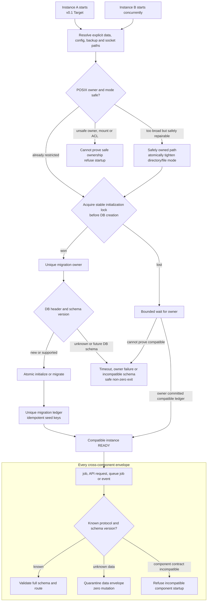

初始化锁位于确定的数据目录，必须先于数据库文件与 seed 创建；migration ledger 同时使用数据库唯一约束，避免仅依赖进程内 mutex。竞争实例只能有界等待并在验证最终 schema/ledger 后启动，否则安全退出。Owner 崩溃后，新实例只能在确认事务未提交或租约可接管后继续，不能并发重放非幂等 migration。

启动时检查数据目录、DB、backup、credential、配置与 IPC/socket 的所有者、POSIX mode、ACL 和容器 UID/GID。仅当路径由当前可信主体拥有且没有链接/挂载竞态时才自动收紧；否则拒绝启动。新文件以限制性 mode 原子创建，不能“先宽后 chmod”。所有 job/API/event 都带显式 protocol/schema version；未知数据进入 quarantine，未知 DB 或组件协议拒绝启动，绝不使用默认字段执行 mutation。

## RF-UML-SEC-KEY-01 加密密钥轮换与崩溃恢复

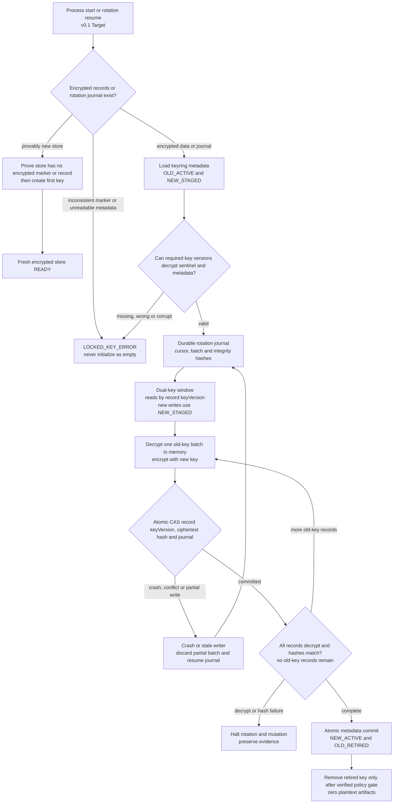

每条密文保存 `keyVersion` 与完整性元数据，轮换状态和批次游标先于批处理 durable 落盘。进程可在 OLD/NEW 双 key 窗口中恢复读取，但任何解密、sentinel 或 hash 失败都进入锁定/人工恢复，不能把已有数据误判为空 Workspace 并覆盖。每批只在内存中短暂持有明文，CAS 失败丢弃后重读；全量验证完成前旧 key 不退休，备份仍不包含任何解密 key。

## RF-UML-SEC-EXT-01 Connector 身份、Token、TLS 与条件写安全门

```mermaid
%% @anchor EXT_001_REMOTE_IDENTITY_PREFLIGHT
%% @anchor EXT_002_REFRESH_SINGLE_FLIGHT
%% @anchor EXT_017_TLS_REDIRECT_REVALIDATION
%% @anchor COM_015_CALENDAR_ETAG_CONFLICT
%% @anchor CONNECTOR_TARGET_ALLOWLIST
flowchart TB
    Operation["Authorized ExternalOperation<br/>immutable URL or file target plus<br/>expected connector, account, org and workspace"]
    TargetKind{"Closed target kind<br/>network_url or sandbox_file?"}
    UrlCanonical["Strict URL parse and canonicalize<br/>scheme, IDNA host, port and path<br/>resolve every address before target access"]
    NetworkGate{"HTTPS and canonical destination allowlisted?<br/>No localhost, loopback, private/link-local/reserved IP,<br/>cloud metadata host/IP or DNS rebinding"}
    FileCanonical["Decode once and normalize relative path<br/>against pre-opened connector workspace root"]
    FileGate{"Operation-specific path/type allowlisted?<br/>No absolute path, traversal, NUL, outside-root,<br/>symlink escape, device or special file"}
    FileOpen["Brokered openat from fixed root<br/>no-follow every component, then fstat"]
    FileResult["Validated sandbox file result evidence"]
    TargetDeny["Fail closed + redacted security event<br/>zero target file content I/O, zero request to rejected host<br/>and zero external mutation"]
    Credential["Credential Broker lookup by exact binding<br/>no default-account fallback"]
    TLS{"HTTPS, certificate, hostname and destination allowlist valid?"}
    Redirect{"Redirect received?"}
    Hop["Treat next hop as a new target<br/>strip cross-origin credentials, canonicalize again"]
    TransportDeny["Fail closed<br/>no HTTP downgrade or mutation"]
    Identity["Remote identity preflight<br/>whoami, account and organization"]
    IdentityMatch{"Identity equals immutable Plan binding?"}
    IdentityDeny["Disable bound capability<br/>Exception and zero mutation"]
    Call["Connector call with operation idempotency key"]
    Response{"Connector response"}
    Flight["Single-flight refresh keyed by<br/>connector + account + token lineage"]
    Followers["Concurrent callers wait for same refresh result"]
    Refresh{"Refresh result"}
    Rotate["Atomically advance token lineage<br/>invalidate old token"]
    CapabilityOff["Refresh failed<br/>disable only bound capability"]
    Retry["Retry at most once with same operation<br/>then repeat identity preflight"]

    Calendar{"Calendar update or delete?"}
    BoundEtag["Plan binds eventId, provider revision and expected etag"]
    Conditional["Conditional write<br/>If-Match expected etag"]
    Conflict["412/version conflict<br/>FAILED_CONFIRMED, zero overwrite<br/>re-read then create a new Plan"]
    Result["Three-way execution result evidence"]

    Operation --> TargetKind
    TargetKind -->|"unknown"| TargetDeny
    TargetKind -->|"network_url"| UrlCanonical --> NetworkGate
    NetworkGate -->|"invalid or ambiguous"| TargetDeny
    NetworkGate -->|"valid"| Credential --> TLS
    TargetKind -->|"sandbox_file"| FileCanonical --> FileGate
    FileGate -->|"invalid or ambiguous"| TargetDeny
    FileGate -->|"valid"| FileOpen
    FileOpen -->|"symlink, race, special file or error"| TargetDeny
    FileOpen -->|"safe regular file inside root"| FileResult --> Result
    TLS -->|"invalid"| TransportDeny
    TLS -->|"valid"| Redirect
    Redirect -->|"yes within bounded hop count"| Hop --> UrlCanonical
    Redirect -->|"no"| Identity --> IdentityMatch
    IdentityMatch -->|"mismatch or ambiguous"| IdentityDeny
    IdentityMatch -->|"exact match"| Calendar
    Calendar -->|"no"| Call
    Calendar -->|"yes"| BoundEtag --> Conditional
    Call --> Response
    Conditional --> Response
    Response -->|"412 or etag conflict"| Conflict
    Unknown["OUTCOME_UNKNOWN<br/>no same-operation retry"]
    Reconcile["Read-only remote reconcile"]
    Response -->|"accepted or confirmed failure"| Result
    Response -->|"timeout, proxy anomaly or ambiguous response"| Unknown --> Reconcile --> Result
    Response -->|"pre-mutation 401 or proven zero side effect"| Flight --> Followers --> Refresh
    Refresh -->|"success"| Rotate --> Retry --> TLS
    Refresh -->|"failure or revoked"| CapabilityOff
```

所有 Connector URL、network destination 和 file target 都先从不可变 Plan 读取，再经过严格解析、单次解码、canonicalization 与 operation-specific allowlist；运行时输入、页面文字、插件返回值或重定向头不能扩展 allowlist。URL 只允许 HTTPS，规范化 scheme、IDNA hostname、显式 port 与 path 后，解析出的**全部**地址都必须仍在许可目的地范围；`localhost`、loopback、RFC1918/private、link-local、unspecified/reserved/multicast 地址、云 metadata hostname/IP（包括 `169.254.169.254`）及 DNS rebinding 一律拒绝。每个 redirect hop 都当成新目标重新 canonicalize、解析 DNS、验证地址/host allowlist、证书和 hostname，限制跳数且跨 origin 不转发 credential；任一 hop 失败都不会向被拒目标发送请求或 mutation。

文件 target 必须是相对于预配置 `pluginId × workspaceId` connector root 的 allowlisted 相对路径。拒绝 absolute path、盘符/UNC、NUL、重复或编码 traversal、规范化后的 `..`、root 外路径、symlink/hard-link escape、device/socket/FIFO 等特殊文件；实际打开只能从预打开 root 使用逐级 no-follow 的 `openat` 并在使用前 `fstat` 复验，竞态或无法证明归属即拒绝。失败路径在读取/写入任何目标内容、访问 Vault 或调用 Connector 前结束，写入不含原始秘密/路径的安全事件，保证零目标文件内容 I/O、零向被拒 host 的 outbound 与零外部 mutation。

远端 identity preflight 是 mutation 的执行时门禁，必须验证账号、组织/租户和 Workspace 绑定；不一致、缺字段或多义结果都拒绝，Connector 不能回退到 SDK 默认账号、最近登录账号或其他 Workspace 凭据。

Token refresh 以 connector、账号和 token lineage 为 single-flight key；并发 401 的 follower 复用同一刷新结果。只有 401 发生在 mutation 请求发出前，或远端协议能证明该请求产生了零副作用，刷新成功后才允许同一 operation 有界重试一次，并重新执行 TLS 与 identity preflight。超时、代理异常、连接中断、非标准 401 或任何副作用歧义都进入 `OUTCOME_UNKNOWN` 并只读对账，禁止借 refresh 直接重发。刷新失败只关闭该账号的 capability，禁止搜索或串用其他账号 token。

所有 Connector/AI 网络请求强制 HTTPS 并验证证书链、hostname、DNS/IP 策略和目标 allowlist；每次 redirect 都把新 URL 当作新目的地完整复验，任何一步失败都不降级明文。Calendar update/delete 必须把读取到的 etag/version 固化进新 Plan 并使用 `If-Match`；412 或版本冲突证明本次未写入，生成 Exception，绝不 blind retry 或覆盖用户手工修改。

## RF-UML-SEC-SUPPLY-01 Secret 泄漏响应与发布供应链门禁

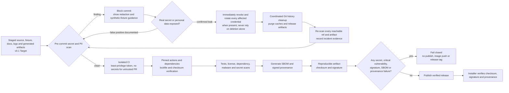

预提交与 CI 同时扫描真实简历、聊天、联系人、截图、Cookie、token、API key 和生成日志；fixture 只能使用不可反推用户的合成数据。发现已泄漏秘密时先撤销/轮换，再清理 Git 全历史、fork/缓存/制品与发布附件；历史改写不能替代轮换，清理后对全部 reachable refs 复扫并保留最小安全审计。

CI 对不可信 PR 不注入发布秘密，工作流 token 默认只读且按 job 临时提权；第三方 action 固定 commit digest，依赖与基础镜像固定并验证 checksum。Release 必须产出并校验 SBOM、签名、provenance 和制品 checksum；任何 secret 命中、critical 漏洞、来源不明、签名或 provenance 错误都失败关闭，不能用 warning、人工跳过或“稍后修复”继续发布。

## 部署和安全不变量

1. 默认只监听 loopback；任何远程暴露必须使用强认证、Origin/CSRF、防重放和安全 Cookie。
2. `workspaceId` 必须贯穿数据库、缓存、队列、outbox、文件、日志、AI task 和 Connector 请求，并在每个边界重新校验所有权。
3. DB、AuditIntent、Operation Ledger、Outbox、Authorization 或凭证服务不可用时，外部 mutation 失败关闭。
4. 外部内容、Connector 和 AI 都不能创建 Policy、Authorization/Token、ExternalOperation，不能直调 mutation adapter，也不能直接迁移领域状态。
5. 所有业务 mutation 与删除期 `credential_revocation` 都走统一 durable 协议；Notification、补偿和人工批准后的执行都没有 durable intent、授权、审计或 outbox 旁路。SafetySignal 是唯一独立、窄化的安全协议，也必须具备固定 Plan、窄化授权、durable Operation、AuditIntent、专用 Outbox、执行前复核与三态对账。
6. 在线备份必须一致且排除秘密；恢复、迁移和删除必须 gate mutation。恢复后先只读重绑与对账，再以新授权恢复 L2；L3 必须逐 capability 重新满足健康检查、显式确认与升级门槛，不得仅因配置或历史等级恢复执行权威。
7. 单一 Connector、账号或 capability 故障只造成局部降级；Workspace 级 STOP_OUTBOUND 与全局急停除外。
8. 所有发布物必须经过依赖、许可证、secret、PII、checksum、SBOM 和 provenance 检查。
9. 初始化和 migration 只有一个跨进程 owner；未知协议/schema、无法收紧的本地权限或密钥解密失败一律拒绝启动，不得按空实例或默认字段继续。
10. Connector mutation 必须经过 HTTPS/TLS 与每跳 redirect 复验、精确远端身份校验和账号级 token lineage；Calendar 条件写冲突绝不覆盖远端新版本。
11. 仅适用的同一业务主体互斥动作以 subject/action key 与 stateVersion/CAS 决定唯一胜者，CAS 失败者不能留下 Authorization、Operation、Outbox 或远端副作用。
12. Secret/PII 检查同时存在于 pre-commit 与 CI；真实泄漏先撤权轮换再清理 Git 历史。critical 漏洞或制品签名、SBOM、provenance 校验失败时禁止发布。
13. Workspace 删除关闭业务 mutation 后，只能由独立 `REVOCATION_ONLY` 控制面和 Cleanup Executor 对冻结的固定账号执行 `credential_revocation`；业务 capability 永远不能获得该权限，Cleanup Executor 永远不能执行业务 kind，unknown 只对账。
