# RoleFox 组件、部署、安全与可靠性视图

- 状态：Review Draft
- 上级索引：[UML 设计基线](README.md)
- 建模原则：先如实描述 M0，再给出 v0.1 目标；未来托管形态不冒充当前承诺。
- 标注规则：节点中的 `M0` 是当前仓库事实，`v0.1 Target` 是尚未实现的目标；`<<proposed DEC-xx>>` 是待用户确认的产品选择。

## RF-UML-CMP-M0-01 当前 M0 真实组件

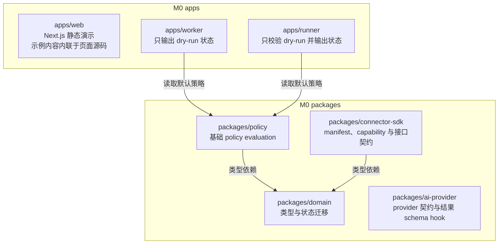

M0 没有 Core API、数据库、队列、Connector/AI 实现、审计、operation ledger、授权令牌发行器、Runner IPC、Exception Service 或 Interview Coordinator。Web 的合成内容是页面源码中的静态演示数据，不是 Worker/Runner 的运行时依赖；Worker 与 Runner 均不会访问外部系统。

## RF-UML-CMP-TARGET-01 v0.1 模块化单体目标

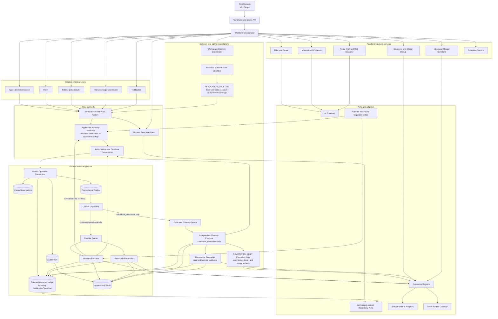

依赖方向固定为 `UI/API → Application Services → Domain/Policy → Ports ← Adapters`。Application Submission、Reply、Follow-up、Interview 和 Notification 都只能产生 mutation intent，并统一经过 `Plan → Policy → Authorization → atomic ExternalOperation/Reservation/AuditIntent/Outbox → Executor`；Notification 的每次主渠道与 fallback 外发也是独立 NotificationOperation。任何模块都不得直连队列或 adapter 绕过该路径。`<<proposed DEC-18>>` 决定 Kill Switch 下是否允许独立控制面白名单发送外部安全通知；确认前产品内 Inbox 可写，但外部通知失败关闭。

Workspace 删除先关闭业务 mutation gate，再启用与 AutomationPolicy/CapabilityGrant 隔离的 `REVOCATION_ONLY` 安全控制面。它只为删除请求快照中的固定 connector/account/credential lineage 生成 `credential_revocation` 计划，并仍走同一 Plan/Auth/Operation/AuditIntent/Outbox 协议。Dispatcher 把该唯一 kind 路由到独立 Cleanup Queue/Executor；Business Executor 拒绝它，Cleanup Executor 则拒绝全部业务 kind。撤销结果未知时 Cleanup Reconciler 只读对账，不能盲重试或重新开放业务外发。

## RF-UML-CMP-EXT-01 Connector 与 Provider 插件边界

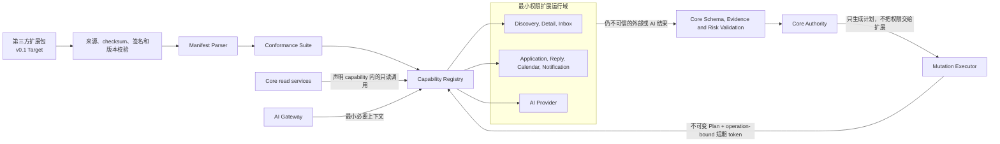

扩展 manifest 是能力声明，不是授权。空 allowlist 表示全部禁止；新增权限、条款、runtime 或 mutation 语义必须使旧授权失效并展示 Diff。Connector/Provider 不能签发 Authorization、创建 durable operation 或直接迁移领域状态。

## RF-UML-DEP-M0-01 当前 M0 部署

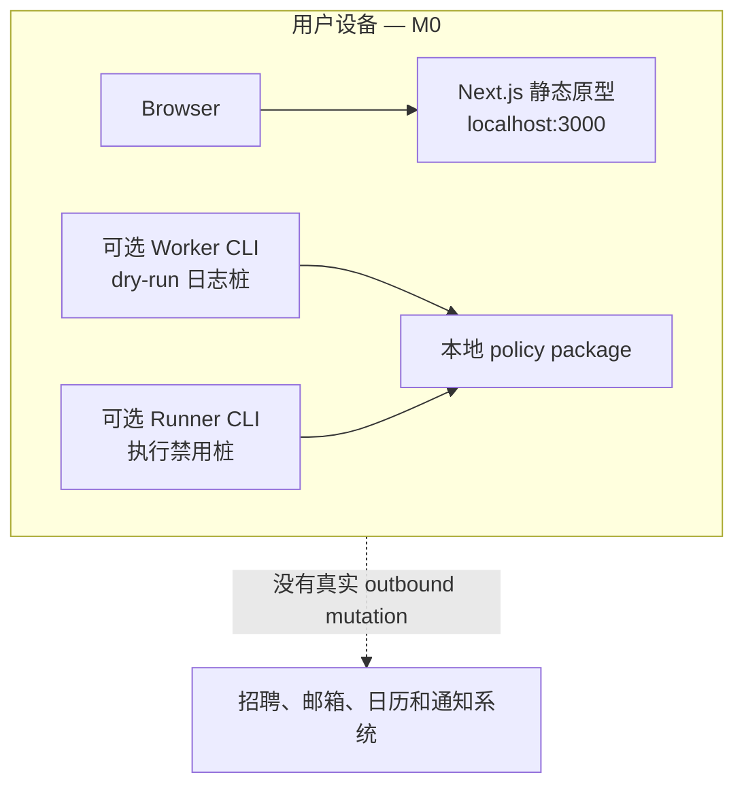

`pnpm dev` 当前只提供 Web 原型；Worker/Runner 是独立安全桩，没有任务、IPC 或外部调用。页面示例内容内联在 Web 源码中，图中故意不建立虚构的 Synthetic 服务依赖。

## RF-UML-DEP-LOCAL-01 v0.1 本地单用户部署

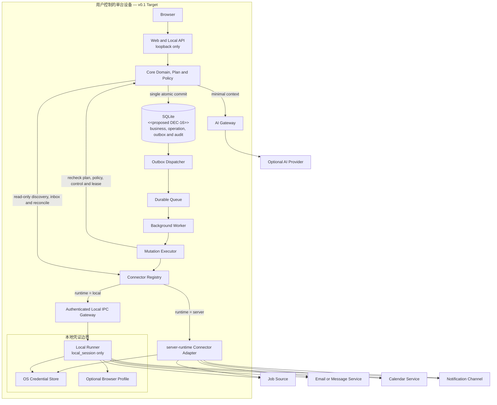

浏览器只访问 loopback Web/API，不能直连 Runner。Worker 只消费 durable queue，Executor 只能经 Registry 按 manifest runtime 分派：`server` adapter 在受控进程执行，`local_session` 必须进入 Runner 凭证边界。Core 和 Worker 不持有可复用 Cookie/Profile，也不直接调用外部 mutation。设备离线期间停止运行，恢复后先补采集、对账未知操作，再恢复新动作。SQLite 作为 v0.1 正式持久化实现仍是 `<<proposed DEC-16>>`；决策接受前该节点只是目标候选，不能被描述成已锁定技术栈。

## RF-UML-DEP-HOSTED-01 未来托管分离模式

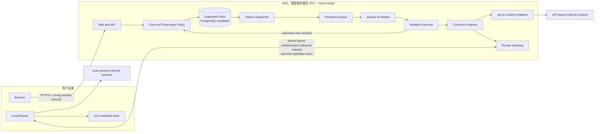

这是 `<<proposed DEC-16>>` 的未来兼容视图，不是 v0.1 当前承诺；托管范围、支持数据库与运维责任仍待确认。Browser 与 Runner 没有直接连接。服务端只把绑定 plan/operation/hash/kind/account/version/expiry 的一次性执行令牌交给 Runner，不传递或索取可复用 Cookie。新主机或恢复实例默认 `STOP_OUTBOUND`，凭证、token 和 L3 活跃授权不能随数据库自动恢复。恢复到 L2 后再逐 capability 重开 L3 只是 `<<proposed DEC-19>>` 建议；决策未接受时保持全部 outbound mutation 关闭，不自动恢复任何等级的外发。

## RF-UML-SEC-BOUNDARY-01 信任、Workspace 与最小数据边界

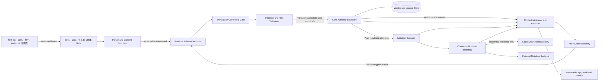

信任跃迁只在明确校验后发生：外部字节到受限解析数据、未知数据到 schema 合法值、合法值到 Workspace 所有权验证、草稿到 Evidence/风险绑定的 ActionPlan、计划到期限内 Authorization、远端响应到可对账证据。`workspaceId` 必须进入数据库键、缓存键、queue payload、文件路径、AI task、connector request 和日志关联字段；任何入口都不能信任调用者仅在查询条件中提供的 workspace。AI、日志和诊断只得到完成任务所需的最小字段。Core 不接触可复用凭证。

## RF-UML-SEC-CRED-01 凭证、令牌、导出、备份与恢复隔离

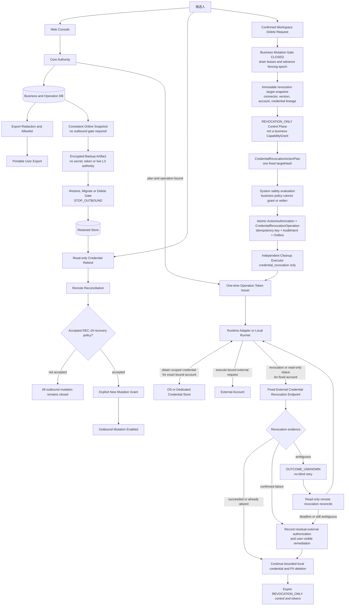

凭证、Cookie、浏览器 Profile、refresh token 和一次性执行 token 不进入业务库、日志、普通导出或备份。令牌至少绑定 `workspace + plan + operation + payloadHash + kind + connector + account + connectorVersion + expiry`，不能持久复用；陈旧 UI、页面文本、connector 自报字段或队列消息都不是授权。

Vault 只向已校验绑定的 Runner/runtime adapter 提供 scoped credential；它不与 External Account 建立网络连接。Runner 使用该凭证执行绑定请求，Core、DB 和一次性 token 中只保存 credential reference 与不可变账号绑定。
在线备份使用一致性快照，不需要暂停正常 mutation；若无法保证一致性则备份失败关闭。Restore、跨主机 migrate 和 workspace delete 必须先进入 `STOP_OUTBOUND` 并排空/冻结执行租约。恢复后即使保留策略历史，也不恢复凭证、token 或 L3 活跃权威：用户先以最小只读权限重新绑定 connector，完成所有未决 operation 的远端对账。后续恢复等级属于 `<<proposed DEC-19>>`；只有该决策被接受并产生全新的 capability grant/authorization 后才能外发，未确认时全部 outbound mutation 持续关闭。

删除期间的 `REVOCATION_ONLY` 是独立、窄化且限时的系统安全控制面，不是解除 STOP_OUTBOUND，也不属于 `DRY_RUN / L2_CALIBRATION / L3_LIMITED` 或任一业务 CapabilityGrant。它只能对删除请求开始时冻结的固定目标执行 `credential_revocation`；每个目标仍需不可变 Plan、系统安全评估、绑定 Authorization、durable Operation、AuditIntent 与 Outbox，并由独立 Cleanup Executor 消费。Executor 对 kind、deletionRequestId、workspace、connector/version、account、credential lineage、targetHash、token audience 与 expiry 任一不符都失败关闭。

明确成功或“远端已不存在”才收敛为成功；超时、断线和歧义进入 `OUTCOME_UNKNOWN`，只允许读取远端授权状态进行对账。外部服务持续失败时记录 residual authorization 和人工处置说明，但到达删除流程的明确期限后仍继续本地凭证与 PII 删除；随后销毁 REVOCATION_ONLY 控制、未使用 token 和目标快照中的敏感引用。

## RF-UML-REL-MUT-01 外部 mutation 统一可靠性协议

```mermaid
%% @anchor MUTATION_PROTOCOL
%% @anchor QUE_013_APPLICATION_ACTION_CAS
flowchart LR
    Draft["Validated Mutation Intent"] --> Plan["Immutable ActionPlan"]
    Plan --> Evaluate{"Applicable Authority Decision<br/>business three-layer or REVOCATION_ONLY safety"}
    Evaluate -->|"deny or preview_only"| NoOp["No Operation Created"]
    Evaluate -->|"require approval"| Approval["Await Human Approval"]
    Approval -->|"same payload approved"| Reevaluate["Re-evaluate current safety, policy and control"]
    Reevaluate -->|"not allowed"| NoOp
    Reevaluate -->|"allowed"| AuthCandidate["Authorization Candidate<br/>bound to current plan and decision"]
    Evaluate -->|"allowed"| AuthCandidate

    subgraph AtomicTx["One atomic database transaction"]
        Commit{"Applicable subject/action mutex?<br/>if yes: expected subject stateVersion + CAS"}
        Conflict["CAS or mutex lost<br/>rollback entire transaction"]
        Authorization["Durable ActionAuthorization"]
        Operation["1..* ExternalOperation<br/>QUEUED"]
        Reservation["0..* UsageReservation<br/>RESERVED"]
        SlotReservation["0..1 InterviewSlotReservation<br/>RESERVED"]
        AuditIntent["AuditIntent"]
        Outbox["1..* OutboxEvent<br/>PENDING"]
        Commit -->|"not applicable or guard won"| Authorization
        Commit -->|"not applicable or guard won"| Operation
        Commit -->|"not applicable or guard won"| Reservation
        Commit -->|"not applicable or guard won"| SlotReservation
        Commit -->|"not applicable or guard won"| AuditIntent
        Commit -->|"not applicable or guard won"| Outbox
        Commit -->|"guard lost"| Conflict
        Authorization --> Operation
    end

    AuthCandidate --> Commit
    Conflict --> NoOp
    Outbox --> Dispatcher["Outbox Dispatcher"] --> KindRoute{"Validated operationKind"}
    KindRoute -->|"business kind"| Queue["Durable Business Queue"] --> Executor["Mutation Executor"] --> Lease["Acquire Lease and Fencing Token"]
    KindRoute -->|"credential_revocation"| CleanupQueue["Dedicated Cleanup Queue"] --> CleanupExecutor["Independent Cleanup Executor"] --> CleanupGate["REVOCATION_ONLY exact-target gate"] --> Lease
    Lease --> Recheck{"Execution-time Recheck<br/>authority, kind, target and subject stateVersion"}
    Recheck -->|"applicable authority denies, expired, stale or mismatched"| Cancel["No Remote Call<br/>Operation = CANCELLED"]
    Recheck -->|"valid"| Adapter["Specialized Runtime Adapter"] --> Remote["External Mutation"]
    Remote --> Result{"Three-way Result Classification"}
    Result -->|"evidence proves success"| Success["SUCCEEDED<br/>externalRef + consume reservation"]
    Result -->|"evidence proves no execution"| Failed["FAILED_CONFIRMED<br/>release reservation"]
    Result -->|"timeout, crash, disconnect or ambiguity"| Unknown["OUTCOME_UNKNOWN<br/>hold conservative reservation"]
    Unknown --> Reconcile["Read-only Remote Reconcile"]
    Reconcile -->|"unique success found"| Success
    Reconcile -->|"non-execution proved"| Failed
    Reconcile -->|"cannot decide uniquely"| Manual["Manual Review<br/>no automatic retry"]
    Cancel --> Release["Release Reservation"]
    Operation --> Audit["Append-only Outcome Audit"]
    Cancel --> Audit
    Success --> Audit
    Failed --> Audit
    Unknown --> Audit
    Manual --> Audit
```

该协议适用于投递、撤回、普通/跟进/面试确认回复、日历创建/更新/取消、主/备用通知和删除期凭证撤销。普通计划通常创建一个 operation 与一个 operation outbox；ScheduleInterviewActionPlan 在一个事务中持久化同一 Authorization、slot/quotas、calendarOp、replyOp、AuditIntent 和一个 Saga 启动作业。两个子 operation 都是 QUEUED，但 Saga Executor 必须在 calendar 成功证据事务落盘后才开始 reply，不能靠另一个未定义的 operation 状态表达依赖。事务 outbox 消除“数据库已记 operation 但任务未入队”或“任务已入队但 operation 未落库”的双写窗口；Dispatcher 可以重放，Executor 依靠 operation idempotency、lease 与 fencing 防止并发副作用。

Dispatcher 必须先验证封闭 OperationKind，再把业务 kind 与 `credential_revocation` 分流。后者只进入独立 Cleanup Queue/Executor，并在获取 lease 后再次验证 REVOCATION_ONLY、删除请求和固定目标；Business Executor 遇到该 kind、Cleanup Executor 遇到任一业务 kind，都必须 quarantine 且零外发。

执行前必须重新校验 Workspace、ActionPlan hash 与 stale 状态、Authorization、适用权威（业务三层策略或删除期 REVOCATION_ONLY 安全控制）、operation kind/target、quota reservation、connector/runtime/account/version、credential health 和 control/fencing。`paused` / `killed` 由业务三层权威拒绝业务 kind，但不能越权否决仍有效的删除期 `REVOCATION_ONLY`；后者只能由删除期限、固定目标绑定或自身安全控制失效来拒绝。只有可验证的远端证据才能把 operation 置为 SUCCEEDED 或 FAILED_CONFIRMED；`OUTCOME_UNKNOWN` 在只读对账完成前禁止自动重试。

仅当 mutation 关联权威业务主体且其 action kind 属于该主体声明的互斥集合时，才使用持久 subject/action key 与 expected subject stateVersion；例如同一 Application 的投递/撤回、同一 Thread 的旧回复/新回复、同一 Interview 的取消/确认。事务内 CAS 只有一个胜者能创建 Authorization、Operation 和 Outbox，失败者整笔回滚且零副作用。没有主体或不存在互斥关系的动作不强加 Application mutex，但仍执行各自聚合版本与幂等校验。排队后主体状态再次变化时，execution-time recheck 把旧 operation 置为 CANCELLED，不能凭早先授权覆盖新状态。

## RF-UML-REL-SAGA-01 自动约面复合操作与补偿

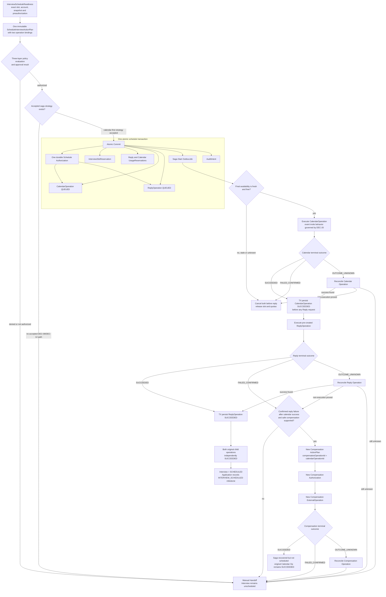

Calendar 与 Reply 是同一 ScheduleInterviewActionPlan、同一 ActionAuthorization 下的两个 durable child operation，但各自拥有 idempotency key、payload hash、externalRef、lease、结果和对账状态。它们与 Compensation 都执行 RF-UML-REL-MUT-01；Compensation 使用全新的计划、授权和操作。Saga 只汇总事实：成功子操作保持 SUCCEEDED，不因另一子操作失败或补偿成功而被改写；图中没有回边重新执行已成功步骤。

`<<proposed DEC-08>>`：是否采用 calendar-first 及异常时的人机交接策略仍待确认。若接受，Calendar 成功与 externalRef 必须先事务落盘，同一个 Saga Executor 才能开始预创建的 ReplyOperation。`<<proposed DEC-12>>`：自动取消日历是否为必选 connector 补偿能力仍待确认。`<<proposed DEC-20>>`：日历事件是否邀请招聘方并触发平台通知仍待确认。三项未接受前，自动约面只能停在人工确认；不能悄悄选择执行顺序、自动撤销或 attendee 行为。只有两个**原始**子操作均有明确成功证据时，Interview 才进入 `SCHEDULED`，Application 只记录 `INTERVIEW_SCHEDULED` milestone。

## RF-UML-REL-BOOT-01 初始化、协议版本与本地文件启动门

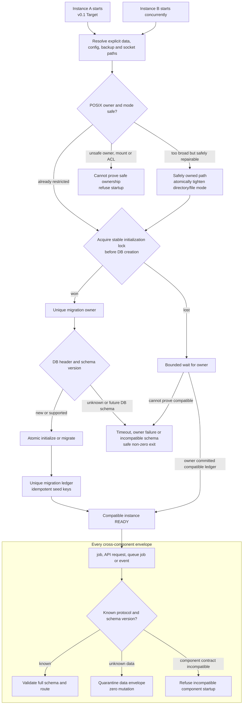

初始化锁位于确定的数据目录，必须先于数据库文件与 seed 创建；migration ledger 同时使用数据库唯一约束，避免仅依赖进程内 mutex。竞争实例只能有界等待并在验证最终 schema/ledger 后启动，否则安全退出。Owner 崩溃后，新实例只能在确认事务未提交或租约可接管后继续，不能并发重放非幂等 migration。

启动时检查数据目录、DB、backup、credential、配置与 IPC/socket 的所有者、POSIX mode、ACL 和容器 UID/GID。仅当路径由当前可信主体拥有且没有链接/挂载竞态时才自动收紧；否则拒绝启动。新文件以限制性 mode 原子创建，不能“先宽后 chmod”。所有 job/API/event 都带显式 protocol/schema version；未知数据进入 quarantine，未知 DB 或组件协议拒绝启动，绝不使用默认字段执行 mutation。

## RF-UML-SEC-KEY-01 加密密钥轮换与崩溃恢复

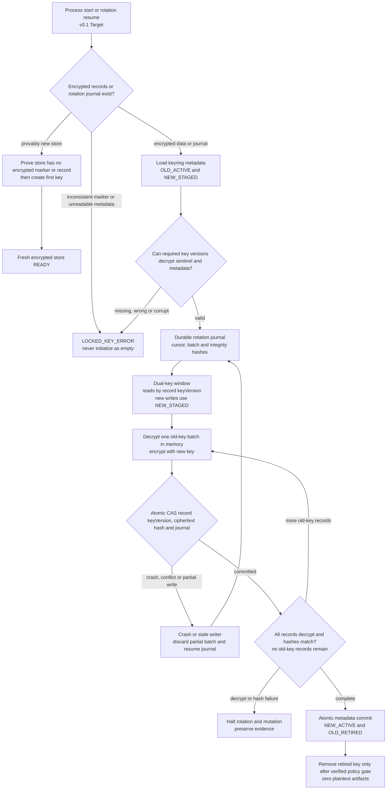

每条密文保存 `keyVersion` 与完整性元数据，轮换状态和批次游标先于批处理 durable 落盘。进程可在 OLD/NEW 双 key 窗口中恢复读取，但任何解密、sentinel 或 hash 失败都进入锁定/人工恢复，不能把已有数据误判为空 Workspace 并覆盖。每批只在内存中短暂持有明文，CAS 失败丢弃后重读；全量验证完成前旧 key 不退休，备份仍不包含任何解密 key。

## RF-UML-SEC-EXT-01 Connector 身份、Token、TLS 与条件写安全门

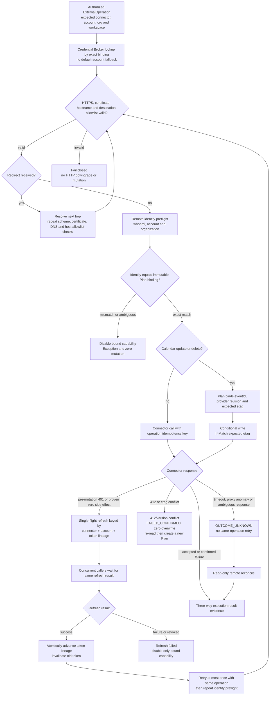

远端 identity preflight 是 mutation 的执行时门禁，必须验证账号、组织/租户和 Workspace 绑定；不一致、缺字段或多义结果都拒绝，Connector 不能回退到 SDK 默认账号、最近登录账号或其他 Workspace 凭据。

Token refresh 以 connector、账号和 token lineage 为 single-flight key；并发 401 的 follower 复用同一刷新结果。只有 401 发生在 mutation 请求发出前，或远端协议能证明该请求产生了零副作用，刷新成功后才允许同一 operation 有界重试一次，并重新执行 TLS 与 identity preflight。超时、代理异常、连接中断、非标准 401 或任何副作用歧义都进入 `OUTCOME_UNKNOWN` 并只读对账，禁止借 refresh 直接重发。刷新失败只关闭该账号的 capability，禁止搜索或串用其他账号 token。

所有 Connector/AI 网络请求强制 HTTPS 并验证证书链、hostname、DNS/IP 策略和目标 allowlist；每次 redirect 都把新 URL 当作新目的地完整复验，任何一步失败都不降级明文。Calendar update/delete 必须把读取到的 etag/version 固化进新 Plan 并使用 `If-Match`；412 或版本冲突证明本次未写入，生成 Exception，绝不 blind retry 或覆盖用户手工修改。

## RF-UML-SEC-SUPPLY-01 Secret 泄漏响应与发布供应链门禁

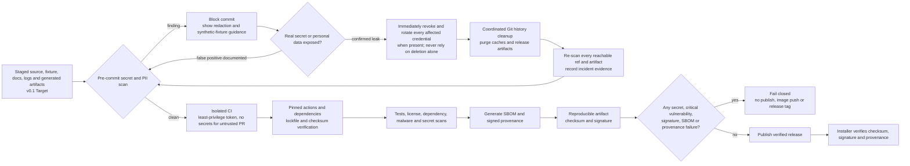

预提交与 CI 同时扫描真实简历、聊天、联系人、截图、Cookie、token、API key 和生成日志；fixture 只能使用不可反推用户的合成数据。发现已泄漏秘密时先撤销/轮换，再清理 Git 全历史、fork/缓存/制品与发布附件；历史改写不能替代轮换，清理后对全部 reachable refs 复扫并保留最小安全审计。

CI 对不可信 PR 不注入发布秘密，工作流 token 默认只读且按 job 临时提权；第三方 action 固定 commit digest，依赖与基础镜像固定并验证 checksum。Release 必须产出并校验 SBOM、签名、provenance 和制品 checksum；任何 secret 命中、critical 漏洞、来源不明、签名或 provenance 错误都失败关闭，不能用 warning、人工跳过或“稍后修复”继续发布。

## 部署和安全不变量

1. 默认只监听 loopback；任何远程暴露必须使用强认证、Origin/CSRF、防重放和安全 Cookie。
2. `workspaceId` 必须贯穿数据库、缓存、队列、outbox、文件、日志、AI task 和 Connector 请求，并在每个边界重新校验所有权。
3. DB、AuditIntent、Operation Ledger、Outbox、Authorization 或凭证服务不可用时，外部 mutation 失败关闭。
4. 外部内容、Connector 和 AI 都不能创建 Policy、Authorization/Token、ExternalOperation，不能直调 mutation adapter，也不能直接迁移领域状态。
5. 所有 mutation 都走同一 durable 协议；Notification、补偿、人工批准后的执行和删除期 credential revocation 都没有 durable intent、授权、审计或 outbox 旁路。
6. 在线备份必须一致且排除秘密；恢复、迁移和删除必须 gate mutation。恢复后先只读重绑与对账；`DEC-19` 未接受时全部 outbound mutation 保持关闭，不得仅因配置或历史等级恢复而签发执行授权。
7. 单一 Connector、账号或 capability 故障只造成局部降级；Workspace 级 STOP_OUTBOUND 与全局急停除外。
8. 所有发布物必须经过依赖、许可证、secret、PII、checksum、SBOM 和 provenance 检查。
9. 初始化和 migration 只有一个跨进程 owner；未知协议/schema、无法收紧的本地权限或密钥解密失败一律拒绝启动，不得按空实例或默认字段继续。
10. Connector mutation 必须经过 HTTPS/TLS 与每跳 redirect 复验、精确远端身份校验和账号级 token lineage；Calendar 条件写冲突绝不覆盖远端新版本。
11. 仅适用的同一业务主体互斥动作以 subject/action key 与 stateVersion/CAS 决定唯一胜者，CAS 失败者不能留下 Authorization、Operation、Outbox 或远端副作用。
12. Secret/PII 检查同时存在于 pre-commit 与 CI；真实泄漏先撤权轮换再清理 Git 历史。critical 漏洞或制品签名、SBOM、provenance 校验失败时禁止发布。
13. Workspace 删除关闭业务 mutation 后，只能由独立 `REVOCATION_ONLY` 控制面和 Cleanup Executor 对冻结的固定账号执行 `credential_revocation`；业务 capability 永远不能获得该权限，Cleanup Executor 永远不能执行业务 kind，unknown 只对账。
