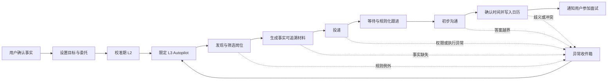

# RoleFox v0.1 用户体验与信息架构

## 1. 体验目标

稳定态的 RoleFox 不是“岗位列表 + 审批中心”，而是：

> **Autopilot 正常运行；正常动作已经自动完成；这里只显示规则例外和已经确认的面试。**

产品应尽量减少用户回访频率，而不是用通知、红点和待办制造参与度。岗位、材料、ActionPlan 和审计都可以查看，但正常情况下不要求用户操作。

## 2. 服务蓝图



用户主要参与左侧首次配置、异常分支和最终面试；主干执行由系统承担。

## 3. 四条核心用户旅程

### 3.1 Day 0：首次配置

目标：应用已经运行后，用户在 20 分钟内建立一个可执行的 L2 校准工作区。

```text
欢迎与隐私说明
→ 导入简历或手动填写
→ 核对事实证据
→ 创建一个求职计划
→ 设置委托边界
→ 连接岗位源、邮箱、日历和通知
→ 用合成岗位运行 Dry-run
→ 开始 L2 校准
```

#### 步骤要求

1. 首屏提供“体验合成 Demo”和“配置我的工作区”两个入口。
2. 简历解析结果按事实卡展示，用户可标记：
   - 已确认且允许对外使用；
   - 内容正确但不允许对外使用；
   - 待确认或需要修改。
3. 求职计划先收集硬条件，再收集偏好：
   - 目标岗位；
   - 地点与远程方式；
   - 最低薪资和币种；
   - 雇佣类型；
   - 必须排除的行业、公司或关键词；
   - 评分阈值与每日上限。
4. 委托配置按能力拆分，不提供含义模糊的“全部自动”开关。
5. 每个连接器在授权前说明读取什么、写入什么、凭证保存在哪里、断开后影响哪些能力。
6. Dry-run 用 2–3 个合成岗位展示：为什么过滤、会生成什么、哪些动作会询问用户。
7. 完成按钮为“开始校准”，不是“开启全自动”。

#### 中断与恢复

- 每一步自动保存，用户可以稍后继续。
- 非必要连接器允许跳过；CSV、JSON 和手动链接足以完成首次体验。
- 解析失败时保留原始文件并允许手动补充，不要求重新开始。
- 用户必须先确认关键事实，才能生成外发材料。

### 3.2 日常自治

目标：正常情况下用户无需打开 RoleFox。

```text
后台发现岗位
→ 去重和硬过滤
→ 评分与材料生成
→ 策略授权
→ 投递
→ 等待与跟进
→ 初聊
→ 自动约面
→ 通知用户
```

用户偶尔打开概览时只需要回答四个问题：

1. Autopilot 是否正常运行？
2. 最近自动完成了什么？
3. 是否有必须由我处理的异常？
4. 是否新增已确认面试？

连接器局部故障时显示“降级运行”：明确暂停了哪个来源、哪些流程仍继续。单个来源失效不应默认暂停整个 Campaign。

### 3.3 异常处理

目标：一次回答解决一个例外，随后系统自动恢复受影响流程。

```text
收到异常
→ 阅读一个明确问题
→ 查看证据、影响与系统建议
→ 仅本次处理 / 更新委托规则 / 跳过
→ 预览规则影响范围
→ 恢复当前申请
```

#### 异常详情必须包含

- 为什么此时打扰用户；
- 涉及的公司、岗位、消息或面试；
- 原始信息、来源与时间；
- RoleFox 的建议、依据和置信度；
- 不处理的后果与截止时间；
- 有限且互斥的处理选项；
- 哪些其他任务不会受影响。

#### 标准决策

- 只处理这一次；
- 以后本 Campaign 都按此规则；
- 跳过该岗位；
- 暂停此类动作；
- 暂停整个 Autopilot。

更新策略时展示策略 diff、范围、有效期、每日上限和新增风险，生成新版本并保留旧版本。恢复时只恢复关联申请。

#### Exception 领域对象

`Exception` 应成为一等对象，至少包含：

- 类别、严重度、状态和截止时间；
- 关联 Application、ActionPlan 和消息；
- 待回答问题；
- 证据与原始来源；
- 推荐解决方式与可选动作；
- 解决后恢复哪一步；
- 是否产生新的策略版本。

### 3.4 面试通知

只有申请从 `INTERVIEW_PROPOSED` 真正进入 `SCHEDULED` 后，才能发送“已约成面试”。

通知卡必须直接展示：

- 公司与岗位；
- 双方已确认的日期、时间和时区；
- 线上或线下形式、地点或会议链接；
- 联系人和确认消息来源；
- 日历写入状态；
- 本次使用的简历版本；
- 岗位摘要、沟通历史和准备包；
- “需要改期”入口。

默认主操作是“查看准备包”，不是“接受面试”。如果时间尚未双方确认、日历写入失败或存在冲突，应生成异常，而不是成功通知。

## 4. 信息架构

### 一级导航

1. **概览**：Autopilot 状态、最近完成、异常和面试。
2. **求职计划**：目标、规则、渠道、岗位与申请漏斗。
3. **异常**：唯一需要日常人工处理的区域，显示 badge。
4. **面试**：已确认、改期、取消、完成和准备包。
5. **活动记录**：动作、授权来源、证据和执行结果。

### 二级设置

- 资料与证据
- 委托规则与安全
- 连接器
- 通知
- 数据、备份与隐私
- 全局急停

“岗位雷达”和“材料”属于求职计划详情，不作为稳定态一级导航；“审批中心”只存在于 L2 校准语境，不作为长期产品概念。

## 5. 关键页面规格

| 页面 | 核心对象 | 首屏必须回答 | 主操作 |
| --- | --- | --- | --- |
| 概览 | Campaign、Autopilot、Exception、Interview、Activity | 是否正常、做了什么、是否需处理、约到什么 | 处理最高优先级异常或查看面试 |
| 求职计划 | SearchCampaign、AutomationPolicy、Connector | 目标是什么、授权到哪里、当前推进多少 | 暂停、调整或查看申请 |
| 岗位/申请详情 | JobPosting、JobScore、Application、Material | 为什么处理或跳过、目前阶段、下一动作 | 查看依据；必要时调整本次处理 |
| 异常列表 | Exception | 哪些真的需要我、何时到期 | 打开最高优先级异常 |
| 异常详情 | Exception、ActionPlan、Evidence、PolicyDecision | 一个明确问题、影响、依据和建议 | 一次处理或更新规则 |
| 面试列表 | Interview | 哪些已经确认、哪些发生变化 | 查看准备包 |
| 面试详情 | Interview、CalendarEvidence、Application | 时间地点是否确认、上下文是什么 | 查看准备包或发起改期 |
| 活动记录 | ActionPlan、ActionAuthorization、ExecutionResult | 系统做了什么、为何获授权、结果如何 | 查看完整审计 |
| 资料与证据 | CandidateProfile、ProfileEvidence | 哪些事实可以对外使用 | 确认、修改或禁用事实 |
| 委托规则 | Policy、AnswerPreauthorization、SchedulePreauthorization | 允许什么、上限多少、何时失效 | 发布新版本或回退 |
| 连接器 | Manifest、Permission、Health | 有什么能力、健康与权限如何 | 连接、验证或断开 |

## 6. 页面状态

| 页面 | 空状态 | 错误或降级状态 | 风险状态 |
| --- | --- | --- | --- |
| 概览 | 尚无计划，进入首次配置 | 展示受影响范围，保留上次成功数据 | Autopilot 暂停、策略过期、急停 |
| 求职计划 | 创建第一个 Campaign | 单一来源失败，其他来源继续 | 规则过宽、阈值过低、无白名单 |
| 异常 | “暂无需你处理，RoleFox 正常运行” | 上下文不完整时禁止盲目决策 | 临近截止、账号验证、法律或身份问题 |
| 面试 | “尚无已确认面试，Autopilot 仍在工作” | 日历或消息源失联 | 时区歧义、冲突、改期或取消 |
| 活动记录 | 尚未执行动作 | 审计写入失败则暂停相关外部动作 | 未授权、重复、载荷变化、结果不确定 |
| 连接器 | 尚未连接，可先用开放导入 | 认证过期、限流、能力缺失 | 权限过大、条款未知、平台挑战 |

通用规则：

- 加载时保留已有数据，不用整页 spinner 覆盖结果。
- 系统错误先自动重试；持续失败或需要用户动作时才生成异常。
- 外部结果不确定时不得标记成功。
- 所有风险状态说明“哪些任务暂停、哪些仍继续”。
- 全局“暂停 Autopilot”始终可见且可以恢复。

## 7. 通知策略

| 等级 | 场景 | 方式 |
| --- | --- | --- |
| P0 | 凭证或账号风险、疑似越权、全局暂停 | 立即通知，相关执行停止 |
| P1 | 有截止时间的异常、面试冲突、已确认面试 | 立即通知 |
| P2 | 需要补充但不紧急 | 每日汇总 |
| P3 | 正常发现、过滤、投递、等待和跟进 | 不即时通知，只写活动记录 |

默认不发送“又发现一个岗位”“又完成一次投递”等参与度通知。

## 8. L2 到 L3 的迁移体验

### L3 就绪清单

- 关键履历事实已确认；
- 求职硬条件和排除项完整；
- 连接器权限与健康检查通过；
- 白名单、限额和授权期限非空；
- 校准样本没有未解决的事实错误；
- 可自动回答内容有证据和边界；
- 日历账户、时区、窗口和通知已验证；
- 急停、撤销和回滚入口可用。

### 开启方式

按能力分别授权：

1. 自动发现与评分；
2. 自动生成材料；
3. 自动投递；
4. 自动跟进和低风险回复；
5. 自动约面。

按钮使用“开启限定自动运行”，不使用“完全自动”。首批 L3 动作进入每日摘要；异常率上升时只回退对应能力。

## 9. 文案原则

- 用“已确认”“正在核对”“需要你决定”描述真实状态，不使用含糊的“AI 已处理”。
- 每个异常只问一个问题。
- 先说为什么打扰，再给证据和选项。
- 明确区分“建议”“已授权”“已执行”“外部已确认”。
- 不用投递数量制造成功感；优先展示节省的主动操作和已确认面试。
